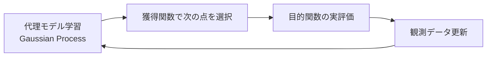

# ベイズ最適化(Bayesian Optimization)

## 1. 概要

### A. 定義
> 評価コストが大きく微分不可能な**ブラックボックス目的関数** $f(x)$ を、これまでの観測を確率的に要約した**代理モデル(Surrogate)**と、次にどこを評価するかを決める**獲得関数(Acquisition Function)**を反復的に更新することで、**少数の試行だけで最適点を探索**する逐次最適化手法である。

ベイズ最適化の核心的な発想は、「目的関数そのものを直接扱う代わりに、目的関数がどのような形をしているかについての**信念(事後分布)**をモデル化し、観測が蓄積されるたびにベイズの定理でその信念を更新」することである。すなわち最適化問題を、「次の一点をどこで評価するのが最も得か」という**意思決定問題**に置き換える。関数値を一度得ることが高価であるため、各試行を可能な限り情報価値の高い地点に使うことが目標となる。

### B. 登場背景および必要性
ディープラーニングのハイパーパラメータチューニング、新薬・材料実験、工程最適化のように、**1回の評価に数時間のGPU学習や実際の実験**を要する問題が増えるにつれ、数千〜数万回の評価を前提とするグリッド・ランダム探索や勾配ベースの最適化は現実性を失った。グリッド探索は次元が増えると組み合わせが指数的に爆発し、ランダム探索は過去の観測を学習に活用できず同じ失敗を繰り返す。ベイズ最適化は**過去の観測を代理モデルに累積学習**して有望な領域に試行を集中させるため、通常は数十回以内の評価で競争力のある解に到達する。さらに各予測の**不確実性まで定量化**し、「まだ訪れていない場所」と「良さそうな場所」を原理的に比較衡量できる点が決定的な長所である。

## 2. 動作原理

1サイクルは次のように回る。まずこれまでの観測 $\{(x_i, y_i)\}$ で代理モデルを学習し、未評価の地点 $x$ ごとに予測平均 $\mu(x)$ と不確実性 $\sigma(x)$ を得る。次に獲得関数がこの二つの値を結合し、「最も評価する価値が大きい」地点 $x_{next}$ を選ぶ。その地点で実際の目的関数をちょうど1回評価し、結果を観測に追加した後、再び代理モデルを更新する。この過程を予算(評価回数)が尽きるか改善が停滞するまで繰り返す。

| 順序 | 内容 | 成果物 |
|---|---|---|
| 1 | 観測データで**代理モデル**(主にGP)を学習 | 各地点の $\mu(x),\ \sigma(x)$ |
| 2 | **獲得関数**で次の評価地点を決定(探索・活用のバランス) | $x_{next}$ |
| 3 | 目的関数の実評価(高価な演算) | $y_{next}=f(x_{next})$ |
| 4 | 観測を追加して1へ戻り反復 → 収束 | 更新された事後分布 |

この構造がなぜ効率的なのかというと、「**代理モデルが安価な近似関数の役割を果たすから**」である。高価な真の関数は最小回数だけ呼び出し、実際の探索・比較は安価な代理モデル上で行うため、総コストが大きく削減される。

## 3. 中核構成要素

### A. 代理モデル(Surrogate Model)
代理モデルは観測に基づいて目的関数の事後分布を推定する。最も広く使われるのは**ガウス過程(GP)**であり、任意の地点集合における関数値が多変量正規分布に従うと仮定する。GPの強みは、予測を点推定ではなく**平均と分散(信頼区間)**で与えるため、「観測のない領域ほど分散が大きい」という性質を自然に表現できる点にある。この分散が、後述する探索を誘導する根拠となる。ただしGPはカーネル行列の逆行列演算のために観測数 $n$ に対して $O(n^3)$ と高価になるため、高次元・大量観測では**TPE(Tree-structured Parzen Estimator)**やランダムフォレストベースの代理モデル(SMAC)で代替することもある。

### B. 獲得関数(Acquisition Function)
獲得関数は代理モデルの $\mu,\ \sigma$ を一つのスコアにまとめて次の評価地点を決める。代表的には、**EI(Expected Improvement、期待改善量)**は現在の最適値に対する改善の期待値を最大化し、**UCB(Upper Confidence Bound)**は $\mu(x)+\kappa\,\sigma(x)$ のように平均に不確実性の重みを加えて楽観的に選ぶ。**PI(改善確率)**は改善が起こる確率のみを見る。これらはいずれも「良さそうな $\mu$」と「未踏の $\sigma$」をどの比率で混ぜるかが異なるだけで、本質的には探索-活用の天秤の異なる設定である。

| 要素 | 説明 | 代表例 |
|---|---|---|
| **代理モデル(Surrogate)** | 関数の分布を確率的に近似し、不確実性を提供 | GP・TPE・ランダムフォレスト |
| **獲得関数** | $\mu,\sigma$ を結合して次の点を選択 | EI・PI・UCB |
| **探索 vs 活用** | 不確実な領域の探索 ↔ 有望な領域への集中 | $\kappa,\ \xi$ で調整 |

### C. 探索(Exploration)と活用(Exploitation)のバランス
ベイズ最適化の成否はこのバランスにかかっている。**活用**だけを行う(=$\mu$ の大きい所のみ)と、序盤に偶然良かった局所最適に閉じ込められ、**探索**だけを行う(=$\sigma$ の大きい所のみ)とランダム探索と変わらなくなる。例えばUCBの $\kappa$ を大きくすれば探索が、小さくすれば活用が強まる。良い獲得関数は、序盤には広く探索し、観測が蓄積して不確実性が減ると自然に活用へ移るよう、この天秤を**自動的に**傾ける。

## 4. 長所と短所

| 長所 | 理由 | 短所 | 理由 |
|---|---|---|---|
| 少ない評価で最適点を探索 | 過去の観測を代理モデルに累積活用 | 高次元で性能低下 | 空間が大きくなりGP近似・探索の難度↑ |
| 微分不要(ブラックボックスに対応) | 関数値さえあればよい | GPの計算量 $O(n^3)$ | カーネル逆行列の演算コスト |
| 不確実性の定量化 | GPが分散を提供 | 並列化が相対的に困難 | 本質的に逐次的な意思決定 |

例えば20次元のハイパーパラメータ空間では、観測が有効な空間を密に覆うことが難しく性能が落ちるが、この場合は次元削減・部分空間探索(REMBO)やTPE・BOHBで補完する。逐次性の問題は、一度に複数の候補を選ぶ**バッチベイズ最適化**で緩和する。

## 5. 考慮事項および示唆点
- **AutoML・ハイパーパラメータ最適化の事実上の標準**: Optuna・Hyperopt・Ray TuneなどがTPE・BOHBを内蔵している。ランダム探索と比べて同じ性能に到達するまでの試行回数を明確に減らし、高価なGPU予算を節約する。
- **高次元への対応戦略**: 次元削減、TPE、早期終了を組み合わせた**BOHB(Hyperband+BO)**により、「安価な低解像度評価で候補を素早くふるい落とし、有望な候補のみを精密評価する」という折衷を取る。
- **実験計画(DOE)への拡張**: A/Bテスト、新素材・触媒探索、半導体工程レシピ最適化のように、実際の実験1回が非常に高価なドメインで試行回数削減の効果が大きい。
- **トレードオフ**: 代理モデル・獲得関数自体を計算・チューニングするオーバーヘッドがあるため、目的関数の評価が十分に高価な場合(数分以上)に利得が明確であり、安価な関数であればランダム・グリッドの方が優れている場合もある。

---

> **一言まとめ**: ベイズ最適化は*代理モデル(GP)で目的関数の事後分布を、獲得関数(EI・UCB)で次の評価点を*定め、探索-活用をバランスよく調整して**少数の試行で高価なブラックボックス関数の最適点**を見つける手法であり、ハイパーパラメータチューニング・AutoML・実験計画に広く用いられるが、高次元ではTPE・BOHBなどで補完する。
