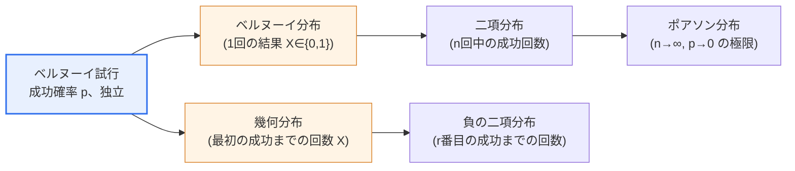
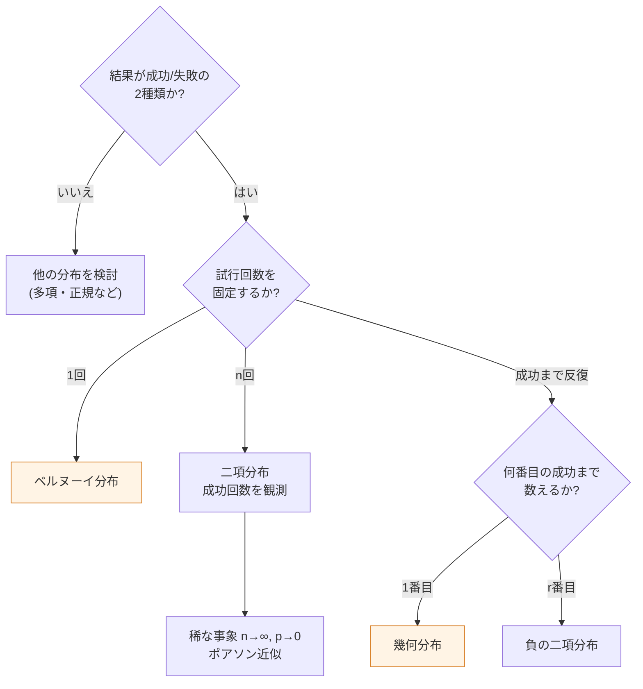

# ベルヌーイ分布と幾何分布

## 1. 概要

### A. 定義
> **ベルヌーイ分布(Bernoulli distribution)**は、成功/失敗の二つの結果のみを持つ**ただ1回の試行**に関する離散確率分布であり、**幾何分布(Geometric distribution)**は、成功確率pのベルヌーイ試行を繰り返すときに**最初の成功が出るまでにかかった試行回数**に関する離散確率分布である。

二つの分布はいずれも「**ベルヌーイ試行(Bernoulli trial)**」から出発する。ベルヌーイ試行とは、① 結果が成功・失敗の2種類のみであり、② 各試行の成功確率pが一定で、③ 試行同士が互いに独立である確率実験をいう。コイン投げ、製品の良品・不良品判定、広告のクリック有無のように「はい/いいえ」で答えられる現象は、すべてベルヌーイ試行とみなすことができる。この共通の土台の上で、**「何を確率変数として観測するか」**が二つの分布を分ける。

ベルヌーイ分布は、「コインを1回投げたときに表か」のように**1回の試行の結果そのもの**に注目する。確率変数Xは成功なら1、失敗なら0をとる指示変数(indicator variable)であり、観測対象は結果の値である。一方、幾何分布は「表が初めて出るまでに何回投げなければならないか」のように**最初の成功までの待ち時間(試行回数)**に注目する。すなわち幾何分布は、同一のベルヌーイ試行を成功するまで繰り返して待つ状況をモデル化する。一方は「結果」を、他方は「待ちの長さ」を測るのである。

この観点の違いを明確にすると、二つの分布がどのように二項分布・負の二項分布へ拡張されるかも自然につながる。ベルヌーイ分布で試行回数nを増やして「成功回数」を数えれば二項分布となり、幾何分布で「最初の成功」を「r番目の成功」に一般化すれば負の二項分布となる。言い換えれば、四つの分布はいずれも一つのベルヌーイ試行という根から伸びた一つの系譜であり、現象を「1回か・成功数か・最初の成功までか・r番目の成功までか」で分類すれば、どの分布を使うべきかを決定できる。

### B. 登場背景と必要性
成功/失敗に分かれる二値的(binary)な現象は、現実にきわめてよく見られる。合否、部品の不良有無、Webサイト訪問者の購入コンバージョン有無、臨床試験における薬効反応の有無がすべてこれに該当する。こうした現象を目分量ではなく確率的に扱うには、結果を数(0/1)で表現し、その分布の期待値・分散を計算できる数学的モデルが必要である。ベルヌーイ分布・幾何分布はその最も基本的な道具である。

特に幾何分布は、**「初めて成功するまでにどれだけかかるか」**という待ち(waiting)の問題を扱う。製品が初めて故障するまでのサイクル数(信頼性)、新規顧客が初めて決済に至るまでの訪問回数(マーケティングファネル)、コールセンターでオペレーターにつながるまでの再試行回数(待ち行列)などは、すべて最初の成功までの待ちの問題である。ベルヌーイ分布が「1回の判定」を扱うのに対し、幾何分布は「反復の中での最初の成功」を扱うため、二つの分布は品質管理・信頼性分析・A/Bテスト・待ち行列理論の確率的基礎となる。

## 2. 二つの分布の系譜と観測の観点

まず、ベルヌーイ試行という一つの根から二つの分布がどのように分かれるかを構造として整理する。下図は、観測対象(1回の結果 vs 最初の成功までの回数)によって分布が分かれ、さらに二項・負の二項へ拡張される全体の系譜を示している。

この系譜の核心は**観測の方向**である。ベルヌーイ分布・二項分布は「試行回数を固定して成功回数を数える」という方向(回数固定 → 成功を観測)であるのに対し、幾何分布・負の二項分布は「成功回数を固定してそれまでの試行回数を数える」という逆方向(成功固定 → 回数を観測)である。例えば「10問中何問正解するか」は二項、「初めて正解するまで何問解くか」は幾何である。同じ試験であっても何を未知数とするかによってモデルが変わるという点は、実務で分布を誤って選ぶよくある原因であるため、この方向性をまず確定する習慣が重要である。

### A. ベルヌーイ分布 — 1回の試行の指示変数
ベルヌーイ分布は最も単純な離散分布である。確率変数Xは成功(1)と失敗(0)の二つの値のみをとり、確率質量関数はP(X=1)=p、P(X=0)=1−pであり、これを一つの式で書くとP(X=x)=pˣ(1−p)¹⁻ˣ(x=0,1)となる。期待値はE(X)=0·(1−p)+1·p=pであり、成功確率そのものが平均となる。分散はVar(X)=p(1−p)であり、p=0.5のとき0.25で最大となり、pが0または1に近づくほど0に収束する。これは、成功確率が極端であるほど結果の不確実性(変動)が小さくなるという直観と一致する。

ベルヌーイ分布の真の威力は、**より複雑な分布のbuilding block**であるという点にある。独立なベルヌーイ確率変数をn個足し合わせると二項分布となり、この事実は統計学の多くの定理を導く出発点となる。例えば不良率p=0.02の生産ラインから1個を取り出して不良かどうかを見るのはベルヌーイ試行であり、100個を取り出して不良の個数を数えれば二項分布B(100, 0.02)となる。

実務例としてA/Bテストを見てみよう。特定のユーザーがボタンをクリックする確率がp=0.12であれば、個々のユーザーのクリック有無はベルヌーイ(0.12)に従う。コンバージョン率(conversion rate)という指標は結局のところ多数のベルヌーイ試行の平均であり、標本クリック率の標準誤差が√(p(1−p)/n)で計算される根拠こそがベルヌーイ分散p(1−p)である。すなわちベルヌーイ分布を理解してはじめて、「統計的に有意な差を捉えるにはどれだけの標本を集めればよいか」という検出力・標本サイズの計算へと進むことができる。

### B. 幾何分布 — 最初の成功までの待ち
幾何分布の確率変数Xは「最初の成功が出た試行の順番」であり、確率質量関数はP(X=k)=(1−p)ᵏ⁻¹·p(k=1,2,3,…)である。この式は、「前の(k−1)回はすべて失敗((1−p)ᵏ⁻¹)し、k回目に成功(p)する」という事象をそのまま書き写したものであるため、解釈が明快である。期待値はE(X)=1/pであり、成功確率がpのとき、平均して1/p回試行すれば最初の成功に至る。分散はVar(X)=(1−p)/p²である。

この期待値1/pは非常に直観的である。表の確率が1/2のコインは平均2回、サイコロで6が出る確率(1/6)は平均6回投げれば初めて成功する。pが小さいほど1/pは大きくなるため、「まれな事象ほど長く待たなければならない」という常識と正確に一致する。ただし幾何分布は**右側に長く裾を引く非対称な分布**であるという点に注意しなければならない。平均が6だからといって6回付近でほとんどが成功するわけではなく、少数のケースではずっと長く待つこともあり、分散は(1−p)/p²=(5/6)/(1/36)=30と非常に大きい。平均だけを見て計画を立てると裾のリスク(long tail)を見落とすため、実務では「95%の確率で何回以内に成功するか」のような分位数(quantile)を併せて見る必要がある。

定義に二つの慣例があることにも留意する必要がある。ここでのように**最初の成功までの総試行回数X(=1,2,3,…)**で定義するとE(X)=1/pであるが、**最初の成功より前の失敗回数Y(=0,1,2,…)**で定義する慣例も広く使われており、この場合はE(Y)=(1−p)/pとなる(Y=X−1)。二つの定義は観測の開始点が1か0かの違いにすぎず本質は同じであるが、試験の答案やソフトウェア(例:NumPy・Rの関数)でどちらの慣例かを必ず確認しなければ、値が食い違ってしまう。

### C. 確率・期待値・分散の比較
二つの分布の確率・期待値・分散を並べて比較すると、観点の違いが数式として現れる。下表はその要約であり、表の後で各値の意味を改めて文章で確認する。

| 区分 | ベルヌーイ分布 | 幾何分布 |
|---|---|---|
| **観測対象** | 1回の試行の成功/失敗 | 最初の成功までの試行回数 |
| **確率質量関数** | P(X=1)=p, P(X=0)=1−p | P(X=k)=(1−p)^(k−1)·p |
| **標本空間** | X ∈ {0, 1} | X ∈ {1, 2, 3, …} |
| **期待値** | E(X)=p | E(X)=1/p |
| **分散** | p(1−p) | (1−p)/p² |
| **代表的特性** | 指示変数・二項の基本単位 | 無記憶性(memoryless) |
| **例** | コイン1回で表か否か | 最初の表までに投げた回数 |

表で注目すべき対比は、期待値が**p ↔ 1/p**という逆数の関係をなす点である。成功確率が高ければ(ベルヌーイの平均が大きければ)最初の成功に早く出会うため(幾何の平均が小さいため)、両者は逆方向に動く。また、ベルヌーイの分散はp=0.5で最大となる有限値(0.25)であるが、幾何の分散はpが0に近づくほど無限大に発散する。これは「まれな成功を待つ状況」の不確実性が本質的に大きいことを意味し、信頼性・待ち行列の設計で余裕(buffer)を十分に確保しなければならない統計的な理由となる。

## 3. 関連分布との拡張関係

ベルヌーイ試行は多くの分布の出発点である。この系譜を処理フローとして見ると、状況に合った分布を選ぶ判断基準が明確になる。下のダイアグラムは、「何を固定し、何を観測するか」という問いに従って分布が選択される手順を示している。

この系譜を表に整理すると次のとおりであり、続けて各関係の「なぜ」を説明する。

| 分布 | 関係 | 代表的パラメータ |
|---|---|---|
| **二項分布** | ベルヌーイ試行n回中の成功回数 | n, p |
| **負の二項分布** | r番目の成功までの試行回数(幾何の一般化、r=1なら幾何) | r, p |
| **ポアソン分布** | 単位時間・空間あたりの事象発生回数(二項の極限) | λ=np |
| **指数分布** | 幾何分布の連続版(最初の事象までの待ち時間) | λ |

**二項分布**はベルヌーイの自然な和である。同一のベルヌーイ(p)試行をn回行い、成功回数S=X₁+…+Xₙを数えるとS~B(n,p)であり、期待値np・分散np(1−p)は各ベルヌーイの期待値・分散をn倍したものである。**負の二項分布**は幾何分布を「r番目の成功まで」に一般化したものであり、r=1であればちょうど幾何分布となる。**ポアソン分布**は、nが非常に大きくpが非常に小さくてnp=λが一定のときに二項の極限として得られ、呼の到着・欠陥の発生のように「まれな事象の個数」を数える際に用いられる。最後に**指数分布**は幾何分布の連続時間版であり、両者はともに無記憶性を共有するという点で対をなす。このように一つのベルヌーイ試行から離散・連続を包含する分布の族が派生するという事実が、確率モデリングの骨格である。

## 4. 無記憶性と実務適用事例

幾何分布の最も特徴的な性質は**無記憶性(Memoryless property)**である。数式ではP(X>m+n | X>m)=P(X>n)と表現され、「既にm回失敗した状態から、さらにn回待たなければならない確率」が「最初からn回待つ確率」と等しいことを意味する。すなわち過去の失敗履歴は、将来の成功確率に何の影響も与えない。離散分布の中で無記憶性を持つのは幾何分布のみであり、連続分布の中では指数分布のみである。

この性質は直観に反するように見えるため、実務で誤解を招く。例えば公正なコインを6回投げてすべて裏が出たからといって、「そろそろ表が出る頃だ」と信じるのは**ギャンブラーの誤謬(Gambler's fallacy)**である。各試行は独立であるため、次に投げたときの表の確率は依然として1/2にすぎない。無記憶性はまさにこの独立性の別の表現であり、これを理解してはじめて信頼性・待ち行列モデルを正しく立てることができる。ただし現実の多くのシステム(摩耗する部品、学習によって改善するコンバージョン率)は試行が独立ではないため無記憶性が成り立たず、モデルを適用する前に「成功確率pは本当に一定か」をまず点検しなければならない。

実務適用事例は幅広い。**第一に、ソフトウェア品質における欠陥検出**である。1回のテストケースが特定の欠陥を検出する確率がp=0.3であれば、その欠陥を初めて再現するまでに必要なテスト回数は幾何分布に従い、平均1/0.3≈3.3回である。**第二に、ネットワークの再送**である。パケット送信の成功確率がp=0.9のリンクで最初の送信成功までの試行回数は幾何分布に従い、平均1/0.9≈1.11回であるが、損失率が高まりp=0.5になると平均2回に急増する。**第三に、マーケティングのコンバージョン**である。訪問あたりの購入コンバージョン率がp=0.05であれば、1人が初めて決済するまでに平均20回の訪問が必要という計算になり、これはリターゲティング広告の露出予算を設計する根拠となる。三つの事例はいずれも、「1/p」という簡単な式が資源計画に直結することを示している。

## 5. 深掘り — 予想される出題方向と答案構成戦略

情報管理技術士試験において、確率分布は単独の計算問題よりも、**「二つの分布の違いを説明し、実務適用を論ぜよ」**という記述式でよく出題される(例:第130回など統計関連の回)。したがって答案は、① 二つの分布の定義と確率質量関数を正確に提示し、② 期待値・分散を導出または比較し、③ ベルヌーイ→二項→幾何→負の二項の系譜で拡張関係を図とともに説明した後、④ 無記憶性のような中核的特性とギャンブラーの誤謬のような落とし穴を具体的事例で締めくくる、という4段構成が効果的である。

特に採点者が差をつけるポイントは、**「観点の違い(1回の結果 vs 最初の成功までの待ち)」を明確に言語化したか**と、**期待値p↔1/pの対比を数値例で説明したか**である。単に公式を羅列すると減点要因となるため、コイン(p=1/2、平均2回)・サイコロ(p=1/6、平均6回)のように即座に検証可能な例を入れて論旨の信頼性を高めるのがよい。また、A/Bテストの標本サイズ計算、ネットワーク再送、信頼性分析などIT実務と結び付ければ「技術士の観点」が表れ、高得点に有利である。

近年はデータ分析・機械学習の文脈でこれらの分布が再び注目されている。ロジスティック回帰は各観測値をベルヌーイ確率変数とみなし、その対数尤度(log-likelihood)を最大化するモデルであり、強化学習の探索(exploration)において最初の報酬までの試行回数を幾何分布でモデル化することもある。こうした最新の応用を一、二文付け加えれば、概念が理論にとどまらず現行技術とつながっていることを示すことができる。

## 6. 考慮事項および示唆点

1. **分布の選択は「観測の方向」から始まる。** 現象が「1回の結果か・n回中の成功数か・最初の成功までか・r番目の成功までか」をまず確定してはじめて、ベルヌーイ・二項・幾何・負の二項のうち正しいモデルを選ぶことができる。方向を混同すると期待値・分散の計算全体が狂うため、モデリングの最初のボタンとして扱わなければならない。

2. **仮定(独立・一定のp)の検証が適用の前提である。** 二つの分布はいずれも、各試行が独立で成功確率pが一定である場合に成立する。摩耗する部品や学習によって改善するコンバージョン率のようにpが変化したり試行が従属したりする状況では無記憶性が崩れるため、非斉次モデル(時間依存のp)や生存分析の手法で代替しなければならない。

3. **平均だけでなく分散・裾を併せて見る。** 幾何分布は右側に長い裾を持つ非対称分布であり、平均(1/p)付近に値が集中しない。信頼性・待ち行列・SLAの設計では、平均待ちの代わりに95・99パーセンタイルを基準に余裕容量を算定してはじめて、裾のリスクを統制できる。

4. **系譜(族)の観点が応用を広げる。** ベルヌーイは二項・ロジスティック回帰へ、幾何は負の二項・指数分布へ、二項はポアソンへとつながる。個々の分布をばらばらに暗記するよりも、一つのベルヌーイ試行から派生する族として理解すれば、A/Bテスト・品質管理・信頼性・強化学習など異なるドメインの問題を一貫した枠組みで解くことができる。

5. **ギャンブラーの誤謬を警戒する。** 無記憶性はすなわち独立性であるため、連続した失敗が次の成功確率を高めるという通念は誤りである。この誤解は品質・リスクの意思決定を歪めるため、データに基づく確率解釈を組織文化として定着させることが重要である。

## 参考資料
- NIST/SEMATECH e-Handbook of Statistical Methods — https://www.itl.nist.gov/div898/handbook/eda/section3/eda366.htm
- Wikipedia, "Geometric distribution" — https://en.wikipedia.org/wiki/Geometric_distribution
- Wikipedia, "Bernoulli distribution" — https://en.wikipedia.org/wiki/Bernoulli_distribution

---

> **一言まとめ**: ベルヌーイ分布は*1回の試行の成功/失敗(期待値p、分散p(1−p))*を、幾何分布は*最初の成功までの試行回数(期待値1/p、無記憶性)*を表し、いずれもベルヌーイ試行から出発するが「結果の観測」と「待ちの観測」という観点が異なり、二項・負の二項・ポアソン・指数分布へと拡張される一つの分布族をなす。
