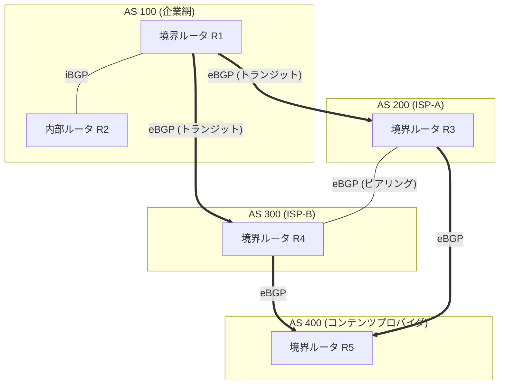
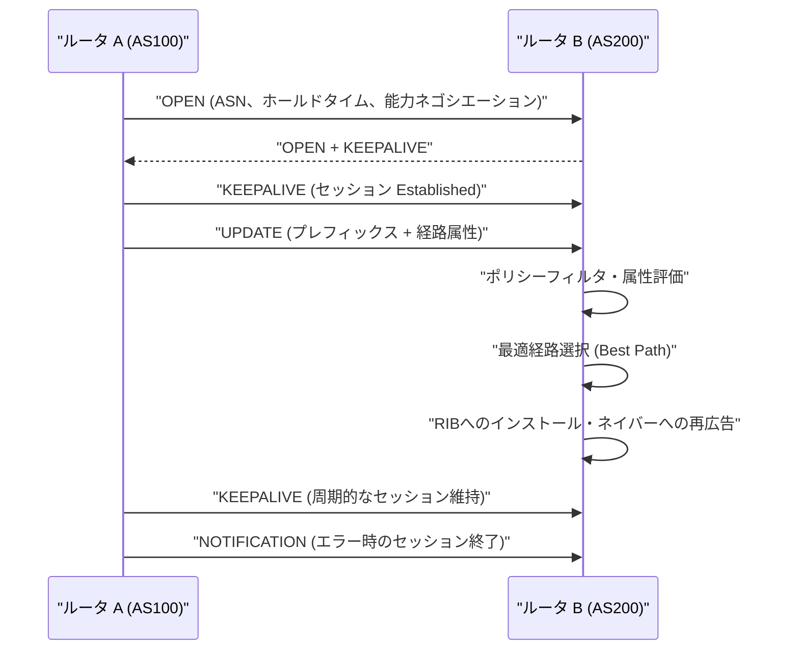

# BGP(Border Gateway Protocol、境界ゲートウェイプロトコル)

## 1. 概要

> **BGP(Border Gateway Protocol)**は、異なる管理主体(自律システム、AS)同士がインターネット上で到達可能なネットワークプレフィックス(Prefix)とその経路情報を交換するために使用する、**パスベクトル(Path Vector)型の標準外部ルーティングプロトコル(EGP)**であり、現在のインターネットの骨格をなす事実上唯一のドメイン間ルーティングプロトコルである(現行標準のBGP-4はRFC 4271)。

BGPが登場した根本的な背景は、**インターネットの規模と自律性(Autonomy)**である。インターネットは一つの組織が統制する単一のネットワークではなく、通信事業者・企業・クラウド・研究網など数万の独立した運用主体がそれぞれのポリシーに従って運用するネットワークの集合である。こうした各運用単位を**自律システム(AS, Autonomous System)**と呼び、一つの管理ポリシーとルーティング戦略を共有するルータの集合が一つのAS番号(ASN)で識別される。OSPF・RIPのような内部ルーティングプロトコル(IGP)は一つのAS内部で最短経路を計算することに最適化されており、数十万のプレフィックスと政策的な利害関係が絡み合うAS間ルーティングには根本的に不向きである。BGPはまさにこの**ASとASの間の経路決定**を担うために考案された。

第二の背景は、**ルーティングが単純な最短経路問題ではなくポリシー(Policy)の問題である**という認識である。AS間の関係はコスト・契約・信頼水準に応じて顧客(Customer)・プロバイダ(Provider)・ピア(Peer)に分かれ、「物理的により短い経路」よりも「精算コストが低く契約上許可された経路」が優先されることが多い。例えば国内のA通信事業者が海外宛てにトラフィックを送る際、ホップ数が少なくても精算料金の高いトランジット(Transit)経路ではなく、無精算で接続されたピアリング(Peering)経路を選好するのが典型的である。IGPのメトリック(ホップ数・帯域幅・遅延)だけではこうした商業的・政策的な選好を表現できないため、BGPは多様な経路属性(Attribute)によってポリシーをきめ細かく反映できるよう設計された。情報管理技術士の観点からは、BGPは「経路を計算するアルゴリズム」というよりも、**「ポリシーを経路に投影するフレームワーク」**として理解すべきである。

第三の背景は、**拡張性と安定性**である。全世界のルーティングテーブル(Global Routing Table)のIPv4経路数は既に約95万(2024年時点、時点により増加)の規模に拡大しており、なおも増加を続けている。BGPはディスタンスベクトルの無限ループ問題をASパス(AS_PATH)という経路全体の記録によって根本から遮断し、変更分のみを増分で伝達(Incremental Update)し、信頼性のあるTCP(179番ポート)上で動作して大規模な経路情報を安定的にやり取りする。ただしこの膨大な規模は、そのままルーティングテーブルの肥大化・収束遅延・経路ハイジャックといった運用上の課題につながる。

BGPの中核的な特徴をまず整理すると次のとおりである。

| 区分 | 内容 |
|------|------|
| プロトコル種別 | パスベクトル(Path Vector)、EGP(外部ゲートウェイプロトコル) |
| トランスポート層 | TCP 179番ポート(信頼性・順序保証) |
| ルーティング単位 | AS(自律システム)、ASN(16ビット→32ビットへ拡張、RFC 6793) |
| 経路選択 | ポリシーベース(Attribute)の最適経路決定、最短経路ではない |
| ループ防止 | AS_PATHに自身のASが存在する場合は経路を破棄 |
| 更新方式 | 初回の全体交換後は変更分のみ増分更新(Keepaliveでセッション維持) |

## 2. BGPの全体構造と動作概念

以下は、複数のASがBGPで接続されたインターネットの全体構造を示した概念図である。AS境界ルータはeBGPで他のASと、iBGPで自AS内部のルータと経路を交換し、ポリシーに従って経路を選別して伝播する。

**A. AS(自律システム)とASNの意味。** ASは単一の技術・管理ポリシーの下で運用されるルータ・ネットワークの集合であり、インターネットにおいてルーティングポリシーを表現する最小単位である。各ASは地域インターネットレジストリ(RIR)から固有の**AS番号(ASN)**の割り当てを受けるが、初期の16ビット(約6.5万個)体系が枯渇したことから、現在は**32ビットASN(RFC 6793、約42億個)**に拡張されている。ASNは大きく、インターネット全体で一意でなければならないグローバルASNと、プライベート用途で使われるプライベートASN(64512〜65534など)に分かれる。例えば韓国のKTはAS4766、GoogleはAS15169のようによく知られたASNを保有しており、ルーティング問題を診断する際にはAS_PATHに現れるこれらの番号を追跡して、トラフィックがどの事業者を経由しているかを把握する。このようにASNは単なる識別子ではなく、インターネットの商業的・政策的な地形を読み解く座標の役割を果たす。

**B. eBGPとiBGPの区別。** BGPは、セッションを結ぶ相手が他のASか同じASかによって**eBGP(external BGP)**と**iBGP(internal BGP)**に区別される。eBGPは異なるASの境界ルータ間で形成され、通常は物理的に直接接続された隣接ルータと結ばれ、広告時にAS_PATHへ自身のASNを追加する。一方iBGPは、同一AS内部のルータ間で外部から学習した経路を共有するためのセッションであり、AS_PATHを変更しない。ここで重要な原理が**iBGPスプリットホライズン(Split Horizon)**規則である — iBGPで学習した経路は他のiBGPネイバーに再広告しないことでループを防ぐが、その結果、AS内部のすべてのBGPルータが互いに経路を共有するには、原則として**フルメッシュ(Full Mesh)**が必要となる。n台のルータにはn(n-1)/2本のセッションが必要となるため、規模が大きくなるとこの要求は爆発的に増える。この拡張性の問題を解決するために、後述する**ルートリフレクタ(Route Reflector)**と**コンフェデレーション(Confederation)**が導入された。

**C. パスベクトル(Path Vector)方式の原理。** BGPはディスタンスベクトル(Distance Vector)の変形であるパスベクトル方式を用いる。ディスタンスベクトルが「宛先までの距離(ホップ数)」のみを伝達するため無限カウント(Count-to-Infinity)ループに脆弱であったのに対し、BGPは経路が経由してきた**ASの全リスト(AS_PATH)**を併せて伝達する。ルータは受信した経路のAS_PATHに自身のASNが既に含まれていれば、その経路が自分を一度経由して戻ってきたものと判断し、即座に破棄する。この単純かつ強力な規則が、ドメイン間ルーティングのループを根本的に遮断する。例えばAS100が広告したプレフィックスがAS200→AS300を経て再びAS100に戻ってくると、AS100はAS_PATHの中に自身を発見してその経路を捨て、ループを防止する。

BGPセッションは、次のような有限状態機械(FSM)を経て確立・維持される。

| 状態 | 意味 |
|------|------|
| Idle | セッション開始前の待機、BGPプロセスの初期化 |
| Connect / Active | TCP 179の接続試行(Connect失敗時はActiveで再試行) |
| OpenSent / OpenConfirm | Openメッセージの交換・パラメータ(ASN・ホールドタイム)のネゴシエーション |
| Established | セッション確立、Updateによる経路交換の開始 |

## 3. BGPメッセージ・経路属性と最適経路選択プロセス

BGPのポリシー表現力は**経路属性(Path Attribute)**から生まれる。以下は、BGPネイバーがセッションを結んで経路を広告した後、受信ルータが複数の候補経路の中から一つを最適経路として選択するまでの手順を示した詳細フロー図である。

**A. 4種類のメッセージの役割。** BGPは四つのメッセージで動作する。**OPEN**はセッション確立時にASN・ホールドタイム・サポート能力(Capability)をネゴシエーションし、**UPDATE**は到達可能な経路(プレフィックス+属性)の広告と取り消し(Withdrawn)を伝達する中核メッセージである。**KEEPALIVE**はホールドタイムの満了を防ぐために周期的に(デフォルトのホールド90秒、キープアライブ30秒)交換され、セッションの生存を確認する。**NOTIFICATION**はエラー発生時にセッションを終了させ、原因コードを伝達する。このようにBGPはTCPの信頼性の上で最小限のメッセージによって膨大な経路を増分管理するよう設計されており、最初に一度だけテーブル全体を交換し、以降は変更分のみをやり取りすることで帯域幅を節約する。

**B. 中核的な経路属性(Attribute)。** 経路属性はBGPポリシーの言語である。代表的には次のものがある。**AS_PATH**は経路が経由してきたASのリストであり、ループ防止と同時に経路長の比較(短いほど優先)に使われる。**NEXT_HOP**は当該プレフィックスに到達するためのネクストホップのアドレスである。**LOCAL_PREF(ローカルプリファレンス)**はAS内部で特定の外部経路をどれだけ選好するかを示す値で、大きいほど優先され、主にアウトバウンド(出ていく)トラフィックの経路を制御する。**MED(Multi-Exit Discriminator)**は隣接ASに対して「我々のASに入るときはこの入口を選好せよ」とヒントを与える値で、小さいほど優先され、インバウンドトラフィックに影響を与える。**COMMUNITY**は経路にタグを付けてグループ単位のポリシーを適用させる強力なツールである。例えばあるISPは、「顧客が特定のコミュニティ値を付けると、その経路を特定地域にのみ広告する」といった自動化されたポリシーを運用し、顧客が自らトラフィックエンジニアリングを行えるようにしている。

**C. 最適経路選択の順序(Best Path Selection)。** 同一プレフィックスについて複数の経路が学習されると、BGPは定められた優先順位に従ってただ一つの最適経路を選ぶ。ベンダーごとに細部の違いはあるが、一般的な順序は次のとおりである。

| 順位 | 基準 | 選好方向 |
|------|------|-----------|
| 1 | Weight(Ciscoのローカル値) | 大きい値 |
| 2 | LOCAL_PREF | 大きい値 |
| 3 | ローカル生成経路(自ASが発信) | 優先 |
| 4 | AS_PATH長 | 短いほど |
| 5 | Originタイプ(IGP < EGP < Incomplete) | 低いほど |
| 6 | MED | 小さいほど |
| 7 | eBGP > iBGP経路 | eBGP優先 |
| 8 | IGPメトリック(NEXT_HOPまで) | 小さいほど |
| 9 | より小さいRouter-ID / ネイバーアドレス | 小さいほど |

この順序が重要な理由は、運用者がどの段階の属性を調整するかによって、トラフィックフローを精密に設計できるからである。例えば二重回線を持つ企業が主回線を優先的に使いたい場合、主回線から入ってきた経路のLOCAL_PREFを高めてアウトバウンドを制御し、インバウンドはバックアップ回線での広告時にAS_PATHを人為的に長くする**AS_PATH Prepending**の手法で選好されにくくする。実際に国内大企業のマルチホーム(Multi-homing)構成でよく使われるこの組み合わせは、BGPの最適経路選択順序を理解していなければ設計できない代表的な実務事例である。

**D. iBGPの拡張性の解決策。** 前述したiBGPフルメッシュの問題は、大規模なASでは現実的に対応が困難である。**ルートリフレクタ(Route Reflector, RFC 4456)**は特定のルータをリフレクタに指定し、リフレクタがクライアントから学習したiBGP経路を他のクライアントに代わりに伝播させることで、フルメッシュの要求を取り除く。**コンフェデレーション(Confederation, RFC 5065)**は一つの大きなASを複数の下位ASに分割し、内部的にはeBGPのように扱いつつ、外部には単一のASNとして見せる方式である。どちらの手法もセッション数を劇的に減らし、大規模事業者網のiBGP設計を可能にする。

## 4. IGP(OSPF/RIP)との比較および適用の文脈

BGPとIGPは競合関係ではなく、**役割の異なる相互補完的なプロトコル**である。IGPは一つのAS内部で高速な収束と最短経路を、BGPはAS間でポリシーと拡張性を担当する。実際のネットワークでは、BGPが「どのASを経由して出ていくか」を決め、IGPが「その出口まで内部でどのように行くか」を決めるという階層的な協業が行われる。

| 区分 | IGP(OSPF/RIP) | BGP |
|------|---------------|-----|
| 適用範囲 | AS内部(ドメイン内) | AS間(ドメイン間) |
| アルゴリズム | リンクステート(OSPF)・ディスタンスベクトル(RIP) | パスベクトル |
| 経路基準 | 最短経路(コスト・ホップ) | ポリシーベースの属性 |
| 収束速度 | 速い(秒単位) | 遅い(ポリシー評価・伝播遅延) |
| 拡張規模 | 数百〜数千ルータ | 数十万プレフィックス・数万AS |
| 伝送 | OSPF: IPプロトコル89など | TCP 179 |

**A. なぜIGPでインターネット全体を扱えないのか。** OSPFはリンクステートデータベースをAS内のすべてのルータが共有してSPF(ダイクストラ)計算を行うが、全世界の95万経路をこの方式で処理しようとするとメモリ・CPUが耐えられず、何よりも互いを信頼しない運用主体間でリンクステートを丸ごと共有すること自体が、ポリシー・セキュリティ上不可能である。BGPは詳細な内部トポロジーを隠し、「到達可能なプレフィックスとASパス」という要約情報のみを交換するため、自律性を守りつつインターネット規模に対応できる。この違いこそが、「最短経路 vs ポリシー経路」という根本的な設計哲学の分岐点である。

**B. 収束速度のトレードオフ。** BGPは、ポリシー評価と段階的な伝播、そしてルーティングの振動を抑制する**ルートフラップダンピング(Route Flap Damping)**や**MRAI(Minimum Route Advertisement Interval)**タイマーのために、IGPよりも収束が遅い。これは安定性のために意図的に受け入れたトレードオフである。インターネットのコアで数十万の経路が秒単位で揺れ動けば全世界が不安定になるため、BGPは「速い反応」よりも「安定的な抑制」を選んだ。ただしこの遅延は障害時のサービス断時間を延ばすため、**BFD(Bidirectional Forwarding Detection)**でリンク障害をミリ秒単位で検知してBGPセッションを迅速にダウンさせる補完手法が併用される。

**C. 実務における統合構成の事例。** 国内のある金融機関が、二つのISPとマルチホームで接続されたデータセンターを運用しているとしよう。内部はOSPFでサーバ・ルータ間の最短経路を維持し、外部の二つのISPとはそれぞれeBGPセッションを結ぶ。平常時はLOCAL_PREFによって主ISP経由で出ていき、主ISPの障害時にBGPが経路を取り消す(Withdraw)と、自動的にバックアップISPの経路へ切り替わる。このとき内部ルータはiBGPで外部経路を共有するが、NEXT_HOPへの到達性はOSPFが保証する。この構造はBGP(ポリシー・冗長化)とOSPF(内部最短経路)の役割分担を示す典型的な産業事例であり、災害復旧(DR)・可用性設計の中核要素となる。

## 5. 深掘り: BGPのセキュリティ脅威とRPKIベースの対応

BGPはインターネットの根幹であるが、**設計当時は信頼ベース(Trust-based)**で作られたため、「広告された経路が本物か」を検証しないという構造的な脆弱性を抱えている。このためBGPセキュリティは今日のインターネットインフラセキュリティにおける最大の懸案の一つであり、技術士試験でも最新の出題ポイントとして浮上している。

**A. 経路ハイジャック(Prefix Hijacking)の危険。** あるASが自ら保有していないプレフィックス、あるいはより具体的な(Longer Prefix)プレフィックスを広告すると、最長一致の規則により全世界のトラフィックがそのASへ誤って流れる可能性がある。2008年にパキスタンの通信事業者がYouTubeのプレフィックスを誤って広告し、全世界でYouTubeが数時間麻痺した事件や、2018年にAmazon Route53のDNSトラフィックがハイジャックされ暗号資産ウォレットが奪取された事件は、代表的な実例である。こうした事故は単純な設定ミス(Route Leak)の場合もあれば、意図的な攻撃の場合もあり、信頼ベースのBGPの根本的な限界を浮き彫りにしている。

**B. RPKIとROAによる送信元検証。** これに対する標準的な対応が**RPKI(Resource Public Key Infrastructure, RFC 6480)**である。RPKIはIPプレフィックスとそれを広告する権限を持つASNを、暗号学的に署名された**ROA(Route Origin Authorization)**で結び付け、ルータは**ROV(Route Origin Validation)**によって受信経路の送信元ASが正当かどうかを検証し、無効(Invalid)な経路を破棄する。これにより「誰がこのプレフィックスを広告できるか」を検証でき、送信元のハイジャックをかなりの程度遮断できる。ただしRPKIは送信元(Origin)のみを検証し、AS_PATH全体の正当性は保証できないという限界があるため、**ASPA(AS Provider Authorization)**、**BGPsec(RFC 8205、経路全体への署名)**といった後続技術が議論・部分導入されている。また非営利の協議体である**MANRS(Mutually Agreed Norms for Routing Security)**は、フィルタリング・アンチスプーフィング・調整・検証の4大実践規範を通じて、運用慣行レベルでの改善を促している。

主なBGPの脅威と対応策を整理すると次のとおりである。

| 脅威 | 原理 | 対応 |
|------|------|------|
| 経路ハイジャック | 非保有プレフィックス・Longer Prefixの広告 | RPKI/ROA・ROV、プレフィックスフィルタ |
| 経路リーク(Route Leak) | トランジット経路の誤った再広告 | ASPA、ピアの役割に基づくフィルタ |
| AS_PATHの偽造 | 経路属性の操作による迂回 | BGPsec(経路署名) |
| セッションハイジャック・DoS | TCPセッション攻撃・フラップの誘発 | TTL Security(GTSM)、MD5/TCP-AO、Flap Damping |

**C. 最新動向と標準の変化。** 近年、グローバルな大手事業者・クラウド(Google・Cloudflare・AWSなど)を中心にROVの適用が急速に広がり、RPKIでカバーされるIPv4プレフィックスの比率が有意に上昇する傾向にある(正確な数値はNIST RPKI Monitor・RIPE統計などの最新資料を確認することを推奨する)。韓国国内でもKISA・通信事業者を中心にRPKIの導入が進められている。ただし全面的なROV適用には、正当な経路が署名の欠落によって破棄される誤検知リスクがあるため段階的なアプローチが必要であり、これは「セキュリティ強化」と「可用性維持」の間の典型的なトレードオフを示している。

## 6. 考慮事項および示唆点

- **ポリシー設計の明確性(トレードオフ):** BGPの強みであるポリシーの柔軟性は、すなわち複雑性でもある。LOCAL_PREF・MED・AS_PATH Prepending・Communityを組み合わせる際には、意図しないトラフィックの偏りや非対称経路が生じやすいため、ポリシーは文書化された標準と検証手順(テスト・シミュレーション)を経て適用しなければならない。特にインバウンドトラフィックの制御(MED・Prepending)は隣接ASのポリシーに依存するため、効果が限定的であることを認識しておく必要がある。
- **拡張性の設計:** 大規模なASはiBGPフルメッシュの代わりにルートリフレクタ・コンフェデレーションを導入してセッション数を制御し、ルーティングテーブルの肥大化に備えてプレフィックスの集約(Aggregation)・フィルタリング・メモリ容量の算定を並行して行わなければならない。32ビットASN環境への移行もロードマップに反映すべきである。
- **セキュリティの内在化:** RPKI/ROAの登録とROVの適用をインフラ標準として採用しつつ、誤検知による可用性の低下を防ぐため、モニタリング・段階的適用・ロールバック手順を併せて設計しなければならない。プレフィックスフィルタ・最大プレフィックス数の制限(Maximum-Prefix)・GTSM・TCP-AOといった基本的な防御を併用し、MANRSの規範を運用慣行として定着させることが望ましい。
- **可用性・収束の最適化:** マルチホーム・冗長化設計によって単一事業者の障害に備え、BFDで障害検知を前倒しし、Flap Damping・MRAIタイマーをトラフィック特性に合わせて調整して、安定性と反応性のバランスを取らなければならない。DR・BCPの設計時には、BGPの経路切替時間をRTOの算定に反映すべきである。
- **展望と連携技術:** BGPはSDN(中央コントローラによる経路制御)、SD-WAN(ポリシーベースのオーバーレイ)、セグメントルーティング(SR)、データセンター内BGP(EVPN-VXLAN、RFC 7938)などへと適用範囲を広げている。クラウド・マルチクラウド接続やインターネットエクスチェンジ(IX)のピアリング戦略においてもBGPの理解は必須であるため、組織はBGPを通信網の専有物ではなく、インフラアーキテクチャの定数として扱うべきである。

## 参考資料

- RFC 4271, "A Border Gateway Protocol 4 (BGP-4)" — https://www.rfc-editor.org/rfc/rfc4271
- RFC 6793, "BGP Support for Four-Octet Autonomous System (AS) Number Space" — https://www.rfc-editor.org/rfc/rfc6793
- RFC 4456(Route Reflection) / RFC 5065(Confederations)
- RFC 6480(RPKI) / RFC 8205(BGPsec) / RFC 7938(BGP in the Data Center)
- MANRS(Mutually Agreed Norms for Routing Security) — https://www.manrs.org
- NIST RPKI Monitor / RIPE NCC Routing Statistics — https://www.ripe.net

---

> **一言まとめ**: BGPはAS間でパスベクトル(AS_PATH)と多様な属性によりポリシーベースの到達性を交換するインターネットの根幹プロトコルであり、IGPと役割を分担しつつ、拡張性(ルートリフレクタ・コンフェデレーション)・可用性(マルチホーム・BFD)・セキュリティ(RPKI/ROA・ROV)の設計を併せて備えてはじめて安定的に運用できる。
