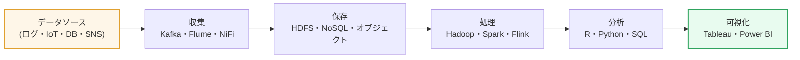
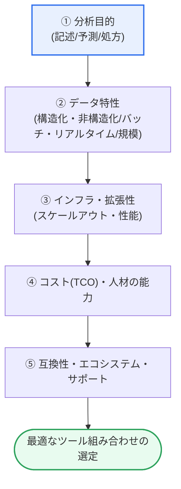

# ビッグデータ分析ツールの選定原則

## 1. 概要

### A. 定義
> **ビッグデータ分析ツールの選定**とは、組織の**データ特性(構造化/非構造化・規模・速度)・分析目的(記述/予測/処方)・インフラ・人材の能力・総所有コスト(TCO)**を総合的に考慮し、収集→保存→処理→分析→可視化に至るデータパイプラインの各段階に目的に適したツールを、合理的・客観的な基準で選定する意思決定活動である。

ツールの選定がプロジェクトの成否を左右する根本的な理由は、「**ツールが分析結果の品質と総所有コスト(TCO)を同時に決定する**」という点にある。ビッグデータのエコシステムには、収集(Kafka・Flume・NiFi)、保存(HDFS・NoSQL・オブジェクトストレージ)、処理(Hadoop・Spark・Flink)、分析(R・Python・SQLエンジン)、可視化(Tableau・Power BI・Superset)に至るまで、数百種類のツールが幾重にも存在する。各ツールは特定のワークロードに最適化されており、どのツールもあらゆる状況で最高にはなり得ない。この点が「選定」を単なる性能比較ではなく、組織の状況に対する総合的な判断にしている。

性能だけを見て最新・高性能のツールを選ぶと、肝心のそれを扱う人材がいなかったり、既存のインフラ・データソースと統合できなかったりして失敗する。逆に慣れたツールだけに固執すると、データ規模・リアルタイム処理の要求に対応できずボトルネックが生じる。したがって、「何をなぜ分析しようとしているのか(目的)」「データがどのような性質か(構造化/非構造化・リアルタイム/バッチ・規模)」「我々が実際に扱えるか(能力・学習曲線)」「今後どれだけ拡張しなければならないか(成長性)」「総コストは負担可能か(TCO)」をバランスよく比較衡量しなければならない。要するに、原則の核心は「**最高のツールではなく、自らの状況に最も適したツールを選ぶこと**」である。

### B. 登場背景と必要性
かつては構造化データを一種類のリレーショナルDBMSで処理すれば十分であった。しかし3V(Volume・Velocity・Variety)に代表されるビッグデータ時代が到来すると、単一のツールでは対応できない多様なワークロードが現れ、それらを分担する専門ツールが急増した。ツールが乱立する環境において誤った選択は、数億ウォン規模のライセンス・インフラコストの浪費、人材の再教育の負担、プロジェクトの遅延・失敗に直結する。さらにオープンソースと商用、オンプレミスとクラウド、バッチとストリーミングという選択軸が交差することで、意思決定の複雑さは一層増した。このため、勘や流行ではなく**客観的で再現可能な選定基準(原則)**が求められる。

## 2. データパイプラインと選定基準の構造

ツールの選定は個々のツールを一つずつ選ぶ問題ではなく、データが流れるパイプライン全体を見渡して各段階に合ったツールを組み合わせる問題である。下図は、データが収集から可視化まで流れるパイプラインと、その各段階に共通して適用される選定基準との関係を示している。

パイプラインの各段階は異なるワークロードを持つが、その上でツールを選ぶ判断基準は共通の軸に整理される。下図は、それらの基準がどのような優先順位と依存関係で機能するかを示している。目的が最上位でデータ特性を規定し、データ特性がインフラ・拡張性の要求を生み、その上でコスト・人材の能力・エコシステムが最終的な選択を調整する。

### A. 目的適合性 — 何をなぜ分析するのか
すべての選定は分析目的から出発しなければならない。同じデータでも、過去を要約する**記述的分析(descriptive)**、未来を予測する**予測分析(predictive)**、最適な行動を提案する**処方的分析(prescriptive)**のいずれを行おうとするかによって、必要なツール系統が異なる。単純な集計・ダッシュボードが目的であればSQLエンジンとBIツールで十分だが、予測モデルを作るにはPythonの機械学習エコシステムが必要であり、リアルタイムのレコメンド・異常検知のような処方型であれば、ストリーミング処理とモデルサービングのインフラまで要求される。目的を明確にしないままツールから選ぶと、華やかだが使われないシステムになってしまう。実際、多くのビッグデータ事業が「とりあえずHadoopから導入してみよう」というアプローチで始まり、活用シナリオの不在によって放置される事例が繰り返されてきた。

### B. データ特性 — 構造化/非構造化、バッチ/リアルタイム、規模
目的が定まると、扱うデータの性質がツールを絞り込む。構造化データが中心であればSQLベースのツールとカラム型ストレージが有利であり、ログ・画像・テキストのような非構造化データが多ければ、スキーマの柔軟性を備えたNoSQL・オブジェクトストレージと分散処理が必要となる。処理のタイミングも決定的である。日単位で大量のデータを集めて処理する**バッチ**であればHadoop/Hive系が、秒単位の遅延が重要な**リアルタイム・ストリーミング**であればSpark Streaming・Flink・Kafkaが適している。データ規模もまた閾値を形成する。数GB〜数十GBであれば単一ノードのR・Pythonで十分だが、TB〜PB級に拡大すると分散処理が必須となる。例えば1日数億件の決済ログをリアルタイムの不正検知に使うには、バッチ用ツールでは遅延に耐えられないため、ストリーミングスタックが必然となる。

### C. 拡張性・性能 — どれだけ、どれだけ速く大きくなるか
ビッグデータは時間とともに大きくなるという前提の上でツールを選ばなければならない。サーバを増やして処理量を拡大する**スケールアウト(scale-out)**が可能か、データが10倍に増えても線形に近い形で拡張できるかを見る必要がある。また、要求される応答時間(SLA)を満たす処理性能があるかが鍵となる。SparkがHadoop MapReduceを広く置き換えた核心的な理由はまさにここにある。MapReduceは各段階の結果をディスクに書き込むが、Sparkは中間結果をメモリ上に保持(in-memory)するため、反復演算(機械学習・対話型クエリ)で数倍〜数十倍高速である。一方でメモリを多く使うため、インフラコストとのトレードオフが生じる。すなわち性能は常にコスト・リソースと併せて判断しなければならない。

### D. コスト(TCO)・人材の能力・エコシステム — 持続可能か
最後に選定を調整するのは、総所有コストと人である。導入コスト(ライセンス・構築)だけでなく、運用・保守・教育・災害復旧まで含めた**TCO**を見なければならない。オープンソースはライセンス費用がないように見えるが、運用・チューニングを担える専門人材がいなければ、かえって総コストが大きくなる。組織の人材が既にPython・SQLに慣れているのに不慣れなツールを導入すると、学習曲線のために生産性が急落する。既存システム・データソースとの**互換性・連携性**、問題発生時に支援を受けられる**コミュニティ・技術サポートの厚み**も持続可能性を左右する。活発なコミュニティを持つツールは、ドキュメント・解決事例・人材市場が豊富であるため、長期運用のリスクが低い。

| 原則 | 中核的な問い | 判断ポイント |
|---|---|---|
| **目的適合性** | 何をなぜ分析するのか | 記述/予測/処方に合ったツール系統 |
| **データ特性** | 構造化/非構造化・バッチ/リアルタイム・規模 | スキーマの柔軟性・処理タイミング・分散の必要性 |
| **拡張性** | データ増加に対応できるか | スケールアウト・線形拡張 |
| **性能** | 応答時間・処理量の要求を満たすか | インメモリ・並列性、リソースとのトレードオフ |
| **使いやすさ・能力** | 組織が扱えるか | 学習曲線・既存の習熟度 |
| **互換性・連携** | 既存のエコシステムと統合できるか | コネクタ・標準インターフェース |
| **コスト(TCO)** | 総コストを負担できるか | ライセンス+運用+教育+インフラ |
| **コミュニティ・サポート** | 支援を受けられるか | オープンソースのエコシステム・商用サポート |

## 3. 処理タイプ別のツールと選定事例

選定原則が実際にどのようにツールを分けるかは、処理タイプ別に見ると明確になる。大容量データを集めて処理するバッチは、Hadoop/MapReduce・Hiveが安定的で安価だが遅延が大きい。反復演算と対話型分析、準リアルタイム処理には、インメモリエンジンであるSparkが強い。イベントを即座に流すストリーミングでは、Kafka(メッセージング)とFlink(状態ベースのストリーム処理)が標準である。統計・機械学習ではR(統計特化)とPython(汎用・豊富なMLライブラリ)が二大軸であり、結果の伝達はTableau・Power BIのような商用BIやオープンソースのSupersetが担う。

具体的な事例として三つの状況を比較してみよう。第一に、日次バッチで売上レポートを作成する小売企業は、Hive+Tableauの組み合わせで低コストに目的を達成する。第二に、1日数億件のログでリアルタイムに不正取引を検出しなければならないカード会社には、Kafka+Flink+モデルサービングのスタックが必要である。第三に、データサイエンスチームが予測モデルを反復的に実験する組織では、Spark+Python(MLlib/scikit-learn)+ノートブック環境が生産性を高める。同じ「ビッグデータ分析」であっても、目的とデータ特性が異なれば最適な組み合わせはこのように分かれる。

ここで必ず押さえておくべきことは、ツールは「競合関係」よりも「補完関係」で組み合わされる場合が多いという点である。Kafkaで収集したストリームをSparkで処理し、結果をNoSQLに格納した後Tableauで可視化するというように、異なる層のツールが一つのパイプラインを構成する。したがって、個々のツールの優劣よりも「ツール間の連携がスムーズか」がより重要な判断基準となり、これは先に見た互換性・エコシステムの原則に直結する。コネクタが豊富で標準フォーマット(Parquet・Avroなど)を共有するツールでスタックを組めば、統合コストと運用リスクが大きく減少する。

また、バッチとストリーミングの境界が曖昧になりつつあることも選定に影響を与える。かつてはバッチとリアルタイムを別システム(ラムダアーキテクチャ)で二重運用していたが、Spark Structured Streaming・Flinkのように一つのエンジンでバッチとストリームを併せて処理する統合型(カッパアーキテクチャ)のアプローチが広がるにつれ、両方の要求に対応できる単一エンジンを選べば、運用の複雑さとコードの重複を減らせるようになった。これは、「現在の要求」だけでなく「近い将来の要求」まで見据えてツールを選ぶことがなぜ重要かを示している。

| 区分 | 代表的なツール | 適合する状況 |
|---|---|---|
| **バッチ処理** | Hadoop, Hive | 大容量・非リアルタイム・コスト重視 |
| **リアルタイム・インメモリ** | Spark, Flink | 反復演算・準リアルタイム・対話型 |
| **ストリーミング収集** | Kafka, Flume, NiFi | イベント収集・低遅延 |
| **分析・ML** | R, Python | 統計・予測モデリング |
| **可視化・BI** | Tableau, Power BI, Superset | レポート・ダッシュボード |

代表的な選択の分かれ道である**Hadoop MapReduce vs Spark**を比較すると、「違いが生じる理由」が明確になる。両者は分散大容量処理という目的は同じだが、処理方式が根本的に異なるため、適合する状況が分かれる。MapReduceは各段階の結果をディスクに記録するため安定的で超大容量バッチに強いが、反復・対話型の作業には遅い。Sparkは中間結果をメモリに置くため反復演算ではるかに高速だが、メモリリソースの要求が大きい。すなわち「遅いが安価・安定」対「速いがリソース集約的」というトレードオフが選択を左右する。

| 比較軸 | Hadoop MapReduce | Spark | 違いが生じる理由 |
|---|---|---|---|
| **処理の場所** | ディスクベース | インメモリベース | 中間結果の保存媒体が異なる |
| **速度** | 相対的に遅い | 反復演算で数倍〜数十倍高速 | ディスクI/Oの有無 |
| **リソース** | メモリ負担が低い | メモリ要求が高い | データをメモリに保持 |
| **適合** | 超大容量バッチ・コスト重視 | 反復ML・準リアルタイム・対話型 | ワークロードの性格の違い |

## 4. 深掘り — クラウド・マネージドサービスとレイクハウスへの転換

近年、ツール選定の地形は「自前での構築・運用」から**クラウドベースのマネージドサービス(Managed Service)**へと急速に移行している。オンプレミスのHadoopクラスタを直接インストール・チューニング・運用する負担が大きいため、多くの組織がAWS EMR、Google Dataproc/BigQuery、Azure Synapse、Databricksといったマネージドサービスへ移行している。これらはインフラ運用をサービス提供者が担うため、組織は分析そのものに集中でき、必要なときだけリソースを使う従量課金によって初期投資と遊休コストを削減できる。ただし、データ移動量が多い場合や常時負荷が高い場合には従量課金のコストが予測を超えることがあり、特定ベンダーへのロックイン(lock-in)のリスクもあるため、これもTCO・移植性の観点から慎重に比較衡量しなければならない。

アーキテクチャの面では、**データレイクとデータウェアハウスを統合したレイクハウス(Lakehouse)**が台頭している。かつては生データを安価に蓄積するデータレイクと、精製されたデータを高速にクエリするウェアハウスを別々に運用していたが、Delta Lake・Apache Iceberg・Apache Hudiといったオープンテーブルフォーマットがレイク上でトランザクション・スキーマ管理・高性能クエリをサポートするようになり、両者を一つに統合する流れが強まった。これは、ツール選定の際に「オープンフォーマットのサポート有無」と「レイクハウスエコシステムとの連携」が新たな判断基準として浮上したことを意味する。さらにセルフサービス分析・自然言語クエリ(生成AIとの連携)が広がるにつれ、非専門家でも扱える使いやすさが選定において占める比重がより大きくなっている。

## 5. 考慮事項および示唆点(技術士の観点)

1. **目的→データ→ツールの順序を守れ。** 流行や性能指標ではなく「何をなぜ分析するのか」から出発し、データ特性で候補を絞り込み、最後にツールを確定するトップダウンの手順を原則としなければならない。この順序を逆にすると、高価なシステムが活用シナリオなしに放置されるという典型的な失敗につながる。

2. **TCOと人材の能力を併せて比較衡量せよ。** 導入コストだけでなく、運用・チューニング・教育・災害復旧まで含めた総所有コストを評価し、組織が実際に運用できる能力の範囲内で選択してはじめて持続可能となる。「無料」のオープンソースが専門人材の不在によって最も高価な選択になるという逆説を警戒しなければならない。

3. **拡張性と移植性を先制的に設計せよ。** データは必ず大きくなるという前提でスケールアウトの可能性を確保し、オープンフォーマット・標準インターフェースを優先して、特定のベンダー・ツールへの依存を最小化しなければならない。これは将来の移行コストを下げる戦略的な選択である。

4. **PoC(概念実証)で検証したうえで導入せよ。** 候補ツールを実際のデータ・実際のワークロードで試す小規模なPoCを経て、性能・互換性・運用性を客観的に確認し、定量評価表(重み付けスコア)で意思決定を文書化しなければならない。勘ではなく根拠に基づいて選択してはじめて、利害関係者の合意と事後の責任追跡が可能となる。

5. **ガバナンス・セキュリティ・規制遵守を選定基準に含めよ。** ビッグデータには個人情報・機微情報が混在しやすいため、アクセス制御・監査・データリネージ(lineage)・非識別化処理をサポートしているか、個人情報保護法などの規制要件を満たしているかを、ツール評価に必ず反映しなければならない。性能だけが優れたツールが、コンプライアンスの空白によってより大きなリスクを招くこともある。

## 参考資料
- Apache Spark 公式ドキュメント: https://spark.apache.org/docs/latest/
- Apache Kafka 公式ドキュメント: https://kafka.apache.org/documentation/
- AWS, "Big Data Analytics Options on AWS": https://docs.aws.amazon.com/whitepapers/latest/big-data-analytics-options/welcome.html
- Databricks, "What is a Data Lakehouse?": https://www.databricks.com/glossary/data-lakehouse
- Apache Flink 公式ドキュメント: https://nightlies.apache.org/flink/flink-docs-stable/

---

> **一言まとめ**: ビッグデータ分析ツールの選定とは、*分析目的→データ特性→拡張性・性能→コスト(TCO)・人材の能力・エコシステム*をトップダウンで総合し、「自らの状況に合った」ツールの組み合わせを選ぶことであり、最高性能ではなく目的適合性とTCO・能力・ガバナンスのバランスが原則であって、近年はクラウドのマネージドサービスとレイクハウスへと重心が移りつつある。
