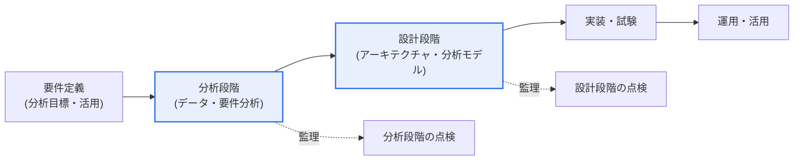
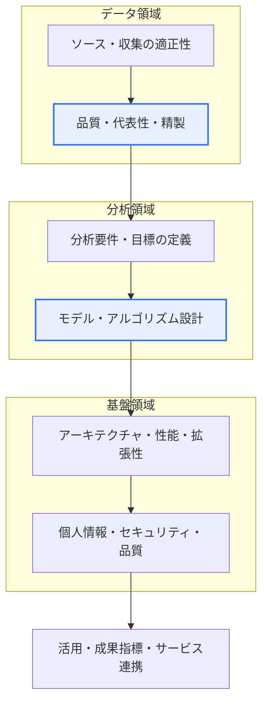

# ビッグデータ情報化事業の監理点検項目

## 1. 概要

### A. 登場背景と定義

> **ビッグデータ情報化事業の監理**は、人工知能・ビッグデータなど知能情報技術の特性を反映できない既存の監理基準の限界を補完するためのものであり、データの品質・代表性と分析モデルの妥当性を重点的に点検する。特に**分析・設計段階**の領域別点検項目が事業の成否を左右する。

ビッグデータ事業の監理が一般的なソフトウェア監理と分かれる根本的な点は、「**データと分析モデルこそが成果物の核心である**」という点にある。従来の情報化事業の監理は、「要求された機能が仕様どおりに実装されたか」に焦点を当てる。画面・機能・インターフェースが要求事項を満たせば、概ね品質は確保される。しかしビッグデータ事業は異なる。どのようなデータをどのような経路で確保・精製し、その上にどのような仮定とアルゴリズムで分析モデルを構築したかが、結果の信頼性を決定する。システムがいかに堅牢であっても、入力データに代表性がないか偏っており、分析モデルの仮定が妥当でなければ、算出された予測・洞察は「もっともらしいが誤った」結果となる("garbage in, garbage out")。このため、機能中心の点検だけではビッグデータ事業の真のリスクを捉えることができない。

こうした問題意識から、知能情報技術の特性を反映した**知能情報技術監理実務ガイド**の類の基準が整備され、その中でビッグデータ事業は、データ・分析モデル・アーキテクチャ・セキュリティ・活用を包含する独自の点検観点を持つようになった。すなわち、監理の重心が「**機能の実装有無**」から「**データと分析の妥当性・信頼性**」へと移ったことが核心である。

### B. 必要性

ビッグデータ・AI事業が公共分野全般(交通・福祉・災害・租税など)へ急速に広がり、その結果が政策の意思決定と国民向けサービスに直接反映されるにつれ、検証の重みが増した。もしこれを検証する監理基準が依然として機能中心にとどまっていれば、データの偏り・モデルの過学習・個人情報侵害といったビッグデータ固有の欠陥を見逃し、事業終了後になってはじめて「結果が信頼できない」という事実が明らかになる。監理は、事業の初期・中間段階で欠陥を早期に発見し、手戻りの余地があるうちに介入する仕組みであるため、新技術の特性を反映した点検項目こそが事業の実質的な品質と事後のリスクをともに担保する。特に分析・設計段階は、以降の実装・試験段階では是正が難しい「根本設計」が確定する時点であるため、監理の実効性が最も大きい。

## 2. 監理と事業段階 — 全体構造

監理は事業の進行段階に合わせて焦点を移しながら、欠陥を早期に捉える。下の構造図は、ビッグデータ事業のライフサイクルと監理の介入ポイントを示している。要件定義・分析段階では「何を、どのデータで」が妥当かを、設計段階では「どのように実装するか」が適正かを見る。後の段階になるほど手戻りのコストが大きくなるため、分析・設計段階の点検の密度が事業品質を左右する。

**分析段階**では、「何を、どのデータで分析するか」が妥当かを見る。分析要件・目標が事業目的と整合しているか、活用するデータのソースと収集対象が適切で、母集団を代表する品質を備えているかを点検する。ここで代表性・偏りの問題を見逃すと、以降のすべての分析が汚染される。**設計段階**では、「それをどのように実装するか」が適正かを見る。大容量データを保存・処理するアーキテクチャ、分析アルゴリズム・モデルの設計、性能・拡張性、個人情報保護・セキュリティ・品質管理の方策が、要件を満たすよう設計されているかを確認する。

## 3. 領域別の点検項目

ビッグデータ監理は、データ・分析(モデル)・アーキテクチャ・セキュリティ・活用の**五つの領域**を、分析・設計の二段階にわたって交差的に点検する。下のプロセス詳細図は、点検がデータから始まり、分析モデルを経て活用へとつながる流れを示している。各領域は表に整理する前に、「なぜ点検するのか」をまず理解しなければならない。実際の監理でよく発見される欠陥のタイプは次のとおりである。

- **データの偏り・代表性の未確保**: 特定のチャネル・集団に偏ったソースデータ。
- **品質管理手順の不在**: 欠損値・外れ値・重複の処理基準が設計にない。
- **検証設計の不備**: 学習・検証・テストデータを分離せずに過学習したモデル。
- **個人情報の非識別化の欠落**: 機微情報の処理根拠・非識別化方策の欠如。
- **活用設計の不在**: 分析結果がサービス・意思決定につながらない。

### A. データ領域

データ領域が最初の関門である理由は、ビッグデータ事業においてデータこそが「原材料」であり、結果の信頼性の上限だからである。分析段階では、**データソースと収集対象の適正性**を見る。分析目的に合致したソースを選んだか、特定の集団・期間・チャネルに偏って母集団を歪めていないか(**標本の偏り**)、必要なデータを適法に確保できるかを点検する。例えば全国民を対象とした福祉需要予測を行うにあたり、特定の年齢層だけが過剰に抽出されたデータを使えば、モデルがいかに精緻であっても結果は偏る。設計段階では、**データモデル・保存設計と標準・品質基準**を見る。データ標準(用語・コード・フォーマット)が定義されているか、欠損値・外れ値・重複を扱う精製・検証の手順が設計されているか、大容量の保存構造が分析のアクセスパターンに合っているかを確認する。データ品質管理が設計に組み込まれていなければ、運用段階で品質の低下が累積する。

### B. 分析(モデル)領域

分析領域はビッグデータ事業を一般的なSIと区別する核心であり、監理が最も慎重であるべき部分である。分析段階では、**分析要件・目標定義の妥当性**を見る。解こうとする問題が明確に定義されているか、成功を判断する指標(正解率・再現率・業務KPIなど)が事前に合意されているか、その目標がデータで実際に達成可能かを点検する。目標が曖昧であれば、「分析のための分析」にとどまりやすい。設計段階では、**分析アルゴリズム・モデル設計の適正性**を見る。問題のタイプ(分類・予測・クラスタリング・レコメンドなど)に合った手法を選択したか、過学習(overfitting)を防ぐ検証設計(学習・検証・テストデータの分離、交差検証)があるか、モデルの仮定と限界を文書化したか、結果を利害関係者が解釈・説明できるか(説明可能性)を確認する。監理人がデータサイエンスの結果の「正解」を判定するのは難しいが、**検証手順と仮定が方法論的に妥当かどうか**は必ず点検でき、また点検しなければならない。

### C. アーキテクチャ・セキュリティ・活用領域

残りの三つの領域は、分析を実際に支え、結果を安全にサービスへとつなぐ基盤である。**アーキテクチャ・インフラ**では、分析段階で処理規模・性能要件が現実的に算定されているか、設計段階でビッグデータプラットフォーム(分散保存・処理)・拡張性・性能設計が要件を満たしているかを見る。データが大きくなるほど、バッチ・リアルタイムの処理方式とリソース拡張戦略が結果算出の速度とコストを左右する。**セキュリティ・品質**は特に重要である。ビッグデータは個人情報を大量に扱う場合が多いため、分析段階で個人情報・非識別化処理の要件が定義されているか、設計段階でアクセス制御・暗号化・非識別化(仮名・匿名処理)・品質管理の方策が関係法令(個人情報保護法など)に適合するよう設計されているかを確認する。**活用**領域では、分析結果が実際の意思決定・サービスにつながるよう、活用目的・成果指標が明確であるか、可視化・サービス連携の設計がユーザーの観点から妥当かを見る。いかに優れた分析であっても、活用設計がなければ「報告書で終わる事業」になってしまう。

| 領域 | 分析段階の点検 | 設計段階の点検 |
|---|---|---|
| **データ** | ソース・収集対象の適正性、品質・代表性、偏りの有無 | データモデル・保存設計、標準・精製・品質基準 |
| **分析(モデル)** | 分析要件・目標・成功指標の定義の妥当性 | アルゴリズム・モデル設計、検証(過学習防止)・説明可能性 |
| **アーキテクチャ・インフラ** | 処理規模・性能要件の算定 | ビッグデータプラットフォーム・拡張性・性能設計 |
| **セキュリティ・品質** | 個人情報・非識別化要件の定義 | アクセス制御・暗号化・非識別化・品質管理方策 |
| **活用** | 活用目的・成果指標の定義 | 可視化・サービス連携・意思決定への反映設計 |

## 4. 事例と実務的含意

点検項目が実際にどのような欠陥を捉えるかは、事例で見ると明確である。第一に、**標本の偏りの事例** — ある自治体がオンライン民願データのみで市民満足度分析モデルを設計した場合、デジタル弱者層が構造的に欠落し、結果が歪む。データ領域の点検で「ソースの代表性」を指摘すれば、設計段階でオフラインチャネルを補完するよう手戻りできる。第二に、**過学習・検証不在の事例** — 災害予測モデルを学習データのみに合わせて正解率99%と報告したが、検証・テストデータの分離設計がなければ、実運用で性能が急落する。分析領域の「検証設計」の点検がこれを事前にふるい落とす。第三に、**個人情報の非識別化未実施の事例** — 保健・医療データを分析する際に非識別化処理の設計が欠落すると、法令違反と再識別のリスクが生じる。セキュリティ領域の点検が、設計段階で非識別化・アクセス制御を強制する。このように各領域の点検は抽象的なチェックリストではなく、**手戻りの難しい根本的欠陥を、手戻り可能な時点で捉える仕組み**である。

一般的な監理との違いも、実務的含意として整理できる。一般的なSI監理が「機能仕様に対する実装の一致」を見る静的な検証であるのに対し、ビッグデータ監理はデータの代表性とモデルの妥当性という**確率的・統計的な品質**を検証する。二つの監理の違いを軸ごとに対比すると次のとおりである。

- **点検対象**: (一般)機能・画面・インターフェース ↔ (ビッグデータ)データソース・品質・分析モデル。
- **品質の性格**: (一般)仕様充足の正誤 ↔ (ビッグデータ)代表性・妥当性の確率的な信頼度。
- **中核リスク**: (一般)要求事項の欠落・欠陥 ↔ (ビッグデータ)データの偏り・過学習・個人情報侵害。
- **監理人の能力**: (一般)SW工学 ↔ (ビッグデータ)SW工学 + データ・統計・個人情報規制。
- **成果物**: (一般)欠陥リスト・是正要求 ↔ (ビッグデータ)データ・モデルのリスク要因と改善勧告を含む。

そのため監理人には、従来のSW工学の知識に加え、データ品質・統計・個人情報規制に関する理解が求められ、監理の成果物も単なる欠陥リストを超えて、データ・モデルの根本的なリスクを指摘してはじめて実効性を持つ。

## 5. 深掘り — 最新動向とAI監理への拡張

ビッグデータ監理は近年、**AI(人工知能)事業の監理**へと拡張・深化する流れにある。生成AI・機械学習が公共事業に本格導入されるにつれ、従来のデータ品質中心の点検に加え、次のものが新たな点検軸として浮上している。

- **公平性・偏り(fairness)**: 特定の集団に不利な差別的結果を出していないか。
- **説明可能性(XAI)**: モデルの判断根拠を利害関係者が解釈できるか。
- **再現性(reproducibility)**: 同じデータ・条件で同一の結果が再現されるか。
- **継続的な性能モニタリング(model drift)**: 運用中のデータ分布の変化によって性能が劣化していないか。
- **説明責任・ガバナンス**: モデルの変更・意思決定に関する管理・追跡体制があるか。

これらの軸は、「設計時点の整合性」だけでなく「運用中の継続的な品質」までを監理の対象に取り込む。国際的には、AIマネジメントシステム規格であるISO/IEC 42001、リスク管理の観点からのNIST AI RMFなどが登場し、データ・モデルのライフサイクル全般を管理・検証するフレームワークが整備される傾向にある。韓国国内でも、知能情報技術監理ガイドがこうした観点を反映して改訂・補完されている。これは監理の視野が、「分析・設計時点の整合性」から「運用中のモデルが時間の経過とともに劣化・偏向していないか」という**継続的な検証**へと広がりつつあることを意味する。したがって技術士の観点からは、ビッグデータ監理を独立した手続きとしてではなく、データガバナンス・AIガバナンスと連携した継続的な品質保証体系の一部として捉える視点が必要である。(具体的な規格の最新版・改訂内容は、事業の時点で原文を確認することが望ましい。)

## 6. 考慮事項および示唆点

1. **機能ではなく、データ・分析モデルの妥当性を中心とした点検**が核心である。データの代表性・品質と分析モデルの方法論的な適正性こそが結果の信頼性を決定するため、監理の重心をここに置き、監理人の能力(データ・統計・規制の理解)もそれに合わせて確保しなければならない。

2. **個人情報保護・データ倫理の点検を強化**しなければならない。ビッグデータは個人情報を大量に扱うため、非識別化・アクセス制御・適法な処理根拠が設計に反映されているかを関係法令の基準で確認し、再識別のリスクと偏りによる差別の可能性まで検討しなければならない。

3. **分析結果の信頼性・再現性・説明可能性**を設計段階で事前に検証する。検証データの分離・交差検証などの過学習防止設計と、利害関係者が結果を解釈できる説明可能性を事前に点検し、事業終了後の失敗を予防する。

4. **分析・設計段階での早期介入の実効性**を活かす。根本設計が確定する初期段階で欠陥を捉えてこそ、手戻りのコストが小さい。監理を形式的な通過儀礼ではなく、リスクを早期に識別・是正するリスク管理の手段として運用しなければならない。

5. **データ・AIガバナンスとの連携**を志向する。一回限りの監理を超えて、データ標準・品質・モデル性能を継続的に管理・モニタリングするガバナンス体系と結び付けることで、ビッグデータ事業の品質が運用段階まで維持される。

---

> **一言まとめ**: ビッグデータ情報化事業の監理は、分析・設計段階において*データ(ソース・品質・代表性)・分析モデル(要件・検証・説明可能性)・アーキテクチャ・セキュリティ・活用*の五つの領域を交差的に点検するものであり、機能の実装有無ではなくデータと分析モデルの妥当性・信頼性の確認が核心であって、近年はAI監理・データガバナンスへと拡張しつつある。
