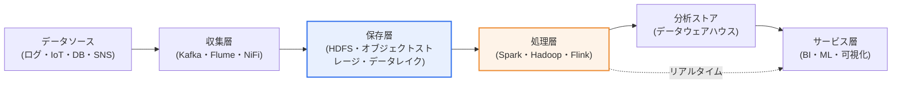
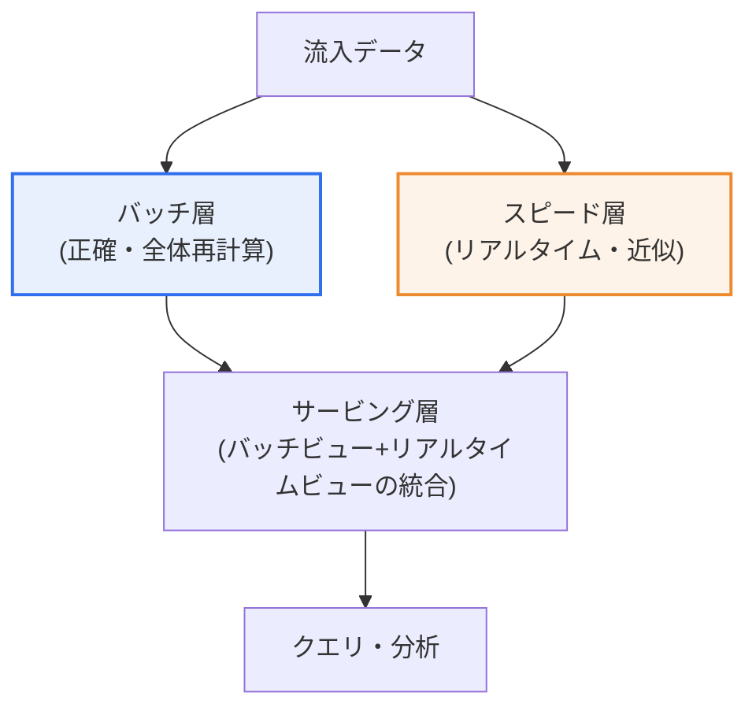

# ビッグデータプラットフォームのアーキテクチャ設計

## 1. 概要

### A. 定義
> **ビッグデータプラットフォームアーキテクチャ**とは、大容量・多様・高速のデータを**収集(Ingest)→保存(Store)→処理(Process)→分析(Analyze)→可視化・サービス(Serve)**する全過程を安定的に支援できるよう、インフラ・データ構造・入出力フローを階層的に設計した技術構造をいう。

ビッグデータプラットフォームの設計が本質的に難しい理由は、いわゆる**3V(Volume・Variety・Velocity)**を一つのシステムが同時に担わなければならない点にある。データの**量(Volume)**はテラバイトを超えてペタバイトへと拡大し、**多様性(Variety)**の面ではリレーショナルDBの構造化データ、Webログ・JSONのような半構造化データ、映像・音声・テキストのような非構造化データが混在し、**速度(Velocity)**の面では毎秒数万件が流れ込むリアルタイムストリームと1日1回実行される大量バッチが共存する。これに真実性(Veracity)と価値(Value)を加えた5Vに拡張して論じることもある。これらすべての特性を単一の従来型RDBMSの垂直拡張(scale-up)だけで担おうとすると、性能・コスト・可用性が同時に崩れる。

そのためビッグデータプラットフォームは、**関心の分離(separation of concerns)**の原則に従って階層的に設計される。際限なく増えるデータを収めるために複数のサーバを束ねる**分散インフラ層**を最下層に置き、その上にデータの形態と目的に合わせた**データ保存構造層**(データレイク・ウェアハウス・レイクハウス)を載せ、さらにその上にバッチとリアルタイムを包含する**処理・入出力層**を載せる。最後に、分析・機械学習・BIが消費する**サービス層**が位置する。このように層を分けると各層を独立して拡張・交換できるため、急増するデータに対してもシステム全体を再設計することなく対応できる。

### B. 登場背景と設計原則
ビッグデータプラットフォームが登場した背景には、二つの流れが噛み合っている。一つは、モバイル・IoT・ソーシャルメディアの普及によって**データ生成量そのものが指数的に急増**したことであり、もう一つは、x86の汎用サーバ(commodity hardware)を数百〜数千台束ねて分散処理する**スケールアウトコンピューティング技術(GoogleのGFS・MapReduce論文と、それをオープンソース化したHadoop)**が成熟したことである。高価な高性能単一機器の代わりに安価なサーバ複数台で同じ性能を出す経済性が確保されたことで、以前は捨てられていたログ・センサーデータまで集めて分析することが可能になった。

こうした背景のもと、ビッグデータプラットフォームの設計は次の原則に従う。第一に、サーバを追加して容量・性能を増やす**水平拡張性(scale-out)**を基本とする。第二に、データ特性ごとに**保存と処理を分離**し、構造化・非構造化をそれぞれ最適な方式で扱う。第三に、**バッチとリアルタイムを併せて**サポートする処理構造(ラムダ・カッパ)を採用する。第四に、一部のノードが停止しても全体が止まらない**高可用性・耐障害性(replication・fault tolerance)**を確保する。第五に、データの品質・セキュリティ・リネージを管理する**データガバナンス**を設計初期から内在化する。

## 2. 全体アーキテクチャ構造(階層別の構成要素)

ビッグデータプラットフォームは、データが流れるパイプラインを階層に分けて理解することが核心である。下の概念図は、収集からサービスまでデータが通過する全体の骨格を示している。

**収集層**は、分散したソースからデータを安定的に取り込む関門である。ソースはアプリケーションログ、IoTセンサー、運用DB(CDC)、外部API・SNSなど非常に多様である。このとき瞬間的に集中するトラフィックを緩衝し、プロデューサーとコンシューマーを分離するために、**メッセージキュー/ストリームバッファ**を置く。代表的な技術であるApache Kafkaは、データをトピック単位で受け取ってディスクに順次記録し、複数のコンシューマーがそれぞれのペースで読めるようにすることで、収集の殺到がそのまま保存・処理の障害へ波及するのを防ぐ。ログ収集にはFlume、フローベースの統合にはNiFiがよく使われる。

**保存層**は、ソースデータを原形のまま、かつ大量に保管する土台である。Hadoopの**HDFS**は大きなファイルをブロックに分割して複数ノードに分散・複製(デフォルト3重)保存し、安価なサーバでペタバイト級の容量と耐障害性を同時に確保する。クラウドではこの役割をAmazon S3・GCSのような**オブジェクトストレージ**が代わりに担い、保存とコンピューティングを分離(decoupling)できるため、必要なときだけ処理リソースを付け外しする弾力的な運用に有利である。

**処理層**は、保存されたデータを並列に計算して意味のある結果に変える。初期のHadoop MapReduceはディスクベースであったため反復演算に遅かったが、**Apache Spark**がデータをメモリに載せて処理するようになり、反復的な機械学習・対話型分析で数倍〜数十倍高速になった。ミリ秒単位の遅延が求められる純粋なストリーミングでは、Apache Flinkが強みを発揮する。処理層はバッチとリアルタイムという二つの経路をどちらも担わなければならないため、アーキテクチャ設計の重心となる。

**サービス層**は、処理結果を人やアプリケーションが消費する地点である。精製されたデータを**データウェアハウス**(例:カラム型分析DB)にロードしてBIツールでダッシュボードを描いたり、MLパイプラインに投入して予測モデルを学習・サービングしたりする。

| 層 | 役割 | 代表的な技術 |
|---|---|---|
| **収集** | ソースデータの流入・バッファリング | Kafka, Flume, NiFi, Logstash |
| **保存** | 大量の原形データの分散保存 | HDFS, S3・オブジェクトストレージ, データレイク |
| **処理** | 並列バッチ・ストリーム演算 | Hadoop, Spark(インメモリ), Flink |
| **分析・サービス** | BI・ML・可視化による消費 | データウェアハウス, ML, BIツール |

このように層を分ける根本的な理由は、**各層の変化の速度と拡張の要求が互いに異なる**からである。収集層は新しいソースが接続されるたびにコネクタが増え、保存層はデータの蓄積に応じて容量が線形に増加し、処理層は分析ワークロードの性格(バッチ・リアルタイム・ML)に応じてリソース要求が変動する。層を結合して設計すると一部分の変化が全体の再設計へと波及するが、分離しておけば、保存はそのままに処理エンジンだけをHadoopからSparkへ交換するといった**漸進的な進化**が可能になる。この柔軟性こそが、急増するデータと急速に変わる分析要求を同時に担うための実務的な核心である。

## 3. データ構造設計と入出力(処理)構造設計

### A. データ構造の分析とストアの選択
データ構造設計は、「何を扱うのか」を分類することから出発する。データを**構造化(リレーショナルテーブル)、半構造化(JSON・XML・ログ)、非構造化(映像・音声・文書)**に分け、各データのソース・収集周期・品質・活用目的を把握してはじめて、ストア戦略が立つ。スキーマが固定された構造化データはウェアハウスに、形態が流動的な半構造化・非構造化データはレイクに置くというように、特性に合わせて配置する。

**データレイク(Data Lake)**は、ソースデータを加工せずに原形(raw)のまま保存する。保存時点でスキーマを強制しない**読み取り時スキーマ(schema-on-read)**方式であるため、将来どのような分析を行うか決めていないデータもひとまず安価に集めておけるという柔軟性が最大の長所である。一方、管理規律がなければ誰も使えない**データスワンプ(data swamp)**へと転落するリスクがある。

**データウェアハウス(Data Warehouse)**は、精製・構造化されたデータを**保存時点でスキーマを定めて(schema-on-write)**ロードする分析専用のストアである。品質と一貫性が保証されるため定型レポーティング・BIに強いが、非構造化データの受け入れが難しく、事前モデリングのコストがかかる。実務では、ソースをレイクに集め、精製版をウェアハウスへ昇格させる**2段構造**がよく使われる。近年は両者の長所を統合した**レイクハウス(Lakehouse)**が台頭しており、レイクの安価なオブジェクトストレージの上にトランザクション・スキーマ管理層(例:Delta Lake、Apache Iceberg、Hudiのようなオープンテーブルフォーマット)を載せ、レイク上で直接ウェアハウス級の信頼性を確保する。

| ストア | スキーマ方式 | データ | 強み / 限界 |
|---|---|---|---|
| **データレイク** | schema-on-read | 構造化+半構造化+非構造化(原形) | 柔軟・低コスト / スワンプ化のリスク |
| **データウェアハウス** | schema-on-write | 精製された構造化データ | 品質・性能 / 非構造化に弱い |
| **レイクハウス** | テーブルフォーマットベース | レイク+トランザクション | 統合・信頼性 / 成熟度 |

### B. 入出力(処理)構造 — ラムダとカッパ
入出力構造の設計は、データが「いつ、どのような遅延で」処理されるかを定める。大量にまとめて正確に計算する**バッチ**と、流れ込むそばから処理して低遅延を得る**ストリーミング**は要求が相反するため、これを統合するアーキテクチャパターンが必要となる。下の概念図は、二つの経路を並行させるラムダアーキテクチャの詳細フローである。

**ラムダアーキテクチャ(Lambda Architecture)**は、同じデータを二つの経路に流す。**バッチ層**は全データを周期的に再計算するため正確だが遅延が大きく、**スピード層**は直近のデータのみをリアルタイムに近似処理するため遅延が小さい。**サービング層**が両者の結果を統合し、「正確性」と「リアルタイム性」をともに提供する。短所は、バッチとストリームの二系統のロジックをそれぞれ作成・維持しなければならず、**コードの二重化・運用の複雑さ**が大きい点である。

**カッパアーキテクチャ(Kappa Architecture)**は、この二重化をなくすためにバッチを取り除き、**すべての処理を一つのストリームに統一**する。過去のデータを再処理する必要があれば、ストリームログ(Kafka)を最初から再生(replay)する。ロジックが一系統であるため単純だが、大規模な再処理の性能と状態管理が課題となる。**どちらを選ぶかは、正確性の要求と運用の複雑さのトレードオフ**で決定する。リアルタイム性がそれほど重要でなく整合性が最優先であればラムダ(あるいはバッチ中心)を、ストリーム中心のサービスでロジックの単純化が重要であればカッパを選ぶ。

## 4. 比較と実際の適用事例

バッチとストリーミングの選択は、単なる技術的な好みではなく、**ビジネス要求が許容する遅延(latency)**によって決まる。例えば毎朝前日の売上を集計するレポートは数時間の遅延が問題にならないためバッチが経済的だが、カード決済の不正取引検知(FDS)は数百ミリ秒以内に判定しなければならないためストリーミングが必須である。遅延要求こそがアーキテクチャを分ける。

実際の産業事例を見ると、設計思想の違いが表れる。**Netflix**は視聴ログをKafkaで大量に収集し、レコメンド・エンコーディング最適化に活用するストリーミング中心のパイプラインで知られ、**Uber**はリアルタイムの需要・料金(surge pricing)計算のためにストリーム処理を中核に置きつつ、大規模なデータレイク(Hudiを自社開発)でバッチ分析を並行している。韓国国内でも、大手コマース・通信事業者がログ・注文データをKafka→Spark→ウェアハウスへ流す構造を広く運用している。これらの共通点は、**一つの正解アーキテクチャを使うのではなく、サービスごとの遅延・正確性の要求に合わせてバッチとストリームを組み合わせる**という点である。

| 要求 | 適合する処理 | 事例 |
|---|---|---|
| 遅延の許容度が大きい・整合性が最優先 | バッチ | 日次/月次精算、規制レポート |
| 超低遅延・即時判定 | ストリーミング | 不正取引検知、リアルタイムレコメンド |
| 両方が必要 | ラムダ/カッパ | ダッシュボード+精算の並行 |

もう一つ実務でよく直面するトレードオフは、**データレイクの柔軟性とガバナンスの緊張関係**である。初期には「とりあえず全部集めておこう」という判断でソースをレイクに無制限にロードするが、メタデータ・品質の規律がないまま数年が経つと、どのデータがどこにあり信頼に足るのか誰にも分からない状態になる。前述のUberが独自のテーブルフォーマット(Hudi)を開発したのも、ペタバイト級のレイクに増分更新・トランザクション・データリネージを付与し、このスワンプ問題を正面から解決しようとした結果である。すなわち大規模な事例がレイクハウスへと収束していく流れは流行ではなく、柔軟性と信頼性を同時に確保しようとする必然的な進化として読むべきである。

## 5. 深掘り — クラウド・レイクハウス・MLOpsへの進化

ビッグデータプラットフォームは近年三つの方向へ急速に進化しており、技術士の観点からこの流れを読み解くことが重要である。

第一に、**オンプレミスのHadoopからクラウドのマネージドサービスへの移行**である。数百台のクラスタを自前で構築・運用する負担の代わりに、保存(S3などのオブジェクトストレージ)とコンピューティングを分離し、必要なときだけ処理リソースを弾力的に付加する方式が標準になりつつある。これによりリソース効率と運用の利便性が大きく向上する。

第二に、**レイクとウェアハウスの収束、すなわちレイクハウスの台頭**である。Delta Lake・Apache Iceberg・Apache Hudiのようなオープンテーブルフォーマットが、安価なオブジェクトストレージの上でACIDトランザクション・スキーマ進化・時点照会(time travel)を提供するようになり、「レイクに原形を置き、ウェアハウスに精製版をもう一つ置く」という二重構造を単一の層に統合しようとする流れが顕著である。

第三に、**分析からAI/MLパイプラインへの拡張**である。保存されたデータがレポーティングを超えてモデル学習・サービングの原料となるにつれ、データパイプラインとモデルのライフサイクルを併せて自動化・運用する**MLOps**、そして組織全体が再利用する特徴量(feature)を管理する**フィーチャーストア(feature store)**が、プラットフォームの必須構成要素として組み込まれつつある。この流れの中で、ビッグデータプラットフォームは単なる保存・分析基盤を超え、**AIサービスのデータバックボーン**へと役割を拡大している。

## 6. 考慮事項および示唆点

1. **拡張性とコストのバランス**が設計の第一の鍵である。データ増加に備えたスケールアウトの余地は必須だが、過度な先行投資は浪費であるため、保存・コンピューティングの分離とクラウドのオートスケーリングによって実需に合わせてリソースを弾力的に調整することが、トレードオフの解法である。
2. **データガバナンス・品質を初期から内在化**しなければならない。いかに優れたインフラでも、メタデータ・品質・セキュリティの管理がなければレイクは「データスワンプ」となる。データカタログ・リネージ(lineage)の追跡を設計段階で反映しなければならない。[[data-governance]]
3. **バッチ・リアルタイム処理の戦略をサービス要求で判断**する。すべてをリアルタイムにしようとする過剰設計は、複雑さとコストを増やすだけである。遅延の許容値を基準にバッチ・ラムダ・カッパを選択し、二重ロジックの運用負担も併せて評価しなければならない。
4. **セキュリティ・プライバシー規制の遵守**が必須である。大量の個人情報を扱う以上、アクセス制御・暗号化・非識別化と、個人情報保護法・GDPRなどの規制をアーキテクチャに反映しなければならない。
5. **レイクハウス・MLOpsへの進化**を前提に、オープン標準(オープンテーブルフォーマット、標準コネクタ)を選択して特定ベンダーへのロックイン(lock-in)を減らし、AIサービス連携のための拡張の余地を確保することが、長期戦略上有利である。

## 参考資料
- Apache Hadoop 公式ドキュメント: https://hadoop.apache.org/docs/stable/
- Apache Spark 公式ドキュメント: https://spark.apache.org/documentation.html
- Apache Kafka 公式ドキュメント: https://kafka.apache.org/documentation/
- Lambda Architecture の紹介: http://lambda-architecture.net/
- Delta Lake(レイクハウス)公式: https://delta.io/

---

> **一言まとめ**: ビッグデータプラットフォームアーキテクチャは*収集→保存→処理→分析・サービスを支援する拡張可能な階層構造*であり、分散インフラの上にデータレイク/ウェアハウス/レイクハウスを置き、バッチとリアルタイム(ラムダ/カッパ)を組み合わせるものであって、拡張性とコスト、ガバナンス、そしてクラウド・MLOpsへの進化への対応が設計の核心である。
