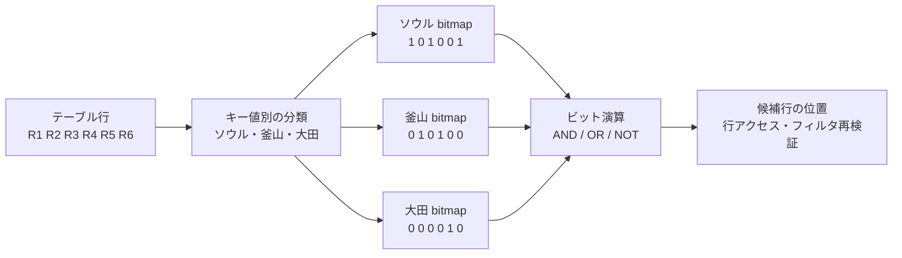
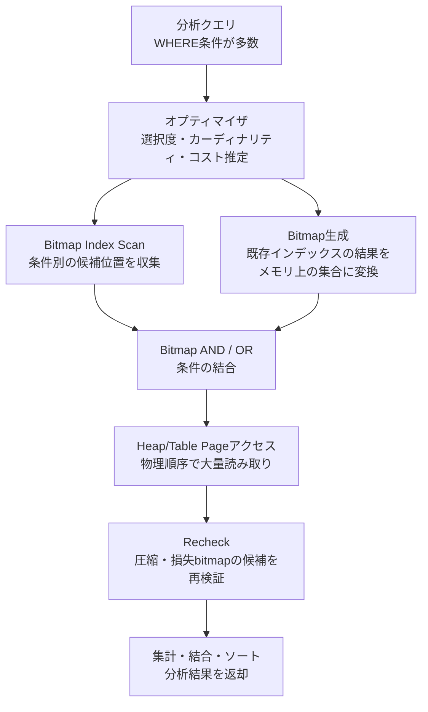

# ビットマップインデックス(Bitmap Index)と分析データベースの最適化

## 1. 概要

> **ビットマップインデックス(Bitmap Index)**とは、インデックスキーの各値について行の存在有無をビット列で表現し、ビット単位の演算によって複数条件の積集合・和集合を高速に計算するデータベースのインデックス構造である。

一般的なB-Treeインデックスは、特定のキーと該当行の位置を結び付ける。これに対しビットマップインデックスは、一つの値がどの行に現れるかを0と1の配列で表現する。例えば`性別=女`である行のビットのみを1で表したビットマップと、`地域=ソウル`である行のビットマップをANDすれば、二つの条件を同時に満たす行の位置を一度に得ることができる。

この方式は、値の種類が少ない低カーディナリティのカラムと、大量の行を対象とする分析型クエリにおいて特に効果的である。性別、地域コード、加入チャネル、商品等級、注文状態のように繰り返し値の多いカラムはビットマップに圧縮しやすく、分析者は複数の次元の条件を組み合わせるクエリを頻繁に実行するからである。

逆に、注文が絶えず挿入・更新・削除されるオンライントランザクションのテーブルでは、ビットマップの更新と同時実行制御のコストが大きくなりうる。したがってビットマップインデックスは「B-Treeより常に速いインデックス」ではなく、データのカーディナリティ・変更頻度・クエリの形態・ストレージエンジンの実装を併せて考慮して選択する、分析最適化の手段として理解すべきである。

情報管理技術士の答案では、ビットマップの構造を説明するだけにとどまらず、なぜ低カーディナリティ・読み取り中心の環境に適しているのか、B-Treeとどのようなトレードオフがあるのか、データウェアハウスとスタースキーマでどのように適用するのかまで結び付けなければならない。特にデータベース製品によって、「永続的に保存されるBitmap Index」と「実行計画で一時的に生成されるBitmap Scan」は異なりうるため、この二つを区別することが重要である。

## 2. 構造と動作原理

ビットマップインデックスは、インデックス対象カラムの値の集合と行位置との対応関係をビットで保存する。下図において各値は一つのビットマップを持ち、ビット位置はテーブルの論理的または物理的な行位置を指す。

### 2.1 キー値とビット位置の対応

あるテーブルに6行があり、地域カラムがソウル、釜山、ソウル、釜山、大田、ソウルの順に保存されていると仮定しよう。ソウルのbitmapは`[1, 0, 1, 0, 0, 1]`となる。1番目のビットと3番目・6番目のビットが1であるため、該当する行がソウルであることを意味する。

ビット一つだけですべての情報を表現するわけではない。データベースはビットマップとともに、キー値の辞書、ビットマップの保存場所、圧縮ブロック、行位置を実際のページアドレスに変換するマッピング情報を管理する。したがってビットマップインデックスも結局はテーブルの行を探し当てるためのインデックスであり、ビット演算の結果を実際のデータページへのアクセスに結び付ける段階が必要である。

NULLを別の状態として表現するかどうか、行の挿入・削除によって生じる空き位置をどう管理するかは、製品と実装によって異なる。試験の答案では、「各ビットが行の存在を表す」という中核原理を説明しつつ、物理的なrowidとNULLの処理方式にはDBMSごとの違いがあることを明記するのが無難である。

### 2.2 ビット単位のクエリ処理

`地域=ソウル AND チャネル=モバイル`というクエリが来ると、データベースはソウルのbitmapとモバイルのbitmapをANDする。両方のビットが1である位置のみが1として残るため、二つの条件を満たす可能性のある行集合を高速に作ることができる。

`地域=ソウル OR 地域=釜山`は二つのビットマップをORする。どちらか一方でも1である位置が結果に残る。`NOT 地域=ソウル`はソウルのbitmapの0の位置を取る方式と考えることができるが、NULLと削除行を含む補正規則があるため、実際の実行では単純なビット反転では済まない。

複数の条件が結合されると、ビットマップ演算はCPUレジスタとメモリ帯域を効率的に使うことができる。インデックスエントリを行単位で辿る代わりに、圧縮されたビットブロックを順次処理するため、数千万件以上のファクトテーブルで多次元フィルタを行う際に有利である。

### 2.3 圧縮と保存効率

値が繰り返されるカラムでは、連続した0または1が多く現れる。このときすべてのビットを原形のまま保存せず、繰り返しの長さや区間を保存する圧縮を適用できる。例えば長い0の区間を「0が10,000個」という形で表現すれば、保存領域とディスクの読み取り量を減らすことができる。

圧縮効率は、データの分布と行の配置に左右される。同じ値が物理的に近くに集まっていれば長い繰り返し区間が生まれて圧縮がよく効くが、値がランダムに混ざっているとビットが頻繁に変わるため圧縮効果が低下する。したがってETL過程でのソート、パーティション構成、クラスタリングは、単なる保存管理ではなくビットマップの性能にも影響を与える。

圧縮は保存領域を減らす代わりに、解凍や区間変換のコストを誘発しうる。しかし分析クエリでは、ディスクI/Oを減らす効果がCPUコストを上回る場合が多い。性能評価ではインデックスのサイズだけを見るのではなく、キャッシュヒット率・論理読み取り・物理読み取り・ビット演算時間・最終的なテーブルアクセス時間を併せて測定しなければならない。

## 3. 中核構成要素と実行フロー

ビットマップインデックスに基づくクエリは、一般に「条件分析 → ビットマップの生成または照会 → ビットマップの結合 → データページへのアクセス → 残余条件の検証」というフローを経る。永続的なビットマップインデックスを提供するDBMSではインデックスがあらかじめ保存されており、そうでないエンジンではB-Treeなどの結果から実行中にbitmapを作ることもある。

### 3.1 オプティマイザの選択

オプティマイザは、予想返却行数、カラムの選択度、インデックスとテーブルの統計、メモリとI/Oのコストを用いてビットマップ経路を評価する。条件を満たす行が非常に少なければ、B-Treeインデックスで少数の行を直接探し当てる方がよい。逆に多くの行が散在したページに存在すると、各行をランダムに訪問するコストが大きくなるため、ビットマップ方式が有利になりうる。

統計が古くなると、オプティマイザは選択度を誤って予測する。実際には条件の結果が1%なのに40%と推定したり、逆に多くの行が返るのに少ない行数を予想したりすると、ビットマップとシーケンシャルスキャンのうち誤った計画を選択しうる。したがって統計収集の周期とデータ分布の変化検知は、インデックス設計とともに管理しなければならない。

### 3.2 Bitmap AND・ORと集合処理

多次元検索では、条件ごとに候補ビットマップを作った後、AND・ORで結合する。ANDは条件を追加するほど候補を減らす方向であり、ORは複数のカテゴリを合わせて候補を増やす方向である。この演算は行を一つずつ比較する代わりにビットブロック単位で実行されるため、大量データにおいて演算量を減らす。

しかし条件を多く付ければ常に速くなるわけではない。各ビットマップを読み込んで結合するコストと、最終的なテーブルアクセスのコストがあるからである。特定の条件がほぼすべての行を通過させるのであれば、そのビットマップは選択度が低く役に立たず、圧縮がうまく効かなければかえって中間結果を大きくしうる。

### 3.3 テーブルページへのアクセスと再検証

結合されたビットマップは実際の行そのものではなく、行位置の候補集合である。エンジンは候補位置に基づいてテーブルページを読み、必要なカラムを取得する。行を物理ページの順序にまとめて読めば、同一ページにある複数の行を一度に処理してランダムI/Oを減らすことができる。

圧縮された、あるいは損失型のビットマップは、メモリ使用量を減らすためにページ単位で「このページに候補がある」程度のみを表現することがある。この場合、候補ページのすべての行を読んだ後に元の条件を再確認する。したがって実行計画にRecheckが現れたからといってインデックスが誤っているわけではなく、領域・メモリ節約のための正常な候補再検証の過程でありうる。

## 4. タイプと関連構造

### 4.1 単一カラムのビットマップインデックス

単一カラムのビットマップインデックスは、一つの次元について値ごとのビットマップを持つ。性別のように値の種類が二つしかないカラムや、地域コード・状態コードのように定められたコード集合が小さいカラムに適用しやすい。

この構造の長所は、複数の単一カラムインデックスを組み合わせられる点である。地域、チャネル、会員等級をそれぞれインデックス化すれば、分析者がどのような組み合わせの条件を入力しても、各ビットマップをANDして候補行を作ることができる。ただし、すべてのカラムに無差別に追加すると、インデックスの維持コストと保存領域が増加する。

### 4.2 複数カラムのビットマップと関数ベースインデックス

DBMSによっては、複数カラムの組み合わせを一つのインデックスキーとして構成したり、日付から年・月を抽出する式にインデックスを作成したりできる。こうした設計は頻繁に繰り返される分析条件を減らしてくれるが、クエリの表現がインデックス定義と異なるとオプティマイザが活用できないことがある。

複数カラムのインデックスには、組み合わせの数が急増するという問題がある。カラムA・B・Cのすべての値の組み合わせをあらかじめ作ると、インデックスが大きくなり値分布の変化に敏感になる。したがって汎用的なad hoc分析には単一次元ビットマップの組み合わせが柔軟であり、繰り返される中核レポートには複数カラムまたは事前集計の構造が有利となりうる。

### 4.3 ビットマップ結合インデックス

スタースキーマでは、ファクトテーブルの外部キーとディメンションテーブルの属性を結合してフィルタリングするクエリが多い。ビットマップ結合インデックスは、ディメンション属性の値をファクトテーブルの行位置と結び付け、ディメンションテーブルを毎回結合しなくてもファクト行の候補を高速に作れるよう設計される。

例えば販売ファクトテーブルに顧客の地域コードが直接保存されておらず、顧客ディメンションテーブルにのみある場合、「ソウルの顧客の販売額」というクエリには顧客ディメンションと販売ファクトの結合が必要となる。ビットマップ結合インデックスは、この関係をインデックスレベルで表現し、繰り返されるディメンションフィルタのコストを削減できる。

その代わり、ディメンションの値が変わったり、ファクトテーブルとディメンションテーブルの関係が変更されたりすると、インデックスの維持コストが発生する。分析用でほとんど変更されないディメンションと、大量照会が繰り返されるファクトテーブルに適しており、変更が頻繁な運用テーブルに無理に適用すると更新遅延が大きくなる。

## 5. B-Tree・ハッシュインデックスとの比較

B-Treeはソートされたキー空間を探索するため、範囲検索、ソート済み結果の提供、高カーディナリティの点照会に強い。一方ビットマップインデックスは、値ごとの行集合をビットでまとめるため、低カーディナリティの条件を複数組み合わせる分析クエリで強みを発揮する。

ハッシュインデックスは、ハッシュ値を用いて等価比較を高速に見つける構造である。範囲条件やソートには弱く、エンジンごとの制約もある。ビットマップは等価条件を組み合わせる分析に有利だが、値の種類が非常に多い場合や更新が頻繁な場合には、ビットマップが常に適しているとは限らない。

| 区分 | ビットマップインデックス | B-Treeインデックス | ハッシュインデックス |
|---|---|---|---|
| 基本表現 | 値ごとのビット列と行位置 | ソートされたキーと行位置 | ハッシュバケットとキー位置 |
| 適したカーディナリティ | 低〜中 | 低〜高、汎用 | 等価条件が中心 |
| 強み | 複数条件のAND・OR、大量分析 | 範囲・ソート・点照会 | 正確な等価照会 |
| データ変更 | 読み取り中心に有利、更新負担の可能性 | 一般的なOLTPに汎用的 | エンジン別の制約と衝突を考慮 |
| 結果へのアクセス | 候補ビットマップの後にページアクセス | キー順序で行に直接アクセス | バケットから候補にアクセス |
| 代表的な適用 | データウェアハウス・スタースキーマ | 取引テーブル・混合業務 | 特定キーの照会 |

この比較で重要なのは、インデックスの名前よりもアクセスパターンである。顧客番号のようにほぼすべての値が互いに異なるカラムをビットマップにすると、値ごとのビットマップが過度に多くなり、圧縮の利点が弱まる。逆に性別のように値の種類が少ないカラムであっても、単一行のみを探すOLTPクエリでは、B-Treeによる直接探索の方が単純でありうる。

また、B-Treeとビットマップは互いに排他的な選択ではない。分析システムにおいて、日付・一意識別子にはB-Treeを、状態・地域・チャネルにはビットマップを併せて置き、オプティマイザがクエリごとに選択するようにできる。ただし重複インデックスが増えるとロード時間と保存領域が増加するため、使用率をモニタリングしなければならない。

## 6. 適用手順と運用戦略

第一に、業務クエリを収集する。どのカラムがWHERE・JOIN・GROUP BYで繰り返されるか、結果行の比率がどの程度か、日付範囲がどのように使われるかを把握する。インデックスはテーブル定義から出発するのではなく、実際のアクセスパターンから出発しなければならない。

第二に、カラムごとのカーディナリティと変更頻度を測定する。`distinct値の数 / 全行数`が低いからといって、自動的に適しているわけではない。1日数百万件のDMLが発生するカラムであれば、ビットマップの維持コストとロック競合の方がより大きな問題となりうる。

第三に、代表的なクエリを基準に実行計画を比較する。ビットマップインデックスの追加前後で、総コスト、実際の実行時間、論理・物理I/O、CPU、メモリ使用量、返却行数を記録する。平均値だけを見るとピーク時間帯のボトルネックを見落とす可能性があるため、業務時間帯とバッチ時間帯を分けて測定する。

第四に、データロードとインデックス維持の戦略を決定する。大量ロードの前にインデックスを無効化してロード後に再作成するか、パーティション単位で交換するか、増分ETLのたびに維持するかを選択する。この決定は、データの鮮度とバッチウィンドウとの間のトレードオフを生む。

第五に、使われていないインデックスを整理する。インデックスが存在するという事実だけでは品質を保証できない。オプティマイザが繰り返しシーケンシャルスキャンを選択するのであれば、統計・分布・クエリ形態・インデックス設計を再検討し、効果のないインデックスは運用の複雑さを減らすために削除を検討する。

## 7. 事例と性能の解釈

### 事例1: 流通業のデータウェアハウス

流通企業の販売ファクトテーブルが数億件あり、日次の販売バッチでロードされると仮定しよう。分析者は「2026年第2四半期、ソウル地域、モバイルチャネル、特定の商品群」のように複数の条件を組み合わせて売上を集計する。地域・チャネル・商品群は繰り返し値が多く、クエリは多くの行を読んだ後に集計する形態であるため、ビットマップの組み合わせが適している可能性が高い。

このとき日付カラムをパーティションキーとして使ってまず期間を絞り、パーティション内部で地域・チャネル・商品群のビットマップをANDする戦略を立てることができる。パーティションプルーニングとビットマップフィルタリングがともに機能すれば、不要なパーティションと行ページを減らせる。しかし実際の効果は、データの物理的なソート、パーティションのサイズ、圧縮方式、集計演算の並列性によって異なる。

### 事例2: 注文処理のOLTPシステム

オンライン注文テーブルで、注文状態が決済待ち・決済完了・配送中・キャンセルと変わり、毎秒多くの更新が発生するとしよう。状態カラムは低カーディナリティであるためビットマップの候補のように見えるが、状態変更のたびにインデックスの維持と同時実行制御が必要となる。

運用画面が特定の状態の最近の注文数件のみを照会するのであれば、日付と注文番号を中心としたB-Treeの方が予測可能な応答を提供できる。ビットマップを追加するとしても、分析用の読み取りレプリカや別の集計テーブルに限定するのが安全である。この事例は、カラムのカーディナリティだけでインデックスを決定してはならないことを示している。

### 事例3: PostgreSQLのBitmap Scanの解釈

PostgreSQLのように実行計画で複数のインデックス結果をbitmapで結合できるシステムでは、「Bitmap Index Scan」がそのまま永続的なビットマップインデックスの存在を意味するわけではない。B-Treeインデックスをそれぞれスキャンした結果をメモリ上のbitmapにした後、BitmapAnd・BitmapOrを実行し、Bitmap Heap Scanでテーブルページを読むという実行戦略でありうる。

したがって技術士は、製品ドキュメントと実行計画を併せて確認しなければならない。永続的なBitmap Indexの保存・更新の特性と、実行中に生成されるbitmap scanのメモリ・ページアクセスの特性とでは、性能と障害の原因が異なる。この区別を答案に含めれば、構造の説明と運用上の診断を結び付けることができる。

## 8. 深掘り: データウェアハウスの最適化と現代的なストレージエンジン

ビットマップインデックスは、カラム指向ストレージ、圧縮、ベクトル化実行と相互補完的な関係にある。カラム指向ストレージは必要なカラムだけを読み、同じカラムの値を連続して処理できるようにし、ビットマップは行の候補を素早く絞り込む。両手法を併せて適用すれば、フィルタ段階ではビット演算を、集計段階ではカラム単位のSIMD処理を活用できる。

ただし、すべてのカラム型分析エンジンが従来型のビットマップインデックスをユーザーに公開しているわけではない。一部のエンジンは、辞書エンコーディング、ゾーンマップ、削除ベクトル、ランレングス圧縮、ベクトル化フィルタなど別の構造で同様の効果を提供する。したがって「ビットマップインデックスを導入する」という製品中心の表現よりも、「低カーディナリティ条件の集合フィルタを圧縮・ベクトル化して処理する」という論理的な目標を先に定義しなければならない。

データが増加すると、インデックスの再作成よりもパーティション単位の管理が重要になる。古いパーティションは読み取り専用に固定して強く圧縮し、最新のパーティションにはロード・更新の要求に合わせて別のインデックス戦略を適用できる。このように時間軸に沿ったデータライフサイクル管理とインデックスポリシーを組み合わせれば、保存コストとクエリ性能を同時に統制できる。

品質の面では、インデックスが高速な結果を出したとしても、最新性と整合性が保証されていなければならない。ETLの失敗によってビットマップとファクトデータの時点がずれると誤った集計が返される可能性があるため、ロード完了後に件数・チェックサム・パーティション別統計・代表クエリの結果を検証するデータ品質ゲートが必要である。

## 9. 考慮事項および示唆点

### 9.1 カーディナリティと選択度

低カーディナリティは有利な出発点であって、十分条件ではない。カラムの値の種類が少なくても、特定のクエリが大部分の行を返すのであればフィルタ効果は弱い。全行数に対する返却行数、値分布の偏り、条件結合後の候補の減少率を併せて評価しなければならない。

### 9.2 DMLと同時実行性

ビットマップインデックスは読み取り中心・バッチロードの環境とよく合うが、頻繁な行変更があるOLTPでは、更新コストと競合が問題となりうる。運用テーブルと分析テーブルを分離するか、読み取りレプリカ・パーティション交換・マイクロバッチによって変更範囲を限定する設計が必要である。

### 9.3 統計と実行計画

インデックスを作って終わりにせず、統計の更新と実行計画の回帰テストを運用しなければならない。データ分布が変わったり新しい条件が追加されたりすると、オプティマイザはシーケンシャルスキャン・B-Tree・ビットマップの経路のうち別の選択をすることがある。計画の変化をデプロイパイプラインで検知すれば、性能低下を早期に発見できる。

### 9.4 パーティション・圧縮・ストレージレイアウト

ビットマップの性能は、インデックス自体だけでなく行の配置とパーティション設計の影響を受ける。日付パーティション、クラスタリング、圧縮単位、キャッシュ容量を併せて設計しなければならない。特に、最新パーティションの高い変更頻度と過去パーティションの読み取り中心の特性を、同じポリシーで扱わないことが重要である。

### 9.5 製品ごとの意味の違い

Oracleのような製品の永続的なBitmap Index、PostgreSQLのBitmap Index Scan、カラム型エンジンのbitmap filterは、名前は似ていても保存・生成・更新の方式が異なりうる。試験の答案や現場の診断では、機能名をそのまま一般化せず、「永続的なインデックスなのか、実行中の一時的な集合なのか」をまず確認しなければならない。

### 9.6 性能とコストのバランス

性能向上のためにすべての次元にインデックスを追加すると、保存領域、ロード時間、運用の複雑さが増加する。中核クエリの業務価値とSLAを基準に投資の優先順位を定め、インデックスごとの使用率・削減I/O・追加の維持コストを指標化しなければならない。技術士の観点からは、単一クエリの最高性能よりも、データプラットフォーム全体の総所有コストと予測可能性を重視すべきである。

## 参考資料

- [Oracle Database Concepts — Indexes and Index-Organized Tables](https://docs.oracle.com/en/database/oracle/oracle-database/21/cncpt/indexes-and-index-organized-tables.html)
- [PostgreSQL Documentation — Combining Multiple Indexes](https://www.postgresql.org/docs/current/indexes-bitmap-scans.html)
- [PostgreSQL Documentation — Index Scanning](https://www.postgresql.org/docs/current/index-scanning.html)

---

> **一言まとめ**: ビットマップインデックスは、低カーディナリティ・読み取り中心の分析環境において、値ごとの行集合を圧縮されたビットで結合して複数条件のフィルタを高速化するが、DML・同時実行性・製品ごとの実行上の意味まで併せて評価すべき選択的な最適化手法である。
