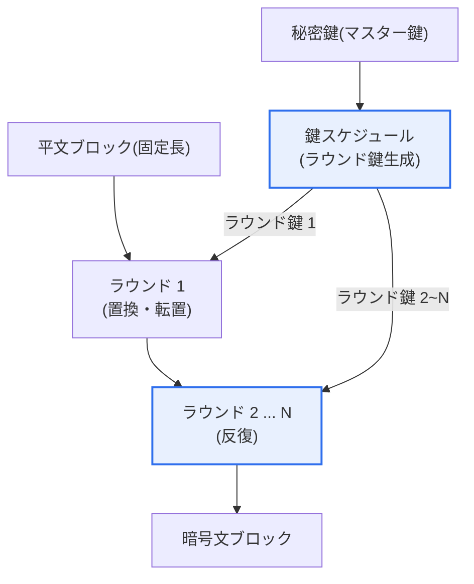
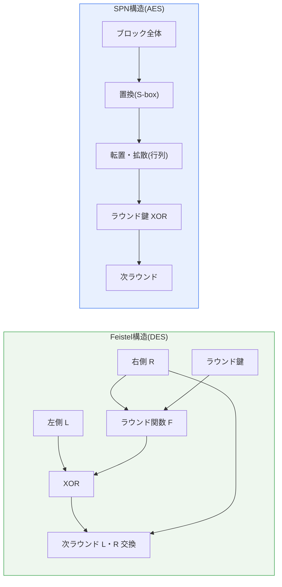
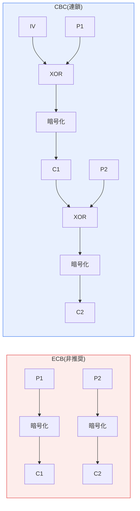

# ブロック暗号アルゴリズム(Block Cipher)

## 1. 概要

### A. 定義
> ブロック暗号とは、**平文を固定長のブロック(例:64ビット・128ビット)単位に分割し、一つの秘密鍵で各ブロックを暗号化・復号する共通鍵暗号方式**である。ビット・バイト単位で鍵ストリームを生成して逐次処理するストリーム暗号と対比される。

ブロック暗号が登場し、今日の暗号システムの根幹となった背景には、「**大量のデータを高速かつ安全に、そして標準化された方式で暗号化する**」という現実的な要請がある。1970年代以前、暗号は軍事・外交領域の非公開技術であったが、金融の電算化と商用通信が広がるにつれ、誰もが検証できる公開標準暗号が必要となった。米国NBS(現NIST)が1977年にDESを標準として採用したのがその出発点であり、その後のAES公募(1997~2001)を経て、ブロック暗号は「アルゴリズムは公開し、秘密は鍵のみ」というケルクホフスの原理の上で発展してきた。今日、TLSで保護されるWebトラフィック、ディスク全体暗号化(BitLocker・FileVault)、無線LAN(WPA2/3)、金融ICカードのデータ保護は、事実上すべてブロック暗号に依存している。

### B. 設計原理 — 混乱(Confusion)と拡散(Diffusion)
ブロック暗号の安全性を理解する最も根本的な概念は、クロード・シャノンが1949年に提示した**混乱(Confusion)と拡散(Diffusion)** である。混乱とは、暗号鍵と暗号文との統計的関係を可能な限り複雑にし、暗号文をいくら分析しても鍵のどのビットがどのように作用したかを推測しにくくする性質である。これは主に非線形置換関数である**S-box(Substitution box)** によって実現される。S-boxは入力ビットパターンを予測不能な出力パターンに変換する参照表であり、ここに線形性が少しでも残れば線形攻撃の手がかりとなるため、設計時に最も注力される部分である。

拡散とは、平文の1ビット(または鍵の1ビット)の変化が暗号文の多数のビットに広く波及する性質である。理想的には平文1ビットを反転させると暗号文ビットの約半分がランダムに変化すべきであり、これを**雪崩効果(Avalanche Effect)** と呼ぶ。拡散が十分であれば、攻撃者が平文・暗号文の組を大量に入手して統計分析を試みても規則性を見いだせない。拡散は主にビット位置を入れ替える転置(Permutation)と、行列積形式の拡散層によって実現される。

核心は、置換と転置を**複数のラウンド(round)にわたって繰り返す**点にある。一回の置換・転置だけでは混乱・拡散が不十分で分析にさらされるが、これを10回以上繰り返すと平文と暗号文の関係が十分に攪拌され、現実的な時間内での解読が不可能になる。例えばAES-128は10ラウンド、AES-256は14ラウンドを実行するが、ラウンド数は既知の最良の攻撃に対して十分な安全余裕(security margin)を確保するように決定される。

## 2. 全体構造の概念図

ブロック暗号は、元の鍵から各ラウンドで使用する**ラウンド鍵**を導出する鍵スケジュールと、そのラウンド鍵を用いてブロックを反復変換するラウンド関数とで構成される。以下の概念図は、平文ブロックがラウンドを経て暗号文になる全体の流れを示す。

ここで必ず押さえるべき点は、**鍵スケジュールの品質も安全性の一部**であるということである。ラウンド鍵同士が弱い相関関係を持つと関連鍵攻撃(related-key attack)の標的となるため、マスター鍵からラウンド鍵を導出する過程自体が非線形かつ予測不能でなければならない。実際、DESには少数の「弱鍵(weak key)」が存在し、暗号化と復号が同一になる問題が知られており、優れたブロック暗号はこうした例外的な鍵が存在しないように設計される。

## 3. 内部構造 — FeistelとSPN

ブロック暗号のラウンド関数を組織する代表的な方式は、**Feistel構造**と**SPN(Substitution-Permutation Network)構造**の二つである。両構造は「置換・転置を繰り返す」という目標は同じであるが、その配置方法が異なるため、実装の容易さと性能において異なる特性を生む。

**Feistel構造**は、ブロックを左右の半分(L, R)に分けた後、一方にのみラウンド関数Fを適用し、その結果をもう一方とXORしてから左右を交換する過程を繰り返す。この構造の実務上最大の利点は、**暗号化と復号の回路構造が同一**であることである。ラウンド鍵を逆順に入力するだけで同じハードウェア・ソフトウェアで復号できるため、実装コストが半減する。また、ラウンド関数F自体が逆関数を持つ必要がなく(XORで元に戻すため)、S-box設計の自由度が高い。DES、3DES、SEED、Blowfishがこの系統である。欠点は、1ラウンドでブロックの半分しか変換されないため、十分な拡散を得るには相対的に多くのラウンドが必要となる点である。

**SPN構造**は、ブロック全体に対して置換(S-box)層、転置・拡散層、ラウンド鍵XORを順に適用する。ブロック全体が毎ラウンド変換されるため、**拡散が速く並列化に有利**であり、現代CPUのSIMD命令や専用ハードウェアとの相性が良い。AES、ARIAが代表例である。その代わり、復号時にはS-boxと拡散行列の逆変換が必要となり、暗号化・復号の回路が互いに異なる。AESがソフトウェアとハードウェアの両面で非常に高速である理由は、まさにこのSPN構造の並列性と、後述するAES-NI命令のサポートにある。

両構造の違いが実務に与える含意は明確である。極度に制約された組込み環境や、暗号化・復号ロジックを一つに保たなければならない場合にはFeistelの対称性が有利であり、サーバ・モバイルのようにスループットが重要な環境ではSPNの並列性が有利である。

このほか、加算・ローテーション・XORのみでラウンド関数を構成する**ARX(Add-Rotate-XOR)** 構造が近年注目されている。S-box参照表を使わないためキャッシュタイミングのサイドチャネルに強く、ソフトウェア実装が軽量であることから、韓国の軽量暗号LEAやストリーム暗号ChaCha20がこの方式を採用している。構造の選択は結局、「安全余裕、実装対象プラットフォーム、サイドチャネル脅威」という三つの軸の折衷であり、唯一の正解が決まっているわけではない。

## 4. 主要アルゴリズムの変遷

ブロック暗号は、コンピューティング性能の発展と攻撃手法の進化に合わせて世代交代を重ねてきた。初期の標準である**DES**は64ビットブロックに実質56ビットの鍵を使用したが、発表当初から鍵長の短さが懸念されていた。実際、1998年にEFFが約25万ドルで製作した専用装置「Deep Crack」が56ビット鍵を56時間で全数探索(brute-force)により破ったことで、DESの寿命は事実上尽きた。これは「鍵空間2⁵⁶はもはや安全ではない」ことを実証した象徴的な出来事であった。

過渡的な代替として登場した**3DES(Triple DES)** は、DESを三つの鍵で三回(暗号化-復号-暗号化)適用し、有効鍵長を112ビットに引き上げた。安全性は確保されたものの、DESを3回実行するため速度は1/3に低下し、依然として64ビットブロックという根本的な限界(後述するSweet32攻撃にさらされる)を抱えていた。NISTはこうした理由から、3DESを2023年末以降の新規使用禁止対象と規定した。

ブロック暗号の安全性は単に鍵が長いことでは保証されず、既知の分析手法にどれだけ耐えられるかによって評価される。代表的な攻撃手法として、**差分攻撃(differential cryptanalysis)** は入力差分が出力差分へ伝播する確率的偏りを利用し、**線形攻撃(linear cryptanalysis)** は入力・出力・鍵ビット間の近似的な線形関係を統計的に蓄積して鍵を復元する。優れたブロック暗号は、S-boxと拡散層をこの二つの攻撃の成功確率が無視できるほど小さくなるように設計し、さらに十分なラウンド数で安全余裕を加える。AESが長期間の検証に耐えてきたのも、こうした分析への耐性が数学的に裏付けられていたからである。

現在の事実上の世界標準は**AES(Advanced Encryption Standard)** である。ベルギーの研究者が設計したRijndaelアルゴリズムが、5年間の公開公募・検証を経て2001年に標準として確定した。AESは128ビットブロックに128・192・256ビット鍵をサポートし、SPN構造により安全かつ高速である。20年以上にわたり世界中で集中的な分析を受けてきたが、全ラウンドに対する実用的な攻撃はいまだ発見されていない。韓国では、韓国型標準である**SEED**(1999、KISA開発、Feistel系、128ビット)と**ARIA**(2004、国家標準、SPN系、128ビット)が公共・金融分野で広く使用されている。軽量IoT環境向けの韓国製軽量ブロック暗号**LEA**(2013)も標準化されている。

| アルゴリズム | ブロック/鍵長(ビット) | 構造 | 特徴および現状 |
|---|---|---|---|
| **DES** | 64 / 56 | Feistel | 鍵が短い、1998年に全数探索で破られ、廃止 |
| **3DES** | 64 / 112·168 | Feistel | DES 3回、低速・64ビットの限界、2023年以降禁止 |
| **AES** | 128 / 128·192·256 | SPN | **現在の国際標準**、安全・高速、HW高速化 |
| **SEED / ARIA** | 128 / 128 | Feistel / SPN | 韓国標準(公共・金融) |
| **LEA** | 128 / 128·192·256 | ARX | 韓国製軽量、IoT・低電力環境 |

## 5. 暗号利用モード(Block Cipher Mode of Operation)

ブロック暗号自体は、固定長のブロック一つだけを変換する関数である。しかし現実のデータ(ファイル、通信パケット、データベースレコード)はブロック長よりはるかに長いため、複数のブロックを**どのように連結して暗号化するかを規定する利用モード**が必ず必要となる。同じAESを使っても利用モードの選択を誤れば安全性が崩れるため、実務ではアルゴリズムの選択に劣らず重要な決定である。

**ECB(Electronic Codebook)** は、各ブロックを独立に暗号化する最も単純なモードである。並列処理が可能という利点はあるが、**同じ平文ブロックは常に同じ暗号文ブロックになる**という致命的な弱点を持つ。このため、暗号化されたデータにも元のパターンがそのまま現れる。有名な「ECBペンギン」の例のように、ビットマップ画像をECBで暗号化すると色が変わるだけで形状はそのまま見える。したがってECBは実務では事実上使用禁止である。

**CBC(Cipher Block Chaining)** は、各平文ブロックを暗号化する前に**直前の暗号文ブロックとXOR**し、ブロック間に連鎖を作る。最初のブロックにはランダムな**初期化ベクトル(IV)** を使用するため、同じ平文でもIVが異なれば全く異なる暗号文となり、パターンが消える。ただし、IVは予測不能でなければならず(かつてのTLSにおけるBEAST攻撃は予測可能なIVを悪用した)、暗号化が逐次的であるため並列化が難しいという限界がある。

**CTR(Counter)** モードは、増加するカウンタ値を暗号化して鍵ストリームを生成し、平文とXORする方式であり、ブロック暗号をストリーム暗号のように使用する。各ブロックのカウンタが独立しているため、**暗号化・復号ともに完全な並列処理**が可能で、大容量・高速環境に適している。ただし、同じ(鍵、カウンタ)の組み合わせを二度使うと鍵ストリームが再利用されて致命的となるため、nonce管理が核心となる。

**GCM(Galois/Counter Mode)** は、CTRモードの機密性に**認証タグによる完全性・認証(AEAD)** を組み合わせた最新の標準である。暗号化と同時にデータが改ざんされていないことを検証する認証タグを生成するため、機密性と完全性を一度に提供する。TLS 1.3の必須暗号スイートがAES-GCM(とChaCha20-Poly1305)である理由はここにある。

| モード | 並列性 | 提供する性質 | 特徴および推奨 |
|---|---|---|---|
| **ECB** | 可能 | 機密性(不完全) | パターン露出、**使用禁止** |
| **CBC** | 復号のみ | 機密性 | IV必須、パディングオラクルに注意 |
| **CTR** | 完全 | 機密性 | nonce再利用禁止、高速 |
| **GCM** | 完全 | 機密性+完全性(AEAD) | **現代の推奨**、TLS 1.3必須 |

利用モードが安全性を左右することは、実際の攻撃事例によって裏付けられている。2016年に発表された**Sweet32**攻撃は、3DES・Blowfishの64ビットというブロック長そのものを狙ったもので、同じ鍵で約2³²ブロック(約32GB)を暗号化すると誕生日のパラドックスにより暗号文ブロックの衝突が発生し、平文の一部が復元されることを実証した。これはアルゴリズム自体ではなく、「短いブロック+長時間セッション」という組み合わせが脆弱性を生んだ事例であり、128ビットブロックのAESへ移行すべき強力な根拠となった。また、CBCモードのパディング処理の誤りを悪用した**パディングオラクル攻撃**(POODLEなど)は、誤った実装がいかに安全なアルゴリズムを無力化するかを示しており、これが業界がAEADモード(GCM)へ移行した背景である。

## 6. 深掘り — 標準動向と耐量子への備え

ブロック暗号をめぐる最新動向の第一の軸は、**軽量暗号(Lightweight Cryptography)** である。IoT・センサ・RFIDのように電力・ゲート数・メモリが極度に制限された機器ではAESでさえ重い場合があり、NISTは2023年、軽量暗号公募の最終標準として**ASCON**を選定した。ASCONは小型ハードウェアで効率的に動作するAEADを提供し、今後の産業用IoTセキュリティの基本構成要素になると見込まれる。韓国製のLEAも同じ問題意識から設計された。

第二の軸は**量子コンピューティングへの備え**である。よくある誤解とは異なり、量子コンピュータは共通鍵暗号を完全に無力化することはできない。公開鍵暗号(RSA・ECC)を事実上崩壊させるショア(Shor)のアルゴリズムとは異なり、共通鍵に適用される**グローバー(Grover)のアルゴリズム**は鍵の全数探索時間を平方根に短縮するにとどまる。すなわちAES-128は量子環境では実質的な安全性が約64ビット水準に低下するが、**AES-256は約128ビットの安全性**を維持するため、依然として安全と評価される。したがって実務上の対応は明確である — 共通鍵はAES-256へ鍵長を伸ばして備え、併用される鍵交換・署名用の公開鍵暗号はNISTが2024年に標準化したPQC(ML-KEM、ML-DSAなど)へ移行するハイブリッドなアプローチが推奨される。

第三の軸は**ハードウェア高速化とサイドチャネル防御**である。Intel・ARMなど現代のCPUは、AESラウンドを単一命令で処理する**AES-NI**(およびARMv8 Crypto Extension)を内蔵し、ソフトウェア実装に比べて数倍~数十倍の性能を実現するとともに、参照表アクセス時間の差を狙うキャッシュタイミング攻撃まで防御する。これは「AESは遅い」という過去の通念を覆し、全面暗号化(encryption everywhere)を現実のものとした中核的な基盤である。

## 7. 考慮事項および示唆

1. **アルゴリズムはAESを基本としつつ、利用モードまで併せて設計しなければならない。** 新規システムはAES-256/GCM(またはChaCha20-Poly1305)を基本とし、レガシーのDES・3DES・RC4・ECBは移行対象として管理する。「AESを使っている」というだけでは安全を保証できず、ECBの使用やnonce再利用といったモードの誤用が実際の事故の主な原因であることを認識すべきである。

2. **鍵管理(Key Management)はアルゴリズムの選択より重要になり得る。** どれほど強力なAESでも、鍵がソースコードにハードコーディングされたり安全でない方法で保存されたりすれば無意味である。HSM(ハードウェアセキュリティモジュール)・KMSによる鍵の生成・保管・定期的な更新(rotation)・廃棄の全ライフサイクル管理と、データ暗号化鍵(DEK)を鍵暗号化鍵(KEK)で包むエンベロープ暗号化(envelope encryption)の設計が実務の核心である。

3. **性能とセキュリティのトレードオフは、ハードウェア高速化によって相当程度解消された。** AES-NIが普及したサーバ・モバイルでは全面暗号化の性能負担はごくわずかであり、「性能のために暗号化を省略する」という論理はもはや成り立たない。ただし極低電力のIoTでは、ASCON・LEAのような軽量暗号を別途検討するリスクベースのアプローチが必要である。

4. **耐量子への移行は、共通鍵と公開鍵を分離して段階的にアプローチする。** 共通鍵はAES-256へ鍵長を引き上げて備え、脆弱な公開鍵領域はPQCへ優先的に移行するハイブリッド戦略を策定する。「今収集し、後で復号する(harvest now, decrypt later)」脅威を考慮すれば、長期的な機密性が必要なデータほど移行の優先順位を高めるべきである。

5. **標準準拠と検証を制度化する。** 韓国の公共・金融ではSEED・ARIA・AESなど検証済み暗号モジュール(KCMVP)の使用が求められるため、独自実装よりも検証済みのライブラリ・モジュールを採用し、暗号アルゴリズムの陳腐化に備えてアルゴリズムを容易に置き換えられる暗号アジリティ(crypto-agility)アーキテクチャを設計に反映する。

## 参考資料
- NIST FIPS 197, Advanced Encryption Standard (AES): https://csrc.nist.gov/pubs/fips/197/final
- NIST SP 800-38A, Block Cipher Modes of Operation: https://csrc.nist.gov/pubs/sp/800/38/a/final
- NIST Lightweight Cryptography (ASCON): https://csrc.nist.gov/projects/lightweight-cryptography
- KISA 暗号利用案内(SEED・ARIA・LEA): https://seed.kisa.or.kr/

---

> **一言まとめ**: ブロック暗号は、平文を固定ブロック単位で*混乱・拡散*を複数ラウンド反復適用する共通鍵暗号であり、Feistel・SPN構造の上でAESが事実上の標準となった。ECB(脆弱)・CBC・CTR・GCMなどの利用モードの選択と鍵管理が安全性を左右するため、新規システムはAES-256/GCMと完全性の結合(AEAD)・耐量子への備えを基本戦略とすべきである。
