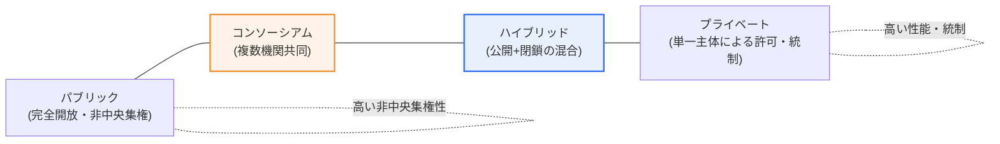
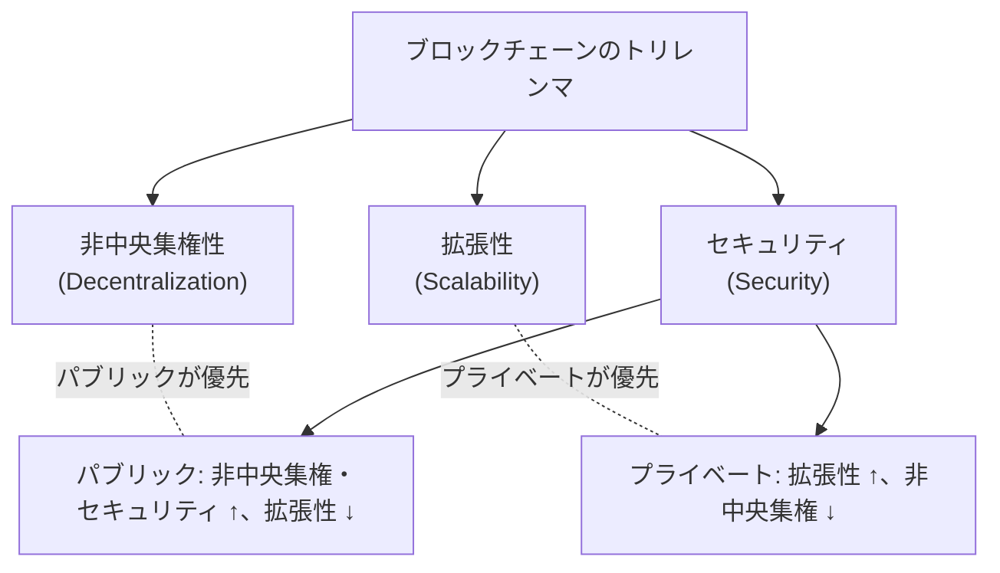

# ブロックチェーンの類型 — パブリック・プライベート・ハイブリッド

## 1. 概要

### A. 概念
> ブロックチェーンは、**ネットワークへの参加・検証(合意)の権限を誰に、どの程度開放するか**によって、**パブリック(公開)・プライベート(閉鎖)・ハイブリッド(混合)** に分けられる。開放性(非中央集権性)と、統制・性能・プライバシーとの間のトレードオフが類型を分ける。

ブロックチェーンの類型が分かれる根本的な理由は、「**完全な非中央集権化と、実用的な性能・統制を同時に最大化することは難しい**」という構造的な相反にある。ブロックチェーンの理想的な原型は、誰もがノードとして参加して取引を検証する完全開放・非中央集権型のネットワーク、すなわち**パブリック**ブロックチェーンである。ビットコイン・イーサリアムが代表例であり、特定主体の許可なしに参加できるため、検閲耐性と透明性に優れる。しかし、匿名の多数が合意に参加する代償として処理速度が遅く、すべての取引が公開され、企業が求めるアクセス制御・データプライバシーを確保することが難しい。

企業・金融が実際に必要とするものは、その正反対に近い。高速な処理、許可された参加者のみによる閉鎖的な運用、規制遵守のためのデータ統制である。この要求から、参加を制限した**プライベート**ブロックチェーンが生まれた。性能・統制・プライバシーは向上したが、少数のノードが支配するため、非中央集権性と検閲耐性は弱まる。結局、両極端はそれぞれ異なる価値を最適化したものであって、どちらか一方が優れているわけではない。この両者の長所を状況に応じて取捨選択しようとする折衷が**ハイブリッド**(一部は公開、一部は閉鎖)である。すなわち類型の選択は「技術の優劣」ではなく「**公開された信頼 対 企業の効率**」という目的の問題であり、開放性と統制の均衡点をどこに置くかという問題に帰結する。

### B. 区分基準
類型を分ける軸はいくつかに整理される。**参加の開放性**(誰でも vs 許可された者のみ)、**検証・合意の権限**(不特定多数 vs 指定ノード)、**合意アルゴリズム**(PoW/PoSなどの確率的合意 vs BFT系の決定的合意)、**処理性能(TPS)**、そして**匿名性・透明性**(全面公開 vs 選択的公開)である。これらの軸は互いに連動する。例えば参加を開放するほど合意参加者が増えて非中央集権性は高まるが、性能は低下する。類型ごとの特性は、これらの軸の組み合わせによって説明される。

## 2. 類型の構造と比較

三つの類型は「開放↔統制」という一つのスペクトラム上に位置づけられる。パブリックが一方の端(完全開放)であれば、プライベートは反対側の端(完全統制)であり、ハイブリッド・コンソーシアムはその間に分布する。

### A. パブリックブロックチェーン — 開放と信頼の極
パブリックブロックチェーンは、インターネットに接続された誰もがノードとして参加し、台帳をダウンロードして取引を検証できる完全開放型である。信頼の源泉が特定の機関ではなく「多数による相互検証と経済的インセンティブ」にある点が本質である。プルーフ・オブ・ワーク(PoW)やプルーフ・オブ・ステーク(PoS)のような合意メカニズムが匿名の参加者に誠実な行動を促し、その結果、中央管理者なしでも改ざんが事実上不可能な台帳が維持される。

この構造の強みは**検閲耐性と透明性**である。誰も特定の取引を恣意的に阻止したり取り消したりできず、すべての取引が公開されるため監査・検証が自由である。しかし、同じ構造が弱点の原因でもある。すべてのノードが同一の検証を繰り返すため、秒間処理量(TPS)が低く確定に時間がかかり、PoWの場合は膨大な電力を消費する。また、すべてのデータが公開されるため、営業秘密・個人情報を扱う企業業務にはそのまま使うことが難しい。すなわちパブリックは、「公開された信頼が価値の核心」である領域に最適化されている。

### B. プライベートブロックチェーン — 統制と効率の極
プライベートブロックチェーンは、単一の組織が参加・検証の権限を統制する閉鎖型である。許可されたノードのみが台帳を保有・検証するため、信頼の源泉が「不特定多数」から「すでに信頼関係のある指定参加者」へと変わる。これにより合意には少数のノードが参加すれば済むため処理速度が速く、データアクセスをきめ細かく統制でき、規制が求める監査・権限管理が容易になる。

代表的な技術として、Hyperledger Fabric(ハイパーレジャー・ファブリック)のように許可型(permissioned)台帳を志向するプラットフォームがある。プライベートの強みは明確に「**性能・プライバシー・規制遵守**」である。一方、少数が台帳を支配するため非中央集権性と検閲耐性は弱く、極端な場合は管理主体が記録を改ざんする余地もあるため、「なぜわざわざブロックチェーンなのか、分散DBと何が違うのか」という根本的な問いが常につきまとう。それでも、複数の参加者が改ざん不可能な台帳を共同で共有するという点で、単一DBよりも相互信頼・監査可能性が高いという実務的価値は認められている。

### C. ハイブリッド・コンソーシアム — 折衷のスペクトラム
ハイブリッドブロックチェーンは、一つのシステムの中で一部のデータ・機能は公開(パブリック)で、一部は閉鎖(プライベート)で運用し、両者の長所を組み合わせようとする形態である。例えば、機微な原本データは閉鎖台帳に置きつつ、そのデータの完全性証明(ハッシュ)のみを公開チェーンにアンカリングし、「外部からの検証可能性」と「内部のプライバシー」を同時に得るといった方式である。

一方、複数の機関が検証ノードを分担して共同運用する**コンソーシアム(consortium)ブロックチェーン**は、しばしばプライベートの一形態(部分的非中央集権)に分類され、ハイブリッドとともにスペクトラムの中間を埋める。単一企業ではなく銀行・物流企業・病院など複数の主体が対等に台帳を運用するため、純粋なプライベートよりも非中央集権性が高く、特定主体による改ざんリスクが低い。すなわち、開放性の度合いを「完全開放」と「単一統制」の間で細かく調整したものがハイブリッド・コンソーシアムであり、実際の企業導入の多くはこの中間地帯で行われている。

三つの類型(およびコンソーシアム)の特性を軸ごとに比較すると次のとおりである。この表は、前述した「開放性↔統制・性能」の相反が各軸でどのように現れるかを整理したものである。

| 区分 | パブリック | プライベート | コンソーシアム | ハイブリッド |
|---|---|---|---|---|
| **参加** | 誰でも | 単一主体の許可 | 指定機関 | 混合(部分開放) |
| **非中央集権性** | 高い | 低い | 中程度 | 中程度 |
| **性能(TPS)** | 低い | 高い | 高い | 中~高 |
| **透明性** | 完全公開 | 制限 | 参加機関で共有 | 選択的公開 |
| **合意** | PoW・PoSなど確率的 | 少数ノード(BFTなど) | BFT系 | 混合 |
| **例** | ビットコイン・イーサリアム | Hyperledger Fabric | 金融・物流コンソーシアム | 公開+閉鎖の混合応用 |

## 3. 合意・トリレンマの観点からの理解

類型選択の背後には、合意アルゴリズムと拡張性の問題がある。パブリックが用いるPoW・PoSは、匿名の多数の間でも合意が可能となるよう設計されているため検閲耐性が高いが、確定性が確率的で遅い。一方、プライベート・コンソーシアムがよく用いるBFT(ビザンチン障害耐性)系の合意は、参加ノードが既知で数が少ない場合に、高速かつ即時の確定を提供する。すなわち「参加者が誰かを知っているか」が合意方式と性能を決定し、それがさらに類型を規定する。

いわゆる**ブロックチェーンのトリレンマ**とは、非中央集権性・拡張性・セキュリティの三つを同時に最大化することは難しいという命題である。パブリックは非中央集権性とセキュリティを選ぶ代わりに拡張性を犠牲にし、プライベートは拡張性を選ぶ代わりに非中央集権性を犠牲にする。この相反を緩和しようとする試みが、レイヤー2(Layer 2)・シャーディングのような拡張技術と、公開・閉鎖を組み合わせるハイブリッド設計である。したがって類型選択は、トリレンマの上で「何を諦められるか」を決める意思決定と見ることができる。

この観点からよく提起される実務的な問いが、「プライベートブロックチェーンは結局、分散データベースと何が違うのか」である。答えは「信頼の分散の度合い」にある。分散DBは単一の管理主体が一貫性に責任を持つのに対し、コンソーシアム・プライベートブロックチェーンは、互いを完全には信頼していない複数の主体が合意によって台帳を共同で確定する。したがって参加者がすべて一つの組織であればブロックチェーンよりも分散DBの方が単純・効率的であり、参加者間で利害が対立したり相互監査が必要であったりする場合に、ブロックチェーンの共同検証・改ざん防止が正当化される。すなわち類型選択に先立ち、「そもそもブロックチェーンが必要か」という前提判断がなければならない。

また、類型は固定不変ではなく進化する。初期には統制・性能のためにプライベートとして出発し、参加機関が増えるにつれてコンソーシアムへと開放の幅を広げ、外部検証の需要が生じると完全性証明を公開チェーンにアンカリングするハイブリッドへ移行する経路がよく見られる。このように開放性は、サービスの成長段階と利害関係者の構成に応じて調整される設計変数であり、最初に一度決めて終わる定数ではない。

## 4. 活用分野と事例

各類型は、求められる信頼モデルに応じて適した領域がはっきりと分かれる。以下の表と説明では、「なぜその分野にその類型が適しているのか」を併せて検討する。

| 類型 | 適した分野 | 選択理由 |
|---|---|---|
| **パブリック** | 暗号資産・NFT・公開検証サービス | 検閲耐性・公開された信頼が価値の核心 |
| **プライベート** | 企業内部・金融決済・サプライチェーン | 性能・プライバシー・規制遵守を優先 |
| **コンソーシアム** | 銀行間決済・貿易金融・物流 | 複数機関による共同の信頼、単一主体の改ざん防止 |
| **ハイブリッド** | 医療・行政など公開・非公開が混在 | 完全性証明は公開、原本は閉鎖 |

第一に、**金融・貿易分野**はコンソーシアム・プライベートの代表的な舞台である。複数の銀行・企業が共同で台帳を運用すると照合(reconciliation)のコストと時間が大幅に削減され、従来は数日かかっていた貿易金融・国境を越えた決済を大きく短縮できるという実証が報告されてきた。参加機関が対等に検証するため、単一機関による改ざんリスクも低い。

第二に、**サプライチェーン管理**では、原産地・流通履歴を改ざん不可能な形で記録してトレーサビリティを確保するために、プライベート・コンソーシアムブロックチェーンが活用される。食品・医薬品のように履歴の信頼性が重要な産業で、リコール対象の追跡時間を劇的に短縮した事例が知られている。

第三に、**公共・医療行政**はハイブリッドが有効な領域である。個人情報・診療記録のような機微データは閉鎖台帳に保管しつつ、そのデータが改ざんされていないという証明は公開チェーンに残して市民・監督機関が検証できるようにすれば、プライバシーと透明性を同時に満たすことができる。

第四に、**資産トークン化・NFT**のように公開検証が本質であるサービスでは、パブリックが事実上唯一の選択肢である。所有権の移転が特定機関の許可なしに成立し、誰もがその履歴を検証できてはじめて価値が生まれるからである。逆に、同じ資産であっても機関内部の清算・決済記録のように対外公開が不適切な部分はプライベートで処理する混合設計がよく見られる。このように、一つのサービスの中でも「公開が価値となる部分」と「統制が価値となる部分」を分けて類型を組み合わせることが、実務の核心的な感覚である。

## 5. 深掘り — 相互運用性・規制動向および予想出題方向

ブロックチェーンの類型に関する議論は、単一チェーンの選択を超えて「**異なるチェーンをどのように接続するか**」へと拡張されている。企業がそれぞれプライベート・コンソーシアムチェーンを構築するにつれ、それらの間での資産・データ移動のための**インターチェーン(クロスチェーン)相互運用性**が、実務普及の鍵として浮上した。異なる台帳の間をつなぐブリッジ・リレー技術が研究されているが、この接続部はセキュリティ事故が頻発する箇所でもあり、慎重な設計が求められる。

これと併せて、「どの程度の非中央集権性が本当に必要か」についての再評価も進んでいる。初期には完全な非中央集権(パブリック)が理想とされたが、実際の企業サービスでは規制遵守・性能・運用責任の所在のために、統制可能な中間地帯(コンソーシアム・ハイブリッド)がむしろ支配的に採用される傾向が顕著である。すなわち市場は「最大限の非中央集権」ではなく「目的に必要な分だけの非中央集権」へと収束しており、これは類型の議論がイデオロギー論争から実用的な設計へと移りつつあることを示している。

規制面では、個人情報保護が核心的な争点である。「一度記録されれば消せない」というブロックチェーンの不変性は、「削除権(忘れられる権利)」を保障する個人情報規制と正面から衝突する。このため、個人情報の原本はチェーン外(off-chain)に置き、参照・ハッシュのみをオンチェーンに残す設計、あるいは最初から統制可能なプライベート・ハイブリッドを選ぶ流れが強まっている。近年では、自己主権型アイデンティティ(SSI)・ゼロ知識証明(ZKP)のように「公開せずに証明する」技術が、プライバシーと検証可能性の折衷案として注目されている。

技術士の観点からの予想出題方向は、おおむね三つに分かれる。①三つの類型の特性・合意・トリレンマを比較し、適用分野を論じさせる類型、②特定の産業(金融・サプライチェーン・医療など)にどの類型が適しているかを根拠とともに設計させる類型、③個人情報規制・相互運用性のような導入の阻害要因とその解消策を問う類型である。答案は「類型の羅列」にとどめず、「開放性↔統制のトレードオフ」という一本の軸で貫いて記述することが高得点の戦略である。

## 6. 考慮事項および示唆(技術士の観点)

1. **目的に基づく類型選択が最優先である。** 公開された信頼・検閲耐性が価値の核心であればパブリック、性能・プライバシー・規制遵守が重要であればプライベート、複数機関の共同の信頼が必要であればコンソーシアム、公開・非公開が混在するのであればハイブリッドを選ぶ。「ブロックチェーンだから無条件にパブリック」というアプローチは失敗しやすい。

2. **トリレンマの中で優先順位を明示しなければならない。** 非中央集権性・拡張性・セキュリティを同時に最大化することはできないため、どの価値を守り、何をレイヤー2・オフチェーンなどで補完するかを設計段階で明確に決めておく必要がある。

3. **個人情報・規制との整合性が導入の実質的な関門である。** 不変性と削除権の衝突、データの国外移転、監査要件を考慮し、オン・オフチェーン分離設計、統制型の類型選択、ZKP・SSIのようなプライバシー保護技術の併用を検討すべきである。

4. **相互運用性とガバナンスが普及を左右する。** チェーン間連携(インターチェーン)のセキュリティ、コンソーシアム参加機関間の権限・紛争処理ルール(ガバナンス)、標準化の水準が、実際のサービスの持続可能性を決定する。技術の選択と同じくらい、参加者間の合意・運用体制の設計が重要であることを強調する必要がある。

## 参考資料
- Hyperledger Foundation — https://www.hyperledger.org/
- Ethereum, "Blockchain layers & scalability" — https://ethereum.org/en/developers/docs/scaling/

---

> **一言まとめ**: ブロックチェーンは開放性に応じて*パブリック(開放・非中央集権)・プライベート(許可・統制)・コンソーシアム・ハイブリッド(混合)* に分けられ、非中央集権性と性能・統制・プライバシーのトレードオフ(トリレンマ)の上で目的に合った類型を選択し、規制・相互運用性を併せて設計することが核心である。
