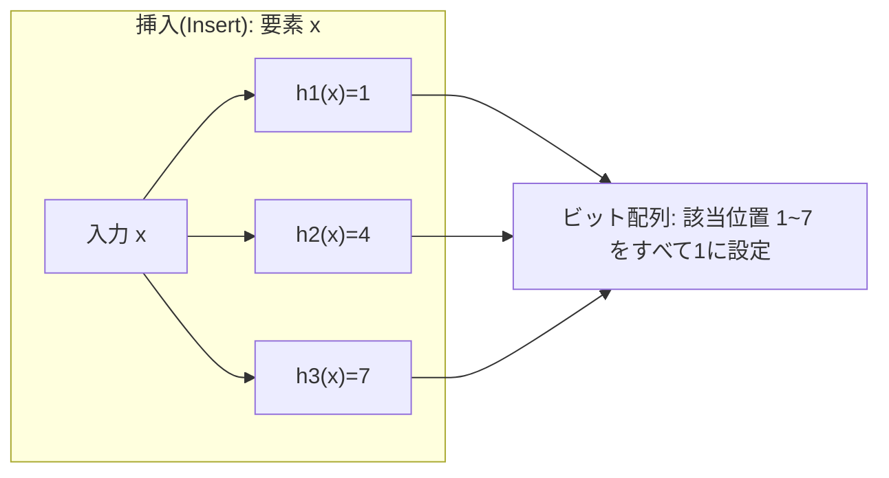
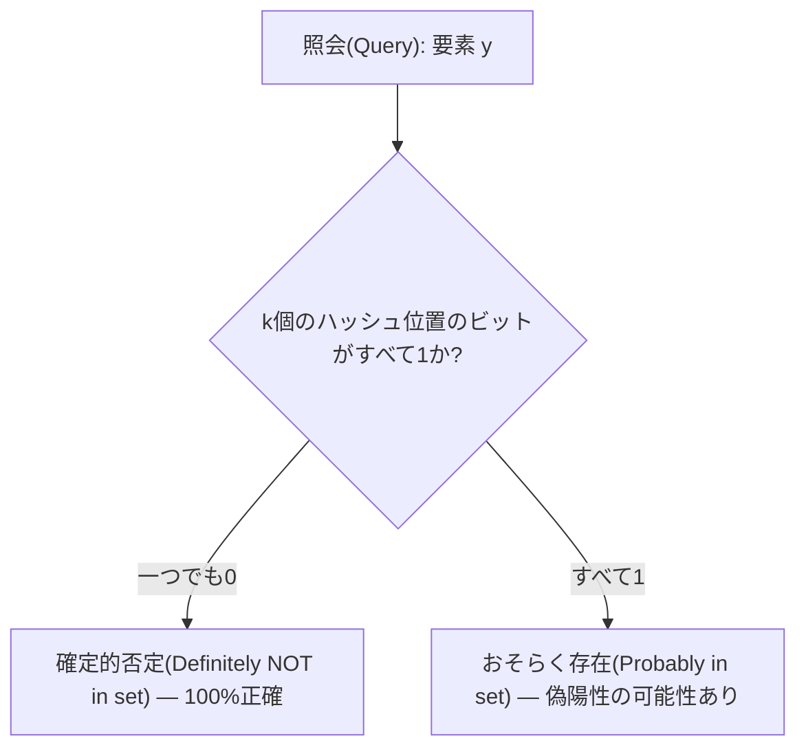

# ブルームフィルタ(Bloom Filter)

## 1. 概要

### A. 定義

> **ブルームフィルタ(Bloom Filter)**とは、要素が特定の集合に属するかを判定するために、mビットのビット配列とk個の独立したハッシュ関数のみで構成される**確率的(probabilistic)データ構造**であり、「存在しない(negative)」は常に正確である一方、「存在する(positive)」については一定確率の**偽陽性(False Positive)**を許容する代わりに、極めて少ないメモリで集合への所属を検査する手法である。

ブルームフィルタは1970年にBurton H. Bloomが提案したデータ構造であり、「この要素は集合に存在するか?」という**メンバーシップ問い合わせ(membership query)**を、要素そのものを保存せずに解決する。ハッシュセット(HashSet)が要素全体を保持して正確な答えを返す代わりにO(n)のメモリを消費するのとは異なり、ブルームフィルタは要素を保存せず**数ビットを立てるだけで**所属の痕跡を残すため、数百万~数億個の要素を扱う場合にメモリを数十倍以上節約できる。このため、「偽陽性は許容できるが、メモリ・速度は譲れない」大規模システムの前処理フィルタとして広く使われている。

### B. 登場背景と必要性

大規模データシステムにおいて最も高価な演算は**ディスク・ネットワークアクセス**である。例えば、LSMツリーベースのデータベース(Cassandra・HBase・RocksDB)は、一つのキーを読むためにディスク上の数十個のSSTableを探索しなければならない場合があるが、大半のSSTableにはそのキーが**存在しない**。存在しないキーを確認するために毎回ディスクを読むのは莫大な無駄である。Webクローラが「すでに訪問したURLか」を判別したり、CDNが「キャッシュにあるコンテンツか」を確認したり、パスワードシステムが「漏えいしたパスワード一覧に含まれるか」を検査したりする状況も本質は同じである — **大半の答えが「存在しない」である大量の問い合わせ**を、原本を探索する前に安価にふるい落とす必要がある。

このとき、正確な集合(ハッシュセット・Bツリー)を丸ごとメモリに載せる方式は、データが大きくなるとメモリの限界に突き当たる。ブルームフィルタは**「存在しない」という判定については100%正確**であるという性質を利用し、原本へのアクセスが不要な大多数の否定(negative)問い合わせをメモリ内で即座に遮断する。「存在する」と出た少数の場合にのみ実際の原本を確認すればよいため、高価なアクセス回数を劇的に削減する。偽陽性が発生しても原本をもう一度確認して誤答を取り除くため**最終的な正確性は維持**され、その分の無駄な作業が追加されるだけであるという点が、実務で採用される根拠である。

## 2. 構造と動作原理

ブルームフィルタは、①すべて0で初期化された**mビットのビット配列**と、②入力を[0, m-1]の範囲の整数に写像する**k個の異なるハッシュ関数** h₁, h₂, …, h_k で構成される。挿入と照会は同じk個のハッシュ位置を使用する。

**挿入演算**は、要素xに対してk個のハッシュ関数をすべて計算し、その結果が指すk個のビット位置を**1に設定(set)**する。すでに1であればそのままにする。要素そのものはどこにも保存されず、「立てられたビットの痕跡」だけが残る。複数の要素が同じビットを共有(重複)し得る点が、メモリ節約の源泉であると同時に偽陽性の原因でもある。

**照会演算**は、問い合わせ要素yに対して同じk個のハッシュ位置を計算したうえで、その位置のビットを検査する。判定規則は次のとおりである。

k個の位置のうち**一つでも0であれば**、その要素は挿入されたことがないと**確定**する(挿入されていればすべて1のはずであるため)。これが、ブルームフィルタが**偽陰性(False Negative)を決して出さない**理由である。逆にk個が**すべて1であれば**「おそらく存在」と判定するが、これらのビットが実際にはyによるものではなく、**他の要素が偶然同じ位置を立てていた**ためにすべて1になっている可能性がある。この場合がまさに偽陽性である。

一つの構造的な限界は、**標準ブルームフィルタでは削除が不可能**な点である。特定のビットを0に戻すと、そのビットを共有していた他の要素まで「存在しない」と誤判定(偽陰性)され得るからである。削除が必要な場合は、各位置を1ビットではなく小さなカウンタとする**カウンティングブルームフィルタ(Counting Bloom Filter)**を使用する。

## 3. 偽陽性確率とパラメータ設計

ブルームフィルタ設計の核心は、ビット配列サイズm、ハッシュ数k、要素数nの関係によって決まる**偽陽性確率p**を目標値以下に合わせることである。n個の要素を挿入した後に任意のビットが依然として0である確率は約 (1 − 1/m)^(kn) ≈ e^(−kn/m) であり、ここから偽陽性確率は次の近似式で与えられる。

> **p ≈ (1 − e^(−kn/m))^k**

この式からはいくつかの直観が得られる。第一に、ビット配列が大きいほど(m↑)ビットの衝突が減り、pは低下する。第二に、ハッシュ数kは**少なすぎると**識別力が弱く、**多すぎると**ビットを過度に埋めてかえって衝突が増えるため、m/nが与えられたときにpを最小化する最適値が存在する。最適なハッシュ数は **k = (m/n)·ln2 ≈ 0.693·(m/n)** であり、このとき要素1個あたりに必要なビット数は **m/n ≈ −1.44·log₂(p)** と整理される。

具体的な数値で感覚をつかむと、設計の勘所が明確になる。目標偽陽性率p=1%(0.01)を望むなら、要素あたり約**9.6ビット**(≈1.2バイト)、ハッシュ関数は約7個が必要である。つまり**1,000万個**のURLを1%の誤検知で管理するには、約9.6×10⁷ビット ≈ **約12MB**で十分である。同じ1,000万個のURLを平均50バイトの文字列としてハッシュセットに保存すると最低でも数百MBを要するのと比べれば、**数十倍のメモリ削減**が確認できる。目標をp=0.1%に下げると要素あたり約14.4ビットに増えるため、正確度とメモリは**対数スケールのトレードオフ**関係にあることがわかる。

## 4. 活用事例と類似手法の比較

ブルームフィルタは「否定問い合わせを安価にふるい落とす」という性質のおかげで、多くの産業システムのクリティカルパスに組み込まれている。代表的には、**Google Bigtable・Apache Cassandra・HBase・RocksDB**は各SSTableごとにブルームフィルタを置き、存在しないキーに対するディスク読み取りの大部分を省略することで、読み取り遅延を大きく低減している。**Webブラウザのセーフブラウジング(Google Safe Browsing)**は、数百万件の悪性URL一覧をブルームフィルタとしてクライアントに配布してローカルで一次判別し、「危険の可能性あり」と出た少数のみをサーバに再確認する。また、**パスワード漏えい検査・スパムフィルタ・ネットワークルータの重複パケット検出・分散キャッシュの存在有無の事前検査**にも広く使われている。

同様の目的を持つデータ構造と比較すると、選択基準が明確になる。核心は**正確性・メモリ・機能(削除・個数)**のトレードオフであり、「何を譲れるか」によって答えが変わる。

| 区分 | ブルームフィルタ | ハッシュセット(HashSet) | カウンティングブルームフィルタ | カッコウフィルタ(Cuckoo Filter) |
|------|-----------|-----------------|------------------|--------------------------|
| 要素の保存 | しない(ビットのみ) | 要素全体を保存 | しない(カウンタ) | フィンガープリント(fingerprint)のみ保存 |
| メモリ | 非常に小さい | 大きい | ブルームの3~4倍 | 小さい(ブルームと同程度) |
| 偽陽性 | あり | なし | あり | あり |
| 偽陰性 | なし | なし | なし | なし |
| 削除 | 不可 | 可能 | 可能 | 可能 |

ハッシュセットは正確であるがメモリコストが大きく大規模用途には不向きであり、削除が必要であればカウンティングブルームフィルタが、削除と低い誤検知を同時に望みつつメモリも節約したいならカッコウフィルタが代替となる。逆に、**挿入のみでメモリを極限まで節約したい**静的・追記専用(append-only)のシナリオでは、依然として標準ブルームフィルタが最も単純かつ効率的である。

## 5. 考慮事項および示唆

ブルームフィルタを実務に適用する際には、以下を技術士の観点から総合的に考慮すべきである。

- **誤検知の許容性の判断が先行しなければならない。** ブルームフィルタは、偽陽性時に原本をもう一度確認する**2段階検証**を前提とする。誤検知がそのまま誤った結果につながる(再確認経路のない)ドメインには不適であり、必ず「陽性判定 → 原本確認」のフォールバック経路を併せて設計しなければならない。

- **パラメータを予想要素数nに合わせて事前に算定しなければならない。** 標準ブルームフィルタはサイズが固定であるため、実際のnが設計上の想定を超えるとビットが飽和し、偽陽性率が急激に上昇する。要素数が不確実であったり増え続けたりする場合は、容量が満たされると新しいフィルタへ拡張される**拡張型(Scalable Bloom Filter)**を検討する。

- **削除・更新の要件を初期に確定しなければならない。** 標準型は削除できないため、要素が時間とともに削除されるワークロード(例:TTLキャッシュ)には、カウンティングブルームフィルタやカッコウフィルタが適している。選択を誤ると、後からデータ構造全体を置き換えなければならなくなる。

- **ハッシュ関数の品質・独立性が性能を左右する。** k個のハッシュが互いに相関すると、ビットが偏って理論上の偽陽性率より悪化する。実務では、MurmurHash・xxHashのような高速な非暗号学的ハッシュ一つから二つの値を取り出し、**ダブルハッシング(double hashing)**でk個を生成する手法が広く使われている。ただし、悪意ある入力がハッシュ衝突を誘発し得るセキュリティ上敏感な環境では、鍵付きハッシュを検討する。

- **分散環境における同期・シリアライズのコストを考慮する。** ノード間でフィルタを共有・統合する際には、ビットOR演算で容易に合成できるという利点があるが、大容量フィルタのネットワーク転送・バージョン管理のコストが発生するため、更新周期と伝播方式を併せて設計しなければならない。

総合すると、ブルームフィルタは「正確性の一部(偽陽性)を差し出し、メモリ・速度という実質的な利得を得る」**工学的近似(approximation)の典型**である。データ規模が爆発的に増えるAI・ビッグデータ環境において、原本アクセスを減らす事前フィルタとしてのその価値はむしろ高まっており、求められる誤検知の許容性・削除の有無・要素数の変動性を基準に、標準型・カウンティング型・カッコウフィルタ・拡張型のうち適切な変種を選択することが設計の核心である。

---

> **一言まとめ**: ブルームフィルタは、mビット配列とk個のハッシュで集合への所属を判定する確率的データ構造であり、「存在しない」は100%正確で「存在する」にのみ偽陽性を許容する代償として、極少量のメモリで大規模なメンバーシップ問い合わせを安価にふるい落とす手法である。
