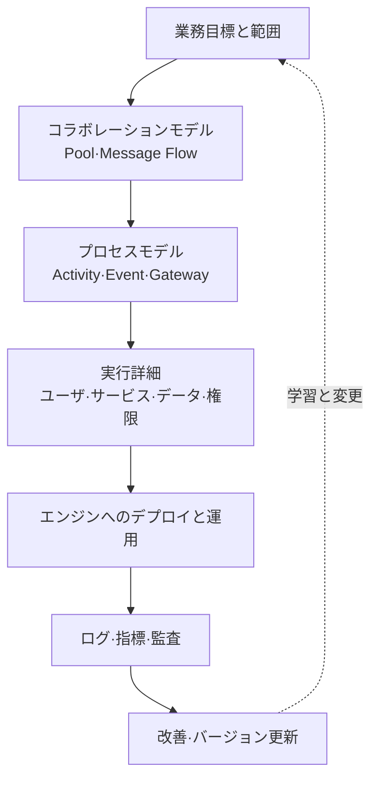
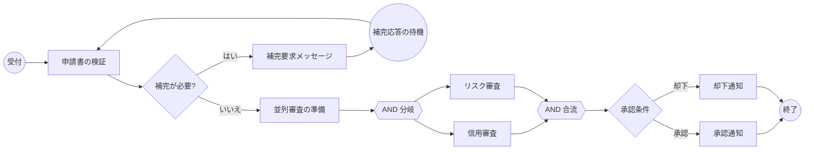

# BPMN 2.0に基づく業務プロセスモデリングと実行

## 1. 概要

> **定義**: BPMN(Business Process Model and Notation)とは、業務プロセスの流れ・参加者・メッセージ・例外・データを共通のグラフィカル表記と実行セマンティクスで表現し、業務部門の理解とプロセス自動化とを結び付けるOMG標準である。

組織の業務は、人の意思決定、システム呼び出し、外部機関とのメッセージ交換、時間の経過、例外処理が組み合わさった流れとして動いている。
業務を自然言語の議事録や単純なフローチャートとしてのみ残すと、担当者ごとに解釈が異なり、自動化の段階では「誰が何をいつ完了したとみなすのか」を改めて定義しなければならない。
BPMNは、こうした断絶を減らすため、業務ユーザが読める表記と、プロセスエンジンが解釈できる構造とを一つのモデルの中に収める。

BPMNは、特定のソリューションやワークフロー製品の画面設計ではない。
標準モデルはプロセスの意味を表現するが、実際に実行するためには、組織の業務ルール、データスキーマ、ユーザ権限、エンジンのサポート範囲、モニタリング体制を別途決定しなければならない。
したがって技術士の答案では、記号を列挙するだけで終わらせず、**業務目標と利害関係者のモデルを実行可能な制御フローへ変換する方法**として説明すべきである。

OMGの正式なBPMN 2.0.2文書は、業務ユーザが理解できる表記と、プロセス定義の実行セマンティクス・交換形式とを併せて扱うことを目標としている。
BPMNの利点は、事業部門がプロセスの責任と分岐をレビューでき、開発・運用部門がメッセージ・タイマー・例外を設計根拠として活用できる点にある。
逆に、標準のすべての記号を一枚の図に使うと可読性が急激に低下するため、利害関係者のレベルに合わせてモデルを階層化する必要がある。

### 1.1 登場背景と必要性

従来の業務分析は、インタビュー、文書化、システム開発が順番に進められることが多かった。
この方式では正常フローは残しやすいが、担当者の承認遅延、外部応答のタイムアウト、再審査、取消しや補償といった現実の変形を見落としやすい。
特に金融審査、調達、行政手続、医療予約のように複数の組織とシステムを経由する業務は、一部門のフローチャートだけでは全体の責任を説明できない。

BPMNは、活動を遂行する主体とプロセスの流れを分離し、プール(pool)・レーン(lane)によって組織の責任を明示し、メッセージフローによって参加者間の非同期的な相互作用を表示する。
条件分岐にはデータベースのゲートウェイを、外部応答を待つ地点にはメッセージイベントを、期限にはタイマーイベントを用いる。
こうすることで、「業務が順番に進む」という抽象的な説明が、「どのシグナルが入ると、どの責任者がどの条件で次の状態を作るのか」という運用設計へと具体化される。

### 1.2 目標と非目標

BPMNモデルの目標は、プロセスの開始・終了、活動、責任、分岐・合流、外部との相互作用、例外と成果測定ポイントを一貫した言語で合意することである。
実行モデルであれば、各活動の入力・出力データ、ユーザ割当てまたはサービス呼び出し、リトライ・補償ポリシー、権限と監査証跡まで結び付けられていなければならない。
分析モデルであれば、すべての技術的詳細を入れるよりも、ボトルネックと責任境界を明らかにすることに集中する。

BPMNは、組織図、データベースのERD、API仕様、プロジェクトスケジュールを代替するものではない。
また、一つのBPMN図が組織のあらゆる例外を永遠に説明するという意味でもない。
プロセスは政策・法令・商品・システムの変化に応じてバージョンが変わるため、モデルの所有者と変更承認手続を定めて継続的に管理しなければならない。

## 2. 全体構造と中核原理

### 2.1 モデルの階層

BPMNは、一つの図にすべての情報を詰め込むのではなく、利害関係者と目的に応じて抽象化レベルを分ける。
上位レベルでは顧客の要求から結果までの協調と主要なマイルストーンを示し、下位レベルでは一つの活動の詳細ルールとシステム呼び出しを表現する。
この階層化は、業務部門によるレビューのハードルを下げると同時に、実行設計に必要な精度を確保する方法である。

上位のコラボレーションモデルは、組織間の契約とメッセージ境界をレビューするのに適している。
例えば、顧客、販売者、決済機関をそれぞれプールとして置けば、どの通信がメッセージフローで、どの活動が内部実装かを区別できる。
下位のプロセスモデルでは、一つの参加者の内部活動と分岐、イベント、データオブジェクトを詳しく展開する。

実行詳細は、BPMNの記号だけでは十分ではない。
ユーザタスクは役割・グループ・委任・期限通知と結び付け、サービスタスクはAPI契約・タイムアウト・リトライ・冪等性を定義する。
データ入力は個人情報・機微情報の分類と保存期間を併せて記録しなければならず、運用段階ではインスタンスの状態と業務SLAを測定できなければならない。

### 2.2 フローとトークンの観点

BPMNプロセスは、フロー要素と、それらを結ぶフローで構成される。
活動は遂行すべき作業を、イベントはプロセス内で発生する、または待機する事柄を、ゲートウェイは経路の分岐・合流を表現する。
シーケンスフローは同じプロセス内の進行順序を示し、メッセージフローは異なる参加者間の通信を示す。

実行セマンティクスを理解する際には、プロセス内を移動するトークンを考えると有用である。
開始イベントがトークンを生成し、活動がトークンを消費・生成し、並列ゲートウェイは複数の経路にトークンを分けたり、必要なトークンをすべて集めたりする。
ただし、トークンの比喩は理解を助けるための説明であって、実際のエンジンのトランザクション・並行性・永続化の方式がすべて同一であるという意味ではない。

上の例で「補完が必要?」は、業務データに基づくXOR分岐である。
補完要求は単なる次の活動ではなく、顧客の応答という外部メッセージを待つ状態であるため、メッセージ待機と、期限切れ・取消しの例外を別途設計しなければならない。
信用審査とリスク審査は、互いに独立して進められる場合にのみ並列分岐を用い、合流ゲートウェイは両方の結果が揃ってはじめて次の判定を開始するようにする。

トークンの観点は、並列処理の落とし穴を見つけるのにも役立つ。
並列分岐の後に一方の経路が失敗した場合、もう一方の経路を取り消すのか、部分的な結果を保持するのか、リトライするのかを決めなければならない。
表記上は矢印をつないだだけでこうしたポリシーを省略すると、モデルは見栄えがよくても、実行時に重複承認や永遠の待機状態を生み出しかねない。

## 3. 主要構成要素とその意味

### 3.1 イベント(Event)

イベントとは、プロセスの流れに影響を与える発生事実または待機シグナルである。
開始イベントはプロセスインスタンスを開始し、終了イベントは特定の経路の完了を表現し、中間イベントは進行中にメッセージ・タイマー・エラー・補償などを待ち受けたり送出したりする。
イベントは「誰かが行うべき作業」であるタスクとは異なるため、顧客の応答を受け取ることを人が処理する活動として表現するのか、メッセージ到着イベントとして表現するのかを区別しなければならない。

メッセージイベントは、特定の参加者またはシステム間の通信を表現する。
例えば、決済機関の承認応答を待つ中間キャッチメッセージイベントには、correlation keyを設けて、どの注文インスタンスと照合するかを定義しなければならない。
相関関係がなければ、同じ顧客の複数の注文に対する応答が誤って別のインスタンスに入ってしまう可能性がある。

タイマーイベントは、特定の時刻、期間の経過、反復周期などを表す。
「48時間以内に書類が補完されなければ自動取消し」はタイマー境界イベントとしてモデル化できるが、営業日計算、休日カレンダー、タイムゾーン、一時停止状態をエンジン設定と業務ルールで明確にしなければならない。

### 3.2 活動(Activity)

活動とは、プロセスにおいて実際に遂行する作業であり、タスクとサブプロセスに分けられる。
ユーザタスクは人が画面や作業箱を通じて遂行し、サービスタスクは自動化されたアプリケーションや外部サービスが遂行する。
手動タスクは、システムが直接制御しない作業を表現する際に用い、このような作業ではSLAと証跡を別途確保しなければならない。

タスクの種類は、実装を飾る名前ではなく、責任と失敗処理の契約である。
サービスタスクであれば、呼び出し先、要求・応答スキーマ、タイムアウト、リトライ、サーキットブレーカー、補償または手動切替えを設計する。
ユーザタスクであれば、候補者ルール、業務キュー、代理処理、二重承認、画面入力の検証、監査ログを設計する。

サブプロセスは、複雑なフローを一つの活動のようにカプセル化する。
再利用が必要な共通手続は呼び出し活動(call activity)として分離でき、現在のプロセスの文脈に依存する詳細フローは埋め込みサブプロセスとしてまとめる。
サブプロセスを過度にネストするとモデル間の移動が難しくなるため、業務上意味のある境界と変更周期を基準に分割するのが望ましい。

### 3.3 ゲートウェイ(Gateway)

ゲートウェイとは、経路を分岐させたり合流させたりする制御ポイントである。
XORゲートウェイは条件のうち一つだけを選ぶ排他的分岐に用い、ANDゲートウェイはすべての経路を並列実行したり、すべてを集めたりするのに用いる。
ORゲートウェイは条件を満たす一つ以上の経路を選択するものであり、選択された経路数と合流条件を明示しなければならない。

イベントベースゲートウェイは、データ値ではなく先に到着したイベントに応じて経路を選択する。
「承認応答が来るか、10分のタイムアウトが発生したら次の段階へ移動」といったフローに適しているが、二つのイベントがほぼ同時に到着した場合の重複処理と相関関係を定義しなければならない。
ゲートウェイの名前だけを見て意味を判断せず、分岐条件の完全性・排他性・デフォルト経路をレビューすべきである。

|ゲートウェイ|分岐基準|代表的用途|設計上の問い|
|---|---|---|---|
|XOR|データ条件のうち一つ|承認/却下|条件が重複したり漏れたりしていないか?|
|AND|すべての経路|並列審査・同期|失敗した経路と待機時間をどう処理するか?|
|OR|一つ以上の条件|複数の選択的検査|いくつの結果を待つべきか?|
|Event-based|先に発生したイベント|応答/タイムアウトの競合|同時到着と再送をどう防ぐか?|

ゲートウェイでは、業務上の意思決定と技術的な制御を混同してはならない。
例えば「金額が1千万ウォンを超えるか?」は業務ルールであるため、DMN決定表やルールサービスとして分離でき、「二つの非同期結果がすべて届いたか?」はフローの同期制御に近い。
両者を一つの分岐に混在させると、ポリシー変更時にプロセス図とコードが同時に壊れる可能性が高まる。

### 3.4 プール・レーン・メッセージフロー

プールはプロセスの参加者、または独立した組織・システムを表し、レーンは一つのプール内部の役割・部署・責任単位を分ける。
顧客と銀行を別々のプールに置けば、両者間の相互作用はメッセージフローで表現する。
一つのプール内部でのチーム間の移動はレーンとシーケンスフローで表現し、内部の責任と外部との契約を区別する。

レーンは組織図をそのまま写すための道具ではない。
レーンを過度に多く作ると責任が明確になるどころか図が複雑になり、逆にレーンを一つにまとめると承認・職務分離の義務が消えてしまう。
業務の引継ぎ、権限、SLA、監査責任が実際に変わるポイントを中心にレーンを決定する。

メッセージフローは、データがどこに保存されるかではなく、参加者間でどのような通信が行われるかを示す。
外部メッセージは、配信失敗、重複、遅延、順序の入れ替わりを前提としなければならないため、メッセージID、correlation ID、再処理ポリシーを設計する。
この原則は、BPMNモデルをイベント駆動アーキテクチャやAPI設計と結び付ける際に特に重要である。

## 4. モデリング手順と実行設計

### 4.1 範囲・目標・成果の定義

最初の段階では、「プロセス全体」のような広い表現を捨て、開始・終了条件と管理目的を明確にする。
例えば融資プロセスであれば、相談から事後管理まですべてを描くのではなく、「オンライン申込み受付から承認通知までの平均処理時間を短縮する」のように境界を定める。
プロセスオーナー、業務部門の代表、監査・セキュリティ担当者、システム担当者を参加させ、モデルの利用目的について合意する。

成果指標は、モデルを運用改善へとつなげる。
処理時間、待機時間、初回処理成功率、手戻り率、自動化率、例外率、SLA違反件数のように、フローから観察する指標を定め、イベントログのフィールドを設計する。
指標を後付けすると、モデルが実行されてもボトルネックの原因を説明できない。

### 4.2 現行(As-Is)の発見

現行モデルは、理想的な規定ではなく実際の業務を反映しなければならない。
インタビューだけでは、迂回的なExcel、個人メッセンジャー、手動の再入力、システム間の重複検証を見落とす可能性があるため、ログ、チケット、様式、苦情、障害記録を併せて確認する。
正常・例外・緊急・取消しの経路を異なる色や注釈で表示すると、文書と現実の差が浮き彫りになる。

現行モデルで発見された手作業を、すぐに自動化対象として決定してはならない。
手作業の段階が規制上の二重確認や責任ある判断である場合もあり、逆に不要な再入力である場合もある。
各活動の目的、入力、成果物、担当、システム、リスク、頻度を記録したうえで、改善の優先順位を定める。

### 4.3 目標(To-Be)と実行可能性の検討

目標モデルは、業務目標と統制要件を満たしつつ、不要な待機と再入力を減らす方向で設計する。
自動化候補には、ルールが明確で反復頻度が高く、誤りのコストが大きい活動を優先的に配置する。
人の判断が必要な段階は、自動化しなくても、業務キュー、根拠データ、推奨結果、承認限度を提供することで処理品質を高めることができる。

実行可能性の検討では、モデルの各活動を実装単位にマッピングする。
ユーザタスクなのか、API呼び出しなのか、メッセージ消費なのか、バッチなのか、手作業なのかを分類し、必要な入力・出力とエラー経路を埋める。
BPMNモデルと実際のエンジンがサポートする要素との間に差がある場合は、標準記号を無理に実行させず、モデリングレベルを調整するか、別途の設計文書で補完する。

### 4.4 デプロイ・運用・改善

デプロイ前には、正常完了だけでなく、タイムアウト、重複メッセージ、エンジン再起動、ユーザ不在、外部システム障害をテストする。
プロセスインスタンスが中断した際にどの地点から再開するのか、すでに外部への影響が生じた活動を再実行してよいのか、補償トランザクションが必要なのかを確認する。
プロセスのバージョンが変わる間、進行中のインスタンスを旧バージョンで終わらせるのか、新バージョンへ移行させるのかもポリシーとして定める。

運用では、プロセスモデルと同じ相関キーで、活動の開始・完了・失敗・リトライ・待機のイベントを記録する。
ダッシュボードは平均だけを示すのではなく、パーセンタイル遅延時間、長期待機インスタンス、繰り返し失敗するタスク、手動介入の比率を示さなければならない。
ログには個人情報をむやみに複製せず、検索・監査に必要な最小限のフィールドと保存期間を定める。

## 5. 比較と適用事例

### 5.1 表記・分析手法の比較

BPMNとUMLアクティビティ図はいずれもフローを表現するが、出発点と重点が異なる。
UMLアクティビティ図はソフトウェアの振る舞いやオブジェクト・状態モデルと結び付けやすく、BPMNは組織間の協調・メッセージ・業務イベント・実行セマンティクスをより直接的に表現する。
単純なフローチャートは素早い説明に有利であるが、参加者・メッセージ・例外の意味が標準化されていない。
EventStormingはドメイン知識を素早く発見するワークショップであり、BPMNは発見された業務フローを合意・分析・実行モデルへと精緻化する表記であるといえる。

|区分|BPMN|UMLアクティビティ図|フローチャート|EventStorming|
|---|---|---|---|---|
|主な目的|業務プロセスの協調・実行|ソフトウェアの振る舞い設計|簡単な手順説明|ドメイン知識の発見|
|中核的観点|参加者・イベント・メッセージ|活動・オブジェクト・制御|順序と条件|ドメインイベント・対話|
|例外の表現|イベント・境界イベント・補償|例外・アクティビティフロー|図形・注釈に依存|ホットスポットと対話|
|自動化との連結|実行セマンティクス・XML交換|開発モデルと連携|ツールごとに異なる|直接実行しない|
|適した成果物|As-Is/To-Be・ワークフロー|設計・振る舞い仕様|教育用手順|境界づけられたコンテキストの候補|

違いは優劣ではなく、使う時点の違いである。
初期のワークショップではEventStormingで出来事と衝突を見つけ、ポリシーと責任を精緻化した後、BPMNで部署間のフローと例外について合意することができる。
実装の詳細が必要であれば、BPMNのサービスタスクをAPI契約、UMLシーケンス、データモデル、テストケースへとつなげる。
一つのツールですべての観点を表現しようとするより、モデル間のトレーサビリティを維持する方がコストが低い。

### 5.2 仮想事例:保険金請求の自動化

保険金請求プロセスを想定してみよう。
顧客がモバイルで書類を提出すると、受付サービスがファイルを保存し、自動分類が不足の有無を判定し、金額とリスク度に応じて自動審査または専門審査のレーンへ送る。
外部の医療機関への照会が必要な場合はメッセージイベントで応答を待ち、3日以内に応答がなければ顧客に補完要求を送る。

BPMNモデルでは、顧客・保険会社・外部医療機関をプールに分け、保険会社のプール内に受付・自動審査・専門審査・支払いのレーンを置くことができる。
不足の有無はXOR、独立した不正検知と保障範囲の検証はAND、外部照会の応答とタイムアウトの競合はイベントベースゲートウェイで表現する。
このとき「自動承認」はサービスタスクとして表現できるが、モデルがAI判定の正確性を保証するわけではないため、人によるレビューの閾値と異議申立て経路を併せて設ける。

仮想の改善目標として、処理時間の中央値を48時間から24時間に短縮し、補完による手戻り率を20%から10%に下げることを設定できる。
そのために、書類の不足を受付の後半ではなく最初のアップロード段階で検証し、外部照会の待機にはタイマーと通知を付ける。
改善効果はモデルの矢印の数ではなくインスタンスログで検証し、自動化率が上がっても不当な却下や個人情報の漏えいが増えていないかを併せて評価する。

### 5.3 仮想事例:公共の民願(行政苦情・申請)処理

公共の民願は、受付、分類、担当部署の割当て、事実確認、回答、異議または再処理へと続く場合がある。
部署間の割当てはレーンで責任を明示し、法定処理期限はタイマー境界イベントで表現する。
申請者が追加資料を提出すると、メッセージイベントは元のインスタンスと相関付けられなければならず、担当者の変更時にも監査履歴が保存されなければならない。

この事例では、「自動分類が100%正しい」という仮定の代わりに、信頼度の低い分類は手動レビューキューへ送る条件を設ける。
処理期限の接近通知と期限超過時のエスカレーションを別のイベントサブプロセスとして置けば、正常な業務フローを過度に複雑にしない。
モデルでは申請者の個人情報を図に直接書かず、識別子・等級・保存ポリシーを参照する方式で表現するのが安全である。

## 6. 深掘り:標準・実行・プロセスマイニングの連結

OMG BPMN 2.0.2は、表記だけでなく、プロセス要素の実行セマンティクス、拡張メカニズム、イベントの組合せと相関、人の相互作用、choreographyモデル、プロセス定義の交換を扱う。
しかし、標準への適合性は、特定のエンジンですべてのモデルが同一に実行されるという意味ではない。
エンジンごとのサポート範囲、式言語、作業者の割当て、トランザクション境界、メッセージ相関、マイグレーション機能を事前に確認しなければならない。

BPMNをプロセスマイニングと組み合わせると、モデル中心の改善が実際のログと合致しているかを検証できる。
モデルの活動名とログのイベント名が異なると適合性分析が歪むため、プロセスインスタンスID、活動名、タイムスタンプ、リソース、結果、補正イベントを共通スキーマとして設計する。
発見アルゴリズムが作成したモデルをそのまま目標プロセスとして採用せず、頻度の低い例外が法的・財務的に重要でないかを業務部門のレビューにかけるべきである。

近年は、ルールエンジン・DMN、API・イベント駆動型統合、RPA、AIによる判断支援とBPMNを組み合わせる傾向が強まっている。
AIが次の活動や担当者を推薦するとしても、最終的な責任・説明・承認・バイアス点検をプロセスに明示しなければならない。
BPMNはAIの判断根拠を代替するモデルではなく、AIの呼び出しと人による統制の位置を透明にする運用の骨格として活用すべきである。

技術士の答案では、「標準の導入」を結論として書くよりも、標準モデル → 実行マッピング → 運用ログ → 成果測定 → ガバナンス改善という循環を提示するとよい。
すなわち、表記法を導入することよりも、モデルの所有権、変更管理、データ・権限・監査、障害対応、成果指標を併せて設計することが成功の条件である。

## 7. 考慮事項および示唆

### 7.1 可読性と実行精度のバランス

業務部門向けのモデルは、一画面で中核的な責任とフローを読み取れなければならない。
実行用のモデルにはリトライ・相関・データ・権限まで必要だが、これらをすべて一枚に入れるとレビュー担当者が要点を見落とす。
概要・コラボレーション・詳細・実行設定の階層を分離し、リンクとIDでトレーサビリティを維持する。

### 7.2 例外優先の設計

正常経路だけを描いたBPMNは、実際の運用のリスクを反映できない。
タイムアウト、取消し、補償、重複メッセージ、利用不可、手動切替え、再処理の条件と責任を併せて定義しなければならない。
特に金銭・在庫・権限を変更するサービスタスクは、冪等キーと監査イベントなしに自動リトライしてはならない。

### 7.3 データ・個人情報の保護

プロセスモデルと実行ログには、顧客識別子、審査根拠、医療・金融情報が混在し得る。
モデルには最小限のデータ分類と保存ポリシーのみを参照させ、ログにはマスキング・アクセス制御・閲覧監査を適用する。
データが他のプールへメッセージで移動する際には、処理目的と受信者、国外移転・委託の有無を点検する。

### 7.4 責任・権限・監査可能性

レーンは責任主体を明示するが、レーン名だけで承認権限が自動的に生成されるわけではない。
職務分離、二重承認、代理処理、権限の回収、運用者の緊急アクセスをIAMと業務ルールに結び付ける。
プロセスのバージョン・ルールのバージョン・入力データ・判定結果・ユーザの介入を併せて保存してこそ、事後監査と紛争対応が可能となる。

### 7.5 変更・バージョン・相互運用性

法令や商品が変わればプロセスモデルも変わり、すでに実行中のインスタンスの処理基準が変わる場合がある。
変更影響分析、新バージョンのテスト、ロールバック、進行中インスタンスのポリシー、モデルリポジトリの承認手続を整備する。
BPMN XMLの交換が可能であっても、式・拡張属性・ユーザ割当てはエンジン間の移植が制限され得るため、ベンダーロックインを文書化する。

### 7.6 成果指標と改善の副作用

平均処理時間だけを短縮しようとすると、手動レビューを省略したり、顧客に責任を転嫁したりする形の最適化が生じ得る。
処理時間とともに、品質、手戻り、苦情、セキュリティ事故、例外率、職員の負担、公平性の指標をまとめて評価する。
指標はプロセスの段階とインスタンスキーに結び付けられていなければならず、自動化率そのものが目的とならないよう、業務の結果と併せて解釈する。

### 7.7 技術士答案の構成戦略

答案は定義と必要性から始め、プール・レーン・イベント・活動・ゲートウェイ・フローを概念図で説明し、As-Is/To-Beの手順を提示する。
その後、UML・フローチャート・EventStormingとの違いを理由と適用文脈とともに比較し、仮想事例で正常・例外・運用指標を結び付ける。
最後に、実行マッピング、セキュリティ・個人情報、バージョン・ガバナンス、相互運用性と成果管理のトレードオフを技術士の観点からの示唆として整理する。

## 参考資料

- Object Management Group, “BPMN 2.0.2 About-BPMN”: https://www.omg.org/spec/BPMN/2.0.2/About-BPMN
- Object Management Group, “Business Process Model and Notation (BPMN), Version 2.0.2”: https://www.omg.org/spec/BPMN/2.0.2/PDF
- Object Management Group, “BPMN 2.0 normative documents and machine-consumable files”: https://www.omg.org/spec/BPMN/2.0/
- Red Hat, “BPMN2 gateways reference”: https://docs.redhat.com/en/documentation/red_hat_process_automation_manager/7.4/html/process_designer_business_process_model_and_notation_bpmn2_reference_guide/bpmn-gateways_bpmn-reference
- Camunda, “BPMN 2.0 Symbols — a complete guide with examples”: https://camunda.com/en/bpmn/reference/

---

> **一言まとめ**: BPMNは、業務の参加者・イベント・活動・ゲートウェイ・メッセージ・例外を標準的な意味で結び付け、業務部門の合意とプロセスの実行を橋渡しするモデリング言語であり、その適用の成否は、記号よりも実行マッピング・運用ログ・セキュリティ・ガバナンス・継続的改善を併せて設計できるかにかかっている。
