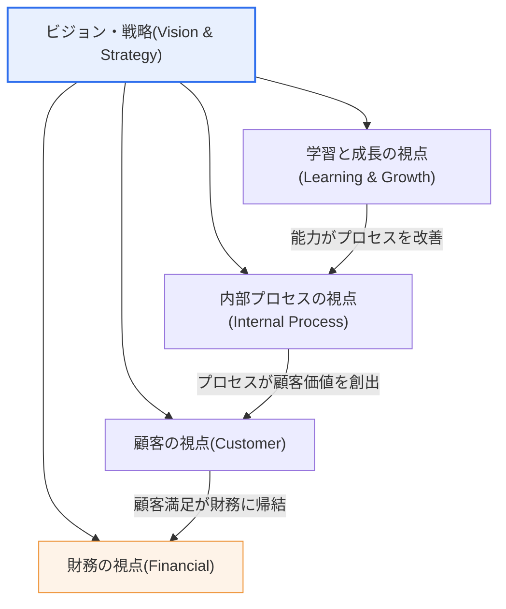

# バランスト・スコアカード(BSC, Balanced Score Card)

## 1. 概要

### A. 定義
> **BSC(Balanced Score Card)** とは、財務成果中心の伝統的な業績測定を超え、**財務・顧客・内部プロセス・学習と成長の4つの視点からバランスよく成果を測定・管理**し、組織のビジョン・戦略を測定可能な指標へと翻訳する戦略経営・業績管理のツールである。1992年にRobert KaplanとDavid NortonがHarvard Business Reviewに発表したことで登場した。

BSCの根本的な洞察は、「**財務指標だけでは未来を管理できない**」という点にある。売上・利益・ROIのような財務指標は、すでに行われた活動の結果、すなわち**遅行指標(Lagging Indicator)** にすぎず、その成果を生み出した原因 — 顧客満足、プロセス効率、従業員の能力といった**先行指標(Leading Indicator)** — を教えてはくれない。財務成果だけを見て経営することは、自動車のバックミラーだけを見て運転するのと同じであり、肝心の将来の成果を左右する無形資産(ブランド・知識・関係・システム)と先行要因を見落とすことになる。

BSCはこの問題を、四つの視点のバランスと**因果連鎖(Cause-and-Effect Chain)** によって解決する。学習と成長(従業員教育・情報システム・組織能力)が向上すれば内部プロセスが改善され、改善されたプロセスが顧客価値を高めて顧客満足・ロイヤルティが上昇し、その結果が最終的に財務成果へとつながるという論理である。すなわちBSCは、財務という「結果」だけでなく、その結果を生み出す「過程」と「原動力」までを統合的に管理させる。何よりもBSCの最大の貢献は、抽象的な戦略を各視点の具体的な指標(KPI)と目標値へと翻訳し、組織全体が**実行可能な言語**として共有できるようにした点にある。

### B. 登場背景と必要性
20世紀後半に知識基盤経済へ移行するにつれ、企業価値において有形資産(工場・設備)よりも無形資産(ブランド・特許・人的能力・顧客関係)が占める比重が急激に大きくなった。しかし、伝統的な会計・財務業績管理の体系は無形資産を財務諸表に十分に反映できず、その結果、「測定されないものは管理されない」という格言どおり、将来価値の源泉が経営管理の死角に置かれることとなった。

また、多くの企業が優れた戦略を策定しながらも、実行段階で失敗した。戦略は経営陣の文書の中にのみ存在し、現場の従業員は日々の業務が戦略とどのようにつながっているのかを知らなかった。KaplanとNortonは、「測定できなければ管理できず、管理できなければ実行できない」という問題意識から、戦略を4視点のバランスのとれた指標に翻訳し、組織の最下層まで展開(Cascading)するツールとしてBSCを提案した。すなわちBSCは、**業績測定ツールとして出発したが、本質的には戦略実行(Strategy Execution)のツール**である。

## 2. 4つの視点(構成要素)と因果構造

BSCの全体構造は、ビジョン・戦略を中心に据え、四つの視点が階層的・因果的に結び付いた形態である。以下の全体構造図は、ビジョン・戦略から四つの視点が導出されると同時に、四つの視点が下(学習・成長)から上(財務)へ因果的に積み上がっていくという二重構造を示している。

四つの視点は単なる並列ではなく、下の視点が上の視点の**原動力(Driver)** となる因果的な階層として配置される。各視点を原理とともに見ていく。

### A. 財務の視点(Financial) — 結果の視点
財務の視点は、「株主や利害関係者に財務的にどう見えるか」を問う。伝統的に唯一の業績尺度であったこの視点は、BSCでは**最終結果であり遅行指標**として位置づけられる。売上成長率、営業利益、ROI(投資収益率)、EVA(経済的付加価値)、コスト削減額などが代表的な指標である。財務の視点は、残り三つの視点の取り組みが最終的に収益性へと帰結しているかを検証する「精算所」の役割を果たす。

重要なのは、財務目標が企業の**戦略的成熟段階(成長期・維持期・収穫期)** によって異なるという点である。新規事業の成長期には売上成長率・市場拡大が中核指標となり、成熟した収穫期にはキャッシュフロー・投資の回収が中心となる。したがって財務指標を画一的に適用すると、成長期の事業を短期的な収益の物差しで誤って評価する誤りが生じる。例えば、初期のSaaS事業を目先の営業利益率だけで評価すると、顧客獲得投資(マーケティング・無料トライアル)を削減することになり、かえって長期的な成長を損なう。

### B. 顧客の視点(Customer) — 価値提案の視点
顧客の視点は、「戦略を達成するには顧客にどう見えなければならないか」を問う。財務成果の直接的な源泉は顧客であるため、ターゲット市場・顧客セグメントを定義し、彼らに提供する**価値提案(Value Proposition)** — 品質・価格・時間・サービス・ブランド — を明確にする。代表的な指標としては、顧客満足度(CSAT)、ネット・プロモーター・スコア(NPS)、市場シェア、新規顧客獲得率、顧客維持率(Retention)、顧客離脱率(Churn)がある。

顧客指標は、財務に対しては先行するが、プロセス・能力に対しては遅行するという二面性を持つ。例えば、顧客離脱率が月5%から3%に低下したならば、これはまもなく訪れる売上の安定(財務)を予告する先行シグナルであると同時に、その原因である相談対応プロセスの改善(内部プロセス)の結果でもある。実務では、顧客維持率の1%ポイントの改善が、リピート購買・クロスセルを通じて財務に数倍に増幅されて現れることが多く、顧客の視点の指標は財務の視点の早期警報の役割を果たす。

### C. 内部プロセスの視点(Internal Process) — 実行の視点
内部プロセスの視点は、「顧客と株主を満足させるには、どのプロセスで卓越しなければならないか」を問う。ここで核心となるのは、既存プロセスの部分的な改善ではなく、**価値提案を実現する戦略的プロセス**を識別することである。Kaplan-Nortonはこれを、業務管理(生産・物流)、顧客管理(関係・サービス)、イノベーション(新製品開発)、規制・社会プロセスの四つの群に分類している。代表的な指標は、不良率・歩留まり、納期遵守率、サイクルタイム、新製品の上市リードタイムなどである。

内部プロセスの視点の実務的な含意は、「何を測定するかが、何を改善するかを決定する」という点にある。もし顧客への価値提案が「迅速な配送」であれば、受注から配送までのサイクルタイムを中核指標とすべきであり、単に生産コストだけを下げようとすれば、配送速度という戦略的差別化要素が放置される。例えば、物流企業が当日配送を価値提案として掲げるのであれば、倉庫のピッキング時間(例:平均12分→7分に短縮)と誤配送率をプロセス指標として管理してはじめて、顧客満足と財務へとつながる。

### D. 学習と成長の視点(Learning & Growth) — 土台の視点
学習と成長の視点は、「ビジョンを達成するために、どのように変化・改善の能力を高めるか」を問う。これは人的資本(従業員の能力・教育)、情報資本(システム・データ・インフラ)、組織資本(文化・リーダーシップ・チームワーク・整合)の三つの無形資産で構成され、**残り三つの視点を支える土台であり、最も強力な先行指標**である。代表的な指標は、従業員満足度、コア能力の保有率、研修受講時間、情報システムのカバレッジ、離職率などである。

この視点がしばしば軽視される理由は、投資効果が最も遅く、最も間接的に現れるためである。従業員教育やシステム導入の成果は数四半期後になってようやくプロセス・顧客・財務へと波及するため、短期的な財務圧力が大きいと最初に削減される項目となる。しかし因果連鎖の論理上、土台が崩れれば上位の視点は持続できないため、BSCはこの視点を明示的な指標として管理し、「目に見えない将来への投資」を守る装置の役割を果たす。

以下の表は、四つの視点の中核となる問いと代表的な指標を比較・整理したものである(文章による説明の補助手段)。

| 視点 | 中核となる問い | 性格 | 代表的指標(KPI) |
|---|---|---|---|
| **財務(Financial)** | 株主にどう見えるか? | 結果・遅行 | 売上成長率・営業利益・ROI・EVA |
| **顧客(Customer)** | 顧客にどう見えるか? | 先行/遅行 | 満足度・NPS・シェア・維持率 |
| **内部プロセス(Internal)** | 何に卓越すべきか? | 先行 | 不良率・納期遵守率・サイクルタイム |
| **学習と成長(Learning)** | どのように改善・成長するか? | 最先行・土台 | 能力保有率・研修時間・システム・離職率 |

## 3. 構成要素と戦略マップ(Strategy Map)による展開

BSCは各視点ごとに**目標(Objective) – 指標(Measure/KPI) – 目標値(Target) – 実行施策(Initiative)** の四要素を定義し、これを因果関係で結び付けて**戦略マップ(Strategy Map)** として可視化する。戦略マップは、2000年代初頭にKaplan-NortonがBSCを発展させる中で確立した概念であり、組織の戦略を「従業員教育 → プロセス改善 → 顧客満足 → 売上増大」のような因果論理の流れとして一枚に表現する。以下はBSCの策定・運用プロセスの詳細図であり、戦略マップの作成と指標の展開(Cascading)、業績レビューの循環を示している。

構成要素を文章で説明すると次のとおりである。**目標(Objective)** は各視点で達成しようとする戦略的な方向性(「顧客対応時間を短縮する」)であり、**指標(KPI)** はその達成を計量する尺度(「平均応答時間」)、**目標値(Target)** は到達すべき具体的な水準(「24時間 → 4時間」)、**実行施策(Initiative)** は目標値を達成するための具体的なプロジェクト(「チャットボット・CRMの導入」)である。これら四つの要素が揃ってはじめて、戦略は「何を、どれだけ、どのように」のレベルまで実行可能となる。

戦略マップの真の力は、**視点間の矢印(因果仮説)** にある。単に指標を列挙するのではなく、「従業員のCRM能力向上(学習)→ 相談処理時間の短縮(プロセス)→ 顧客満足の上昇(顧客)→ 再購入・売上の増加(財務)」のように論理を明示することで、組織は各活動が最終成果にどのように寄与するかを検証し、資源を優先順位どおりに配分できる。このように上位の戦略マップを事業部・チーム単位に細分化して下ろしていくことを**カスケーディング(Cascading)** と呼び、これによって全社戦略と個人目標が整合(Alignment)される。

## 4. 比較と適用事例

### A. 伝統的な業績管理(MBO/財務中心)との比較
BSCを目標管理(MBO)や財務中心のKPI管理と対比すると、違いの本質が浮かび上がる。伝統的な方式は概して財務・短期・結果中心であり、指標間に因果関係がない。これに対しBSCは、財務・非財務をバランスよく取り込み、遅行指標と先行指標を併せて見て、指標同士を戦略マップの因果連鎖で結び付ける点が決定的に異なる。

| 区分 | 伝統的な財務業績管理 | BSC |
|---|---|---|
| 測定対象 | 財務結果中心 | 財務+顧客+プロセス+学習のバランス |
| 時間志向 | 過去(遅行) | 過去+未来(先行)の併用 |
| 指標の関係 | 個別・独立 | 戦略マップで因果的に連結 |
| 目的 | 実績の統制 | 戦略の実行・整合 |

この違いが実務で重要である理由は、財務指標だけで評価すると、管理者が将来への投資(R&D・教育)を削って短期実績を水増しする**近視眼的な行動**を誘発するためである。BSCは学習・成長とプロセスの指標を併せて評価に反映することで、こうした歪みを抑制する。

### B. 公共部門・情報化事業への適用事例
BSCは民間だけでなく、公共機関・情報化事業の業績管理にも広く応用されている。公共部門では、最上位の視点を「財務」ではなく「使命・国民価値(Mission)」に置き換えて再構成するのが一般的である。例えば電子政府サービスの業績管理では、①国民の便益(顧客)、②サービス処理プロセス(内部)、③公務員の能力・情報システム(学習・成長)、④予算効率(財務)の四つの視点で指標を設計する。実際に、ある公共情報化事業で行政手続の処理時間を指標とし、平均処理期間を数日単位から時間単位へと短縮した事例のように、プロセス指標の改善が国民の満足(顧客)につながる構造を管理する。

### C. ITガバナンス・戦略的企業経営(SEM)との連携
情報管理技術士の観点では、BSCは独立したツールではなく、上位の経営・IT管理体系の構成要素として理解すべきである。BSCは**SEM(Strategic Enterprise Management)** の中核的な実行エンジンであり、IT業績管理フレームワークである**IT-BSC**(ITの4視点:企業への貢献・ユーザ志向・運用の卓越性・将来志向)へと変形されて、ITガバナンス(COBIT)と結合される。すなわち、組織のBSC → IT-BSC → 個別システムの業績指標へとつながる階層的な整合を通じて、IT投資と事業戦略を一致させる。

## 5. 深掘り — 予想出題方向と答案構成戦略

情報管理技術士試験において、BSCは経営・事業戦略領域の定番テーマであり、単独での出題だけでなく、SEM、ITガバナンス、IT-ROI、情報化の業績管理などと組み合わせて出題される傾向が強い。出題の観点を予想すると次のとおりである。

第一に、**4視点の因果関係と戦略マップ**を説明させる類型である。この場合、視点を単に列挙するのではなく、「学習・成長が最先行の土台であり、財務が最終結果である」という因果の方向を必ず明示し、戦略マップの図で可視化することが高得点のポイントである。

第二に、**先行/遅行指標のバランス**を問う類型である。財務=遅行、学習・成長=最先行という構造と、財務指標だけを管理する場合の近視眼的な歪みを事例とともに説明すれば、深みが表れる。

第三に、**公共/IT分野への適用**を問う類型である。公共BSCは最上位を国民価値に再配置するという点、IT-BSCの4視点への変形、COBIT・SEMとの連携を答案に含めれば、技術士レベルの統合的な理解を示すことができる。

答案構成に際しては、概要(定義・背景) → 4視点の概念図 → 戦略マップ・構成要素 → 伝統的方式との比較 → 適用事例 → 考慮事項の順に展開し、表と図を文章による説明と併用するのが効果的である。

## 6. 考慮事項および示唆(技術士の観点)

1. **戦略と指標の因果的な連携が成否を分ける。** BSCの本質は4視点の指標の列挙ではなく、戦略マップで表現される因果仮説の検証である。因果的な連結なしに指標だけを並べれば、「バランスのとれたダッシュボード」にはなっても「戦略実行のツール」にはなり得ない。導入時には必ず戦略マップから描き、因果論理について合意しなければならない。

2. **戦略の実行・整合のツールとして活用すべきである。** BSCの価値は、抽象的な戦略を測定可能な指標へと翻訳し、組織の下位までカスケーディングして全社・チーム・個人の目標を整合させる点にある。成果給算定用のKPI管理に矮小化すると、BSCの戦略的価値は失われる。SEM・ITガバナンスの実行エンジンとして位置づける視点が必要である。

3. **指標の過剰・測定の形骸化を警戒すべきである。** 指標が多すぎると(視点あたり20個超)、管理負担が大きくなり焦点がぼやける。一般に、視点ごとに中核となる少数の指標(4~7個程度)に集中することが推奨される。また、測定そのものが目的化し、指標を埋めるための形式的な活動が行われることのないよう、戦略との連携性を定期的に点検しなければならない。

4. **データ・システム基盤と変革管理が前提条件である。** 非財務指標(顧客・プロセス・能力)をリアルタイムに近い形で収集・管理するにはCRM・ERP・BIなどの情報システム基盤が必要であり、指標がそのまま評価・報酬と結び付くため、組織の抵抗・ゲーミング(指標の操作)に対する変革管理が不可欠である。近年では、データガバナンス・BIダッシュボードと組み合わせてBSCをリアルタイムの業績モニタリング体系へと高度化する流れが顕著である。

5. **動的な管理と戦略の調整が必要である。** BSCは一度作れば終わる静的な文書ではなく、定期的な業績レビューを通じて因果仮説を検証し、戦略を調整する**ダブルループ学習(Double-loop Learning)** の循環体系でなければならない。目標値に達しなかった場合、指標だけを手直しするのではなく、戦略仮説そのものが誤っていなかったかを問い直すフィードバックが重要である。

## 参考資料
- Kaplan & Norton, "The Balanced Scorecard—Measures That Drive Performance," Harvard Business Review, 1992: https://hbr.org/1992/01/the-balanced-scorecard-measures-that-drive-performance
- Balanced Scorecard Institute, "Balanced Scorecard Basics": https://balancedscorecard.org/bsc-basics-overview/
- Wikipedia, "Balanced scorecard": https://en.wikipedia.org/wiki/Balanced_scorecard

---

> **一言まとめ**: BSCは、*財務・顧客・内部プロセス・学習と成長の4視点からバランスよく成果を測定*する戦略経営ツールであり、下位の視点(学習・成長)が上位の視点(財務)の原動力となる因果連鎖(戦略マップ)によって抽象的な戦略を測定可能な指標へと翻訳し、組織の下位まで整合させることで、財務結果だけでなくその原動力までを管理して戦略の実行を牽引する。
