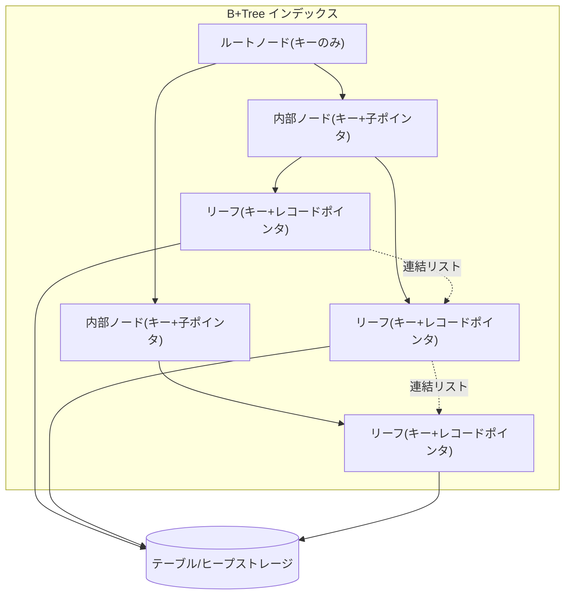
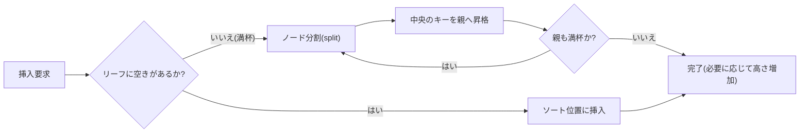
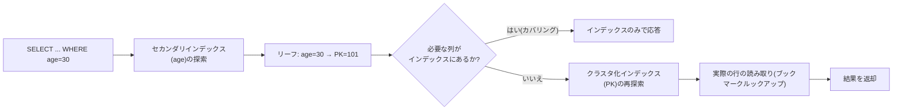

# データベースのインデックス構造(B-Tree・B+Tree)

## 1. 概要

### A. 定義
> **B-Tree**とは、一つのノードが複数のキーと子ポインタを持つ**平衡多分探索木**であり、すべてのリーフが同じ深さに位置するよう維持されることで、どのキーを探しても**O(log N)** のディスクアクセスを保証する索引構造である。**B+Tree**はここからさらに一歩進み、**実データ(またはデータポインタ)をリーフノードにのみ格納**し、内部ノードには探索用のキーのみを置き、**リーフノード同士を連結リストでつなぐ**ことで範囲検索を強化した変種である。

### B. 登場背景および必要性
リレーショナルDBMSが扱うテーブルは数百万~数十億件に達し、そのデータはメモリではなく**ディスク(ブロック/ページ単位)** に格納される。ディスクアクセスはメモリアクセスより数万倍遅いため、索引の性能は「演算をどれだけ少なくするか」ではなく**「ディスクページを何回読むか(I/O回数)」** によって決まる。ソート済み配列は二分探索でO(log N)の比較が可能だが、挿入・削除時に大量の移動が必要となり、二分探索木(BST)は挿入順序によって一方に偏り、最悪O(N)まで退化する。ハッシュインデックスは等価(=)検索は速いが、範囲・ソートの問い合わせをサポートできない。

B-Tree系列は、これら三つの限界を同時に解決する。**ノード一つをディスクページ一つ(通常4KB~16KB)に対応**させ、一回のI/Oで数百個のキーを読み込むため、木の**次数(fan-out)が非常に大きくなり、その結果、木の高さが3~4段に低く保たれる**。同時に、挿入・削除時にも**分割(split)・併合(merge)** によって平衡を自動的に維持するため、最悪の場合でも性能が保証される。特にB+Treeはリーフを連結リストでつなぎ、「BETWEEN」「ORDER BY」「範囲スキャン」を順次読み取りで処理できるため、今日ではほぼすべての商用RDBMS(Oracle・MySQL InnoDB・PostgreSQL・SQL Server)が標準のインデックスとして採用している。

### C. 特徴
- **平衡木(Balanced)**:すべてのリーフが同じ深さ → どのキーでも探索コストが一定である。
- **高い次数・低い高さ**:ノード = ページ → fan-outが数百 → 大容量でも高さ3~4。
- **ソート順の維持**:キーがソートされた状態で維持され、等価・範囲・ソートの問い合わせをすべてサポートする。
- **自己平衡(Self-balancing)**:挿入・削除が局所的な分割・併合で処理され、再構築が不要である。

### D. 他のデータ構造との比較(なぜB+Treeなのか)
B+Treeの強みは、代替手段と並べてみることで明確になる。**二分探索木(BST)** は各ノードがキー一つ・子二つのみを持つ構造であるため、100万件を格納すると高さが20段に達し、その分のディスクI/Oが必要となる。さらに、ソートされた順序で挿入すると一方に伸びて、事実上の連結リスト(O(N))に退化する。**AVL木・赤黒木** は平衡を強制して最悪ケースを防ぐが、依然として二分(fan-out=2)であるため高さが高く、ノードが細かく分かれて**ディスクページ単位のI/Oには不向き**である。これらはいずれもメモリ内部のデータ構造には適しているが、ページベースのディスクストレージには合わない。

**ハッシュインデックス** は、等価(=)検索を平均O(1)で処理する強力な代替手段であるが、値をハッシュで分散させて格納するため、**ソート・範囲(>, BETWEEN, ORDER BY)・前方一致(LIKE 'abc%')の問い合わせをまったくサポートできない**。また、ハッシュ衝突・再ハッシュのコストや、データ偏在時の性能低下という問題もある。一方B+Treeは、等価検索がハッシュよりやや遅い(O(log N))代わりに、**あらゆる問い合わせ形態を一つの構造でサポート**する汎用性を持つ。実務の問い合わせの多くが範囲・ソートを含むため、特定の等価検索だけが極端に頻繁であるという例外でない限り、B+Treeが標準の選択となる理由はここにある。

| 構造 | 探索計算量 | 範囲・ソート | ディスク適合性 |
|---|---|---|---|
| **BST(非平衡)** | 最悪 O(N) | 可能(非効率) | 低い |
| **AVL/RB木** | O(log N) | 可能 | 低い(二分・細かいノード) |
| **ハッシュインデックス** | 平均 O(1) | **不可** | 中程度 |
| **B+Tree** | O(log N) | **優秀(リーフリンク)** | **高い(ノード=ページ)** |

## 2. 全体構造

B+Treeは、役割の異なる三種類のノードで構成される。**ルート・内部ノード**は、「どの子へ下りるか」を決定するための**分岐キー(separator key)と子ポインタ**のみを保持する。ここには実データがないため、一つのページにより多くのキーを詰め込むことができ、これがfan-outを最大化して高さを低くする。**リーフノード**は、ソートされたすべてのキーとともに、**実レコード(クラスタ化インデックス)またはレコード位置ポインタ(非クラスタ化インデックス)** を保持する。最後に、**リーフ同士は左→右につながった双方向/単方向連結リスト**を形成しており、このリンクのおかげで「特定の値以上を順に走査する」処理が、木を再びたどることなくリーフだけを追う順次I/Oで完了する。

各ノードは**最小・最大キー数の規約**を守る。次数(order)mのB-Treeでは、ルートを除くすべてのノードが最小⌈m/2⌉−1個、最大m−1個のキーを持たなければならず、この下限が破られると併合・再分配によって、上限を超えると分割によって規約を回復する。この規約こそが、**木の平衡とページ使用率(通常50%以上)** を保証する中核的な不変条件(invariant)である。

## 3. 中核動作(探索・挿入・削除)

**探索(Search)** は、ルートから始めて各ノードの分岐キーと探す値を比較しながら適切な子へ下りていき、リーフに到達してキーを確認する。訪問するノード数がそのまま木の高さであるため、I/O回数は高さに比例する。例えばfan-outが200であれば、3段で200³ = 800万件、4段で16億件をインデックス化でき、数億件のテーブルでも**わずか3~4回のページ読み取りで目的の行を見つける**。これが、インデックスなしで全体を走査するフルスキャン(O(N))と決定的に分かれる点である。

**挿入(Insert)** は、まず探索によって挿入先のリーフを見つけ、ソート位置にキーを入れる。リーフに空きがあればそのまま終了するが、ノードが満杯になると**分割**が発生する。ノードを半分に分け、中央のキーを親へ上げて(昇格させて)送るが、親も満杯であればこの分割が上へ伝播(propagation)し、ルートまで分割されると新しいルートが生まれて**木の高さが1増加**する。高さの増加はルートの分割によってのみ起こるため、すべてのリーフが常に同じ深さに保たれるのである。順次増加するキー(例:`AUTO_INCREMENT` のPK)を挿入すると、常に右端で分割が繰り返され、ページはおおむね右側に偏って埋まっていく。

**高さの計算(数値例)**:fan-outと高さの関係を具体的な数値で見ると、インデックスの威力が明確になる。ページサイズを16KB、インデックスキー + 子ポインタをおよそ16バイトと仮定すると、内部ノード一つに約1,000個の分岐が入り、fan-out ≈ 1,000となる。このとき高さ2であれば1,000² = 100万件、高さ3であれば10億件を格納できる。すなわち、**10億件のテーブルでも、ルート→内部→リーフの3~4回のページ読み取りだけで目的の行に到達**する。一方、同じ10億件を二分木で格納すると log₂(10⁹) ≈ 30段が必要となり、I/Oは約10倍に増える。この差が、大容量OLTPにおいてB+Treeが事実上唯一の選択肢となる定量的な根拠である。

**削除(Delete)** は、リーフからキーを除去した後、そのノードのキー数が最小下限(⌈m/2⌉−1)を下回った場合に規約を回復しなければならない。回復方法は二つあり、兄弟ノードに余裕があればキーを借りてくる**再分配(redistribution)**、兄弟にも余裕がなければ二つのノードを合わせる**併合(merge)** である。併合は親の分岐キーを一つ引き下ろすため親のキー数も減り、この過程が上へ伝播してルートの子が一つだけになると**高さが1減少**する。実務のDBMSは、削除時に即座に併合せず空間をしばらく空けておいて再利用する遅延戦略をとることもあり、そのため大量削除の後にインデックスが肥大化(bloat)し、再構成(REBUILD/REINDEX)が必要になる場合がある。

## 4. B-TreeとB+Treeの比較

両構造の違いは、「データをどこに置くか」という一つの決定から派生しており、その決定が範囲問い合わせの性能とfan-outを左右する。**B-Tree**は内部ノードにもデータ(またはデータポインタ)を一緒に格納するため、運よく上位ノードでキーに出会えばリーフまで行かずに早期に終了できるという利点がある。しかし、内部ノードがデータまで抱えているため一つのページに収まる分岐キーの数が減り、その分**fan-outが低くなって同じデータでも木が高くなる**。また、データが複数のレベルに散らばっているため、範囲検索時に木を上り下りする中間順走査(in-order traversal)が必要となり非効率である。

**B+Tree**は、内部ノードを純粋な道標として空けることでfan-outを大きくし、高さを低くする。すべてのデータがリーフでソート・連結されているため、**範囲問い合わせは開始点だけを木で探し、あとはリーフのリンクをたどるだけ**でよく、順次I/Oで処理される。その代わり、どのキーであっても必ずリーフまで下りなければならないため、個別の等価検索ではB-Treeに比べて劇的な利点はない。大半の実務の問い合わせが範囲・ソート・スキャンを含み、安定した高さが重要であるため、**商用RDBMSはほぼ例外なくB+Treeを採用**している。

| 区分 | B-Tree | B+Tree |
|---|---|---|
| **データの位置** | 内部・リーフノードの両方 | **リーフノードのみ** |
| **内部ノードの役割** | キー + データ | キー(道標)のみ |
| **fan-out / 高さ** | 相対的に低い / 高い | **高い / 低い** |
| **範囲・ソート問い合わせ** | 中間順走査が必要(非効率) | **リーフ連結リストで順次処理** |
| **単一等価検索** | 上位で早期終了が可能 | 常にリーフまで下降 |
| **採用** | 概念・一部のファイルシステム | **大多数のRDBMSインデックス** |

## 5. インデックスの応用:クラスタ化・複合・カバリング

インデックスの実際の性能は、B+Treeというデータ構造の上で**「リーフに何を格納するか」** をどう設計するかによって分かれる。上の図は、セカンダリインデックスの参照がカバリングであればインデックスだけで完了するが、そうでなければ**PK(クラスタ化インデックス)をもう一度たどって下り、実際の行を読むブックマークルックアップ**が追加されることを示している。この追加I/Oが大量参照における性能を左右するため、カバリングの設計は強力な最適化となる。**クラスタ化インデックス(Clustered)** は、リーフに行全体をソートして格納する方式であり、テーブル自体がインデックス順に物理的にソートされる。MySQL InnoDBはPKをクラスタ化インデックスとするため、PKの範囲参照が非常に高速である一方、PKがランダム(UUIDなど)であれば挿入のたびに中間ページの分割が発生して性能が急落する — このためInnoDBでは順次増加するPKが推奨される。**非クラスタ化インデックス(Secondary)** は、リーフにキーと「行を探しに行くポインタ(InnoDBではPK値)」のみを置くため、インデックスにない列を要求すると、実際の行を読み直す**ブックマークルックアップ(bookmark lookup)** が追加で発生する。

**複合インデックス(Composite)** は複数の列を連結して一つのキーとしたものであり、ソートは**先頭の列から辞書順**に行われる。したがって`(A, B)`インデックスは`A=? AND B=?`や`A=?`の問い合わせを高速化するが、`B=?`単独の問い合わせには使えない(これを**先頭列ルール、leftmost prefix rule** という)。この原理を知らないと、インデックスを作成しても使われないというよくあるチューニングの失敗につながる。**カバリングインデックス(Covering)** は、問い合わせが要求するすべての列をインデックスが含むことで、リーフだけを読んでテーブルアクセス(ルックアップ)を完全に省略する最適化である。例えば`SELECT name FROM member WHERE age=30`に対して`(age, name)`インデックスを置けば、テーブルをまったく読まずにインデックスだけで結果を返すことができ、大量参照においてI/Oを数分の一に削減できる。

| 種類 | リーフの格納内容 | 特徴・注意点 |
|---|---|---|
| **クラスタ化** | 行全体(ソート格納) | 範囲参照が高速、ランダムPKでは分割が急増 |
| **非クラスタ化** | キー + 行ポインタ | ルックアップが追加で発生し得る |
| **複合インデックス** | 複数列の結合キー | 先頭列ルールの遵守が必要 |
| **カバリングインデックス** | 問い合わせの列をすべて含む | テーブルアクセスを省略、I/O削減 |

インデックスを作成しておきながら実際には使われない**アンチパターン**は、実務の性能障害の定番の原因である。実際の事例として、あるEコマースサービスで`WHERE DATE(created_at) = '2024-01-01'`形式の注文参照に数秒かかっていた問題があったが、原因はインデックス列`created_at`に`DATE()`関数をかぶせたことで**インデックスが無効化(index suppression)** されていたことであった。これを`created_at >= '2024-01-01' AND created_at < '2024-01-02'`という範囲条件に変えたところ、インデックスの範囲スキャンが機能するようになり、応答は数ミリ秒に短縮された。代表的なアンチパターンは次のとおりである。

- **インデックス列の加工**:`WHERE SUBSTR(col,1,3)='ABC'`、`WHERE col+0=100`のように列に関数・演算を適用するとインデックスが使われない → 定数側を加工する。
- **先頭列の欠落**:`(A,B,C)`インデックスで`A`を条件に含めないと、インデックスの利用が制限される(leftmost prefix違反)。
- **選択性の低い列の単独インデックス**:性別・ステータス値のように値が数種類しかないと、オプティマイザがフルスキャンを選択し、インデックスが無意味になる。
- **暗黙の型変換**:文字列の列を数値と比較する(`WHERE varchar_col = 100`)と型変換が介在し、インデックスが効かなくなる。
- **否定・前方ワイルドカード**:`!=`、`NOT IN`、`LIKE '%abc'`はソート順を活用できず、インデックスの効果が低下する。

## 6. 深掘り:書き込み負荷とLSM-Tree、SSD時代の変化

伝統的なB+Treeは**読み取り志向のバランス**をとった構造であるため、ランダム書き込みが殺到する現代のワークロード(ログ・時系列・メッセージストリーム)では弱点を露呈する。キーをソート位置に直接差し込むため、挿入のたびに**ディスクのランダムな位置を更新**し、ページ分割による**書き込み増幅(write amplification)** と断片化が蓄積する。これを解決するために登場したのが**LSM-Tree(Log-Structured Merge-Tree)** であり、書き込みをまずメモリ(MemTable)に順次蓄積し、ソートされた不変ファイル(SSTable)としてディスクに順次書き出し(flush)、バックグラウンドで複数のSSTableを統合する**コンパクション(compaction)** によって整理する。その結果、**書き込みは順次化されて非常に高速になるが、読み取り時に複数の階層を探索しなければならず読み取り増幅が生じる**という、正反対のトレードオフを持つ。このため、書き込みが圧倒的なシステム(Cassandra・RocksDB・HBase、LevelDB)はLSM-Treeを、バランスのとれたOLTP(MySQL・PostgreSQL)はB+Treeを選ぶというように、ワークロードによって分かれる。

記憶媒体の変化も設計を揺るがしている。HDD時代にはシーク時間を減らすことが絶対的な命題であったため「高さを最小化するB+Tree」が最適であったが、**SSD/NVMe**はランダムアクセスが速く、高さそのものの負担は小さくなった。ただしSSDには、**ブロック単位でしか消去・再書き込みできない(erase-before-write)** 特性とセルの寿命の限界があるため、書き込み増幅を減らすLSM-Treeや**Fractal Tree/Bε-tree**(挿入をバッファリングして順次化する変種)が注目された。また、インメモリDBではキャッシュライン親和的な**B+Treeの変種(例:キャッシュ認識型CSB+-Tree)** やその他の構造が使われるなど、「B+Tree一つで終わり」ではなく、**媒体・ワークロードごとの最適な索引**へと分化していくのが最新の流れである。実際にPostgreSQLは、B-Tree以外にGIN・GiST・BRIN・Hashなど複数のインデックスタイプを提供しており、時系列・全文検索・空間データにそれぞれ異なる索引を推奨している。

一方、並行性の観点からもB+Treeには精緻な制御が必要である。複数のトランザクションが同じインデックスを同時に更新すると、分割・併合が上位ノードへ伝播する間に広い範囲にロックがかかる可能性があるため、商用DBMSは**ラッチカップリング(latch coupling/crabbing)** や**Blink-Tree**(右リンクによって分割中でもロックなしの探索を許容)といった手法で並行性を高める。また、範囲問い合わせのファントム(phantom)問題を防ぐため、**ネクストキーロック(next-key lock)** のようにインデックス構造に密着したロック戦略を用いる。このようにB+Treeは単なるデータ構造ではなく、トランザクション分離・並行性制御・回復(ログ)とかみ合って動作する、DBMSエンジンの中核部品である。

## 7. 考慮事項および示唆(技術士の観点)
- **インデックス数のトレードオフ**:インデックスは読み取りを高速化する代わりに、**すべての書き込み(INSERT・UPDATE・DELETE)のたびに一緒に更新**されなければならないため、無分別なインデックスの乱発は書き込み性能の低下と格納領域の増加を招く。参照パターンを分析し、**選択性(selectivity)の高い列と頻繁に使われる問い合わせを中心に最小限**に設計し、使われていないインデックスは定期的に削除するのが原則である。
- **選択性とオプティマイザの判断**:性別のように値の種類が少なく選択性の低い列は、インデックスを作成してもオプティマイザがフルスキャンを選ぶ場合がある。統計情報(カーディナリティ・ヒストグラム)を最新に保って(ANALYZE)はじめてオプティマイザはインデックスを正しく活用でき、関数・型変換が介在するとインデックスが無効化されるため、**インデックス列を加工しないSQLの記述**が重要である。
- **断片化と再構成の戦略**:大量の挿入・削除が繰り返されるとページ使用率が低下し、インデックスが肥大化(bloat)して性能が低下する。充填率(FILLFACTOR)の調整、オンライン再構成(REINDEX/REBUILD)、パーティショニングを併用し、**運用中の性能を維持**する計画が必要である。
- **ワークロード・媒体に整合した設計**:OLTP・範囲参照中心であればB+Tree、書き込み殺到・ログ型であればLSM-Tree、時系列であればBRIN、全文検索であれば転置索引(GIN)など、**問い合わせの性質と記憶媒体(HDD/SSD/メモリ)に合わせて索引を選択**しなければならず、これはそのままデータアーキテクチャの設計能力に直結する。
- **分散環境への拡張**:シャーディング・分散DBでは、ローカルのB+Treeの上にグローバルインデックス・ハッシュパーティショニングを組み合わせなければならず、分散トランザクション・再分配のコストまで考慮した**索引戦略の拡張設計**が求められる。

## 参考資料
- PostgreSQL Documentation, "Index Types" — https://www.postgresql.org/docs/current/indexes-types.html
- MySQL Reference Manual, "How MySQL Uses Indexes" — https://dev.mysql.com/doc/refman/8.0/en/mysql-indexes.html
- MySQL Reference Manual, "InnoDB Index Types (Clustered/Secondary)" — https://dev.mysql.com/doc/refman/8.0/en/innodb-index-types.html
- Google Research, "The Log-Structured Merge-Tree (LSM-Tree)" (O'Neil et al.) — https://www.cs.umb.edu/~poneil/lsmtree.pdf

---
> **一言まとめ**: B-Treeはノード=ディスクページとしてfan-outを大きくした平衡多分探索木であり、B+Treeはデータをリーフにのみ置き、リーフを連結リストでつないで範囲・ソート問い合わせを強化した変種である。低い高さ(3~4)とO(log N)のI/Oにより、今日の大多数のRDBMSで標準のインデックスとして使われている。
