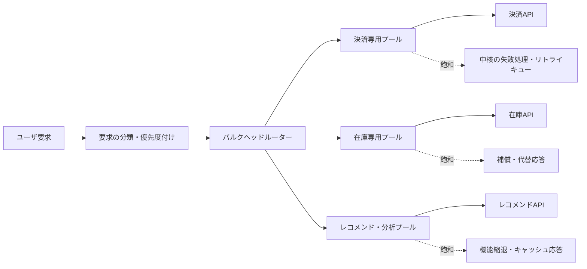
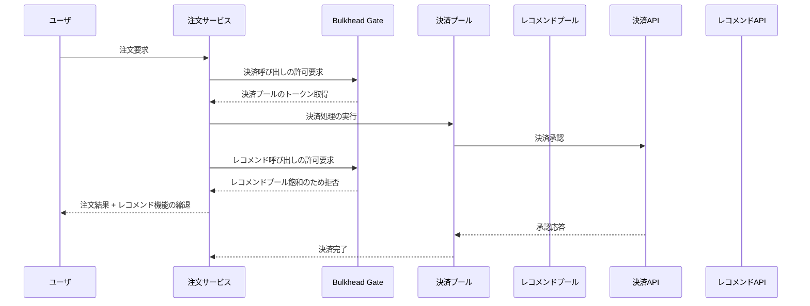

# バルクヘッド(Bulkhead)パターンと障害分離

## 1. 概要

> **定義**: バルクヘッド(Bulkhead)パターンとは、アプリケーションのリソースと処理経路を複数の分離されたプールに分け、一つのコンポーネントの故障や飽和が他のコンポーネントのリソースを枯渇させないようにする障害分離パターンである。

バルクヘッドという名称は、船の船体を複数の水密隔壁で区切る構造に由来する。
船体の一区画に浸水が発生しても、水がすべての区画に広がらなければ、船全体の沈没を遅らせたり防いだりできる。
ソフトウェアにおいても、一つの外部APIが遅くなったり特定顧客の要求が急増したりした際に、スレッド・コネクション・メモリ・キュー全体が一緒にロックされないよう、リソースを区画化する。

分散システムの障害は、単純な成功または失敗ではなく、遅延、リトライ、コネクション待ち、キューの滞留、部分応答という形で現れる。
共有リソース構造では、遅い依存先への要求がワーカースレッドを長時間占有し、コネクションプールと待ち行列を次々に消費していく。
その結果、もともと障害のなかった健全な依存先への要求まで処理できなくなる連鎖障害が発生する。
バルクヘッドは故障した依存先を直す手法ではなく、故障の影響範囲であるブラストラディウス(blast radius)を制限する手法である。

例えば、注文サービスが決済、在庫、レコメンドの三つの外部システムを呼び出すとしよう。
三つの呼び出しが一つのスレッドプールと一つのコネクションプールを共有すると、レコメンドサービスの遅延が決済承認要求の実行機会を奪い得る。
決済・在庫・レコメンドごとに同時呼び出し数とコネクションを分離すれば、レコメンドのプールが満杯になっても決済のプールは残り、中核となる注文機能を継続して遂行できる。
ただし、分離されたリソースはタダではないため、全体のスループット・メモリ・運用の複雑さ・公平性のバランスを併せて検討しなければならない。

バルクヘッドは、サーキットブレーカー、タイムアウト、リトライ、レートリミッターとは目的が異なるが、併用される。
タイムアウトは一つの呼び出しが占有する時間を制限し、サーキットブレーカーは継続的な障害を検知すると呼び出しを素早く遮断する。
リトライは一時的なエラーからの回復を助けるが負荷を増やし得るものであり、レートリミッターは流入量を制限する。
バルクヘッドは、共有リソースの中で特定の経路が占有できる取り分を制限し、他の経路が生き残る余地を残す。

## 2. 問題の背景と設計目標

### 2.1 共有リソースと連鎖障害

同期的なリモート呼び出しは、呼び出し元の実行リソースを占有する。
呼び出し先が正常なときは平均遅延時間が短く見えても、呼び出し先の障害やネットワーク分断が発生すると、応答を待つ要求が蓄積する。
待機中の要求が実行スレッドとコネクションを占有し続けると、新しい要求を処理するリソースがなくなり、呼び出し元自身のヘルスチェックや管理APIまで失敗し得る。

この現象は待ち行列の観点から見ることができる。
到着率が処理率を上回った瞬間に待ち行列は増加し、各要求のサービス時間が長くなれば、同じトラフィックでも必要な並行度は大きくなる。
ある依存先のサービス時間が長くなった状態ですべての依存先が一つのプールを共有していると、その依存先がプールの占有率を異常に高めてしまう。
バルクヘッドは依存先ごとの最大並行度を定め、一つの経路がシステム全体の処理率を独占できないようにする。

非同期構造でも同じ問題が発生する。
複数の業務が一つのメッセージキューと同一のコンシューマグループを使用すると、処理時間の長いメッセージが後続の正常なメッセージを遅延させる。
業務の重要度ごとにキュー、コンシューマグループ、ワーカー数を分離すれば、特定業務の滞留が他の業務の処理機会を奪うことを減らせる。
したがってバルクヘッドはスレッドの分離に限定されず、キュー・プロセス・ノード・テナントの境界にも適用される。

### 2.2 目標と非目標

バルクヘッドの第一の目標は、障害の範囲を制限することである。
サービス全体を常に成功させることではなく、一部の機能が制限されても中核機能が応答し続けるようにすることが目標である。
第二の目標は、リソース使用の予測可能性を高めることである。
依存先ごとに上限を設ければ、最悪の状況でどの経路がどれだけのリソースを消費するかを見積もることができる。

第三の目標は、重要度に応じた品質の差別化を可能にすることである。
決済やログインはレコメンド・分析より高い優先度を持ち得るため、それに応じてより大きなプールや別インスタンスを割り当てることができる。
第四の目標は、復旧後の殺到を緩和することである。
障害が解消した瞬間に蓄積した要求が一斉に再開されても、分離された流入量とキューが回復速度を超えないようにしなければならない。

逆に、バルクヘッドはデータ整合性を自動的に保証するものではない。
呼び出しを制限すると一部の要求は拒否されたり遅延したりするため、再処理・補償・ユーザへの案内のポリシーが別途必要である。
また、容量計画の代わりにもならない。
プールをうまく分割しても、すべてのプールの上限が実際の需要より小さければ、正常なトラフィックでも失敗が発生する。

## 3. 全体概念図と分離レベル

上の概念図において、ルーターは単にURLを振り分けるコンポーネントではない。
要求の業務重要度、テナント、依存先、予想処理時間を基準に、どのプールに入れるかを決定するポリシーポイントである。
各プールは、最大同時呼び出し数、待機時間、キュー長、実行スレッド、コネクション数を個別に持つことができる。
プールの飽和時には無限に待機せず、高速な失敗、キャッシュ、非同期への切替え、機能縮退のうち適切な結果を選択する。

バルクヘッドの分離レベルは、細粒度から粗粒度へと拡張される。
セマフォは一つのプロセス内で同時実行数のみを制限するため、オーバーヘッドが小さく適用が容易である。
専用スレッドプールは遅い呼び出しの実行フローを他のプールから分離するが、スレッドとキューのメモリを追加で使用する。
プロセス・コンテナ・ノードの分離はより強い障害境界を提供するが、デプロイ・監視・コストの負担が大きくなる。

| 分離レベル | 分離対象 | 利点 | 限界とコスト |
|---|---|---|---|
| セマフォ | 同時実行の許可数 | 軽量で低遅延 | 呼び出しコードが同じプロセスのリソースを共有 |
| スレッドプール | 実行スレッドと待機キュー | 遅い呼び出しによるスレッド占有を遮断 | スレッド・コンテキストスイッチ・キューメモリのコスト |
| コネクションプール | DB・HTTPコネクション | コネクション枯渇の伝播を防止 | プールごとのアイドルコネクションと設定管理が必要 |
| メッセージキュー・コンシューマグループ | 非同期処理フロー | 滞留と再処理の境界を分離 | 順序・重複・運用監視の複雑さ |
| プロセス・コンテナ | ランタイムインスタンス | メモリ・CPU障害の強い分離 | デプロイ・スケジューリング・ネットワークのコスト増加 |
| ノード・セル | インフラの障害ドメイン | 障害ドメインとテナントの分離 | リソース使用率と運用コストの犠牲 |

分離レベルを無条件に高めることが正解ではない。
単一プロセス内のレコメンド呼び出しをセマフォで制限することと、決済システムを別セルに分離することとでは、障害の影響とコストの大きさが異なる。
技術士は、失敗のコスト、リソース共有の度合い、復旧目標、テナント分離の要件、運用成熟度を基準に、必要なレベルを選択しなければならない。

## 4. 動作原理と実装方式

### 4.1 並行度制限型バルクヘッド

並行度制限型バルクヘッドは、許可トークンの数を定め、呼び出しの開始時にトークンを取得させる。
許可を得られなかった要求は即座に拒否するか、ごく短い時間だけ待機する。
呼び出しが成功しても失敗しても、`finally`のような終了経路でトークンを返却しなければならず、返却漏れは通常の障害よりも危険なリソースリークにつながる。

セマフォ方式は、CPUをあまり使わずに外部呼び出しの同時実行数を制限できる。
しかし、セマフォが制限するのは許可数であって、実行スレッドそのものではない。
呼び出しが同じイベントループや共有スレッドでブロッキングすると、セマフォだけではランタイム全体のブロッキングを防げない。
したがって、非同期I/Oなのか、ブロッキング呼び出しなのか、呼び出しライブラリがどのような実行モデルを用いているのかを確認しなければならない。

`maxConcurrentCalls`を20に設定したというのは、同時に20個まで入れるという意味であって、毎秒20件を保証するという意味ではない。
処理時間が1秒の場合と10秒の場合とではスループットが大きく異なるため、並行度の上限と遅延時間・処理率を併せて測定しなければならない。
待機時間を0にすると飽和時に即座に失敗してリソース保護が明確になり、短い待機時間を設ければ瞬間的な競合を吸収できる。
長い待機時間はユーザのタイムアウトと重なって要求を積み上げるため、慎重に使用する。

### 4.2 スレッドプールとキューの分離

専用スレッドプール方式は、特定の依存先への呼び出しを別のエグゼキュータとキューへ送る。
例えば、決済プールは16個のスレッドと短いキュー、レコメンドプールは4個のスレッドと制限されたキューを持つことができる。
レコメンドAPIが遅くなってもレコメンドプールのキューが満杯になるだけで、決済プールのエグゼキュータは影響を受けない。

キューを無制限にすると、分離の効果は弱まる。
要求をキューに積んでおく間にメモリとユーザのタイムアウトが消費されれば、失敗が遅れて表れるだけで解決はされない。
したがって、キュー長、待機時間、拒否ポリシー、キャンセルの伝播を併せて設定しなければならない。
キューが満杯になったときに、呼び出し元へ429や明示的な業務エラーを返すのか、メッセージブローカーへ引き渡すのか、キャッシュで代替するのかを業務ごとに決定する。

スレッドプールのサイズは、CPUコア数だけでは決められない。
外部I/Oの待機比率、平均・パーセンタイル遅延、呼び出しあたりのメモリ、downstreamが許容する並行度、ユーザのタイムアウトを併せて考慮する必要がある。
スレッドが少なすぎると正常な負荷でもスループットが低下し、多すぎるとコンテキストスイッチとメモリ圧迫が大きくなる。
実トラフィックと障害注入を用いてプールサイズを検証し、設定値には根拠と変更履歴を残す。

### 4.3 コネクションプールとストレージの分離

HTTPクライアントとデータベースのコネクションプールも重要なバルクヘッドの対象である。
サービスAの遅いクエリが共用DBのコネクションをすべて占有すると、サービスBの単純な参照もコネクションを取得できなくなる可能性がある。
業務の重要度ごとにコネクションプールまたはデータベースプロキシの上限を分離し、クエリタイムアウトと最大存続期間を設定すれば、この影響を減らすことができる。

コネクションプールを分けたからといって、データベース自体が分離されるわけではない。
すべてのコネクションが同じDBインスタンスとディスクを使用していれば、CPU・IOPS・ロック競合は依然として共有される。
強い分離が必要であれば、読み取り専用レプリカ、ワークロード別のスキーマ・インスタンス、リソースグループ、別のデータストアを検討すべきである。
その代わり、レプリケーション遅延、コスト、データ移動、運用自動化の複雑さが増す。

### 4.4 プロセス・コンテナ・セルの分離

プロセスとコンテナの分離は、アプリケーションランタイムのメモリ・CPU・再起動の境界を分ける。
一つのプロセスのメモリリークやスレッド枯渇が他のプロセスのアドレス空間を直接損なうことはないため、セマフォより強い障害境界を提供する。
Kubernetes環境では、別個のDeployment、リソースのrequests・limits、ノードプール、テイント・トレレーション、PodDisruptionBudgetといったポリシーを組み合わせることができる。

セルベースアーキテクチャは、複数の顧客や業務を小さな独立単位に配置する方式である。
一つのセルのデータ・コンピュート・キューを他のセルから分離すれば、障害の影響とデプロイのリスクを制限できる。
しかし、セル数が増加すると、ルーティング、データ移行、バージョン管理、容量の再配分の問題が生じる。
したがって、すべてのテナントを一つずつのセルにするよりも、重要度と分離要件に応じた混合戦略が現実的である。

上のフローは、選択的機能の失敗を中核取引の失敗へと拡大させない例である。
レコメンドプールの飽和は、レコメンド結果を省略するか後で補完する結果として処理できるが、決済承認のような副作用を伴う処理はむやみにリトライしてはならない。
各呼び出しには独立したタイムアウトとエラー分類が必要であり、トークン返却前に業務状態がどの段階まで保存されたかも確認しなければならない。

## 5. 他のレジリエンスパターンとの比較

バルクヘッドは他のパターンを代替するものではない。
障害の種類をまず分類すれば、どのパターンが必要か、そしてどの順序で適用するかを説明できる。
例えば、短時間のネットワーク損失は限定的なリトライで回復し得るが、呼び出し先サービスが継続的にダウンしている状況でリトライを繰り返すと、バルクヘッドのプールまで急速に埋まってしまう可能性がある。

| パターン | 主に制御する問題 | 中核となる設定 | バルクヘッドとの関係 |
|---|---|---|---|
| タイムアウト | 一つの要求の無限待機 | 接続・読み取り・全体時間 | プールの占有時間を制限するため併用 |
| リトライ | 一時的なエラー | 回数・バックオフ・ジッター | リトライの急増がプールを侵食しないよう制限 |
| サーキットブレーカー | 継続障害による反復呼び出し | 失敗率・待機時間・半開 | 障害先への呼び出しを減らし、プールの回復を助ける |
| レートリミッター | 流入要求の急増 | 時間あたり・秒あたりの許容量 | プールに入る量を事前に制御 |
| キュー・バックプレッシャー | 生産者と消費者の速度差 | キュー長・拒否・ドロップ | 非同期処理の飽和境界を作る |
| フォールバック | 機能縮退とユーザへの応答 | キャッシュ・デフォルト値・代替フロー | プール飽和時に意味のある結果を提供 |

タイムアウトなしにバルクヘッドだけを置くと、限られた数の要求が長時間トークンを保持し得る。
サーキットブレーカーなしにリトライだけを置くと、失敗した呼び出し先に要求を送り続けてプールを消耗し得る。
逆に、すべての呼び出しに大きな専用プールを作ると、障害分離は得られるものの、メモリとコネクションのコストが大きくなり、全体のリソース使用率が低下する。
実務では、タイムアウトで単一呼び出しの時間を縛り、リトライにはジッターと予算を設け、サーキットブレーカーとバルクヘッドで継続障害の影響範囲を制限する。

## 6. 設計手順と容量算定

第一段階は、障害ドメインを識別することである。
呼び出し先、機能の重要度、顧客・テナント、ストレージ、メッセージキュー、デプロイ単位を一覧化し、どのリソースを共有しているかを図示する。
単にサービス名を基準に分けるのではなく、同じリソースと同じ障害原因を共有する経路を見つけなければならない。

第二段階は、業務の優先度と許容可能な劣化を定義することである。
決済が失敗したら注文を中断すべきか、レコメンドが失敗しても注文を完了できるか、分析を遅延処理できるかをプロダクトオーナーと合意する。
中核・重要・選択の機能ごとに、最大遅延、最大失敗率、フォールバック結果、再処理の可否を記録する。

第三段階は、リソース予算を配分することである。
全体の並行度上限が100のところ、決済50、在庫30、レコメンド20を割り当てたのであれば、各上限の根拠と残りの共用リソースのポリシーを明示する。
上限を合計すれば正常時の処理量は増え得るが、障害時の損失範囲も増え得るため、容量と分離強度のトレードオフを数値で比較する。

簡単な容量見積もりには、リトルの法則 \(L = \lambda W\) を参考にできる。
平均同時要求数 \(L\) は、到着率 \(\lambda\) と平均滞在時間 \(W\) の積とみなせる。
例えば、特定の外部呼び出しの目標処理率が毎秒8件で平均往復時間が0.5秒であれば、平均並行度は約4個である。
ピークとp95・p99の遅延、リトライ、余裕率を反映して実際の上限を定めるべきであり、平均値だけで上限を固定してはならない。

第四段階は、飽和時の振る舞いを定めることである。
低優先度の参照はキャッシュやデフォルト値で代替できるが、金銭の移動や権限の変更は、明示的な失敗と再処理状態の方が安全である。
拒否された同期要求を無条件に内部キューへ入れると、ユーザには成功したように見えながら、実際の処理状態が遅れてしまう可能性がある。
業務状態と冪等キーを併せて保存し、リトライと重複処理を区別する。

第五段階は、監視と実験によって検証することである。
正常な負荷でプールごとのスループットを測定し、一つの依存先を遅延・エラー・接続拒否の状態にして、健全な経路が維持されるかを確認する。
設定値はコードや構成管理でバージョン管理し、閾値の変更は負荷・障害テストの結果とともにレビューする。

## 7. 事例:マルチテナント注文プラットフォーム

複数の販売者が利用する注文プラットフォームで、大口販売者の商品参照が全トラフィックの大部分を占めていると仮定する。
共用キャッシュと共用DBコネクションを使用していると、一人の販売者の大量参照が、小規模販売者の注文作成や管理画面を遅延させる可能性がある。
この問題は、単にサーバを増やすだけでは解決しない。
トラフィックを増やした顧客が再びリソースを独占すれば、同じ競合がより大きな規模で繰り返されるからである。

プラットフォームは、テナントの等級と業務の種類を基準に四つの境界を設ける。
注文作成と決済は中核プール、在庫参照は重要プール、商品検索は一般プール、レコメンド・レポートは非同期プールに配置する。
上位トラフィックのテナントは専用のキューと重み付きのプールを使用するが、プラットフォーム全体の最大占有率を超えられないようにする。
レポートは要求時に即座に実行せず、ジョブを登録した後に完了通知を提供することで、同期要求のリソース競合を減らす。

運用中にレコメンドAPIのp99遅延が200msから3秒に増加すると、レコメンドプールは急速に飽和し得る。
このとき、レコメンド呼び出しを短い待機の後に拒否し、直近のレコメンドキャッシュを返せば、注文作成経路のスレッドとコネクションは保護される。
同じ時期に決済APIが遅くなった場合、決済プールは別個のタイムアウトとリトライ予算を使用し、承認要求には冪等キーを保持する。
こうすれば、「すべての機能が正常」ではなくとも、中核となる注文の完了率と顧客ごとの公平性を守ることができる。

事例の成果は、全体の平均遅延だけで判断しない。
テナントごとの注文成功率、中核プールの飽和率、選択機能の拒否率、キュー待機時間、リトライ回数、データベースコネクションの使用率を併せて見る。
平均遅延は改善したが小規模顧客のエラー率が増加したのであれば、分離ポリシーが公平性の目標を達成できなかったことになる。
逆に、レコメンドの省略率が増えても注文成功率と決済の安定性が維持されていれば、合意した品質劣化の範囲内で成功したとみなせる。

## 8. 深掘り:クラウド・コンテナ・オブザーバビリティとの連携

クラウドネイティブ環境では、バルクヘッドをアプリケーション、サービスメッシュ、オーケストレーター、インフラの複数の層に配置できる。
アプリケーションのセマフォは依存先ごとのきめ細かいポリシーを提供し、サービスメッシュはコネクション・同時要求・アウトバウンドプールの共通制御を提供する。
Kubernetesのリソース制限と専用ノードプールはCPU・メモリの競合を減らすが、アプリケーションキューの意味やフォールバックまで代わりに担ってくれるわけではない。
複数の層で同じ上限を重複してかけると、実際の許容量が想定より小さくなったり、原因の特定が難しくなったりする可能性がある。

オブザーバビリティは、プールを分けることと同じくらい重要である。
メトリクスには、プールごとの許可取得の成功・拒否数、現在使用中のスロット、待機時間、キュー長、実行時間、タイムアウト、フォールバック率を含める。
トレースには、要求がどのバルクヘッドに入り、どれだけ待機したかを示す必要があり、ログにはテナント・業務・依存先・冪等キーを安全に関連付ける。
共用の合計値だけを見ていては、レコメンドプールの飽和が決済プールに影響しなかったという分離の効果を確認できない。

OpenTelemetryのような標準計装を適用する際には、プール名と依存先名を低カーディナリティの属性として管理する。
要求IDや顧客IDを無制限のタグとして入れると、モニタリングのコストと保存量が大きくなる可能性がある。
機微な決済情報や個人情報がトレースに入らないよう、マスキング・サンプリングのポリシーを併せて適用する。
飽和イベントは単なるエラーではなく容量ポリシーが作動したというシグナルであるため、アラーム基準と対応プレイブックを事前に作成しておく。

セルベースのデプロイでは、デプロイ単位そのものがバルクヘッドとなる。
一つのセルに新バージョンを段階的にデプロイし、エラー率とプール飽和率を確認してから次のセルへ拡大すれば、誤ったデプロイが全顧客に広がることを減らせる。
しかし、セル間のデータと構成の差異が蓄積すると、運用者が障害原因を比較することが難しくなる。
セルテンプレート、構成検証、共通ダッシュボード、標準復旧手順によって、運用のばらつきを統制しなければならない。

## 9. 考慮事項および示唆

### 9.1 分離とリソース使用率のバランス

プールを細かく分けすぎるとアイドルリソースが多くなり、一つのプールの瞬間的な需要を他のプールが吸収できない。
プールを大きく共有しすぎるとリソース使用率は向上するが、連鎖障害の半径が大きくなる。
中核経路には保証された最小容量を設け、非中核経路には制限付きの共有余裕分を許容する混合構造が現実的である。

### 9.2 優先度と公平性

中核機能に大きなプールを割り当てればサービスレベルは高まるが、特定の大口顧客がそのプールを独占する可能性がある。
テナントごとの最大量、重み、トークンバケット、公平キューを組み合わせて、顧客間の分離を設計しなければならない。
優先度のルールは技術チームが恣意的に定めるのではなく、契約上のSLA・業務の重要度・規制要件に基づくべきである。

### 9.3 失敗時の応答とデータ整合性

プールの飽和によって要求を拒否した際にユーザが再送信すると、重複注文が発生する可能性がある。
書き込み処理には冪等キー、状態照会、重複防止ストア、補償手順を整備し、ユーザには受付・処理中・失敗を区別して提示する。
キャッシュやデフォルト値を返すフォールバックは、鮮度・正確性・セキュリティへの影響を記録し、いつフォールバックを使っても差し支えない業務かどうかをレビューする。

### 9.4 障害テストと変更管理

正常な負荷テストだけでは、障害分離を証明できない。
遅延注入、エラー率の増加、コネクションリーク、キューの飽和、ノード障害、リトライの急増を組み合わせ、健全な機能の成功率が維持されるかを確認しなければならない。
上限とフォールバックのポリシーは、運用中にトラフィックや依存先の特性が変われば再算定し、設定変更をデプロイ変更と同等に管理する。

### 9.5 セキュリティと個人情報

テナントごとにプールとログを分離する際にも、アクセス権限とデータ分離を併せて点検しなければならない。
リソースの分離がそのままデータの分離を意味するわけではないため、ストレージの権限・ネットワークポリシー・暗号化・監査ログを別途確認する。
飽和の原因を分析する過程で顧客識別子や要求内容が過度に露出しないよう、最小限の収集とマスキングを適用する。

### 9.6 技術士の観点からの適用戦略

技術士は、「バルクヘッドを導入する」という宣言よりも、障害ドメイン、分離単位、上限算定の根拠、飽和時の業務結果を設計成果物として提示すべきである。
アーキテクチャ決定記録には、共有リソースをなぜ分けたのか、分離しなかった場合の最悪の影響とコスト、再検討の条件を残す。
構築後は、プールごとのSLOとエラーバジェットを連携させ、機能縮退が許容される範囲と投資の優先順位を継続的に調整する。
結局のところ、バルクヘッドは障害をなくす技術ではなく、障害が発生しても中核的な価値が提供され続けるように、システムの失敗の仕方を設計する方法である。

## 参考資料

- Microsoft Learn, “Bulkhead Pattern - Azure Architecture Center”: https://learn.microsoft.com/en-us/azure/architecture/patterns/bulkhead
- Microsoft Learn, “Architecture design patterns that support reliability”: https://learn.microsoft.com/en-us/azure/well-architected/reliability/design-patterns
- resilience4j, “Bulkhead”: https://resilience4j.readme.io/docs/bulkhead

---

> **一言まとめ**: バルクヘッドは、リソースと処理経路を分離されたプールに分けることで、一つのコンポーネントの故障・飽和がサービス全体へ波及するのを防ぎ、中核機能の存続と予測可能な劣化を確保するレジリエンスパターンである。
