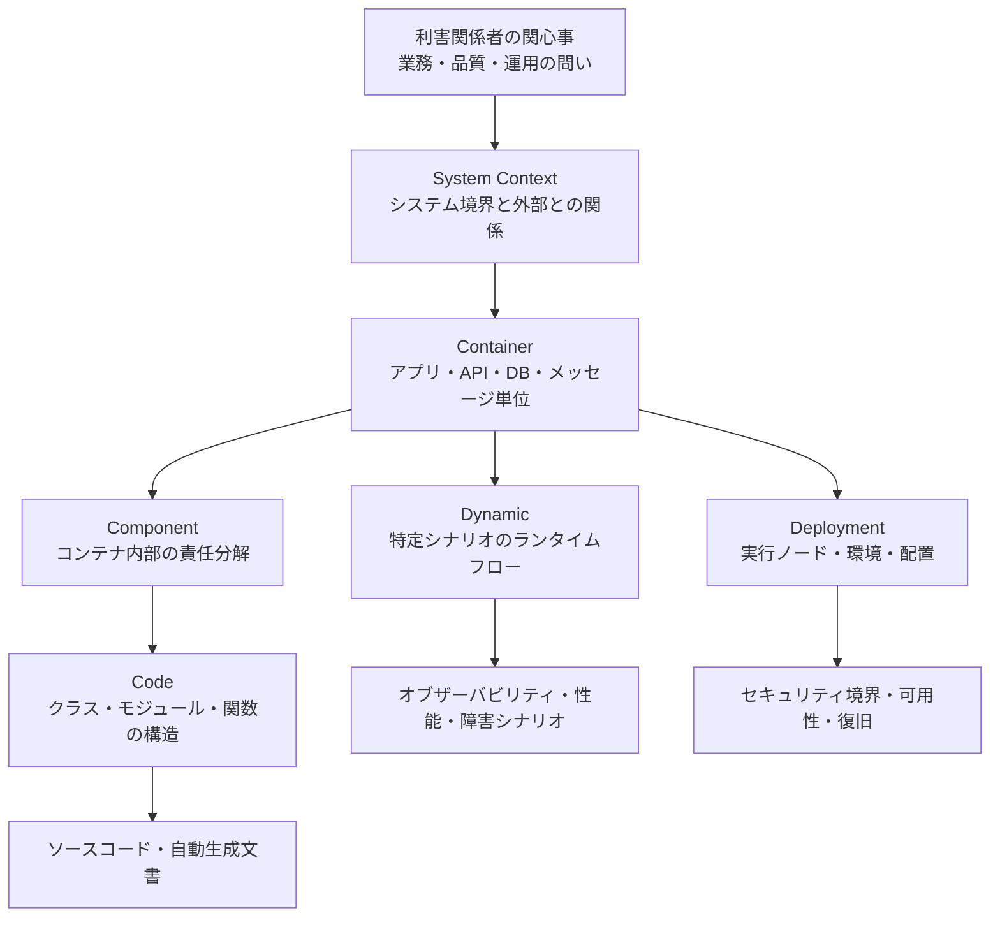
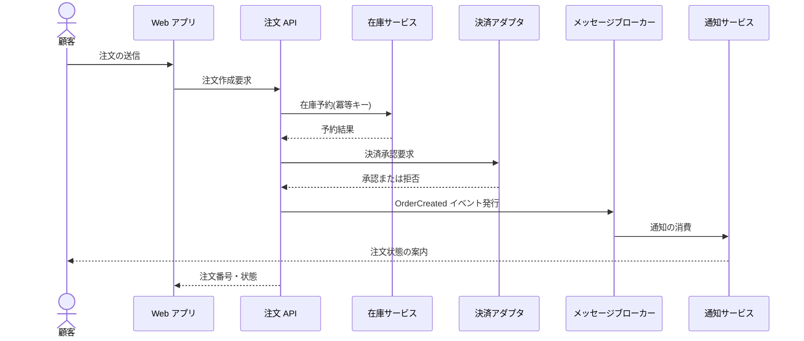
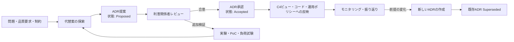
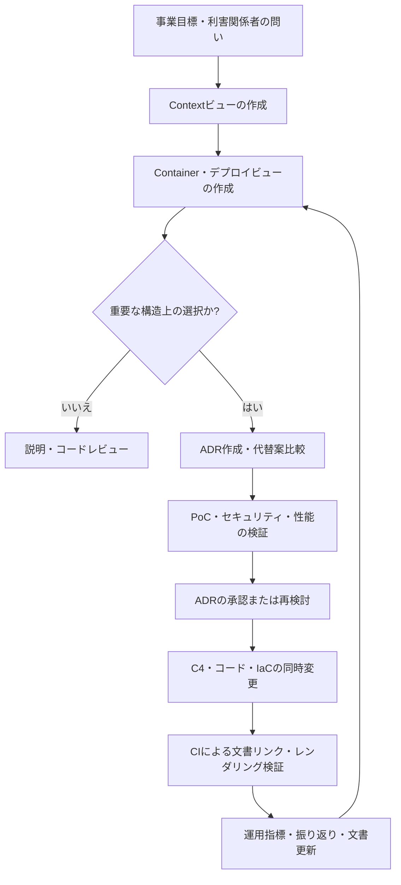

# C4モデルとADRに基づくソフトウェアアーキテクチャの文書化

## 1. 概要

> **C4モデルとADRに基づくアーキテクチャ文書化**とは、ソフトウェアの構造を利害関係者ごとの抽象化レベルで可視化し(C4)、重要な設計上の選択とその根拠・トレードオフを意思決定記録(ADR)として残すことで、アーキテクチャ知識の持続性を確保する方法である。

ソフトウェアアーキテクチャは、システムの機能一覧だけでは伝わらない。
ユーザや外部システムとの境界、デプロイ単位、データストア、ランタイムの呼び出しフロー、セキュリティ境界を併せて説明してはじめて、開発・運用・セキュリティ・事業の担当者が同じシステムを見ることができる。
しかし、すべての内容を一つの巨大な構成図に詰め込むと線や箱が過度に多くなり、肝心の重要な境界や依存関係が見えなくなる。

C4モデルは、地図を拡大するようにシステムをContext、Container、Component、Codeの階層に分け、必要なレベルで構造を表現する。
上位レベルでは非技術系の利害関係者もシステムの責任と外部依存を理解でき、下位レベルでは開発者が特定のコンテナの内部分解を追跡できる。
すべてのレベルの図を無条件に作成することが目的ではなく、問いと読者に合ったビューを選択することが目的である。

図だけでは、「なぜこのデータベースを選択したのか」「なぜ同期呼び出しの代わりにイベントを使ったのか」を説明することは難しい。
時間が経って担当者が替わると、現在の構造は残っても、当時の規制・性能・コスト・組織上の制約は失われる。
ADRは、アーキテクチャ上重要な一つの決定を、当時の文脈、選択、代替案、結果とともに簡潔に記録することで、こうした記憶の喪失を減らす。

C4とADRは互いに代替し合う関係ではない。
C4がシステムの現在の姿を「何がどこにあり、どのようにつながっているか」として示すのに対し、ADRは「なぜその構造を選び、どのような代償を受け入れたか」を補完する。
二つの成果物をコードリポジトリとともにバージョン管理し、相互にリンクすれば、設計変更時に構造と意思決定の不一致を発見しやすくなる。

技術士の答案では、C4を単なる図の表記法に、ADRを議事録に矮小化してはならない。
第一に、利害関係者の関心事と品質特性から必要なビューを導出しなければならない。
第二に、C4要素の境界と責任を文章で説明し、関係の方向・プロトコル・データの意味を明示しなければならない。
第三に、ADRには肯定的な効果だけでなく、性能・セキュリティ・運用・移行コストといった否定的な結果も記録しなければならない。

### A. 登場背景と必要性

第一の背景は、分散システムの複雑さの増大である。
単一アプリケーションの時代にはソースコードと実行ファイルを読むだけでおおよその構造を把握できたが、現在のサービスはWeb・モバイルクライアント、API、メッセージブローカー、キャッシュ、複数のデータストア、外部SaaSで構成されている。
一つの画面の呼び出しが複数のサービスと非同期イベントを経由すると、新しいメンバーが実行環境を見るだけでは、全体の責任境界を把握することが難しい。

第二の背景は、文書の読者と目的が互いに異なるという事実である。
経営陣は、システムがどの業務を支援し、どの外部パートナーとつながっているかを知りたがる。
運用者は、障害ドメイン、デプロイノード、監視の位置、復旧経路を必要とする。
開発者は、モジュールの責任、インタフェース、データフロー、変更の影響範囲を確認しなければならない。
一つの詳細設計図を全員に押し付けると、読者ごとの重要な情報が埋もれてしまう。

第三の背景は、設計根拠の忘却である。
プロジェクトの初期には複数の代替案を検討したが、最終的なコードには選択された結果だけが残る。
数年後、新しい担当者は現在の制約を知らないまま同じ議論を繰り返したり、性能・規制・運用上の理由がある決定を単に古いコードと誤解したりする可能性がある。
ADRは、選択の結果ではなく、選択がなされた過程と当時の判断基準を保存する。

### B. 目標と適用範囲

文書化の目標は、すべてのコードを図として複製することではない。
第一の目標は、システムの境界と責任を素早く共有することである。
第二の目標は、重要な品質特性の要求と構造上の選択との関係を説明することである。
第三の目標は、変更時の影響分析とオンボーディングの時間を短縮することである。
第四の目標は、設計負債と文書負債を併せて管理することである。

適用範囲は、新規システムの設計段階だけでなく、既存システムのリバースエンジニアリングにも及ぶ。
新規プロジェクトは、業務目標と品質シナリオから出発して、C4ビューとADRを併せて作成する。
レガシーシステムは、まず現在の動作を観察してContext・Containerビューを作成し、不確かな部分は「要確認」と表示したうえで、変更作業とともに段階的に補完する。

文書が実際の運用で使われるためには、コードと同じリポジトリでレビューされなければならない。
例えば、`docs/architecture/c4/`には図のソースと説明を置き、`docs/architecture/adr/`には番号が増加していくADRを格納できる。
大規模な組織では、共通の原則を中央のカタログとして置きつつ、サービスごとの構造と決定は当該サービスのリポジトリに残す方式が、トレーサビリティと所有権のバランスをとる。

## 2. C4モデルの階層と表現原則

C4モデルは、ソフトウェアアーキテクチャを四つの中核的な抽象化レベルに分ける。
System Contextはシステムと人・外部システムとの関係を、Containerはシステム内部の実行・デプロイ単位を、Componentは一つのコンテナ内部の論理的な責任を、Codeはコンポーネントの実装構造を表す。
これに加えて、特定のシナリオの順序を説明するDynamic diagramと、コンテナのインフラ配置を示すDeployment diagramを補助的に使用できる。



この階層は、組織の公式な組織図やマイクロサービスの数と同じ概念ではない。
Containerは、必ずしもコンテナ技術で実行されるプロセスだけを指すのではなく、一つのアプリケーション・サービス・データストアのように、独立して実行またはデプロイされる単位を意味する。
したがって、モノリシックなシステムも一つのContainerとして表現でき、その内部のモジュールをComponentとして説明できる。

### A. System Context図

System Context図は文書の出発点である。
対象システムを一つの中心の箱として置き、システムとやり取りするユーザの役割と外部システムを周囲に配置する。
このレベルでは内部のクラスやフレームワークを入れず、システムの責任、外部との関係、主要なデータ・業務の流れを平易な文章で説明する。

良いContextビューは、「このシステムが何をするか」と「何をしないか」を併せて示す。
例えば、ショッピングの注文システムは顧客・相談員・決済ゲートウェイ・配送パートナーとつながり得るが、決済承認そのものは外部決済システムの責任であると表示しなければならない。
境界を明確にしないと、障害の責任、個人情報処理の責任、インタフェース変更の責任を誤って配分してしまう。

実務では、まずユーザジャーニーと外部連携の一覧をインタビューで把握し、各関係に目的・方向・主要な情報・信頼境界を記録する。
「呼び出す」という線だけを描く代わりに、「注文システムが決済承認要求を送り、承認結果を受け取る」のように、関係の意味を書く。
こうすれば、非技術系の担当者も業務範囲をレビューでき、セキュリティ担当者は外部境界に対する認証・暗号化の要件について問いかけることができる。

### B. Container図

Container図はシステム内部の主要な実行単位を示すものであり、ほとんどのチームにとって最も高い投資対効果をもたらす。
Webアプリケーション、モバイルアプリ、APIサービス、バッチジョブ、メッセージブローカー、リレーショナルデータベース、オブジェクトストレージのように、独立して実行・デプロイ・スケールする要素を表示する。
各要素には、責任、技術選択、通信方式、格納データの性質を併せて記載しなければならない。

Containerを分ける理由は、単にサービスの数を増やすためではない。
変更周期、障害分離、スケーリング要件、セキュリティ・データ所有権、チームの責任範囲が異なるときに、別個の単位が意味を持つ。
逆に、ネットワーク呼び出しだけが増えてデータとデプロイが一緒に束ねられているのであれば、形式上複数のサービスに分けたことが、かえって運用の複雑さを増大させかねない。

次のような問いでContainerの境界を検討する。
第一に、この要素は独立してデプロイまたはロールバックできるか。
第二に、データと不変条件の所有者は明確か。
第三に、呼び出しの遅延と障害の伝播を受け入れるだけの理由があるか。
第四に、チームの業務境界と変更承認のフローが構造と一致しているか。
これらの問いに答えられない分割は、「分散のための分散」である可能性が高い。

### C. Component図とCode図

Component図は、特定のContainer内部の主要な論理コンポーネントと責任を示す。
例えば、注文APIの中には、注文バリデータ、価格ポリシーサービス、在庫予約アダプタ、決済オーケストレータ、イベントパブリッシャーがあり得る。
各コンポーネントは一つの責任と明確な依存方向を持つべきであり、外部インタフェースとデータ変換のポイントを区別しなければならない。

Componentレベルは、すべてのコンテナに機械的に適用するものではない。
内部構造が単純であったり、コード自体が十分に説明していたりするならば、文書を作らない方がよい。
逆に、ルールが複雑な決済・権限・精算モジュールのように、変更の影響が大きく新しい人員が頻繁に触れる領域では、Componentビューの価値が高い。

Codeレベルは、クラス・インタフェース・パッケージ・関数といった実装の詳細を表現する。
手作業ですべてのコードを描くとすぐに陳腐化するため、IDEや静的解析ツールで自動生成するか、アルゴリズム・中核となるドメインモデルのように本当に必要な部分だけを限定的に記録する。
文書に表示されたクラスが実際のコードと異なれば読者はすべての文書を信用しなくなるため、自動化の可能性が低いCodeビューは思い切って省略してもよい。

### D. Dynamic図・Deployment図

Dynamic図は、静的な接続関係だけでは理解しにくい一つのシナリオを、番号付きの順序で説明する。
「注文作成」においてAPIが在庫を予約し、決済を要求した後にイベントを発行するフローや、障害時のリトライ・補償処理を示すことができる。
シナリオごとに正常フローと失敗フローを分けると、タイムアウト、重複メッセージ、冪等性、トランザクション境界について議論しやすくなる。

Deployment図は、Containerがどの実行ノード・クラウドリソース・アベイラビリティゾーンに配置されるかを表現する。
開発・ステージング・本番環境の違い、パブリック・プライベートのネットワーク境界、シークレット管理の場所、レプリケーションとフェイルオーバーのノードを表示する。
アプリケーション構造とインフラ構造を結び付ければ、「同じコードなのに本番でだけ失敗する理由」や「一つのノードの障害がどのサービスに影響するか」を追跡できる。



動的フローにおいて、矢印の向きは呼び出しの方向を、点線や別の表記は非同期の伝達を表すよう、チームのルールを定める。
線の形だけに頼らず、各関係に同期・非同期、リトライ、タイムアウト、データ契約を文章で併記する。
図は素早い理解のための地図であり、運用ルールは説明文とテスト・設定によって検証されなければならない。

## 3. ADRの構造と意思決定の管理

ADRは、アーキテクチャに持続的な影響を与える一つの決定を記録する短い文書である。
機能実装のチケットやすべてのコードレビューをADRにすると、重要な決定のシグナルが埋もれてしまう。
逆に、データストア、認証方式、通信パターン、デプロイ戦略、個人情報の保管場所のように、元に戻すことが難しく複数の品質特性に影響する選択はADRの候補とする。



### A. Contextと問題定義

Contextには、結論をあらかじめ正当化する表現よりも、意思決定当時の事実と作用する力を中立的に記載する。
事業目標、予想負荷、規制要件、チームの能力、スケジュール、既存システムの制約、データの特性を含めなければならない。
「最新技術だから」といった文言は検証基準にならないため、どの品質特性とどの運用条件を改善しようとしているのかを具体化する。

例えば、「注文イベントをメッセージブローカーで伝達する」という決定のContextには、決済承認と通知の処理時間が異なること、通知プロバイダの障害が注文作成に伝播してはならないこと、イベントの重複に耐えられるコンシューマ設計が必要であることを記載する。
このように書いておけば、後でトラフィックの規模や通知の要件が変わった際に、既存の決定の前提が依然として有効かどうかを判断できる。

### B. Decisionと代替案の比較

Decisionは、「我々は何を選択する」という能動形の文で記述する。
選択した技術名だけを書くのではなく、適用範囲、インタフェースの原則、例外条件、移行計画を含める。
例えば、「注文作成と決済承認の間は同期呼び出しを維持するが、通知・検索インデックスの更新は`OrderCreated`イベントとして分離し、イベントコンシューマは注文IDに対して冪等性を保証する」のように境界を明示する。

代替案は最低二つ以上を検討し、選択しなかった理由を残す。
代替案の比較は機能の一覧を列挙することではなく、現在のContextにおいて品質特性に及ぼす影響と、組織が負担するコストを説明しなければならない。
次の表は、メッセージ伝達方式の選択の例である。

| 代替案 | 利点 | 負担・リスク | 適用判断 |
|---|---|---|---|
| すべて同期REST呼び出し | フローが直観的で即座に結果を確認可能 | 障害伝播と結合度の増加、ピーク時のスケーリングの限界 | 強い即時一貫性が必要な中核段階 |
| すべて非同期イベント | 結合度と独立したスケーラビリティの改善 | 遅延・重複・順序・トレーサビリティの管理が必要 | 後続処理と大規模なイベントフロー |
| 中核は同期・付加は非同期の混合 | ユーザ応答と障害分離のバランス | 二つのモデルの運用・オブザーバビリティのルールが必要 | 注文・決済と通知を分離する一般的な戦略 |

表の「混合」を選択したからといって、常に最善であるとは限らない。
決済承認のように、ユーザが即座に成否を知る必要がある段階は、同期経路に置く方がエラー処理が明確になる場合がある。
一方、メール送信のように数秒の遅延を許容できる処理は、非同期化することで外部プロバイダの遅延が注文APIの応答を妨げないようにできる。
したがって、選択の結果は業務の許容遅延と失敗時の補償方式に基づかなければならない。

### C. Consequencesと状態管理

Consequencesには、肯定的・否定的・中立的な結果をすべて記載する。
メッセージベースの構造はサービスの結合度を下げ、独立したスケーリングを助けるが、結果整合性・重複消費・順序の入れ替わり・トレースIDの伝播を新たに管理しなければならない。
否定的な結果を隠すとADRは宣伝文書となり、将来の運用者は実際のコストを予想できなくなる。

ADRの状態は、少なくともProposed、Accepted、Deprecated、Supersededのような明確なライフサイクルを持つ。
Acceptedの文書を後から黙って修正すると、当時の判断の記録と現在の知識が混ざってしまう。
決定を覆す際には新しいADRを作成し、既存の文書に置換先の文書番号と移行の理由を残す。

変更されたC4構造は、関連するADRと同じ変更のまとまりの中でレビューする。
例えば、データベースを置き換えるプルリクエストには、Containerビューの技術名、Deploymentビューの配置、データ移行戦略、該当ADRの状態変更が併せて含まれていなければならない。
文書とコードが別々のリリースで動くと、図には存在するが実際には呼び出されていないサービスのような幽霊構造が生まれる。

### D. ADRテンプレートの例

実務で使用できる最小限のテンプレートは次のとおりである。

```markdown
# ADR-0012: 注文の後続処理をイベント駆動として分離

- 状態: Accepted
- 日付: 2026-09-18
- 関連C4: Container - Order API, Notification Service

## Context
注文作成の応答時間と、通知プロバイダの外部遅延とを分離する必要がある。

## Decision
注文APIは、注文作成の完了後にOrderCreatedイベントを発行する。
通知コンシューマは、注文IDを冪等キーとして使用する。

## Alternatives
すべての後続処理を同期呼び出しする方式と、バッチポーリング方式を検討した。

## Consequences
注文応答は安定化するが、結果整合性、再処理、イベント追跡を運用しなければならない。

## Follow-up
重複消費率と通知遅延をモニタリングし、四半期ごとに再処理訓練を実施する。
```

テンプレートの目的は、形式を厳格に強制することではなく、決定の文脈と結果を漏らさないようにすることである。
チームの規模が小さければ、Status・Context・Decision・Consequencesだけで始めてもよい。
規制産業や複数のチームが共同で運用するプラットフォームであれば、意思決定者、協議者、影響を受けるサービス、検証指標、有効期限・再検討の条件を追加する。

## 4. C4とADRの統合運用プロセス

統合運用は、「図を描いた後に文書を別途書く」という順序ではなく、問い・決定・検証を結び付ける循環的な過程である。
まずContextビューでシステムの境界と外部との関係について合意し、Containerビューで責任・デプロイ・データ所有権を検討する。
品質特性の衝突や元に戻すことの難しい選択が見つかればADRを提案し、承認後に関連するC4要素と実装に反映する。



### A. 文書の作成とレビュー

設計ワークショップでは、最初から詳細なComponentビューを描かない。
ユーザと外部連携のあるContextをまず確認し、業務上の責任と品質シナリオをContainerの境界にマッピングする。
その後、障害分離・スケーリング・データ一貫性といった論点が生じた要素だけを、ComponentビューとDynamicビューに拡張する。
この順序は、不要な詳細化と会議時間を減らす。

レビュー担当者は、表記法よりも意味を先に検討すべきである。
システムの主体・対象が正しいか、データの所有者が表現されているか、信頼境界と障害経路が抜けていないか、各ADRの決定が現在のコード・デプロイ設定と一致しているかを確認する。
図形の位置や色にばかり時間を使うと、文書は見栄えがよくなっても設計上のリスクは減らない。

### B. Docs-as-Codeと自動化

図のソースとADRをGitに格納すれば、コードと同じブランチ・プルリクエスト・レビュー・変更履歴を利用できる。
Mermaid、PlantUML、Structurizr DSLのようなテキストベースの表現は、レンダリングの自動化と検索に有利であるが、チームが採用したツールの文法と出力の安定性を考慮しなければならない。
ツールよりも重要なのは、実際に変更を行う者が文書を併せて修正できる低いコストである。

CIでは、Mermaidの文法、リンクの有効性、ADR番号の重複、Supersededのリンク、C4要素の必須説明を検査できる。
デプロイパイプラインで生成されたHTML・PNGを成果物として保管し、運用変更の承認画面に関連ADRのリンクを表示すれば、文書が一回限りの成果物で終わることを防げる。
ただし、自動生成されたCodeビューが最新だからといってアーキテクチャの意図まで説明してくれるわけではないため、構造的な解釈は人が維持しなければならない。

### C. 文書品質の指標

文書化の効果は、文書ファイルの数ではなく、問いに答える速さと変更の安全性で測定する。
例えば、新しい開発者が中核システムの境界とデプロイフローを把握するまでにかかる時間、障害対応時に関連する依存関係と担当チームを見つけるまでの時間、重要な決定のうちADRリンクがあるものの比率を追跡できる。
文書が増えたのにオンボーディングの時間が短縮されないのであれば、読者に不要な詳細情報が過剰に供給されているか、内容の信頼性が低いことを意味する。

具体的な運用基準はシステムごとに定める。
中核サービスのContainerビューは主要なデプロイ変更の前にレビューし、ADRはデータストア・認証・通信プロトコルといった構造上の決定ごとに作成する。
図とコードの不一致の欠陥、古いADRの比率、リンクエラー、運用事故で漏れていた依存関係も、文書負債の指標として管理できる。

## 5. 比較と事例

### A. C4とUML・単一の巨大構成図の比較

UMLは多様なモデルと精緻な表記法を提供し、特定の設計・振る舞いを厳密に表現することに強みがある。
C4は、限られた中核概念と階層を用いて、チームと非技術系利害関係者の間のコミュニケーションを迅速にすることに焦点を当てている。
したがって、どちらか一方だけが正しいとするよりも、C4で全体の地図を作り、UMLやコードモデルで複雑な内部アルゴリズムを補完する組合せが現実的である。

単一の巨大構成図は一枚に多くの情報を盛り込めるが、読者ごとの関心事と変更周期が混在する。
C4の複数のビューは、同じモデルを異なる拡大レベルで提供することで情報量を制御する。
その代わり、各ビュー間で要素名・関係・責任を一貫して維持しなければならないため、文書のガバナンスが必要となる。

| 区分 | C4モデル | UML中心の文書 | 単一の巨大構成図 |
|---|---|---|---|
| 中核目的 | 読者別のアーキテクチャ理解 | 設計構造・振る舞いの精密な表現 | 全体の関係を一度に表示 |
| 抽象化 | Context→Container→Component→Code | 図の種類ごとに多様 | 一枚に混在しやすい |
| 利点 | 説明・拡大・オンボーディングに有利 | 形式的なモデリングと詳細設計 | 作成初期には素早い概観 |
| 主なリスク | 関係のルールがなければ曖昧 | 過度な形式と作成コスト | 複雑さ・可読性の低下 |
| 補完策 | 説明文・ADR・自動検証 | 読者別のビューと要点のみの選別 | 階層化と分割・リンク |

### B. Eコマース注文プラットフォームの事例

Eコマースプラットフォームにおいて、Contextビューは顧客・運用者・注文システム・決済ゲートウェイ・配送パートナー・顧客通知プロバイダを区別する。
Containerビューは、顧客向けWebアプリ、注文API、在庫サービス、決済アダプタ、注文DB、イベントブローカー、通知サービスへと拡張する。
この構造だけでも、決済プロバイダの障害が注文照会と同じ障害なのか、通知プロバイダが注文の中核経路上にあるのかを議論できる。

「通知をイベントとして分離する」という選択はADRとして残す。
Contextには、注文成功応答の目標遅延時間、通知の許容遅延、外部プロバイダのエラー率とリトライの制限を記録する。
Decisionには、イベントスキーマのバージョン、重複処理キー、失敗キューと再処理の責任を明示する。
Consequencesには、ユーザにとって注文は成功したが通知が遅れて届く可能性がある点と、運用者が再処理キューを監視しなければならない点を含める。

例えば、ピーク時に注文APIが毎秒2,000件を処理しなければならず、通知APIが平均1秒、障害時には最大30秒遅延し得ると仮定しよう。
通知を同期呼び出しにすると、注文応答のテールレイテンシが外部APIによって大きくなり、リトライまで含めるとスレッド・コネクションプールが枯渇する可能性がある。
イベントとして分離すれば注文経路の遅延を制限できるが、イベント発行の成功とDBトランザクションの原子性を保証するために、Transactional Outboxのような追加設計を検討しなければならない。

### C. 金融・公共システムにおける文書化

金融・公共システムでは、個人情報、監査証跡、障害復旧、供給業者への依存を併せて説明しなければならない。
Contextビューには市民・職員・機関・外部認証機関といった主体を、Deploymentビューにはネットワーク分離・暗号化区間・バックアップサイトを表示する。
ADRには、認証手段と鍵管理方式、データ保存期間、外部クラウドの利用範囲と監査証跡の責任を残す。

この環境では、「後で文書を補強する」というアプローチは危険になり得る。
認証・個人情報の保存・国外移転に関わる決定は、実装前にセキュリティ・法務・監査の担当者とレビューし、決定の根拠と例外承認の有効期限を記録しなければならない。
ただし、ADR自体がコンプライアンスを自動的に保証するわけではないため、ポリシー、テストの証跡、アクセスログと結び付けて使用しなければならない。

## 6. 深掘り:アーキテクチャ知識の持続性と変化の管理

C4とADRの結合は、現在の構造を説明する文書から、アーキテクチャのナレッジグラフへと発展し得る。
C4要素には所有チーム、品質特性、運用ダッシュボード、API契約、関連ADRをリンクし、ADRには影響を受ける要素と検証指標を逆リンクする。
そうすれば、特定のデータストアを置き換える際に、関連するサービス・デプロイノード・セキュリティ統制・決定の前提まで、影響範囲を検索できる。

アーキテクチャは時間とともに侵食される。
チームが一時的な連携を追加して文書を更新しなければ、実際の構造と意図した構造との間に差が生じる。
これを防ぐには、重要なC4の関係に対するアーキテクチャ適合性チェックをCIに組み込み、ADRの前提とSLO・コスト・セキュリティの指標を定期的に再検討しなければならない。
チェックは「文書がコードと同じか」だけでなく、「現在の選択が依然として事業目標に合っているか」も問わなければならない。

例えば、データ規模が当初の予想よりも大きくなり単一DBのスケーリングが限界に達すると、既存ADRのContextの数値はもはや合わなくなる可能性がある。
このとき、既存のADRを修正して過去の記録を消すのではなく、シャーディング・読み取りレプリカ・分析用ストアの分離といった代替案を調査した新しいADRを作成する。
新しいContainer・Deploymentビューとデータ移行の検証結果を併せてレビューし、以前のADRをSupersededと表示すれば、判断の連続性と変化の理由をともに保存できる。

AIコーディングツールと自動文書生成が普及しても、意思決定の責任は自動化されない。
コードから呼び出しグラフを抽出してComponentの草案を作ることはできるが、特定の境界をチームの所有とするか、個人情報をどのシステムが保管するか、性能とコストのどの地点を許容するかは、組織の判断である。
自動生成の結果には生成時点と分析範囲を表示し、人によるレビューとADRの承認を経た結果のみを公式なアーキテクチャとして扱わなければならない。

## 7. 考慮事項および示唆

### A. 目的に基づく最小限の文書化

すべてのシステムに同じ数の図とADRを強制すると、文書は形式的な業務と化す。
中核となる利害関係者の問い、変更リスク、障害の影響、規制上の義務を基準に、必要なビューを選択しなければならない。
最小限のContextとContainerから始め、複雑な領域にのみComponent・Dynamic・Deploymentを追加する段階的なアプローチが、持続性を高める。

### B. 現在の状態と目標状態の区別

設計文書には、現在(As-Is)、承認された目標(To-Be)、実験中の代替案を混在させてはならない。
各C4ビューに状態と基準となるコミット・環境を表示し、ADRの状態と適用範囲を明確にする。
特に移行中は、旧・新システムとデータ同期の関係をDeployment・Dynamicビューで表現し、運用者がどの経路を信頼すべきかを分かるようにしなければならない。

### C. 品質特性と検証の連結

アーキテクチャ上の選択は、「スケーラブルである」のように抽象的に終わらせず、測定可能なシナリオと結び付ける。
応答時間、スループット、復旧時間、データの鮮度、監査ログの保存、脆弱性対応時間などの検証指標をADRに記載し、PoC・負荷試験・セキュリティ試験の結果をリンクする。
検証されていない品質上の主張は、設計意図ではなく仮説として扱うべきである。

### D. セキュリティ・個人情報と変更責任

C4のContextビューとDeploymentビューには、信頼境界、認証・認可ポイント、暗号化区間、個人情報のフローを表示する。
ADRには、データ最小化、アクセス主体、保存・削除、鍵のローテーション、事故時の対応責任を、構造上の決定とともに記録する。
セキュリティレビューが終わった後に構造が変われば、関連するADRと脅威モデルも再レビューしなければならず、文書だけを更新して統制を適用しない形式的な準拠は避けるべきである。

### E. 文書の所有権と更新トリガー

文書には担当チームと最終レビュー日を表示し、デプロイ単位・インタフェース・データストア・認証境界が変わった際には更新を求める。
「四半期ごとにすべて描き直す」というルールだけでは変更直後の不一致を防げないため、コードレビューとリリースのチェックリストに文書更新を含める方が効果的である。
所有者のいない中央Wikiよりも、サービスを運用するチームのリポジトリに文書を置き、組織共通の標準は再利用可能なテンプレートとして提供することが望ましい。

### F. 技術士の観点からの展望

今後、アーキテクチャ文書は、静的な画像よりも、コード・IaC・オブザーバビリティ・ポリシーと結び付いた検証可能な知識資産とならなければならない。
しかし、自動化のレベルが高まるほど、「図が生成された」ことと「意図とトレードオフが合意された」こととを区別しなければならない。
技術士は、表記法の選択よりも、事業目標、品質特性、組織運営、規制と変化管理の間のつながりを設計し、文書化する役割を担わなければならない。

## 参考資料

- C4 Model 公式サイト: https://c4model.com/
- C4 Model 図の案内: https://c4model.com/diagrams
- C4 Model 紹介: https://c4model.com/introduction
- Architectural Decision Records コミュニティ: https://adr.github.io/
- Michael Nygard, Documenting Architecture Decisions: https://www.cognitect.com/blog/2011/11/15/documenting-architecture-decisions

---

> **一言まとめ**: C4によってアーキテクチャの「何」を読者ごとのレベルで示し、ADRによって「なぜ」とトレードオフを記録することで、構造・コード・運用がともに進化する、生きた設計文書を作る。
