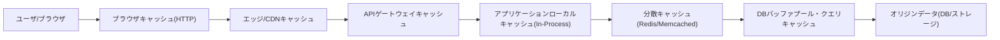
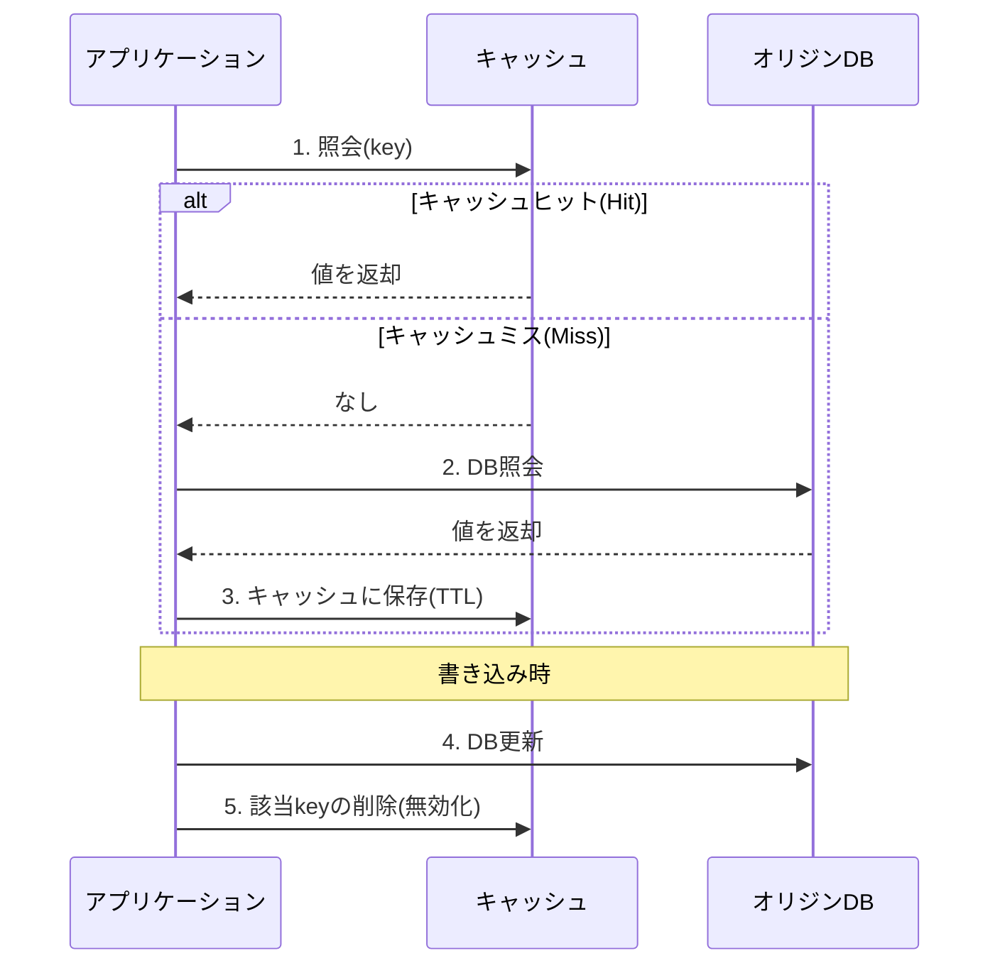
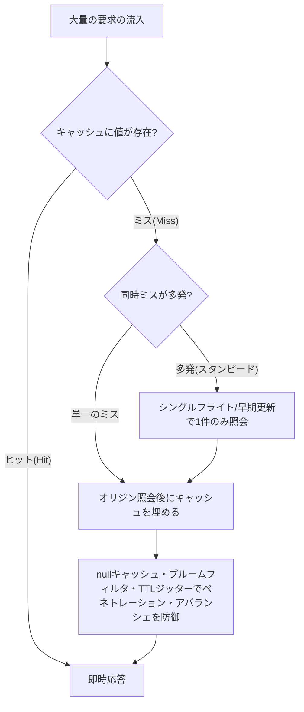

# キャッシュ戦略(Caching Strategy)と分散キャッシュの設計

## 1. 概要

> **定義:** キャッシュ(Cache)とは、相対的に遅くコストの大きいストレージ(ディスク・リモートDB・外部API)のデータを、アクセス速度の速い階層(メモリ・SSD・エッジノード)に複製として保持し、同一または類似の要求に対してオリジンへのアクセスを回避することで、遅延時間と負荷を削減する性能・スケーラビリティの手法である。キャッシュ戦略(Caching Strategy)とは、この複製をいつ・どのように埋め(read/write path)、どれだけ長く維持し(TTL・eviction)、オリジンとどのように整合性をとるか(invalidation)を決定する設計原則の集合である。

キャッシュが情報システムの中核的な設計要素として浮上した背景には、三つの構造的な圧力がある。第一に、ストレージ階層間の性能格差の拡大である。CPUキャッシュへのアクセスがナノ秒単位であるのに対し、DRAMは数十ナノ秒、SSDは数十マイクロ秒、ネットワークを越えたリモートDBの照会は数ミリ秒に及ぶ。階層間の数千倍の格差は、「よく使うデータを近くに置く」という局所性(Locality)の原理を、システム全体へと拡張させた。第二に、読み取り偏重(read-heavy)ワークロードの一般化である。大半のWeb・モバイルサービスは書き込みに対する読み取りの比率が数十倍以上であり、少数の人気項目がトラフィックの大部分を占めるべき乗則(power-law)分布を示す。このとき、上位少数の項目をキャッシュするだけでオリジン負荷の大部分を吸収できる。第三に、クラウドの課金構造である。DB照会・関数呼び出し・外部APIがすべて従量課金される環境では、キャッシュヒット(cache hit)一件がそのままコスト削減であり、FinOpsの観点からキャッシュは性能ツールであると同時に原価削減の手段でもある。

しかし、キャッシュは本質的に「オリジンデータの古い複製」を許容する代償として性能を得る手法である。したがって、キャッシュ設計の難しさは速度を上げることにあるのではなく、**一貫性・整合性をどこまで犠牲にするか**を決定することにある。Phil Karltonの有名な警句にあるように「コンピュータサイエンスで難しいことは二つ、キャッシュの無効化と命名である」が、これはキャッシュがデータの鮮度(freshness)、整合性(consistency)、可用性(availability)の間のトレードオフを強いるためである。技術士の観点では、キャッシュ戦略は単なる性能チューニングではなく、サービスの整合性要求水準・障害許容度・コスト目標を定量的に反映するアーキテクチャ上の意思決定として扱わなければならない。

本稿では、キャッシュの階層構造とデータアクセスパターン(読み取り/書き込み経路)、エビクション(eviction)と無効化(invalidation)の戦略、分散キャッシュの設計と代表的な障害シナリオ(スタンピード・ペネトレーション・アバランシェ)、そして最新動向と技術士の観点からの考慮事項を順に扱う。

## 2. キャッシュの階層構造と構成

キャッシュは特定の製品ではなく、システムの全階層にわたって存在する「パターン」である。クライアントからオリジンストレージに至る経路上の複数の地点に複製が置かれ、各階層は遅延時間・容量・共有範囲・無効化の難易度が異なる。以下の構造図は、要求がオリジンに到達するまでに通過する代表的なキャッシュ階層を示している。

階層をオリジンからユーザ側へとたどると次のようになる。**DB内部キャッシュ**(バッファプール・プランキャッシュ)はDBMSが自動管理する最も内側のキャッシュであり、開発者が直接制御することは難しいが、インデックス・クエリのチューニングによってヒット率を高めることができる。**分散キャッシュ**は複数のアプリケーションインスタンスが共有する別個のキャッシュサーバ(Redis・Memcached)であり、状態を外部化してアプリケーションをステートレス(stateless)に保ち、水平スケーリングを可能にする中核的な階層である。**アプリケーションローカルキャッシュ**(in-process、例:Caffeine・Guava)はプロセスのヒープ内部に置くことでネットワークの往復さえも排除するが、インスタンスごとに複製が異なるため整合性の管理が難しい。**APIゲートウェイ・CDN・ブラウザキャッシュ**は、オリジンから遠ざかるほど応答をユーザの近くに置いて遅延を劇的に削減するが、その分、無効化の到達範囲が広く、制御が難しくなる。

ここでの中核的な洞察は、**オリジンから遠ざかるほど(ユーザに近づくほど)性能上の利得は大きくなるが、無効化は難しくなる**という相反関係である。ブラウザにキャッシュされたデータはサーバが強制的に消去できないため、TTLの満了やバージョン付きURL(cache busting)に頼らざるを得ないのに対し、分散キャッシュの項目はサーバが即座に削除できる。したがって、頻繁に変わり整合性が重要なデータは内側の階層に、ほぼ不変の静的アセットは外側の階層に置くのが原則である。例えば、画像・CSS・JSのような静的アセットはファイル名にハッシュを入れてCDNに1年のTTLで置き(内容が変わればファイル名が変わるので安全)、ユーザのアカウント残高のように整合性が重要なデータは、短いTTLの分散キャッシュやキャッシュのバイパスで処理する。

階層ごとの特性を整理すると次のとおりである。ただし、この表は選択の補助資料にすぎず、実際の設計ではデータの変更頻度・整合性要求・共有範囲を併せて検討し、階層を組み合わせなければならない。

| 階層 | 代表的な技術 | 遅延時間(相対) | 共有範囲 | 無効化の難易度 |
|---|---|---|---|---|
| ブラウザ | HTTP Cache-Control/ETag | 0(往復なし) | 個々のユーザ | 非常に高い(TTL依存) |
| CDN/エッジ | CloudFront・Cloudflare | 数 ms | 全世界のユーザ | 高い(purge API) |
| 分散キャッシュ | Redis・Memcached | サブms~数 ms | 全インスタンス | 低い(即時削除) |
| ローカル(In-Process) | Caffeine・Ehcache | 数十 ns | 単一インスタンス | 中程度(伝播が必要) |
| DB内部 | バッファプール・プランキャッシュ | 自動 | DBノード | 自動管理 |

## 3. データアクセスパターン — 読み取り・書き込み経路の戦略

キャッシュ戦略の実質は、「読み取り時にどう埋め、書き込み時にオリジンとどう同期するか」にある。これを読み取り経路と書き込み経路に分けて見ていく。以下のシーケンスは、最も広く使われているCache-Aside(Lazy Loading)パターンの読み取り・書き込みのフローを表現したものである。

### 3.1 読み取り経路:Cache-Aside vs Read-Through

**Cache-Aside(Lazy Loading)**は、アプリケーションがキャッシュを直接制御する方式である。照会時にまずキャッシュを見て、ミスであればDBから読み込んでキャッシュに埋めた後に返す。実際に要求されたデータだけがキャッシュに載るためメモリ効率が良く、キャッシュ障害時にもDBへ迂回してサービスが継続するという利点がある。反面、各データへの最初のアクセスは必ずミスとなって遅延が発生し(cold start)、キャッシュを埋めるロジックがアプリケーションコードのあちこちに散らばりやすい。大半のWebサービスがこの方式を基本として採用しており、実務で「キャッシュする」といえば通常このパターンを意味する。

**Read-Through**は、キャッシュ層がミスを検知すると、自らオリジンからデータを読み込んで埋める方式である。アプリケーションは常にキャッシュにのみ要求するため、データアクセスのロジックがキャッシュライブラリにカプセル化され、コードが単純になる。ただし、キャッシュ製品がオリジンへのアクセス方法を知る必要があるため結合度が高まり、カスタムローダーの実装が必要となる。概念的にはCache-Asideに似ているが、埋める責任の主体がアプリケーションではなくキャッシュである点が異なる。

両方式の根本的な違いは**埋める責任の所在**であり、これがそのまま障害時の挙動を決定する。Cache-Asideはキャッシュが落ちてもアプリケーションがDBを直接呼び出して生き残れるが、Read-Throughはキャッシュ層自体がデータ経路上に置かれるため、キャッシュ障害がそのままサービス障害につながる可能性がある。したがって、可用性が最優先のシステムでは、Cache-Asideにサーキットブレーカーを組み合わせることが多い。

読み取り経路の設計で併せて考慮すべき要素が、**デシリアライズ(serialization)のコストとキャッシュキーの設計**である。分散キャッシュは値をバイト列として保存するため、オブジェクトをJSON・Protobufなどでシリアライズ・デシリアライズするコストが発生し、値が非常に大きい場合はこのコストがDB照会の削減分を相殺し得る。また、キャッシュキーは照会条件を一意に識別しなければならないため、`product:{id}:v3`のようにドメイン・識別子・スキーマバージョンを組み合わせる名前空間のルールを定めておけば、スキーマ変更時に古いキャッシュを丸ごと無効化(バージョンの引き上げ)しやすくなる。キー設計をおろそかにすると、異なる条件の結果が同じキーで上書きされるキャッシュ衝突が発生する。

### 3.2 書き込み経路:Write-Through・Write-Back・Write-Around

書き込み戦略は、オリジンとキャッシュを更新するタイミングと順序によって分かれる。**Write-Through**は、書き込み時にキャッシュとDBを同時に(同期的に)更新する。キャッシュが常に最新であるため整合性は高いが、すべての書き込みが二つのストレージを経由して書き込み遅延が大きくなり、一度も読まれないデータまでキャッシュを埋めてメモリを浪費する可能性がある。**Write-Back(Write-Behind)**は、まずキャッシュにのみ書き込み、DBへの反映を非同期に遅延・一括処理する。書き込み性能とスループットは最大化されるが、DBへの反映前にキャッシュが失われるとデータが損失し、整合性・耐久性のリスクが大きい。金融の元帳のように損失が許されないデータには不向きであり、閲覧数・いいねのカウンタのように多少の損失が許容されるデータに適している。**Write-Around**は、書き込みをDBにのみ行ってキャッシュには触れず、次の読み取り時にミスによって自然に埋められるようにする。一度書いたらあまり読まれないデータによるキャッシュ汚染を防ぐのに有利である。

実務で最も一般的な組み合わせは、**Cache-Asideの読み取り + 書き込み時のキャッシュ削除(無効化)**である。この方式では「更新時にキャッシュを新しい値で上書きせず、削除する」点が重要であり、これは更新と再照会の競合において古い値を再び書き込んでしまう誤りを減らすためである。ただし、この組み合わせでも「DB更新 → キャッシュ削除」の間に別の要求が古い値を読んでキャッシュに再び埋めると不整合が生じ得るため、削除の順序(先に削除してからDB更新、あるいは遅延二重削除)やTTLによるバックストップを併せて設計する。実測例として、照会APIに60秒TTLのCache-Asideを適用し、毎秒1万件の商品照会のうち上位5%の人気商品がトラフィックの80%を占めるケースで、キャッシュヒット率90%以上を達成し、DB負荷を1/10に下げた事例はよく見られる。

## 4. エビクション(Eviction)と無効化(Invalidation)

キャッシュ容量は有限であるため、満杯になれば一部の項目を選んで追い出さ(エビクション)なければならず、オリジンが変われば古い複製を除去(無効化)しなければならない。この二つはしばしば混同されるが、目的が異なる。**エビクションは空間不足を解決するための容量管理**であり、**無効化は整合性を守るための鮮度管理**である。

エビクションポリシーの代表は**LRU(Least Recently Used)**であり、最も長く参照されていない項目を追い出す。最近使ったデータはすぐに再び使われるという時間的局所性の仮定に合致するため、最も広く使われている。**LFU(Least Frequently Used)**は参照頻度の低い項目を追い出して継続的に人気のある項目を保護するが、過去に一時期人気があって冷めた項目が長く残るという問題があるため、時間減衰(aging)を併せて適用する。**FIFO**は実装が単純であるが、局所性を反映できないためヒット率が低い。最新のキャッシュ(例:CaffeineのW-TinyLFU)は、LRUの新しさとLFUの頻度を組み合わせ、確率的カウンタ(Count-Min Sketch)で頻度を近似することで、少ないメモリで高いヒット率を実現する。

無効化には三つのアプローチがある。第一に、**TTLの満了**は項目ごとに有効期間を設けて自動的に消滅させる最も単純・堅牢な方式であり、最悪の場合でもTTL分だけ古いデータしか露出しないことを保証する。第二に、**明示的な無効化**はオリジンの更新時に関連キーを即座に削除・更新する方式であり、鮮度は高いが、何を消すか(キーの依存関係)を正確に追跡する必要があり、連鎖的な無効化が複雑になる。第三に、**イベントベースの無効化**はDBの変更をCDC(Change Data Capture)で捕捉してキャッシュ無効化メッセージを発行する方式であり、アプリケーションがすべての書き込み経路を把握していなくても整合性を維持できるため、マイクロサービス環境で注目されている。例えば、商品価格が管理コンソール・バッチ・外部連携など複数の経路で変わる場合、経路ごとにキャッシュ削除のコードを入れる代わりに、DBの変更ログを購読して一括で無効化すれば、漏れを防ぐことができる。

無効化の難度は、データ間の依存関係が深いほど急激に高まる。単一のキーだけを消せばよい場合は単純だが、一つのオリジンの変更が複数の派生キャッシュ(集計・一覧・検索結果)に影響を及ぼす場合、どのキーまで消すかを決めること自体が複雑な問題となる。例えば、ある商品の在庫が変わると、その商品詳細だけでなく「在庫のある商品一覧」、カテゴリ別の集計、レコメンド結果にまで古い値が残る可能性がある。こうした派生キャッシュは明示的な削除ですべて追跡することが難しいため、短いTTLをバックストップとして置くか、タグベースの無効化(関連キーに共通のタグを付与してタグ単位で一括削除)を活用する。結局、無効化戦略とは、「完璧な即時整合性」と「管理可能な複雑さ」の間で、データの重要度に応じて妥協点を見いだす作業である。

エビクションと無効化を対比すると次のとおりである。この区別を明確にしてはじめて、「メモリが足りない問題」と「古いデータが見える問題」を混同せず、それぞれに合った対策(容量増設・ポリシー変更 vs TTL短縮・無効化の強化)を立てることができる。

| 区分 | エビクション(Eviction) | 無効化(Invalidation) |
|---|---|---|
| 目的 | 容量管理(空間確保) | 鮮度管理(整合性) |
| 発動条件 | キャッシュが満杯 | オリジンデータの変更 |
| 代表的な手法 | LRU・LFU・FIFO・W-TinyLFU | TTL・明示的削除・CDCイベント |
| 不十分な場合の結果 | ヒット率の低下・性能の低下 | 古いデータの露出・整合性事故 |

## 5. 分散キャッシュの設計と代表的な障害シナリオ

分散キャッシュは、単一ノードの容量を超えるためにデータを複数のノードに分散させる。このとき**コンシステントハッシュ(Consistent Hashing)**を用いれば、ノードの追加・削除時に再配置されるキーを最小化でき、仮想ノード(virtual node)によって負荷を均等に分散させる。しかし、分散キャッシュは規模が大きくなるほど、特有の障害パターンにさらされる。

**キャッシュスタンピード(Cache Stampede / Thundering Herd)**とは、人気キーのキャッシュが満了した瞬間に、多数の要求が同時にミスを起こして一斉にDBへ殺到し、オリジンを麻痺させる現象である。対策としては、ミス時に一つの要求だけがオリジンを照会するようロックをかける**ミューテックス/シングルフライト(single-flight)**、満了前にバックグラウンドであらかじめ更新する**確率的早期満了(probabilistic early expiration)**、満了した値をしばらく提供しながら裏で更新する**stale-while-revalidate**がある。

**キャッシュペネトレーション(Cache Penetration)**とは、存在しないキーを繰り返し照会して(キャッシュにもDBにもないため常にミス)DBを叩き続ける攻撃・エラーのパターンである。「なし(null)」も短いTTLでキャッシュするか、**ブルームフィルタ(Bloom Filter)**で存在しないキーを事前にふるい落として対応する。**キャッシュアバランシェ(Cache Avalanche)**とは、多数のキーが同時に満了したり、キャッシュノードが丸ごとダウンしたりして、瞬間的に負荷がオリジンに集中する現象であり、TTLにランダムなジッター(jitter)を加えて満了を分散させ、キャッシュの多重化・サーキットブレーカー・要求のスロットリングで緩衝する。

これらの障害対応に共通する原理は、**オリジンをキャッシュの背後に置き、要求の殺到から隔離(bulkhead)する**ことである。すなわちキャッシュは性能ツールであるだけでなく、オリジンを保護する防波堤(shock absorber)であり、キャッシュがない、あるいは突破されたときにオリジンが耐えられるかを併せて設計してはじめて、真のレジリエンスを備えることになる。キャッシュを付けたからといってDBを過小にプロビジョニングすると、キャッシュ障害時にオリジンがすぐに崩れるという二重のリスクに陥る。

分散キャッシュの整合性そのものも設計の対象である。キャッシュノードをレプリケーション(replication)すれば可用性は高まるが、レプリケーション遅延の間はノード間で値が異なる可能性があり、ローカルキャッシュを各アプリケーションインスタンスに置けば、同じキーがインスタンスごとに異なる値を持つ可能性がある。これを緩和するため、ローカルキャッシュには非常に短いTTLを付与し、変更時にはPub/Subチャネルですべてのインスタンスへ無効化イベントをブロードキャストする多階層キャッシュ(near-cache)パターンを用いる。結局、分散キャッシュはCAP・PACELC理論が述べる一貫性-可用性-遅延のバランスの問題をそのまま抱えており、どの軸を優先するかはデータの性格によって異なる。

## 6. 深掘り — 最新動向と実務への適用

近年、キャッシュ技術はいくつかの方向に進化している。第一に、**キャッシュの状態ストア化**である。Redisは単純なキー・バリューキャッシュを超えて、データ構造サーバ・ストリーム・Pub/Sub・ベクトル検索へと拡張され、セッション・リーダーボード・レート制限(rate limiting)などの準永続的な状態を担うようになり、キャッシュとデータストアの境界が曖昧になりつつある。第二に、**エッジキャッシングとサーバーレスの結合**である。CDNのエッジで実行されるEdge Functionがパーソナライズされた応答までキャッシュするようになり、静的/動的コンテンツの二分法が崩れつつある。HTTP標準の面でも`stale-while-revalidate`、`stale-if-error`ディレクティブが広くサポートされるようになり、満了したキャッシュで即座に応答してバックグラウンドで更新したり、オリジン障害時に古い値で持ちこたえたりする回復パターンが標準化された。第三に、**セマンティックキャッシング(Semantic Caching)**の台頭である。生成AI・RAGシステムでコストの大きいLLM呼び出しを減らすため、問い合わせを埋め込み(embedding)に変換し、意味的に類似した過去の問い合わせの応答をキャッシュから返す手法が広がっている。文字列が完全に一致しなくても類似度の閾値内であればヒットとみなすこの方式は、キャッシュキーが「完全一致」から「意味的な近さ」へと拡張されるパラダイムの変化を示している。

第四に、**キャッシュ階層の自動化・知能化**である。アクセスパターンを学習してTTLを動的に調整したり、まもなく要求されるデータを予測してあらかじめ埋めたり(prefetch)する手法が試されており、これは静的なルールベースのキャッシングの限界を超えて、ワークロードの変化に適応する方向を示している。

実務の事例として、大規模なコマースプラットフォームは商品詳細を多階層でキャッシュしている。静的な画像・説明はCDNに長期間キャッシュし、価格・在庫は短いTTLのRedisに置きつつ在庫変更はCDCで即座に無効化し、パーソナライズされたレコメンドはユーザごとのローカルキャッシュで処理する。この構造によって、大型セール(トラフィック急増)時にもオリジンDBの照会を平常時の水準に抑えた事例が報告されている。一方、無効化の設計をおろそかにしたために価格変更がキャッシュに数分間反映されず、顧客に誤った価格が表示される事故もよく見られ、これはキャッシュ導入の利得と同じだけ、整合性リスクの管理を並行して行わなければならないことを示している。

## 7. 考慮事項および示唆

- **整合性要求水準の定量化と階層配置:** 「どれだけ古いデータまで許容されるか」をデータごとに定義し(例:在庫5秒、商品説明1時間、約款1日)、強い整合性が必要なデータはキャッシュのバイパスまたは短いTTLで、弱い整合性が許容されるデータは外側の階層に長期間キャッシュするといった形で、階層を差別化して設計しなければならない。すべてのデータを同一のポリシーでキャッシュすることは、性能・整合性の両面で最適ではない。

- **性能と整合性のトレードオフ、そして観測:** キャッシュヒット率・ミス率・エビクション率・平均遅延を常時モニタリング(オブザーバビリティ)し、TTLと容量をデータに基づいて調整しなければならない。ヒット率が低ければキャッシュはメモリを浪費するだけの逆効果となり、長すぎるTTLは整合性事故につながる。TTLをA/Bで実験し、ヒット率-鮮度の曲線を根拠に決定することが望ましい。

- **レジリエンスの観点からのオリジン保護:** キャッシュは殺到からオリジンを守る防波堤であるため、スタンピード・ペネトレーション・アバランシェへの対応(シングルフライト・ブルームフィルタ・TTLジッター)と、キャッシュ障害時のオリジンの生存可能性(容量の余裕・サーキットブレーカー・負荷制限)を併せて設計しなければならない。キャッシュの存在を前提にオリジンを過小に設計すると、キャッシュ障害が全面障害へと拡大する。

- **連携技術とアーキテクチャの進化:** キャッシュ戦略は、CDN・コンシステントハッシュ・CDC・サーキットブレーカー・APIゲートウェイ・ベクトルDBと密接に結び付いている。特にマイクロサービスではサービスごとのローカルキャッシュの整合性の伝播が、生成AIではセマンティックキャッシングによるコスト・遅延の削減が新たな設計課題として浮上しており、キャッシュを個別最適化ではなく、全社アーキテクチャ・FinOps・データガバナンスの次元で統合的に管理する視点が求められている。

## 参考資料

- AWS Well-Architected / Caching Best Practices — https://aws.amazon.com/caching/best-practices/
- MDN Web Docs, HTTP Caching (Cache-Control, stale-while-revalidate) — https://developer.mozilla.org/en-US/docs/Web/HTTP/Caching
- Redis Documentation, Caching patterns — https://redis.io/docs/latest/develop/use/patterns/
- RFC 5861, HTTP Cache-Control Extensions for Stale Content — https://www.rfc-editor.org/rfc/rfc5861

---

> **一言まとめ**: キャッシュ戦略とは、オリジンの遅いデータを高速な階層に複製として置くことで性能・コストを改善する手法であり、Cache-Aside・Write-Through/Backなどの読み取り・書き込み経路とLRUエビクション・TTL/イベントによる無効化をデータごとの整合性要求に合わせて設計し、スタンピード・ペネトレーション・アバランシェのような分散障害にまで備えてはじめて、オリジンを保護するレジリエントなアーキテクチャが完成する。
