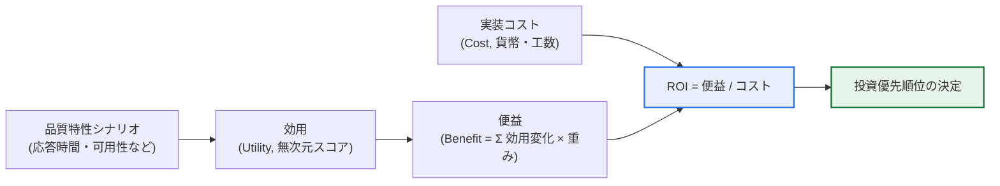
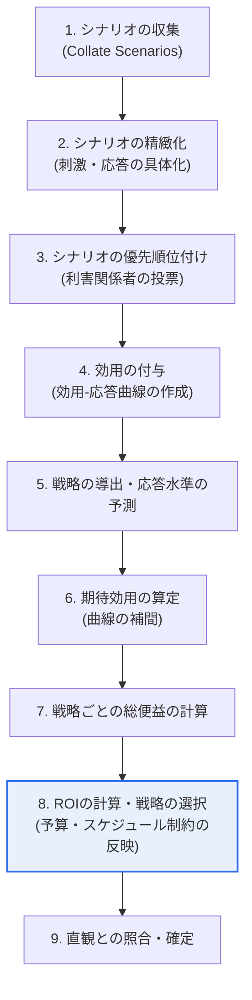

# CBAM(Cost Benefit Analysis Method)

## 1. 概要

### A. 定義
> **CBAM(Cost Benefit Analysis Method)** とは、ソフトウェアアーキテクチャの**品質改善戦略(アーキテクチャ上の決定)が生み出す便益(Benefit)と、それに要するコスト(Cost)を併せて定量化**し、投資対効果(ROI)の大きいアーキテクチャ上の決定を優先的に採用できるよう支援する、**経済性に基づくアーキテクチャ評価手法**である。米国カーネギーメロン大学のSEI(Software Engineering Institute)が、ATAMを経済的な観点へと拡張して確立した。

CBAMが登場した根本的な背景は、「**アーキテクチャ上の決定は、すなわち投資の決定である**」という認識の転換である。性能を高めるためのキャッシング・インデックス作成、可用性を高めるための冗長化・クラスタリング、セキュリティを高めるための多層防御といったアーキテクチャ戦略は、いずれも実装コストを伴い、その代償として得られる品質向上の幅も互いに異なる。問題は、予算とスケジュールが常に有限であるという点である。すべての品質要求を最高水準で満たすことはできないため、アーキテクトは「**どの戦略に先に、いくら投資するか**」を必ず選択しなければならない。ところが、従来の代表的なアーキテクチャ評価手法であるATAMは、品質特性間のトレードオフ(例:可用性を高めると性能が低下する)やリスク・感度点を識別することには強みがあるものの、「いくら使っていくらの価値を得るのか」という**経済的な正当化**は扱えなかった。

CBAMは、まさにこの空白を埋めるために考案された。各アーキテクチャ戦略が利害関係者にもたらす効用(Utility)を定量化し、利害関係者ごとの重要度(重み)を反映して戦略の総便益を計算した後、これを実装コストと対比して、**ROI(便益÷コスト)の高い戦略から優先順位を付ける。** すなわちCBAMが目指すのは「技術的に優雅な」アーキテクチャではなく「経済的に賢明な」アーキテクチャ上の決定であり、勘に頼っていたアーキテクチャへの投資判断を、利害関係者が合意できる数値に基づく根拠へと転換することに、その本質的な価値がある。

### B. 登場背景と必要性
ソフトウェアの規模が大きくなり、品質要求(性能・可用性・セキュリティ・拡張性・変更容易性など)が相反する状況が日常化するにつれ、限られた開発予算を「どこに先に使うか」という資源配分の問題が、アーキテクチャ設計の中核的な意思決定として浮上した。このときアーキテクトが直面する困難は三つある。第一に、品質向上の「価値」が目に見えないため、正当化が難しい。キャッシュを導入して応答時間が2秒から0.5秒に短縮されたとき、その価値がいくらなのかを明示的に答えるのは難しい。第二に、異なる品質(性能 vs セキュリティ)を同じ物差しで比較するための共通単位がない。第三に、利害関係者ごとに重視する品質が異なり(運用チームは可用性、マーケティングは応答速度)、合意が難しい。

CBAMは、「**効用(Utility)**」という無次元の尺度(例:0~100点)を導入して異質な品質を一つの基準に換算し、利害関係者の投票・重みによって視点の違いを明示的に統合し、最終的に貨幣単位のコストと対比してROIという単一の順位基準を算出することで、上記三つの困難を同時に緩和する。結局、CBAMが必要とされる理由は、「限られた予算の中で最も大きな価値を生む品質投資の順序を、利害関係者が納得できる方法で決めるため」と要約される。

## 2. 中核概念 — 効用・便益・コスト・ROI

CBAMを正しく理解するには、まず四つの中核概念の関係を押さえる必要がある。これらはCBAMの計算全体を貫く骨格である。

**第一に、効用(Utility)** とは、ある品質特性の特定の応答水準(例:応答時間0.5秒)が利害関係者にもたらす価値を、0~100のような無次元スコアで表したものである。効用という無次元の尺度を導入する理由は、秒単位の応答時間とパーセント単位の可用性のように、異なる物理単位を持つ品質特性を同じ物差しの上に載せて比較するためである。

CBAMの独創性は、この効用を**効用-応答曲線(Utility-Response Curve)** で表現する点にある。例えば、応答時間が非常に速い区間(0.1秒)では効用はほぼ100に収束し、ある地点を超えて遅くなると(3秒以上)効用は急激に0へと落ちる。重要なのは、この曲線がたいてい直線ではなく、S字型の非線形であるという点である。すなわち、すでに十分に速い区間でさらに速くしても体感価値はほとんどなく(曲線が平坦)、ユーザが我慢できなくなる臨界区間付近での改善が体感価値を最も大きく引き上げる(曲線が急峻)。この曲線の傾きは「その区間で品質を少し改善したときに体感価値がどれだけ大きくなるか」を表すため、曲線が急峻な区間に投資する方が平坦な区間に投資するよりもはるかに有利であるという洞察を与える。これが、CBAMが「無条件の最高性能」ではなく「価値が急増する地点までの改善」を目指す根拠である。

**第二に、便益(Benefit)** とは、あるアーキテクチャ戦略を適用したときに、関連するすべてのシナリオで発生する効用の変化量(改善後の効用 − 現在の効用)に、各シナリオの利害関係者の重みを掛けて合算した値である。すなわち、一つの戦略が複数の品質シナリオに同時に影響を与える場合があり(例:ロードバランサの導入は可用性と性能の両方に寄与)、便益はその波及効果をすべて足し合わせて総合する。このとき、ある戦略が他の品質を悪化させる**副作用(Side Effect)** も負(−)の効用変化として反映し、純(net)便益を計算するのが原則である。

**第三に、コスト(Cost)** とは、その戦略を実装・運用するために要する開発工数・ライセンス・インフラ費用の見積もりである。ここには初期構築費だけでなく、保守・運用費、そしてその戦略を導入することで追加的に発生する複雑さの管理コストまで含めるのが原則である。コストを初期構築費だけに狭く捉えると、冗長化・マイクロサービスのように運用負担の大きい戦略の真のコストが過小評価される。

**第四に、ROI(Return on Investment)** とは、便益をコストで割った値であり、「単位コストあたりに生み出される価値」を意味する。CBAMは、このROIが高い戦略から、予算・スケジュールの制約が許す限度まで順に採用することを推奨する。こうすることで、「少ない費用で大きな価値を生む」戦略が自然に優先順位の上位に来るようになる。ただし、ROIの順位は絶対的なルールではなく意思決定の出発点であり、戦略間の依存関係(Aを行わなければBは不可能)やリスク回避といった定性的な要因を併せて考慮し、最終的に調整するという点に留意しなければならない。

## 3. 評価手順(9段階)

CBAMはSEIが定義した標準手順に従い、大きく「シナリオ・効用の準備 → 戦略ごとの便益・コストの算定 → ROIに基づく選択」の流れで進められる。実際には以下の9段階に細分され、ワークショップ形式で利害関係者が共に参加して実施する。

**1~3段階(シナリオの準備)** では、性能・可用性・セキュリティなどの品質要求を「刺激(Stimulus)–環境–応答(Response)」形式の具体的なシナリオとして表現・精緻化した後、利害関係者の投票によって上位のシナリオ(通常は全体の3分の1程度)に絞り込む。この優先順位付けはその後のすべての計算の焦点を決定するため、組織のビジネス目標に直結したシナリオが上位に来るようにすることが重要である。この段階はATAMのシナリオ導出と事実上同一であり、二つの手法を連携させる際に再利用される。

**4段階(効用の付与)** はCBAMの心臓部である。各上位シナリオについて、「最悪–現在–望ましい–最高」の四つの応答水準を定め、それぞれに効用スコアを付けて効用-応答曲線を描く。例えば応答時間のシナリオであれば、最悪(4秒)=0点、現在(2秒)=50点、望ましい(1秒)=80点、最高(0.3秒)=100点のように定める。この曲線は利害関係者の体感価値を反映するため主観が介在するが、複数の利害関係者の値を平均・調整して合意を形成する。

**5~7段階(便益の算定)** では、各シナリオを改善する候補となるアーキテクチャ戦略を導出し、その戦略を適用すると応答がどの水準(例:2秒→1秒)まで改善するかを予測した後、効用-応答曲線から補間(interpolation)によって予想効用を読み取る。改善後の効用から現在の効用を引いた差がその戦略の効用利得であり、これにシナリオの重みを掛け、一つの戦略が影響を与えるすべてのシナリオについて合算すると、戦略の総便益が得られる。

**8~9段階(選択・検証)** では、各戦略の総便益を実装コストで割ってROIを計算し、降順に並べた後、予算・スケジュールの制約内で上位の戦略から選択する。最後に、導出された優先順位が専門家の直観と大きく食い違っていないかを照合し、曲線・コスト見積もりの誤りを補正して結果を確定する。

### 計算例
具体的な数値で見ると理解しやすい。仮に「キャッシュ導入」戦略が、応答時間シナリオ(重み0.4)の効用を50→80(+30)に引き上げ、副作用として一貫性シナリオ(重み0.2)の効用を70→60(−10)に引き下げるとすれば、純便益は(30×0.4)+(−10×0.2)=12−2=10である。この戦略の実装コストが2(単位)であればROI=10÷2=5.0である。一方、「サーバ冗長化」戦略が総便益12を生むもののコストが6であれば、ROI=2.0である。二つの戦略のうち便益の絶対値は冗長化の方が大きいが、単位コストあたりの価値はキャッシュの方が優れているため、CBAMは予算が逼迫しているときにはキャッシュを先に採用するよう導く。このように、「大きな効果」ではなく「コスト対効果」で判断させることが、CBAMの中核的な貢献である。

参考までに、5段階で候補としてよく挙げられる代表的なアーキテクチャ戦略と、それが主に狙う品質特性を整理すると次のとおりである。実際のプロジェクトでは、こうした戦略カタログを前に、それぞれの便益・コストを算定してROIを比較する。

- **キャッシング・インデックス作成**:性能(応答時間)の向上、副作用として一貫性・メモリコスト
- **ロードバランシング・クラスタリング**:可用性・性能の同時向上、副作用として運用の複雑さ
- **冗長化・災害復旧(DR)**:可用性・信頼性の向上、高いインフラコスト
- **階層分離・モジュール化**:変更容易性・テスト容易性の向上、初期設計工数の増加
- **多層防御・暗号化**:セキュリティの向上、性能低下の副作用

## 4. ATAMとの関係および比較

CBAMは単独で使われるよりも、ATAMと組み合わせたときに最も大きな威力を発揮する。ATAMが「このアーキテクチャは品質要求を満たすか、どこにリスク・トレードオフがあるか」という**技術的妥当性**を診断するのに対し、CBAMはその上で「識別された改善戦略のうち、何に先に投資すれば最も得か」という**経済的妥当性**を判定する。実務では、ATAMでリスク・感度点・トレードオフを先に導出し、そこから出てきた改善候補をCBAMのアーキテクチャ戦略の入力とする逐次的な連携が標準的である。二つの手法が同一のシナリオ・品質特性の語彙を共有しているため、この連携は自然である。

| 区分 | ATAM | CBAM |
|---|---|---|
| **中核となる問い** | アーキテクチャが品質要求を満たすか | どの改善に投資すれば得か |
| **焦点** | 品質特性のトレードオフ・リスクの識別 | コスト対便益(経済性) |
| **成果物** | リスク(Risk)・感度点・トレードオフ点・非リスク | 戦略ごとのROI・投資優先順位 |
| **中核ツール** | 品質特性ユーティリティツリー、シナリオ | 効用-応答曲線、ROI |
| **観点** | 技術的な品質評価 | 経済的な意思決定 |
| **関係** | 評価の出発点 | ATAMの経済的拡張・後続段階 |

この表で注目すべき点は、二つの手法が競合関係ではなく補完関係にあるということである。ATAMだけを実施すると、「何が問題か」は分かっても「限られた予算で何から直すべきか」への答えがなく、改善が漂流しかねない。逆にCBAMだけを実施すると、そもそもどの戦略がどの品質リスクに対応するのかについての技術的な根拠が乏しくなる。したがって技術士の観点からは、二つの手法を「診断(ATAM)–処方の優先順位(CBAM)」という連続した過程として設計することが望ましい。

## 5. 深掘り — 実務適用事例と予想出題方向

**実務適用の現実**を見ると、CBAMは大規模なミッションクリティカルシステム(金融のコアバンキング、通信の課金、航空・国防システム)のアーキテクチャ改善投資の審議において、概念的な枠組みとして活用されている。例えば、ある金融機関が老朽化したコアシステムの近代化予算を配分する際に、応答時間の改善(キャッシュ・読み取り専用レプリカ)、可用性の向上(災害復旧の冗長化)、拡張性の確保(マイクロサービスへの移行)という三系統の投資案が競合しているとしよう。このとき、各投資案の便益を顧客離脱率・取引処理量・障害損失コストといったビジネス指標に換算すれば、「可用性の冗長化はコストが大きいが、年間の予想障害損失を大きく減らすためROIが高い」といった根拠のある順位が得られる。ただし実務では、効用-応答曲線を精密に作成するよりも、CBAMの思考の枠組み(効用・便益・コスト・ROIに分解して比較する)を軽量化して適用する場合が多いという点も、併せて理解しておく必要がある。

**最新の流れ**に関しては、クラウドへの移行が一般化するにつれて、アーキテクチャ戦略のコストがCapEx(固定投資)からOpEx(使用量に基づく運用費)へと移り、オートスケーリング・サーバーレスのような「使った分だけ支払う」構造が増えた点が、CBAMのコストモデリングに影響を与えている。また、FinOps(クラウドのコスト・価値の最適化)や、SLO・エラーバジェット(Error Budget)に基づく信頼性管理といった最新の運用方法論は、「可用性・性能という品質を定量的な目標とコストで扱う」という点でCBAMの問題意識と通じており、現代的な再解釈・連携の対象とみなすことができる。

**予想出題方向**としては、①CBAMの手順と中核概念(効用-応答曲線、ROI)を説明せよ、②ATAMとCBAMを比較し、連携活用の方策を論ぜよ、③特定のシナリオ(コスト・便益の数値を提示)においてROIを計算し、投資の優先順位を定めよ、などが代表的である。答案作成時には、概念の列挙にとどめず、「なぜ便益の絶対値ではなくROIで判断するのか」「効用の定量化の主観性をどのように緩和するのか」といったトレードオフまで記述すれば、深掘りの点数を得やすい。

## 6. 考慮事項および示唆(技術士の観点)

1. **便益定量化の主観性が最大の難題である。** 可用性・性能向上の価値を効用スコア・貨幣に換算する過程は本質的に主観的であり、誰が曲線を描くかによって結果が変わる。したがって、利害関係者を幅広く参加させて曲線と重みを合意によって導出し、極端な値に結果が敏感でないかを感度分析(sensitivity analysis)で検証する手順を併用してはじめて、信頼性が確保される。

2. **ATAMとの連携でバランスをとらなければならない。** CBAMを単独で用いると、経済性ばかりを優先して技術的なリスクを見落とす可能性がある。ATAMでリスク・トレードオフを先に識別した後、CBAMで改善戦略の経済性を評価する逐次的なプロセスを採用し、技術的・経済的の両面で正当なアーキテクチャ上の決定を下すことが望ましい。

3. **副作用(負の便益)を必ず反映しなければならない。** 一つの戦略が、ある品質を高める一方で別の品質を低下させる場合は多い(キャッシュ↔一貫性、冗長化↔複雑さ・コスト)。副作用を純便益の計算に含めなければ、特定の戦略の魅力が過大評価される。トレードオフを明示的に数値化することが、CBAMを形式的な計算ではなく実質的な意思決定ツールにする。

4. **軽量化・反復適用を志向すべきである。** 完全な9段階のCBAMは、ワークショップ・専門家の参加コストが大きく、すべてのプロジェクトにそのまま適用することは難しい。初期は少数の中核シナリオについて思考の枠組みだけを適用する軽量なCBAMから始め、アーキテクチャが進化するたびに繰り返し実施して優先順位を更新する、アジャイル・段階的な適用が現実的である。

5. **コスト見積もりの不確実性を管理しなければならない。** ROIの分母であるコストの見積もりが不正確であれば、順位全体が揺らぐ。特に新技術を導入する戦略はコスト見積もりの誤差が大きいため、単一の見積値の代わりに楽観・悲観の幅を設け、シナリオごとのROIを比較する方が安全である。

6. **定量化が難しい戦略を排除してはならない。** CBAMは便益を数値に換算できる戦略に有利に作用するため、セキュリティ強化や規制遵守のように、価値を数値で表現することは難しいが必ず必要な戦略が優先順位で後回しにされるリスクがある。こうした戦略は「必須制約(must-have)」として別途分類してROI競争から除外し、先に確保したうえで、残りの選択的な戦略についてCBAMを適用する方式で補完することが望ましい。すなわちCBAMは、すべての決定を代替するツールではなく、選択可能な代替案の間の優先順位を合理化するツールとして位置づけるべきである。

## 参考資料
- SEI, "Making Architecture Design Decisions: An Economic Approach"(CMU/SEI Technical Report) — https://resources.sei.cmu.edu/
- L. Bass, P. Clements, R. Kazman, "Software Architecture in Practice"(CBAM/ATAMの章)

---

> **一言まとめ**: CBAMは、*アーキテクチャ改善戦略の便益(効用-応答曲線×重み)とコストを定量化し、ROIに基づいて投資の優先順位を定める*経済性評価手法であり、ATAMの経済的な拡張として、副作用まで反映した純便益によって限られた予算の合理的な配分を支援するが、便益定量化の主観性の管理が鍵となる。
