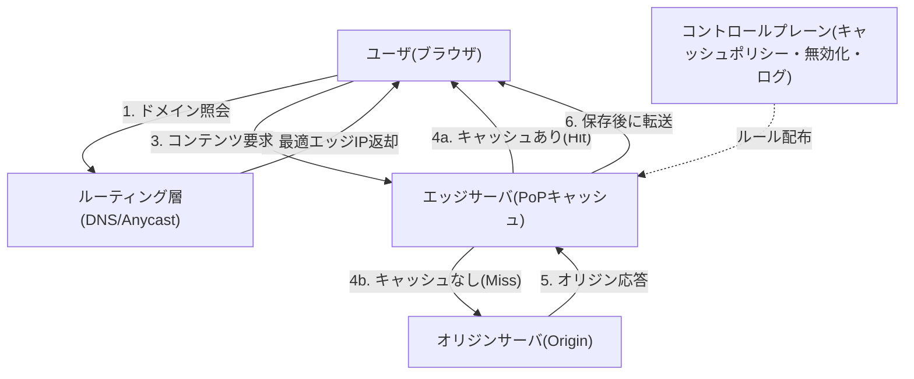

# コンテンツ配信ネットワーク(CDN, Content Delivery Network)

## 1. 概要

### A. 定義

> **CDN(Content Delivery Network)**とは、Webコンテンツ(静的ファイル・ストリーミング・動的レスポンス)を地理的に分散した**エッジサーバ(Edge/PoP)**のキャッシュにあらかじめ複製しておき、ユーザをネットワーク的に最も近いエッジへ誘導することで、**遅延時間(Latency)を低減し、オリジンサーバ(Origin)の負荷を分散**する分散キャッシング・配信インフラである。

CDNは1998年にAkamaiが商用化して以来、今日ではWebトラフィックの大多数を媒介する基盤インフラとなった。世界中に散在する数百~数千の**PoP(Point of Presence)**にコンテンツの複製を置き、ユーザのリクエストを最適なエッジへルーティングする。「コンテンツをユーザの近くに置く(bring content closer to users)」という単純な原理によって、応答速度・可用性・スケーラビリティを同時に引き上げる点が中核的な価値である。

### B. 登場背景と必要性

CDNが必要とされる根本的な理由は、**物理法則とオリジン集中の限界**にある。ソウルのユーザが米国バージニアの単一サーバに接続すると、往復遅延(RTT)だけで200ms以上を要し、さらにTCP 3-way handshake・TLSネゴシエーションが加わると、最初のバイト到着(TTFB)がユーザ体感を大きく損なう。光速という物理的限界により距離そのものが遅延の下限を作るため、**サーバをユーザの近くに分散配置**する以外に根本的な解決策はない。

また、大規模イベント(オンラインチケッティング、ライブコマース、ソフトウェア配布)でトラフィックが瞬間的に急増すると、単一のオリジンサーバは帯域幅・コネクション数の限界により崩壊する。たとえば数百GBのゲームアップデートを数百万人が同時にダウンロードすればオリジンはボトルネックとなるが、CDNはこれを**多数のエッジが分担**して処理する。実際にNetflixは自社CDN(Open Connect)によって夜間ピーク時間帯の世界のインターネットトラフィックのかなりの部分を処理しており、この規模を単一のデータセンターで賄うことは到底できない。このように**遅延の最小化・負荷分散・可用性の確保・コスト削減**という4つの要求がCDNの必要性を規定している。

## 2. 全体構造とリクエスト処理フロー

CDNは大きく、**オリジンサーバ(Origin)**、地域ごとの玄関口である**エッジサーバ(Edge/PoP)**、リクエストを最適なエッジへ送る**ルーティング層(DNS/Anycast)**、そしてキャッシュルール・無効化を司る**コントロールプレーン(Control Plane)**で構成される。ユーザがコンテンツを要求すると、まずルーティング層がユーザの位置・エッジの負荷・ネットワーク状態を総合して担当エッジを決定し、当該エッジはキャッシュの有無に応じて即座に応答(Hit)するか、オリジンから取得して(Miss)応答しつつ複製を保存する。

上記のフローで性能を左右する指標が**キャッシュヒット率(Cache Hit Ratio)**である。ヒット率が高いほどオリジンまでの往復が減り、遅延とオリジン負荷がともに減少する。静的リソース(画像・CSS・JS・動画セグメント)は変化しないためヒット率を90%以上に引き上げやすいが、パーソナライズされた動的レスポンスはキャッシュが難しく、別途の戦略が必要となる。

ルーティング方式は大きく2つある。**DNSベースのルーティング**は、CDNのDNSがユーザのリゾルバの位置を見て近いエッジのIPを応答する方式で、柔軟であるがDNS TTL・リゾルバ位置の誤差の影響を受ける。**Anycastルーティング**は、複数のエッジが同一IPを広告し、BGPルーティングが最も近いエッジへパケットを流す方式で、障害時には経路が自動的に再収束するためDDoSの吸収にも有利である。実務では両方式を組み合わせ、精度と回復力をともに確保する。

## 3. キャッシング戦略とコンテンツ種別ごとの処理

キャッシングの核心は**何を、どれくらいの期間、どのように更新するか**である。キャッシュ対象と寿命はHTTPヘッダで制御する。`Cache-Control: max-age`で鮮度期間を定め、`ETag`・`Last-Modified`による条件付きリクエスト(304 Not Modified)で変更の有無だけを軽量に確認する。コンテンツの特性によってキャッシュの難易度が大きく異なるため、種別ごとに異なる戦略を適用しなければならない。

| コンテンツ種別 | キャッシュ難易度 | 代表的な戦略 |
|---|---|---|
| 静的アセット(画像・JS・CSS) | 低 | 長いmax-age + ファイル名ハッシュ(cache busting) |
| 大容量メディア(VOD・ダウンロード) | 低 | セグメント分割・部分リクエスト(Range)キャッシング |
| ライブストリーミング | 中 | 短いTTL・HLS/DASHセグメントキャッシング |
| 動的/パーソナライズ応答 | 高 | ESI・マイクロキャッシング・エッジコンピューティング |

静的アセットは**ファイル名にコンテンツハッシュを含めるキャッシュバスティング**により事実上の永続キャッシュ(例:`max-age=31536000`)を設定しつつ、内容が変わればファイル名が変わって自然に新しいファイルを取得させる。一方、動的レスポンスはオリジンのロジックを経由する必要があるためキャッシュが難しいが、秒単位の短いTTLを設定する**マイクロキャッシング(microcaching)**で瞬間的に殺到する同一リクエストを吸収したり、ページの断片のみをキャッシュする**ESI(Edge Side Includes)**で静的部分と動的部分を分離したりする。

コンテンツ更新時にはキャッシュの**無効化(Invalidation)**が重要である。即時反映が必要であれば特定のURL・タグを無効化する**Purge**を、ユーザに公開される前にあらかじめキャッシュを埋めて最初のユーザのMissを防ぐには**Cache Warming(Prefetch)**を用いる。無効化が遅れたり漏れたりするとユーザが古いコンテンツを見ることになるため、デプロイパイプライン(CI/CD)にパージ・ウォーミングを統合するのが実務の定石である。

## 4. 付加機能 — セキュリティ・最適化・エッジコンピューティング

現代のCDNは単なるキャッシュを超え、**統合配信プラットフォーム**へと進化した。第一に、**セキュリティ層**として、エッジがユーザとオリジンの間に位置する構造を活用し、**DDoS防御**(大量トラフィックを多数のエッジが分散吸収)、**WAF**(SQLインジェクション・XSSなどL7攻撃の遮断)、**ボット管理**、**TLS終端**を行う。オリジンIPを隠蔽して直接の攻撃対象領域を減らす効果も大きい。第二に、**配信最適化**として、画像フォーマット変換(WebP/AVIF)・圧縮(Brotli/Gzip)・HTTP/2・HTTP/3(QUIC)対応・コネクション再利用により、実際の転送量と往復回数を削減する。

第三に、最も注目すべき進化は**エッジコンピューティング(Edge Computing)**である。エッジで軽量関数(例:Cloudflare Workers、AWS Lambda@Edge)を実行し、A/Bテストの分岐、認証トークンの検証、パーソナライズヘッダの挿入、APIレスポンスの組み立てといったロジックを**オリジンまで行かずにユーザの近くで処理**する。これにより動的コンテンツでさえ低遅延で提供できるようになり、CDNは静的キャッシュインフラから**分散アプリケーション実行プラットフォーム**へと拡張しつつある。

## 5. 類型比較 — Pull vs Push、商用 vs 自社構築

CDNにコンテンツを格納する方式は**PullとPush**に分かれる。Pull CDNは最初のリクエスト時にオリジンから取得してキャッシュする**遅延ロード(lazy)**方式で、運用が単純であり、使われないコンテンツはキャッシュしないため効率的であるが、最初のユーザはMissによる遅延を被る。Push CDNはコンテンツをあらかじめエッジへアップロードしておく方式で、大容量かつ予測可能な配布(ソフトウェアリリース、イベント用アセット)に適するが、ストレージ・同期管理の負担がある。大半のサービスは**Pullを基本とし、重要なアセットのみ事前ウォーミング**する混合戦略を採る。

| 区分 | Pull CDN | Push CDN |
|---|---|---|
| キャッシュ時点 | 初回リクエスト時(Miss後) | 事前アップロード |
| 運用負担 | 低 | 高(同期管理) |
| 初回リクエストの遅延 | あり | なし |
| 適合事例 | 一般Web・トラフィック予測困難 | 大容量配布・イベント |

また、**商用CDNの利用と自社構築(プライベートCDN)**の間の選択もある。大半の企業はAkamai・Cloudflare・AWS CloudFrontなどの商用サービスを利用し、グローバルなカバレッジとセキュリティ機能を即座に確保する。一方、Netflixのようにトラフィックが極端に大きく特性が明確な事業者は、ISP内部に自社キャッシュサーバ(Open Connect Appliance)を配置し、**コストと品質を直接コントロール**する。トラフィック規模・グローバル要件・セキュリティ要件・コスト構造がこの選択の判断基準となる。

## 6. 考慮事項および示唆

CDNの導入は性能・コスト・セキュリティ・運用が絡み合う**アーキテクチャ上の意思決定**であるため、技術士の観点から次の点を総合的に考慮しなければならない。

- **適用戦略 — コンテンツ特性に基づくキャッシュポリシー設計**:静的・動的・パーソナライズコンテンツを区分してTTL・無効化ポリシーを差別化して設計し、キャッシュヒット率を中核KPIとして常時モニタリングすべきである。無分別な全面キャッシュは古いデータの露出を、過度なno-cacheはCDN効果の喪失を招く。
- **トレードオフ — 鮮度 vs 性能、コスト vs カバレッジ**:TTLを延ばせば性能・コストは改善するがコンテンツの鮮度が落ち、逆もまた然りである。商用CDNはトラフィック量(egress)課金であるため、キャッシュヒット率がそのままコストとなり、マルチCDNは回復力を高めるが管理の複雑さとコストを増大させる。
- **セキュリティ — オリジン保護と信頼境界**:オリジンIPの隠蔽、オリジン-エッジ間の相互TLS・ホワイトリストにより、エッジを迂回した直接攻撃を遮断し、WAF・ボット管理・DDoS防御を階層的に構成すべきである。エッジコンピューティングの導入時には、エッジで実行されるコードのサプライチェーン・権限管理もあわせて検討する。
- **可用性 — マルチCDNと障害分離**:単一CDN事業者の障害がサービスの全面停止につながった事例が繰り返されているため、マルチCDN構成とリアルタイム性能に基づくトラフィックステアリング、オリジン直結のフォールバック(failover)経路を用意しなければならない。
- **展望 — エッジネイティブとインテリジェント配信**:CDNは5G・IoTと結合した超低遅延エッジコンピューティング、AIベースの予測キャッシング・トラフィック最適化、サーバレスエッジ実行へと進化している。今後のアプリケーションアーキテクチャはオリジン中心から**エッジ-オリジン分散実行**へと再編される見通しであり、CDNはその実行基盤となる。

---

> **一言まとめ**: CDNは地理的に分散したエッジキャッシュにコンテンツを複製し、ユーザを最適なエッジへ誘導して遅延を下げオリジン負荷を分散するインフラであり、今日ではセキュリティ・最適化・エッジコンピューティングを包含する分散配信プラットフォームへと進化している。
