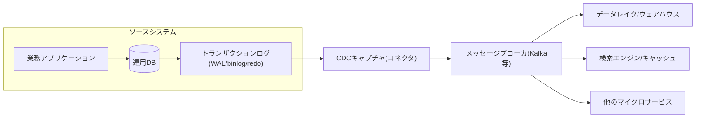
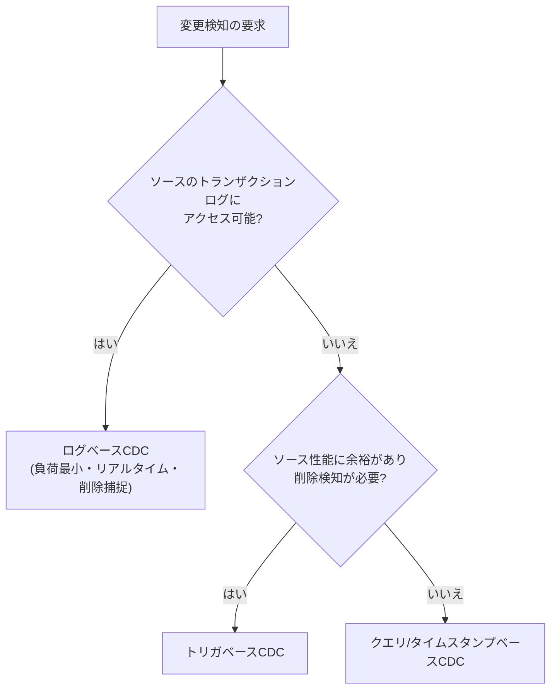

# 変更データキャプチャ(CDC, Change Data Capture)

## 1. 概要

### A. 定義

> **変更データキャプチャ(CDC, Change Data Capture)**とは、ソースデータベースで発生した挿入・更新・削除(INSERT/UPDATE/DELETE)の変更イベントを**ほぼリアルタイム(near real-time)**に検知・抽出し、下流システム(データウェアハウス・データレイク・検索エンジン・キャッシュ・マイクロサービス)へ伝播するデータ統合手法である。

CDCの中核的な発想は、「データ全体を定期的に読み直す(full reload)代わりに、**変わったものだけ(delta)**を流す」ことである。ソースがすでに残している変更の痕跡 — 代表的にはトランザクションログ(WAL、redo log、binlog) — を再利用すれば、ソースアプリケーションのコードを修正することなく、変更の事実を順序どおり正確に捕捉できる。このためCDCは今日、リアルタイム分析、マイクロサービス間のデータ同期、データレイクハウスへの取り込み(ingestion)の事実上の標準手段として定着している。

### B. 登場背景と必要性

従来のデータ連携は夜間バッチ(nightly batch)で行われていた。毎日未明にソーステーブル全体を抽出してDWに再ロードする方式は実装が単純であるが、3つの根本的な限界を持つ。第一に、データが最大1日まで古くなり(staleness)、リアルタイムの意思決定を支援できない。第二に、数億件のテーブルを毎回丸ごと読むとソースDBに大きな負荷を与え、バッチ時間が爆発的に増大する。第三に、全体再ロード方式はその時点のスナップショットしか残さないため、「いつ何がどのように変わったか」という**変更履歴**を失ってしまう。

デジタルトランスフォーメーションとともに、ユーザ・規制・ビジネスはますます低い遅延(latency)を要求するようになった。不正取引検知(FDS)は秒単位で最新の取引を反映しなければならず、レコメンド・検索エンジンは商品情報の変更を即座にインデックス化しなければならず、マイクロサービスは他のサービスが所有するデータの変化を知る必要がある。このときソースを繰り返しポーリング(polling)すると、負荷と遅延がともに増大する。CDCは「変更が発生した瞬間に、変更分だけ」をプッシュすることで、**遅延・負荷・履歴喪失**という3つの問題を同時に緩和する。

また、マイクロサービスアーキテクチャ(MSA)の普及はCDCの必要性を一層高めた。サービスごとにDBを独立して所有する構造では、1つのソースの変更を複数のサービスが知る必要がある状況が頻繁に生じるが、アプリケーションがDB書き込みとメッセージ発行をそれぞれ別に行うと**二重書き込み(dual write)**問題(片方だけが成功する部分失敗)が生じる。CDCはDBのコミットという単一の事実をソースとして変更を発行するため、この整合性問題を構造的に解決する基盤(トランザクショナルアウトボックスパターン)となる。

## 2. CDCの全体構造とデータフロー

CDCパイプラインは大きく**ソース(Source) → キャプチャ(Capture) → 転送(Transport) → 適用(Sink)**の4段階からなる。キャプチャ段階がトランザクションログやトリガを通じて変更イベントを抽出すると、これをメッセージブローカ(例:Kafka)へ安定的に渡し、下流のコネクタが宛先に反映する。各変更イベントは通常、変更前(before)・変更後(after)のイメージ、操作の種類、タイムスタンプ、ログ位置(offset)を含む。

上記の構造で最も重要な設計ポイントは、**キャプチャ段階がソースにどの程度介入するか**である。ログを読む方式はソースDBにほとんど負荷を与えず、アプリケーションと完全に分離されるが、DBごとのログフォーマット・権限・設定に依存する。一方、トリガやタイムスタンプ列の方式はDBの種類に左右されにくいが、ソースのスキーマと書き込み経路に介入し、負荷と結合度を高める。このトレードオフがCDC方式選択の中核的な基準となる。

もう1つの必須概念が**初期スナップショット(initial snapshot)**である。CDCは「今からの変更」のみを捕捉するため、下流に過去データがなければ、まずソース全体を一度読み込んで基準状態を作り、その時点以降のログの変更をつなげなければならない。スナップショットの途中でもソースは変更され続けるため、スナップショット時点のログ位置を正確に記録し、それ以降の変更のみを再生(replay)する一貫性処理が重要である。

## 3. CDC実装方式の類型

CDCを実装する方法は、変更をどこでどのように検知するかによって大きく3つに分かれる。各方式はソース負荷、リアルタイム性、削除検知能力、ソースへの介入度において明確な差を示し、この差がそのまま適用の適合性を決定する。

**第一に、ログベース(Log-based)CDC**は、DBが復旧・レプリケーションのためにすでに記録しているトランザクションログを解析する。PostgreSQLのWAL(論理レプリケーションスロット)、MySQLのbinlog(rowフォーマット)、Oracleのredo logがその対象である。ソーステーブルを直接照会しないため負荷が最も低く、コミット順序をそのまま保持し、削除・中間変更まで漏れなく捕捉する。ただし、ログフォーマットと権限設定に依存し実装難度が高いため、Debeziumのような専用フレームワークで実装するのが一般的である。実務におけるCDCの事実上の標準方式である。

**第二に、トリガベース(Trigger-based)CDC**は、ソーステーブルにAFTER INSERT/UPDATE/DELETEトリガを設定し、変更内容を別の履歴テーブル(shadow table)に記録する。DBの種類を問わず動作し、変更前後の値を精密に残せるが、すべての書き込みトランザクションにトリガ実行が上乗せされるためソースの性能が低下し、スキーマ管理の負担が大きくなる。

**第三に、クエリ/タイムスタンプベース(Query-based)CDC**は、`last_modified`のような列を設け、定期的に「直前の照会以降に変更された行」をSELECTでポーリングする。実装は最も単純であるが、ポーリング周期分の遅延が発生し、物理的に削除された行は照会されないため**削除検知が不可能**であり(論理削除列が必要)、ポーリング自体がソースに負荷をもたらす。

3つの方式の違いを整理すると次のとおりである。表は比較の補助手段であり、実際の選択は上で説明したソースへの介入度と運用上の制約をあわせて考慮しなければならない。

| 区分 | ログベース | トリガベース | クエリ/タイムスタンプベース |
|------|-----------|-------------|----------------------|
| ソース負荷 | 非常に低い | 高い(書き込みごとに実行) | 中程度(周期ポーリング) |
| リアルタイム性 | 高い(秒以内) | 高い | 低い(ポーリング周期に依存) |
| 削除検知 | 可能 | 可能 | 不可(論理削除が必要) |
| ソースへの介入 | なし(非侵入) | 大きい(スキーマ・トリガ) | 中程度(列の追加) |
| 実装難度 | 高い | 中程度 | 低い |

## 4. 中核技術要素と整合性の保証

CDCを信頼できるパイプラインにするには、単に変更を捕捉するだけでなく、**正確性(exactly-onceに準ずる処理)**を設計しなければならない。最も重要な要素は**オフセット(offset)管理**である。キャプチャコネクタはどこまでログを読んだかを継続的に保存し、障害後の再起動時にその地点から読み続けることで欠損を防ぐ。逆に再処理時には同じイベントが再度発行されうるため、下流は主キーに基づく**冪等(idempotent)なupsert**で重複を吸収しなければならない。すなわちCDCは通常、「at-least-once配信 + 冪等な適用」の組み合わせによって事実上のexactly-once効果を得る。

**順序保証(ordering)**も中核である。同じキー(行)に対する変更は必ず発生順に適用されなければならず、そうでなければ古い値が新しい値を上書きするエラーが生じる。Kafkaを用いる場合は主キーをパーティションキーに指定し、同一キーのイベントが同じパーティション内で順序を維持するようにする。

**スキーマ変更(schema evolution)**への対応もまた実務上の難題である。ソースに列が追加・削除されるとイベント構造が変わるため、スキーマレジストリでバージョンを管理し、下位互換ルール(互換性のある進化)を適用して下流が壊れないようにする。

特にMSAにおいてCDCは**トランザクショナルアウトボックス(Transactional Outbox)**パターンと組み合わせて二重書き込み問題を解決する。アプリケーションが業務データと発行すべきイベントを**1つのローカルトランザクション**で同じDBのoutboxテーブルに一緒に書き込めば、CDCがそのoutboxテーブルのログ変更を捕捉してメッセージとして発行する。DBコミットがそのままイベント発行の根拠となるため、「DBには保存されたがメッセージは消失した」という部分失敗が原理的になくなる。

## 5. 活用事例と類似手法の比較

**活用事例。** 実務においてCDCは、第一に、運用DBの変更をデータレイクハウスへ流してリアルタイムダッシュボード・分析を支援する(例:Eコマースで注文・在庫の変更を数秒以内に分析系へ反映)。第二に、検索エンジン・キャッシュの同期 — 商品情報の変更時にElasticsearchのインデックスとRedisキャッシュを即座に更新する。第三に、無停止データ移行 — 新システムへ初期スナップショットを移した後、CDCで変更分を継続的に追従させて両システムを同期状態に保ち、切り替え時点でスイッチオーバーする。あるグローバルテック企業の事例では、夜間バッチをログベースCDCに置き換えることでデータ遅延を数時間から数秒に短縮し、ソースDBの負荷を大幅に下げたと報告されている(数値は環境によって異なりうる)。

**類似・関連手法との比較。** CDCをETL全体と混同しやすいが、CDCはETL/ELTの**抽出(Extract)段階をリアルタイム化**する技術と見るのが正確である。バッチETLが「定期的・全体・高遅延」であるなら、CDCベースのパイプラインは「連続的・増分・低遅延」である。また、CDCは**イベントソーシング(Event Sourcing)**と区別しなければならない。イベントソーシングはアプリケーションが最初から状態変化をイベントとして設計・保存するアーキテクチャであるのに対し、CDCは既存の状態ベースのDBから変更を事後的に抽出する。宛先が状態(state)である点も異なる。

| 観点 | バッチETL | クエリポーリング | ログベースCDC |
|------|----------|-----------|----------------|
| 遅延 | 時間~日 | 分 | 秒 |
| ソース負荷 | 高い(全体スキャン) | 中程度 | 非常に低い |
| 履歴保存 | スナップショットのみ | 限定的 | すべての変更 |
| リアルタイム連携 | 不適合 | 部分的 | 適合 |

## 6. 考慮事項および示唆

CDCはリアルタイムデータアーキテクチャの中核要素であるが、導入には技術士の観点からの戦略的判断が必要である。

- **整合性 vs 遅延のトレードオフ**:CDCは通常、結果整合性を前提とする。下流がソースに追いつくまでわずかな遅延(replication lag)が存在するため、強い一貫性が必要な業務(例:残高の二重検証)には不適合である。業務の一貫性要求水準をまず定義し、CDCの適用範囲を定めなければならない。
- **ソース保護と非侵入の原則**:運用DBは最優先の保護対象である。ログベースの非侵入(non-intrusive)方式を優先的に検討しつつ、ログスロットの未消費によるディスク増加・レプリケーションスロット管理など、ソース側の運用リスクを事前にモニタリング・アラート体制で管理しなければならない。
- **運用の複雑さと組織能力**:CDCはブローカ・コネクタ・スキーマレジストリ・オフセットストアなど構成要素が多く、自社構築する場合の運用負担が大きい。マネージドサービス(クラウドCDC/ストリーミング)とオープンソースによる自社構築とのTCOおよびロックイン(lock-in)をあわせて比較衡量すべきであり、障害時の再処理・バックフィル(backfill)手順を標準化しておかなければならない。
- **ガバナンス・セキュリティ・規制対応**:変更イベントには個人情報が含まれうるため、パイプライン全区間の暗号化・マスキング・アクセス制御とともに、削除イベントが下流(レイク・キャッシュ)まで確実に伝播されるよう設計し、個人情報の破棄義務(忘れられる権利)を満たさなければならない。
- **展望**:CDCはデータメッシュ・レイクハウス・リアルタイムフィーチャーストアの標準的な流入経路として拡大しており、ストリーミング処理と結合して「バッチのない(batch-less)リアルタイムデータプラットフォーム」へと進化しつつある。今後は、CDCによる変更ストリームそのものをデータプロダクト(data product)として契約化・共有する方向が強まると見込まれる。

---

> **一言まとめ**: CDCはソースDBのトランザクションログなどから変更分のみをリアルタイムに抽出して下流へ伝播する手法であり、遅延・負荷・履歴喪失を減らすとともに、ログベース(非侵入)方式と冪等upsert・順序保証・アウトボックスパターンが信頼性の要となる。
