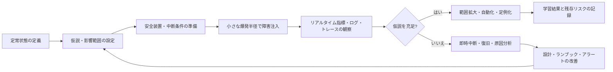
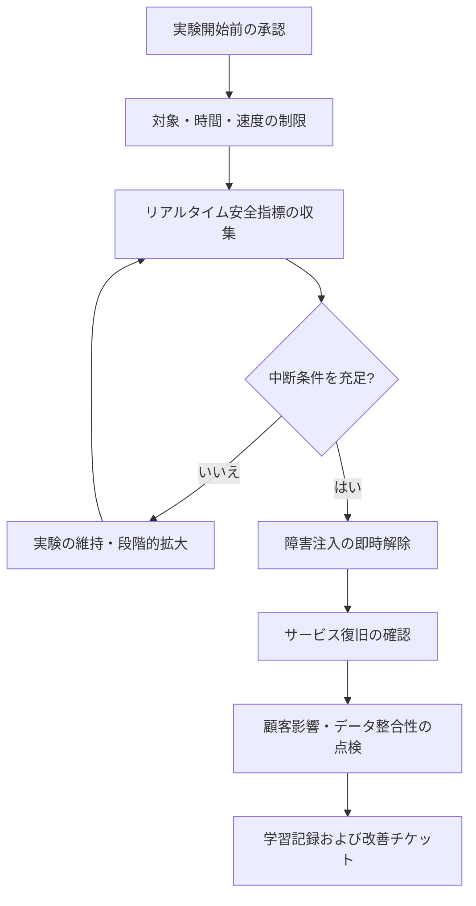

# カオスエンジニアリング(Chaos Engineering)に基づくフォールトトレランス検証

## 1. 概要

### A. 定義

> **カオスエンジニアリング(Chaos Engineering)**とは、定常状態を仮説として定義したうえで、統制された実験によって障害・遅延・リソース枯渇・依存関係の断絶を注入し、分散システムのフォールトトレランスと復旧能力を検証・改善する実験ベースの運用手法である。

カオスエンジニアリングは、障害を引き起こす行為そのものが目的ではない。
運用環境で発生しうる不確実な故障を小さな範囲と限定されたリスクのもとで再現し、システムがどのような条件でどのように崩れ、復旧するかを学習することが本質である。
したがって「ランダムにサーバを停止する」という説明だけでは不十分である。
実験前には定常状態と顧客影響の基準を定め、実験中には中断条件を監視し、実験後には観察結果を設計改善と自動化された回帰検証へつなげなければならない。

現代のサービスは1台のサーバではなく、コンテナ、オーケストレータ、データベース、メッセージブローカ、外部API、CDN、DNS、認証システムが連結された分散構造で構成されている。
各構成要素が個別には正常であっても、ネットワーク遅延、リトライの急増、リーダー選出の遅延、証明書の期限切れといった相互作用によって、ユーザジャーニー全体が失敗しうる。
ドキュメントレビューや単体テストだけでは、このような時間的・分散的な現象を十分に確認することは難しい。
カオス実験は「構成要素が故障したとき、サービス全体がどのような観測シグナルを示し、どのような安全装置が作動するか」を実際の実行経路で確認する。

### B. 登場背景と必要性

第一に、可用性目標と実際の復旧能力の間にはギャップがある。
設計書に冗長化が記載されていても、フェイルオーバーが手動であったり、セカンダリリージョンのデータが古かったり、運用者がランブックを見つけられなかったりすれば、目標復旧時間を達成できない。
カオス実験は、設計上の前提が実行可能な統制と手順として実装されているかを検証する。

第二に、障害は単一の原因よりも連鎖反応によって拡大する。
1つのノードの応答遅延がタイムアウトとリトライを誘発し、リトライがコネクションプールとスレッドプールを枯渇させ、最終的には正常なリクエストまで失敗させるといった具合である。
個々のコンポーネントの成功テストだけではこの増幅経路を発見しにくいため、サービスレベルの実験が必要となる。

第三に、クラウドと自動化環境はリソースを素早く変化させるため、過去の手動点検だけでは現在の運用状態を保証しにくい。
デプロイパイプライン、オートスケーラ、サービスメッシュ、ポリシーエンジンが変更されるたびに、障害対応の経路も変わりうる。
小さな実験を継続的に実行すれば、設計の回帰を早期に発見し、復旧の自動化が実際に機能するかを確認できる。

第四に、カオスエンジニアリングは非難よりも学習を優先する運用文化を必要とする。
実験結果を担当者のミスとしてのみ解釈すると障害が隠されるようになり、同じ構造的欠陥が繰り返される。
観察された脆弱性をシステム・プロセス・権限・文書・訓練の改善課題へと分解してこそ、実験が信頼性の向上へとつながる。

### C. 期待効果と適用範囲

カオス実験の直接的な効果は、障害シナリオと復旧手順の検証である。
間接的には、オブザーバビリティの品質、サービス間の依存関係の理解、自動化された緩和策の信頼度、チーム間の共通言語を改善する。
たとえばデータベースのプライマリ障害を想定した場合、アプリケーションの接続リトライ、読み取りの切り替え、通知、運用者の承認、データ整合性チェックが順序どおりに機能するかを一度に確認できる。

適用範囲はインフラ障害に限定されない。
ネットワークのパケットロス、ディスク使用量の増加、CPU・メモリの逼迫、認証失敗、外部決済APIの遅延、メッセージの重複、誤った構成のデプロイ、リージョンの断絶、個人情報マスキングの誤りまで含めることができる。
ただし、実験のリスクが実際の学習価値を上回る領域や、影響範囲を元に戻す方法がない領域は、事前検証とより小さな隔離環境から始めなければならない。

## 2. 中核概念と実験原理

### A. 定常状態と仮説

定常状態(steady state)とは、単なるサーバの生死ではなく、ユーザが期待するサービスの観察可能な振る舞いである。
決済APIであれば、成功応答率、承認の遅延時間、重複承認件数、未処理注文数が合わせて定常状態を構成しうる。
検索サービスであれば、結果返却率やp95遅延時間だけでなく、結果品質の低下やインデックス遅延も重要なシグナルとなる。

仮説は「構成要素Xを撹乱しても、ユーザジャーニーYの指標Zが許容範囲内にとどまり、自動緩和策AがT分以内に作動する」のように検証可能な形で記述する。
「システムは安定しているだろう」は測定方法と判定基準がないため、実験仮説ではない。
仮説には対象範囲、予想される影響、観察指標、時間制限、中断条件、成功・失敗の判定、事後措置を含めなければならない。

たとえば「決済ワーカーを1台停止しても、5分間、決済成功率99.5%以上を維持し、キューの滞留が10分以内にベースラインへ戻る」と記述できる。
このように書けば、実験が失敗しても何が壊れたのかを切り分けられる。
また、ビジネス指標を含むため、技術的なエラー率が低く見えても実際に注文損失が発生している状況を見逃さない。

### B. 小さな爆発半径と段階的拡大

爆発半径(blast radius)とは、実験によって影響を受けうるユーザ・リソース・トランザクションの範囲である。
初期の実験は、開発・ステージング環境、テストテナント、1つのアベイラビリティゾーン、少数のPodのように範囲を限定しなければならない。
実験ツールが提供するフィルタが正確でなかったりロールバックが遅かったりする場合は、対象をさらに小さくし、手動承認のステップを設ける。

小さな爆発半径は、実験を安全にするための十分条件ではない。
影響は障害注入の対象より上位の層へ伝播しうるため、依存関係グラフとユーザ影響度をあわせて検討しなければならない。
たとえば内部のテストアカウント1つにだけ遅延を注入しても、共有コネクションプールや共用キャッシュを枯渇させれば、他の顧客が影響を受けうる。
したがって、テナント分離、レート制限、リソース予算、観察専用モードが必要である。

段階的な拡大は実験の信頼度を高める。
最初の段階で復旧の自動化とダッシュボードが機能すれば、対象ノード数や遅延の大きさを少しずつ増やす。
各段階の間には安定化の時間を置き、エラーバジェットの消費速度とユーザからの報告を確認する。
実験が成功したからといってすぐに最大規模へ拡大せず、運用上の変化が蓄積した後に同じ実験を再度実施しなければならない。

### C. 実験ライフサイクル

第一段階はベースラインの収集である。
実験直前のトラフィック、エラー率、遅延時間、キュー長、リソース使用率、主要な業務KPIを確保してはじめて、障害注入の前後を比較できる。
ベースラインがなければ、実験中の変化が自然変動なのか障害の影響なのかを判別しにくい。

第二段階は権限と統制の準備である。
実験の実行者、承認者、オンコール担当者、緊急連絡網、中断コマンド、復旧手順を事前に定める。
実験ツールには対象の選択条件と有効期限を設定し、自動的に原状回復されるかを確認する。
稼働中のシステムに恒久的な設定変更を残す方式は、カオス実験というよりも危険な手動障害に近い。

第三段階は観察と判定である。
メトリクスだけを見るのではなく、ログのエラー種別、分散トレーシングのボトルネック区間、カスタマーサポートへの問い合わせ、業務データの整合性をあわせて確認する。
特に平均値はテールレイテンシや一部顧客の失敗を隠しうるため、p95・p99、失敗したユーザの割合、中核トランザクションの成功率を併用する。

第四段階は学習の制度化である。
実験結果を報告書として残すだけで終わらせず、欠陥チケット・ランブックの修正・アラートの調整・復旧の自動化・アーキテクチャ改善へとつなげる。
欠陥が解消されたかを確認する再実験を予定し、デプロイや構成変更の際には回帰実験を実施する。

### D. 障害注入の類型

障害注入は、対象となる層とfailure modeを基準に分類する。
コンピューティングリソースの枯渇はCPU・メモリ・ディスク・ファイルディスクリプタの不足を再現し、ネットワーク障害は遅延・損失・重複・断絶・帯域制限を再現する。
アプリケーション層では、エラー応答、例外、スレッド枯渇、誤った構成、外部APIの遅い応答を実験できる。

データ層の実験は特に慎重でなければならない。
読み取り専用レプリカの遅延やコネクション失敗は比較的統制しやすいが、データの削除・ランダムな変更・トランザクションの破損は、復旧可能性と規制上の影響をまず立証しなければならない。
バックアップと復元の検証が終わっていない状態で破壊的な実験を本番データに適用することは、学習よりもリスクのほうが大きい。

人とプロセスもfailure modeになりうる。
オンコール担当者の不在、誤った権限、ランブックの古いコマンド、アラートの洪水、承認の遅延を模擬すると、技術的な復旧能力と組織的な対応能力のギャップを見つけられる。
このようなゲームデイ(GameDay)は実際の障害に近いコミュニケーションの流れを検証するが、参加者の心理的安全性と事後の非難禁止の原則を明確にしなければならない。

| 類型 | 注入例 | 確認すべき中核シグナル | 代表的な緩和策 |
|---|---|---|---|
| プロセス・ノード | Pod終了、インスタンス停止 | 再配置時間、エラー率、容量の余裕 | 多重化、自動復旧、容量バッファ |
| ネットワーク | 遅延、パケットロス、DNS失敗 | p99遅延、リトライ率、タイムアウト | タイムアウト、バックオフ、サーキットブレーカ |
| リソース | CPU・メモリ・ディスクの逼迫 | 飽和度、OOM、キューの滞留 | 制限・分離、オートスケーリング、バックプレッシャー |
| 依存関係 | 外部APIのエラー・遅延 | フォールバック率、ユーザジャーニー成功率 | フォールバック、キャッシュ、分離、供給者の多様化 |
| データ | レプリケーション遅延、ストレージ読み取り失敗 | 整合性、損失・重複、復旧時間 | バックアップ、チェックポイント、再処理 |
| 組織・手順 | オンコール不在、ランブックの誤り | 検知・承認・復旧のリードタイム | 訓練、権限分離、ランブックの自動化 |

表の項目は互いに独立したリストではなく、連鎖する経路として解釈しなければならない。
ネットワーク遅延1つが、タイムアウト、リトライ、コネクションプールの枯渇、キューの滞留を順に引き起こしうる。
したがって実験設計者は、1つの障害を注入しつつも、どのような2次シグナルと3次シグナルが現れるかを仮説に含めなければならない。

## 3. アーキテクチャ・運用設計

### A. 安全装置と中断条件

カオス実験の安全装置は、「実験を開始できるようにする装置」と「実験を止める装置」に分かれる。
前者は承認された対象だけを選択し実行者の権限を制限するもので、後者は顧客影響が閾値を超えたときに自動的に障害注入を解除するものである。
両方がそろってはじめて、実験者が状況を楽観的に解釈して中断を遅らせるリスクを減らせる。

中断条件には技術指標とビジネス指標を併用する。
たとえば、5分連続で中核APIのエラー率1%超過、決済失敗金額の増加、データ整合性検証の失敗、エラーバジェット消費速度の急増、顧客影響テナント数の増加を中断条件とすることができる。
閾値は正常な変動とアラート疲れを考慮して定め、実験前に自動化されたアラートで検証する。

権限設計も重要である。
実験者が本番環境全体を停止できる権限を持たないよう、対象ラベル、アカウント、リージョン、時間範囲を制限する。
重要なサービスには二重承認を設けつつ、自動中断は承認なしでも作動するようにする。
権限とログは監査可能な形で保存し、誰がいつどの範囲にどのような注入を実行したかを再構成できるようにしなければならない。

### B. オブザーバビリティと判定モデル

オブザーバビリティはカオスエンジニアリングの付属機能ではなく、実験の測定装置である。
メトリクスはサービスレベルの結果とリソースレベルの原因を結びつけ、ログはエラーの意味と処理経路を提供し、トレースは分散呼び出しにおいて遅延が伝播する経路を示す。
3つのシグナルが異なる時間基準を用いていると原因分析が難しくなるため、共通の相関IDと時刻同期が必要である。

観測指標は最低4つの層で構成できる。
第一は顧客指標である成功率・遅延時間・離脱率・注文完了率である。
第二はサービス指標であるリクエスト率・エラー率・飽和度・キュー長であり、第三はリソース指標であるCPU・メモリ・ネットワーク・ストレージである。
第四は復旧指標である検知時間(MTTD)、緩和時間、復旧時間(MTTR)、再発率である。
顧客指標だけを見ると原因を見つけにくく、リソース指標だけを見ると実際には影響のないノイズを障害と判断してしまいうる。

判定は実験前のベースラインと比較して定量化する。
たとえば、実験前30分間のp95遅延時間の中央値を基準とし、実験中に2倍超過が3分間継続すれば失敗と判定できる。
単一の閾値だけを用いると瞬間的なスパイクに過敏になったり、段階的な悪化を見逃したりするため、継続時間、変化率、影響ユーザ数をあわせて考慮する。

### C. 分散システムの復旧パターン

タイムアウトは障害の伝播を防ぐ基本的な装置であるが、長すぎればユーザとスレッドを長く拘束し、短すぎれば正常な一時的遅延を失敗として扱ってしまう。
呼び出しチェーン全体の予算を下位の呼び出しに配分し、リトライ回数と総時間を制限しなければならない。
リトライは指数バックオフとジッタを用いて同時の再リクエストを分散させ、すべてのエラーでリトライするのではなく、一時的エラーと恒久的エラーを区別する。

サーキットブレーカは、失敗が累積した依存先への呼び出しを一時的に遮断して呼び出し元を保護する。
オープン状態ではフォールバックやキャッシュを使用し、ハーフオープン状態では限定的な試行呼び出しで回復の有無を確認する。
しかし、フォールバックデータが古かったり業務的に不正確であったりすると、システムは稼働していても誤った結果を提供しうるため、鮮度と正確性も指標に含めなければならない。

バルクヘッド(bulkhead)はリソースプールを分離し、1つの依存先の障害がサービス全体のスレッド・コネクション・キューを枯渇させないようにする。
バックプレッシャーは処理能力を上回る速さの入力を制限し、優先度付きキューは中核取引が非中核作業に押し出されないようにする。
これらのパターンは個別に導入するよりも、障害の伝播経路に合わせて組み合わせなければならない。

| 復旧パターン | 解決しようとする問題 | 副作用および注意点 |
|---|---|---|
| タイムアウト | 無限待機とリソース占有 | 短すぎると正常な遅延も失敗扱い |
| リトライ・バックオフ | 一時的エラーからの回復 | 重複リクエスト・トラフィック急増の可能性 |
| サーキットブレーカ | 障害のある依存先への連鎖呼び出し | フォールバック品質・状態遷移の検証が必要 |
| バルクヘッド | 共用リソースの枯渇 | プールサイズの算定と優先度ポリシーが必要 |
| バックプレッシャー | 処理率を超える入力 | 遅延・拒否ポリシーをユーザに説明する必要 |
| 分離・フォールバック | 部分障害下でも中核機能を維持 | 古いデータや機能の不一致の可能性 |

### D. 実験の自動化とデプロイとの連携

実験を一回限りの手作業として残すと、担当者の記憶と環境に依存することになる。
実験定義をコードや宣言的ファイルで管理し、対象・注入・時間・中断条件・ロールバックをバージョン管理すれば、コードレビューと変更履歴の検討が可能になる。
ただし、自動化された実験がそのまま無人実行を意味するわけではなく、リスク等級に応じて承認と実行時間を分離しなければならない。

デプロイパイプラインには、低リスクの検証を段階的に組み込むことができる。
ステージングでネットワーク遅延とPod終了を繰り返し、カナリアデプロイで限定的な実験を行った後、本番全体へと拡大する。
新しい実験は、まず観察専用モードで実行し、検知と中断のシグナルが正常であるかを確認する。

実験結果はエラーバジェットと結びつけることができる。
実験が顧客影響の閾値を超えれば変更作業を中断し、安定化を優先する。
逆に、リスクが統制され復旧能力が立証されれば、より大きな変更を許容できる。
エラーバジェットを実験の免罪符として使うのではなく、学習のためのリスク上限と意思決定の根拠として用いなければならない。

## 4. 比較および事例

### A. 従来の障害訓練とカオスエンジニアリングの比較

従来のDR模擬訓練は、大規模障害シナリオに対する組織の切り替え・復旧手順を確認することに強みがある。
一方、カオスエンジニアリングは、日常的な小さな故障とシステムの自動緩和能力を繰り返し検証することに適している。
前者はリージョン切り替えや緊急連絡体制のような広範囲の準備度を確認し、後者は個々のサービスのタイムアウト・リトライ・分離といった設計品質を確認する。

両アプローチは代替関係にはない。
DR訓練だけを行うと平常時の部分障害が蓄積していく経路を見逃しうるし、小さなカオス実験だけを行うと全社的な指揮系統と長期的な復旧能力を検証できない。
したがって、平常時には自動化された低リスク実験を実施し、一定周期でゲームデイとDR切り替え訓練を組み合わせるのが望ましい。

| 区分 | 従来の障害訓練 | カオスエンジニアリング |
|---|---|---|
| 主な目的 | 緊急手順・切り替え・復旧準備度の確認 | 設計仮説・フォールトトレランス・自動緩和の検証 |
| 実行周期 | 計画された大規模訓練が中心 | 小さく反復的な実験が中心 |
| 対象範囲 | 組織・リージョン・中核システム | サービス・依存関係・リソース・プロセス |
| 中核成果物 | 復旧結果と役割別の訓練記録 | 仮説判定、欠陥、再実験課題 |
| 成功条件 | 目標RTO・RPOおよび連絡体制の達成 | 顧客影響の上限内での観察・復旧 |

### B. 事例1:メッセージコンシューマの障害

注文イベントを処理するコンシューマグループのうち一部のインスタンスに、CPUの逼迫とネットワーク遅延を注入すると仮定する。
仮説は「コンシューマの一部が処理不能になっても、パーティションの再割り当てとオートスケーリングが作動し、注文キューが15分以内にベースラインへ戻り、重複決済が発生しない」と定義する。

実験者は1つのテスト用パーティションと非中核テナントから開始する。
観察対象は、コンシューマの処理率、lag、再処理回数、DLQへの流入量、注文完了率、決済の重複キーである。
単にコンシューマプロセスが復活したかどうかだけを見ると、メッセージが消失したり重複処理されたりした問題を見逃しうる。

実験の結果、lagは増加したものの再割り当てが遅く、再処理の過程で冪等キーが欠落していることが発見されうる。
この場合、欠陥は「コンシューマ数を増やそう」で終わるものではない。
パーティション配置と処理タイムアウトを調整し、業務イベントに冪等キーを含め、再処理とDLQ復旧のランブックを自動化しなければならない。

### C. 事例2:外部決済APIの遅延

外部の決済承認APIが10秒以上応答しない状況を、限定されたテスト取引に注入する。
決済サービスのタイムアウトが3秒であればユーザに失敗を返すことはできるが、バックグラウンドの再照合が遅れて承認された取引を重複決済しないよう、状態モデルが設計されていなければならない。

実験では、APIゲートウェイ、決済サービス、注文サービス、通知サービスのタイムアウト予算と状態遷移をあわせて観察しなければならない。
「承認失敗」と「承認結果未確定」を同じ状態として扱うと、顧客は失敗と認識したのに実際にはお金が引き落とされているという紛争が生じうる。
したがって、未確定状態を別途設け、照会・取消・突合の手順を提供することが重要である。

この事例の成功は、単に決済APIが復旧した後に正常応答を受け取ることにあるのではない。
重複リクエストの防止、ユーザへの案内、再突合、監査ログ、カスタマーサポートでの照会まで一貫して機能しなければならない。
カオス実験は、技術的障害を業務プロセスと結びつけて検証するという点で、単純な負荷テストとは異なる。

### D. 事例3:リージョン断絶と読み取り切り替え

マルチリージョンサービスにおいて、プライマリリージョンのネットワーク経路を制限し、セカンダリリージョンへ読み取りトラフィックを切り替える実験を行うことができる。
このとき、DNSの伝播時間、セッション状態、データレプリケーションの遅延、書き込み受け入れポリシー、セカンダリリージョンの容量が相互に影響し合う。
単純なDNS変更の成功だけでは、ユーザのリクエストが正しいデータと権限で処理されるかを確認できない。

実験前には、RPOとRTOの目標、読み取り専用への切り替えの有無、未レプリケーションデータの処理、復旧後の再同期手順について合意する。
実験中には、新規ログイン、カート、決済、管理者機能のように状態変更を伴うジャーニーを個別に追跡する。
復旧後には、両リージョンのデータ件数とハッシュ、イベント順序、未処理ジョブを検証する。

この実験は、インフラの冗長化がビジネス継続性を自動的に保証するわけではないという事実を示す。
アプリケーションがリージョン障害を認識して安全な書き込みポリシーを適用しなければならず、顧客に機能制限を透明に案内しなければならない。
結果はDR設計、データレプリケーション戦略、トラフィックポリシー、業務の優先順位に反映する。

## 5. 深掘り:カオスエンジニアリングとSRE・MLOpsの連携

カオスエンジニアリングは、SREの可用性目標とエラーバジェットを実行によって検証する手段となる。
SLOが「中核APIのリクエストの99.9%が500ms以内に成功」と定義されているならば、実験はその目標が遅延・ノード損失・依存関係のエラーのもとでも維持されるかを確認しなければならない。
実験でエラーバジェットの一部を消費したのであれば、デプロイ速度と実験範囲を調整し、バジェットが不足しているときは安定化作業を優先する。

オブザーバビリティの成熟度が低い組織は、実験よりもまず測定体系を改善しなければならない。
中核ユーザジャーニー、サービス依存関係、エラー分類、遅延時間のパーセンタイル、データ整合性指標が定義されていなければ、実験結果を判定できない。
したがって、オブザーバビリティのベースラインとランブックを整備したうえで、低リスクの実験で検知・中断・復旧の経路を確認する順序が安全である。

MLOpsにおいても、モデルとデータパイプラインの障害を実験できる。
特徴量の遅延、データ分布の変化、推論APIの遅延、モデルストアの断絶、誤ったバージョンの昇格を限定されたトラフィックに注入し、品質低下の検知と自動ロールバックを確認する。
モデルの精度はすぐには分からないため、遅延時間・欠損率・分布変化・安全フィルタ通過率を早期指標として管理する。

サービスメッシュやクラウドネイティブ環境では、ネットワークポリシーとトラフィック分割を用いて実験対象をきめ細かく分離できる。
しかし、ツールが提供する抽象化が実際の障害のあらゆる側面を再現するわけではない。
実験ツールの注入ポイント、カーネル・ネットワーク層、復旧方式の違いを理解し、必要であればアプリケーションレベルのエラーと業務データの検証を別途設計しなければならない。

試験の答案では、定義だけを書くよりも、定常状態、仮説、爆発半径、安全装置、障害注入、観察指標、判定、改善の順で説明すると論理的である。
最後には「障害を起こす技術」という誤解を避け、顧客影響の上限内で復旧可能性を検証する継続的な学習体系であることを強調する。

## 6. 考慮事項および示唆

### A. ビジネス影響と安全性の優先

カオス実験の範囲は、技術的な重要度だけでなく、顧客・財務・規制上の影響によって決定しなければならない。
決済・医療・安全に関わる機能は、同じ障害であっても許容できる影響が小さいため、テストデータと分離された経路から始める。
個人情報と金融取引を含むシステムでは、障害注入のログと結果にも機微情報が残らないよう、マスキングとアクセス制御を適用する。

### B. 実験設計の再現性と可逆性

実験はいつでも中断し、原状回復できなければならない。
対象識別子、開始・終了時刻、注入強度、復旧コマンド、バージョン、観測ダッシュボードを記録し、他のチームも同じ条件で再現できるようにする。
手動コマンドだけに依存するとタイプミスや環境の違いによって結果が変わるため、宣言的な設定と自動失効を活用する。

### C. オブザーバビリティ・データ整合性の同時検証

サービスが200応答を返したからといって、業務が成功したわけではない。
注文・決済・在庫・権限のような状態変更を伴うシステムでは、重複・消失・順序の入れ替わり・突合の不一致を別途検証しなければならない。
メトリクス・ログ・トレースと業務データの検証を組み合わせ、技術的な復旧とビジネス上の復旧を区別する。

### D. 組織文化と責任ある学習

実験結果が担当者の評価や処罰に直結すると、脆弱性は報告されなくなる。
実験前に非難なき事後レビュー(ブレームレスポストモーテム)の原則を合意し、個人のミスよりも構造的な統制・権限・文書・自動化の改善を優先する。
ただし、意図的な規程違反や承認のない実験は、学習文化とは別に統制しなければならない。

### E. 自動化の水準とコストのバランス

すべてのfailure modeを常時運用環境で実験する必要はない。
顧客影響、発生可能性、検知の難しさ、復旧コストを基準に実験の優先順位を定め、低リスクのシナリオは自動化し、高リスクのシナリオは定期的なゲームデイで運用する。
実験インフラとモニタリングのコストも信頼性への投資として評価しつつ、結果が改善チケットと再実験につながっているかを確認する。

### F. アーキテクチャとサプライチェーンの変化に対する回帰検証

クラウドリージョン、ライブラリ、サービスメッシュのポリシー、外部API、モデルのバージョンが変われば、既存の実験の前提が変わる。
デプロイパイプラインに中核となる実験を回帰検証として組み込み、依存関係リストとオーナーを最新の状態に保つ。
新しいシステムを導入する際には、障害注入の可能性、オブザーバビリティ、復旧の自動化、データ突合の方法を非機能要件として評価しなければならない。

## 参考資料

- Principles of Chaos Engineering: https://principlesofchaos.org/
- Google SRE Workbook, Embracing Risk: https://sre.google/workbook/embracing-risk/
- CNCF Chaos Engineering Landscape: https://landscape.cncf.io/guide#observability-and-analysis--chaos-engineering

---

> **一言まとめ**: カオスエンジニアリングは、統制された障害実験によって分散システムの復旧仮説を検証し、観測・自動化・組織的学習を通じて実際のフォールトトレランスを継続的に高める方法である。
