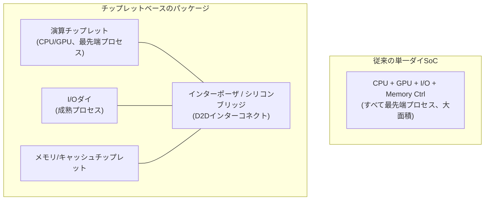
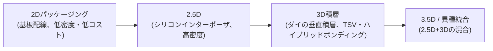

# チップレット(Chiplet)アーキテクチャと異種集積

## 1. 概要

### A. 定義
> **チップレット(Chiplet)** とは、1つの巨大な単一ダイ(Monolithic Die)でチップを作る代わりに、機能・プロセス別に細かく分割した複数の小さなダイ(Die)を**1つのパッケージ内で高速インターコネクトによって接続(異種集積、Heterogeneous Integration)** し、1つのチップのように動作させる半導体設計・パッケージング方式である。

従来のSoC(System on Chip)は、CPU・GPU・メモリコントローラ・I/Oなどすべてのブロックを**1つのシリコンダイに最先端プロセスで統合**してきた。しかし、微細プロセスが3nm・2nmに達するにつれ、この方式は物理的・経済的な限界に直面した。チップレットは「大きなチップを1つうまく作る」問題を「小さなチップを複数うまくつなぎ合わせる」問題へと転換する。すなわち、演算コアは最先端プロセスで、I/Oやアナログのように微細化の恩恵が小さいブロックは成熟した(安価な)プロセスで、それぞれ別々に製造した後にパッケージで結合することで、**性能・歩留まり・コスト・設計の柔軟性**を同時に実現しようとするアプローチである。AMDのEPYC/Ryzen、IntelのMeteor Lake、AppleのM1 Ultra、NVIDIAのデータセンター向けGPUが代表的な商用事例である。

### B. 登場背景および必要性
チップレットが台頭した背景には、3つの圧力が重なっている。第一は**ムーアの法則の鈍化と微細プロセスコストの急騰**である。最新ノードほどファブ投資とマスクコストが指数関数的に増加し、すべてのブロックを最先端プロセスに載せることは経済的に不合理となった。第二は**歩留まり(Yield)の問題**である。ダイ面積が大きくなるほど、ウェハ上の欠陥1つでダイ丸ごと廃棄される確率が高まり、歩留まりが急落する。大きなダイ1つを複数の小さなダイに分割すれば、欠陥のあるダイだけを廃棄して良品ダイだけを選んで使えるため、**実効歩留まりが大きく向上する**。たとえば同じ欠陥密度で800㎟の単一ダイの歩留まりが数十%台であれば、これを4つの200㎟チップレットに分割すると個々の歩留まりははるかに高くなり、良品の組み合わせ確率も改善される。第三は**レチクル限界(Reticle Limit)** で、露光装置が一度に露光できる面積(約858㎟)を超える超大型チップはそもそも単一ダイで作ることができず、複数ダイの結合が不可避である。これらの圧力がかみ合い、チップレットは選択肢ではなく主流となった。

## 2. アーキテクチャ構造と構成要素

チップレットベースのシステムは、異なるプロセス・機能のダイを**パッケージ内部の高速配線(インターポーザ・ブリッジ)** でつなぎ、**標準ダイ・ツー・ダイ(D2D)インタフェース**で通信させる。以下の構造図は、単一ダイSoCとチップレットベース構造の違いを示している。

各要素を原理を中心に見ていく。**演算チップレット(Compute Die/CCD)** は性能がそのまま微細化の恩恵に直結する部分であり、最も進んだプロセス(例:5nm・3nm)で製造してトランジスタ密度と電力効率を最大化する。**I/Oダイ(IOD)** はPCIe・メモリコントローラ・USBなどのアナログ・インタフェースブロックであり、微細化しても性能上の恩恵が小さく、むしろ設計難度が上がるだけなので、**成熟した低コストプロセス(例:6nm・12nm)** に残してコストを下げる。この「プロセス分離(Process Split)」がチップレットの経済性の核心である。**インターポーザ(Interposer)** はチップレットを載せ、その下で微細配線によって相互接続する基板であり、シリコンインターポーザ(2.5D)は数千~数万個のマイクロバンプによって超高密度配線を提供する。

### A. 相互接続インタフェース — UCIe標準
チップレットが真のエコシステムとなるためには、**異なる企業のチップレットを1つのパッケージに混在させて使えなければならず**、そのための標準インタフェースが不可欠である。かつてはAMDのInfinity Fabricのようにベンダーごとの独自インターコネクトがそれぞれ存在し、相互運用は不可能であった。これを標準化したものが**UCIe(Universal Chiplet Interconnect Express)** であり、Intel・AMD・Arm・TSMC・Samsungなどが参加するオープンなD2D標準である。UCIeは物理層(バンプピッチ・電気仕様)、プロトコル層(PCIe・CXLのマッピング)、ソフトウェアスタックを規定し、**異なるベンダーのチップレットのプラグアンドプレイ**を目指す。これは、ボード上でPCIeによってデバイスを挿すように、パッケージ内でチップレットを標準規格で組み合わせようとする試みである。

## 3. 集積(パッケージング)方式と類型

チップレットを物理的につなぐ方式は、配線密度とコストに応じていくつかの階層に分かれる。以下は代表的な集積方式の進化を示したものである。

**2D方式**は基板(Substrate)上にチップレットを並べて置き、基板配線でつなぐ最も単純・安価な方式であるが、配線密度が低いため帯域幅が制限される。**2.5D方式**はチップレットの下に**シリコンインターポーザ**を敷き、超微細配線でつなぐ方式であり、TSMCの**CoWoS(Chip on Wafer on Substrate)** が代表的で、HBMとGPUを1つのパッケージに統合するAIアクセラレータ(NVIDIA H100/H200など)に広く用いられている。**3D積層**はダイを**垂直に積み重ね、TSV(Through-Silicon Via、シリコン貫通電極)** または**ハイブリッドボンディング(Hybrid Bonding)** で直結する方式であり、配線長を極限まで短縮して帯域幅・電力効率を高める。AMDの3D V-Cache(演算ダイの上にキャッシュダイを積層)が商用事例である。ハイブリッドボンディングはバンプなしで銅-銅を直接接合してサブマイクロメートルのピッチを実現するもので、次世代3D集積の中核技術として台頭している。

| 方式 | 配線密度 | 帯域幅 | コスト | 代表的な技術・事例 |
|---|---|---|---|---|
| 2D | 低 | 低 | 低コスト | 有機基板MCM |
| 2.5D | 高 | 高 | 中~高 | CoWoS、EMIB、HBM統合 |
| 3D積層 | 非常に高い | 非常に高い | 高コスト | 3D V-Cache、TSV・ハイブリッドボンディング |

Intelの**EMIB(Embedded Multi-die Interconnect Bridge)** は、大型インターポーザ全体を敷く代わりに、ダイが接する部分にだけ小さなシリコンブリッジを埋め込み、2.5D級の高密度接続をより低いコストで実現した折衷案であり、インターポーザ方式のコスト負担を軽減しようとする代表的なアプローチである。

## 4. 比較およびトレードオフ

チップレットは万能ではなく、単一ダイと比べて明確な得失がある。単一ダイSoCはすべてのブロックが1つのシリコン上にあるため、**ブロック間の通信遅延が極めて短く、電力オーバーヘッドがない**という強みがある。一方、チップレットはダイ境界をまたぐD2D通信において**追加の遅延と電力(バンプ・配線の駆動コスト)** が発生する。すなわち、チップレットの経済性・歩留まり上の利点は、**インターコネクトのオーバーヘッドという代償**と引き換えに得たものである。このため、遅延に極めて敏感な小型モバイルチップでは依然として単一ダイが有利である一方、大面積・高性能のサーバ/AIチップでは歩留まり・コスト上の利点がオーバーヘッドを圧倒し、チップレットが事実上の標準となった。

また、チップレットは**設計・検証の複雑さ**を高める。複数ダイの電力・熱・シグナルインテグリティをパッケージレベルでまとめて検証しなければならず、**既知良品ダイ(KGD, Known Good Die)** を事前に選別できなければ、組立後の不良によって高価なパッケージ全体を廃棄することになる。熱管理も課題であり、3D積層時には上下のダイの発熱が重なって局所的な過熱が発生しやすく、放熱設計が難しい。このように、チップレットは「ブロックを分割して得る利点」と「再びつなぎ合わせる際に払うコスト」の均衡点を探る設計であるといえる。

## 5. 深掘り — 産業動向とAI半導体との連携

チップレットは、特に**AI半導体とHBM統合**において中核的なインフラとなった。NVIDIA・AMDのデータセンター向けGPUは、演算ダイの周囲に複数のHBMスタックを2.5D(CoWoS)で統合して超広帯域を確保しているが、これはチップレット・異種集積なしには不可能な構造である。TSMCのCoWoS生産能力がAIアクセラレータ供給のボトルネックとして指摘されるほど、チップレットパッケージングはAI時代の半導体サプライチェーンにおける戦略的資産となった。標準の面では、UCIeが1.0(2022)以降継続的に改訂され、帯域幅・バンプ密度を高めており、今後は**マルチベンダーのチップレットマーケットプレイス**(異なる企業の演算・メモリ・I/Oチップレットを組み合わせてカスタムチップを構成)の土台となる見通しである。韓国でもSamsung Electronics・SK hynixがHBMと先端パッケージング(I-Cube・X-Cubeなど)に大規模な投資を進めており、これはメモリ-ロジック異種集積競争の中核的な軸として浮上している。(具体的なロードマップ・容量の数値は各社の発表により変動しうるため、最新の公表情報を確認する必要がある。)

## 6. 考慮事項および示唆

技術士の観点から、チップレットの導入・評価は次の点を総合的に判断しなければならない。

- **適用戦略(プロセス分離の最適化)**:微細化の恩恵が大きい演算ブロックは最先端プロセス、恩恵が小さいI/O・アナログは成熟プロセスへと分離配置するのが原則である。全面的なチップレット化ではなく、ブロックごとのコスト-性能感度に応じて分割境界を設計することが中核的な能力である。
- **標準・エコシステムへの依存性**:独自インターコネクトは性能最適化に有利であるがベンダーロックインを生む。長期的には**UCIeなどのオープン標準**の採用がサプライチェーンの柔軟性・マルチソーシングに有利であるため、標準の成熟度と自社の要求性能との間のトレードオフを比較衡量しなければならない。
- **歩留まり-オーバーヘッドの損益分岐**:ダイ分割は歩留まり・コストを改善するが、D2Dの遅延・電力とパッケージングコストを伴うため、**ダイ面積・目標性能・生産規模**に応じた損益分岐分析が先行しなければならない。大面積・大量生産であるほどチップレットが有利である。
- **KGD・熱・検証の管理**:組立後の不良による損失を防ぐためにKGD選別テスト体制を整え、3D積層時には熱・電力・シグナルインテグリティをパッケージレベルで統合検証する設計・テストプロセスを確保しなければならない。
- **展望(コンポーザブルハードウェア)**:チップレットはCXLベースのメモリ分離、異種アクセラレータの統合と結びつき、**モジュールを組み合わせてシステムを構成するコンポーザブルインフラ**のハードウェア的な土台へと拡張していく見通しである。半導体設計能力が「大きなチップの設計」から「異種チップレットの統合・パッケージング設計」へと移行していることを戦略的に認識する必要がある。

## 参考資料
- UCIe Consortium, "Universal Chiplet Interconnect Express (UCIe) Specification", https://www.uciexpress.org/
- TSMC, "3DFabric: Advanced Packaging Technology (CoWoS, SoIC)", https://3dfabric.tsmc.com/

---
> **一言まとめ**: チップレットは、巨大な単一ダイの代わりに機能・プロセス別に分割した小さなダイを、UCIeなどの標準D2Dインターコネクトと2.5D/3Dパッケージングによって1つのパッケージに異種集積することで、微細プロセスのコスト・歩留まり・レチクル限界を克服し、AI半導体・HBM統合の土台をなす設計方式である。
