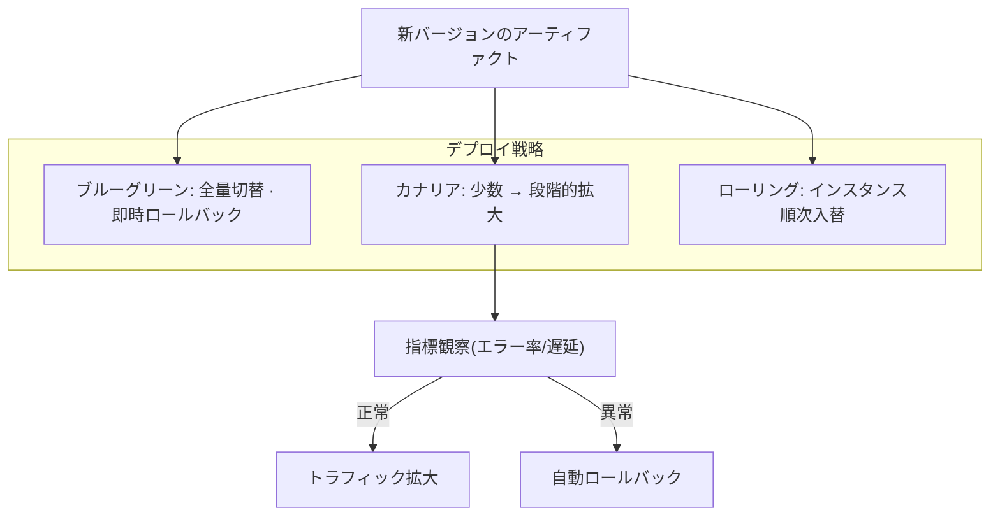

# CI/CDパイプライン(継続的インテグレーション・継続的デプロイ)

## 1. 概要

> **CI/CDパイプライン**とは、ソースコードの変更がリポジトリに反映された瞬間から、ビルド・テスト・統合・リリース・デプロイに至る一連のソフトウェアデリバリー(delivery)過程を自動化された段階(stage)の連鎖として定義し、これを反復可能かつ観測可能な形で実行する工学的な体系である。CI(Continuous Integration、継続的インテグレーション)は「コードを頻繁に、小さく統合し、即座に検証する」活動を、CD(Continuous Delivery/Deployment、継続的デリバリー/デプロイ)は「検証済みの成果物をいつでも、あるいは自動的に本番へ反映する」活動を指す。

CI/CDが登場した背景は、従来の統合方式の失敗に見いだすことができる。かつては開発者がそれぞれ数週間から数か月にわたって独立して作業し、リリース直前にまとめてコードを統合していた。この方式はいわゆる**統合地獄(Integration Hell)**を生んだ。長期間分岐したコードが互いに衝突し、潜んでいた欠陥がリリース終盤に爆発的に増え、誰の変更が問題を起こしたのかを特定しにくく、リリーススケジュールが丸ごと崩れることが繰り返された。欠陥は混入時点から遠ざかるほど修正コストが指数関数的に増大するというのはソフトウェア工学の古くからの経験則であるが、遅い統合はまさにこのコスト曲線の最悪の地点で欠陥を露呈させた。

もう1つの背景は、リリースサイクル短縮への圧力である。クラウド・SaaS・モバイル環境において、競争優位は「どれだけ速く、どれだけ頻繁に、どれだけ安全に」変更をユーザへ届けるかに左右される。DORA(DevOps Research and Assessment)の研究は、デプロイ頻度、変更のリードタイム、変更失敗率、サービス復旧時間(MTTR)の4つの指標で組織のデリバリー性能を測定するが、上位の成果を上げる組織は1日に何度もデプロイしながら、同時に失敗率はより低い。この「速度と安定性の同時達成」を可能にする中核エンジンこそが、自動化されたCI/CDパイプラインである。

### A. CI/CDが解決する中核問題と価値

CI/CDの価値は3つの軸に整理される。第一は**欠陥の早期発見(Fast Feedback)**である。コミットごとにビルドとテストを自動実行するため、欠陥が混入した直後の数分以内に作成者へフィードバックが返る。文脈がまだ開発者の頭の中に残っているうちに修正するため、修正コストが最小化される。実際にある組織は、CI導入後に統合段階で発見されていた欠陥の多くをコミット時点へと前倒しし、リリース直前の欠陥急増現象を大きく緩和した。

第二は**反復可能性と再現性(Repeatability)**である。デプロイが人手によるチェックリストに依存すると、手順の漏れや環境の差異による「自分のPCでは動くのに」という問題が常に存在する。パイプラインは同一のスクリプトと同一の環境定義(IaC、コンテナイメージ)によって毎回同じ方法で成果物を作成しデプロイするため、人的ミスを排除し、監査の追跡可能性を提供する。

第三は**リリースリスクの分散(Small Batch)**である。大きな変更をたまにデプロイすると、失敗時の影響範囲が大きく原因の切り分けが難しい。小さな変更を頻繁にデプロイすれば各デプロイのリスクは小さく、問題発生時には直前の変更に原因を絞り込みやすく、ロールバックも簡単である。これは「小さなバッチこそ低いリスク」というリーン(Lean)原理のソフトウェアにおける実装である。

これら3つの価値を貫く共通の特徴は**自動化・標準化・フィードバック**である。人が繰り返していた手順をスクリプトで自動化し、環境と成果物を標準化して差異をなくし、各段階の結果を即座に上流へフィードバックして次の行動を促す。この3つの特徴が結びつくとき、パイプラインは単なるデプロイ自動化ツールを超え、組織のソフトウェアデリバリー能力を継続的に改善する学習システムとして機能する。

## 2. CI/CDパイプラインの全体構造

パイプラインは、ソースリポジトリ(VCS)を起点として、トリガ・ビルド・テスト・アーティファクト保存・デプロイ・検証の各段階が方向性をもって連結された構造である。各段階は前段階の成果物を入力として受け取り、合格(pass)・失敗(fail)を判定し、失敗時にはパイプラインを中断(fail-fast)させて欠陥が下流へ伝播するのを防ぐ。

上記の構造で注目すべき点は、**段階ごとのゲート(Quality Gate)**の存在である。各段階は合格基準(テスト成功率、カバレッジの閾値、セキュリティスキャンの無欠陥など)を満たしてはじめて次の段階へ進み、この基準がそのまま品質の最低保証ラインの役割を果たす。また、最後のモニタリング段階はデプロイで終わるのではなく、運用指標(エラー率・遅延・リソース)を観察して異常時には自動ロールバックへとフィードバックする閉ループ(closed loop)を形成する。このフィードバックがなければ、自動デプロイはかえって障害を速く伝播させるリスク要因となる。

### A. CI(継続的インテグレーション)段階の原理

CIの本質は「統合を先送りしない」という規律である。開発者は少なくとも1日1回以上、自分の変更をメインブランチ(main/trunk)にマージし、そのたびに自動化されたビルドとテストが実行される。このとき要となるのは、**メインブランチを常にデプロイ可能な状態に保つ(Keeping the build green)**ことである。ビルドが壊れれば、それを直すことがチームの最優先課題となり、壊れた状態の上に新たな変更を積み重ねない。

CIが効果を発揮するには、3つの実践が裏付けとなる必要がある。第一に、変更単位を小さく保ち、統合時の衝突を減らす。第二に、信頼できる自動テストスイートを整え、「緑(green)」が実際に正常であることを意味するようにする。第三に、フィードバックを速くするためにテストを階層化する — 高速な単体テストを先に実行して数分以内にフィードバックを返し、遅い統合テスト・E2Eテストは後ろに配置する。たとえば単体テストが3分、全スイートが30分であれば、開発者は3分以内に一次判定を受け取り、作業の流れが途切れない。

テスト階層化の理論的な指針が**テストピラミッド(Test Pyramid)**である。下層に高速で安価な単体テストを多数置き、中間に統合テスト、上層に遅く高価なE2Eテストを少数だけ配置する。これを逆転させてUI/E2Eテストに過度に依存すると(いわゆるアイスクリームコーンのアンチパターン)、パイプラインが遅くなり、不安定なフレーキーテストが増えて緑の信頼性が崩れる。したがってパイプライン設計は、「何をどの階層で検証するか」というテスト戦略と切り離すことはできない。

### B. CDの2つの顔 — 継続的デリバリーと継続的デプロイ

CDはしばしば一括りに呼ばれるが、本番反映の自動化の程度によって2つに区別しなければならない。**継続的デリバリー(Continuous Delivery)**は、パイプラインがいつでも本番にデプロイできる「リリース候補」を常に用意しておきつつ、最終的な本番反映には人の承認(ボタンクリック)を要求する。規制産業や影響の大きいサービスのように、リリースのタイミングをビジネス上統制する必要がある場合に適している。**継続的デプロイ(Continuous Deployment)**は、この最後の承認さえも自動化し、すべてのゲートを通過した変更が人の介入なしに本番へ反映される。デプロイ頻度は最大化されるが、その分、自動化されたテスト・モニタリング・ロールバックへの信頼が前提となる。

両方式の違いは単なる自動化水準を超え、組織のリスク許容傾向とサービス特性を反映する。消費者向けWebサービスは継続的デプロイで1日数十回デプロイし、素早い実験を追求できるが、金融のコアバンキングや医療システムは変更管理・監査要件のため、継続的デリバリーの承認ゲートを維持するほうが現実的である。

### C. 無停止デプロイ戦略との結合

パイプラインの最終段階であるデプロイは、ユーザへの影響を最小化する戦略と結合したときに完成する。代表的には、**ブルーグリーン(Blue-Green)**は同一の2つの環境を用意してトラフィックを一度に切り替え、即時ロールバックを可能にし、**カナリア(Canary)**は新バージョンを少数のユーザに先行公開して指標を観察した後に段階的に拡大し、**ローリング(Rolling)**はインスタンスを順次入れ替えてリソース効率を高める。これらの戦略は、パイプラインの自動検証・自動ロールバックとかみ合ってはじめて実質的なセーフティネットとなる。

| 区分 | CI(継続的インテグレーション) | 継続的デリバリー(Delivery) | 継続的デプロイ(Deployment) |
|------|----------------|----------------------|------------------------|
| 自動化の範囲 | ビルド・テスト・統合 | 本番デプロイ直前まで | 本番デプロイまですべて |
| 最終的な本番反映 | 該当なし | 人の承認が必要 | 完全自動 |
| 前提条件 | 自動テスト | + デプロイ自動化 | + 信頼できるモニタリング・ロールバック |
| 適する状況 | すべてのチームの基本 | 規制・影響の大きいサービス | 素早い実験が必要なサービス |

## 3. パイプラインの構成要素と品質ゲート

成熟したパイプラインは、複数の検証ツールをゲートとして緻密に配置する。静的解析とリント(lint)でコーディング規約と潜在的欠陥を捉え、単体・統合・E2Eテストで機能を検証し、テストカバレッジの閾値で検証不足を遮断する。さらに、セキュリティを前段へ引き寄せる**シフトレフト(Shift-Left)**の観点から、SAST(静的セキュリティ解析)、SCA(オープンソースコンポーネント・ライセンス解析)、コンテナイメージの脆弱性スキャン、IaCのセキュリティ検査、シークレット(secret)漏洩検知をパイプラインに組み込む。このようにセキュリティをパイプラインに統合するアプローチが、DevSecOpsの実践的な骨格である。

アーティファクト管理も中核的な構成要素である。ビルド成果物(コンテナイメージ、パッケージ)は不変(immutable)な形でアーティファクトリポジトリに保存し、固有のバージョン・ハッシュで識別して、「どのコミットがどの成果物となり、どこにデプロイされたか」の追跡可能性を確保する。近年では、サプライチェーンセキュリティのためにSBOM(ソフトウェア部品表)の生成とアーティファクト署名(例:Sigstore/cosign)、来歴証明(SLSA provenance)までパイプラインの段階として含める傾向にある。

実務の例として、韓国の大手コマースやポータルサービスのバックエンドチームは、コミット → コンテナイメージのビルド → イメージ脆弱性スキャン → ステージングへの自動デプロイ → 自動E2E → カナリアデプロイというパイプラインを構成し、1日数十回のデプロイを数名のプラットフォームエンジニアで賄っている。パイプラインがなければ、同じ頻度のデプロイは人員上不可能である。

### A. パイプラインのコード化(Pipeline as Code)とトリガ戦略

成熟したパイプラインは、GUIのクリックではなくコードで定義される。`Jenkinsfile`、GitHub ActionsのワークフローYAML、GitLab CIの`.gitlab-ci.yml`のように、パイプライン定義をソースとともにバージョン管理(Pipeline as Code)すれば、パイプラインの変更もコードレビュー・履歴追跡の対象となり、再現性と監査性が確保される。パイプラインが特定の担当者のコンソール設定にしか存在しないと、その人が去ったときに誰もデプロイ手順を再現できないという知識喪失(bus factor)のリスクが生じる。

トリガ戦略も設計要素である。コミットのpushはCIを、PR(Pull Request)の作成は検証パイプラインを、mainブランチへのマージはデプロイパイプラインを、タグ(tag)の作成は正式リリースを、それぞれ誘発するようにイベントごとにパイプラインを分岐させる。ここに**トランクベース開発(Trunk-Based Development)**を組み合わせると、長寿命ブランチを減らして統合時の衝突を抑制できるが、このとき未完成の機能を隠すためにフィーチャーフラグ(Feature Flag)を併用して「デプロイとリリースを分離」するのが定石である。すなわち、コードは頻繁にデプロイしつつ、ユーザに公開するタイミングはフラグで別途制御する。

### B. 環境の昇格(Promotion)とアーティファクトの不変性

パイプラインは、開発(dev)・ステージング(staging)・本番(prod)へと続く環境を順次通過させながら信頼を蓄積する。このとき守るべき原則が**同一アーティファクトの昇格(Build once, deploy many)**である。環境ごとに再ビルドすると環境ごとに異なる成果物が作られ、「ステージングでは通ったのに本番で失敗する」という差異が生じる。したがって、一度ビルドした不変のアーティファクトをそのまま次の環境へ昇格させ、環境の違いはコードではなく外部の構成(設定・シークレット)としてのみ注入する。これは、The Twelve-Factor App(12-Factor App)が強調する「設定とコードの分離」原則とまさに合致する。

環境間の昇格は、すなわちゲートの強度の差別化でもある。ステージングは本番にできるだけ近い構成を備えて統合・性能・セキュリティの検証を行い、本番への昇格段階では変更管理の承認・デプロイウィンドウ(window)・段階的公開ポリシーが追加で適用される。環境が本番に近づくほどゲートは厳格になり、通過したアーティファクトに対する信頼は高まる。

## 4. 類似概念との比較 — なぜ区別が必要か

CI/CDは隣接する概念としばしば混同されるが、それぞれが扱う問題領域は異なる。**DevOps**は開発と運用の文化・組織・プロセスを包括する上位概念であり、CI/CDはそのDevOpsを技術的に実現する自動化パイプラインである。すなわちCI/CDはDevOpsの必要条件であって十分条件ではない。**GitOps**はデプロイの「宣言的な望ましい状態(desired state)」をGitに置き、オペレータ(operator)がこれを継続的に同期する運用モデルであり、CDの1つの実装方式とみなせる。**IaC(Infrastructure as Code)**はパイプラインがデプロイする対象環境そのものをコードで定義する手法であり、CI/CDが再現性を確保するための土台となる。

この区別が実務で重要な理由は、「CIツールを導入した」という事実だけではデリバリー性能が改善されないためである。自動テストが不十分であれば緑が品質を保証できず、デプロイ自動化があってもモニタリング・ロールバックがなければ継続的デプロイはかえって危険である。したがって、各概念が埋める隙間を理解し、あわせて整えてはじめて実際の効果が生まれる。

一方、CI/CDを導入しても成果が出ない典型的な失敗パターンがある。パイプラインは整えたものの開発者が依然として長寿命ブランチで長く作業し統合頻度が低いケース(名ばかりのCI)、ゲートを形式的に置いて失敗時に無視・強制通過(override)するケース、ステージングと本番の環境構成が大きく異なりステージングでの検証が無意味なケースが代表的である。こうした失敗はツールではなく規律と設計の問題であり、先に見た隣接概念(トランクベース開発、IaC、環境昇格の原則)をあわせて守ってはじめて解消される。

| 概念 | 焦点 | CI/CDとの関係 |
|------|------|----------------|
| DevOps | 文化・組織・協働 | CI/CDはこれを実現する技術的な軸 |
| CI/CD | ビルド・テスト・デプロイの自動化パイプライン | 本トピック |
| GitOps | 宣言的状態のGitベースの同期 | CDの1つの実装方式 |
| IaC | インフラをコードで定義 | パイプラインによるデプロイの再現性の土台 |
| DevSecOps | セキュリティのパイプラインへの内在化 | CI/CDにセキュリティゲートを統合 |

## 5. 深掘り — 発展動向と実務適用戦略

CI/CDはいくつかの方向へ進化している。第一に、**プラットフォームエンジニアリング(Platform Engineering)**との結合である。チームごとにパイプラインを重複して構築していた慣行から脱し、社内開発者プラットフォーム(IDP)が標準化された「ゴールデンパス(golden path)」のパイプラインテンプレートをセルフサービスで提供する方式が広がっている。これには認知負荷を下げ、組織全体に標準・セキュリティの遵守を強制する効果がある。

第二に、**サプライチェーンセキュリティ(Supply Chain Security)**の強化である。SolarWinds事件以降、ビルドパイプラインそのものが攻撃対象領域であるという認識が広がり、SLSAフレームワークに基づくビルドの完全性保証、アーティファクトの署名・検証、SBOMの義務化が標準として定着しつつある。パイプラインは今や「速いデプロイ」だけでなく、「何をデプロイしたかを証明する」責任まで負う。

第三に、**オブザーバビリティ(Observability)と指標に基づく管理**である。DORAの4大指標(デプロイ頻度・リードタイム・変更失敗率・MTTR)をパイプラインで自動収集・可視化してデリバリー性能を定量的に管理し、デプロイと運用指標を連携させて自動ロールバック・自動昇格を判断する方向へと高度化している。近年では、AIを活用して失敗原因の分析、フレーキー(flaky)テストの検知、デプロイリスクの予測を支援しようとする試みも現れている。こうした指標に基づく管理は、デプロイを「イベント」ではなく「データ」として扱うことを可能にし、特定のデプロイと障害の相関を追跡し、危険な変更パターンを事前に特定する根拠となる。

第四に、**パイプライン実行インフラの効率化**である。コンテナベースの使い捨てランナー(ephemeral runner)でビルド環境を毎回クリーンに再生成して「環境汚染」をなくし、依存関係・ビルドキャッシュとリモートビルドキャッシュで繰り返しのビルド時間を短縮する。大規模なモノレポでは、変更の影響グラフを分析して影響を受けるモジュールだけをビルド・テストする選択的実行(affected-only)によって、パイプライン時間を数十分から数分に短縮することもある。パイプライン自体の性能が開発者の生産性とクラウドコストに直結するため、これは無視できない最適化領域である。

実務の適用戦略としては、最初から完全自動化を目指すよりも、**CI → 継続的デリバリー → 継続的デプロイ**と成熟度を段階的に高めるアプローチが現実的である。テスト自動化の基盤が弱い組織がいきなり継続的デプロイを導入すると、障害を自動的に伝播させる結果を招くためである。また、データベースのスキーマ変更のように元に戻しにくい作業は、拡張-縮小(expand-contract)パターンで下位互換性を維持しながら段階的に反映し、自動デプロイと無停止を両立させる。

## 6. 考慮事項および示唆

技術士の観点から、CI/CDの導入はツール選定の問題ではなく、**エンジニアリングの規律と組織能力の問題**としてアプローチしなければならない。次の事項を総合的に考慮する。

- **テストの信頼性が自動化の前提**:パイプラインの価値は自動テストの信頼度に比例する。カバレッジの数値だけを上げるのではなく、意味のある境界・異常ケースを検証し、結果が不安定なフレーキーテストを積極的に取り除いてはじめて、「緑」がデプロイ承認の根拠となりうる。検証が不十分であれば、自動化は欠陥をより速くデプロイするだけである。
- **速度-安定性のトレードオフ管理**:パイプラインが長くなれば安全だがフィードバックが遅くなり、短ければ速いが見逃す欠陥が生じる。テストの階層化(速いものを先に)、並列実行、変更の影響範囲に基づく選択的テストによってこの相反を緩和し、サービスのリスク度に合わせてゲートの強度を差別化して設計する。
- **セキュリティ・サプライチェーン完全性の内在化**:セキュリティをリリース後段の別手順とすると速度を阻害し、迂回の誘因が生じる。SAST・SCA・イメージスキャン・シークレット検知をパイプラインのゲートとして内在化(Shift-Left)し、SBOM・アーティファクト署名によってデプロイ物の出所と構成を証明し、サプライチェーン攻撃に備える。
- **ロールバック・復旧可能性の確保**:デプロイの自動化よりも重要なのが、失敗時の迅速な復旧である。不変のアーティファクト、デプロイ戦略(ブルーグリーン・カナリア)、データベースマイグレーションの下位互換設計、自動ロールバックトリガをあわせて整え、MTTRを最小化しなければならない。元に戻せないデプロイは自動化しない。
- **組織・文化的な転換**:CI/CDは、「ビルドを壊さない」「小さく頻繁に統合する」というチームの規律と、失敗を非難ではなく学習として扱う文化がなければ定着しない。指標(DORA)で改善を可視化しつつ、指標そのものが目的化して抜け道を生まないよう、バランスよく運用する。
- **連携技術との統合的な視点**:CI/CDは、コンテナ・Kubernetes、IaC、GitOps、オブザーバビリティ、プラットフォームエンジニアリングと結びついたときに完成する。個別ツールの導入ではなく、デリバリーのバリューチェーン全体を設計する視点からアプローチしてはじめて、持続可能な成果が得られる。

総合すると、CI/CDパイプラインは、ソフトウェアを「作る能力」と「届ける能力」を不可分に結合した現代ソフトウェア工学の中核インフラである。技術士は特定ツールの優劣を論じるよりも、組織のサービス特性・規制要件・成熟度に合わせてゲートの強度と自動化の水準を設計し、速度・安定性・セキュリティ・コストのバランスを最適化するアーキテクトとしての視点を堅持しなければならない。

## 参考資料

- Continuous Delivery (Jez Humble, David Farley), https://continuousdelivery.com/
- DORA(DevOps Research and Assessment) State of DevOps, https://dora.dev/
- SLSA(Supply-chain Levels for Software Artifacts), https://slsa.dev/
- Martin Fowler, "Continuous Integration", https://martinfowler.com/articles/continuousIntegration.html

---

> **一言まとめ**: CI/CDパイプラインは、コミットからデプロイまでのソフトウェアデリバリー過程を自動化された品質ゲートの連鎖として実装し、CI(小さく頻繁な統合・即時検証)とCD(常にデプロイ可能なリリース候補のデリバリー/自動デプロイ)によって速度と安定性を同時に達成するDevOpsの技術的エンジンである。
