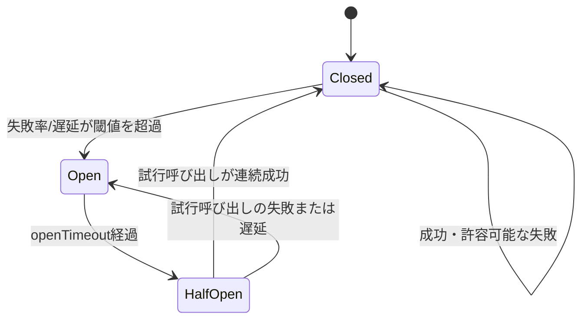
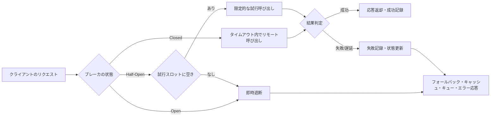

# サーキットブレーカ(Circuit Breaker)パターンと障害分離

## 1. 概要

### A. 定義

> **サーキットブレーカ(Circuit Breaker)**とは、リモート呼び出しの失敗・遅延を観察して呼び出し経路を遮断し、障害が回復したかを限定的に確認したうえで再び開通させるソフトウェア設計パターンである。

サーキットブレーカは、電気回路の遮断器から名前を借りている。
電気回路に過電流が流れると遮断器が回路を切って火災や設備の損傷を防ぎ、点検後に再び接続する。
分散ソフトウェアにおいても、1つのサービスの障害が呼び出し元全体へ伝播しないよう、失敗した依存先へ向かう経路を一時的に遮断する。
核心は、リモートシステムの状態を完全に診断することではなく、呼び出し元が耐えられる失敗の範囲と時間を統制することにある。

サーキットブレーカは単純なリトライロジックとは異なる。
リトライは一時的な失敗を克服するために同じリクエストを再送する手法であるが、障害が続いている間にリトライが累積すると、対象システムの負荷と呼び出し元の待ち行列を増大させうる。
一方、サーキットブレーカは一定の失敗シグナルが観察されると、素早く失敗させるか代替経路を用いることで、追加の呼び出しそのものを減らす。
したがって両手法は競合関係ではなく、リトライ回数・バックオフ・遮断条件をあわせて設計すべき補完関係である。

### B. 登場背景と必要性

分散システムでは、サービスが正常か否かは二値では決まらない。
ネットワークのパケットロス、DNSの遅延、コネクションプールの枯渇、スレッドの枯渇、データベースの部分的な過負荷のように、呼び出しは成功・失敗・遅延のさまざまな状態を示す。
呼び出し元はこの違いを検知できないまま、タイムアウトまで待ち続けたり、無制限にリトライしたりしうる。
その結果、もともと障害が発生したサービスよりも、呼び出し元や上位のサービスが先に飽和する障害伝播が現れる。

たとえば、注文サービスが決済サービスに同期的に依存していると仮定する。
決済サービスの平均応答時間が普段の200msから5秒に増加すると、注文サービスのワーカースレッドが決済の応答を待って占有される。
トラフィックが同じ水準で流入し続ければ待機中のリクエストが積み上がり、注文サービスのコネクションプールとメモリが枯渇し、決済とは無関係な注文照会まで失敗しうる。
サーキットブレーカはこの状況において失敗率と遅延を基準に呼び出しを制限し、注文サービスが提供できる縮退機能を選択させる。

サーキットブレーカが必要とされるもう1つの理由は、復旧時点での殺到を防ぐためである。
障害が解消された直後にすべての呼び出し元が同時にリクエストを再開すると、対象サービスが再び過負荷に陥る、いわゆる復旧ストームが発生しうる。
ハーフオープン状態で少数の試行リクエストだけを許可すれば、復旧の有無を確認しながら負荷を段階的に増やすことができる。
これは障害発生時の遮断だけでなく、回復過程の安定化まで含む制御の問題である。

### C. 適用目標と範囲

適用目標は、第一に依存先障害の分離、第二に呼び出し元のリソース保護、第三にユーザへの迅速かつ予測可能な代替応答の提供、第四に復旧検証の自動化である。
この4つの目標をいずれも達成できず、単に例外を数えるコンポーネントを追加するだけでは、運用の複雑さが増すだけになりうる。
実験と観測を通じて、「どのような失敗を遮断するか」と「遮断したときに何を提供するか」を明確にしなければならない。

主な適用対象は、HTTP・gRPCベースの同期呼び出し、外部の決済・認証API、メッセージブローカの同期管理API、データベースプロキシ、サービスメッシュのルーティング経路である。
逆に、非同期のメッセージコンシューマはすでにバッファと再処理モデルを持っているため、サーキットブレーカだけで問題を解決するのは難しい。
この場合は、コンシューマの分離、バックプレッシャー、再処理回数、ポイズンメッセージキューとあわせて設計しなければならない。

## 2. 動作原理と状態モデル

### A. 基本的な状態遷移

サーキットブレーカの代表的な状態は、クローズ(Closed)、オープン(Open)、ハーフオープン(Half-Open)の3つである。
クローズ状態では呼び出しを正常に通過させながら、成功と失敗、そして遅延を測定する。
オープン状態では実際の依存先呼び出しを行わず、即座に失敗させるか、事前に定めた代替応答を返す。
ハーフオープン状態では、一定の待機時間の後に限られた数の試行呼び出しのみを許可し、依存先の回復を確認する。

クローズからオープンへ遷移する条件は、失敗回数だけで決めないことが望ましい。
短時間の一時的なエラーはネットワークの瞬間的な損失である可能性があり、長時間の高い遅延は対象サービスの飽和である可能性があるため、観察ウィンドウと最小呼び出し数をあわせて設ける。
たとえば、直近20秒間に最低50回の呼び出しが発生し、失敗率が50%を超えたらオープンにする方式は、呼び出し量が少ない区間で誤判定するリスクを減らす。
ただし、閾値はサービスの重要度と許容可能なエラーバジェットに合わせて設定すべきであり、すべてのAPIに一律に適用してはならない。

オープン状態の待機時間は固定値から始めてもよいが、障害と回復が繰り返し現れる環境では、指数バックオフや上限付きの増加方式を検討する。
待機時間が短すぎると回復していない対象に試行リクエストを繰り返し、長すぎると回復したサービスがあっても正常な機能を不必要に長く制限してしまう。
特に決済・認証のようにビジネス上の損失が大きい依存先では、迅速な復旧確認よりも、重複取引やセキュリティエラーの防止により大きな重みを置くことができる。

### B. 呼び出し処理フロー

呼び出し元は、ブレーカを通過する前に現在の状態を確認する。
クローズ状態であればリクエストを実行し、結果を記録する。
オープン状態であれば呼び出しを遮断し、フォールバック、キャッシュ、キューイング、ユーザへの案内のいずれかを選択する。
ハーフオープン状態であれば同時試行呼び出し数を制限し、少数のリクエストだけを対象サービスに渡す。

呼び出し結果の判定には、HTTPステータスコードやgRPCステータスコードの意味を反映しなければならない。
認証失敗のようにリクエスト自体が誤っている4xx応答を一律に依存先障害として数えると、ブレーカが正常なサービスを遮断してしまいうる。
一方、429、502、503、504、あるいは接続拒否・読み取りタイムアウトは、対象システムや経路の容量問題である可能性が高いため、失敗シグナルとして分類できる。
業務ごとに、リトライ可能なエラーとリトライしてはならないエラーを区別するエラー分類表が必要である。

### C. ウィンドウの類型と判定指標

失敗を集計する方法には、連続失敗、時間ベースのスライディングウィンドウ、呼び出し数ベースのリングバッファ、比率ベースの判定がある。
連続失敗方式は実装が単純で初期の障害を素早く遮断できるが、成功と失敗が交互に現れる部分障害を見逃しうる。
時間ベースのウィンドウは一定時間の傾向を見られるが、トラフィック変動の大きいサービスでは低トラフィック時の誤判定が生じやすい。
呼び出し数ベースのウィンドウは統計的な比較が容易であるが、呼び出し量が少ない区間では判定までに時間がかかりうる。

| 判定方式 | 長所 | リスク | 適用例 |
|---|---|---|---|
| 連続失敗数 | 迅速な遮断、単純な実装 | 断続的な障害と低トラフィックに敏感 | 接続拒否、DNS失敗 |
| 時間ベースの比率 | 直近の傾向を反映 | トラフィック急変による偏り | 大規模API |
| 呼び出し数ベースのウィンドウ | サンプル数を保証 | 低呼び出しAPIでの反応遅延 | 決済・管理API |
| 成功率+遅延の混合 | ユーザ体感の障害を反映 | 計測とチューニングが複雑 | 中核ユーザジャーニー |

失敗率だけを見ると、成功はしているが非常に遅い応答を見逃しうる。
たとえばタイムアウトが3秒で、対象サービスが2.9秒ごとに成功応答を返す場合、成功率は高くても呼び出し元のスレッドが長く占有される。
したがって、エラー率、タイムアウト率、p95・p99遅延、同時実行数、遮断率をあわせて観察しなければならない。
遅延を失敗として計算する基準はユーザリクエストのタイムアウトと一致させ、内部のリトライ回数まで含めた最終的な体感時間で検討する。

## 3. 構成要素と設計方法

### A. 失敗・成功の判定器

判定器は、リモート呼び出しの結果を意味のある分類へ変換する層である。
ネットワーク例外、接続拒否、TLSネゴシエーション失敗、読み取りタイムアウト、サーバエラーは技術的な失敗として分類できる。
逆に、不正な入力、権限不足、存在しないリソースのように依存先が正常に返した業務エラーは、基本的にブレーカの失敗には含めない。
この区別を行わないと、コンシューマ側のエラーが累積したときに提供者全体が遮断される副作用が生じる。

成功の判定も、HTTP 2xxという機械的な条件だけでは十分ではない。
応答本文に業務上の失敗コードが含まれるAPI、部分的な成功を返すバッチAPI、非同期の受付のみを成功とみなすAPIには、別途の判定ルールが必要である。
判定器はドメインごとのアダプタを設けて呼び出しの意味を保持し、ルールの変更がステートマシンの実装に直接混ざらないようにしなければならない。
コントラクトテストで、提供者とコンシューマが同じエラー分類を理解しているかを確認することも重要である。

### B. 状態の保存と並行性制御

ブレーカは、直近の呼び出し結果と状態遷移の時刻を保存しなければならない。
単一プロセスのライブラリであればメモリ上の状態で十分な場合もあるが、複数のインスタンスが同じ提供者を呼び出すと、各インスタンスの状態が異なりうる。
この違いは長所と短所を同時に持つ。
インスタンスごとのブレーカは中央ストアの障害の影響を避け、高速に動作するが、全体の呼び出し量を基準とした遮断を精密に制御するのは難しい。

分散状態を用いれば、Redisなどの外部ストアで状態を共有できるが、ブレーカが今度はそのストアに依存することになる。
状態ストアが遅くなったときに、リモート呼び出しを止める判断がかえってユーザの経路を遅延させないよう、ローカルキャッシュ、短いTTL、障害時の保守的なデフォルト値を用意する。
試行呼び出しのスロットを複数のインスタンスが同時に獲得しないよう、分散ロックやトークンバケットを使用できるが、ロック自体の期限切れとネットワーク分断を考慮しなければならない。
多くの場合、グローバルな精度よりもローカルな分離と迅速な判断を優先し、全体のトラフィック制御は別途のレートリミッタに分離するほうが単純である。

### C. タイムアウトとリトライ予算

サーキットブレーカはタイムアウトの代わりにはならない。
タイムアウトがなければ、クローズ状態で呼び出しが無限に待機するため、ブレーカは失敗を集計する機会さえ得られない。
各呼び出しには接続タイムアウト、読み取りタイムアウト、リクエスト全体のタイムアウトを設け、上位リクエストの残り予算の範囲内で下位の呼び出しを行わなければならない。
たとえば上位リクエストの目標時間が1秒であれば、3回の下位リトライをそれぞれ1秒に設定する構成は論理的に不可能である。

リトライとブレーカを併用する際には、乗算的な増幅を避けなければならない。
呼び出し元の1段階が3回リトライし、中間サービスと提供者のSDKもそれぞれ3回リトライすると、1つのユーザリクエストが最大27回の呼び出しへと膨らみうる。
経路全体でリトライの主体を1か所に定め、試行回数と残り時間(deadline)を下位の呼び出しに伝える方式が安全である。
冪等性が保証されない決済・注文リクエストについては、自動リトライよりもリクエストキー、重複排除、非同期の補償フローを優先する。

### D. フォールバックと分離戦略

フォールバックは「何でもよいから応答を返す」機能ではなく、障害時にもデータの意味とユーザの期待を保つ縮退サービスである。
商品レコメンドが失敗したらレコメンド領域を隠して基本の人気リストを表示することはできるが、残高照会が失敗したのに最後のキャッシュ値を現在の残高のように表示するのは危険である。
したがって、応答にstaleかどうかを表示するか、金融・安全のドメインでは保守的なエラー案内を選択しなければならない。
フォールバックの設計では、正確性、鮮度、セキュリティ、法的責任、再処理可能性をあわせて評価する。

分離は、スレッドプール、コネクションプール、キュー、プロセス、ノード、リージョンのレベルで構成できる。
バルクヘッド(bulkhead)は、特定の依存先への待機リクエストがワーカーリソース全体を占有しないようプールを分離する。
ブレーカが呼び出しを遮断しても、すでに実行中のリクエストがリソースを占有し続ければ障害伝播は止まらないため、ブレーカとバルクヘッドを併用しなければならない。
中核機能と付加機能に異なるリソース・タイムアウト・遮断ポリシーを割り当てれば、部分的な機能によってサービス全体の生存性を高めることができる。

## 4. 類似パターンの比較と運用シナリオ

### A. リトライ・タイムアウト・レートリミッタとの比較

タイムアウトは1つのリクエストが待てる上限を定め、リトライは回復の見込みがあるエラーを再試行し、レートリミッタは一定時間内に許容するリクエスト量を制限する。
サーキットブレーカは、失敗が累積する依存先へ向かう経路を状態に応じて選択的に遮断する。
いずれも負荷を制御するが、観察するシグナルと保護する対象が互いに異なる。
実務では、タイムアウトを最も内側のセーフティネットとして置き、限定されたリトライとバックオフの後にブレーカを配置し、全体の流入量はレートリミッタで制御する。

| パターン | 主な問い | 保護対象 | 誤用時に生じる問題 |
|---|---|---|---|
| タイムアウト | どれだけ待つか? | リクエストスレッド・接続 | 短すぎると正常な遅延を失敗扱い |
| リトライ | 再試行する価値はあるか? | 一時的エラーの成功率 | リトライストーム・重複処理 |
| サーキットブレーカ | いつ依存先の呼び出しを止めるか? | 呼び出し元と依存先 | 誤判定による機能遮断 |
| レートリミッタ | どれだけ多く許容するか? | サービスの容量 | 正常なトラフィックの不必要な拒否 |
| バルクヘッド | どのリソースを分離するか? | 機能ごとのリソースプール | 遊休リソースの非効率 |

違いが生じる理由は、障害の時間軸と空間軸が異なるためである。
タイムアウトは1つのリクエストの時間軸を統制するが、ブレーカは複数のリクエストで観察された傾向を用いて、依存経路の空間的な分離を行う。
レートリミッタは障害の有無を判断せず容量ポリシーを適用するため、定常状態での殺到にも有効である。
この区別を答案に明示すれば、各パターンを単に暗記したのではなく、運用の制御面として理解していることを示すことができる。

### B. 事例1:外部決済APIの遅延

オンラインストアの決済APIが、普段の300msから8秒に遅延したと仮定する。
注文APIの全体タイムアウトは2秒であり、決済呼び出しに1.2秒を割り当てている。
最初のリクエストがタイムアウトしたら無条件にリトライするのではなく、決済事業者の冪等キーを用いた状態照会や非同期受付へと切り替える。
ブレーカがオープンになると、新規の決済リクエストは「決済処理中」状態として安全にキューへ入れるか、ユーザに再試行を案内し、すでに承認された決済が重複実行されないようにする。

この事例の要点は、フォールバックの内容が決済ドメインの原子性と一致していなければならないという点である。
単純な失敗応答だけを返すと、ユーザが再度決済して二重承認のリスクが生じうる。
逆に、受付状態を明確に保存し、冪等キー・状態照会・補償処理を組み合わせれば、提供者の一時的な障害下でも注文状態を追跡できる。
試行呼び出しには照会やヘルスチェックを優先し、実際の金額承認のような副作用のあるリクエストをハーフオープンの検証に直接使用しないのが安全である。

### C. 事例2:レコメンド・検索などの付加機能の障害

コンテンツサービスにおいて、パーソナライズされたレコメンドは付加機能であり、本文の閲覧は中核機能であると仮定する。
レコメンドサービスがエラーを返したらレコメンドのブレーカだけをオープンにし、本文閲覧の経路とリソースを共有しないようバルクヘッドを構成する。
フォールバックとして最近の人気コンテンツのキャッシュを提供しつつ、キャッシュの生成時刻を管理して、古いレコメンドを現在のパーソナライズ結果と誤認させないようにする。
こうすればレコメンドの品質は一時的に低下するが、ユーザの中核的な閲覧フローは維持される。

付加機能を常に成功させようとする設計は、中核機能の可用性を損ないうる。
サービスの重要度に応じて依存先の失敗を許容する程度を定義し、中核ジャーニーのエラーバジェットを付加機能より優先して配分しなければならない。
また、ブレーカのオープン率、フォールバック率、キャッシュヒット率をあわせてダッシュボードに表示し、「障害が隠されている状態」と「機能が安全に縮退した状態」を区別する。

## 5. 実装・デプロイ・検証の手順

### A. 設計段階

最初の段階は、ユーザジャーニーとリモート依存先の一覧を描くことである。
呼び出しグラフには、同期・非同期の別、重要度、タイムアウト、冪等性、データの鮮度、代替可能性を記録する。
次に、各依存先について失敗の種類を技術エラー・業務エラー・セキュリティエラーに分類し、遮断の要否とフォールバックポリシーを決定する。
この過程を省略して共通ライブラリを全社に一括適用すると、ドメインごとのリスクの違いを反映できない。

2番目の段階は、ベースラインと目標を定めることである。
平常時の成功率、p95・p99遅延、同時リクエスト数、エラーバジェットの消費率を測定し、実験時に許容するユーザ影響と自動中断条件を定める。
たとえば、中核APIの5分間のエラー率が1%p上昇したり、注文受付の失敗が特定の数値を超えたりした場合は、ただちに実験とトラフィック変更を停止するといった具合である。
ベースラインがなければ、ブレーカが問題を減らしたのか、かえって作り出したのかを判別しにくい。

### B. 段階的なデプロイと検証

最初は、単一インスタンスかつ低トラフィックの非中核APIに適用する。
正常な呼び出し、一時的エラー、持続的エラー、遅い応答、再起動、ネットワーク断絶をそれぞれ注入して、状態遷移とフォールバックを確認する。
その後、カナリアインスタンスの比率を高め、リージョン・テナント・機能ごとに影響範囲を拡大する。
すべての段階で、ブレーカ自体のエラーがユーザにより大きな障害をもたらしていないかを確認しなければならない。

検証項目には、状態遷移の遅延、オープン後の実際の呼び出し量の減少、ハーフオープン時の試行呼び出し数、成功復帰の条件、フォールバックの正確性、メトリクス・ログ・トレースの相関関係が含まれる。
障害が解消された後も正常復帰が自動的に行われるか、復帰直後にトラフィックが急増しないかを確認する。
負荷テストでは、単一ノードだけでなく、複数のインスタンスが互いに異なる状態を持つ場合の結果も測定する。
運用者は遮断されたリクエストと実際に失敗したリクエストを区別できなければならないため、ログフィールドとダッシュボードの意味を事前に合意しておく。

### C. オブザーバビリティと運用

最低限の指標は、ブレーカの状態別リクエスト数、許可・遮断・試行呼び出し数、成功・失敗・タイムアウト数、失敗率、遅延分布、フォールバック率、状態遷移回数である。
ディメンションはブレーカ名、依存先、API、リージョン、インスタンス、エラー種別程度に制限し、高カーディナリティの問題を避ける。
トレースに遮断の有無と原因、リトライ回数、残りのdeadlineをタグとして記録すれば、1つのリクエストの遅延増幅経路を追跡できる。
機微なリクエスト本文や決済情報をログに残さないという個人情報保護の原則もあわせて守る。

運用アラートは、オープンそのものよりも顧客影響と回復の失敗を中心に設計する。
一時的な短いオープンをすべて緊急アラートとして送るとアラート疲れが生じるため、遮断率・継続時間・中核ジャーニーの失敗を組み合わせた重大度ポリシーが必要である。
オープン状態が長く続く場合は、提供者の障害だけでなく、誤った閾値、証明書の期限切れ、ネットワークポリシーの変更、デプロイによるリグレッションもあわせて点検する。
ランブックには、状態確認コマンド、トラフィック縮小手順、フォールバックの点検、手動復旧の条件、事後分析の項目を含める。

## 6. 深掘り:サービスメッシュとSRE運用への拡張

サービスメッシュでは、ブレーカをアプリケーションコードではなくプロキシ層に実装できる。
この方式には、複数言語のサービスに一貫したポリシーを適用でき、デプロイなしで設定を変更できるという利点がある。
しかし、プロキシはドメインエラーの意味や安全なフォールバックを把握しにくいため、転送レベルの遮断と業務レベルの代替応答を分離しなければならない。
プロキシが5xxを検知して呼び出しを減らしている間、アプリケーションは決済の重複やデータの鮮度といった業務ルールに責任を持たなければならない。

SREの観点から、ブレーカは可用性を高める装置であるが、遮断されたリクエストを成功として隠す装置ではない。
遮断とフォールバックを別個のエラーバジェット消費項目として記録し、機能の縮退が続く場合は顧客影響へと換算しなければならない。
サービスレベル目標が「本文閲覧の成功」なのか「パーソナライズされたレコメンドを含む成功」なのかによって、同じフォールバックの評価が変わる。
したがって、SLIを技術指標だけでなくユーザジャーニー指標として定義し、ブレーカのポリシーが目標を改善しているかを検証しなければならない。

近年の運用設計では、固定の閾値だけを用いるよりも、トラフィックパターンと遅延分布を考慮した適応的な基準を検討する。
ただし、自動学習された閾値が異常トラフィックを正常と誤認する可能性があるため、最小・最大の境界と、人がレビューする変更承認手順を設ける。
AIベースの異常検知の結果をブレーカの直接的な遮断シグナルとして使うよりも、補助的なシグナルや調査の優先順位付けに用いるほうが安全である。
自動化の複雑さが増すほど、判断の理由と停止方法を運用者が理解できなければならない。

技術士の答案では、ブレーカを単一のデザインパターンとしてのみ説明するのではなく、障害伝播の防止という品質特性の目標から出発すべきである。
可用性・性能・一貫性・セキュリティ・運用性のトレードオフを提示し、タイムアウト・リトライ・バルクヘッド・レートリミッタ・オブザーバビリティの組み合わせをアーキテクチャのレベルで結びつける。
さらに、定量的な基準、段階的な適用、自動中断、事後の学習まで含めれば、実装の説明を運用ガバナンスへと拡張できる。

## 7. 考慮事項および示唆

### A. 閾値と誤検知・見逃しのバランス

閾値が低いと、正常な一時的エラーでも回路が開き、機能が不必要に制限される。
閾値が高いと、障害が十分に伝播した後になってようやく遮断するため、保護効果が弱まる。
最小呼び出し数、時間ウィンドウ、エラー種別ごとの重み、遅延のパーセンタイルを併用し、トラフィックの季節性を反映して定期的に調整しなければならない。
変更前後の遮断率と顧客指標を比較し、設定変更も運用上の変化として管理する。

### B. データ整合性と業務上の安全性

フォールバックのキャッシュはデータが古い可能性があり、キューに入れたコマンドは後で処理される可能性がある。
残高・在庫・権限・決済のように正確性が最優先のデータについては、stale応答を無条件に許容してはならない。
冪等キー、バージョン検証、補償トランザクション、手動確認状態を設計し、遮断によって重複・消失・順序の逆転が発生しないようにする。
障害分離は、技術的な成功ではなく、業務結果の安全性を基準に評価しなければならない。

### C. 状態共有と運用の複雑さ

インスタンスごとの状態は単純かつ高速であるが、グローバルなポリシーと異なる場合がある。
中央集約された状態は一貫性をもたらしうるが、状態ストアの障害とネットワーク分断という新たな依存関係を生む。
精密なグローバル遮断が本当に必要かをまず判断し、必要でなければローカルブレーカとグローバルなレート制限を組み合わせるなど、複雑さを分離する。
ブレーカの設定はコード・構成管理でバージョン管理し、変更の主体とロールバック方法を明確にする。

### D. セキュリティと個人情報

ブレーカのログとトレースにエラー原因を残す際は、トークン・注文番号・個人情報が露出しないようマスキングする。
フォールバックが提供するキャッシュがテナント間で混在しないよう、キーとアクセス制御を検証しなければならない。
外部認証サービスの障害を回避するという理由で認証を省略すると、可用性よりもセキュリティリスクのほうが大きくなりうる。
遮断・迂回ポリシーも脅威モデルと監査証跡の対象であり、緊急の設定変更には承認と事後レビューの記録を残す。

### E. テストと組織的学習

単体テストだけでは、時間ウィンドウ、並行性、復旧ストームを十分に検証できない。
統合テスト、障害注入、負荷テスト、カナリア運用、定期的な復旧訓練を組み合わせなければならない。
実験結果は特定の担当者の責任追及ではなく、設計上の前提とランブックの改善へとつなげ、発見された問題の再発防止テストをリポジトリに残す。
開発・運用・セキュリティ・業務の担当者が遮断条件とフォールバックの意味を共通して理解しているとき、パターンの効果が持続する。

## 参考資料

- Martin Fowler, CircuitBreaker: https://martinfowler.com/bliki/CircuitBreaker.html
- Microsoft Azure Architecture Center, Circuit Breaker pattern: https://learn.microsoft.com/en-us/azure/architecture/patterns/circuit-breaker
- Microsoft Polly documentation, resilience strategies: https://www.pollydocs.org/strategies/

---

> **一言まとめ**: サーキットブレーカは、失敗した依存先を無条件に再呼び出しせず、状態に基づいて遮断・試行・復帰させることで、障害伝播と復旧ストームをともに制御する分散システムの中核的なレジリエンスパターンである。
