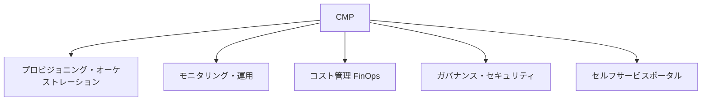

# クラウド管理プラットフォーム(CMP, Cloud Management Platform)

## 1. 概要

### A. 定義
> 複数のパブリッククラウド(マルチ・ハイブリッド)とオンプレミスのリソースを、**単一のコンソールで統合的にプロビジョニング・モニタリング・最適化・ガバナンス**する管理プラットフォーム。

CMPは特定のCSP(AWS・Azure・GCP)の管理コンソールを置き換えるものではなく、互いに異なるクラウドをその**上で抽象化(abstraction)**し、1つの運用体系へと束ねる層である。各CSPはそれぞれ異なるAPI・用語・課金体系・セキュリティモデルを持つため、これらを個別に扱うと管理人員とミスが指数関数的に増える。CMPはこの異質性を吸収し、「どのクラウドにあっても同じ方法でデプロイ・監視・統制」できるようにする。

### B. 登場背景および必要性
企業はベンダーロックイン(Lock-in)の回避、可用性の確保、サービスごとの強みの活用のために**マルチクラウド**を採用したが、その結果、管理対象が爆発的に増加した。クラウドごとにコンソールを行き来しなければならず、コストは複数の請求書に分散してどこで無駄が生じているのかが見えず、セキュリティポリシーもまちまちであるため、コンプライアンスを一貫して強制することが難しい。特に、数回のクリックでリソースが生成されるクラウドの俊敏性は、そのまま**管理されない幽霊リソース(Shadow IT)とコスト爆弾**の原因となる。CMPは、この散在したリソースに対する**可視性・自動化・コスト最適化(FinOps)・ガバナンス**を一か所に集約し、マルチクラウドの複雑さを制御するために登場した。

## 2. 必須機能

**A. プロビジョニング・オーケストレーション** は、リソースのデプロイ・構成・変更をコード(IaC)とテンプレートで自動化する機能である。人がコンソールで手作業でサーバを作成すると、環境ごとに構成が異なる**構成ドリフト(Configuration Drift)** が生じるが、IaCベースの自動化は同一の定義で繰り返しデプロイすることでこれをなくす。

**B. モニタリング・運用** は、複数のクラウドに散在するリソースの性能・可用性・ログを**単一のダッシュボードに統合**して監視し、閾値超過時には自動対応までつなげる機能である。障害の根本原因が複数のクラウドにまたがっている場合、統合的なオブザーバビリティ(Observability)がなければ原因の追跡そのものが不可能である。

**C. コスト管理(FinOps)** は、使用量とコストをリアルタイムに分析して遊休・過剰プロビジョニングのリソースを見つけ出し、予算を統制する機能である。たとえば、開発チームがテスト用に立ち上げたGPUインスタンスを夜通し停止せずに月数百万ウォンが漏れ出すケースを、CMPはタグ別のコストレポートと自動スケジューリングで捕捉する。

**D. ガバナンス・セキュリティ** は、アクセス制御・タグ付けポリシー・規制遵守(コンプライアンス)を複数のクラウドに**一貫して強制**する機能である。ここに**セルフサービスポータル**(承認済みのカタログからユーザが直接リソースを申請)まで加わることで、統制と俊敏性を同時に達成する。

| 機能 | 内容 | ない場合の問題 |
|---|---|---|
| プロビジョニング/オーケストレーション | IaCベースのデプロイ・構成の自動化 | 構成ドリフト・手作業のミス |
| モニタリング・運用 | 統合的な性能・可用性・ログの監視 | 障害原因の追跡不可 |
| コスト管理(FinOps) | 使用量・コスト分析・予算統制 | 遊休リソース・コスト爆弾 |
| ガバナンス・セキュリティ | ポリシー・規制・アクセス制御の一貫適用 | 規制違反・Shadow IT |
| セルフサービス | カタログ・ポータルからの申請 | ITのボトルネック・統制の喪失 |

## 3. プラットフォームの選定基準

CMPの導入は、すなわち運用体系全体をその上に載せる決定であるため、選定基準は単なる機能リストではなく、**自社のクラウド戦略との整合性**で判断しなければならない。自社が実際に使っているCSP・オンプレミスをすべてサポートしているか(サポート範囲が狭ければ結局また個別管理に逆戻りする)、既存のCI/CD・モニタリングツールとAPIで連携できるか、FinOps・ポリシー管理がレポートのレベルにとどまるのか実際の制御のレベルまで及ぶのか、韓国の公共機関であればCSAPのような規定を満たしているかをあわせて確認する。

| 基準 | 確認事項 |
|---|---|
| マルチクラウド対応 | 実際に使用するCSP・オンプレミスのサポート範囲 |
| 自動化・統合 | IaC・API・既存ツールとの連携性 |
| コスト・ガバナンス | FinOps・ポリシー管理の成熟度(制御まで可能か) |
| セキュリティ・規制 | アクセス制御・コンプライアンス(CSAPなど) |
| 拡張性・運用性 | 規模への対応・使いやすさ・学習曲線 |

## 4. 期待効果

期待効果は、前述の必須機能が適切に機能したときに現れる結果である。散在したリソースが一目で見えるようになることで**可視性・統制**が生まれ、遊休リソースの削除と最適なインスタンスの選択によって**コストが削減**され、セルフサービスと自動化によってデプロイのリードタイムが短縮されて**俊敏性**が向上し、ポリシーが一貫して適用されることで**ガバナンス**が強化される。これらの効果は互いにかみ合っており、たとえば可視性が確保されてはじめてコスト削減の対象が見えるようになる。

## 5. 考慮事項および示唆
技術士の観点から、CMP導入時に最も警戒すべき点は、**CMPそのものが新たなロックイン(Lock-in)** になりうるということである。特定のCMPに運用を深く結合すると、後からそのCMPから抜け出すことが難しくなるため、標準(Terraform・OpenAPIなど)と開放性を優先的に考慮しなければならない。また、CMPは万能ではなく、**CSPM(クラウドセキュリティ態勢管理)・FinOps・IaC**と有機的に連携する運用体系の一部として設計してはじめて実効性を発揮する。結論として、CMPはマルチクラウド戦略を持続可能にする中核的な管理手段であり、近年ではAIOps・ポリシー自動化と結合して自律運用(self-driving)の方向へと進化している。

---

> **一言まとめ**: CMPは*マルチ・ハイブリッドクラウドを単一のコンソールに抽象化して統合管理*するプラットフォームであり、プロビジョニング・モニタリング・FinOps・ガバナンスを一貫して提供して可視性・コスト削減・俊敏性を実現する一方、標準・開放性によってCMPそのもののロックインを警戒しなければならない。
