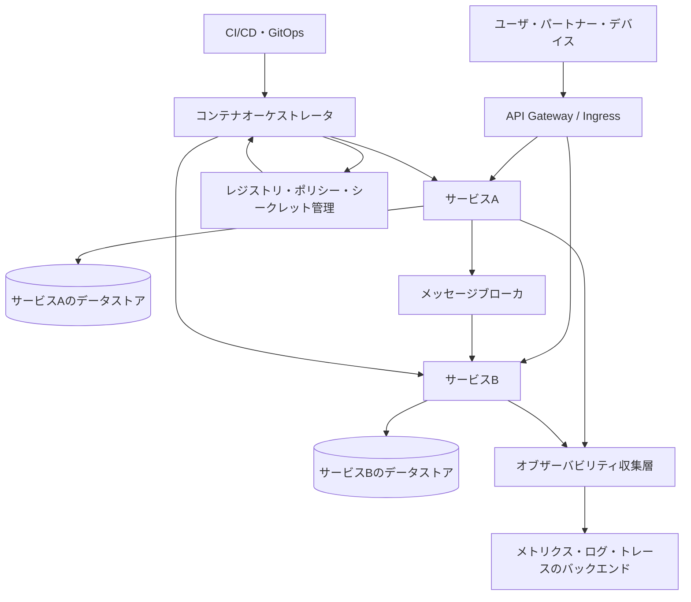
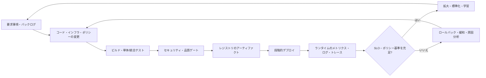

# クラウドネイティブ(Cloud Native)アーキテクチャ

## 1. 概要

> **定義**: クラウドネイティブとは、特定のクラウド製品を使うことではなく、コンテナ・マイクロサービス・宣言的API・自動化・オブザーバビリティ・弾力性を組み合わせ、変化に迅速かつ反復可能に対応できるようアプリケーションと運用方式を設計するアプローチである。

クラウドネイティブの核心は、アプリケーションをクラウドに載せることと、アプリケーションをクラウドネイティブな方式で設計することを区別する点にある。
既存システムを仮想マシンイメージとして包み、パブリッククラウドへ移すリフトアンドシフトはクラウドの利用ではあるが、それだけでクラウドネイティブになるわけではない。
クラウドネイティブは、障害が発生し、需要が変動し、コードが頻繁に変わる状況を正常な運用条件とみなし、システムがその条件下で自ら回復・拡張するよう構造とプロセスを変える。

従来のアプリケーションは、1台のサーバと1つのデプロイ単位を中心に設計されることが多かった。
この構造ではデプロイ前の回帰テストの範囲が大きくなり、一部の機能を変更するだけでもシステム全体を停止するか、大きなリリースウィンドウを確保しなければならなかった。
また、サーバの状態がローカルディスクやメモリに残っていると障害復旧や水平拡張が難しく、運用者はサーバ1台1台の状態を直接管理しなければならない。

クラウドネイティブは、こうした結合を減らすためにアプリケーションを小さな変更単位に分割し、状態と実行環境を可能な限り外部化する。
コンテナイメージは同一の実行単位を開発・テスト・本番へと移動させ、オーケストレータは望ましい状態と実際の状態の差を継続的に調整する。
パイプラインはコードのビルドと検証の手順を自動化し、オブザーバビリティはサービスが正常かどうか、どこで問題が始まったかを運用者が判断するためのシグナルを提供する。

しかし、マイクロサービスを多数作ったりKubernetesをインストールしたりするだけでは、目標を達成することはできない。
サービス境界を誤るとネットワーク呼び出しと分散トランザクションが増え、チーム間の調整コストとデバッグの難度が上昇する。
自動化が不正確であれば、速いデプロイが速い障害伝播に変わりうるし、クラウドリソースの弾力性はコストの急増につながりうる。
したがって技術士の答案では、技術要素を列挙する代わりに、変化への対応力・レジリエンス・運用の自動化・セキュリティ・コストという目標と設計上の選択との因果関係を説明しなければならない。

### 1.1 登場背景と必要性

第一に、デジタルサービスの変更速度が速くなったためである。
モバイル・オンラインサービスは機能改善やポリシー変更を短い周期で提供しなければならず、大規模な一括デプロイだけでは競争のスピードやユーザのフィードバックについていくことが難しい。
小さな変更を頻繁にデプロイするには、コードリポジトリ、ビルド、テスト、デプロイ、ロールバックが連結された自動化されたデリバリーフローが必要である。

第二に、需要と障害の変動性が大きくなったためである。
ショッピングイベントや公共の申請受付のように特定の時間帯にリクエストが急増するサービスでは、平均負荷を基準にサーバを固定すると遊休コストが大きくなり、ピークを基準にすると平常時のコストが大きくなる。
ステートレスなコンポーネントの水平拡張、キューによる緩衝、オートスケーリング、キャッシュといった組み合わせは変動を吸収するが、データベースや外部連携のボトルネックまで自動的に解決するわけではない。

第三に、組織が分散し、プラットフォームが複雑になったためである。
開発・運用・セキュリティ・データのチームが別々に動くと、引き継ぎや承認待ちがボトルネックになる。
プロダクトチームが共通プラットフォームをセルフサービスで利用し、ポリシーをコードとして適用すれば、チームの自律性を高めつつ組織の基本的な統制を維持できる。

### 1.2 目標と適用範囲

クラウドネイティブ設計の第一の目標は**変更容易性(changeability)**である。
機能を小さな単位で修正し独立してデプロイできなければならず、変更の失敗がサービス全体の停止へと拡大してはならない。
そのために、デプロイ単位、データ所有権、API契約、バージョン互換性、ロールバックの境界をあわせて定める。

第二の目標は**弾力性(elasticity)**である。
弾力性とは単にサーバ台数を増やす機能ではなく、負荷に合わせてリソースを調整し、負荷がなくなれば回収する能力である。
水平拡張を適用するには、インスタンスがローカル状態に依存してはならず、セッション・ファイル・ジョブキューを外部ストアや専用サービスに分離しなければならない。

第三の目標は**レジリエンス(resilience)**である。
レジリエンスとは障害がまったく発生しないという意味ではなく、部分的な障害を分離し、限定された機能でサービスを維持し、定められた時間内に復旧する能力である。
タイムアウト・リトライ・サーキットブレーカ・バルクヘッド・マルチアベイラビリティゾーンはそれぞれ異なる障害モードを扱うため、目的を区別して適用する。

第四の目標は**運用のオブザーバビリティと自動化**である。
メトリクス・ログ・トレースがサービスとインフラの状態を説明できなければならず、デプロイとポリシー変更が再現可能なコードとして残らなければならない。
観測データがなければ自動化の結果を検証しにくく、自動化がなければ観測シグナルを人が一つひとつ処理しなければならないため、両要素はあわせて設計する。

## 2. クラウドネイティブの全体構造と中核原理

クラウドネイティブは、アプリケーション・プラットフォーム・インフラ・組織プロセスが結合した運用モデルである。
アプリケーション層はドメイン機能とAPIを提供し、プラットフォーム層はデプロイ・サービスディスカバリ・シークレット管理・観測・ポリシーを共通機能として提供する。
インフラ層はコンピューティング・ネットワーク・ストレージのリソースを抽象化し、ガバナンス層はセキュリティ・コスト・規制遵守の境界を定める。

この構造においてAPI Gatewayは外部との境界を整理するが、すべてのビジネスルールを一か所に集める中央のボトルネックになってはならない。
サービスは自らの責任とデータ所有権を持ち、他のサービスとは契約されたインタフェースで通信する。
オーケストレータはコンテナを実行するツールであると同時に、宣言されたレプリカ数・ネットワークポリシー・デプロイバージョンを実環境に反映する制御ループである。

### 2.1 イミュータブルインフラと宣言的管理

イミュータブルインフラとは、稼働中のサーバを管理者のコマンドで少しずつ修正する代わりに、望ましい設定をコードとイメージで定義し、変更時には新しい実行単位を作って置き換える原理である。
この方式は「現在のサーバがどのような手動変更を経てきたか」という隠れた状態を減らし、環境間の差異を小さくする。
特に障害が発生した際、現在のサーバを修理するよりも同一のイメージと設定で新しいインスタンスを再生成するほうが、復旧手順を自動化しやすい。

宣言的管理とは、望ましい状態を記述し、システムがその状態に到達するよう委ねる方式である。
手続き的なスクリプトが「まずこのコマンド、次にあのコマンド」と指定するのに対し、宣言的な定義は「Podが10個とこのポリシーが存在しなければならない」と表現する。
コントローラは実際の状態を観察して不足しているリソースを作成し、不要なリソースを減らし、変更された定義を再び反映する。

宣言的な定義も無条件に安全なわけではない。
誤ったイメージタグや過剰なレプリカ数を宣言すると、自動調整機構がエラーを素早く拡大させうる。
したがって、変更承認、ポリシー検証、静的解析、段階的デプロイ、自動ロールバックをパイプラインに組み込み、「自動」と「無統制」を区別しなければならない。

### 2.2 コンテナとイメージ

コンテナとは、アプリケーションと依存関係をイメージとしてまとめ、ホストOSのカーネルを共有しながら隔離されたプロセスとして実行する技術である。
一般に仮想マシンより軽量な実行単位を提供するが、カーネルの共有がそのまま完全なセキュリティを意味するわけではない。
イメージ内の脆弱なライブラリ、過剰な権限、ホストパスのマウント、シークレット情報の混入の有無を別途統制しなければならない。

イメージは不変のアーティファクトとして扱い、ソースコミット・ビルドツール・依存関係・署名・脆弱性検査結果を紐づける。
本番環境で稼働中のコンテナにパッケージを手動でインストールすると再現性が損なわれ、次のデプロイで変更が消えることがある。
修正はDockerfile・ビルド設定・構成リポジトリで行い、検証済みイメージのダイジェストを昇格させる方式が望ましい。

イメージの最適化は、単にサイズを小さくする問題ではない。
小さなイメージには攻撃対象領域と転送時間が減るという利点があるが、デバッグツールをすべて取り除くと障害分析のしやすさが低下しうる。
本番イメージと診断用の一時ツールの使用権限を分離し、最小権限の実行ユーザ・読み取り専用ファイルシステム・システムコール制限を組み合わせる。

### 2.3 オーケストレーションとプラットフォーム

オーケストレータは、コンテナをノードに配置し、サービスディスカバリ・ヘルスチェック・ローリングアップデート・シークレットの注入・リソース制限を共通の方式で処理する。
運用者はアプリケーションごとにサーバへのアクセス手順を作るのではなく、プラットフォームのAPIと宣言ファイルを通じてデプロイと状態を管理する。
この抽象化は生産性を高めるが、ネットワーク・ストレージ・スケジューリングの実際の動作を理解していなければ、障害原因を見逃しうる。

リソースの要求(request)と制限(limit)は、スケジューリングと安定性の基準となる。
要求を低く設定しすぎるとノードに過剰に配置され、制限を低く設定しすぎると正常なピーク時にプロセスが終了させられうる。
逆に制限を過度に高くすると、実際の使用量とは無関係にリソースの予約が大きくなり、他のサービスの配置とコストに影響を与える。
サービスごとの基準負荷とp95・p99の使用量を測定し、数値を定期的に調整する。

ヘルスチェックでは、プロセスが生きているかを確認するlivenessと、リクエストを受け付ける準備ができているかを確認するreadinessを区別する。
readinessの失敗はトラフィックから一時的に除外することを意味し、livenessの失敗は再起動を引き起こしうるため、2つの検査を同じ条件にしてはならない。
初期化に時間のかかるサービスにはstartup検査を設け、起動中のプロセスが早期に再起動されないようにする。

### 2.4 クラウドネイティブのデリバリーループ

クラウドネイティブの運用上の価値は、開発段階から運用段階まで1つのフィードバックループを作ることから生まれる。
変更はGitに記録され、パイプラインはテスト・セキュリティ・ポリシーの検査を行った後にアーティファクトを作成する。
デプロイ後のオブザーバビリティのシグナルはサービスレベル目標と比較され、異常が見つかればロールバック・緩和・改善作業へと戻る。

このループにおいて、デプロイの成功とサービスの成功は異なりうる。
イメージが正常に実行されていても、ユーザの遅延、ビジネス上のエラー率、コスト、セキュリティイベントが悪化しうるため、ランタイムの結果をデプロイの判断に含める。
また、自動ロールバックの基準は単一のCPU使用率よりも、エラーバジェットの消費、中核ユーザジャーニーの成功率、データの完全性のように業務影響に近いシグナルであるべきである。

## 3. アプリケーション・データ・プラットフォームの設計

### 3.1 マイクロサービスとサービス境界

マイクロサービスの核心は、小さなプロセスの数よりも、変更・デプロイ・障害・データ所有の境界を独立して運用できるかどうかにある。
1つのサービスは1つの技術的機能ではなく、凝集した業務能力に責任を持つべきであり、外部からは明示されたAPIとイベントを通じて機能を利用する。
境界をうまく設定すればチームは独立してリリースできるが、境界を誤ると分散モノリスとなる。

サービスを分割する際には、ドメイン用語、変更頻度、トランザクション境界、チームの責任、セキュリティ境界、性能特性をあわせて分析する。
常に同じタイミングで変更される2つのモジュールを分離するとネットワーク呼び出しが増えるだけになりうるし、異なる業務ルールを1つのサービスに入れるとデプロイの衝突が続く。
初期にはモジュラーモノリスを活用してドメイン境界を検証し、実際のボトルネックとチーム構造が確認された時点で段階的に分離する戦略も有効である。

### 3.2 APIとイベント駆動通信

同期API呼び出しは即時の応答が必要な照会やコマンドに適しているが、呼び出し先が遅延したり障害を起こしたりすると、呼び出し元まで待たされうる。
タイムアウトは無限待機を防ぐが、タイムアウトそのものが処理の取消を保証するわけではないため、サーバ側での重複実行と補償処理を考慮しなければならない。
リトライは一時的なエラーを吸収できるが、すべてのエラーをリトライすると、障害中の対象に負荷を上乗せするリトライストームが発生する。

イベント駆動通信は、プロデューサが事実を発行し、コンシューマが非同期に処理するようにして時間的な結合を減らす。
しかし、メッセージの重複、順序の入れ替わり、遅延、コンシューマの再処理、スキーマ互換性の問題が生じるため、冪等性キーと再処理ポリシーを設計しなければならない。
イベントを発行したからといって、データベーストランザクションとメッセージ発行が常に同時にコミットされるわけでもないため、アウトボックスパターンや変更データキャプチャを活用できる。

### 3.3 状態・データ管理

クラウドネイティブにおける「ステートレス」とは、データがないという意味ではなく、個々のインスタンスの寿命と業務データの寿命を分離するという意味である。
認証セッションは外部のセッションストアやトークンへ、ファイルはオブジェクトストレージへ、ジョブは耐久性のあるキューへ移せば、インスタンスを自由に置き換えることができる。
ただし、外部ストアが増えるほどネットワーク遅延・一貫性・コスト・障害ドメインも増えるため、データアクセスパターンを測定しなければならない。

サービスごとのデータベース所有は独立性を高めるが、全社レポートで複数のデータベースを結合する要求と衝突しうる。
運用データベースの直接結合を許すとサービス境界が崩れ、スキーマ変更が他チームのデプロイを妨げる。
代わりに、イベント・CDC・データウェアハウス・データプロダクトを通じて分析用のモデルを別途作成し、リアルタイムの業務トランザクションと分析の一貫性の違いを明示する。

### 3.4 プラットフォームエンジニアリングと開発者体験

プラットフォームチームは、開発者に代わってすべての業務を行う中央運用チームではなく、プロダクトチームが安全なデフォルト設定でサービスを作れるようにする社内プラットフォームを提供する。
サービステンプレート、標準パイプライン、ログ・トレースの連携、権限・シークレット管理、コストダッシュボードがセルフサービスで提供されれば、チームごとに同じ基礎作業を繰り返す無駄が減る。

社内プラットフォームの成功は、機能の数ではなく開発者体験と運用成果で測定する。
新サービスが初回デプロイまでに要する時間、標準テンプレートの利用率、変更失敗率、復旧時間、ポリシー例外の件数をあわせて確認する。
プラットフォームがあらゆる選択を強制するとチームのイノベーションを妨げうるため、安全なゴールデンパスと例外承認の経路をあわせて提供する。

## 4. セキュリティ・オブザーバビリティ・運用自動化

### 4.1 DevSecOpsとサプライチェーンセキュリティ

クラウドネイティブ環境ではコードがイメージとデプロイ設定へと素早く変換されるため、セキュリティ検査を本番直前の最終承認段階にだけ置くことはできない。
ソースリポジトリのシークレット検知、依存関係の脆弱性点検、イメージスキャン、署名検証、デプロイ権限の統制を開発・ビルド・デプロイのフローに組み込む。
ビルドシステムとレジストリの権限を分離し、本番クラスタが信頼する署名者と許可されたレジストリをポリシーで制限する。

セキュリティはプラットフォームチームだけの責任ではなく、サービスコード・イメージ・インフラコード・ポリシーコードのそれぞれのオーナーが分担して持つ。
ただし、責任を分散させるからといって統制基準まで分散させると、チームごとのレベル差が大きくなるため、組織共通の基準と自動化されたポリシーゲートを定める。
シークレット情報は環境変数に平文で保存せず、専用のシークレット管理システムと短い有効期間・ローテーションポリシーを用いる。

### 4.2 オブザーバビリティの3つのシグナル

オブザーバビリティとは、内部状態を直接見ることができないとき、外部への出力から状態を推論できる度合いをいう。
メトリクスは時間に沿った数値と傾向を示し、ログは特定の出来事の文脈を提供し、トレースは1つのリクエストが複数のサービスを通過した経路と遅延を示す。
3つのシグナルを闇雲に大量収集することが目的ではなく、ユーザへの影響と原因分析の問いに答えられるよう相関関係を設計することが目的である。

サービス名・環境・バージョン・インスタンス・リクエストIDといった共通属性を標準化すれば、シグナル同士を結びつけやすくなる。
しかし、ユーザIDや元のリクエストのように個人情報や高カーディナリティを持つ値をそのままタグに入れると、保存コストと情報露出のリスクが大きくなる。
フィールド分類、マスキング、サンプリング、保存期間、アクセス権限をオブザーバビリティの設計に含める。

### 4.3 信頼性パターンと障害分離

タイムアウトは呼び出しの最大待機時間を定め、リソースが拘束されるのを防ぐ。
リトライは指数バックオフとジッタを用いて同時の再呼び出しを分散させ、リトライ可能なエラーと不可能なエラーを区別する。
サーキットブレーカは失敗率や遅延が閾値を超えると呼び出しを素早く拒否して障害伝播を防ぐが、回路が開いている間の代替応答と復旧の探索を定義しなければならない。

バルクヘッドは、リソースプール・スレッド・並行性・キューを分離し、1つの機能の暴走が他の機能を枯渇させないようにする。
分離の境界が小さすぎるとリソースの利用効率が下がり、大きすぎると障害伝播を防げない。
災害復旧のためには、単一ノードの障害だけでなく、リージョン・データストア・外部決済連携・認証システムの障害を想定し、サービスごとの優先順位と復旧目標を定める。

### 4.4 GitOpsと継続的運用

GitOpsとは、アプリケーションとインフラの望ましい状態をGitに宣言し、自動化されたエージェントがクラスタの実際の状態を望ましい状態へ収束させる運用方式である。
変更履歴がコードレビューとコミットとして残るため、誰が何をなぜ変えたのかを追跡でき、以前のバージョンに戻す手順も明確になる。

GitOpsの利点は承認と再現性であり、すべての運用上の問題をGitのコミットで解決するという意味ではない。
緊急の障害対応、シークレット情報、大規模なデータ変更、外部システムの設定には、別途の統制と記録が必要である。
実際の状態とGitの状態が異なる場合、自動上書きが障害を復旧させることもあるが、手動での緩和措置を元に戻してしまうこともあるため、一時停止と調整の手順を用意する。

## 5. 比較および適用事例

### 5.1 従来の仮想マシン方式との比較

仮想マシン中心のシステムは、OS単位の強い隔離と慣れ親しんだ管理方式を提供する。
レガシーの商用パッケージやカーネル依存性の大きいシステムには安定した選択肢になりうるが、イメージが大きく、起動時間が長く、サーバごとの構成差が生じやすい。
コンテナとオーケストレーションは、より小さなデプロイ単位と自動調整を提供するが、分散システムの通信・観測・セキュリティの複雑さを追加する。

|区分|仮想マシン中心|コンテナ・クラウドネイティブ|実務上の含意|
|---|---|---|---|
|デプロイ単位|OSイメージ|アプリケーションイメージ|変更範囲と起動時間を比較|
|拡張|VM作成・スケールセット|Pod・サービス・オートスケーリング|ステートストアのボトルネックを別途検証|
|状態管理|ローカルディスクへの依存が可能|状態の外部化を優先|データ一貫性とコストが重要|
|運用方式|手続き的なサーバ管理|宣言的・自動化された管理|自動化エラーの影響度を統制|
|障害対応|サーバの復旧・交換|インスタンスの再生成・分離|復旧の自動化と証跡をあわせて設計|
|適合対象|レガシー・特殊OS・強い隔離|変更の多いWeb・API・バッチ|ワークロードごとの混合戦略が現実的|

違いは優劣ではなく、結合度と運用目的から生じる。
コンテナ化が難しいレガシーシステムを無理に分解すると、テストとデータ変換のコストが大きくなりうる。
逆に、変更の多いAPI層を大きなVMイメージだけで管理すると、デプロイ速度と障害分離の機会を失う。
したがって、アプリケーションポートフォリオを分析し、リホスト・リプラットフォーム・リファクタリング・廃棄・維持の戦略を振り分けなければならない。

### 5.2 事例1:オンライン注文サービス

オンライン注文サービスで、イベント開始とともにリクエストが平常時の毎秒500件から5,000件に増加すると仮定する。
Web・商品照会サービスはステートレスなコンテナとして水平拡張し、画像や頻繁に照会される商品情報はCDN・キャッシュで分散できる。
注文受付はキューで緩衝して決済・在庫・通知の処理を分離しつつ、注文番号と冪等性キーを用いて、コンシューマが同じメッセージを2回処理しても重複決済が起こらないようにする。

オートスケーリングはWebのPod数を増やすことはできるが、データベースの接続数や在庫行のロックを自動的に解決することはできない。
したがって、コネクションプールの制限、在庫予約モデル、読み取り専用レプリカ、キャッシュの一貫性、バックプレッシャーをあわせて設計する。
運用者は、リクエスト率・エラー率・p99遅延だけでなく、キューの滞留・決済成功率・在庫の不一致・コストをサービスレベル指標として管理する。

### 5.3 事例2:公共の行政手続きサービス

公共の行政手続き(民願)サービスは、一時的な申請の急増だけでなく、個人情報保護、監査証跡、長期間のデータ保存を同時に求める。
Web層は弾力的に拡張しつつ、住民識別情報には最小収集・暗号化・アクセス権限・保存期間のポリシーを適用し、ログに元の個人情報が残らないようフィールドごとのマスキングを適用する。
サービスメッシュやAPI Gatewayを導入したとしても、認証と認可の最終責任がインフラの設定だけにあると仮定してはならない。

申請の受付と担当部署への割り当てが非同期で進めば受付応答を素早く返せるが、市民に現在の状態を正確に示す照会モデルが必要となる。
処理に失敗したメッセージは再処理キューと運用者の承認フローへ送り、任意に削除するのではなく事象・変更の履歴を保存する。
デプロイはカナリア方式で一部のトラフィックに先行適用し、エラー率と申請処理の成功率が基準を外れた場合は以前のバージョンに戻す。

### 5.4 事例3:製造設備の予知保全

製造設備のセンサデータは、現場のネットワークが切断されたり遅延したりしうるため、すべての処理を中央のクラウドに依存するとアラームや制御が遅れる可能性がある。
エッジデバイスで閾値検知と一時的なバッファリングを行い、クラウドで長期的な分析・モデルの再学習・設備間の比較を行うハイブリッド構造が適している場合がある。

コンテナベースのエッジデプロイは、複数の工場に同一の分析モジュールを繰り返しデプロイするのに有利であるが、デバイスのリソース・ネットワーク・温度・現場作業の制約を考慮しなければならない。
モデルと設定のバージョンをあわせて管理し、センサの品質が低いときには推論結果の信頼度を下げたり、人による確認を求めたりする安全装置を設ける。
この事例は、クラウドネイティブが中央のパブリッククラウドだけを意味するのではなく、宣言的デプロイ・自動化・観測・レジリエンスの原理をさまざまな場所に適用するアプローチであることを示している。

## 6. 深掘り — CNCFの観点からの定義と組織の変化

CNCFによるクラウドネイティブの定義は、技術のリストよりも、組織が規模に応じて反復可能かつプログラム的にワークロードを開発・ビルド・デプロイする方式に焦点を当てている。
したがって、コンテナを使わないサーバレスやマネージドサービスも、同じ原理と運用統制を満たすのであればクラウドネイティブ戦略の一部になりうる。
逆に、コンテナを使っていても、手動でのサーバアクセス、不明確なデプロイ、観測の欠如、復旧手順の未検証が続けば、中核的な目標を達成したとはいいがたい。

NISTのマイクロサービス・DevSecOps関連の指針は、アプリケーションコードだけでなく、アプリケーションサービスコード、インフラコード、ポリシーコード、オブザーバビリティコードまでまとめて管理する観点を提示している。
この観点は、クラウドネイティブの運用を単なる開発チームのコンテナ作業から、全社的なサプライチェーンとポリシーの問題へと拡張する。
ビルド成果物とデプロイ環境の間の信頼を確認するには、SBOM、イメージ署名、デプロイポリシー、ランタイム観測を連結しなければならない。

近年のプラットフォームエンジニアリングは、クラウドネイティブを組織に普及させる現実的な手段である。
共通プラットフォームは標準的なセキュリティ・観測・デプロイの機能を提供し、プロダクトチームは業務機能とユーザ価値に集中する。
ただし、プラットフォームチームが社内顧客の要望を聞かずにツールだけを配布すると、プラットフォームがもう1つのチケット待ち組織になってしまう。
プラットフォームプロダクトのロードマップを、開発者体験、サービスの信頼性、コスト効率、セキュリティ成果によって評価しなければならない。

技術士の答案では、「クラウドネイティブ = MSA + コンテナ + Kubernetes」という暗記式を超えなければならない。
定義と中核原理、層ごとの設計、セキュリティと運用、既存方式との比較、事例を結びつけたうえで、業務への適合性と移行リスクを判断する基準を提示することが高得点のポイントである。
特に、組織の能力とデータアーキテクチャが整っていない状態で技術だけを先に導入すると複雑さとコストが増すという反論まで記述してはじめて、バランスの取れた答案となる。

## 7. 考慮事項および示唆

**第一に、移行の出発点を技術ではなく業務の変化とサービスレベルに定めなければならない。**
デプロイ頻度、許容停止時間、トラフィックの変動、データの一貫性、規制、チーム構造を調査したうえで、クラウドネイティブの適用範囲を定める。
変更がほとんどないバッチや、ハードウェアとの結合が強いシステムには、無理なマイクロサービス化よりも安定した単一の実行環境のほうが適している場合がある。

**第二に、分散によって得られる独立性と、分散によって生じる複雑さをあわせて計算しなければならない。**
サービス数が増えれば独立デプロイと障害分離の利点が生まれるが、ネットワーク呼び出し・契約・観測・テスト・バージョン互換性のコストも増える。
サービス分離の前にモジュール境界とチームの責任を検証し、分離後には遅延・エラー・運用チケット・デプロイ成果が実際に改善しているかを測定する。

**第三に、データの一貫性と復旧可能性をアーキテクチャの中心に置く。**
ステートレスなアプリケーションだけを強調し、データストアを単一のボトルネックとして残すと、ピーク負荷時にサービスが失敗する。
データ所有権、同期・非同期処理、冪等性、補償トランザクション、バックアップ・リストアの試験、RPO・RTOを業務の重要度ごとに定義する。

**第四に、セキュリティとコンプライアンスをパイプラインとランタイムに組み込む。**
イメージとコードの脆弱性検査だけでは、権限の悪用・シークレットの露出・ランタイムからの脱出を防ぐことはできない。
最小権限、ネットワークのセグメンテーション、署名検証、ポリシーコード、ランタイム検知、監査ログ、インシデント対応訓練を開発から運用まで連結する。

**第五に、オブザーバビリティはデータの収集量ではなく、意思決定の質で評価する。**
サービスごとの中核ユーザジャーニーとSLOを定め、そのSLO違反を検知して原因を絞り込めるメトリクス・ログ・トレースだけを優先的に収集する。
個人情報と高カーディナリティの問題を統制しなければ観測データが新たなセキュリティ・コストのリスクとなるため、保存とアクセスのポリシーをあわせて運用する。

**第六に、自動化には安全な停止と復旧の経路を組み込む。**
段階的デプロイ、承認された変更、ポリシー検証、自動ロールバック、障害時の手動停止、復旧リハーサルによって、自動化の失敗を限定する。
自動デプロイの成功はプロセスが終わったことを意味するのではなく、実際のユーザ指標とビジネス指標が安定しているかを確認しなければならない。

**第七に、コストと持続可能性を設計目標に含める。**
オートスケーリングと細分化されたサービスは使用量に応じてコストを削減できるが、常時稼働の開発環境・過剰なログ・高カーディナリティのメトリクス・不要なネットワーク転送はコストを増加させる。
チームごとのコスト可視性、予算アラート、リソースのTTL、リザーブド・スポットの利用基準、炭素・エネルギー指標を運用に含める。

**第八に、組織と能力の変化を並行して進める。**
DevOpsとプラットフォームエンジニアリングは、チーム名を変えるプロジェクトではなく、開発・運用・セキュリティが共同でサービスの成果に責任を持つ運用方式である。
プロダクトチームの自律性を高めつつ共通プラットフォームとガードレールを提供し、障害を個人のせいにするよりも、再発防止と学習を組織の資産とする。

総合すると、クラウドネイティブはクラウド利用技術の集合ではなく、変化・障害・需要変動を前提としてシステムと組織を反復可能にするアーキテクチャ戦略である。
技術士は、導入技術の新しさよりも、業務への適合性、独立性の実効性、データの一貫性、セキュリティ、コスト、運用能力をあわせて評価し、段階的な移行ロードマップを提示しなければならない。

## 参考資料

- Cloud Native Computing Foundation, "Cloud Native Definition": https://github.com/cncf/toc/blob/main/DEFINITION.md
- Cloud Native Computing Foundation, "Cloud Native Security Whitepaper": https://www.cncf.io/wp-content/uploads/2022/06/CNCF_cloud-native-security-whitepaper-May2022-v2.pdf
- NIST, "SP 800-204: Security Strategies for Microservices-based Application Systems": https://nvlpubs.nist.gov/nistpubs/SpecialPublications/NIST.SP.800-204.pdf
- NIST, "NIST Publishes SP 800-204C": https://csrc.nist.gov/news/2022/nist-publishes-sp-800-204c
- Kubernetes Documentation, "Declarative Management of Kubernetes Objects": https://kubernetes.io/docs/concepts/overview/working-with-objects/declarative-management/
- OpenTelemetry Documentation, "Observability Primer": https://opentelemetry.io/docs/concepts/observability-primer/

---

> **一言まとめ**: クラウドネイティブとは、コンテナそのものではなく、宣言的管理・自動化・弾力性・レジリエンス・オブザーバビリティ・セキュリティを組み合わせ、変化と障害に反復可能な形で対応するアプリケーション・プラットフォーム・組織運用の戦略である。
