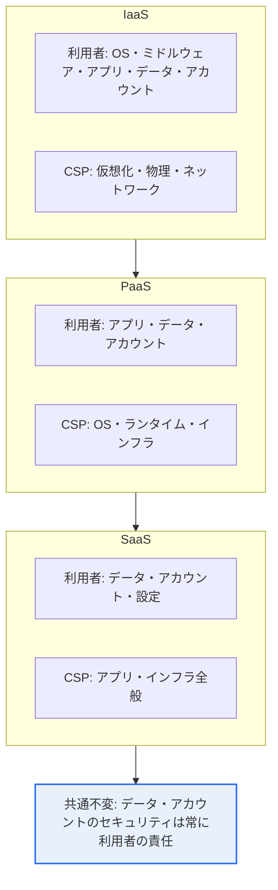
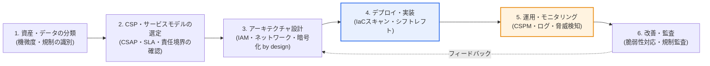

# クラウドサービス導入時のセキュリティ考慮要素

## 1. 概要

### A. 定義
> クラウド導入時のセキュリティ考慮要素とは、企業がクラウドサービスを採用・運用する際に、**データ・アクセス・規制・運用の全般にわたって検討・確保すべきセキュリティ統制項目の集合**をいう。オンプレミスとは根本的に異なるクラウド特有のリスク(責任分担、インターネットへの露出、マルチテナンシー、動的な拡張)に対応するためのものである。

クラウドセキュリティが難しい根本的な理由は、「**統制権の一部がクラウド事業者(CSP)へ移る**」という責任共有モデル(Shared Responsibility Model)にある。オンプレミスでは、企業が物理サーバからデータまですべての層を直接統制していたが、クラウドでは物理インフラ・ハイパーバイザはCSPが、データ・アカウント・アクセス・設定は利用者が責任を負う。問題は、この責任の境界を誤解したときに発生する。「クラウドだからCSPがセキュリティを面倒見てくれるだろう」と油断すると、肝心の利用者の責任であるアクセス権限の管理やストレージの設定をおろそかにし、事故が起きる。

実際、クラウドにおける漏洩事故の大半は、CSPのインフラへのハッキングではなく、利用者側の**設定ミス(公開状態で開かれたストレージバケット)やアカウント・キーの窃取**に起因する。Gartnerが以前から「2025年までにクラウドセキュリティ事故の99%は顧客の責任によるものになる」と警告してきたのも、このためである。したがって、クラウドセキュリティの出発点は華々しい新技術ではなく、「**自分が何に責任を負うのか**」を正確に知ることであり、そのうえでデータ・アクセス・設定を体系的に統制することが要諦である。

### B. 必要性と登場背景
クラウドは拡張性・俊敏性・コスト(CapEx→OpExへの転換)の利点をもたらすが、インターネットに常時露出し、多数のテナントが物理リソースを共有し、IaC(Infrastructure as Code)によってリソースが瞬時に大量生成されるという特性上、オンプレミスにはなかった**新たな攻撃対象領域(attack surface)** を生み出す。特に、開発・デプロイが速くなった分、セキュリティレビューが追いつかない「セキュリティ負債」が蓄積しやすい。そのため、導入前の段階からセキュリティ要素を体系的に検討し、アーキテクチャに内在化(security by design)してはじめて、クラウドの利点を安全に享受できる。これは単なる技術導入ではなく、ガバナンス・プロセス・人材を包括する全社的な課題である。

## 2. 責任共有モデル — 統制境界の移動

責任共有モデルはクラウドセキュリティの骨格である。核心は、サービスモデル(IaaS・PaaS・SaaS)に応じてCSPと利用者の責任の境界が移動するという点であり、どのモデルであっても**データとアカウント(アクセス権限)のセキュリティは常に利用者の責任**として残るということである。以下の構造図はこの境界の移動を示している。

IaaSでは利用者がOS・ミドルウェア・ランタイムまで直接責任を負うため、パッチ適用・ハードニングの負担が大きい。逆にSaaSではCSPがアプリまで運用するため、利用者はデータ分類・アクセス権限・共有設定に集中すればよい。この違いを認識していないと、たとえばIaaS上に載せたデータベースのOSパッチをCSPが適用してくれるものと誤解して放置する事故が起きる。したがって、導入しようとするサービスモデルごとに「自分の責任リスト」を文書化することが第一歩である。

## 3. 主なセキュリティ考慮要素 — データからサプライチェーンまで

クラウド導入時には、データから運用まで複数の要素を階層的に検討しなければならない。以下の表は全体の要素を俯瞰するためのものであり、各要素の「なぜ」と実務上の含意は、表の後に文章で説明する。

| 要素 | 中核となる考慮事項 |
|---|---|
| **データセキュリティ** | 保存・転送の暗号化、鍵管理(KMS/HSM)、データの所在・主権、バックアップ・廃棄 |
| **アクセス制御(IAM)** | 最小権限、MFA、ロールベース(RBAC)、キー・シークレット管理、過剰権限の点検(CIEM) |
| **設定セキュリティ** | 誤った構成の防止、継続的点検(CSPM)、IaCスキャン |
| **ネットワーク** | ネットワーク分離・セキュリティグループ・ファイアウォール、ゼロトラスト、プライベート接続 |
| **可視性・モニタリング** | ログ・監査(CloudTrailなど)、脅威検知、SIEM連携 |
| **規制・認証** | CSAP・ISMS-P、個人情報保護法・GDPR、業界別の規制 |
| **継続性** | 可用性・マルチAZ/リージョン、DR、Exit(終了・移行)戦略 |
| **サプライチェーン** | コンテナ・イメージの脆弱性、IaC・SBOM、オープンソースの検証 |

**第一に、データセキュリティ**はすべての統制の最終的な保護対象である。保存データ(at-rest)と転送データ(in-transit)の両方を暗号化するが、真の鍵となるのは**鍵管理**である。CSP管理の鍵(SSE)は便利であるが、規制・主権の要求が強い場合は顧客管理の鍵(BYOK/CMK)やHSMを使わなければならない。また、データが物理的にどの国で保存・処理されるか(データ主権)を確認しなければならず、たとえば韓国国内の個人情報を海外リージョンに置くと法的な問題が生じうる。バックアップの完全性と安全な廃棄(暗号鍵の破棄によるcrypto-shreddingを含む)まで、データのライフサイクル全体を設計しなければならない。

**第二に、アクセス制御(IAM)** はクラウド事故の最前線である。クラウドは管理コンソール・APIがインターネットに開かれているため、アカウントが1つ窃取されるとインフラ全体が露出する。そのため、**最小権限の原則**、**すべての管理者アカウントへのMFAの強制**、**長期アクセスキーの回避(短期トークン・ロール委任の使用)** が必須である。さらに、時間の経過とともに蓄積する過剰権限を自動的に検知・回収する**CIEM(クラウドインフラストラクチャ権限管理)** が近年注目されている。実際、多くの漏洩事故が、放置されたアクセスキーや過度に広いIAMポリシーに起因している。

**第三に、設定セキュリティ**はクラウド特有の最大のリスク源である。公開状態に誤設定されたストレージバケット、開いたままのセキュリティグループ、無効化されたロギングといった**誤構成(misconfiguration)** が、実際の事故の多くを占める。これを人が一つひとつ点検するのは不可能であるため、**CSPM(Cloud Security Posture Management)** で設定を継続的にスキャンし、さらにデプロイ前の**IaC(Terraformなど)のコード段階で誤構成を捕捉するシフトレフト**方式が定着しつつある。「作ってから直す」のではなく「作る前に防ぐ」への転換が核心である。

**第四に、ネットワーク・可視性・規制・継続性・サプライチェーン**も並行して対応しなければならない。ネットワークはセキュリティグループ・プライベート接続で露出を減らし、内部も信頼しない**ゼロトラスト**でアクセスを統制する。可視性の面では、API呼び出しログ・監査記録を残して事故時に追跡できるようにし、これをSIEMと連携して異常行動を検知する。規制の面では、公共クラウドであれば**CSAP(クラウドセキュリティ認証)**、民間であっても**ISMS-P・個人情報保護法・GDPR**などを遵守しなければならず、これは導入前のCSP選定基準に含まれる。継続性の観点では、マルチアベイラビリティゾーン(AZ)・リージョンとDR設計、そして特定のCSPに縛られないようデータ・ワークロードを回収・移行できる**Exit(終了・移行)戦略**をあらかじめ用意しなければならない。最後に、コンテナイメージ・オープンソース・IaCの脆弱性を**SBOM(ソフトウェア部品表)** で透明化する**サプライチェーンセキュリティ**が、近年必須の要素として浮上している。

### A. 導入段階ごとのセキュリティ内在化の手順
上記の要素は、導入プロセスの各段階に配置されてはじめて実効性を持つ。セキュリティを事後点検ではなく導入のライフサイクルに内在化するフローは次のとおりである。

この手順で最もよくある失敗は、1~3段階(設計)を飛ばしていきなりデプロイへ進むことである。データの機微度を分類せずにクラウドへ載せると、どこにどのような統制をかけるべきか判断できず、責任の境界を確定しなければ統制の空白が生じる。したがって、セキュリティはデプロイ後に付け足すものではなく、資産分類・CSP選定の段階から設計に反映されなければならず、運用段階のCSPM・モニタリングの結果が再び設計へとフィードバックされる循環構造(PDCA)を備えなければならない。実際、誤構成による事故の多くは、デプロイの自動化(IaC)には投資しながら、そのコードに対するセキュリティ検証(4段階)を省略した組織で発生している。

## 4. 事例と比較 — オンプレミスと比べて何が変わるのか

オンプレミスとクラウドのセキュリティの違いは、「境界」の性質から生じる。以下の比較は単なる項目の列挙ではなく、なぜアプローチを変えなければならないのかを示すものである。

| 区分 | オンプレミス | クラウド |
|---|---|---|
| 統制範囲 | 全層を直接統制 | 責任共有(層ごとの分担) |
| 境界モデル | 物理的境界・境界型ファイアウォール | 境界の消滅→ ゼロトラスト・ID中心 |
| 主なリスク | 物理的侵入・内部ネットワーク | 誤構成・アカウント窃取・公開状態での露出 |
| 変化の速度 | 遅い(手動プロビジョニング) | 速い(IaC・自動拡張) |
| セキュリティ方式 | 事後点検が中心 | 継続的点検・シフトレフト |

オンプレミスでは、ファイアウォールで囲まれた内部ネットワークを「信頼ゾーン」とする境界型セキュリティが通用した。しかしクラウドでは、リソースがインターネットに露出し、ID・APIでアクセスするため、境界は事実上消滅する。そのため、「場所ではなくIDを信頼の基準とする」ゼロトラストへとパラダイムが移行する。

具体的な事例として、2019年に大手金融企業で、誤って設定されたクラウドのファイアウォール(WAF)と過剰権限のIAMロールが組み合わさり、1億件以上の顧客情報が漏洩した事件は、インフラそのものが破られたのではなく、**利用者側の誤構成・権限管理の失敗**が原因であった。この事例は、先に強調した「事故の大半は顧客の責任」を象徴的に示している。別の事例として、韓国の公共機関が民間クラウドを導入する際にはCSAP認証を取得したCSPしか利用できないため、導入初期から規制遵守がCSPの選択を左右する。このように、クラウドセキュリティは技術だけでなく規制・ガバナンスと絡み合っている。

## 5. 深掘り — CNAPP・ゼロトラストへの統合と最新動向

初期のクラウドセキュリティは、CSPM(設定)・CWPP(ワークロード)・CIEM(権限)・コンテナセキュリティなどがそれぞれ別のツールとして存在していたため、アラートが断片化し、優先順位の判断が困難であった。近年の市場は、これらを1つに束ねる**CNAPP(Cloud-Native Application Protection Platform)** へと収斂しつつある。CNAPPは、コード(IaC)からランタイムまでアプリケーションのライフサイクル全般のリスクを統合的に可視化し、複数のシグナルを相互に関連づけ(context)て「実際に悪用可能なリスク」を優先順位付けする。市場調査機関は、今後数年のうちに多くの企業が統合型CNAPPを導入しなければ、クラウドの攻撃対象領域に対する広範な可視性を確保することは難しくなると予測している(正確な数値・年度はレポートごとに異なるため一般化する)。

もう1つの軸は、**シフトレフト(Shift-Left)** と**ゼロトラスト**の結合である。シフトレフトはセキュリティを運用段階ではなく開発初期(コード・CI/CD)へ前倒しし、誤構成・脆弱なイメージが本番に流入する前に遮断する。ゼロトラストは内部・外部を問わずすべてのアクセスを検証し(never trust, always verify)、アカウントの窃取が発生しても横方向の移動(lateral movement)を最小化する。両アプローチはそれぞれ「流入の遮断」と「侵害拡散の抑制」を担い、CNAPPがこれらを統合的に運用するプラットフォームの役割を果たす。

また、規制面でも変化は速い。韓国では、公共部門における民間クラウドの利用を拡大するにあたり、CSAPを「上・中・下」の等級に細分化し、システムの重要度に応じて差別的に適用しようとする方向性が議論・定着しつつあり、国際的にはサプライチェーンの透明性への要求が強まり、SBOMの提出が調達要件として広がる傾向にある(詳細な等級基準・施行時期は政策によって異なりうるため一般化する)。これは、クラウドセキュリティが技術的統制を超えて**規制対応・調達要件**に直結することを意味するため、導入組織は技術チームだけでなくコンプライアンス・法務と協働し、規制の変化を継続的に追跡しなければならない。

技術士の観点からの答案戦略としては、クラウドセキュリティの要素を単に列挙するにとどまらず、**① 責任共有モデル(前提) → ② データ・IAM・設定などの中核統制(本論) → ③ CNAPP・ゼロトラスト・シフトレフトへの統合(発展方向)** という3段の流れで構造化することが高得点に有利である。特に、「事故の大半は誤構成・アカウント管理に起因する」という実証的な根拠を示せば、論旨の説得力が増す。

## 6. 考慮事項および示唆

1. **責任共有モデルの理解がセキュリティの出発点**である。選択したサービスモデル(IaaS/PaaS/SaaS)において自らが責任を負う領域(常にデータ・アカウントを含む)を明確に文書化し、それに見合った統制を配置しなければならない。境界の誤解は、そのまま統制の空白につながる。
2. **設定ミス・アカウント管理が最大のリスク**である。公開されたストレージ、過剰な権限、漏洩したアクセスキーが実際の事故の大半を占めるため、CSPM(設定点検)・IAM/CIEM(権限管理)・MFAを最優先で強化し、デプロイ前のIaC段階で誤構成を遮断しなければならない。
3. **規制・データ主権を導入初期から反映**する。公共機関はCSAP、民間はISMS-P・個人情報保護法・GDPRなど適用される規制をCSP選定基準に含め、データの物理的な保存場所と国外移転の要件を事前に検討して法的リスクを取り除く。
4. **継続性とExit戦略でロックインに備える**。マルチAZ・リージョン・DRで可用性を確保し、特定のCSPにロックイン(lock-in)されないよう、データ・ワークロードの移行可能性と契約上の回収条件をあらかじめ確保して、交渉力と回復力を維持する。
5. **CNAPP・ゼロトラストによる統合管理の方向へ発展**させる。断片化した個別ツールの代わりに、ワークロード・設定・権限・サプライチェーンを統合的に点検するCNAPPを導入し、シフトレフトで流入を防ぎ、ゼロトラストで拡散を抑制する多層防御を目指すべきである。

## 参考資料
- CNAPPの概念(Wiz Academy): https://www.wiz.io/academy/cloud-security/what-is-a-cloud-native-application-protection-platform-cnapp
- 2025年のCSPMツール概要(SentinelOne): https://www.sentinelone.com/cybersecurity-101/cloud-security/cspm-tools/
- 韓国のクラウドセキュリティ認証(CSAP)制度の案内(KISA): https://isms.kisa.or.kr/main/csap/intro/

---

> **一言まとめ**: クラウド導入時には、*責任共有モデルを前提として、データ暗号化・鍵管理、IAM/CIEM、設定セキュリティ(CSPM)、ネットワーク・可視性、規制(CSAP)・データ主権、継続性・Exit、サプライチェーン(SBOM)* を階層的に検討しなければならず、事故の大半が誤構成・アカウント管理に起因するため、CSPM・IAM・シフトレフトとCNAPP・ゼロトラストの統合によって対応する。
