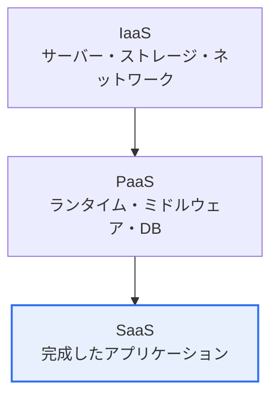
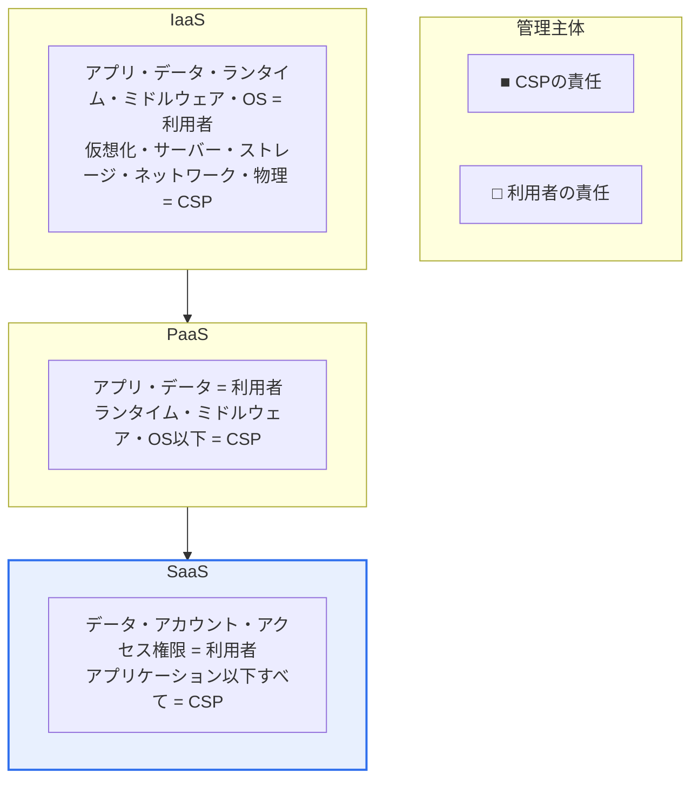

# クラウドコンピューティングのService ModelとDeployment Model

## 1. 概要

### A. 定義

> **サービスモデル(Service Model)** はクラウドがコンピューティング資源をどの水準まで抽象化して提供するか(IaaS・PaaS・SaaS)を、**デプロイメントモデル(Deployment Model)** はクラウドインフラを誰が所有・運用し、誰に提供するか(パブリック・プライベート・ハイブリッド・コミュニティ)を区分する二つの軸である。米国国立標準技術研究所の **NIST SP 800-145** によるクラウド定義において、5つの必須特性とともにクラウドを規定する骨格を成す。

二つのモデルは異なる問いに答える。サービスモデルは「**何を借り、何を自分で管理するか**」という抽象化・責任の問題を、デプロイメントモデルは「**それをどこに置き、どれだけの統制権を持つか**」という所有・統制の問題を決定する。したがって実際のクラウド導入は、この二つの軸を掛け合わせて組み合わせる(例:パブリック×SaaS、プライベート×IaaS)意思決定であり、どの組み合わせを選ぶかがコスト・セキュリティ・俊敏性のバランスを左右する。

### B. 登場背景と必要性

クラウドが登場する以前、企業はサービスを稼働させるためにサーバーを直接購入し(資本支出・CAPEX)、数か月にわたる調達・設置を耐え、最大負荷に合わせて資源を過剰に確保(Over-provisioning)しなければならなかった。この方式は初期費用が大きく、需要変動への対応が遅く、遊休資源が浪費されるという構造的限界を抱えていた。クラウドはこれを **オンデマンド(On-demand)・従量課金(Pay-as-you-go)・弾力的拡張(Elasticity)** モデルへと転換し、資本支出を運用支出(OPEX)に変え、必要な分だけ即座に借りて使えるようにした。

このとき「どの水準まで借りるか(サービスモデル)」と「どこに置くか(デプロイメントモデル)」を標準的な言葉で整理する必要が生じ、NISTがこれを定義したことで今日通用している分類体系が確立された。この二つのモデルを理解する鍵は **責任共有モデル(Shared Responsibility Model)** である。クラウドでは事業者(CSP)と利用者が管理・セキュリティの責任を分担するが、どのサービスモデルを選ぶかによってその責任境界線が移動する。すなわちモデルの選択とは、「自分が何を管理し、何に責任を負うか」を定める行為にほかならない。

## 2. Service Model (IaaS・PaaS・SaaS)

三つのモデルは「ピザの食べ方」に例えると直感的に理解できる。この比喩が有効なのは、三つのモデルの本質的な違いが「**どこまで自分が行い、どこから他者がやってくれるか**」という管理責任の分割線にあるからである。

**A. IaaS(Infrastructure as a Service).** 小麦粉とオーブン(仮想サーバー・ストレージ・ネットワーク)を借りて、生地作りから自分で行う方式である。自由度は最も高いが、OS・ミドルウェア・ランタイム・アプリケーションをすべて利用者がインストール・パッチ適用・運用する。仮想マシンを自ら立ち上げてOSをインストールするAWS EC2、Google Compute Engineが代表例である。レガシーアプリケーションをそのままクラウドへ移す「リフト&シフト(Lift & Shift)」移行において、最初の入口として多く使われる。

**B. PaaS(Platform as a Service).** 半調理済みの生地(開発・実行プラットフォーム)を受け取り、トッピング(アプリのコード)だけを載せる方式である。開発者はOSパッチ・ミドルウェア構成・容量管理といったインフラの雑務から解放され、コードだけに集中できる。Google App Engine、Heroku、AWS Elastic Beanstalkなどがこれに該当し、近年はコンテナ・サーバーレス(FaaS、例:AWS Lambda)へと抽象化がさらに進み、「イベントが発生したときだけ関数が実行され、その分だけ課金される」形態へと進化した。

**C. SaaS(Software as a Service).** 完成したピザ(Gmail・Salesforce)を配達してもらう方式である。利用者はソフトウェアをインストール・運用せず、Webブラウザでアクセスしてデータ・設定だけを管理する。導入が最も速く管理負担も最小であるが、反面カスタマイズの自由度とセキュリティ統制権は最も制限される。今日企業が使う協業・CRM・人事ツールの相当数がSaaSである。

近年はこの三つの階層の間に **FaaS(Function as a Service、サーバーレス)** と **CaaS(Container as a Service)** が入り込み、スペクトラムがさらに細かくなった。FaaSはPaaSを極限まで抽象化したもので、サーバーを「常時起動しておく」のではなく、リクエストやイベントが発生した瞬間にだけ関数を実行し、実行時間分だけ課金する。アイドル時のコストがゼロに収束するため、断続的・イベント型のワークロードには非常に経済的であるが、実行遅延(Cold Start)とベンダーロックインが大きくなるという代償が伴う。このようにIaaS→SaaSの軸は離散的な3段階ではなく、「自分が管理する分」が徐々に減っていく連続的なスペクトラムとして理解するほうが実務に近い。

まとめると、**上に行くほど(IaaS→SaaS)利便性・抽象化・導入速度が高まり、管理負担と統制の自由度は低くなる。** この階層移動こそが、次節で見る責任共有モデルの境界移動である。

| モデル | 提供範囲 | 利用者の管理領域 | 代表例 |
|---|---|---|---|
| **IaaS** | 仮想インフラ(サーバー・ストレージ・ネットワーク) | OS・ミドルウェア・ランタイム・アプリ・データ | AWS EC2, GCE, Azure VM |
| **PaaS** | 開発・実行プラットフォーム(ランタイム・DB・ミドルウェア) | アプリ・データ | App Engine, Heroku, Beanstalk |
| **SaaS** | 完成アプリケーション | データ・設定・ユーザーアカウントのみ | Gmail, Salesforce, M365 |

## 3. 責任共有モデル — 二つのモデルをつなぐ核心

責任共有モデルはサービスモデルとデプロイメントモデルをつなぐ架け橋である。原則は「**クラウドそのもののセキュリティ(Security *of* the Cloud)はCSPが、クラウドの中でのセキュリティ(Security *in* the Cloud)は利用者が**」担うというものである。物理施設・ハードウェア・仮想化層はどのモデルでもCSPが責任を負うが、その上の層の責任境界線はサービスモデルに応じて上下に動く。

IaaSでは、OSパッチ、ファイアウォール・セキュリティグループの設定、ミドルウェアの脆弱性管理まで大部分が利用者の担当である。PaaSに上がるとOS・ランタイム管理がCSPへ移り、利用者はアプリケーションコードとデータのセキュリティに集中すればよい。SaaSではアプリケーションまでCSPが責任を負うため、利用者には **データ・アカウント・アクセス権限の管理** だけが残る。しかし、まさにこの「残った分」が事故の主要原因であるという点が重要である。実際のクラウド侵害の大多数はCSPのインフラが破られたためではなく、利用者が責任を負う領域 — 誤ったS3バケットの公開設定、過剰なIAM権限、アカウント乗っ取り — で発生している。どのモデルを使うにせよ、「自分が責任を負う境界」を正確に認識していなければセキュリティの空白が生じる。

| 階層 | IaaS | PaaS | SaaS |
|---|---|---|---|
| データ・アカウント・アクセス権限 | 利用者 | 利用者 | 利用者 |
| アプリケーション | 利用者 | 利用者 | CSP |
| ランタイム・ミドルウェア・OS | 利用者 | CSP | CSP |
| 仮想化・サーバー・ストレージ・ネットワーク・物理 | CSP | CSP | CSP |

## 4. Deployment Model (デプロイメントモデル)

デプロイメントモデルは **セキュリティ・統制とコスト・拡張性の間のトレードオフ** によって決定される。このトレードオフを理解せずに無条件で「パブリックが安い」あるいは「プライベートが安全だ」と断定すると、実際のワークロードに合わない選択をしやすい。

**A. パブリッククラウド.** CSPが不特定多数に資源を共有提供する。規模の経済により安価で、事実上無限に拡張でき、初期投資なしに即座に開始できる。ただし資源を他のテナントと共有(マルチテナンシー)するため、物理的隔離レベルの統制や特殊な規制への対応には制約が伴う。変動の大きいWebサービス、スタートアップ、開発・テスト環境に適している。

**B. プライベートクラウド.** 単一組織専用に構築・運用する。資源を独占するためセキュリティ・統制・規制遵守が強く、性能予測も容易であるが、インフラを自ら整備・運用しなければならないためコストが高く、弾力性は相対的に低い。金融のコアシステム、国防・医療のようにデータ主権・規制が厳格な領域で選択される。

**C. ハイブリッドクラウド.** パブリックとプライベートを組み合わせ、これをオーケストレーションで連携させる。現実の企業の大多数が採用する主流の形態であり、機微データ・中核システムはプライベートに置き、変動の大きいワークロード・対外サービスはパブリックに置いて、それぞれの長所を取り入れる。平常時はプライベートで運用し、トラフィック急増時にパブリックへ振り分ける **クラウドバースティング(Cloud Bursting)** が代表的な活用パターンである。

**D. コミュニティクラウド.** 金融・公共のように規制・セキュリティ要件を共有する複数の組織が共同で構築・使用する。韓国の公共機関専用クラウド(例:行政・公共用ゾーン)や金融業界の共同インフラがこの範疇に近い。共同負担でコストを下げつつ、共通の規制をともに満たせるという長所がある。

| モデル | 所有・提供形態 | 長所 | 限界 | 適合事例 |
|---|---|---|---|---|
| **パブリック** | CSPが不特定多数に提供 | 低コスト・無限拡張・即時性 | 統制・隔離に制限 | スタートアップ、対外Webサービス |
| **プライベート** | 単一組織専用 | セキュリティ・統制・規制遵守に強い | 高コスト・低い弾力性 | 金融コア、国防・医療 |
| **ハイブリッド** | パブリック+プライベートの結合 | 柔軟性、機微データの隔離 | 連携・運用の複雑性 | 大企業の主流 |
| **コミュニティ** | 共通の関心を持つ組織で共有 | 規制・標準・コストの共有 | 参加組織間の調整が必要 | 金融・公共の共同インフラ |

三つのデプロイメントモデルのトレードオフを具体的な数値で感覚的に捉えると理解しやすい。例えば、あるEコマース企業が普段は毎秒数百件の注文を処理しているが、大規模セールの際には瞬間的に数十倍のトラフィックを受けるとしよう。プライベートのみを使うならピークに合わせてサーバーを数十台あらかじめ確保しなければならず、セール終了後はその資源の大半が遊休状態となり浪費される。パブリックのみを使うなら、決済・個人情報のような機微データまで共有インフラに載せなければならない負担が生じる。ハイブリッドはこのジレンマを解く。決済・会員情報のコアはプライベートに置いて統制し、商品閲覧・プロモーションのWebフロントはパブリックに置いておき、セール時だけオートスケーリングで拡張(クラウドバースティング)して終了後に資源を回収する。結果として「機微データの統制」と「弾力的なコスト効率」を同時に得られる。

このトレードオフが実務で重要なのは、デプロイメントモデルの選択が単なる技術的嗜好ではなく、**総所有コスト(TCO)・規制遵守・事業の俊敏性** を同時に左右する経営上の意思決定だからである。初期構築費(CAPEX)を受け入れて統制を得るのか、運用費(OPEX)に転換して俊敏性を得るのかという選択は、組織の財務構造と規制環境によって答えが異なる。

## 5. 深掘り — マルチクラウド・クラウドネイティブへの進化と韓国の動向

デプロイメントモデルは近年「ハイブリッド」を超えて **マルチクラウド(Multi-cloud)** へと拡張している。マルチクラウドは二つ以上のパブリックCSP(例:AWS+Azure+GCP)を同時に使う戦略であり、特定事業者への依存(Vendor Lock-in)を緩和し、各CSPの強みとなるサービスを選んで使い、リージョン障害時の可用性を高める目的で採用される。ただし異質なプラットフォームを統合管理しなければならないため、ガバナンス・コスト管理(FinOps)・セキュリティポリシーの一貫性という新たな難題が生じる。

サービスモデルの側面では、**コンテナ・Kubernetes・サーバーレス** を軸としたクラウドネイティブ(Cloud Native)がIaaSとPaaSの境界を曖昧にしている。企業はコンテナを通じてIaaSの移植性とPaaSの生産性を同時に獲得し、オンプレミス・パブリックのどこでも同一にデプロイするハイブリッド運用を実現する。さらに近年はAIワークロードの急増に伴いGPU資源を従量課金で提供する形態が広がり、規制対応のためにデータを特定の国・リージョン内に留める **ソブリンクラウド(Sovereign Cloud)** への要求も高まっている。

一方、デプロイメントモデルの境界も曖昧になりつつある。AWS Outposts・Azure Stack・Google Anthosのように、パブリックCSPの管理体系を顧客のデータセンター内に持ち込む **分散クラウド(Distributed Cloud)** が登場し、「プライベートの統制+パブリックの運用利便性」を一か所で得る形態が広がった。これはデプロイメントモデルが「どこに置くか」という二分法を超え、「どこから管理するか」という軸へと多様化していることを示している。

韓国では公共部門のクラウド移行がこの議論の実戦の場である。政府は公共システムによる民間クラウド利用を拡大しつつ、セキュリティ検証体系である **CSAP(クラウドセキュリティ認証)** を上・中・下の等級制に改編し、システムの重要度に応じて異なるサービス・デプロイメントモデルを適用するよう誘導している。例えば、低い等級のシステムには論理的分離を認めてパブリック・SaaS活用の門戸を広げ、高い等級には物理的分離を求めて事実上専用(プライベート・コミュニティ)形態を要求するといった具合である。これは「サービス×デプロイメントモデルの組み合わせを規制要件に合わせて選択する」という原理が実際の政策として実装された事例である。

## 6. 考慮事項および示唆点 (技術士の観点)

1. **ワークロード特性に合ったサービス×デプロイメントモデルの組み合わせが核心である。** 唯一の正解はない。機微情報を扱うコアバンキングはプライベート+IaaSで統制権を維持し、協業ツールはパブリック+SaaSで利便性を取り、対外Webサービスはパブリック+PaaSで俊敏性を得るというように、各システムの規制・性能・変動性を診断して組み合わせを設計しなければならない。

2. **責任共有モデルの理解がクラウドセキュリティの出発点である。** クラウド事故の大部分(設定ミス・アカウント乗っ取り・過剰権限)はCSPではなく利用者の責任領域で発生する。選択したサービスモデルにおいて「自分がどこまで責任を負うか」を明確に認識し、その境界に見合った統制(IAM・暗号化・設定点検)を備えることがセキュリティの基本である。

3. **ベンダーロックイン(Lock-in)の管理と移植性の確保が戦略的課題である。** 特定CSP固有のサービスに深く依存するほど移行コストは大きくなる。コンテナ・標準API・オープンソースに基づく設計やマルチクラウドアーキテクチャによってロックインを緩和し、交渉力・可用性を確保する戦略が必要である。

4. **コスト最適化(FinOps)が持続的運用の鍵である。** 従量課金は放置するとかえってコストが急増する。遊休資源の回収、リザーブド・スポットインスタンスの活用、オートスケーリング、使用量の可視化といったFinOpsの実践によって、「弾力性の利点」を実際のコスト削減へと結びつけなければならない。

5. **規制・データ主権の遵守がデプロイメントモデルの選択を左右する。** 個人情報保護法・CSAP・ネットワーク分離要件、データの国外移転制限などは、技術ではなく制度がデプロイメントモデルを決定する要因である。まず規制要件を診断し、それを満たす範囲内でサービスモデルを組み合わせる順序でアプローチするのが安全である。

## 参考資料

- NIST SP 800-145, *The NIST Definition of Cloud Computing* — https://csrc.nist.gov/pubs/sp/800/145/final
- KISA, *クラウドセキュリティ認証(CSAP)* — https://isms.kisa.or.kr
- AWS, *Shared Responsibility Model* — https://aws.amazon.com/compliance/shared-responsibility-model/

---

> **一言まとめ**: サービスモデル(IaaS・PaaS・SaaS)は資源の抽象化水準と管理・責任範囲を、デプロイメントモデル(パブリック・プライベート・ハイブリッド・コミュニティ)は所有・統制形態を規定しており(NIST SP 800-145)、両者をつなぐ責任共有モデルを理解したうえで、ワークロード特性・規制要件に合わせて二つの軸を組み合わせ・選択することがクラウド導入とセキュリティの核心である。
