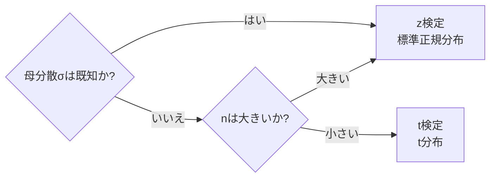

# 中心極限定理・t検定・z検定

## 1. 概要

### A. 定義
> 標本から得た統計量によって母集団の特性を推論する **統計的仮説検定** の基盤理論。**中心極限定理(CLT)** が標本平均の正規近似を保証し、その上で **z検定・t検定** が母平均に関する仮説を判定する。

### B. 登場背景および必要性
現実には母集団全体を調査することはできず、一部の **標本** だけを観測する。問題は、標本平均x̄が抽出するたびに変わる **確率変数** であるという点であり、この揺らぎ(標本誤差)を定量化できなければ、「標本で観測された差が真の母集団の差なのか、偶然なのか」を判断できない。中心極限定理は、まさにこの標本平均の揺らぎが **正規分布という既知の形** に従うことを保証することで、確率的に計算可能な推論への扉を開く。z・t検定はその正規近似を実際の仮説判定へと移す道具である。この三角構造が、A/Bテスト、品質管理、臨床試験、モデル性能比較など、ほぼすべてのデータに基づく意思決定の土台となる。

## 2. 中心極限定理(CLT)

### A. 定義と原理
> **母集団の分布形状に関係なく、標本サイズnが十分に大きければ標本平均x̄の分布が正規分布に近づく** という定理。

核心は「母集団が正規分布でなくても」成立する点にある。例えばサイコロの目は1〜6が均等な一様分布であるが、サイコロを30回振って得た **平均** を繰り返し求めると、それらの平均値の分布は釣鐘型の正規分布に収束する。複数の独立要因の和・平均は、個々の分布の偏りが相殺されながら正規形に集まるからである。このとき標本平均の期待値は母平均μと等しく、散らばり(標準誤差)は **σ/√n** に縮小する。√nが分母にあるため、誤差を半分にするには標本を4倍に増やさなければならないという点が、標本サイズ設計における核心的なトレードオフである。

| 項目 | 内容 | 意味 |
|---|---|---|
| **標本平均の分布** | 平均μ、標準誤差σ/√n | nが大きいほど誤差が減少 |
| **意義** | 母分布が未知でも正規分布に基づく推論が可能 | 検定・区間推定の土台 |
| **経験的条件** | 通常 n ≥ 30 | 歪度が大きい場合はより大きなnが必要 |

## 3. z検定 vs t検定

二つの検定の分かれ道は **母分散σ²が既知かどうか** である。現実には母平均μを知らずに母分散σ²だけを知っているケースはまれであるため、実務の大部分は標本標準偏差sでσを推定する状況となる。ここで問題が生じる。s自体が標本ごとに揺らぐ推定値であるため、この **不確実性が二重に加わる** のである。t分布は正規分布よりも裾を厚くすることで、この追加の不確実性を反映した分布である。標本が小さいほど(自由度が小さいほど)裾がより厚くなって棄却が保守的に行われ、nが大きくなるとsがσに近づき、t分布は正規分布に収束する。そのため大標本ではt検定とz検定の結果は事実上同じになる。

| 区分 | z検定 | t検定 |
|---|---|---|
| **使用分布** | 標準正規(z) | t分布(自由度n-1) |
| **母分散** | 既知(σを使用) | 未知(標本標準偏差sを使用) |
| **標本サイズ** | 大標本(n≥30)が前提 | 小標本(n<30)にも適用 |
| **分布の特徴** | 固定された釣鐘型 | 裾が厚い→n↑で正規に収束 |

**検定統計量** は「観測された差を標準誤差で割った値」であり、z = (x̄-μ₀)/(σ/√n)、t = (x̄-μ₀)/(s/√n) である。例えば標本平均が52、帰無仮説の平均μ₀=50、s=8、n=64であればt = (52-50)/(8/8) = 2.0となり、自由度63のt分布においてこの値の両側p値が有意水準(例:0.05)より小さければ「差がある」と判断する。

## 4. t検定の類型

t検定は比較の構造によって三つに分けられる。**1標本t検定** は、一つの集団の平均が特定の基準値と等しいかどうかを見る(例:新製品のバッテリー寿命が公表スペックの10時間と異なるか)。**独立2標本t検定** は、互いに無関係な二つの集団の平均を比較するもので、A/Bテストの標準的な道具である(例:A案・B案のコンバージョン率の差)。**対応のあるt検定** は、同一対象を処置の前後で測定し、その差の平均を検定するもので、個人差というノイズを除去するため検出力が高い(例:同じ患者の服薬前後の血圧)。

| 類型 | 用途 | 例 |
|---|---|---|
| **1標本t** | 一集団の平均 vs 基準値 | スペックに対する実測 |
| **独立2標本t** | 無関係な二集団の平均比較 | A/Bテスト |
| **対応のあるt** | 同一対象の前後比較 | 処置前後の効果 |

## 5. 考慮事項および示唆点
- **仮定の検証が先行**: t・z検定は観測値の **正規性・独立性・(二集団比較時の)等分散性** を前提とする。違反時にはWelchのt検定やMann-Whitney Uのようなノンパラメトリック検定に置き換えなければ、結果が歪む。
- **有意性と効果量の併用**: p値は「差が偶然か」を示すだけで、「差が実務的に大きいか」は示さない。nが非常に大きいと些細な差でも有意になるため、Cohen's dのような効果量と信頼区間を併せて報告すべきである。
- **実務での活用**: A/Bテストのコンバージョン率比較、製造工程の品質逸脱の検知、二つのMLモデルの性能の有意差検証などに直接用いられ、標本サイズ設計(検出力分析)と併せて扱ってこそ信頼できる。

---

> **一言まとめ**: CLTは *nが大きければ母分布に関係なく標本平均が正規分布(平均μ、標準誤差σ/√n)に近づく* ことを保証し、母分散が既知なら **z検定**、未知(小標本)なら **t検定(t分布)** で母平均の仮説を判定するが、正規性・独立性の仮定と効果量を併せて確認しなければならない。
