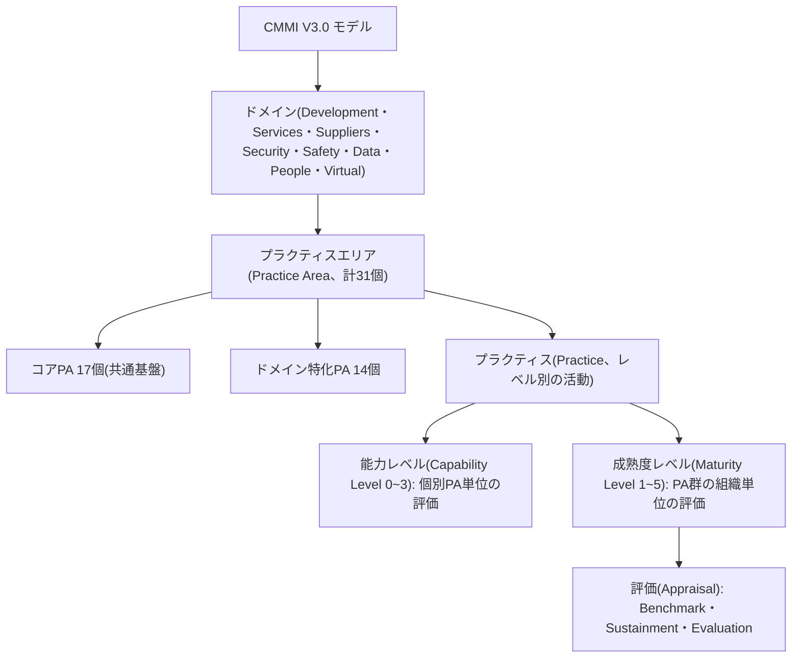
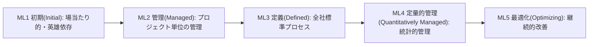
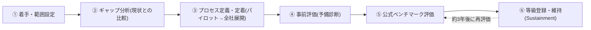

# CMMI(能力成熟度モデル統合、Capability Maturity Model Integration)

## 1. 概要

> **定義**: CMMI(Capability Maturity Model Integration)は、組織のプロセス能力と成熟度を段階的に診断・改善するための **成果重視のプロセス改善フレームワーク** であり、開発・サービス・サプライチェーンなどのドメイン別ベストプラクティス(Practice)を成熟度5段階と能力4段階の構造で体系化したモデルである。

CMMIが登場した背景には、1980年代の米国国防総省(DoD)におけるソフトウェア調達危機がある。大型兵器システムのソフトウェアが予算とスケジュールを繰り返し超過し、品質も担保されなかったため、DoDの支援を受けてカーネギーメロン大学のSEI(Software Engineering Institute)が供給業者のプロセス能力を客観的に評価する方法を研究し、その成果が1991年のSW-CMMである。その後、システムエンジニアリング(SE-CMM)、統合製品開発(IPD-CMM)、人材管理(P-CMM)など異なるモデルが乱立し、組織が複数のモデルを重複して適用しなければならない負担が大きくなったため、これを一つに統合(Integration)したのが2002年のCMMI 1.1である。

こうした統合の流れはその後も続き、CMMIは開発(CMMI-DEV)・サービス(CMMI-SVC)・調達(CMMI-ACQ)という三つの軸の別々のモデル(V1.3)から、V2.0を経て、V3.0ではこれを一つのドメイン体系に再統合する方向へと進化した。つまりCMMIの歴史そのものが「分散したベストプラクティスを一つの一貫したフレームワークへ収束させる」過程であり、これは組織が複数の認証を重複管理する非効率を減らしたいという実務的要求に応えた結果である。

CMMIが必要とされる根本的な理由は、**ソフトウェア・システムの品質はそれを作るプロセスの品質に従属する** という前提にある。優れた個人の能力に依存する組織は中核人材が離脱すると成果が急落するが、プロセスが定着した組織は人が入れ替わっても予測可能な品質とスケジュールを維持する。すなわちCMMIは、成果を「英雄(hero)」ではなく「組織の資産化されたプロセス」によって担保しようとするアプローチであり、発注者の立場からは事業遂行能力を事前に検証する客観的な物差しとなる。実際、国内外の公共SI・防衛・金融事業の入札資格や加点要件としてCMMIの等級が求められることが多く、技術士の観点からは組織成熟度と調達・品質経営を結びつける核心的な概念である。

2016年にSEIからCMMI Instituteが分離し、2023年4月に現在の所有機関である **ISACAがCMMI V3.0** を発表したことで、モデルは「文書化されたプロセスの遵守」から **ビジネス成果(Performance)の改善** へと重心を移した。V3.0は既存の開発・サービス・サプライチェーンに加え、セキュリティ(Security)・安全(Safety)・データ(Data)・人材(People)・仮想勤務(Virtual)のドメインを追加し、計8つのドメイン体系へと拡張された。

CMMIの主な特徴をまとめると次のとおりである。第一に、**成熟度に基づく段階的改善** を志向し、組織が対応可能な速度で能力を蓄積できるようにする。第二に、**方法論中立的** であり、ウォーターフォール・アジャイル・DevOpsのいずれの開発方式とも組み合わせられる。第三に、**ベストプラクティス(Practice)の集大成** として、数十年にわたり蓄積された産業経験を参照可能な形で提供する。第四に、**客観的評価とベンチマーキング** によって組織間・時点間の比較が可能である。この四つの特徴が、CMMIを単なるチェックリストではなく組織能力のロードマップたらしめている。

## 2. CMMIの全体構造と表現方式

CMMIは「何を(What)」を規定するが、「どのように(How)」は組織の裁量に委ねる参照モデルである。最上位にはドメイン(Domain)があり、各ドメインは複数の **プラクティスエリア(Practice Area, PA)** で構成され、PAは成熟度/能力レベルに応じて階層化されたプラクティス(Practice)を含む。プラクティスは組織が必ず遂行すべき活動の「意図(intent)」を記述し、それをどの方法論(Agile・Waterfallなど)で実装するかは組織が選択する。この柔軟性のおかげで、CMMIは特定の開発方法論に依存せず、アジャイルチームにも適用できる。

V3.0では、プラクティスエリアは複数のドメインが共通して使用する **コア(core)PA** と、特定のドメインでのみ使われる **ドメイン特化PA** に区分される。コアPAには要件開発・構成管理・検証・妥当性確認・リスク管理・測定など、ドメインを問わず共通して求められる活動が含まれ、ドメイン特化PAにはセキュリティ・安全・データ管理のように当該領域でのみ意味を持つ活動が含まれる。このモジュール式構成により、組織は必要なドメインだけを選択して採用でき、開発のみを行う組織とサービス運用まで行う組織が、それぞれ異なるPAの組み合わせでCMMIを適用することになる。

CMMIは歴史的に二つの **表現方式(Representation)** を提供してきた。第一は **連続型(Continuous)** で、組織が改善したい個別のPAを選び、その能力レベル(Capability Level, CL 0~3)を高める方式である。例えば構成管理が弱い組織は「構成管理」PAだけを集中的に引き上げることができ、改善の自由度が高い。第二は **段階型(Staged)** で、あらかじめ定義されたPA群を成熟度レベル(Maturity Level, ML 1~5)単位で順次達成する方式であり、組織全体を一つの等級で表現できるため対外的なコミュニケーションに有利である。実務で「当社はCMMIレベル3」と言う場合のその等級が、段階型の成熟度レベルである。

能力レベルと成熟度レベルの違いが生じる理由は **評価対象の範囲** にある。能力レベルは一つのPAがどれだけよく遂行・管理されているかを見るものであり、成熟度レベルは複数のPAが組織レベルでともに定着し、組織全体の予測可能性がどの程度かを見るものである。したがって特定のPAだけがCL3だからといって組織がML3になるわけではなく、MLは当該レベルが要求するすべてのPAが満たされてはじめて付与される。

この二元構造がもたらす実務的な含意は、組織が **状況に応じて改善ロードマップを設計** できるという点である。対外的な認証が急がれる組織は段階型でMLの目標を定め、必要なPA群を一括して整備するほうが効率的であるが、特定のプロセス(例:リスク管理、構成管理)が繰り返し事故を引き起こしている組織は、連続型でそのPAの能力レベルから引き上げるほうが投資対効果が大きい。すなわちCMMIは「唯一の正解」を強要せず、組織のペインポイント(pain point)と事業目標に応じて改善の順序を最適化するよう設計されたモデルである。

| 区分 | 能力レベル(Capability Level) | 成熟度レベル(Maturity Level) |
|------|------|------|
| 評価単位 | 個別プラクティスエリア(PA) | PA群(組織/プロジェクト) |
| レベル範囲 | 0~3 | 1~5 |
| 表現方式 | 連続型(Continuous) | 段階型(Staged) |
| 活用 | 弱点PAの選択的改善 | 組織等級の対外的表現 |
| 例 | 「要件管理 CL3達成」 | 「全社 ML3認証」 |

## 3. 成熟度5段階と段階別の特徴

成熟度レベルは、組織のプロセスが「予測不能な混沌」から「継続的に自己改善する状態」へと進化する梯子として理解できる。各段階は下位段階を前提とするため飛び越すことはできず、上位に行くほどプロセスの定量化・最適化の度合いが高まる。

**ML1 初期(Initial)** 段階の組織には、定義されたプロセスが事実上存在せず、成功は特定個人の能力と献身に左右される。スケジュールと予算を頻繁に超過し、類似プロジェクトであっても結果のばらつきが大きい。問題は、成果が再現されないという点である。あるチームが偶然成功しても、そのやり方が組織の資産として蓄積されないため、次のプロジェクトで同じ過ちを繰り返す。例えば毎回異なる方法で構成管理を行っているために、リリース直前にソースのバージョンが混在し、デプロイ障害が起きる状況が典型的である。ML1は特定のプラクティス充足を要求しない「基本状態」であり、改善の出発点にすぎず、目標とはなりえない。

**ML2 管理(Managed)** 段階では、要件管理・プロジェクト計画・プロジェクト監視・構成管理・測定分析・供給者管理・品質保証などの **プロジェクト単位の基本的な管理プラクティス** が定着する。核心は「規律(discipline)」である。計画を立て、計画に対する実績を追跡し、成果物の構成を統制する。ただしこの段階のプロセスはプロジェクトごとにばらばらでありうるため、AチームとBチームで仕事のやり方が異なる。例えば両チームとも構成管理を行っているが、ツールやブランチ戦略が異なるため、人員の再配置時に学習コストが発生する。

ML2が組織にもたらす即時的な価値は「可視性(visibility)」である。計画と実績を追跡し始めると、スケジュール遅延や範囲の増大が早期に表面化し、管理者が介入する機会を得る。ML1の組織では締め切り間際になってようやく問題が爆発するが、ML2の組織では進捗データを通じて異常の兆候を事前に捉える。ただし、この可視性がプロジェクトの境界に閉じ込められていることが限界であり、これを組織レベルに拡張することが次の段階であるML3の課題である。

**ML3 定義(Defined)** 段階では、組織レベルの **標準プロセス資産(OSSP)** が確立され、各プロジェクトはそれをテーラリング(tailoring)して使用する。プロジェクトごとのばらつきが減り、組織全体が共通の言語と成果物の様式を共有するため、人員の異動と知識の再利用が容易になる。要求工学・技術設計・検証・妥当性確認・リスク管理・意思決定分析など、**エンジニアリングおよび組織レベルのプラクティス** が強化される。韓国の大多数の公共SI事業で求められる実質的な基準線がML3である理由は、この段階から組織が予測可能で移植可能な品質を保証するとみなされるからである。

ML2とML3の決定的な違いは、プロセスの「所有主体」にある。ML2では各プロジェクトが自らのプロセスを定義するが、ML3では組織が標準を所有し、プロジェクトはそれをテーラリングして使用する。この違いにより、ML3の組織はプロジェクト終了後に得た教訓(lessons learned)と実測データを組織標準にフィードバックでき、改善が個人やチームに閉じ込められることなく組織資産として蓄積される。これが、ML3を「学習する組織」の出発点とみなす理由である。

**ML4 定量的管理(Quantitatively Managed)** 段階では、中核プロセスと成果を **統計的・定量的手法(SPCなど)** で管理する。例えば欠陥密度、レビュー効率、生産性といった指標に対して管理限界(control limit)を設定し、管理図(control chart)で特異な変動を早期に検知する。単に指標を「収集」するML2・3とは異なり、指標の **変動要因を統計的に分析して予測モデル** を構築するという点が決定的な違いである。例えば「レビュー時間を20%増やすとフィールド欠陥が統計的に有意に減少する」という定量的な因果関係を根拠に意思決定を行う。

ここで重要な概念が **共通原因(common cause)と特殊原因(special cause)の区別** である。ML4の組織は、プロセスに内在する自然な変動(共通原因)と異常な事象による変動(特殊原因)を統計的に分離し、前者にはプロセス改善で、後者には原因除去で対応する。この区別がなければ、正常な変動に過剰反応したり本当の問題を見逃したりする誤りを犯すため、ML4はデータリテラシーが組織に内在化してはじめて到達できる段階である。

**ML5 最適化(Optimizing)** 段階では、定量的な理解に基づいて **プロセスそのものを継続的に革新** する。根本原因分析(RCA)によって欠陥の原因を除去し、新技術・新手法を試行適用して効果が検証されれば組織標準に反映する。この段階の組織は問題が起きてから対応するのではなく、データに基づいてプロセスを先制的に進化させる。

このように成熟度段階は「統制(ML2)→標準化(ML3)→定量化(ML4)→最適化(ML5)」という論理的な進化経路に従う。各段階が下位段階を前提とする理由は明確である。標準プロセス(ML3)なしに統計的管理(ML4)を試みれば、プロジェクトごとに測定基準が異なりデータを比較できず、定量的ベースライン(ML4)なしに最適化(ML5)を試みれば、改善の効果を客観的に立証できない。そのためCMMIは段階の飛び越しを許容せず、この点こそが場当たり的な改善と区別されるCMMIの方法論的厳密性である。

## 4. 評価(Appraisal)方式と等級取得手順

CMMIの等級は自己宣言ではなく、**公認評価(Appraisal)** を通じて付与される。かつてV1.3ではSCAMPI(A/B/C)方式を用いており、V2.0以降は目的に応じて三つの評価類型に再編された。正式な等級認証は **ベンチマーク評価(Benchmark Appraisal)** によって行われ、これは認定リードアプレイザー(Certified Lead Appraiser)が実施し、結果が公開登録される。取得した等級には通常有効期間があり(V3.0のベンチマーク評価は約3年)、維持のためには **維持評価(Sustainment Appraisal)** を受けるか再評価を実施しなければならない。組織内部の準備状況の点検や部分的な診断には **評価(Evaluation Appraisal)** を活用する。

| 評価類型 | 目的 | 結果 |
|------|------|------|
| Benchmark | 公式等級(ML/CL)の認証 | 登録・公表、有効期間の付与 |
| Sustainment | 既存等級の維持・更新 | 等級の延長 |
| Evaluation | 内部診断・準備状況の確認 | 改善点の導出(非公式) |

実際の等級取得手順は、通常 **①着手・範囲設定 → ②ギャップ(Gap)分析 → ③プロセス定義・定着(パイロット・展開) → ④事前評価(予備診断) → ⑤公式ベンチマーク評価 → ⑥等級登録・維持** の流れに従う。最も資源を要する区間は③であり、プロセスを文書として作るだけでなく、実際のプロジェクトに適用して **証跡(objective evidence)** を蓄積しなければならないからである。アプレイザーは文書・インタビュー・データを三角検証するため、形式的な文書だけでは等級を得ることはできない。

**具体的事例(仮想シナリオで見る改善効果)**: 従業員200人規模の公共SI企業が、ML1の水準から3年をかけてML3を目標に改善を推進したとしよう。導入以前、この組織はプロジェクトの納期遵守率が60%程度であり、納品(delivery)後に発見されるフィールド欠陥がKLOCあたり多数発生し、手戻り(rework)コストが総開発費の30%に達していた。ML2の定着段階で要件変更管理と構成管理が根付くとリリースの混乱が減り、ML3で組織標準プロセスとピアレビュー(peer review)が定着すると、欠陥が上流(要件・設計)工程で早期に除去され始めた。このように上流での欠陥除去が下流の手戻りコストを大きく減らすことは、ソフトウェア工学のよく知られた原理(欠陥は発見が遅れるほど修正コストが指数関数的に増大する)であり、CMMI改善の経済的根拠を成す。ただし実際の数値は組織・事業の特性によって大きくばらつくため、答案では絶対値よりも **改善の因果メカニズム**(プロセスの規律 → 上流での欠陥除去 → 手戻りの減少 → 予測可能性の向上)を強調するのが望ましい。

## 5. 類似モデルとの比較 — ISO/IEC 15504(SPICE)、ISO 9001

CMMIとよく比較されるのが **ISO/IEC 15504(SPICE)** であり、現在はISO/IEC 330xx系列へと発展している。両モデルともプロセス能力をレベルで評価する点は同じであるが、違いが生じる根本原因は「設計思想」にある。CMMIは米国の防衛調達から出発し、**ベストプラクティスの集大成と等級認証(ベンチマーキング)** に強みがあるのに対し、SPICEは国際標準として **プロセス参照モデルと測定フレームワークの分離、プロセスごとの能力レベル評価** に焦点を当てる。実務的には、自動車分野のAutomotive SPICEのように特定の産業でSPICE系列が事実上の標準として求められる場合があり、組織は発注者の要求に応じてモデルを選択したり併用したりする。

**ISO 9001(品質マネジメントシステム)** との関係も重要である。ISO 9001は組織全般の品質経営を扱うのに対し、CMMIはソフトウェア・システム開発・サービスプロセスに特化しているため、両者は代替財ではなく補完財としてともに運用されることが多い。例えば全社の品質方針はISO 9001で、開発プロセスの成熟度はCMMIで管理する二元体系がよく見られる。

また、CMMIとSPICEの能力レベルの尺度が異なる点も実務で混乱を招く。CMMIの能力レベルは0~3であるのに対し、SPICE(ISO/IEC 33020)はプロセスごとの能力レベルを0~5に細分する。この違いは、両モデルが「能力」を捉える観点の違いに由来する。CMMIは能力レベルを成熟度の梯子を上るための踏み石とみなして比較的単純にとどめるのに対し、SPICEは個々のプロセスの予測性・最適化の度合いまで精密に測定しようとする。したがって自動車・航空のようにプロセスごとの精密な診断が求められる産業ではSPICE系列が、組織全体の成熟度を一つの等級でコミュニケーションしなければならない調達環境ではCMMIが好まれる傾向がある。

| 区分 | CMMI | ISO/IEC 15504(SPICE) | ISO 9001 |
|------|------|------|------|
| 性格 | 成熟度/能力の参照モデル | プロセス能力評価の国際標準 | 品質経営の国際標準 |
| 評価単位 | ML(1~5)/CL(0~3) | プロセスごとの能力レベル(0~5) | 適合/不適合 |
| 強み | 等級ベンチマーキング・ベストプラクティス | プロセスごとの詳細評価 | 全社的品質経営 |
| 適用例 | 防衛・公共SIの入札 | Automotive SPICEなど産業特化 | 全産業汎用 |

## 6. 深掘り — アジャイル・DevOps時代のCMMIと成果重視への転換

かつてCMMIは「重い文書主義」という批判を受け、アジャイルと対立するものと誤解されていた。しかしCMMIは方法論ではなく「何を達成すべきか」を規定する参照モデルであるため、アジャイルの実践によっても十分にその意図を満たすことができる。例えばスクラムのバックログ・バーンダウンチャートはプロジェクト計画・監視プラクティスの証跡となり、CI/CDパイプラインの自動化されたビルド・テストのログは構成管理・検証プラクティスの強力な客観的証拠となる。V3.0が成果(Performance)と柔軟性を明示的に強調したのは、こうした現代的な開発環境を包摂しようとする方向転換である。

実際、アジャイルとCMMIは相互補完的である。アジャイルは「いかに速く価値を届けるか」という実行戦術を提供するが、組織レベルの一貫性・予測性の保証には相対的に弱く、CMMIは組織成熟度の骨格を提供するが、具体的な実行方法は規定しない。したがってアジャイルで実行し、CMMIで組織能力を診断・改善するという組み合わせが、現実的に最も強力である。「アジャイルだからCMMIは不要だ」という主張は、二つの概念の階層を混同した誤解に近い。

さらに、CMMIの自動化された証跡収集は、AI・データ駆動の開発環境において新たな可能性を開く。構成管理の履歴、課題トラッカー、パイプラインログ、コードレビュー記録がすでにデジタルで残っているため、かつて審査準備に費やされていた膨大な手作業の文書化負担が減り、むしろリアルタイムデータでプロセス遵守状況を常時モニタリングできる。これはCMMI上位段階が要求する定量的管理と自然に噛み合い、プロセス改善を「定期的な審査イベント」から「常時の運用活動」へと転換させる触媒となる。

V3.0のもう一つの意義ある変化はドメインの拡張である。データ管理(Data)・人材管理(People)・仮想勤務(Virtual)のドメインが追加されたことで、リモート・分散チームの運営やデータ資産管理といった最新の課題を成熟度の観点から扱えるようになった。これはクラウド・データ中心・ハイブリッド勤務へと再編されたIT組織の現実を反映したものであり、技術士の答案では「CMMIがコード品質を超えて、組織のデータ・人材・協業の成熟度まで包含する方向へ進化している」という観点で記述すると、最新動向を効果的に示すことができる。ただし詳細なドメイン構成やプラクティスの数はモデル改訂によって変わりうるため、答案では具体的な数値よりも **成果重視・柔軟性・拡張という方向性** を強調するのが安全である。

## 7. 考慮事項および示唆点 (技術士の観点)

**第一に、等級取得が目的化する「認証の罠」を警戒しなければならない。** 入札加点やマーケティングのために等級だけを取得し、実際のプロセスが形骸化する場合、維持コストだけが残り成果の改善はない。CMMI導入の成否は等級の数字ではなく、欠陥率・納期遵守率・手戻りコストといった **ビジネス指標の実質的な改善** で判断すべきである。V3.0の成果重視への転換もこの問題意識と通じている。特に等級取得直後にプロセスが放置され、次の評価直前になって一夜漬けで証跡を復元する慣行は、CMMIをコスト要因へと転落させる代表的な失敗パターンであるため、常時運用体制へと転換しなければならない。

**第二に、組織の規模・性格に合ったテーラリング(tailoring)が不可欠である。** 小規模組織が大企業流の重いプロセスをそのまま適用すると、官僚主義が深まるだけである。トレードオフの観点から、統制強化によって得られる予測可能性と、それに伴う俊敏性・コスト負担を比較衡量し、必要なプラクティスを選別して適用すべきである。スタートアップや小規模チームであれば、連続型アプローチで痛みの大きい少数のPAから改善するほうが、無理に全社ML等級を追求するよりも現実的かつ効果的である。

**第三に、上位成熟度(ML4・5)は定量的データ基盤を前提とするため、測定体系(Measurement)への先行投資が必要である。** 信頼できる指標とデータパイプラインなしに統計的管理へ飛躍することはできない。この点で、CMMI上位段階はデータガバナンス・オブザーバビリティ・DevOps指標体系と自然に連携する。

**第四に、継続的改善のための経営陣の意志と文化が重要成功要因(CSF)である。** プロセス改善は短期的な成果ではなく数年にわたる組織変革であるため、経営陣のスポンサーシップと改善組織(EPG/SEPG)、インセンティブ設計がなければ定着しない。今後CMMIは、アジャイル・DevSecOps・AIベースの開発自動化と結びつき、証跡収集と成果測定を自動化する方向へ発展する見通しである。

**第五に、関連技術・制度との統合運用の観点が必要である。** CMMI上位段階の定量的管理は、DevOpsのDORA指標(デプロイ頻度・変更失敗率・MTTRなど)、オブザーバビリティデータ、データガバナンス体系と結びついたときに実効性を持つ。また韓国ではCMMI等級が公共・防衛事業の入札資格や技術評価の加点として活用されるため、組織は調達戦略とプロセス改善ロードマップを整合させ、投資効果を最大化すべきである。結局のところCMMIは独立した認証ではなく、組織の品質経営・データ・自動化体系全般と噛み合って運用されてはじめて、持続可能な成果改善を担保する。

総合すると、CMMIは組織のプロセス能力を診断する「鏡」であると同時に、改善の「地図」でもある。技術士の答案では、成熟度5段階の進化の論理と能力・成熟度レベルの区別を正確に記述しつつ、単なる暗記的な羅列を超えて、**なぜ段階を飛び越せないのか、なぜ文書ではなく成果が重要なのか、アジャイル・DevOps・データガバナンスとどのように連携するのか** を因果的に解きほぐすことが高得点の鍵である。関連テーマとしてはソフトウェア品質コスト、ISO/IEC 15504(SPICE)、ITガバナンス、DataOps・DevOpsなどがあり、併せて連携学習すれば答案の深みを増すことができる。

## 参考資料

- ISACA, "ISACA Updates CMMI Model with Three New Domains" (2023): https://www.isaca.org/about-us/newsroom/press-releases/2023/isaca-updates-cmmi-model-with-three-new-domains-that-help-organizations-improve-quality
- ISACA Now Blog, "2023 CMMI Updates Take Performance Improvements to the Next Level": https://www.isaca.org/resources/news-and-trends/isaca-now-blog/2023/cmmi-updates-take-performance-improvements-to-the-next-level
- Wikipedia, "Capability Maturity Model Integration": https://en.wikipedia.org/wiki/Capability_Maturity_Model_Integration

---

> **一言まとめ**: CMMIは組織のプロセス能力を成熟度5段階・能力4段階で診断・改善する成果重視のフレームワークであり、品質を個人ではなく組織の資産化されたプロセスによって担保し、V3.0(2023、ISACA)ではセキュリティ・データ・人材・仮想勤務のドメインまで拡張された。
