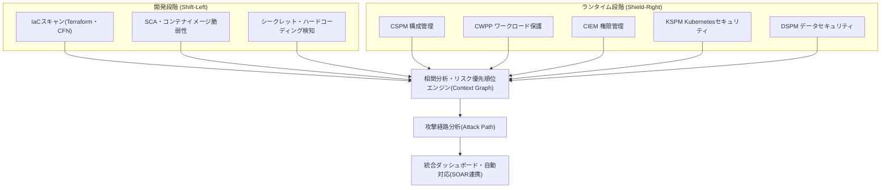
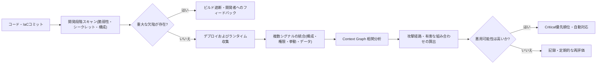

# CNAPP(クラウドネイティブアプリケーション保護プラットフォーム)

## 1. 概要

> **定義**: CNAPP(Cloud-Native Application Protection Platform)は、コード作成からビルド・デプロイ・ランタイムに至るクラウドネイティブアプリケーションの全ライフサイクルにわたり、構成(設定)点検・ワークロード保護・権限管理・脆弱性点検など分散していたセキュリティ機能を一つのプラットフォームに統合し、リスクを相関分析(correlation)して優先順位を付けて対応する、クラウドセキュリティの統合プラットフォームである。

CNAPPは2021年にガートナー(Gartner)が提示した概念であり、その後クラウドセキュリティ市場を再編する統合カテゴリとして急速に定着した。その登場背景を理解するには、まずクラウドセキュリティツールが歩んできた断片化の歴史を押さえる必要がある。初期のクラウドセキュリティでは、誤設定(misconfiguration)を見つけ出すCSPM、コンテナ・VMのランタイムを守るCWPP、過剰な権限を管理するCIEMのように、問題領域ごとに独立した製品が乱立した。企業は自然と複数ベンダーのポイントソリューション(point solution)をそれぞれ導入し、その結果コンソールが5〜6個に増え、アラート(alert)がツールごとに別々に大量発生する「アラート疲れ(alert fatigue)」と、どのリスクが実際に深刻なのか判断できない「文脈の断絶」という二つの慢性的な問題が生じた。

問題の核心は、**リスクはつながっているのにツールは分離している** という点にある。例えば「インターネットに露出したコンテナ」という事実一つだけでは深刻度はわからない。しかしそのコンテナが①リモートコード実行(RCE)の脆弱性を持つライブラリを含み、②管理者(admin)権限のIAMロールが付与されており、③顧客の個人情報が格納されたストレージにアクセス可能であるならば、三つの事実が一つの攻撃経路(attack path)としてつながった瞬間、これは即座に対処すべき致命的なリスクとなる。個々のツールはこの三つをそれぞれ別個の中程度のアラートとして報告するだけであるが、CNAPPはこれらを一つのグラフに結びつけ、「実際に悪用可能な(exploitable)唯一の致命的経路」として凝縮して提示する。すなわちCNAPPの本質的価値は新たな検知機能ではなく、**統合と相関分析によるリスクの文脈化(contextualization)** にある。

また、クラウドネイティブ環境そのものの特性が統合を不可避にした。コンテナの平均寿命が数分から数時間にすぎないほどインフラが揮発的(ephemeral)であり、IaC(Infrastructure as Code)によってインフラがコードのように瞬時に生成・消滅し、MSAによって攻撃対象領域が数百のサービスに分散する。このような環境では、デプロイ後(事後)にのみ点検する方式では速度に追いつけないため、開発パイプラインの左端(コード・IaC)からセキュリティを組み込む **Shift-Left** と、ランタイムをリアルタイムで守る **Shield-Right** を一つのプラットフォームで同時に実行する必要性が高まり、これがCNAPP統合の根本的な原動力となった。

## 2. CNAPPの全体構造と統合アーキテクチャ

CNAPPは、個別のセキュリティドメインを層として積み上げ、その上にリスクを一つに結びつける相関分析層を載せる構造をとる。以下の概念図は、CNAPPがどのような下位機能を統合し、それをどのように単一のリスクビューへ収束させるかを示している。

この構造において最も重要な要素は、中央の **相関分析エンジン** である。下位ツールが収集した構成エラー・脆弱性・権限・データ機微度の情報を一つのグラフデータモデルに正規化し、資産間の関係(ネットワーク到達性、権限の継承、データアクセス)をエッジで結ぶ。その結果、個々のアラートはノードとなり、実際の攻撃者がたどりうる経路が可視化される。このグラフがあってはじめて、「露出+脆弱性+権限+データ」が結合した少数の「有害な組み合わせ(toxic combination)」を識別し、対応リソースをそこに集中させることができる。

### A. CSPM — クラウド構成(設定)管理

CSPM(Cloud Security Posture Management)は、クラウドアカウント・リソースの **設定ミスとコンプライアンス違反** を継続的に点検する機能である。クラウド事故の相当数がコードの欠陥ではなく、「公開(public)状態のストレージバケット」、「0.0.0.0/0に開放されたセキュリティグループ」、「暗号化されていないボリューム」といった単純な設定ミスに起因するという点で、CSPMはCNAPPの最も基本的な土台となる。

CSPMはクラウド事業者のAPIを通じてリソースインベントリを収集した後、CIS Benchmark・ISO 27017・個人情報保護法などのポリシールールと照合して違反を見つけ出す。例えばオブジェクトストレージのパブリックアクセスブロックの有無、アクセスログの有効化の有無、IAMルートアカウントのMFA設定の有無を自動検査する。さらに成熟したCSPMは単純な検知にとどまらず、発見されたエラーをIaCテンプレートの修正提案や自動修復(auto-remediation)ワークフローへとつなげ、「検知→対処」のギャップを縮める。

CSPMの実務的な含意は **可視性(visibility)の確保** にある。マルチクラウド環境では資産がどこにどれだけあるかさえ把握しにくいが、CSPMが提供する統合資産インベントリは、その後のあらゆるセキュリティ活動の出発点となる。ただしCSPMだけでは「設定は誤っているが、実際に悪用可能か」という問いに答えられないため、他の層との結合が不可欠である。

### B. CWPP — クラウドワークロード保護

CWPP(Cloud Workload Protection Platform)は、VM・コンテナ・サーバーレス関数など **実行中のワークロードの内部** を保護する。CSPMがインフラの「外見(設定)」を見るとすれば、CWPPはワークロードの「中身(ランタイムの挙動)」を守ると例えられる。

CWPPの活動は大きく二つの時点に分かれる。第一に、ビルド時点ではコンテナイメージ内部のOSパッケージ・オープンソースライブラリの脆弱性(CVE)とマルウェア、ハードコーディングされたシークレットをスキャンする。第二に、ランタイム時点ではワークロードに軽量エージェントやeBPFベースのセンサーを組み込み、異常なプロセス実行、予期しないアウトバウンド接続、ファイル整合性の改ざん、権限昇格の試みなどをリアルタイムで検知・遮断する。例えばWebサーバーのコンテナが突然シェル(shell)を起動し暗号資産のマイニングプロセスを実行すれば、これは正常な挙動のベースライン(baseline)から逸脱したものと判断し、即座に隔離する。

CWPPが重要なのは、**サプライチェーン脆弱性の大量流入** のためである。現代のアプリケーションはコードの大部分をオープンソースの依存関係に頼っているため、一つの人気ライブラリの脆弱性(例:Log4Shell型)があっという間に多数のワークロードへ広がる。CWPPはイメージ段階でこれを除去し、防ぎきれなかったものはランタイムで防御する二重のセーフティネットの役割を果たす。

### C. CIEM — クラウドインフラ権限管理

CIEM(Cloud Infrastructure Entitlement Management)は、**過剰に付与された権限(over-privileged access)** を識別し、最小権限(least privilege)へ調整する機能である。クラウド侵害事故の相当数が、窃取された資格情報(credential)とそれに付随する広範な権限を通じて拡散するという点で、CIEMは「攻撃の拡散半径」を縮める中核的な統制である。

クラウドでは人のアカウントだけでなく、サービス・ロール・関数といった非人間(machine)アイデンティティが爆発的に増加し、これらに便宜上広い権限が付く「権限の肥大化(privilege creep)」が蔓延している。CIEMは実際の使用ログを分析して「付与されているが一度も使われていない権限」を見つけ出し、その分の回収を推奨する。例えばあるデプロイ自動化ロールにストレージ全体の削除権限が付いているが、実際の使用は特定バケットの読み取りのみであれば、CIEMは余剰権限を定量的に示し、最小権限ポリシーの策定を支援する。

CIEMの実務的な含意は、**攻撃経路グラフの中核的なエッジを提供する** 点にある。相関分析エンジンが「露出したワークロード→過剰な権限→機微データ」という経路を描くには権限関係のデータが不可欠であり、このデータがなければリスクの文脈化は不完全になる。

### D. KSPM・DSPMおよび開発段階の統合

KSPM(Kubernetes Security Posture Management)は、CSPMの概念をKubernetes領域に特化したもので、過剰なRBAC権限、特権(privileged)コンテナ、未設定のネットワークポリシー、安全でないPodセキュリティ標準などを点検する。コンテナオーケストレーションが事実上の標準となったことで、KSPMはCNAPPの必須構成要素として定着した。

KSPMの必要性は、Kubernetesが持つ「デフォルト値がそのままリスク」という特性から生じる。例えば名前空間間の通信を遮断するネットワークポリシーがデフォルトでは存在しないため、一つのPodが侵害されるとクラスタ全体への横展開(lateral movement)が可能になる。KSPMはこうした危険なデフォルト設定や過剰なServiceAccount権限、署名されていないイメージの許可などを継続的に点検し、Kubernetes固有の攻撃対象領域を狭める。

DSPM(Data Security Posture Management)は、クラウドのあちこちに散在するデータの位置・機微度・アクセス権限を把握し、「どのデータが、どこで、誰に露出しているか」に答える。DSPMが結合されると攻撃経路の終着点(データ)に重み付けができるため、リスクの優先順位がはるかに精緻になる。例えば同じくインターネットに露出した二つのワークロードでも、一方は一時ログにしかアクセスできず、他方は住民登録番号が格納されたテーブルに到達できるならば、DSPMは後者を圧倒的に高いリスクへと引き上げる。あわせてCNAPPは、これらすべてのランタイム統制を **開発段階(IaCスキャン・SCA・シークレット検知)** と連携させ、誤った設定がデプロイされる前にパイプラインで遮断するShift-Leftを完成させる。

## 3. リスク優先順位付けプロセスと攻撃経路分析

CNAPPの運用は、個別のアラートを大量に出すことではなく、収集されたシグナルを相関分析して少数の実行可能なリスクへと凝縮するパイプラインとして理解すべきである。以下は、コードから対応までの処理の流れを示したプロセス詳細図である。

このプロセスで注目すべき点は、**リスク優先順位の算定基準** である。従来の脆弱性管理はCVSSスコアだけで深刻度を付けていたため、理論上は危険だが実際には到達不可能な(unreachable)脆弱性にまでリソースを浪費させていた。これに対してCNAPPは、CVSSに加えて **①インターネット露出の有無、②実際のエクスプロイトコードの存在有無(例:既知の悪用された脆弱性リストとの照合)、③ワークロードに付与された権限、④アクセス可能なデータの機微度** を掛け合わせるように結合し、実効リスクを計算する。その結果、数千件のアラートのうち実際に対処が急がれるものは、しばしば1〜5%程度にまで絞り込まれ、セキュリティチームはこの少数に集中することで対応効率を劇的に高めることができる。

攻撃経路分析(Attack Path Analysis)は、この相関分析の頂点である。例えばある金融機関のクラウドにおいて、「外部に開いたロードバランサー → 脆弱なWebコンテナ → admin権限のIAMロール → 顧客口座情報データベース」へとつながる経路がただ一つ存在するならば、CNAPPはこれを赤い線で描いて示す。このとき防御者は、経路上のいずれか一点(例:過剰なIAM権限の回収)を断つだけで経路全体が無力化されることを直感的に理解できるため、最小コストで最大の防御効果を得る「チョークポイント(choke point)」戦略をとることができる。

## 4. 構成要素の比較および統合前/後の事例

CNAPPを構成する下位機能は、保護対象と時点がそれぞれ異なるため相互補完的である。以下の表は各構成要素の焦点を比較するが、表だけでは明らかにならない「違いが生じる理由」は続く段落で記述する。

| 構成要素 | 保護対象 | 核心的な問い | 主な活動時点 |
|---|---|---|---|
| CSPM | クラウドの設定・構成 | 「設定は正しいか」 | ランタイム(継続点検) |
| CWPP | ワークロード内部 | 「実行中に脅威はあるか」 | ビルド+ランタイム |
| CIEM | アイデンティティ・権限 | 「権限は過剰か」 | ランタイム(継続点検) |
| KSPM | Kubernetesクラスタ | 「K8sの設定は安全か」 | ランタイム |
| DSPM | データ | 「機微データが露出していないか」 | ランタイム |
| IaCスキャン | コード化されたインフラ | 「デプロイ前に欠陥はないか」 | 開発(Shift-Left) |

これらが別々の製品である場合と統合された場合の違いは、単なる管理の利便性を超える。統合前は、CSPMが「公開バケット」のアラートを、CWPPが「脆弱なコンテナ」のアラートを、CIEMが「過剰権限」のアラートをそれぞれ別のコンソールに表示するため、三つのアラートが実は一つの攻撃経路であるという事実を、人が手作業でつなぎ合わせなければならなかった。大規模環境ではこれは事実上不可能に近く、その結果、真のリスクが数千件のノイズに埋もれていた。統合後は、同じ三つのシグナルが一つのグラフに統合されて「致命的経路1件」へと格上げされるため、対応対象が明確になり、平均検知・対応時間(MTTD・MTTR)が大幅に短縮される。

具体的な事例として、あるEコマース企業が五つのポイントソリューションを運用し、月に数万件のアラートに悩まされていた状況を想定しよう。CNAPP導入後は、相関分析によって実際に対処が必要なリスクが数十件程度に凝縮され、IaCスキャンがパイプラインに組み込まれたことで、誤った設定の相当部分がデプロイ前に除去された。これは「検知量の増加」ではなく「対処精度の向上」こそがCNAPPの真の成果であることを示している。ただしこうした数値は環境・成熟度によってばらつきが大きいため、絶対値よりも改善の方向性として理解するのが妥当である。

もう一つ留意すべき点は、CNAPPがSIEM・SOAR・XDRを代替するものではないという事実である。SIEMが組織全体のログを長期保管・分析し、XDRがエンドポイント・ネットワーク全般の検知・対応に集中するとすれば、CNAPPは「クラウドネイティブ環境の構成・ワークロード・権限・データの文脈」という固有の視野を提供する。実務では、CNAPPが精査した高リスクイベントと攻撃経路の情報をSIEM/SOARに渡し、全社的な監視(SOC)の対応ワークフローに統合する方式が定石であり、この相互補完構造を理解することが、CNAPPを正しく位置づける鍵である。

## 5. 深掘り — 最新動向と実務適用戦略

CNAPP市場はいくつかの明確な方向へと進化している。第一に、**エージェントレス(agentless)とエージェント方式の併用** である。初期にはワークロードごとにエージェントをインストールする必要があり導入負担が大きかったが、近年はスナップショットベースのスキャンでエージェントなしに広範な可視性を確保し、リアルタイム遮断が必要な中核ワークロードにのみエージェントを載せるハイブリッドモデルが定着しつつある。これは、カバレッジ(広さ)と多層防御(深さ)のトレードオフを実務的に解消しようとする試みである。

第二に、**ASPM(Application Security Posture Management)とコードからクラウドまで(Code-to-Cloud)の連携** である。ランタイムで発見した脆弱性を、それを生み出したソースコードのコミット・開発者・パイプラインまで逆追跡し、問題を根本から修正するようフィードバックを閉じる流れが強化されている。これは、CNAPPが単なる運用セキュリティツールを超え、開発・セキュリティ・運用をつなぐDevSecOpsの中枢へと拡張していることを意味する。

第三に、**生成AIとの結合** である。自然言語で「インターネットに露出し、admin権限を持つワークロードを見せて」と問い合わせるとグラフを検索して応答し、発見されたリスクの対処方法をIaCパッチの形で自動提案する機能が広がっている。ただしAIが提案した自動修復を検証なしに本番環境へ適用するとサービス障害を引き起こしうるため、人による承認ステップを設けるのが実務の常識である。

韓国の観点では、公共・金融部門のクラウド移行(CSAPの等級要件、ネットワーク分離緩和の流れ)と相まってCNAPPの需要が拡大しており、個人情報保護法上の安全性確保措置・アクセス統制の要件をクラウドで自動的に証明するコンプライアンスレポーティング用途にも活用されている。予想される出題の方向としては、①CNAPPとSIEM/SOAR/XDRの関係(代替ではなく相互補完)、②CSPM・CWPP・CIEMの区別と統合の必要性、③Shift-Leftと攻撃経路分析の原理を論じる記述式が有力である。答案構成の際には、「断片化の問題提起 → 統合・相関分析という解決策 → 構成要素別の役割 → 攻撃経路への収束 → 導入戦略と限界」という論理展開が説得力を持つ。

## 6. 考慮事項および示唆点

技術士の観点では、CNAPPの導入は製品選択ではなく、セキュリティ運用モデルの再設計としてアプローチすべきである。第一に、**適用戦略の面では段階的な成熟度ロードマップ** が必要である。最初からすべての機能を有効にするとアラートの急増によってかえって運用が麻痺するため、可視性の確保(CSPM)→リスクの文脈化(CIEM・攻撃経路)→開発パイプラインの統合(Shift-Left)→自動対応の順で段階的に拡大し、各段階で誤検知(false positive)のチューニングを並行しなければならない。

第二に、**トレードオフの面では、カバレッジと深さ、そして統合と最適化の緊張関係** を管理しなければならない。エージェントレスは広範だがリアルタイム遮断に弱く、エージェントは強力だが性能・運用の負担が大きい。また単一ベンダーのCNAPPは相関分析がスムーズであるが、特定領域の機能の深さでは専門のポイントソリューションに及ばない場合があるため、組織のリスクプロファイルに応じて統合の利点と個別最適化の利点を比較衡量すべきである。ベンダーロックイン(lock-in)とマルチクラウドのサポート範囲も必ず検討対象となる。

第三に、**ガバナンスと組織の面では、責任共有モデル(shared responsibility)の明確化** が前提とならなければならない。CNAPPがいかに優れていても、クラウド事業者と利用者の責任境界が曖昧であれば死角が生じる。さらにCNAPPが生み出すリスク優先順位を実際の対処へと移すには、開発・セキュリティ・運用チームの協業体制(例:リスクオーナーの指定、SLAに基づく対処期限)を併せて設計しなければならない。

第四に、**展望と連携技術の面では、CNAPPはゼロトラスト・DevSecOps・プラットフォームエンジニアリングと収束する**。最小権限(CIEM)はゼロトラストのアイデンティティ統制と、Shift-LeftはDevSecOpsのパイプラインセキュリティと、セルフサービス型のセキュリティガードレールはプラットフォームエンジニアリングの内部開発者プラットフォーム(IDP)と自然につながる。したがってCNAPPは独立した孤島ではなく、クラウドセキュリティアーキテクチャ全般を貫く統合軸として位置づけられるであろうし、SIEM・SOAR・XDRとは競合ではなく、クラウドのコンテキストを供給する相互補完関係へと発展すると見込まれる。

## 参考資料

- Gartner Glossary, "Cloud-Native Application Protection Platforms (CNAPP)": https://www.gartner.com/en/information-technology/glossary/cloud-native-application-protection-platforms-cnapp
- Cloud Security Alliance(CSA): https://cloudsecurityalliance.org/
- NIST, "Application Container Security Guide (SP 800-190)": https://csrc.nist.gov/pubs/sp/800/190/final

---

> **一言まとめ**: CNAPPは、CSPM・CWPP・CIEM・KSPM・DSPMなど断片化したクラウドセキュリティ機能を統合してリスクを相関分析し、コードからランタイムまで実際に悪用可能な攻撃経路を中心に優先順位を付けて対応する、クラウドネイティブの統合セキュリティプラットフォームである。
