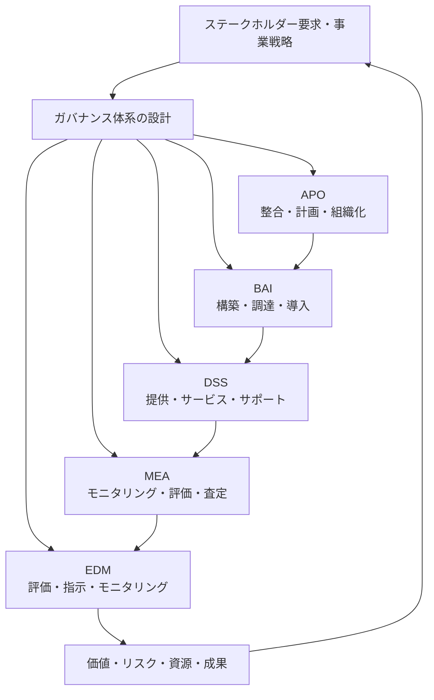
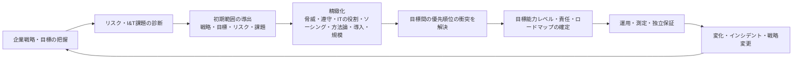

# COBIT 2019に基づく情報技術ガバナンスの設計と実装

## 1. 概要

> **定義**: COBIT 2019は、企業の情報と技術(I&T)がステークホルダー価値を創出するよう、ガバナンス体系とマネジメント体系を設計・運用・評価するISACAのフレームワークである。

企業において情報技術は、単にシステムを運用する支援機能を超え、商品、業務プロセス、顧客体験、規制遵守に直結する事業能力となった。しかし技術部門が迅速にサービスを提供するだけでは投資効果は保証されない。どの技術投資を優先するか、リスクをどの水準まで受容するか、障害や個人情報侵害の責任を誰が負うか、外部事業者をどのように統制するかを、経営の意思決定へと結びつけなければならない。

COBIT 2019は、この問題を特定の製品や単一の統制リストで解決しようとはしない。企業の戦略、目標、リスク、規制環境、技術導入方式と規模をまず把握したうえで、40のガバナンス・マネジメント目標と構成要素を企業の状況に合わせて優先順位付けする。したがって小規模組織がすべての目標を同じ水準で適用する方式よりも、重要なリスクと価値の流れに集中する方式に適している。

ガバナンスとマネジメントは責任の方向が異なる。ガバナンスは、ステークホルダーの要求を評価し、方向を定め、成果と遵守状況をモニタリングする取締役会・最高経営陣の活動である。マネジメントは、定められた方向に従って計画し、構築し、運用し、改善する経営陣と実務者の活動である。両領域を混同すると、取締役会が運用チケットを直接処理したり、実務者が投資の優先順位を独自に決定したりする問題が生じる。

技術士の観点からは、COBIT 2019の核心はフレームワークを導入したという宣言ではなく、意思決定と統制の連結である。事業目標をI&T目標に変換し、目標をプロセスと責任に結びつけ、統制の遂行を測定可能な証拠として残さなければならない。また、監査対応のための文書と実際のサービス品質のための運用手順が、同じ体系の中で機能しなければならない。

本稿では、COBIT 2019の原則と中核モデル、設計要因、目標体系、実装手順、他の標準との関係および実務適用時の考慮事項を、論述式答案の水準で整理する。

## 2. COBIT 2019ガバナンス体系の基本構造

### A. ガバナンスとマネジメントの分離

ガバナンスは「何を、なぜ行うのか」に責任を負う。取締役会や最高経営陣は、投資ポートフォリオ、リスク受容水準、規制遵守の方向、資源配分を評価し決定する。経営陣はその決定が組織の戦略と一貫するよう方向を示し、計画に対する成果とリスクを継続的に監視する。

マネジメントは「決定された方向をどのように実行するのか」に責任を負う。アーキテクチャを設計し、プロジェクトを遂行し、サービスを運用し、供給業者と契約し、インシデントを処理する活動がこれに属する。管理者は、ガバナンス機関が示した成果・リスク・遵守の基準を、日常業務の計画と統制へと具体化しなければならない。

この区分は、組織図を単に二つに分ける作業ではない。例えばクラウド移行を推進する際、取締役会は移行の戦略的価値とリスク受容範囲を決定し、経営陣は目標アーキテクチャ・予算・ロードマップを作成する。運用チームは実際の移行とモニタリングを実施するが、事業リスクを許容するかどうかを運用チームが任意に変えてはならない。

ガバナンスとマネジメントの間にはフィードバックがなければならない。マネジメントの結果からコスト超過、障害の増加、規制違反が見つかれば、管理者は原因と代替案を報告し、ガバナンス機関は目標と資源・リスク限度を再調整する。一方向の報告しか存在しなければ目標が現実から乖離するため、指標と意思決定会議は循環構造を持たなければならない。

### B. COBITコアモデルと五つのドメイン

COBIT 2019のコアモデルは一つの汎用的な参照モデルを提供するが、すべての企業に同一の統制を強制するものではない。モデルの目的は、共通言語と追跡可能な構造を提供することである。企業はこの構造を出発点として重要な目標を選択し、必要な目標には目標能力レベルと統制の証拠を定義する。

EDM(Evaluate, Direct and Monitor)は、ガバナンス目標が集まったドメインである。ステークホルダーの要求を評価し、戦略的代替案を指示し、成果と遵守状況をモニタリングする。EDMの成果物は運用作業のリストではなく、投資の方向、リスク受容、資源活用、ステークホルダーに対する透明性に関する経営陣の決定である。

APO(Align, Plan and Organize)は、情報と技術を組織の戦略・構造・人材・サプライチェーンに整合させるマネジメントドメインである。戦略、エンタープライズアーキテクチャ、イノベーション、ポートフォリオ、予算、リスク、セキュリティ、データと人材の計画が結びつく。計画を立てるだけで終わらせず、実際の資源と責任を配置して実行可能にすることが鍵である。

BAI(Build, Acquire and Implement)は、ソリューションを調達・開発し、変化させて業務に定着させるドメインである。プログラムとプロジェクト、要件、変更、資産、構成、ナレッジの管理などを扱う。BAIの統制が弱いと、計画と運用の間に品質・セキュリティ・追跡性の空白が生じる。

DSS(Deliver, Service and Support)は、サービスの日常運用に責任を負う。運用、サービス要求とインシデント、問題、継続性、セキュリティサービス、業務プロセス統制が含まれる。運用指標は単なる稼働率ではなく、復旧時間、再発率、ユーザーへの影響、セキュリティの検知・対応の品質と連携させなければならない。

MEA(Monitor, Evaluate and Assess)は、内部統制、外部要求事項、成果と適合性を点検するドメインである。自己評価と独立した保証を区別し、指摘事項への措置が実際に完了したかを確認する。監査報告書の作成だけでは目的を達成できず、改善措置が再びガバナンスの意思決定に反映されなければならない。

| ドメイン | 役割 | 代表的な問い |
|---|---|---|
| EDM | ガバナンス | 投資・リスク・成果の方向を誰が決定するか? |
| APO | 整合・計画 | 戦略とI&T資源・アーキテクチャをどう結びつけるか? |
| BAI | 構築・変更 | ソリューションをどの基準で作り、業務に定着させるか? |
| DSS | 運用・サポート | サービスとインシデントをどの水準で提供し、復旧するか? |
| MEA | 評価・保証 | 成果と遵守の証拠をどう評価し、改善するか? |

表のドメインは順次的な部門区分ではない。例えば個人情報保護の要求事項は、APOのリスク・セキュリティ計画から始まり、BAIの設計・変更統制へとつながり、DSSのアクセス・インシデント対応として運用され、MEAの遵守評価によって検証される。ドメインごとに担当者を定めるとしても、目標間の入力・出力と責任の引き継ぎ点をあわせて設計しなければならない。

## 3. COBIT 2019の原則と構成要素

### A. ガバナンス体系の原則

COBIT 2019は、ステークホルダーの要求を満たすための体系的かつ動的なガバナンス、ガバナンスとマネジメントの分離、企業のすべての組織機能を含むエンドツーエンドの観点、一つの統合フレームワーク、全体論的な観点、要求に合わせたテーラーメイドの設計を強調する。これらの原則はチェックリストというより、設計時に見落としてはならない観点である。

全体論的な観点は、プロセスさえうまく作れば統制が機能するという考えを戒める。プロセスの責任者がいない、委員会が決定を下さない、必要なデータがない、構成員の行動が報酬体系と衝突する、といった状況では、文書化されたプロセスは実際の成果につながらない。技術士は手続きだけでなく、組織構造、情報の流れ、文化と能力まであわせて分析しなければならない。

エンドツーエンドの観点は、I&TガバナンスをIT部門の内部品質活動に限定しない。事業部がSaaSを直接購入し、協力会社がデータを処理し、顧客チャネルがAPIを呼び出す環境では、I&Tリスクは組織の境界を越える。企業ガバナンス、事業プロセス、外部サプライチェーンまで含めてはじめて、意思決定の責任とリスクの実際の所在が一致する。

テーラーメイド設計の原則は、「COBITをすべて導入する」という方式の無駄を減らす。金融機関の規制とサイバーリスクは製造業の運用技術(OT)リスクとは異なり、スタートアップのスピードと大企業の職務分離統制も異なる。同じ目標であっても、求められる能力レベル、証拠の頻度、承認階層、自動化の水準は異なりうる。

### B. 七つのガバナンス体系構成要素

ガバナンス体系は、原則とポリシー、プロセス、組織構造、情報、サービス・インフラ・アプリケーション、人材・スキル・能力、文化・倫理・行動で構成される。一部の資料では構成要素の名称を異なって訳しているが、核心はプロセスだけでガバナンスを説明しないという点である。

原則・ポリシー・フレームワークは、意思決定の境界を作る。クラウド利用ポリシー、データ分類ポリシー、変更管理基準、外部委託基準のように、構成員が判断できるルールへと落とし込まれなければならない。ポリシーが宣言にとどまると、例外と承認の基準がないため現場の恣意的な解釈が増える。

プロセスは、目標を達成するための反復可能な活動と入力・出力・統制を定義する。プロセスの成熟度は文書の分量ではなく、実際の業務が再現され、例外が記録され、結果が測定されているかどうかで判断する。自動化された承認フローとチケットの証跡は、プロセス実行を可視化する手段である。

組織構造は、意思決定の権限と責任の配置である。取締役会、リスク委員会、データ委員会、アーキテクチャ委員会、CISO、CIO、事業部のプロダクトオーナーの権限が重複したり空白があったりすると、統制の速度が遅くなる。RACIを作成する際には、実行責任者と承認者を区別し、最終的なリスク受容権者を明確にしなければならない。

情報は、ガバナンスが機能するための燃料である。ポートフォリオの現況、リスク登録簿、資産・構成情報、SLA、インシデント指標、監査結果がそれぞれ異なる定義を用いていると、経営陣への報告の信頼性が低下する。データオーナーと品質基準、更新周期、保存期間を定め、指標の計算式を標準化しなければならない。

サービス・インフラ・アプリケーションは、実際の価値を提供する技術資源である。可用性だけを見るのではなく、復旧性、セキュリティ、拡張性、相互運用性、コスト効率をサービスレベルとして定義する。サービスカタログと構成管理データが結びつけば、障害の影響範囲と変更リスクを迅速に判断できる。

人材・スキル・能力は、計画された統制を遂行できる能力である。例えばクラウドセキュリティポリシーがあっても、IAM設計者、ログ分析者、インシデント対応者の能力が不足していれば、統制は形式的なものになる。研修修了率よりも、実際の役割遂行と訓練結果、交代・代替の可能性を確認することが重要である。

文化・倫理・行動は、統制の回避と報告の遅延を左右する。障害を隠す文化では、稼働率の指標が良く見えても潜在リスクが蓄積する。ミスを報告しても学習と改善につながる環境、セキュリティ・個人情報保護を納期とともに評価する報酬体系が必要である。

### C. 目標とマネジメント実践の階層

各ガバナンス・マネジメント目標は、目的、関連指標、実践(プラクティス)、責任と入力・出力の関係によって具体化される。目標は「セキュリティを強化する」のように抽象的に終わってはならず、セキュリティサービスが承認されたリスク水準とポリシーに従って提供され、モニタリングされている状態を説明しなければならない。

実践(プラクティス)は、目標を達成するために遂行する詳細な活動である。例えば変更管理の目標では、変更要求の分類、影響分析、承認、テスト、デプロイ、事後レビューと緊急変更の例外手順が連結されていなければならない。活動の証拠として承認記録、テスト結果、デプロイログ、事後レビューを残せば、監査と運用改善を同時に支援できる。

目標の指標は、活動量と結果を区別しなければならない。研修回数やレビュー件数が増えるだけでは、インシデントが減らない場合がある。したがって統制の実施率とともに、インシデント再発率、無承認変更の比率、脆弱性の平均対処期間、サービス影響時間といった結果指標を設ける。

## 4. 設計要因とテーラーメイドのガバナンス設計

### A. 設計要因の意味

COBIT 2019の設計要因は、企業のガバナンス体系を画一的に適用せず、優先順位と目標能力レベルを調整するための入力値である。戦略と目標、リスクプロファイル、I&T関連の課題をもとに初期範囲を定め、脅威環境・遵守要求・ITの役割・ソーシングモデル・導入方式・技術導入戦略・企業規模を考慮して範囲を精緻化する。

設計要因は単なるアンケートの点数ではない。各値には根拠がなければならない。例えば脅威環境を「高」と評価したのであれば、最近の攻撃、露出資産、脅威インテリジェンス、業界別の攻撃傾向といった証拠を結びつける。外部委託中心のソーシングモデルを選択したのであれば、契約上の監査権、再委託先の処理者、サービスレベルと終了・移管計画をあわせて検討する。

### B. 設計ワークフロー

第一段階は、企業の戦略と目標を理解することである。コスト効率、成長、顧客の信頼、規制遵守、レジリエンスなど、戦略の表現がI&Tにどのような結果を求めているかを分析する。この段階でIT部門の現在のプロジェクトリストだけを見ると、すでに始まった事業を正当化する水準にとどまりかねないため、事業成果とステークホルダーの期待から出発しなければならない。

第二段階は、初期範囲を定めることである。戦略・企業目標・リスクプロファイル・現在のI&T課題を通じて、重要な目標を絞り込む。例えばデジタル金融サービスが中核である組織において、認証障害と個人情報侵害が主要リスクであれば、セキュリティ・継続性・インシデント・データの目標の優先順位が上がりうる。

第三段階は精緻化である。規制産業か、ITが事業の中核か、大部分を外部クラウドに依存しているか、アジャイル・DevOpsで迅速にデプロイしているか、最新技術を先導的に導入しているかによって、同じ目標でも統制の方式は異なる。企業規模が小さい場合は役割を兼任できるが、相互レビューや独立性に代わる代替統制を明示しなければならない。

最終段階は、優先順位の衝突を解決することである。セキュリティ承認を強化するとデプロイ速度が遅くなり、データ保存を増やすと分析の利便性が高まる一方で個人情報リスクも大きくなりうる。衝突を隠さず、リスク・コスト・価値の前提を記録し、最終的なリスク受容者とレビュー時点を決定しなければならない。

### C. 設計要因適用時の成果物

設計ワークショップの結果は、単なる点数表ではなく、ガバナンス設計書でなければならない。少なくとも企業目標とI&T目標の連結、優先目標リスト、目標能力レベル、責任組織、主要統制、証拠、想定コスト、段階別ロードマップを含む。

| 成果物 | 主要内容 | レビューのポイント |
|---|---|---|
| コンテキスト診断書 | 戦略・規模・リスク・規制・現在の課題 | 事実と意見が区別されているか? |
| 目標の優先順位 | 40目標のうち重点対象とその理由 | リスク・価値の根拠があるか? |
| 能力レベルの定義 | 目標ごとの現在レベルと目標レベル | レベルを上げる実現計画があるか? |
| 責任マトリクス | 取締役会・経営陣・実務・供給者の役割 | リスク受容権者が明確か? |
| 統制・証拠リスト | 活動・指標・承認・ログ・報告書 | 証拠が自動的に生成されるか? |
| 実行ロードマップ | 即効性のある改善、中期構築、継続的改善 | 依存関係と予算が反映されているか? |

現在レベルと目標レベルを区別しなければ、「成熟度4を達成する」という宣言だけが残る。目標レベルを定める際には、法的最低要件、事業への影響、リスク低減効果、必要な能力、自動化の可能性をあわせて検討する。リスクの高い目標に無条件で最高レベルを付与するよりも、レベルを上げるコストと残余リスクを経営陣が理解できるよう説明しなければならない。

## 5. 目標能力レベルと成果測定

### A. 能力レベルの解釈

COBIT 2019のプロセス能力は、活動が遂行される程度と、管理・測定・改善の水準を判断する観点である。低いレベルでは業務が個人の経験に依存することもあるが、レベルが高くなるほど標準化、測定、予測、継続的改善が強化される。数字そのものよりも、組織が安定して結果を反復できるかどうかを見るべきである。

能力レベルの評価は、文書の有無だけで決定してはならない。ポリシー、実行記録、サンプルテスト、インタビュー、指標の推移、例外処理と改善措置が互いに一貫しているかを確認する。ポリシーはあるのに無承認の変更が繰り返されているのであれば、文書のレベルと実行のレベルが異なるため、その差を監査結論と改善計画に反映する。

現在のレベルを高める方法は増員だけではない。標準APIと自動化されたポリシー検証、デプロイパイプラインの承認ゲート、集中ログ、サービスカタログのように、反復業務をシステムに組み込む方法がある。ただし自動化は誤ったポリシーを高速に拡散させうるため、ポリシー変更のレビューとロールバックをあわせて設計しなければならない。

### B. 指標の階層化

成果管理は、経営陣向け指標、管理指標、運用指標を階層に分けなければならない。経営陣は事業価値、リスクエクスポージャー、規制遵守、中核サービスのレジリエンスを見て、管理者はプロジェクト・サービス・供給者の偏差を見る。運用者はインシデントごとの対応時間、デプロイ失敗、脆弱性対処といった実行指標を用いる。

例えば「サービス可用性99.9%」という指標は、月間全体の平均だけでは不十分である。重要な取引時間帯の可用性、障害の顧客への影響、復旧目標の達成可否、計画された変更による中断を区別しなければならない。同じ指標でも定義や分母が異なれば部門間の比較が歪むため、計算式は中央で管理する。

リスク指標は、発生した事象の件数だけを見るものではない。重要資産のうち多要素認証が適用されていない比率、サポート終了ソフトウェアの露出、高リスク脆弱性の平均対処期間、復旧訓練の成功率、供給者点検の未完了率といった先行指標を含める。事後の指標と予防の指標をあわせて見れば、リスクが増大する方向を早期に発見できる。

### C. 独立保証と自己評価

管理者は日常的に自己評価を行い、独立した内部監査や第三者保証は、自己評価の偏りと統制設計の適切性をレビューする。両者は競合関係ではない。自己評価が正確であれば、独立保証の範囲をリスクの高い領域に集中させることができる。

保証の結果は適合・不適合の二分法にとどまらず、リスクの深刻度、業務への影響、再発可能性、措置責任者と期限を含まなければならない。措置が完了したという報告だけでクローズせず、再テストと有効性の検証を行う。繰り返される指摘は、個々の担当者のミスというより、目標・組織・プロセス設計の問題である可能性がある。

## 6. 実装手順と運用モデル

### A. 準備と範囲設定

実装の第一段階は、フレームワークの研修ではなく、問題と目的を定義することである。コスト過多、反復する障害、規制監査での指摘、プロジェクトの失敗、供給者への依存といった推進要因を明確にし、解決しない場合の事業への影響を算定する。スポンサーはCIO一人に限定せず、事業・リスク・財務・セキュリティの責任者が参加しなければならない。

範囲は全社全体とすることも、中核サービス一つとすることもできる。最初から全社で40目標を扱うと、現場の抵抗と文書の負担が大きくなる。逆に狭すぎると隣接システムや供給者のリスクを見落としかねないため、サービスのバリューチェーンとデータの流れを基準に境界を定義する。

### B. 現状診断と目標モデル

現状診断では、既存のITIL、ISO/IEC 27001、ISO/IEC 38500、PMBOK、内部統制、個人情報保護マネジメント体系といった資産をまず確認する。COBITを別個の重複した統制体系として作るよりも、既存の活動をCOBITの目標と結びつける方式が効率的である。

例えばITILのインシデント管理手順はDSS02と結びつけることができ、情報セキュリティマネジメント体系のリスク評価とアクセス統制はAPO12・APO13およびDSS05と結びつけることができる。名称を単に対応させるのではなく、目標の意図、責任、実施頻度、証拠とギャップを比較しなければならない。

ギャップ分析は、文書ギャップ、実行ギャップ、成果ギャップに分けると有用である。文書ギャップはポリシー・手順・役割が存在しない状態であり、実行ギャップは手順はあるが実行されていない状態である。成果ギャップは実行されてはいるが望むリスク低減やサービス成果が得られていない状態であり、自動化・資源・目標値の再設計が必要となる場合がある。

### C. 段階的実行と変革管理

即効性のある改善課題は、リスクが高く効果を測定しやすい領域から選定する。例えば特権アカウントのレビュー、重要サービスの復旧訓練、無承認変更の遮断、外部供給者のアクセス期限切れ処理、中核データのオーナー指定といった課題は、短い周期で結果を確認できる。

中期課題は、サービスカタログ、構成管理、統合リスク登録簿、成果ダッシュボード、ポリシー自動化のように、複数の組織をつなぐ基盤である。これらの課題は技術を構築するだけでは不十分であり、データ定義、責任、例外承認、運用コストをあわせて定めなければならない。

変革管理は、研修資料を配布することで終わるものではない。現場がなぜ承認と記録を行わなければならないのかを業務への影響として説明し、新しいプロセスが従来よりも速い、あるいは安全であるという体験を提供しなければならない。評価と報酬に品質・セキュリティ・復旧の結果を反映しなければ、納期だけを重視する行動に逆戻りしかねない。

## 7. 事例: 金融機関のデジタルチャネルのガバナンス

ある金融機関が、モバイル融資チャネルを拡大するにあたり、クラウドと外部AIサービスを併せて導入すると仮定する。事業目標は審査処理時間の短縮と顧客利便性の向上であるが、個人情報の流出、モデルのバイアス、サービス障害、第三者への再委託、規制違反が主要リスクとなる。

まずガバナンス機関は、自動化の水準と人によるレビューが必要な業務を決定する。AIが書類の不備を検知する補助機能と、与信承認の可否を最終決定する機能とでは、許容誤差と責任が異なるため、同じ統制でひとくくりにしない。モデルとデータの変更が審査結果に影響を与える場合を、重大な変更として定義する。

APO段階では、データ分類、リスク評価、外部供給者の条件、モデル管理原則、サービスレベルを設計する。BAI段階では、要件に個人情報の最小収集と説明可能性、監査ログを含め、モデルとAPIの変更に対する独立したレビューを設ける。DSS段階では障害・インシデント・苦情・誤検知を運用し、MEA段階ではモデルの性能と規制遵守の証拠を定期的に評価する。

運用指標は、平均承認時間一つで定めない。チャネルの可用性、審査保留率、手動レビューへの移行率、サブグループ別の誤り率の差、個人情報アクセスの異常兆候、供給者のSLA違反、復旧訓練の結果をあわせて見る。速度は改善したものの特定の顧客層での誤りが増えたのであれば、ガバナンス目標を達成したとはみなせない。

この事例で重要なのは、COBITの目標を多く適用することではない。事業の中核的な価値とリスクを定義し、そのリスクを低減する目標と責任・証拠を結びつけることである。同じ設計方式は公共サービス、製造業の運用技術、医療データプラットフォームにも適用できるが、設計要因の値と目標能力レベルは異なるべきである。

## 8. COBIT 2019と関連標準・フレームワークの比較

COBIT 2019がガバナンスとマネジメントの全体構造を提供するのに対し、他の標準は特定の目的や領域に対してより深い指針を提供する。したがって一つを選んで残りを捨てるのではなく、COBITを上位の整合・評価構造とみなし、既存標準の詳細な統制を目標に配置する方式が現実的である。

| 区分 | COBIT 2019 | ISO/IEC 27001 | ITIL 4 | ISO/IEC 38500 |
|---|---|---|---|---|
| 主な目的 | I&Tガバナンス・マネジメント体系 | 情報セキュリティマネジメントシステム | ITサービスマネジメント | 企業ITガバナンスの原則 |
| 範囲 | 価値・リスク・資源・成果と全ライフサイクル | 情報セキュリティリスクと統制 | サービス価値の創出と運用 | 取締役会レベルの評価・指示・モニタリング |
| 強み | 設計要因・目標・能力・保証の統合 | 認証可能なISMS構造 | サービス運用の実践とバリューストリーム | 最高意思決定者の責任の明確化 |
| 適用方式 | 優先順位付け後にテーラーメイドで適用 | リスクベースの統制選定 | サービスマネジメント実践の組み合わせ | 原則に基づく経営陣の意思決定 |

COBITとISO/IEC 27001の違いは優劣ではなく、抽象化のレベルと目的である。COBITはセキュリティ以外にも、投資、アーキテクチャ、ポートフォリオ、プロジェクト、運用、保証を結びつける。ISO/IEC 27001は情報セキュリティリスクを管理し、マネジメントシステムの継続的改善を証明することに強いため、COBITのセキュリティ・リスク目標に詳細な統制と審査の証拠を提供できる。

COBITとITIL 4も競合しない。ITILはサービスが価値を共創するようサービスマネジメントの実践を具体化し、COBITはそのサービスマネジメントが企業目標とリスク・遵守の方向に合っているかをガバナンスの観点から調整する。ITILのインシデント管理指標をCOBITの成果・リスク報告に結びつければ、運用改善が経営の意思決定へと引き上げられる。

ISO/IEC 38500は、取締役会がITを評価・指示・モニタリングしなければならないという原則を強調する。COBITのEDMドメインと自然に連携できるが、COBITはその原則をマネジメント目標と構成要素、能力および証拠のレベルにまで拡張する。技術士は、重複する委員会や二重報告を生まないよう、責任と会議体を統合しなければならない。

## 9. 深掘り: クラウド・AI時代のCOBIT適用

クラウド環境では、資産が組織のデータセンターになくてもガバナンスの責任はなくならない。SaaSの構成とログ、データ処理の場所、再委託の構造、終了時のデータ返却・削除、復旧の責任を、契約と運用手順に明記しなければならない。責任共有モデルは供給者と顧客の責任境界を説明するものにすぎず、顧客のリスク受容の決定を供給者に委任する根拠ではない。

AIシステムでは、データとモデルの変更が継続的に発生する。したがって静的な承認文書よりも、データ・モデルのバージョン、評価の実行、プロンプト・ポリシーの変更、人によるレビュー、インシデントとロールバックを結びつける運用上の証拠が重要である。モデルカード、データシート、モデルレジストリ、レッドチームの結果をAPO・BAI・DSS・MEAの目標と結びつければ、透明性と運用統制をともに高めることができる。

DevOpsとアジャイル環境では、すべての変更を遅い委員会承認で止める方式は効果的ではない。リスクベースで変更を分類し、自動化されたテスト・ポリシー検証・デプロイ承認・オブザーバビリティ・ロールバックをパイプラインに組み込まなければならない。高リスクの変更には分離された承認と事後レビューを設ける一方、低リスクの反復的な変更は事前承認済みの標準変更として処理できる。

サステナビリティも、I&Tガバナンスの設計要因となりうる。データセンターの電力、モデル推論のコスト、機器の寿命、廃棄データ、サプライチェーンの環境・社会的リスクを、ポートフォリオと成果指標に反映する。コスト削減だけを目的にリソースを減らすとレジリエンスとセキュリティが悪化しうるため、炭素・コスト・サービス品質・リスクのバランスを目標として管理する。

## 10. 考慮事項および示唆点

### A. フレームワークの導入よりも意思決定の実効性を優先する

COBITの認証や文書の数が目的化すると、現場は統制疲れを感じ、経営陣は実際のリスクを見られなくなる。中核サービスとデータの流れをまず選定し、どの意思決定を改善しようとしているのかを明確にしなければならない。フレームワークの項目は、意思決定とリスクを説明する共通言語として用いる。

### B. 責任と権限をあわせて設計する

責任者を指定しながら予算・人員・停止権限を与えなければ、統制の失敗を個人の問題に帰することになる。リスク受容権者、統制運用者、独立レビュー者、供給者担当者を区別し、インシデントや規制変化の際の意思決定経路を試験する。RACIには責任だけでなく、最終判断とエスカレーションの条件も含める。

### C. 証拠を業務フローに組み込む

監査直前に証拠を集める方式は、漏れや改ざんの可能性を高める。チケット、コードリポジトリ、デプロイログ、アクセスレビュー、サービスモニタリング、研修・訓練の結果を、通常の業務過程で自動的に生成・保存する。自動生成された証拠であっても、元データの正確性、アクセス権限、保存期間を管理してはじめて信頼できる。

### D. リスクベースの優先順位と残余リスクを開示する

すべての目標を最高レベルで管理しようとする計画は、コストと速度の制約を無視している。優先順位決定の根拠、目標能力レベル、予算、想定される残余リスクを、経営陣が理解できる形で提示する。受容された残余リスクには期間と再評価の条件を含めなければならず、「低」という表現だけで恒久的な免除を作ってはならない。

### E. サプライチェーンと組織の境界をガバナンスに含める

SaaS、クラウド、オープンソース、外部AI API、下請け開発会社は、企業のI&Tの成果とリスクに直接影響を与える。契約上の監査権を確認するだけでなく、データの所在・アクセス、脆弱性の通知、インシデント報告、再委託の変更、サービス終了と移管、復旧試験を検証する。供給者統制の結果も、内部のリスク登録簿と成果報告に結びつける。

### F. 継続的なレビューと学習の仕組みを作る

戦略、規制、脅威、技術導入の方式が変われば、設計要因と目標の優先順位も変わる。定期レビューに加えて、重大障害、M&A、クラウド移行、AIモデルの変更、規制改正といった事象を再設計のトリガーとして定義する。ガバナンスは一度で完了するプロジェクトではなく、変化に反応する運用能力である。

## 参考資料

- ISACA, “COBIT®| Control Objectives for Information Technologies®” — https://www.isaca.org/resources/cobit
- ISACA, “COBIT 2019 and COBIT 5 Comparison: Governance System Design” — https://www.isaca.org/resources/news-and-trends/industry-news/2020/cobit-2019-and-cobit-5-comparison
- ISACA, “New COBIT 2019 Resources Help Organizations Design and Implement Tailored Governance Systems” — https://www.isaca.org/about-us/newsroom/press-releases/2018/new-cobit-2019-resources-help-organizations-design-and-implement-tailored-governance-systems
- ISACA, “Designing Your Organization’s Custom COBIT” — https://www.isaca.org/resources/news-and-trends/industry-news/2019/designing-your-organizations-custom-cobit
- ISACA, “Defining Target Capability Levels in COBIT 2019” — https://www.isaca.org/resources/news-and-trends/industry-news/2019/defining-target-capability-levels-in-cobit-2019-a-proposal-for-refinement

---

> **一言まとめ**: COBIT 2019は、企業の戦略・リスク・規制・技術環境を設計要因として反映し、I&Tガバナンスとマネジメントを目標・責任・証拠・成果へと結びつけるテーラーメイド型のフレームワークである。
