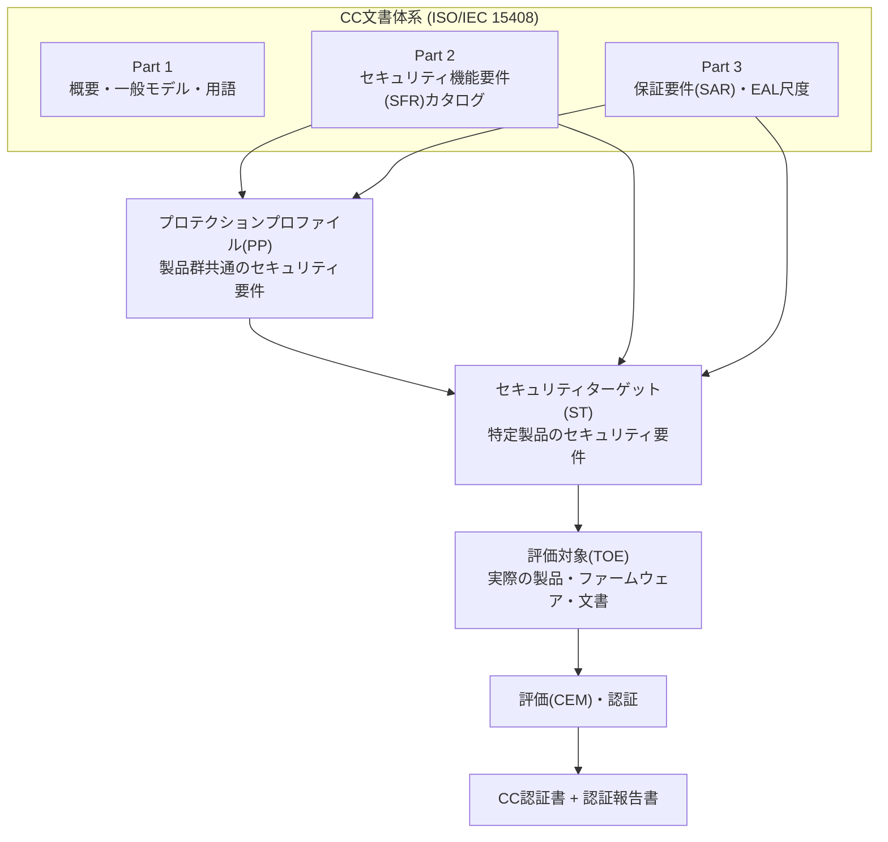
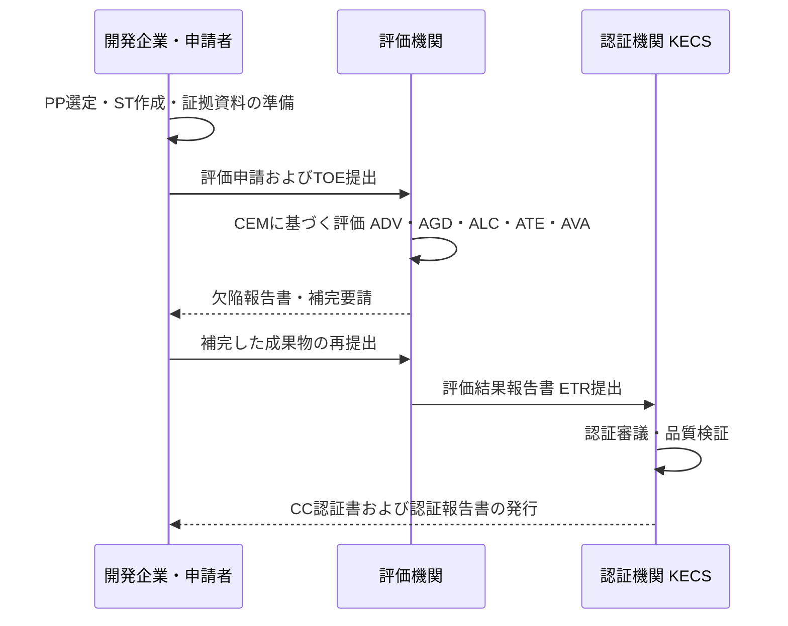

# コモンクライテリア(CC, Common Criteria / ISO/IEC 15408)

## 1. 概要

### A. 定義
> **コモンクライテリア(CC, Common Criteria for Information Technology Security Evaluation)** は、情報セキュリティ製品・システムのセキュリティ機能と、その機能が正しく実装・運用されているという **保証(Assurance)** の水準を、第三者の独立機関が標準化された手順で評価・認証するための国際標準であり、**ISO/IEC 15408**(評価基準)とその評価方法論である **ISO/IEC 18045(CEM)** で構成される。

CCは、「この製品がどのようなセキュリティ機能を提供するか」(機能性)と「その機能がどれだけ信頼できる形で作られているか」(保証)を分離して扱う点が特徴である。すなわち、ファイアウォールがパケットを遮断するという事実(機能)と、その遮断ロジックが設計・実装・試験・脆弱性分析を経て欠陥なく動作することが証明されたという事実(保証)を、別個の軸として評価する。

### B. 登場背景および必要性
CC以前は、国・地域ごとに異なるセキュリティ評価基準が乱立していた。米国の **TCSEC(オレンジブック)**、欧州の **ITSEC**、カナダの **CTCPEC** がそれぞれ異なる等級体系と用語を用いていたため、ある国で認証を受けた製品を他国へ輸出するには毎回再評価を受けなければならなかった。これは開発企業には重複コストを、導入機関には比較不可能性をもたらした。セキュリティ製品の信頼性を客観的に比較するための共通言語が存在しなかったのである。

CCは、こうした断片化を解消するために1990年代に複数の基準を **調和(harmonization)** させて作られ、1999年にISO/IEC 15408として国際標準化された。中核的な動機は、「一度評価を受ければ複数の国で認められる(Evaluate once, recognize everywhere)」という **相互承認(Mutual Recognition)** である。これを制度的に支えるのが **CCRA(CC Recognition Arrangement)** であり、加盟国は定められた範囲内で互いの認証書を承認する。

必要性は三つに整理される。第一に、**客観的な信頼の根拠** である。供給者の自己主張ではなく、独立評価機関による標準化された検証結果によってセキュリティ性を判断できる。第二に、**調達要件の充足** である。韓国の公共機関は情報セキュリティ製品の導入時に原則としてCC認証(またはそれに準ずる検証)を要求するため、CC認証は市場参入の関門として機能する。第三に、**比較可能性** である。異なる製品であっても同一のPP(プロテクションプロファイル)を基準に評価されれば、セキュリティ要求の充足可否を同じ尺度で比較できる。

### C. CCの特徴
CCの第一の特徴は、**機能性と保証の分離** である。TCSECが等級ごとに機能と保証をひとまとめにして硬直的であったのとは異なり、CCは何をするか(SFR)とどれだけ信頼できるか(SAR)を独立した軸として扱い、同じ機能であっても脅威水準に合わせて保証の強度を選択できるようにした。この分離により、低脅威環境向けの低コストな認証から高脅威環境向けの高保証な認証まで、一つの枠組みで受け入れられる。

第二の特徴は、**再利用可能な要件カタログ** である。SFR・SARがクラス–ファミリー–コンポーネントとして標準化されているため、PP・STの作成時にはこれらを組み合わせ・詳細化すればよく、要件定義の表現力と一貫性が同時に確保される。第三は **国際的な相互承認** であり、CCRAを通じてある加盟国の認証を他の加盟国が定められた範囲で承認するため、重複評価のコストが削減される。この三つの特徴が結合し、CCは情報セキュリティ製品の信頼性に関する共通言語として定着した。

## 2. CCの構成体系と中核概念

CCの文書体系と、評価対象・要件の関係を全体構造として示すと次のとおりである。

CCを理解する鍵は、**評価対象と要件を明示的に文書化する** という点にある。以下の中核概念は互いに噛み合い、一つの評価ロジックを構成する。

**A. TOE(Target of Evaluation)** は評価の対象となる製品またはその一部であり、ソフトウェア・ハードウェア・ファームウェアと関連するガイダンス文書を含む。重要なのはTOEの **境界設定** である。同じ製品でも、どこまでを評価範囲に含めるかによってセキュリティ主張と評価コストが変わるため、TOEの定義は評価の信頼性に直結する。境界外の運用環境に関する前提(例:物理的保護、信頼された管理者)は別途明示される。例えば同じDBMSでも、アクセス制御エンジンだけをTOEとする場合と、管理コンソール・監査ログまで含める場合とでは、セキュリティ主張と評価工数が大きく異なるため、TOE境界は開発企業が戦略的に決定する重要な設計事項である。境界を狭めれば評価は容易になるが、導入機関が期待するセキュリティ範囲を包含できないリスクがあり、広げれば信頼範囲は大きくなるもののコストが増加する。

**B. SFR(Security Functional Requirements)** は、TOEが提供すべきセキュリティ機能を規定した要件であり、CC Part 2にクラス・ファミリーの形でカタログ化されている。例えば識別・認証(FIA)、アクセス制御・情報フロー制御(FDP)、監査(FAU)、暗号サポート(FCS)、セキュリティ管理(FMT)などのクラスがあり、開発企業はこのカタログから自社製品に必要な項目を選択・具体化する。標準カタログを再利用するため、要件定義の一貫性と比較可能性が確保される。

**C. SAR(Security Assurance Requirements)とEAL** は、「機能が正しく作られているか」を扱う。Part 3の保証クラスには、開発(ADV)、ガイダンス文書(AGD)、ライフサイクルサポート(ALC)、テスト(ATE)、脆弱性評定(AVA)などがあり、これらを一定の強度で束ねた事前定義パッケージが **EAL(Evaluation Assurance Level)1~7** である。EALが高いほど、設計表現の形式性、テスト範囲、脆弱性分析の深さが増す。保証とは「機能が多い」ことではなく、「検証が厳格である」ことを意味する点に留意すべきである。

**D. PPとST** は、要件を収める二つの器である。**PP(Protection Profile)** は、特定の製品群(例:ファイアウォール、スマートカード、DBMS)が共通して満たすべき実装非依存のセキュリティ要件の集合であり、導入機関・政府が「この種の製品は最低限これだけは備えるべきである」と規定するベースラインである。**ST(Security Target)** は、特定の一製品が実際に何をどのように満たすかを明らかにする実装指向の仕様書であり、通常一つ以上のPPへの適合を主張(claim)する。PPが「標準仕様書」であるならば、STは「当該製品の提案書」に相当する。

| 概念 | 意味 | 性格 |
|---|---|---|
| **TOE** | 評価対象の製品・文書 | 評価範囲(境界)の定義 |
| **SFR** | セキュリティ機能要件(Part 2) | 何をするか(機能) |
| **SAR / EAL** | 保証要件(Part 3) | どれだけ信頼できるか(保証) |
| **PP** | 製品群共通の要件 | 実装非依存・ベースライン |
| **ST** | 特定製品のセキュリティ仕様 | 実装指向・PP適合の宣言 |

これらの概念の関係は一文に要約できる。**政府・需要機関がPPでベースラインを定義すると、開発企業はSTで自社のTOEがそのPPのSFRをどのような方法で満たすかを明らかにし、評価機関はSAR/EALに従ってその主張が事実かどうかを検証する。** すなわち、PPは要求の源泉、STは製品の約束、EALは検証の強度という三角構造がCCの骨格である。この構造により、異なる開発企業の製品であっても同じPPに準拠していれば、同一の尺度で比較・調達できる。

## 3. 評価・認証プロセス

CC認証は、**開発企業(申請者)–評価機関–認証機関** の三者構造で進められる。韓国では認証機関の役割を国家情報院傘下の **IT保安認証事務局(KECS)** が担い、実際の評価は指定された評価機関がCEM(ISO/IEC 18045)の方法論に従って実施する。

プロセスは **準備–評価–認証** の流れとして理解できる。準備段階では、開発企業は対象PPを選定してSTを作成し、要求される保証等級に見合った設計・テスト・構成管理の証拠資料を整える。このときEALが高いほど要求される文書の形式性と量が急増するため、目標等級は事業上の要求とコストを考慮して慎重に決定しなければならない。

評価段階では、評価機関がCEMの詳細活動(work unit)に従って成果物を点検する。例えばADVで設計・実装表現がSFRを十分に詳細化しているか、ATEで機能テストが十分な範囲をカバーしているか、AVAで既知・潜在的な脆弱性を侵入テストの観点から分析しているかを確認する。欠陥が発見されれば開発企業に補完を要請し、この **欠陥–補完の反復** が評価期間を左右する主要因である。

認証段階では、評価機関が評価結果報告書(ETR)を認証機関に提出し、認証機関は評価の適正性と一貫性を独立して審議する。審議を通過すると、**CC認証書** とともに評価範囲・前提・結果を記載した **認証報告書** が発行される。導入機関は、この認証報告書のTOE境界と運用環境の前提を必ず確認しなければならない。認証は「明示された環境前提のもとで」有効だからである。

| 段階 | 主体 | 主な活動 | 成果物 |
|---|---|---|---|
| **準備** | 開発企業 | PP選定、ST作成、証拠準備 | ST、設計・テストの証拠 |
| **評価** | 評価機関 | CEM活動の実施、欠陥の指摘 | 欠陥報告書、テスト結果 |
| **認証** | 認証機関(KECS) | 評価の適正性の審議 | 認証書、認証報告書 |

一方、要件文書自体も評価対象となる。PPは **APE(Protection Profile Evaluation)**、STは **ASE(Security Target Evaluation)** クラスによって、その完全性・一貫性・根拠(rationale)をまず検証される。これは、誤って定義された要件の上で製品を評価すれば結果全体が無意味になるためであり、「要件の妥当性検証 → 製品の要件充足の検証」という2段階の論理を制度化したものである。このため評価の初期にはST・PPの整合性確保に相当な労力が投入され、ここでの不備がその後の評価遅延のよくある原因となる。

## 4. EAL等級の比較と適用事例

EAL 1~7は、保証の強度を段階的に高めた尺度である。低い等級は文書レビュー・機能テスト中心であり、高い等級になるほど **準形式的・形式的(semiformal・formal)** な設計表現と深い脆弱性分析を要求する。ここで留意すべき点は、実務において **国際的な相互承認が実効的に機能する範囲は、おおむねEAL 2水準(または協調PPベース)** に限られるということである。EAL 5~7の高保証評価はコスト・期間が非常に大きく、相互承認の範囲外であるため、スマートカード・国防など特殊な高リスク領域で限定的に用いられる。

| 等級 | 保証の概念 | 代表的な適用文脈 |
|---|---|---|
| **EAL1** | 機能テスト | 低い脅威、最小限の保証 |
| **EAL2** | 構造テスト | 商用製品・相互承認の実効範囲 |
| **EAL3** | 方式テスト・チェック | 一般的な商用セキュリティ機器 |
| **EAL4** | 方式設計・テスト・レビュー | 商用最高等級(ファイアウォール・DBMSなど) |
| **EAL5~7** | 準形式的・形式的検証 | スマートカード・国防など高リスク |

CCの位置づけは、以前の評価基準と比較するとより明確になる。TCSEC(オレンジブック)は機密性中心の軍事的観点から、機能と保証をD~A1の単一の軸にまとめていたため柔軟性が低く、商用製品の多様なセキュリティ目標を盛り込むことが難しかった。ITSECは機能性(F)と保証(E)を分離した一歩進んだ体系であったが、欧州地域の標準にとどまり、国際的な通用性が限られていた。CCはこの両者の長所(機能・保証の分離)を取り入れ、国際標準化・相互承認を組み合わせることで、商用・公共・国防を包括する汎用基準へと拡張された。違いが生じた根本的な理由は、**評価対象が閉鎖的な政府システムからグローバルな商用製品市場へと移った** からであり、この変化が「比較可能で相互承認される汎用基準」への要求を生んだ。

| 基準 | 機能・保証 | 通用範囲 | 限界 |
|---|---|---|---|
| **TCSEC(オレンジブック)** | 統合(D~A1) | 米国・軍事 | 硬直性、機密性への偏重 |
| **ITSEC** | 分離(F/E) | 欧州 | 国際的な通用性の不足 |
| **CC(ISO/IEC 15408)** | 分離(SFR/SAR) | 国際(CCRA) | 条件付きの信頼・コスト |

具体的な事例として、韓国の公共部門に納入されるファイアウォール・侵入防止システム(IPS)・DBMSアクセス制御製品は、通常その製品群のPPを基準に **EAL水準の国内向けCC認証** を取得して導入要件を満たす。一方、金融ICカード・電子パスポートのチップのような製品は、物理・サイドチャネルの脅威が大きいため、**EAL 5以上の高保証** 評価が求められることが多い。このように等級の選択は、製品が置かれる **脅威環境と資産価値** によって異なり、無条件に高い等級ではなく **脅威に見合った適正な保証** を選択することが原則である。

等級の選択はコスト・期間に直結するため、経済性の観点も重要である。一般にEALが一段階上がるごとに、要求される成果物の形式性とテスト・脆弱性分析の範囲が拡大し、評価期間とコストが顕著に増加する。特に準形式的な設計表現が求められるEAL5以上では、その負担が急激に大きくなる。したがって商用製品の大部分は、相互承認とコストのバランス点としてEAL2~4の区間を選択し、EAL5~7は人命・国家安全保障に直結する少数の高リスク製品に限定するのが実務の慣行である。これは、「可能な最高等級」ではなく「脅威と資産に見合った必要十分な最小等級」を選ぶことが合理的であることを示している。

また、CCが絶対的な安全を保証するものではないという点も、事例を通じて理解する必要がある。認証とは、「定義されたTOE境界と運用環境の前提のもとで、明示されたSFRをEAL水準で検証した」という条件付きの信頼である。したがって、認証後に発見される新たな脆弱性、誤った設定、境界外の構成要素に起因する事故は、認証の範囲外となる。認証書だけを見て「安全である」と断定するのはよくある誤解であり、必ず **認証報告書の前提・範囲** をあわせて検討しなければならない。

## 5. 深掘り — 最新動向と標準改訂(CC:2022 / ISO/IEC 15408:2022)

CCは長らく **CC v3.1** が事実上の基準として使われてきたが、2022年に **CC:2022(Release 5)** が発表され、これに対応する **ISO/IEC 15408:2022** および **ISO/IEC 18045:2022** の改訂版が出されたことで、体系が拡張された。改訂の核心は、従来のパート構成を超えて **評価方法・活動の仕様(Part 4)と事前定義パッケージ(Part 5)** を標準に取り込み、要件定義と評価実施の再利用性・一貫性を高めた点にある。新規の認証体系は段階的にCC:2022ベースへと移行しつつあり、開発企業・導入機関は準拠バージョンを確認し、移行を準備しなければならない。

方法論の面での大きな流れは、**cPP(collaborative Protection Profile)とEALからの脱却** である。CCRAは2014年の改訂以降、上位EALの全面的な相互承認を縮小し、国際技術コミュニティ(iTC)が特定の製品群について合意した **協調プロテクションプロファイル(cPP)** への適合を相互承認の軸とする方向へと移行した。これは、「一般的な保証等級(EAL)」よりも「製品群ごとの実質的な脅威に合わせた精緻な要件(cPP)」のほうが実務上の信頼により適合するという認識を反映している。その結果、最近の評価はEALのラベルに代わり、特定のcPPへの適合有無で表現されるケースが増えている。

この流れは、信頼の根拠が「一般的な等級ラベルの相互承認」から「製品群ごとの精緻な要件の国際的な共同定義」へと移ったことを意味する。ただし、cPPがまだ整備されていない新興製品群は依然として個別のPP・STに基づく評価に依存するため、EALとcPPは当面併存する見通しである。

韓国の動向としては、すべての製品群にPPが存在するわけではないという現実を補うために導入された **情報保護製品迅速確認制度** がCC認証を補完している。評価用のPPがない新技術・融合製品が、CC認証待ちのために公共市場への参入が遅れる問題を緩和する趣旨である。ただし迅速確認はCCの完全な代替ではなく **時限的・補完的な経路** であるため、長期的には当該製品群のPP整備とCCへの編入が望ましい。あわせて、**耐量子計算機暗号(PQC)への移行**、クラウド・コンテナ形態の製品のTOE境界の定義、AI搭載製品の評価方法論の確立などが、CC体系が今後解決すべき課題として浮上している。

## 6. 考慮事項および示唆点

- **適正な保証の選択(脅威への相応性)**: EAL・cPPの選択は、資産価値と脅威水準に比例すべきである。過度に高い等級はコスト・期間を不必要に増大させ、過小な等級は実質的な保証が不足する。技術士は調達要件と脅威モデルをあわせて考慮し、**最適な等級/PP** を推奨できなければならない。
- **TOE境界と運用環境の前提の検証**: 認証は条件付きの信頼であるため、導入時には認証報告書のTOE範囲・前提(信頼された管理者、物理的保護など)が実際の運用環境と一致しているかを確認しなければならない。境界外の構成要素・誤った設定は認証によって担保されない。
- **バージョン・相互承認戦略(CC:2022・CCRA)**: 国際的な事業であれば、相互承認の範囲(おおむねEAL2またはcPP適合)と準拠バージョン(CC:2022への移行)を考慮した認証戦略が必要である。国内向け・国際向けの認証の目的と活用先を区別して計画する。
- **ライフサイクルの連続性(ALC・保証の維持)**: 認証は特定の時点・構成に対するものであるため、パッチや機能追加によって保証が損なわれる可能性がある。構成管理(ALC)と認証の維持・再評価手続きを連携させ、**持続可能な保証** を確保しなければならない。
- **関連技術・制度との統合**: CCは、ISMS-P、セキュアコーディング、SBOM・サプライチェーンセキュリティ、暗号モジュール検証(KCMVP/FIPS)と相互補完的である。製品認証(CC)–運用認証(ISMS-P)–暗号検証を階層的に組み合わせたとき、実質的な保証体系が完成する。
- **評価の滞留と新技術受容のバランス**: 評価用PPの不在や評価期間の長期化は、新技術製品の公共参入を遅らせる。迅速確認制度のような補完経路を活用しつつ、中長期的には製品群のPP整備と、クラウド・AI製品に適したTOE境界・評価方法論の確立を並行し、**保証の厳格性と市場の適時性** をともに確保しなければならない。

## 参考資料
- Common Criteria Portal — https://www.commoncriteriaportal.org/
- ISO/IEC 15408-1:2022 — https://www.iso.org/standard/72891.html
- ISO/IEC 18045:2022(CEM) — https://www.iso.org/standard/72889.html
- IT保安認証事務局(KECS) — https://itscc.kr/
- CC Recognition Arrangement(CCRA) — https://www.commoncriteriaportal.org/ccra/

---

> **一言まとめ**: コモンクライテリア(CC, ISO/IEC 15408)は *情報セキュリティ製品のセキュリティ機能(SFR)と保証水準(SAR/EAL)を第三者が標準手順で評価・認証する国際標準* であり、PP・ST・TOEの概念と評価・認証の三者プロセスを軸とし、CCRAの相互承認・cPP中心への移行とCC:2022改訂によって進化し続けている。
