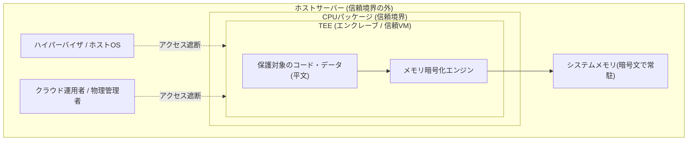
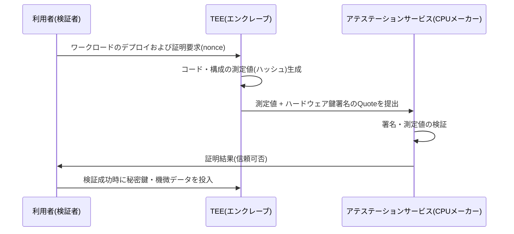

# コンフィデンシャルコンピューティング(Confidential Computing)

## 1. 概要

> **コンフィデンシャルコンピューティング(Confidential Computing)** とは、CPUに内蔵されたハードウェアベースの **信頼実行環境(TEE, Trusted Execution Environment)** の中でデータとコードを処理することにより、演算が行われる瞬間(使用中、in-use)にもデータの機密性と完全性を保護するコンピューティング方式である。Confidential Computing Consortium(CCC、Linux Foundation傘下)が標準用語とアーキテクチャを定義している。

データ保護は伝統的に、**保存中(at rest)** と **転送中(in transit)** の二つの状態に集中してきた。ディスク暗号化(TDE、LUKS)と通信暗号化(TLS)が、それぞれこの二つの状態を担っている。しかし、データが実際に意味のある価値を生み出す瞬間はCPUとメモリで **演算が実行される時点** であり、このときデータは平文でメモリ上に存在しなければならないため、三つ目の状態である **使用中(in-use)** のデータは長らく死角として残されてきた。ワークロードがクラウドへ移行するにつれ、この死角のリスクはさらに大きくなった。利用者はハイパーバイザ・ホストOS・クラウド運用者・物理サーバー管理者など、自らが統制できない多数の特権主体(privileged software)を信頼しなければならず、このうち一つでも侵害されたり悪意を持ったりすれば、実行中の平文データがそのまま露出する。

コンフィデンシャルコンピューティングは、この問題を **信頼の起点(Root of Trust)をソフトウェアスタックから取り除き、CPUハードウェアへ移す** という方式で解決する。すなわち、オペレーティングシステム・ハイパーバイザ・クラウド管理者までも信頼対象から除外(信頼境界の外へ排除)し、CPUメーカーとその内部の隔離メカニズムだけを信頼するよう、信頼基盤を最小化する。これは、先に扱った準同型暗号(演算自体を暗号文のまま実行)やマルチパーティ計算(MPC)が純粋にソフトウェア・数学によってin-use保護を実現するのとは対照的な、**ハードウェア隔離ベースのアプローチ** であるという点で、相互補完的な位置づけを持つ。

## 2. TEEアーキテクチャと脅威モデル

コンフィデンシャルコンピューティングの中核装置はTEEである。TEEはCPUが提供する隔離された実行領域であり、その内部のメモリはCPUの外へ出る際にハードウェア暗号化エンジンを経て自動的に暗号化され、正当なエンクレーブ(enclave)や信頼されたVM以外のいかなる主体もその内容を平文で見ることはできない。以下の概念図は、通常の実行経路とTEEで保護された経路の信頼境界の違いを示している。

TEEが防御する脅威モデルの核心は、**特権ソフトウェアと物理的アクセス者を潜在的な攻撃者と仮定する** 点にある。一般的なアクセス制御モデルがアプリケーション・ユーザーレベルの脅威を扱うのに対し、コンフィデンシャルコンピューティングはそれより上位の層であるカーネル・ハイパーバイザ・ファームウェア、さらにはサーバーに物理的に触れることのできるデータセンター管理者までも信頼境界の外へ押し出す。コールドブート攻撃でメモリモジュールを奪取したり、悪意あるハイパーバイザがゲストメモリをダンプしたりしても、メモリには暗号文しか存在しないため、平文を得ることはできない。

ただし、TEEの保護範囲には明確な境界がある。TEEはメモリの隔離と完全性を強力に保証するが、キャッシュ・分岐予測・消費電力といった物理的な副作用を観測する **サイドチャネル攻撃(side-channel)** には本質的に脆弱でありうる。実際に、Intel SGXを標的としたForeshadow(L1TF)、Plundervolt、SGAxeなど一連のマイクロアーキテクチャ攻撃が報告され、メーカーはマイクロコードパッチで対応してきた。したがってコンフィデンシャルコンピューティングは「万能の盾」ではなく **脅威境界を再定義するツール** として理解し、サイドチャネル緩和策と最新パッチの適用を並行することが実務上の原則である。

## 3. リモートアテステーション(Remote Attestation)の手順

コンフィデンシャルコンピューティングにおいて実際に信頼を成立させる決定的なメカニズムは、**リモートアテステーション(Remote Attestation、遠隔証明)** である。利用者がクラウド上のあるサーバーにワークロードを載せたとき、「このコードが本当に改ざんされないまま本物のTEEの中で動いているか」を利用者が遠隔から暗号学的に検証できてはじめて、機微データを投入できる。リモートアテステーションとは、CPUがエンクレーブのコード・構成状態を測定(ハッシュ)し、ハードウェア鍵で署名した証拠(quote)を発行すると、検証者がメーカーのアテステーションサービスを通じてこれを検証する手順である。

この手順の核心は、**信頼が先に検証されてはじめて秘密が移動する** という点である。利用者は自分が実行しようとするコードの期待ハッシュ値をあらかじめ知っているため、証明結果に含まれる測定値が期待値と一致した場合にのみ、暗号鍵や元データをエンクレーブへ渡す。もしクラウド管理者がコードをひそかにすり替えていたり、TEEではない通常のVMで実行されていたりすれば、測定値・署名が異なるため検証は失敗し、秘密が露出することは決してない。このようにリモートアテステーションは、アクセス制御で扱う識別・認証を「人・アカウント」ではなく **「実行環境そのもの」** へと拡張した概念とみることができる。

## 4. TEE実装類型の比較

TEEは、保護単位を何とするかによって大きく **プロセス隔離型** と **VM隔離型** に分けられる。プロセス隔離型はアプリケーション内に小さな保護領域(エンクレーブ)を置く方式であり、VM隔離型はゲストVM全体を丸ごと暗号化・隔離する方式である。前者は信頼対象(TCB, Trusted Computing Base)を極めて小さく保つため攻撃対象領域が狭いが、アプリケーションをエンクレーブ向けに再設計しなければならない。後者は既存のワークロードをほぼそのまま載せられるためクラウドへの導入性が高い、という実務上の違いがある。この違いが、すなわち「再設計の負担 対 移植性」というトレードオフを生む。

| 区分 | プロセス隔離型 | VM隔離型 |
|------|----------------|-----------|
| 代表技術 | Intel SGX | AMD SEV-SNP, Intel TDX, Arm CCA |
| 保護単位 | アプリケーション内のエンクレーブ | ゲストVM全体 |
| TCBの大きさ | 非常に小さい(アプリケーションの一部) | 大きい(ゲストOSを含む) |
| 移植性 | 低い(エンクレーブSDKで書き直し) | 高い(既存VMをほぼそのまま) |
| 適合事例 | 小規模な中核ロジック・鍵の保護 | クラウドワークロードのリフト&シフト |

Arm陣営の **TrustZone** は、モバイル・組込み分野で広く使われるもう一つの形態であり、一つのプロセッサをセキュアワールド(Secure World)とノーマルワールド(Normal World)に二分し、指紋・決済情報のような機微な処理をセキュアワールドに隔離する。サーバー・クラウドでは、再設計の負担が小さいVM隔離型(SEV-SNP、TDX)が近年事実上の主流として定着しつつあるが、これは企業がコードを修正せずに機密性を得たいという現実的な要求が反映された結果である。例えばAzure Confidential VM、Google Cloud Confidential VMはSEV-SNPベースでゲストメモリを自動的に暗号化し、利用者は起動時にリモートアテステーションで環境を検証したうえでワークロードを信頼できる。

## 5. 活用事例と類似技術の比較

コンフィデンシャルコンピューティングの代表的な実務適用は、**マルチパーティのデータ協業** である。互いに元データを公開したくない複数の機関(例:複数の金融機関が共同で不正取引検知モデルを学習する)が、それぞれのデータを同一のTEEに暗号化された状態で投入し、検証済みのエンクレーブ内でのみ結合・演算が行われるようにすれば、元データを流出させることなく結果だけを共有できる。医療・バイオ分野における機微なゲノム解析、ブロックチェーンのオフチェーン機密スマートコントラクト、クラウド上での個人情報処理委託における処理者への信頼の最小化なども、主要な適用先である。

特に近年は **コンフィデンシャルAI(Confidential AI)** が台頭している。大規模モデルの推論時に、入力プロンプトとモデルの重みをいずれもTEE(GPU TEEを含む。例:NVIDIA H100のConfidential Computingモード)の中で処理すれば、クラウド事業者でさえ利用者のプロンプトや企業の独自モデルのパラメータを閲覧できない。これは、生成AI導入時のデータ主権・営業秘密に関する懸念を緩和する実質的な手段として注目されている。

同じ「in-use保護」を目標とする技術と比較すると、各手法の位置づけが明確になる。以下の表は、先に扱った準同型暗号・MPCとの違いを整理したものである。核心的な違いは、**何を信頼し、何を性能上の代償として支払うか** にある。

| 手法 | 保護原理 | 信頼対象 | 性能 | 特徴 |
|------|-----------|-----------|------|------|
| コンフィデンシャルコンピューティング(TEE) | ハードウェア隔離 | CPUメーカー | 平文に準ずる水準(数%台のオーバーヘッド) | 移植性が高い、サイドチャネルが残存 |
| 準同型暗号(HE) | 暗号文演算 | 数学(信頼できるハードウェアは不要) | 非常に遅い | ハードウェアへの信頼が不要 |
| マルチパーティ計算(MPC) | 秘密分散・プロトコル | 参加者の定足数の仮定 | 通信コストが大きい | 多者間の協業に適する |

このように三つの技術は代替財というより、**信頼モデルと性能プロファイルが異なる補完財** である。実務では、TEEで実行環境を隔離しつつ、その中でMPC・HEを併用してハードウェアへの信頼まで分散させるハイブリッド設計も研究されている。

## 6. 考慮事項および示唆点

技術士の観点からコンフィデンシャルコンピューティングを導入・戦略化する際には、次の点を考慮しなければならない。

- **信頼基盤の移転と残余リスクの認識**: コンフィデンシャルコンピューティングは、信頼対象をクラウド運用者からCPUメーカーへ移すだけであり、信頼そのものをなくすわけではない。メーカーのサプライチェーン・マイクロコードの脆弱性・サイドチャネルのリスクが残存するため、「無欠陥」ではなく脅威境界の再設定という観点から導入の根拠を文書化しなければならない。
- **性能とセキュリティのトレードオフとワークロードの選別**: VM隔離型は通常一桁%程度のオーバーヘッドで移植性が高いが、メモリ暗号化・証明手順に伴う遅延がある。全ワークロードに一括適用するよりも、個人情報・鍵・モデルなど機微度の高い資産に優先的に適用する段階的戦略が合理的である。
- **リモートアテステーション運用体制の確保**: コンフィデンシャルコンピューティングの価値は、証明の検証体制が実際に運用されてはじめて発揮される。アテステーションサービスの可用性、測定基準値(ポリシー)の管理、鍵配布(KMS連携)の自動化までを含む運用プロセスを設計しなければ、形式的な導入にとどまってしまう。
- **規制・コンプライアンスとの連携**: 個人情報保護法上の安全性確保措置、クラウドセキュリティ認証(CSAP)、処理委託時の受託者統制の最小化といった要求に対し、コンフィデンシャルコンピューティングは強力な技術的補完手段となる。ただし、国内の認証・監査体制がTEEの証明結果をどのように受け入れるかについての制度整備を並行しなければならない。
- **マルチクラウドの移植性と標準化**: SGX・SEV・TDX・CCAなど、ベンダーごとに証明形式とSDKが異なるため、ロックイン(lock-in)の懸念がある。CCCの標準化の流れとベンダー中立の証明フレームワーク(例:オープンな証明仕様)を注視し、移植可能なアーキテクチャとして設計することが長期戦略上有利である。

## 参考資料

- Confidential Computing Consortium, "A Technical Analysis of Confidential Computing" — https://confidentialcomputing.io/
- Intel, "Intel Trust Domain Extensions (TDX)" — https://www.intel.com/content/www/us/en/developer/tools/trust-domain-extensions/overview.html
- AMD, "AMD SEV-SNP" — https://www.amd.com/en/developer/sev.html

---

> **一言まとめ**: コンフィデンシャルコンピューティングは、CPUハードウェアベースのTEEとリモートアテステーションによって、データが演算される「使用中(in-use)」の状態まで保護し、ハイパーバイザ・クラウド運用者さえも信頼境界の外へ排除する、ハードウェア隔離型のデータ保護パラダイムである。
