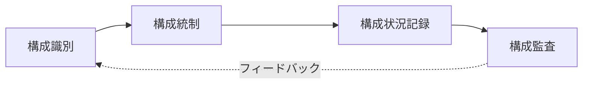

# 構成管理(Configuration Management)とベースライン(Baseline)

## 1. 概要

### A. 定義
> ソフトウェアの開発・運用過程で生成される **成果物(構成アイテム)の変更を識別・統制・記録・監査** して完全性と一貫性を維持する管理活動であり、公式に合意された **ベースライン(Baseline)** を基準として変更を統制する。

### B. 登場背景および必要性
ソフトウェアは、コード・設計書・要求仕様・マニュアルなど数多くの成果物が多くの人の手を経て絶えず変化する。統制なしにそれぞれが修正すると、「**どのバージョンが本物なのか**」わからないバージョンの混乱が生じ、ある人の変更が他の人の作業を上書きして品質が崩れる。構成管理はこの問題を、「**変更を禁止するのではなく、統制された手順によってのみ許可する**」ことで解決する。これにより変更履歴を追跡(監査・トレーサビリティ)し、複数の開発者による同時作業の衝突を防ぎ、特定時点の状態へいつでも復元できるようにする。

## 2. 構成管理プロセス

構成管理は、「**何を管理するかを定め(識別)→変更を統制し(統制)→状態を記録し(状況記録)→基準と一致しているかを検証する(監査)**」という循環で成り立つ。監査の結果は再び識別に反映され、管理対象と基準を更新する。

## 3. 構成管理の4大活動

各活動は、構成管理における異なる問いに答える。識別は「何を」、統制は「どのように変えるか」、状況記録は「今どのような状態か」、監査は「正しく行われたか」を扱う。このうち **構成統制** が実質的な核心であり、変更要求(CR)が来ても即座に反映するのではなく、**影響分析の後、CCB(構成管理委員会)の承認** を経てはじめて反映する。この関門があるからこそ、無分別な変更がふるい落とされ、変更の責任の所在が残る。

| 活動 | 説明 |
|---|---|
| **構成識別** | 構成アイテム(コード・文書・ライブラリ)を識別・命名し、バージョンを付与 |
| **構成統制** | CR → 影響分析 → **CCB承認** → 反映 |
| **構成状況記録** | 変更履歴・現在の状態を記録・報告 |
| **構成監査** | ベースラインが要求と一致しているかを機能(FCA)・物理(PCA)監査 |

例えば運用中にバグ修正の要求が来た場合、開発者が任意にパッチを当てるのではなく、CRを登録し、その変更が他のモジュールに及ぼす影響を分析したうえでCCBの承認を得て反映し、その履歴を記録する。

## 4. ベースライン(Baseline)の類型

> **ベースライン**: 特定の時点で公式にレビュー・合意されて確定した構成であり、以降の変更時には **必ず統制手順(CCB)を経なければならない** 基準バージョン。

ベースラインを開発ライフサイクルの主要な時点ごとに設定する理由は、その時点までの成果物を「**凍結(freeze)**」して安定した基準とし、以降の作業が揺らがないようにするためである。開発が進むにつれて要求→設計→製品の順に具体化されるため、ベースラインもその段階に合わせて三つ設定される。

| ベースライン | 設定時点 | 確定内容 |
|---|---|---|
| **機能ベースライン** | 要求分析完了 | システム要求仕様書(SRS) |
| **割当ベースライン** | 設計完了 | 要求を構成要素に割り当てた設計仕様 |
| **製品ベースライン** | 開発・テスト完了 | 最終納品製品の構成(コード・マニュアル) |

機能ベースラインが「何を作るか」を、割当ベースラインが「どのように分けて設計するか」を、製品ベースラインが「実際に作られた成果物」を固定する。後のベースラインは前のベースラインを基準に検証(追跡)されるため、要求から製品まで一貫性が維持される。

## 5. 関連ツール・手法

構成管理は概念であるが、実際の運用はツールによって自動化される。バージョン管理・課題追跡・CI/CDを連携させれば、コードの変更が課題(変更要求)と結びつき、自動ビルド・デプロイまで追跡されるため、構成の可視性が最大化される。

| 区分 | 例 |
|---|---|
| バージョン管理 | Git, SVN |
| 課題・変更管理 | Jira, Redmine |
| CI/CD・リリース | Jenkins, GitHub Actions |

## 6. 考慮事項および示唆点
- **自動化との連携**: 構成管理ツールをバージョン管理・課題追跡・CI/CDと統合し、変更–ビルド–デプロイの全過程を追跡可能にすることが現代的な方向性である。
- **可視性・説明責任**: CCBによる変更統制の本質は、「**誰が・なぜ・何を変えたのか**」を残し、変更の可視性と説明責任を確保することにある。
- **サプライチェーンへの拡張**: 近年はオープンソースの依存関係まで管理しなければならないため、構成要素の一覧である **SBOM(Software Bill of Materials)** とリリース管理によって、構成管理が **サプライチェーンの完全性** にまで拡張されている。

---

> **一言まとめ**: 構成管理は *識別→統制(CCB)→状況記録→監査* の活動により、成果物の変更を統制された手順によってのみ許可し、**機能・割当・製品ベースライン** を時点ごとに固定して完全性・トレーサビリティを保証するものであり、近年はSBOM・サプライチェーンの完全性へと拡張されている。
