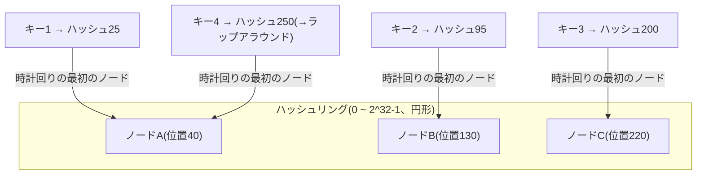
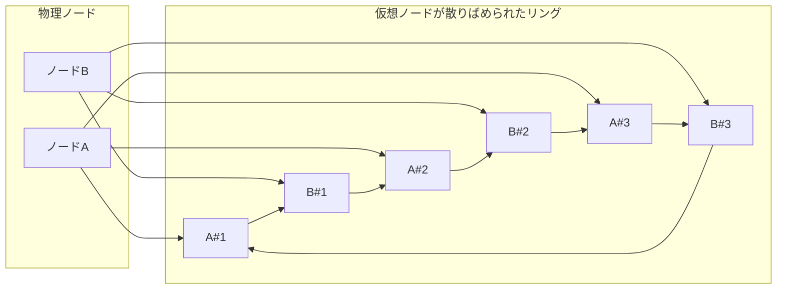

# コンシステントハッシュ(Consistent Hashing)

## 1. 概要

### A. 定義

> **コンシステントハッシュ(Consistent Hashing)** とは、キー(Key)とノード(サーバー)を同一のハッシュ空間の **一つのリング(Ring)** 上に配置し、キーを時計回りに進んで最初に出会うノードに割り当てることで、ノードが追加・削除される際に **再配置されるキーの数を平均K/N程度に最小化** する分散データ分配手法である。

コンシステントハッシュは、1997年にMITのDavid Kargerらがウェブキャッシュの負荷分散のために提案したアルゴリズムであり、今日ではAmazon DynamoDB・Apache Cassandra・Riakのような分散データストア、さらにはmemcachedクライアント・CDN・ロードバランサーのバックエンド選択ロジックに至るまで、幅広く使われている。「データをどのサーバーに置くか」という根本的な問いに対し、**サーバー集合が頻繁に変化する環境でもデータ移動を最小化する** 答えを提供する点が、その核心的な価値である。

### B. 登場背景と必要性

最も単純な分配方式は **剰余ハッシュ(`hash(key) % N`)** である。ノードがN個のとき、キーのハッシュ値をNで割った余りで担当ノードを決めれば分布は均等になるが、致命的な弱点がある。ノード数Nが一つでも変わると(障害で抜けたり、増設で増えたりすると)割り算の分母が変わるため、**ほぼすべてのキーの担当ノードが再計算される**。例えばN=4からN=5に増やすと、理論上約80%のキーが別のノードへ移動する。分散キャッシュであれば、この瞬間にキャッシュヒット率が急落し、オリジンDBへリクエストが殺到する **キャッシュスタンピード(cache stampede)** が発生し、分散DBであれば大規模なデータマイグレーションが誘発される。

クラウド・マイクロサービス環境ではオートスケーリングによってノードが常に増減し、障害も日常的に発生することを考えると、「ノード変更=全面的な再配置」は許容できないコストである。コンシステントハッシュは、**キーをノードの個数ではなくノードのハッシュ位置に従属させる** ことで、一つのノードが変化してもそのノードが担当していた区間のキーだけが影響を受けるよう局所化する。すなわち、再配置の対象が全体ではなく **平均K/N個(Kはキー数、Nはノード数)** に減ることが、この手法の決定的な利点である。

## 2. 動作原理 — ハッシュリングと時計回りの割り当て

コンシステントハッシュでは、ハッシュ関数の出力空間(例:0 ~ 2^32-1)を **終端が始点とつながった円形のリング** として想定する。各ノードは自身の識別子(IP・名前など)をハッシュしてリング上の一点に置かれ、各キーも同じハッシュ関数でリング上に置かれる。あるキーの担当ノードは、**キーの位置から時計回りに進んで最初に出会うノード** に決定される。こうすると、各ノードは「自分の直前のノードから自分まで」の円弧区間を担当することになる。

上図でキー4はハッシュ値250でノードC(220)を通り過ぎているが、リングの終端(2^32-1)を越えて始点(0)へと **ラップアラウンド(wrap-around)** し、ノードA(40)に出会うため、Aが担当する。この円形構造のおかげで、リング上のどの地点にキーがあっても必ず担当ノードが存在する。

ノード **Bが障害で離脱** するとどうなるか。Bが担当していた区間(ノードAの後 ~ Bまで)のキーだけが時計回りで次のノードであるCへ移り、残りのA・Cが担当していたキーは **まったく影響を受けない**。逆に **ノードDを新たに追加** すると、Dの位置の直前区間のキーだけがDへ移動し、残りはそのままである。このように変更の波及が **隣接する一区間に局所化** されることが、剰余ハッシュとの本質的な違いである。

## 3. データ偏在の問題と仮想ノード(Virtual Node)

基本方式には二つの弱点がある。第一に、ノードをリング上にランダムに配置すると区間の長さが均等にならず、**特定のノードにキーが偏る** 可能性がある(負荷の不均衡)。第二に、一つのノードが離脱すると、その負荷が **時計回りで次のノード一か所にそっくり集中** し、連鎖障害(cascading failure)を引き起こす。

これを解決する標準的な手法が **仮想ノード(Virtual Node、vnode)** である。一つの物理ノードをリング上の一点ではなく、異なるハッシュで計算した **数十~数百個の仮想地点** に分散して配置する。例えば物理ノードAを `A#1, A#2, ..., A#150` のように150個の仮想ノードとしてリングのあちこちに分散させると、各物理ノードが担当する円弧がリング全体に細かく広がり、**負荷分散の均等性** が統計的に大きく改善される。実際、仮想ノード数を100~200個程度にすると、ノード間の負荷偏差が数十%から一桁%へと縮小する。

仮想ノードの二つ目の効用は、**異種ハードウェア(heterogeneous capacity)** への対応である。性能が2倍のサーバーには仮想ノードを2倍割り当てれば、その分多くの円弧を担当し、**容量の重み付け(weighting)** を自然に反映できる。また、一つのノードがダウンしたときにその負荷が複数の物理ノードへ **分散して吸収** されるため、連鎖障害のリスクも低くなる。ただし、仮想ノード情報を保持・参照するルーティングテーブルが大きくなり、管理の複雑さが増すというトレードオフが存在する。

## 4. 類似手法との比較 — なぜ違いが生じるのか

コンシステントハッシュを剰余ハッシュ、そして新しい手法である **ジャンプハッシュ(Jump Consistent Hash、Google、2014)** および **ランデブーハッシュ(Rendezvous / HRW)** と比較すると、各手法が最適化している点が異なることがわかる。

| 手法 | ノード変更時の再配置量 | 負荷の均等性 | メモリ・実装 | 重み付けのサポート |
|------|--------------------|-----------|------------|-----------|
| 剰余ハッシュ | ほぼ全体(~(N-1)/N) | 非常に優秀 | 非常に単純 | 困難 |
| コンシステントハッシュ(+vnode) | 平均K/N | vnodeにより優秀 | リング/ソート済みマップが必要 | vnode数でサポート |
| ジャンプハッシュ | 最小(K/N) | 優秀 | メモリO(1) | 非サポート(連番ノード) |
| ランデブーハッシュ | 最小(K/N) | 優秀 | ノードごとのハッシュO(N) | 重み付けのサポートが容易 |

剰余ハッシュは負荷の均等性だけは最高であるにもかかわらず実務で敬遠される理由は、先に見たとおり **ノード変更時の再配置コスト** が圧倒的に大きいためである。負荷の均等性という静的な指標よりも、ノードが常に変化する動的な環境における **変化のコスト** こそが実質的なボトルネックである、という点がコンシステントハッシュが勝る文脈である。ジャンプハッシュはリングのデータ構造なしにO(1)のメモリで最小の再配置を実現するが、ノードに連番を付与する構造であるため **任意のノードの削除・重み付けが難しい** という限界があり、「ノードが末尾でのみ増減する」シャード環境に適している。ランデブーハッシュは各キーごとにすべてのノードとのハッシュを計算して最大値のノードを選ぶため、**重み付け・優先度の制御が柔軟** であるが、ノード数Nに比例する計算コストがかかる。結局、「再配置の最小化+均等性+重み付け」をすべて求める大規模分散ストアは、**仮想ノードを備えたコンシステントハッシュ** を標準として採用している。

**実務での適用事例** として、Amazon DynamoDBとApache Cassandraは、データをリング上のトークン(vnode)区間に配置し、各キーを担当ノードから時計回りに **N個のノードに複製(replication factor N)** する。このときコンシステントハッシュは「どのノード群がこのキーのレプリカを持つか」を決定するルーティングの骨格となり、ノード増設時にも移動データが局所化されるため、無停止での拡張が可能となる。Discordはmemcacheの障害時におけるキャッシュ再構成の嵐を防ぐためにランデブーハッシュを、Google Maglevロードバランサーは接続維持のためにコンシステントハッシュの変形を用いるなど、**接続の持続性(connection affinity)** の確保にも広く活用されている。

## 5. 考慮事項および示唆点

技術士の観点からコンシステントハッシュを設計・導入する際には、次の点を総合的に検討しなければならない。

- **仮想ノード数のトレードオフ調整**: vnodeを増やすと負荷の均等性は向上するが、ルーティングのメタデータとメンバーシップ変更時の更新コストが大きくなる。ノード規模・ハードウェアの異質性・SLAを考慮し、物理ノードあたり100~数百個程度の範囲で実測に基づいてチューニングする。
- **ハッシュ関数の選択**: リング上の均等な分布のため、MD5・SHA-1よりも衝突・偏りが少なく高速なMurmurHash・xxHashなどの非暗号学的ハッシュを用いつつ、分布の品質を事前に検証する。セキュリティ目的でなければ性能を優先する。
- **複製・整合性との連携**: リングベースの複製は、CAP定理上、可用性・分断耐性を得る代わりに結果整合性(eventual consistency)を受け入れる場合が多い。クォーラム(quorum)読み取り/書き込み(R+W>N)、ヒンテッドハンドオフ(hinted handoff)、アンチエントロピー(anti-entropy)などとあわせて設計してはじめて、実際のデータ整合性が確保される。
- **ホットキー(hot key)と偏在の残存リスク**: 特定の人気キーにトラフィックが集中すると、vnodeでも解消されない。キープレフィックスによるシャーディング、キャッシュ層の追加、アプリケーションレベルの負荷分散を並行しなければならない。
- **メンバーシップ管理とオブザーバビリティ**: ノードの増減をクラスタ全体に伝播するゴシップ(gossip)プロトコル・合意ベースのメンバーシップと、再配置の進捗率・負荷偏差を常時モニタリングするオブザーバビリティ体制がともに備わってはじめて、運用の安定性が担保される。
- **展望**: データ局所性(data locality)と遅延の最小化のため、地理的位置・ラック(rack)を認識する(topology-aware)ハッシュが広がっており、サーバーレス・エッジコンピューティング環境でステートフルなワークロードを分散させる際に、コンシステントハッシュの再配置最小化という特性がますます重要になっている。

---

> **一言まとめ**: コンシステントハッシュは、キーとノードを一つのハッシュリングに載せ、時計回りで最初のノードにキーを割り当てることで、ノード増減時の再配置を平均K/Nに最小化する分配手法であり、仮想ノードによって負荷の均等性と重み付けを確保し、大規模分散ストア・キャッシュ・ロードバランサーの標準的なルーティング基盤として用いられている。
