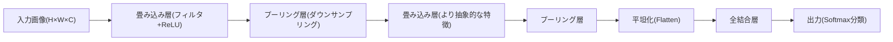
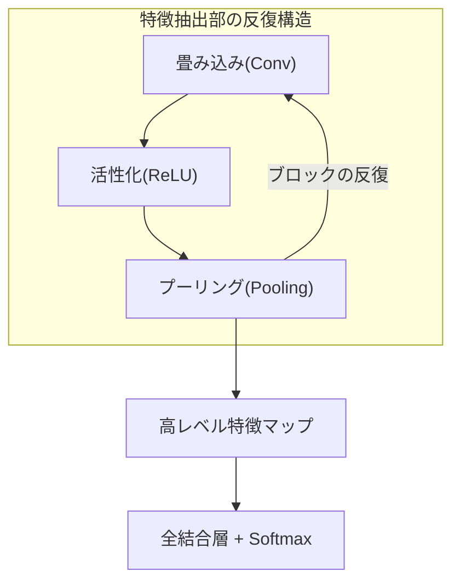

# 畳み込みニューラルネットワーク(CNN, Convolutional Neural Network)

## 1. 概要

### A. 定義

> **畳み込み(Convolution)演算とプーリング(Pooling)を繰り返し、画像などの格子状データから局所的な特徴を階層的に抽出・学習** するニューラルネットワーク。全結合ニューラルネットワーク(FFNN)とは異なり、**局所受容野(Local Receptive Field)・重み共有(Weight Sharing)** によってパラメータを大幅に削減しながら、空間的なパターンを効果的に認識する。

CNNの核心的な洞察は、「**画像の意味はピクセルの絶対位置ではなく、局所的なパターンの組み合わせにある**」という観察から出発している。猫の写真では、耳・目・ひげといった局所的なパターンが組み合わさって「猫」という概念を形成し、その耳が画像の左にあっても右にあっても依然として耳である。CNNは、この二つの性質(局所性・平行移動不変性)をニューラルネットワークの構造そのものに反映したものである。小さなフィルタ(カーネル)を画像全体にスライドさせながら同じ重みで局所パターンを検出するため、位置が変わっても同一の特徴を捉えることができる。

### B. 登場背景と必要性

従来の全結合ニューラルネットワークを画像にそのまま適用すると、二つの深刻な問題が生じる。第一は **パラメータの爆発的増加** である。例えば224×224×3(約15万)ピクセルのカラー画像を1,000ニューロンの隠れ層に全結合すると、最初の層だけで約1.5億個の重みが必要となり、学習が事実上不可能で、過学習(Overfitting)にも弱い。第二は **空間構造の破壊** である。全結合層は2次元の画像を1次元のベクトルに平坦化(flatten)して入力するため、隣接ピクセル間の空間的な相関関係が失われる。

CNNは、この問題を局所結合と重み共有によって解決する。一つの3×3フィルタはわずか9個(+バイアス)のパラメータしか持たず、このフィルタを画像全体で再利用する。その結果、パラメータ数が入力サイズに関係なくフィルタのサイズ・個数だけに依存するようになり、数百万倍以上削減される。こうした効率性と性能により、CNNは2012年にAlexNetがImageNetコンペティションで誤り率を26%→16%へと大幅に下げてディープラーニングの時代を切り開いて以来、画像認識・医用画像・自動運転・顔認識などの事実上の標準アーキテクチャとなった。

| 区分 | 全結合ニューラルネットワーク(FFNN) | 畳み込みニューラルネットワーク(CNN) |
|---|---|---|
| 結合方式 | 大域的な全結合 | 局所受容野(局所結合) |
| パラメータ | 入力サイズに比例して爆発的に増加 | フィルタのサイズ・個数にのみ依存(共有) |
| 空間構造 | flattenにより消失 | 2D/3D構造を保持 |
| 不変性 | 平行移動に弱い | 平行移動不変性を確保 |
| 適するデータ | 構造化・低次元 | 画像・音声スペクトログラムなど格子状 |

## 2. 全体構造(Architecture)

CNNは大きく **特徴抽出部(Feature Extractor)** と **分類部(Classifier)** に分けられる。前段の畳み込み層・プーリング層のスタックが画像から特徴マップ(Feature Map)を抽出し、後段の全結合層がその特徴に基づいて最終判断を下す。このとき、層が深くなるほど抽出される特徴の抽象度が高まる **階層的特徴学習(Hierarchical Feature Learning)** が現れる。初期の層はエッジ・色・テクスチャといった低レベルの特徴を、中間の層は目・車輪・ドアノブのような部分(part)を、深い層は顔・自動車のような物体全体を表現する、といった具合である。これは人間が視覚情報を処理する方式に似ており、CNNが強力である理由の核心である。

この階層的な拡張を説明する概念が **受容野(Receptive Field)** である。浅い層のニューロンは入力画像の狭い領域しか見ないが、層が深くなるほど一つのニューロンが間接的に見る入力範囲は次第に広がる。例えば3×3畳み込みを2回重ねると、2層目の一つのニューロンは元画像の5×5領域を、3回重ねると7×7を反映する。プーリングまで組み合わさると受容野は幾何級数的に大きくなり、深い層のニューロンが画像全体の文脈を総合できるようになる。これが、浅い層は局所的な特徴を、深い層は大域的な物体を認識するという構造的な根拠である。

### A. 畳み込み層(Convolution Layer)

畳み込み層はCNNの心臓部である。フィルタ(カーネル)と呼ばれる小さな重み行列を入力上で一定の間隔(Stride)で移動させながら、重なる領域との要素ごとの積の和(内積)を計算し、特徴マップの一つの値を作る。例えば縦方向のエッジを検出するフィルタは、明るさが左右で急変する領域で大きな値を出力し、均一な領域では0に近い値を出す。重要な点は、このフィルタの重みが **人間によって設計されるのではなく、誤差逆伝播によって学習される** ということである。すなわち、どのフィルタが有用か(どのパターンを捉えれば分類に役立つか)を、データ自身が決定する。

一つの畳み込み層は複数のフィルタを持ち、各フィルタが異なるパターンに反応して独立した特徴マップを生成する。フィルタの個数がそのまま出力チャネル数となる。例えば入力が32×32×3で、3×3フィルタを64個適用すると、出力は(パディング・ストライドによって)おおよそ32×32×64となる。ここで **重み共有** が核心であり、一つのフィルタは画像のどの位置を走査しても同じ重みを使うため、「画像の左上で学習したエッジ検出能力を、右下でもそのまま再利用」する。この再利用性こそが、パラメータを劇的に減らし、平行移動不変性を与える源泉である。

畳み込み演算では、三つのハイパーパラメータが出力サイズを左右する。**ストライド(Stride)** はフィルタの移動間隔であり、大きいほど出力が小さくなり、ダウンサンプリングの効果が生じる。**パディング(Padding)** は入力の縁に0を付け足すことであり、'same'パディングを用いると出力サイズを入力と同じに保ち、境界情報の損失を防ぐ。**カーネルサイズ** は受容野の広さを決定する。出力の一辺のサイズは `(N - F + 2P)/S + 1` の公式で計算され(N=入力、F=フィルタ、P=パディング、S=ストライド)、例えばN=32、F=3、P=1、S=1であれば、出力は(32-3+2)/1+1 = 32となり、サイズが保持される。

このパラメータ削減効果は、数値で見ると劇的である。32×32×3の入力を例にとると、全結合層で64個のニューロンに結合する場合、重みは(32×32×3)×64 ≈ 19.6万個必要となる。一方、3×3フィルタを64個使う畳み込み層は、(3×3×3)×64 = 1,728個(+バイアス64)のパラメータだけで同じ64チャネルの特徴マップを作る。約100倍以上少ないパラメータで、空間構造まで保持するのである。この差は入力解像度が大きくなるほど広がり、高解像度画像においてCNNが事実上唯一の現実的な選択肢となる理由となる。

また、畳み込みの直後には **非線形活性化関数(主にReLU)** を適用する。ReLU(`max(0,x)`)は負の値を0にして非線形性を与えつつ、勾配消失(Vanishing Gradient)問題を緩和し、計算も単純であるため、深いCNNの学習を可能にした決定的な要素である。畳み込みだけを積み重ねると複数の線形変換が一つに崩れてしまうため、活性化関数があってはじめて真の深層表現力が生まれる。

### B. プーリング層(Pooling Layer)

プーリング層は、特徴マップの空間サイズを縮小する **ダウンサンプリング** を担う。最も広く使われる最大プーリング(Max Pooling)は、2×2の領域で最大値だけを取り、特徴マップを縦・横それぞれ半分に縮小する。プーリングの第一の目的は **計算量とパラメータの削減** であり、後続の層の負担を減らし、過学習を抑制する。第二の目的は **位置不変性の強化** である。最大値だけを残すため、特徴が数ピクセル移動しても同じプーリング結果となり、小さな位置の変化に強くなる。例えば手書きの「7」が画像内で少し偏って書かれていても同じように認識できるのは、プーリングの寄与が大きい。

最大プーリングと平均プーリング(Average Pooling)は、目的が少し異なる。最大プーリングは「最も強く反応した特徴」だけを残すため、エッジ・テクスチャのような際立ったパターンの検出に有利であるのに対し、平均プーリングは領域全体の情報を滑らかに要約するため、背景・大域的な統計を反映するのに適している。実務では、中間層には最大プーリングを、最後の要約にはグローバル平均プーリングを用いる組み合わせが一般的である。

プーリングには学習パラメータがないという点が、畳み込み層との決定的な違いである。最大値(または平均値)を選ぶ固定的な演算であるため、学習の対象ではない。ただし近年の一部のアーキテクチャ(例:ResNetの後半部)は、プーリングの代わりにストライドを大きくした畳み込みでダウンサンプリングを代替したり、最後に **グローバル平均プーリング(Global Average Pooling)** で特徴マップ全体をチャネルごとに一つの値へ要約し、全結合層の巨大なパラメータをなくしたりする方式を採用している。これはパラメータ削減と過学習抑制に効果的であるため、GoogLeNet以降に一般化した。

### C. 全結合層と出力(Classifier)

特徴抽出部を通過した特徴マップは平坦化(Flatten)され、全結合層へと渡される。この部分は、抽出された高レベルの特徴を組み合わせて最終決定を下す役割を担う。

ただし全結合層は、CNNにおいてパラメータが最も集中する箇所であり、過学習の主要因でもある。例えば7×7×512の特徴マップを平坦化して4,096ニューロンに結合すると、その一層だけで約1億個の重みが生じる。このため、前述のグローバル平均プーリングで全結合層を最小化したり、ドロップアウトを集中的に適用したりする設計が、よく併用される。

分類問題では最後にSoftmaxを適用して各クラスに対する確率分布を出力し、交差エントロピー(Cross-Entropy)損失で正解との誤差を測定する。この誤差が誤差逆伝播によって全結合層→プーリング層(経路)→畳み込みフィルタまで遡って流れ、すべてのフィルタの重みが勾配降下法で更新される。結局、CNN全体が「分類をうまく行うための特徴を自ら見つけるよう」エンドツーエンド(End-to-End)で学習されることになる。

## 3. 学習・正則化手法と代表的なアーキテクチャ

### A. 過学習防止と安定的な学習のための手法

CNNの学習は、順伝播で予測を出し、損失関数で誤差を測定した後、誤差逆伝播で勾配を求めてオプティマイザが重みを更新する、という反復である。分類にはSoftmaxと対をなす **交差エントロピー損失** が、回帰にはMSEが主に用いられる。オプティマイザには、純粋な勾配降下法の代わりに慣性と適応的学習率を組み合わせた **Adam** 系が広く使われ、収束を安定化・高速化する。さらに学習率を徐々に下げる **学習率スケジューリング(例:Cosine Decay・Warmup)** を組み合わせると、序盤は大きく探索し、終盤は微調整して、より良い最適点に到達する。このように損失・オプティマイザ・学習率の設計は、同じアーキテクチャであっても最終性能を左右する実務上の重要な変数である。

深いCNNを安定して学習させるには、複数の補助的な手法が必要である。**ドロップアウト(Dropout)** は、学習中に一部のニューロンを確率的に非活性化して特定のニューロンへの過度の依存を防ぎ、アンサンブル効果を生む。**バッチ正規化(Batch Normalization)** は、各層の入力分布を正規化して学習を加速し、勾配の流れを安定させ、結果としてより大きな学習率とより深いネットワークを可能にした重要な手法である。**データ拡張(Data Augmentation)** は、回転・反転・切り抜き・色変換などで学習データを人為的に増やし、限られたデータでも汎化性能を高める。例えば医用画像のようにラベル付けのコストが大きい分野では、データ拡張は必須である。

また、ゼロから学習する代わりに **転移学習(Transfer Learning)** が広く活用されている。ImageNet(約1,400万枚、1,000クラス)で事前学習されたCNNの特徴抽出部を流用し、少量の目的データで後段だけをファインチューニングすれば、少ないデータ・計算量でも高い性能が得られる。これは、初期の層が学習したエッジ・テクスチャの特徴が大部分の画像タスクに共通して有用であるためであり、実務でCNNを導入する最も現実的な方法である。

### B. 代表的なアーキテクチャの発展とその理由

CNNアーキテクチャの歴史は、「**いかにして、より深く積み重ねながらも学習を可能にするか**」という旅路に要約される。単に層を増やせば性能が上がりそうに思えるが、実際には勾配消失と性能劣化(Degradation)によってむしろ悪化する問題があり、各世代のアーキテクチャはこれを克服するアイデアによって進化してきた。

| アーキテクチャ(年) | 主要な貢献 | 意義 |
|---|---|---|
| LeNet-5 (1998) | 畳み込み+プーリングの基本構造を確立 | 郵便番号認識で初めて実用化 |
| AlexNet (2012) | ReLU・Dropout・GPUによる学習 | ImageNetで優勝、ディープラーニングブームの火付け役 |
| VGGNet (2014) | 3×3の小型フィルタを深く反復 | 単純・均一な構造で標準化 |
| GoogLeNet (2014) | Inceptionモジュール・1×1畳み込み | 演算効率・グローバル平均プーリング |
| ResNet (2015) | 残差接続(Skip Connection) | 152層の学習が可能に、人間レベルの精度 |

特に **ResNetの残差接続(Residual Connection)** は、CNN発展の分水嶺である。入力をいくつかの層を飛び越えて出力にそのまま加える(`H(x)=F(x)+x`)近道を設けることで、勾配が消失せずに深い層まで流れるようにした。これにより100層以上の超深層ネットワークが初めて安定して学習され、その後、事実上すべての深層アーキテクチャの標準的な構成要素となった。**VGGNet** が示した「大きなフィルタ一つよりも、小さな3×3フィルタを複数積み重ねるほうがパラメータは少なく表現力は高い」という洞察や、**GoogLeNet** の1×1畳み込みによるチャネル削減で演算量を減らしたアイデアも、現代のCNN設計の基本原則として定着した。

### C. 派生タスクと産業適用事例

CNNは単純な分類を超え、多様なコンピュータビジョンタスクのバックボーン(Backbone)へと拡張された。**物体検出(Object Detection)** は「何がどこにあるか」をあわせて見つけるタスクであり、R-CNN系と、リアルタイム処理に強いYOLO(You Only Look Once)系が代表的である。**セマンティックセグメンテーション(Semantic Segmentation)** はピクセル単位でクラスを分類するもので、エンコーダ-デコーダ構造のU-Netが医用画像分野で事実上の標準として用いられている。このように、前段のCNNが抽出した特徴マップをどのように解釈・復元するかによって、タスクが分かれる。

産業適用事例を具体的に見ると、その波及力は明らかである。第一に、**医用画像診断** において、CNNは胸部X線の肺炎、眼底画像の糖尿病網膜症、病理組織スライドのがん細胞を、専門医に匹敵する精度(多くの研究でAUC 0.9以上)で判別し、読影支援・スクリーニング検査に活用されている。第二に、**自動運転** では、カメラ映像から車線・歩行者・信号をリアルタイム(数十FPS)で検出しなければならないため、軽量CNNベースの検出器が中核的な役割を果たす。第三に、**製造の品質検査** では、CNNベースのマシンビジョンが半導体ウェハ・ディスプレイパネルの微細な欠陥を人よりも速く一貫して検出し、歩留まりを改善している。これらの事例の共通点は、大量のラベル付きデータとGPU演算、そして誤検知/見逃しのコストを管理する運用体制がともに整ってはじめて実効性が生まれる、という点である。

| タスク | 代表モデル | 産業適用例 |
|---|---|---|
| 画像分類 | ResNet・EfficientNet | コンテンツフィルタリング、商品分類 |
| 物体検出 | YOLO・Faster R-CNN | 自動運転、CCTV監視 |
| セマンティック/インスタンスセグメンテーション | U-Net・Mask R-CNN | 医用画像、衛星画像解析 |
| 顔認識 | FaceNet系 | 入退室管理、本人認証 |

## 4. 深掘り: 最新動向 — ViTの台頭とCNNの位置づけ

2020年前後に **ビジョントランスフォーマー(ViT, Vision Transformer)** が登場したことで、画像認識の主導権の一部がCNNからアテンションベースのモデルへと移る流れが現れた。ViTは画像をパッチに分割してシーケンスとして扱い、自己注意(Self-Attention)で大域的な関係を直接モデリングするが、十分に大きなデータ(数億枚規模)で事前学習すると、CNNを上回る性能を示した。これは、CNNの局所性・平行移動不変性という **帰納バイアス(Inductive Bias)** が、大規模データ環境ではむしろ制約になりうることを示唆している。

この対比をデータ規模の観点から見ると理解しやすい。ViTは自己注意によって画像全体のどの二つのパッチとも直接関係を結べるため表現力の上限が高いが、その分「画像において何が重要な構造か」についての事前の仮定がほとんどないため、膨大なデータでその構造をゼロから学ばなければならない。逆にCNNは、局所性・平行移動不変性という仮定を構造に組み込んでいるため、少ないデータでも速く良い特徴を学習する。すなわち、データが乏しいほどCNNのバイアスは利点となり、データが豊富になるほどそのバイアスは上限を下げる制約へと変わる。

しかし、CNNが置き換えられたとは言い難い。第一に、CNNは帰納バイアスのおかげで **小・中規模のデータでは依然としてデータ効率に優れ**、エッジ・モバイルなどの資源制約環境(MobileNet・EfficientNetなどの軽量CNN)で強みを維持している。第二に、ConvNeXt(2022)のようにトランスフォーマーの設計要素を取り込んだ現代的なCNNがViTに匹敵する性能を出しており、両系統が互いに収束・融合する傾向にある。第三に、実務ではCNNバックボーンとアテンションを組み合わせたハイブリッド構造が、検出・セグメンテーション(例:医用画像、自動運転の認識)で広く用いられている。したがって技術士の観点では、「CNN vs ViT」を勝敗ではなく、**データ規模・資源制約・タスク特性に応じた選択の問題** として理解するのが正確である。

一方、資源制約環境を狙った **軽量CNN** の発展も、最新動向の一つの軸である。MobileNetは、標準の畳み込みをチャネルごとの空間畳み込み(Depthwise)とチャネル結合(Pointwise 1×1)に分解する **深さ方向分離可能畳み込み(Depthwise Separable Convolution)** によって演算量を8~9分の1に減らし、EfficientNetは深さ・幅・解像度をバランスよく同時に拡大する **複合スケーリング(Compound Scaling)** によって、少ない演算量で高い精度を達成した。こうした流れは、スマートフォン・IoT・エッジデバイスにおけるオンデバイス推論の需要を反映しており、「より大きく正確なモデル」と「より小さく速いモデル」という二つの方向が並行して発展していることを示している。

## 5. 考慮事項および示唆点(技術士の観点)

- **データ・資源とアーキテクチャ選択のトレードオフ**: 学習データが限られていたりオンデバイス推論が必要であったりする場合は、転移学習ベースのCNN(特に軽量モデル)が現実的であり、超大規模データ・サーバー環境であればViTやハイブリッドを検討する。無条件に最新モデルを選ぶのではなく、制約条件に合わせた選択が核心である。

- **演算・電力コストと軽量化戦略**: 高性能なCNNは相当なGPU演算を必要とするため、実サービスでは **量子化(Quantization)・枝刈り(Pruning)・知識蒸留(Knowledge Distillation)** によってモデルを軽量化し、推論遅延・電力を管理しなければならない。特に自動運転・モバイルでは、リアルタイム性が性能と同じくらい重要である。

- **説明可能性と信頼性の確保**: CNNはブラックボックス的な性格が強いため、医療・金融などの高リスク領域では、**Grad-CAMなどのXAI手法で判断根拠(注目領域)を可視化** し、検証・規制対応を並行しなければならない。誤った特徴(背景バイアスなど)に依存していないかを点検することが、安全性の前提である。

- **データ品質・バイアスと頑健性**: 学習データのバイアスはモデルのバイアスに直結し、敵対的サンプル(Adversarial Example)やドメインの変化(撮影条件の違い)に弱い場合がある。データ拡張・敵対的学習・継続的モニタリング(MLOps)によって、頑健性と公平性を管理しなければならない。

- **連携技術とパイプラインの観点**: CNNは単独ではなく、データのラベル付け(アノテーション)→学習→デプロイ→モニタリングという **MLOpsの全サイクル** と、検出(YOLO)・セグメンテーション(U-Net)・生成などの下位タスクモデルとの組み合わせによって価値を生む。技術士には、個別のモデルではなく、この全体アーキテクチャを設計・ガバナンスする能力が求められる。

## 参考資料

- LeCun et al., "Gradient-Based Learning Applied to Document Recognition"(LeNet), 1998 — http://yann.lecun.com/exdb/lenet/
- Krizhevsky et al., "ImageNet Classification with Deep CNNs"(AlexNet), 2012 — https://papers.nips.cc/paper/4824-imagenet-classification-with-deep-convolutional-neural-networks
- He et al., "Deep Residual Learning for Image Recognition"(ResNet), 2015 — https://arxiv.org/abs/1512.03385
- Dosovitskiy et al., "An Image is Worth 16x16 Words"(ViT), 2020 — https://arxiv.org/abs/2010.11929
- Liu et al., "A ConvNet for the 2020s"(ConvNeXt), 2022 — https://arxiv.org/abs/2201.03545

---

> **一言まとめ**: CNNは畳み込み・プーリングによって画像の局所的な特徴を階層的に抽出し、局所受容野・重み共有によってパラメータを削減して平行移動不変性を確保する画像認識の標準アーキテクチャであり、データ規模・資源制約に応じてViT・ハイブリッドとともに選択的に活用されている。
