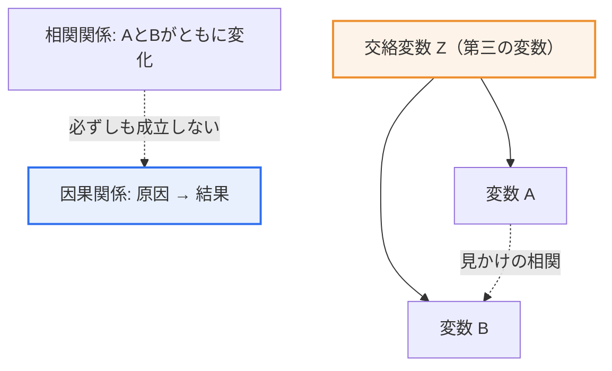
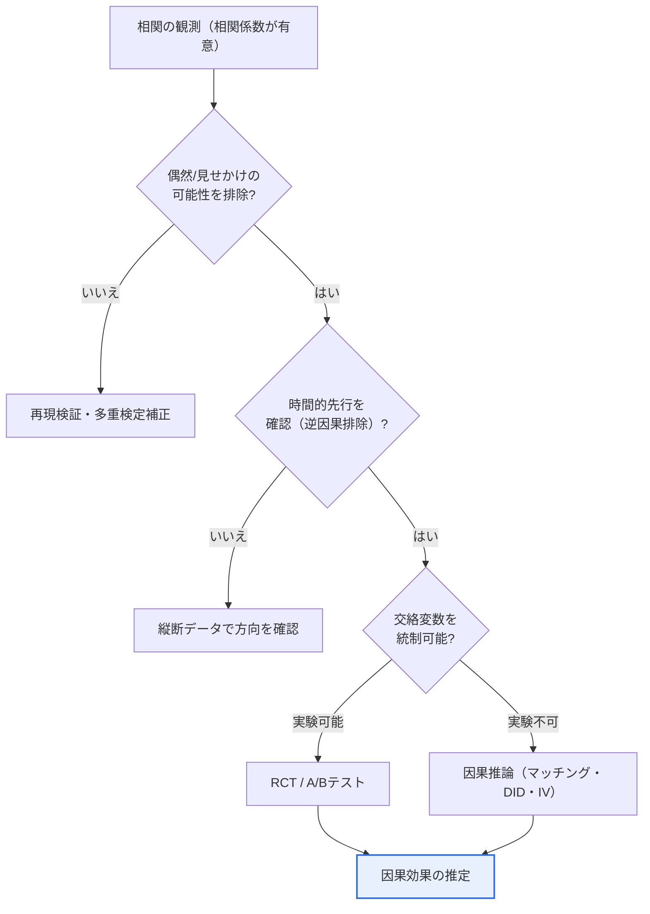

# 相関関係（Correlation）と因果関係（Causation）

## 1. 概要

### A. 定義
> **相関関係**は二つの変数が**ともに変化する傾向**を示す統計的関係であり、**因果関係**は一方の変数（原因）の変化が他方の変数（結果）の変化を**直接引き起こす**方向性のある関係である。データ分析で最も有名な警句である「**相関関係は因果関係を意味しない（Correlation does not imply causation）**」が、二つの概念の関係を凝縮している。

この区別がデータ分析において根本的に重要である理由は、「**相関を因果と取り違えると誤った原因を名指しし、その結果、見当違いの対策に資源を注ぎ込むことになる**」からである。古典的な例として、夏季のアイスクリーム販売量と溺死事故件数は強い正の相関を示す。しかし、アイスクリームの消費が溺死を引き起こすわけではなく、アイスクリームの販売を禁止しても溺死は減らない。二つの現象は、いずれも「夏の暑さ」という隠れた第三の変数（**交絡変数、Confounder**）が同時に押し上げた結果にすぎない。もしこの相関を因果と誤読すれば、「溺死予防のためにアイスクリームを規制しよう」という荒唐無稽な政策が生まれかねない。

二つの変数がともに動くという事実は「何がともに変化するか」を教えてくれるだけであり、「何が何を引き起こすか」という因果の方向と存在には別途の検証（実験または因果推論）が必要である。特に**ビッグデータ時代には変数の数が爆発的に増え、純粋に偶然によって生じる見せかけの相関（spurious correlation）**が無数に観測される。データが多ければ真実が自ずと明らかになるのではなく、むしろ偶然のパターンに欺かれるリスクが大きくなる。そのため、相関と因果を正確に見分ける能力はデータリテラシーの出発点であり、信頼できる意思決定の前提条件となる。

### B. 登場背景および必要性
データ駆動型意思決定（Data-Driven Decision Making）が企業・政府全般に広がるにつれ、分析結果がそのまま政策・投資・製品の決定に直結するケースが増えた。このとき分析者が相関を拙速に因果と解釈すると、組織全体が誤った方向へ動く。例えば「特定のマーケティングチャネルに接触した顧客の購買率が高い」という相関だけを見てそのチャネルに予算を集中させたが、実は「もともと購買意欲の高い顧客がそのチャネルをよく見ていた（逆因果または選択バイアス）」ことが判明すれば、予算は浪費される。また、機械学習モデルは相関を学習するだけで因果を理解しないため、相関のみに依存したモデルは環境が変わると予測力が急激に低下する。したがって、二つの関係を区別し因果を検証する方法論的訓練が、データ分析の専門性の中核要素として求められる。

## 2. 二つの関係の構造と比較

相関と因果の違いは「方向性の有無」と「成立条件」で分かれる。以下の概念図は相関がそのまま因果につながらない構造を、その次の概念図は相関が観測されるさまざまな経路を示す。

この概念図が示す核心は、AとBの間に観測された相関が必ずしも「A→B」または「B→A」という直接の因果を意味しないということである。図において交絡変数ZがAとBを同時に動かすと、AとBは互いに何の因果もなくても強く相関しているように見える（見かけの相関、点線）。相関関係は**方向のない対称的な関係**であるため、AがBの原因なのか、BがAの原因なのか、あるいは両方ともZの結果なのかを、それ自体では区別できない。一方、因果関係は原因から結果へ向かう**非対称的・方向性のある関係**である。

| 区分 | 相関関係 | 因果関係 |
|---|---|---|
| **意味** | ともに変化する傾向 | 原因が結果を引き起こす |
| **方向性** | なし（対称） | あり（原因 → 結果） |
| **測定・検証** | 相関係数（−1 ~ +1） | 実験（RCT）・因果推論 |
| **成立関係** | 因果がなくても成立し得る | 通常は相関を伴う |
| **意思決定上の含意** | 「何がともに変化するか」 | 「何を変えれば結果が変わるか」 |

表を文章で説明すると、相関はピアソンの相関係数のように−1から+1の間の値で「ともに変化する強さ」を定量化できるが、その値が大きいからといって因果の証拠にはならない。逆に、因果が成立すれば通常は相関も観測されるが（原因が変われば結果も変わるため）、その逆は成立しない。この非対称性こそが、二つの概念を混同しやすくしながらも決定的に異なるものにしている点である。

### A. 因果成立の三つの条件
哲学者ジョン・スチュアート・ミル以来、因果関係が成立すると主張するには通常三つの条件がともに満たされる必要があるとされる。第一は**共変（covariation）**、すなわち原因と結果が実際にともに変化しなければならない（相関の存在）。第二は**時間的先行（temporal precedence）**、すなわち原因が結果より時間的に先に発生しなければならない。第三にして最も厄介な条件は**他の説明の排除（non-spuriousness）**、すなわち観測された関係が交絡変数のような第三の要因で説明されてはならないということである。

相関係数はこのうち第一の条件を確認してくれるだけで、第二・第三の条件については何も教えてくれない。特に第三の条件（交絡の排除）は観察だけでは完全に満たすことが難しいため、後述するように実験や精緻な因果推論の手法が必要となる。因果判断が難しい根本的な原因は、まさにこの「排除の難しさ」にある。

### B. 相関係数解釈の注意点
相関を定量化する代表的指標であるピアソンの相関係数は、二つの変数の「線形」関係の強さしか捉えられないという限界がある。二つの変数がU字型のように明確な非線形関係を持つ場合、実際には強く関連していてもピアソンの相関係数は0に近い値になり得る。逆に、少数の極端な外れ値（outlier）が存在すると、実際の傾向とは無関係に相関係数が過大になったり反転したりすることもある。有名なアンスコムの四つ組（Anscombe's quartet）は、相関係数・平均がすべて同一でありながら散布図の形状がまったく異なる四つのデータセットを示し、数値一つを信じるのではなく必ずグラフで分布を確認すべきことを教えてくれる。したがって、相関係数を因果の根拠とする前に、関係の形状・外れ値・標本サイズを併せて検討する慎重さが必要である。

## 3. 相関が因果でない場合と事例

相関が観測されるが直接の因果ではない場合は、大きく三つの類型に整理される。各類型は異なる理由で発生し、対応方法も異なる。

| 類型 | 原理 | 代表事例 |
|---|---|---|
| **交絡変数（共通原因）** | 第三変数ZがA・B双方に影響 | アイスクリーム販売↔溺死（暑さ） |
| **偶然（見せかけの相関）** | 多変量データで偶然に発生 | 特定国のチーズ消費量↔寝具による死亡者数 |
| **逆因果（方向の誤認）** | 因果の方向が実際と逆 | 「病院に頻繁に通う人ほど病気が重い」 |

### A. 交絡変数（共通原因）による見かけの相関
交絡変数による見かけの相関は、三類型の中で最も一般的であり、実務的に危険である。先に挙げたアイスクリーム-溺死の事例のように、一つの共通原因（暑さ）が二つの結果を同時に押し上げると、二つの結果の間に直接の因果がまったくなくても強い相関が観測される。このとき二つの変数のうち一方を人為的に調整しても、他方はびくともしない。アイスクリームの販売を止めても溺死が減らない理由がまさにこれである。

実務では、このような共通原因の構造がいたるところに潜んでいる。「経済規模の大きい都市ほど犯罪件数も、病院数も、コーヒーショップ数も多い」という相関は、人口・都市規模という共通原因があらゆる変数をまとめて押し上げた結果にすぎず、コーヒーショップが犯罪を誘発しているわけではない。マーケティングにおいて「TV広告を多く出した月は売上も高かった」という観測も、繁忙期（祝祭日・年末）という共通原因が広告予算と売上を同時に押し上げたものである可能性がある。対策は、疑わしい交絡変数を事前に特定し、層別化・マッチング・回帰補正によって統制することであり、統制後にも関係が残るかを確認しなければならない。

### B. 偶然による見せかけの相関
偶然による見せかけの相関は、ビッグデータ時代に特に深刻化した落とし穴である。比較する変数の組が数千個あれば、そのうち相当数は何の因果的・構造的関連もないにもかかわらず、純粋に偶然によって高い相関係数を示す。「年別の1人当たりチーズ消費量とベッドシーツに絡まって死亡した人の数」が数年間ともに動いた事例のように、統計的には明確な相関であっても常識的に因果が成立し得ない組み合わせはいくらでも見つかる。

この問題の本質は多重検定（multiple comparisons）にある。関係を多く検定するほど、偶然に「有意に見える」結果が出る確率は高くなる。特定の仮説なしにデータを手当たり次第に探索し、有意な相関だけを選び出すデータ浚渫（data dredging）・pハッキングは、このような偶然を真実として包装してしまう。防御策は、分析前に仮説をあらかじめ定め（事前登録）、多重検定補正（ボンフェローニ法など）を適用し、発見された相関を独立した新しいデータで再現してみることである。

### C. 逆因果（方向の誤認）
逆因果は、原因と結果の方向を逆に指定する誤りである。「病院に頻繁に行く人ほど病気が重い」という相関を見て「病院通いが病気を悪化させる」と結論づけるのが典型である。実際には病気だから病院に行くのであり、因果の矢印は正反対である。同様に「禁煙クリニックを利用した人の肺疾患発症率が高い」という観測も、すでに喫煙の害を経験した人がクリニックを訪れたのであって、方向が逆転している。

逆因果を見抜く核心的な手がかりは、先に見た因果成立条件のうち「時間的先行」である。原因が結果より先に発生したかを時系列・縦断データで確認すれば、方向の判別に役立つ。ただし、二つの変数が互いに影響を及ぼし合う循環構造（フィードバックループ）では前後関係の判別すら容易ではないため、理論的メカニズムへの理解が併せて求められる。

### D. 産業適用事例 — Netflix・EコマースのA/Bテスト
相関と因果の区別が実際の売上を左右する代表的な領域が、デジタルサービスの実験文化である。Netflix・Amazonのような企業は、「どのサムネイルがクリックを誘発するか」「推薦アルゴリズムの変更が視聴時間を伸ばすか」を単純なログの相関で判断しない。ログだけを見ると「大きなサムネイルを見たユーザーほど長く視聴した」という相関が出るかもしれないが、これはもともとそのコンテンツに関心のあったユーザーが大きなサムネイルに接触しただけという選択バイアスである可能性があるからである。

そこで彼らは、ユーザーを無作為に二つのバージョンに割り当てるA/Bテストによって因果効果のみを分離して測定する。例えば数百万人を無作為に分け、一方にだけ新しいUIを表示してコンバージョン率・滞在時間を比較すれば、無作為割り当てのおかげで二つの集団の他の特性が平均的に相殺され、「UI変更が実際に引き起こした差」だけが残る。Eコマースでも、決済ボタンの色や配送案内の文言といった些細な変更を数百件単位で実験し、統計的に有意な因果効果が確認されたものだけを全面適用する。このように「相関を因果と誤認しないための制度的装置」として実験プラットフォームを内製化していることが、データ先進企業の共通点である。

## 4. 深化：因果推論の方法論と最新動向

相関を超えて因果を解明しようとする取り組みは近年データサイエンスの中核テーマとして浮上しており、方法論は大きく実験的アプローチと観察的アプローチに分かれる。

**実験的アプローチの標準は無作為化比較試験（RCT, Randomized Controlled Trial）**である。対象を処置群と対照群に無作為に割り当てると、原因変数を除く残りの条件が二つの集団で平均的に等しくなるため、交絡変数が自動的に統制される。Web・アプリサービスの**A/Bテスト**はまさにこの原理を実務に応用したものであり、ユーザーを無作為に二つのバージョンに接触させ、特定のUI変更がコンバージョン率を実際に「引き起こすか」を因果的に測定する。無作為割り当てという仕組みのおかげで、A/Bテストの結果は単なる相関ではなく因果効果の推定値として解釈できる。

**観察データしかなく実験が不可能または非倫理的な場合**（例：喫煙と肺がんの因果）には、因果推論（Causal Inference）の手法を用いる。代表的には、傾向スコアマッチング（Propensity Score Matching）で処置群と類似した対照群を組み合わせて比較し、差分の差分法（Difference-in-Differences）で政策実施前後・集団間の変化を対比させ、操作変数（Instrumental Variable）や回帰不連続デザイン（RDD）などで交絡を迂回する。近年ではジューディア・パール（Judea Pearl）の**構造的因果モデル（SCM）とdo演算、因果ダイアグラム（DAG）**が理論的基盤として広く引用され、機械学習と結合した**因果機械学習（Causal ML）**が個別化された処置効果（HTE）の推定などで活発に研究されている。ただし、観察データに基づく因果推論は「測定されていない交絡変数は存在しない」という強い仮定に依存するため、結果の解釈にあたっては仮定の妥当性を併せて検討し、断定を避ける慎重さが必要である。

以下の概念図は、観測された相関から出発して因果の有無を判定する実務的な意思決定フローを整理したものである。相関を発見してもすぐに因果と結論づけず、代替的な説明を順に排除したうえで、実験の可否に応じて検証経路を分ける。

このフローの核心は、因果の判定が「一回の統計検定」ではなく「代替的な説明を一つずつ消去していく過程」であるという点にある。偶然を排除し、方向を確認し、交絡を統制するという三つの関門をすべて通過して初めて、因果を慎重に主張することができる。どれか一つの関門でも飛ばせば、先に見たアイスクリーム-溺死式の誤りに陥るリスクが残る。

このような方法論はドメインごとに異なる形で適用される。医学・疫学では無作為割り当てが非倫理的な場合が多いため、コホート研究・症例対照研究とブラッドフォード・ヒル（Bradford Hill）の因果判断基準（関連の強さ・一貫性・用量反応など）を併用して因果を総合的に判断する。経済学・政策評価では自然実験（natural experiment）と差分の差分法・回帰不連続デザインが広く用いられ、IT・マーケティングではA/Bテストが事実上の標準である。各分野が異なるツールを発展させた理由は、「実験の可能性」と「倫理的制約」が分野ごとに異なるからであり、いずれの場合も目標は同じである — 交絡を排除し、原因の純粋な効果を分離することである。

## 5. 考慮事項および示唆点

1. **因果検証の最も確実な方法は実験（RCT・A/Bテスト）である。** 無作為割り当てが交絡変数を統制してくれるため、可能な状況では観察分析に先立って実験設計を優先的に検討すべきである。実験が因果の「ゴールドスタンダード（gold standard）」と呼ばれる理由はここにある。
2. **実験が不可能であれば因果推論の手法で交絡を統制する。** 傾向スコアマッチング・差分の差分法・操作変数・構造的因果モデル（DAG）などを活用しつつ、各手法が要求する識別仮定（交絡の不在、平行トレンドなど）が成立しているかを必ず併せて検討する。
3. **ビッグデータ時代の見せかけの相関の落とし穴を警戒する。** 変数が多いほど偶然の相関が激増するため、相関を発見してもすぐに結論づけず、「なぜそうなるのか」という因果的メカニズムと再現可能性を検証すべきである。多重検定補正、事前の仮説登録といった抑制装置がデータ浚渫を防ぐ。
4. **意思決定と予測モデルの設計に因果的視点を内在化する。** 「何を変えれば結果が変わるか」という介入（intervention）の問いに答えなければならない政策・処方的意思決定では、相関に基づく予測ではなく因果効果の推定が必要である。また、相関のみに依存したモデルは分布の変化に脆弱であるため、頑健なモデルのためには因果的に安定した変数を特定することが望ましい。

## 参考資料
- Judea Pearl, "The Book of Why: The New Science of Cause and Effect"
- Tyler Vigen, "Spurious Correlations"（見せかけの相関の事例集）

---

> **一言まとめ**: 相関関係は*二つの変数がともに変化する対称的な傾向*、因果関係は*原因が結果を引き起こす方向性のある関係*であり「相関≠因果」である。交絡変数・偶然（見せかけの相関）・逆因果のために相関だけでは因果を断定できないため、**無作為化実験（RCT・A/Bテスト）や因果推論の手法で因果を別途検証**して初めて信頼できる意思決定が可能となる。
