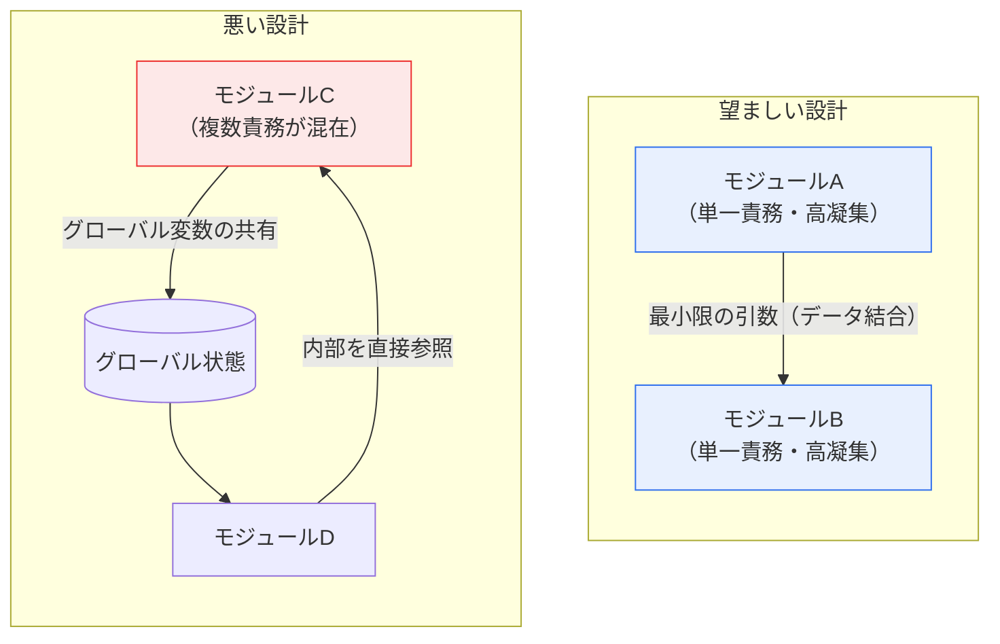

# ソフトウェア結合度（Coupling）の種類

## 1. 概要

### A. 定義
> **結合度（Coupling）**は、あるモジュールが他のモジュールに**依存する度合い**を示す尺度であり、低いほど良い設計である。対になる概念である**凝集度（Cohesion）**は、一つのモジュール内部の構成要素が**一つの目的に向かってどれだけ密接に関連**しているかを示し、高いほど良い。優れたモジュール設計の大原則は「**低結合（Low Coupling）・高凝集（High Cohesion）**」に要約される。

結合度と凝集度は、1970年代に構造化設計（Structured Design）を確立したラリー・コンスタンティン（Larry Constantine）とエドワード・ヨードン（Edward Yourdon）が提示した概念であり、半世紀を経た現在でも手続き型・オブジェクト指向・マイクロサービスに至るあらゆる設計議論の根幹となっている。この二つの尺度が長く生き残ってきた理由は、ソフトウェアの本質的な難題である「**変更（Change）**」を正面から扱うからである。ソフトウェアは一度作って終わりではなく、要求の変化に合わせて絶えず修正され、開発コスト全体の半分以上が保守段階で発生するというのが通説である。このとき、システムが変更にどれだけ耐えられるかを決定する二つの軸が、まさに結合度と凝集度である。

結合度がソフトウェア品質の中核的な尺度である理由は、「**あるモジュールの変更が他のモジュールへ波及する効果（Ripple Effect）**」を直接左右するからである。モジュール同士が強く絡み合っていると（高結合）、一か所を修正する際に接続された複数のモジュールが一緒に壊れ、修正範囲の予測が難しくなり、回帰欠陥（Regression）が頻発する。例えば、決済モジュールが会員モジュールの内部変数構造を直接参照していれば、会員モジュールの些細なリファクタリングだけで決済が停止しかねない。逆に結合度が低ければ各モジュールが独立しているため、修正・交換・再利用・単体テストが容易になる。結合度はモジュールが「何を介して」つながるかによって複数の段階に分けられ、後ろの段階ほど結合が弱く望ましい。

### B. 結合度管理の必要性
ソフトウェアが大きくなり長く保守されるほど変更は頻繁になるが、結合度が高いと小さな変更でも連鎖的な障害を招く。結合度を下げる設計は保守性・再利用性・テスト容易性・拡張性を確保する根本原理であり、それはそのまま開発生産性とシステム寿命に直結する。結合度を下げる努力は単なる理論上の美徳ではなく、変更コストを統制し障害の伝播を遮断しようとする、きわめて実用的な工学活動である。

## 2. 結合度の種類（強い結合 → 弱い結合）

結合度は伝統的に六段階に区分される。下図は、最も悪い内容結合から最も望ましいデータ結合へ向かうほど結合が弱くなるスペクトラムを示す。

**内容結合（Content Coupling）**は最も強く悪い結合であり、あるモジュールが他のモジュールの**内部コードやデータを直接参照・変更**したり、正規の入口（インタフェース）を経由せずにモジュール内部へ分岐して入り込んだりする場合である。これはモジュールの境界を完全に崩壊させ、対象モジュールの内部を少し変えただけで参照していたモジュールが即座に壊れる。カプセル化に真っ向から違反するため、いかなる状況でも避けるべきである。例えば、AモジュールがBモジュールのローカル変数のアドレスを直接操作するコードが典型である。

**共通結合（Common Coupling）**は、複数のモジュールが**グローバル変数（Global Data）**を共有して相互作用する場合である。グローバル変数一つの構造を変えれば、それを使うすべてのモジュールを一緒に修正しなければならず、どのモジュールがいつ値を変えたのかを追跡しにくいため、デバッグが極めて困難になる。一般に「グローバル状態（Global State）の罠」と呼ばれる問題であり、規模が大きくなるほど副作用（Side Effect）の原因となる。

**外部結合（External Coupling）**は、複数のモジュールが外部で定義された**データ形式・通信プロトコル・デバイスインタフェース**などを共有するときに発生する。例えば、複数のモジュールが特定のファイルフォーマットや外部APIの仕様に一緒に縛られていると、その形式が変わったときに関連モジュールが同時に影響を受ける。外部仕様への依存であるため避けられない面もあるが、アダプタ層で隔離して影響範囲を狭めることが望ましい。

**制御結合（Control Coupling）**は、あるモジュールが他のモジュールに**制御信号（フラグ・スイッチ）**を渡し、受け取ったモジュールの内部動作の流れを左右する場合である。例えば `process(data, mode)` において、`mode` の値によって呼び出された関数がまったく異なるロジックに分岐するなら、呼び出し側は呼び出される側の内部ロジックを知っている必要があるため、結合が強くなる。これは凝集度の低い（論理的凝集の）モジュールでよく同時に見られる。

**スタンプ結合（Stamp Coupling）**は、モジュール間で**データ構造（レコード・オブジェクト）全体を渡すが、実際にはその一部のフィールドしか使わない**場合である。不要なフィールドまで受け渡しインタフェースに露出するため、データ構造が変わるとそのフィールドを使わないモジュールまで影響を受ける可能性がある。データ結合よりは強いが制御結合よりは弱い、比較的良好な段階である。

**データ結合（Data Coupling）**は最も望ましい結合であり、モジュール間で**本当に必要なデータ（プリミティブなパラメータ）だけ**を引数としてやり取りする場合である。インタフェースが最小限かつ明確であるため互いの内部を知る必要がなく、一方を変えても他方への影響は引数仕様の範囲に限定される。設計が目指すべき到達点である。

| 結合度 | 接続の媒介 | 結合の強さ | 問題/特徴 |
|---|---|---|---|
| **内容結合** | 他モジュールの内部を直接参照・変更 | 最悪 | カプセル化の破壊、絶対回避 |
| **共通結合** | グローバル変数の共有 | 強い | 副作用・追跡困難 |
| **外部結合** | 外部形式・プロトコル・デバイス | 強い | 仕様変更時に同時に影響 |
| **制御結合** | 制御フラグで相手の動作を左右 | 中程度 | 内部ロジックの露出 |
| **スタンプ結合** | データ構造全体を渡す（一部のみ使用） | 弱い | 不要フィールドの露出 |
| **データ結合** | 必要なパラメータのみ渡す | 最善（良好） | インタフェースが最小・明確 |

## 3. 凝集度との関係および相互作用

結合度は凝集度と対にして判断しなければならない。良い設計とは、モジュール内部は一つの責務でしっかりまとまり（高凝集）、モジュール間は最小限だけつながる（低結合）構造である。興味深いのは、二つの指標が互いを引き寄せ合うという点である。凝集度の高いモジュールは「一つのこと」だけを行うため、外部とやり取りするものが明確になり自然に結合度が低くなる。逆に凝集度が低く複数のことを混在して行うモジュールは、あちこちと絡み合って結合度が高くなる。

凝集度もまた低い順から高い順に七段階に分けられ、最も高いのは一つの機能だけを遂行する**機能的凝集（Functional Cohesion）**である。各段階は、モジュール内の要素が「どのような理由でまとめられているか」によって区分される。

| 凝集度 | まとめられる理由 | 強さ |
|---|---|---|
| **偶発的（Coincidental）** | 何の関連もなく偶然に集まる | 最悪 |
| **論理的（Logical）** | 性質の類似した機能を一か所に（フラグで選択） | 低い |
| **時間的（Temporal）** | 同じ時点に実行（初期化など） | 低い |
| **手続き的（Procedural）** | 実行順序に従ってまとまる | 中程度 |
| **通信的（Communicational）** | 同じデータを使用・生成 | 中程度 |
| **逐次的（Sequential）** | ある要素の出力が次の入力 | 高い |
| **機能的（Functional）** | ただ一つの目的のために協力 | 最善 |

結合度6段階と凝集度7段階を併せて見る理由は、どちらか一方だけが良くても良いモジュールにはならないからである。データ結合だけを重視して凝集度を放置すると、インタフェースはきれいでもモジュール内部が混乱した設計になり、凝集度だけを重視してグローバル変数を乱用すると、モジュールは堅固でもシステム全体が絡み合う。興味深いことに「論理的凝集」のモジュールはフラグで動作を選択する場合が多く、しばしば「制御結合」を伴うが、これは低い凝集度が高い結合度を招くという相関関係をよく示している。

## 4. 事例と実務的含意

具体的に、オンラインショッピングモールの「注文処理」と「在庫管理」を例に挙げてみよう。**悪い設計**では、注文モジュールが在庫モジュールの使用するグローバル在庫変数を直接読み取り、減少させる（共通・内容結合）。この場合、在庫管理の方式を「リアルタイム差し引き」から「予約後確定」に変えると注文モジュールのコードも一緒に修正しなければならず、同時実行性の問題まで重なって障害が広がる。**良い設計**では、注文モジュールが在庫モジュールに `reserveStock(商品ID, 数量)` という明確な引数だけを渡し（データ結合）、内部の処理方式は在庫モジュールが自ら決定する。そうすれば、在庫ロジックがどう変わろうともインタフェースさえ維持されれば注文モジュールは影響を受けない。

この違いが実務で重要な理由は、「**変更の隔離**」の成否に直結するからである。結合度が低ければ変更・障害の影響範囲がモジュール境界の中に閉じ込められ、回帰テストの範囲が縮小し、デプロイのリスクが下がる。実際に大規模システムをマイクロサービスに分解する動機の一つも、サービス間の結合をAPIに限定し、各サービスを独立してデプロイ・スケーリング・障害隔離できるようにすることである。逆に結合度の高いモノリシックなコードでは、あるチームの修正が別のチームの機能を壊し、デプロイがボトルネックになりがちである。

二つ目の事例として、複数の画面が共通して参照する「**ユーザーセッション情報**」をグローバルオブジェクトとして置き、各モジュールが直接読み書きする場合を考えてみよう。最初は便利に見えるが（共通結合）、ログイン方式をセッションベースからトークンベースに切り替えた瞬間、そのグローバルオブジェクトを触っていた数十個のモジュールをすべて探し出して修正しなければならない。どのモジュールがいつセッション値を変えたのかを追跡しにくく、断続的に発生する認証バグの原因究明だけで数日かかることもある。これをセッション照会・更新インタフェースを持つ別モジュールでラップしてデータ結合に転換すれば、認証方式の変更による影響はその一つのモジュールの中に閉じ込められる。

三つ目に、結合度は**テスト容易性（Testability）**とも直結する。あるモジュールが他のモジュールの内部実装やグローバル状態に強く依存していると、そのモジュールだけを切り離して単体テストすることが難しい。テストのために依存先全体を準備しなければならないからである。逆に、インタフェースを通じたデータ結合で設計されたモジュールは、そのインタフェースを模倣する**モックオブジェクト（Mock/Stub）**で容易に置き換えて独立にテストできる。すなわち、低結合は自動テストと継続的インテグレーション（CI）の前提条件でもある。

結局のところ、結合度はコード一行の問題ではなく、開発組織の作業方式やデプロイのリズムまでを規定する構造的特性である。強い結合は「一緒に変わらなければならないもの」を増やして変更単位を肥大化させ、弱い結合は変更を局所化して複数の人が並行して安全に作業できるようにする。

## 5. 深化：現代アーキテクチャへの拡張と最新動向

結合度・凝集度は手続き型時代の概念であるが、その原理は現代の設計思想にそのまま継承・拡張されている。オブジェクト指向の**SOLID原則**のうち、単一責任の原則（SRP）は凝集度を、依存性逆転の原則（DIP）とインタフェース分離の原則（ISP）は結合度を下げるための具体的な指針である。**依存性注入（Dependency Injection）**は、具象クラスではなく抽象（インタフェース）に依存させることで結合を緩やかにする代表的な手法である。

結合度を定量化しようとする試みも続いてきた。代表的には、オブジェクト指向メトリクス（CK Metrics）の**CBO（Coupling Between Objects）**が、あるクラスが結合している他のクラスの数を数えて結合度を測定するものであり、この値が大きいほど変更の影響や欠陥密度が高くなる傾向が実証研究で報告されている。このような指標は、リファクタリングの優先順位を決めたり、アーキテクチャが時間の経過とともにどれだけ絡み合っていくかを追跡したりする根拠として活用される。

マイクロサービスアーキテクチャ（MSA）では、結合度がサービス境界設計の第一原則となる。ドメイン駆動設計（DDD）の**境界づけられたコンテキスト（Bounded Context）**でサービス境界を分割し、サービス間はよく定義されたAPI・イベントのみで通信させることで結合を下げる。特に、同期呼び出しの代わりにメッセージキュー・イベントベースの**疎結合（Loose Coupling）**を志向するイベント駆動アーキテクチャ（EDA）は、サービスが互いの存在や可用性に直接依存しないようにして障害の伝播を遮断する。ただし、サービスを過度に細かく分割すると、かえってネットワーク呼び出しが絡み合う「分散モノリス（Distributed Monolith）」となり結合度がむしろ高まる可能性があるため、結合度の観点からの境界設計が何よりも重要である。近年では、このようなアーキテクチャ上の結合を静的解析・依存関係グラフで測定し、循環依存や過度なファンイン/ファンアウトを自動検出するツールも広く活用されている。

## 6. 考慮事項および示唆点（技術士の観点）

1. **データ結合を志向し、強い結合を排除する。** モジュール間では本当に必要なデータだけをパラメータとしてやり取りし、インタフェースを最小かつ明確に保つべきである。グローバル変数の共有（共通結合）や内部の直接参照（内容結合）は設計負債につながるため、コードレビュー・静的解析の段階で排除すべきである。

2. **情報隠蔽・カプセル化・インタフェース設計と連携する。** モジュールの内部実装を隠蔽し、公開されたインタフェースのみで通信させれば、結合度は自然に下がる。「何を公開し、何を隠すか」を決定するインタフェース設計こそが、結合度管理の中核的な手段である。

3. **結合度・凝集度はともに管理すべきトレードオフの均衡点である。** どちらか一方だけを最適化しても良いモジュールにはならない。高い凝集度は低い結合度を誘導するため、単一責務を守るモジュール分割が二つの指標を同時に改善する最も効果的な戦略である。

4. **アーキテクチャレベルへ拡張して適用する。** MSA・レイヤードアーキテクチャ・イベント駆動アーキテクチャ、依存性注入、DDDの境界設定は、いずれも結合度を下げようとする原理の拡張である。低結合は、独立デプロイ・スケーリング・障害隔離・並行開発を可能にするアーキテクチャ上の基盤となる。

5. **過度な分割の逆効果を警戒する。** 結合を下げようとしてモジュール・サービスを過度に細かく分けると、相互呼び出しが増えてかえって複雑度と結合が増大する分散モノリスになり得る。結合度は「とにかく下げる」ものではなく、凝集度・運用の複雑さとのバランスの中で最適点を見つけるべき設計判断である。

## 参考資料
- Stevens, Myers, Constantine, "Structured Design", IBM Systems Journal, 1974 — https://ieeexplore.ieee.org/document/5388187
- Martin, R. C., "Clean Architecture / SOLID Principles" — https://blog.cleancoder.com/
- Wikipedia, "Coupling (computer programming)" — https://en.wikipedia.org/wiki/Coupling_(computer_programming)

---

> **一言まとめ**: 結合度はモジュール間の依存の度合いであり、*内容>共通>外部>制御>スタンプ>データ*の順に弱くなる（データ結合が最善）。「低結合・高凝集」の設計原理は変更の波及を隔離して保守・再利用・テストを容易にし、SOLID・DI・MSAなど現代のアーキテクチャへそのまま拡張される。
