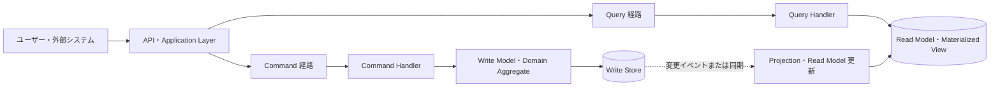
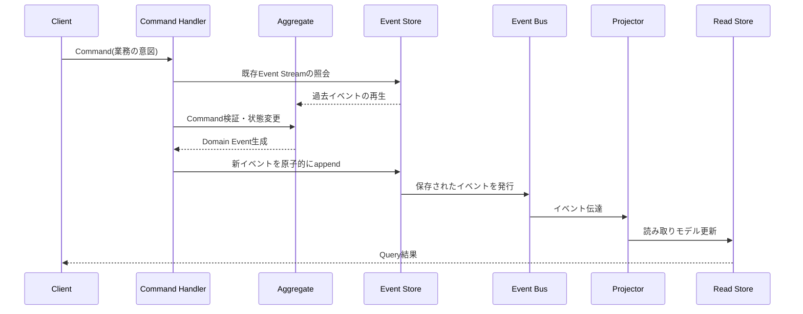

# CQRSとイベントソーシング（Command Query Responsibility Segregation・Event Sourcing）

## 1. 概要

### A. 定義

> **CQRS（Command Query Responsibility Segregation）**は、一つのデータモデルにおいて読み取り（Query）と書き込み（Command）の責務を分離し、それぞれの目的に適したモデル・処理フロー・性能戦略を適用するアーキテクチャパターンである。
>
> **イベントソーシング（Event Sourcing）**は、現在の状態だけを更新して保存するのではなく、状態を変化させたドメインイベントを時系列順に追記し、必要なときにイベントの再生によって状態を再構成する永続化パターンである。

CQRSとイベントソーシングはよく一緒に使われるが、同じ概念ではない。
CQRSの核心は読み取りモデルと書き込みモデルの責務分離であり、一般的なリレーショナルデータベースを両側に使ってもCQRSになり得る。
イベントソーシングの核心はデータ変更の事実をappend-onlyのイベントとして保存することであり、読み取りと書き込みを必ず別モデルに分けなければならないわけではない。
両者を組み合わせると、書き込み側はドメインルールを検証してイベントを記録し、読み取り側はイベントをプロジェクションして照会に最適化されたビューを作る。

従来のCRUDシステムは、一つのテーブルの現在の行を読み取って修正する方式に慣れている。
この方式は業務が単純で即時一貫性が重要な場合には効率的であるが、読み取りと書き込みの負荷特性が大きく異なる場合や、変更履歴そのものが重要な場合にはモデルが複雑になる。
例えば注文の状態だけを `配送完了` で上書きすると、誰がいつどのルールで状態を変えたのか、それ以前にどのような決済や在庫の出来事があったのかを復元することが難しい。
CQRSとイベントソーシングは、こうした問題をデータの保存方式と業務モデルの観点から再設計する選択肢である。

### B. 登場背景と必要性

第一に、読み取りと書き込みの最適化目標が互いに異なる。
書き込みは不変条件と同時実行制御を守らなければならないため、正規化されたドメインモデルと短いトランザクションが有利な場合がある。
一方、読み取りは画面・レポート・検索ごとに必要なデータが異なり、結合コストを減らすために非正規化された照会モデルが有利な場合がある。
一つのモデルに両方の要求を載せると、書き込みルールを損なわずにすべての照会画面を高速にすることは難しい。

第二に、サービスの規模と機能が大きくなるほど、状態変更の意味を保存する必要が生じる。
金融取引、在庫移動、ポイント付与、権限変更のように「現在の値」だけでは監査・紛争・精算を説明しにくい領域では、変更の事実と順序が重要な資産となる。
イベントソーシングは出来事を原本として残し、過去時点の状態や判断根拠を再計算できるようにする。
ただし、すべてのテーブルをイベントに置き換えることが目的ではなく、変更履歴の業務価値と運用コストを併せて評価しなければならない。

第三に、マイクロサービス・イベント駆動アーキテクチャでは、サービス内部の状態変更を他のサービスと疎につなぐ必要がある。
注文サービスが注文作成の事実を発行すれば、在庫・決済・通知サービスがそれぞれのモデルを作ることができる。
しかし非同期の伝達は即時一貫性の代わりに遅延一貫性を生むため、ユーザーが見る画面と最終状態の差をどのように説明し補正するかまで設計しなければならない。

## 2. CQRSの概念と構造

### A. 論理構造

Commandはシステムの状態を変えようとする意図を表現する。
`商品数量変更` のように保存領域のフィールドを直接指示するよりも、`注文確定`、`決済承認`、`予約取消` のように業務行為を表す命令として設計すれば、ドメインルールを一か所で検証しやすくなる。
命令は成功・失敗を返すことができるが、命令処理中にどのような出来事が発生したかはイベントとして別途記録できる。

Queryは状態を変更せず、照会に必要な表現を返す。
照会モデルは画面やレポートが要求する形にあらかじめ組み合わせたDTOを保持でき、このモデルにインデックス・検索エンジン・キャッシュを適用しても、書き込みモデルの整合性ルールと直接衝突しない。
ただし、Queryがデータを変更しないというルールは技術的に守るだけでなく、照会時に暗黙的なカウンタの増加や最終アクセス時刻の更新を入れないという設計原則まで含む。

CQRSは分離のレベルに応じてさまざまな形で実装される。
最も弱い形は、一つのデータベースの中で命令用サービスと照会用サービスを論理的に分けることである。
中間の形は同一の元データを二つのモデルにマッピングする方式であり、強い形は書き込みストアと読み取りストアを物理的に分離し、イベントや変更データキャプチャ（CDC）で接続する方式である。
分離のレベルが高くなるほど独立したスケーラビリティと照会最適化は向上するが、デプロイ・監視・データ一貫性の負担は大きくなる。

### B. 構成要素別の役割

| 構成要素 | 責務 | 設計の焦点 |
|---|---|---|
| Command | 状態変更の意図を伝達 | 業務用語、妥当性、冪等性 |
| Command Handler | 命令の調整とトランザクション境界の設定 | 権限、重複処理、エラー返却 |
| Write Model | 不変条件とドメインルールの執行 | Aggregate、同時実行性、整合性 |
| Query | 必要な情報を要求 | 照会契約、フィルタ、ページネーション |
| Read Model | 照会に最適化された状態を提供 | 非正規化、インデックス、検索性能 |
| Projector | 元の変更を読み取りモデルに反映 | 順序、再処理、重複防止 |
| Event Store または Write Store | 変更の永続化 | 原子性、保存、バージョン、バックアップ |

Command Handlerは単なるコントローラではない。
認証された呼び出し元の権限を確認し、Aggregateをロードし、命令が現在のバージョンにおいて有効かを判断し、成功した変更を一つのトランザクション境界の中で保存しなければならない。
外部決済やSMS送信のようにトランザクションの外にある処理をハンドラ内で直接実行すると、保存の成功と外部呼び出しの成功の順序がずれる可能性があるため、後述するOutboxやプロセスマネージャが必要となる。

Read Modelは原本のコピーではなく、特定の問いに答えるための投影結果である。
注文一覧画面は顧客別の注文要約と最新状態だけが必要な場合があり、精算画面は決済・返金・税金情報を幅広く必要とする場合がある。
二つの画面が異なる読み取りモデルを持ってもよく、読み取りモデルは再生成可能な派生データであるという前提を明確にすれば、スキーマを業務の変化に合わせて変えやすくなる。

### C. CQRS適用の効果と限界

読み取りと書き込みを分離すれば、照会トラフィックが急増したときに読み取りモデルだけを水平スケールできる。
検索・集計中心の画面をElasticsearchやカラム型ストアに合わせて作り、命令側はトランザクションに強いストアを使うこともできる。
また、書き込みモデルはドメインルールの表現に集中し、照会モデルはユーザー体験の表現に集中するため、それぞれのコードの意図が明確になる。

しかし、分離そのものが性能を保証するわけではない。
プロジェクションの遅延、メッセージブローカーのボトルネック、照会モデルのインデックス設計、ネットワークの往復が全体の応答時間を延ばす可能性がある。
読み取りストアと書き込みストアの両方を運用すれば、バックアップ・障害復旧・スキーマ変更・アクセス権限を二つの体系に適用しなければならない。
したがって、現在のシステムのボトルネックがモデルの結合によるものなのか、単なるインデックス・クエリ・キャッシュの問題なのかをまず測定すべきである。

## 3. イベントソーシングの動作原理

### A. イベント中心の状態管理

イベントソーシングでは、`現在残高 = 100,000ウォン` という結果だけを保存する代わりに、`入金 150,000ウォン`、`出金 50,000ウォン` のように状態を変えた事実の流れを保存する。
イベントはすでに発生した事実であるため、一般に過去形の名前を用い、保存後に内容を修正しない不変オブジェクトとして扱う。
同一Aggregateのイベントは順序を持ち、Aggregateを再構築する際にはその順序どおりに適用する。

イベントストアは単なるメッセージキューとは異なる。
キューは消費されたメッセージを削除したり、配信保証の範囲が異なったりする場合があるが、イベントストアは業務の原本として長期保存・再生・バージョン管理・照会が必要である。
逆に、イベントストアをすべての統合メッセージの無期限保管庫にすると個人情報とコストの問題が大きくなるため、業務イベント、統合イベント、技術ログの保存目的を分離しなければならない。

### B. Aggregateとイベントストリーム

Aggregateは、一回の命令に対して一貫性ルールをまとめて検証しなければならないドメインオブジェクトの集まりである。
注文Aggregateの中で注文状態と注文明細の関係を原子的に検証することはできるが、注文・在庫・決済全体を一つの巨大なAggregateにまとめると、同時実行のボトルネックとサービス間の結合が大きくなる。
Aggregateの境界はデータベーステーブルの境界ではなく、業務の不変条件とトランザクション境界によって判断する。

各Aggregateは識別子ごとのイベントストリームを持つことができる。
新しい命令が入ると該当ストリームを読み取って現在の状態を作り、現在のバージョンと命令が期待するバージョンを比較して楽観的同時実行制御を適用する。
二人のユーザーが同じ座席を予約しようとする場合、最初のappendがバージョンを上げ、二番目のappendを拒否することで重複予約を防ぐことができる。
再試行時に同じ命令IDを確認すれば、ネットワークタイムアウトによる重複処理も減らすことができる。

### C. イベント設計の要素

| 要素 | 意味 | 例 |
|---|---|---|
| Event ID | イベントのグローバル識別子 | UUID |
| Aggregate ID | イベントが属する業務オブジェクト | order-2026-0818-001 |
| Stream Version | Aggregate内部の連番 | 17 |
| Event Type | 発生した業務上の事実の種類 | OrderConfirmed |
| Occurred At | 業務上の発生時刻 | タイムゾーンを含む時刻 |
| Payload | 事実を再生するためのデータ | 金額、通貨、商品識別子 |
| Metadata | 追跡・セキュリティ・相関情報 | correlation ID, actor |

イベントのPayloadは「現在値を保存したスナップショット」ではなく、再生に必要な事実を含まなければならない。
例えば注文金額を現在の商品価格で再計算すると、価格変更後に過去の注文の結果が変わってしまう可能性があるため、注文時点の単価・税金・割引ポリシーのバージョンをイベントに残すべきである。
逆に、住民登録番号のような機微情報をすべてのイベントに複製すると削除や保存ポリシーを守りにくくなるため、トークン化・参照の分離・暗号化・フィールドの最小化を適用する。

### D. 再生とスナップショット

イベント数が増えると、毎回最初からストリーム全体を再生するコストが大きくなる。
スナップショットは、特定のバージョンまで再生したAggregateの状態を保存し、それ以降のイベントだけを適用してロード時間を短縮する最適化である。
スナップショットは真の原本ではなく派生したキャッシュであるため、破損したり古くなったりした場合にはイベントから再作成できなければならない。
スナップショットの作成時点と適用したイベントのバージョンを併せて保存し、スナップショットが現在のストリームより先行していないかを検証する。

イベントの再生は、新しい読み取りモデルを作る際にも使われる。
既存のイベントを順番にProjectorへ入力し、検索用インデックスや監査用画面を再作成できる。
このとき、現在稼働中のProjectorと再生用Projectorのコードバージョンが異なると結果が変わる可能性があるため、プロジェクションのバージョンとイベントスキーマのバージョンを記録しなければならない。
再生は運用トラフィックとストアの負荷を増加させる可能性があるため、別のコンシューマグループ、速度制限、チェックポイント、失敗イベントの保管庫を設計する。

## 4. CQRSとイベントソーシングの組み合わせ運用

### A. 全体の処理フロー

クライアントが `注文確定` 命令を送ると、API層は形式検証と認証を行う。
Command Handlerは命令の重複有無と権限を確認した後、注文Aggregateのイベントストリームを読み取る。
Aggregateは現在の状態において在庫予約の有無、決済状態、注文の期限切れの有無を検証し、条件を満たせば `OrderConfirmed` イベントを作成する。
イベントストアは期待バージョンを確認してイベントを原子的にappendし、成功したイベントだけを後続のプロジェクションに伝達する。

Projectorはイベントを受け取り、注文一覧、顧客画面、精算ビューなど一つ以上のRead Modelを更新する。
各Read Modelは同じイベントを異なる方法で解釈できるため、画面ごとの要件を書き込みモデルに無理に反映させる必要がない。
照会はRead Modelで処理し、命令直後に照会モデルがまだ更新されていない場合には、処理中の状態・バージョン・再照会の案内をユーザーに提供する。

### B. 一貫性と障害処理

CQRSとイベントソーシングを組み合わせた構造の代表的な特性は、書き込みの原本と読み取りの投影の間の結果整合性（最終的一貫性）である。
イベントのappendが成功した瞬間に業務の原本は変わっているが、ネットワークやProjectorの遅延のため、画面には以前の状態がしばらく残る可能性がある。
この遅延を隠すと、ユーザーは決済が失敗したと誤解したり同じ命令を繰り返したりする可能性があるため、リクエストIDと処理状態を照会する別の状態モデルを提供するのが安全である。

Projectorは少なくとも1回の配信（at-least-once）を前提に、冪等に実装するのが一般的である。
イベントIDとAggregateのバージョンを保存してすでに処理したイベントをスキップし、部分更新の途中で失敗した場合は同じイベントを再処理しても最終結果が同じになるようにする。
順序が重要なストリームではAggregate IDごとの順序を保証し、順序が入れ替わったイベントは保留キューに送るか、現在のバージョンを確認してから再試行する。

外部システムとの連携ではOutboxパターンが有用である。
業務データと発行するメッセージを同じローカルトランザクションで記録した後、別の発行器がメッセージブローカーへ伝達すれば、データは保存されたがイベントが発行されないという二重書き込み問題を減らすことができる。
ただし、イベントストア自体が発行機能と原子的に結合している場合は別途のOutboxが重複となり得るため、ストアの配信保証と運用特性をまず確認する。

失敗したイベントは原因を追跡できるように保管する。
無条件に再試行すると、誤ったデータや無効なイベントが処理キューを塞ぐ可能性があるため、再試行回数・バックオフ・隔離キュー・運用者による再処理手順を区別する。
再処理する際は元のイベントを修正せず、新たな補正イベントを発行する方式によって監査可能性を維持する。

### C. イベントのバージョンとスキーマ進化

イベントは長期間保存されるため、今日のクラス構造を明日もそのまま読み取れるという仮定をしてはならない。
フィールドを追加する際は既存のコンシューマが無視できるよう任意フィールドとして追加し、フィールドの意味を変える際は新しいイベント種別や明示的なバージョンで区別する。
既存のイベントをすべて一括修正すると、過去の事実の不変性と監査証跡を損なう恐れがある。

イベントのアップキャスティングは過去のイベントを読み取る時点で現在の形式に変換する方法であり、マイグレーションは新しいイベント形式や新しいストリームに変換して保存する方法である。
アップキャスティングは原本の保存が容易だが変換コードが蓄積し、マイグレーションは消費を単純化できるが大規模な再処理と検証が必要となる。
互換性ルールには、ProducerとConsumerのデプロイ順序、必須フィールド、enumの追加、削除ポリシーを含めなければならない。

## 5. 従来のCRUD・CQRS・イベントソーシングの比較

### A. パターン別の違い

| 区分 | 従来のCRUD | CQRS | イベントソーシング | CQRSとイベントソーシングの組み合わせ |
|---|---|---|---|---|
| 元データ | 現在状態の行 | 実装により現在状態 | 不変のイベントストリーム | イベントストリームと投影 |
| 読み取り・書き込みモデル | 概ね同一 | 分離 | 必ずしも分離しない | 明確に分離 |
| 履歴の復元 | 別途監査ログが必要 | 別途設計 | 自然に可能 | イベント再生で可能 |
| 一貫性 | 強い一貫性が容易 | 同期・非同期を選択 | 再生・投影方式により異なる | 書き込みは強く、読み取りは結果整合性が可能 |
| 複雑度 | 低～中 | 中～高 | 高 | 最も高くなり得る |
| 適した状況 | 単純業務・即時照会 | 読み取り/書き込み特性が異なる業務 | 変更事実と再生が核心の業務 | 高負荷・監査・複数ビューの業務 |

表から分かるように、CQRSはイベントソーシングを包含する上位概念ではない。
CQRSはモデルと責務の分離であり、イベントソーシングは永続化方式の選択であるため、両者を独立した軸として判断しなければならない。
例えば、現在の状態を書き込みDBに保存して照会DBに複製するシステムはCQRSであるが、イベントソーシングではない場合がある。
逆に、イベントストリームを再生して一つの現在状態オブジェクトを作るシステムはイベントソーシングであるが、読み取り・書き込みモデルを分離していない場合がある。

### B. 同期処理と非同期処理

同期CQRSは、命令処理後に同一リクエスト内で読み取りモデルまで更新し、ユーザーに最新の結果を即座に返す方式である。
実装が単純でユーザー体験が予測可能であるが、読み取りモデルが複数ある場合や外部システムが含まれる場合には命令処理時間が長くなる。
また、読み取りモデル更新の失敗を命令の失敗とみなすのか、後で補正するのかというポリシーを決めなければならない。

非同期CQRSは、イベントを保存した後にProjectorが別途読み取りモデルを更新する。
書き込みの応答を速くし、コンシューマを独立してスケールできるが、イベントの遅延・重複・順序・再処理と、ユーザーに見える状態の差を管理しなければならない。
ほとんどの業務では、すべての経路を非同期にするよりも、強い即時一貫性が必要な命令と遅延を許容できる付加的なプロジェクションを分離するのが現実的である。

### C. 適用の判断基準

| 判断の問い | 適用を検討すべきシグナル | 導入を遅らせるべきシグナル |
|---|---|---|
| 読み取りと書き込みの負荷は異なるか | 照会が書き込みよりはるかに多い、またはパターンが多様 | 負荷とモデルが単純 |
| 変更履歴は業務資産か | 監査・紛争・時点照会が重要 | 現在状態だけが必要 |
| ドメインルールは複雑か | Aggregateの不変条件と命令の意図が明確 | 単純な登録・照会が中心 |
| 結果整合性を受け入れられるか | 処理中状態と再試行が許容される | 決済・在庫のように即時整合性が核心 |
| 運用能力は整っているか | メッセージング・可観測性・再処理体制がある | バックアップ・監視の人員が不足 |

この基準は、技術の流行よりも業務リスクを優先させる。
例えば、読み取り画面が多くても単純なインデックスとキャッシュで解決できるのであれば、CQRSを導入する必要はない。
逆に、顧客との紛争において過去の意思決定と変更主体を再現しなければならないのであれば、イベントソーシングの追加コストは監査価値によって相殺され得る。

## 6. 適用事例

### A. 座席予約と注文処理の事例

コンサートの座席予約システムでは、`座席選択` と `予約確定` を別の命令としてモデリングする。
予約確定のCommand Handlerは、座席Aggregateの現在のバージョンと予約の有効期限を確認し、他のユーザーが先に予約していれば命令を拒否する。
成功すれば `SeatHeld` や `ReservationConfirmed` のようなイベントを順番に記録し、座席照会モデルは該当座席を `予約済み` として投影する。

座席状況画面は非常に多くのユーザーが照会するため、読み取りモデルをキャッシュや検索ストアに置くことができる。
しかし最終的な購入可否は、キャッシュの画面値だけを信じるのではなく、命令側のAggregateとバージョン検証によって決定しなければならない。
画面が一時的に `空きあり` と表示されていても確定時点で失敗し得るというポリシーをユーザーに明確に伝え、失敗時には代替座席を案内すれば、結果整合性による不便を軽減できる。

### B. 金融取引と監査の事例

金融ウォレットサービスは、入金・出金・振替・手数料徴収をイベントとして残すことができる。
現在残高のRead Modelはイベントを順番に反映した結果であり、日次残高・取引明細・リスク集計はそれぞれ別のProjectorが作ることができる。
監査担当者は特定時刻までのイベントを再生して残高を再現し、取引の主体・承認フロー・相関IDを追跡できる。

金融取引では重複処理が致命的であるため、命令IDと外部取引IDを冪等キーとして管理する。
イベントを保存したからといって外部銀行APIの呼び出しが成功したわけではないため、外部連携は状態機械と再試行ポリシーで分離する。
補正が必要な場合は既存の出金イベントの金額を変えるのではなく、`WithdrawalReversed` のように逆の効果を持つ新たな事実を記録することで、元帳と監査証跡が一致する。

### C. 物流と分析ビューの事例

物流システムでは、`商品入庫`、`ピッキング完了`、`積載完了`、`配送出発`、`配送完了` のイベントが配送Aggregateのフローを構成し得る。
運用画面は現在の配送状態と到着予定時刻を素早く表示し、分析画面は地域・運送会社・遅延原因別にイベントを集計する。
一つの正規化された注文テーブルですべての画面を処理する代わりに、業務別の読み取りモデルを作れば、照会要求が互いに影響し合うことが少なくなる。

このとき、イベントの順序と重複の処理を誤ると、配送状態が過去の段階へ戻ってしまう可能性がある。
ProjectorはAggregate IDごとの最終処理バージョンと許可された状態遷移を検証し、遅れて到着したイベントは保留するか補正手順へ送る。
配送完了後の住所変更のように時間の順序が業務上の意味を変える場合には、イベントの発生時刻と受信時刻の両方を保存して判断根拠を分離する。

## 7. 導入手順とテスト戦略

### A. 段階的導入

1. **業務候補の選定**: 変更履歴・複数照会・ドメインルールが実際に価値を持つ、限定されたAggregateから選ぶ。
2. **現行フローの調査**: 命令、状態変更、外部連携、監査要求、照会SLAと障害処理方式を一覧化する。
3. **イベント言語の定義**: 業務ですでに使われている過去形の事実をもとに、Event TypeとPayloadを合意する。
4. **書き込みモデルの構築**: Aggregate境界、不変条件、同時実行バージョン、命令の冪等性をまず実装する。
5. **原子的保存の保証**: イベントのappendとバージョン検証のトランザクション境界を確認する。
6. **一つの読み取りモデルから投影**: 運用に必須の画面を一つ選定し、遅延・重複・再処理を検証する。
7. **可観測性と運用自動化**: イベント遅延、コンシューマlag、失敗キュー、再処理件数、スキーマエラーをダッシュボード化する。
8. **段階的拡張**: 安定したイベントを他の読み取りモデル・外部サービスへ拡張し、各コンシューマの契約をバージョン管理する。

パイロットは、決済全体のように失敗コストの大きい領域よりも、履歴価値がありながら補正可能な業務から始めるほうが安全である。
ただし、パイロットは実際の運用特性の縮図でなければならないため、メッセージの遅延・重複・再起動・スキーマ変更まで意図的にテストすべきである。
既存のCRUDを一度に廃棄するよりも、イベントと既存状態を並行して記録し、読み取りモデルを比較検証した後にトラフィックを段階的に切り替える方法が現実的である。

### B. テスト項目

| テスト領域 | 検証内容 |
|---|---|
| ドメインテスト | 命令ごとの不変条件、許可された状態遷移、生成イベント |
| 再生テスト | 同一のイベントストリームが同一のAggregate状態を作るか |
| 同時実行テスト | 期待バージョンの衝突と重複命令の処理 |
| プロジェクションテスト | イベントの順序・重複・再起動後の最終結果 |
| 契約テスト | イベントスキーマとConsumerの互換性 |
| 障害テスト | ブローカーの遅延、ストアの障害、失敗キューの再処理 |
| 性能テスト | appendスループット、再生時間、照会遅延、lag |
| セキュリティテスト | イベントのアクセス権限、機微情報のマスキング、監査ログ |

再生テストは、単にコードカバレッジを高めることよりも重要である。
過去のイベントを新バージョンのドメインコードで再生したときに結果が変わるなら、それはスキーマバージョン・アップキャスティング・ドメインルール変更に関するポリシーが必要であるというシグナルである。
プロジェクションテストでは、同じイベントを二回伝達しても結果が一回処理した場合と同じでなければならず、途中で失敗して再起動しても最終状態が収束するかを確認しなければならない。

## 8. 深化：イベント駆動アーキテクチャとの連携

CQRSとイベントソーシングはイベント駆動アーキテクチャとよく組み合わされるが、イベントを発行すればすべてイベントソーシングになるわけではない。
統合イベントは他のシステムに通知するための契約であり、ドメインイベントはAggregate内部で業務上の事実を表現し、イベントソーシングのイベントは元の状態を再生するための永続的な記録である。
三つのイベントを同じ名前とPayloadで無条件に共有すると、内部モデルの変更が外部契約の変更へと波及する可能性がある。
内部のドメインイベントから外部の統合イベントを別途マッピングする境界を設ければ、結合度を下げることができる。

Microsoft Azure Architecture Centerは、CQRSを読み取り・書き込み操作を別モデルに分離するパターンとして説明し、イベントソーシングと組み合わせる場合はイベントストアを書き込みの原本とし、イベントから読み取りモデルを作ると説明している（[Microsoft CQRS Pattern](https://learn.microsoft.com/en-us/azure/architecture/patterns/cqrs)、[Microsoft Event Sourcing Pattern](https://learn.microsoft.com/en-us/azure/architecture/patterns/event-sourcing)）。
Martin FowlerもCQRS自体は読み取りと書き込みのモデルの分離であり、イベントソーシングと必然的に同一ではないと区別している（[Martin Fowler CQRS](https://martinfowler.com/bliki/CQRS.html)、[Martin Fowler Event Sourcing](https://martinfowler.com/eaaDev/EventSourcing.html)）。
この区別は、技術士の答案において二つのパターンを単に一括りで暗記するのではなく、適用目的とコストを分けて説明する根拠となる。

実務的には、イベントストリームを組織の長期的な元帳として使うほどデータガバナンスが重要になる。
イベントの所有者、保存期間、アクセス権限、暗号鍵、個人情報の有無、削除・マスキングの法的手続きをデータ分類体系と結びつけなければならない。
イベントが不変であるという原則は個人情報を永久に保存しなければならないという意味ではないため、識別子の分離・暗号鍵の破棄（クリプトシュレッディング）・保存期間満了時の派生モデル削除といったポリシーを設計する必要がある。

## 9. 考慮事項および示唆点

### A. 業務適合性の優先

CQRSとイベントソーシングは複雑性をなくす技術ではなく、複雑性を明示的なモデルと運用手順へ移す技術である。
読み取りと書き込みが単純な業務に導入すると、ストア・メッセージ・プロジェクションの運用コストだけが増え、チームの理解負担が大きくなる可能性がある。
履歴・再現・複数ビュー・独立したスケーリングが実際のビジネス価値につながるかについて、定量的・定性的な基準を併せて設定すべきである。

### B. 一貫性境界の明確化

書き込み原本の強い一貫性と読み取りモデルの結果整合性を、業務ごとに区別しなければならない。
決済承認、在庫引当、座席確保は命令側の原子性と同時実行制御が優先であり、検索・統計・通知は遅延と再処理を許容できる。
すべてのデータを一つのグローバルトランザクションで束ねようとするよりも、Aggregateと補償・補正プロセスで境界を設計する。

### C. 運用可能性の確保

イベント遅延、コンシューマlag、失敗キュー、スキーマエラー、再生所要時間をサービスレベル指標として管理しなければならない。
監視がなければ、読み取りモデルが古い状態なのか、イベントが失われたのか、Projectorが繰り返し失敗しているのかを把握しにくい。
再処理の権限と承認、チェックポイントのバックアップ、障害時の読み取りモデル再生手順を運用マニュアルと自動化ツールに反映する。

### D. データ保護と監査

イベントは長期間保存されるため、一般的なログよりも高い保護レベルが必要な場合がある。
機微情報をイベントのPayloadに直接入れず、最小限の収集・トークン化・フィールド暗号化・アクセス権限の分離を適用する。
監査目的の追跡可能性と個人情報の削除・保存義務が衝突し得るため、元帳・識別情報・派生照会モデルの保存ポリシーを分離し、法務・個人情報担当者と合意する。

### E. 進化可能な契約

イベントは生産者と複数の消費者を結びつけるため、一つのチームのリファクタリングが全体のデプロイを強制しないよう、スキーマ互換性ルールを設ける。
フィールドの追加・削除・意味変更、イベントの命名、バージョンアップ、廃止時期を契約テストとレジストリで管理する。
新しい消費者に必要な情報が既存イベントにない場合は、既存イベントの意味を変えるよりも、新しいイベントや別の統合イベントを定義するほうが安全である。

### F. 技術士の観点からの示唆

技術士は「分離すればスケールする」という断片的な長所よりも、分離によって生じる遅延一貫性・重複・再処理・データガバナンスのコストまで答案に含めるべきである。
アーキテクチャ意思決定記録（ADR）には、業務目標、品質特性、代替案の比較、適用範囲、移行戦略、失敗時の復旧方策を残さなければならない。
今後、イベント駆動システムとデータプラットフォームが連携するほど、元イベントの品質・契約・セキュリティが分析と運用の共通基盤となるため、アプリケーション設計とデータガバナンスを併せて捉える視点が必要である。

## 参考資料

- Microsoft, “CQRS Pattern”: https://learn.microsoft.com/en-us/azure/architecture/patterns/cqrs
- Microsoft, “Event Sourcing Pattern”: https://learn.microsoft.com/en-us/azure/architecture/patterns/event-sourcing
- Martin Fowler, “CQRS”: https://martinfowler.com/bliki/CQRS.html
- Martin Fowler, “Event Sourcing”: https://martinfowler.com/eaaDev/EventSourcing.html

---

> **一言まとめ**: CQRSは読み取り・書き込みの責務を分離し、イベントソーシングは状態変化の事実を原本として保存するため、両者を組み合わせる際はスケーラビリティと再現性だけでなく、結果整合性・運用の複雑さ・データ保護まで併せて設計しなければならない。
