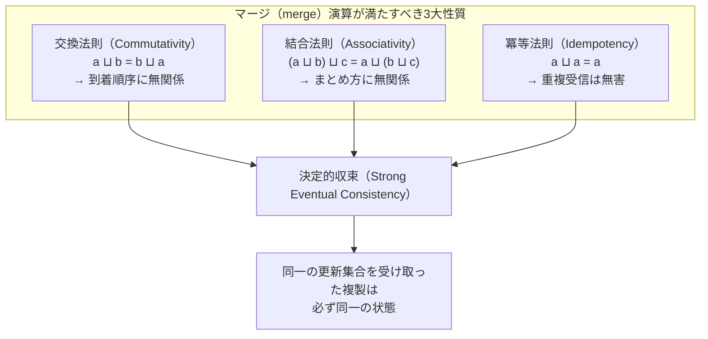
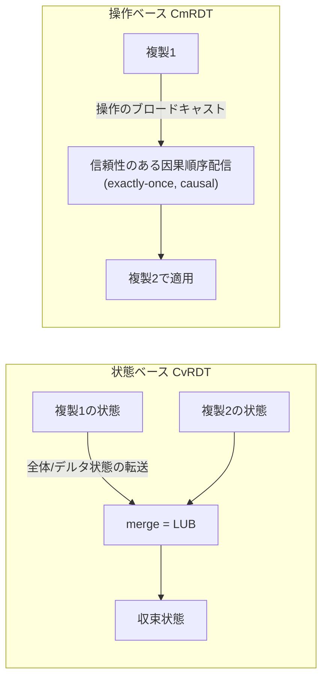
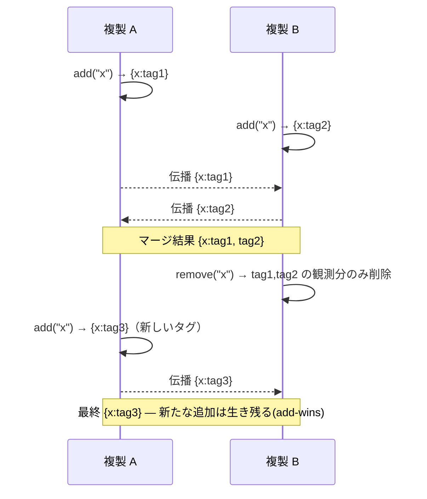

# CRDT（衝突のない複製データ型）

## 1. 概要

### A. 定義

> **CRDT（Conflict-free Replicated Data Type、衝突のない複製データ型）**とは、複数の複製（Replica）がそれぞれ独立に更新を行い、任意の順序で互いの変更をやり取りしても、更新がすべての複製に伝播しさえすれば、**中央の調整者や合意プロセスなしに数学的に必ず同一の最終状態へ収束（Strong Eventual Consistency, SEC）**するよう設計された複製データ構造である。

CRDTは2011年にMarc Shapiro、Nuno Preguiçaらが体系化した概念であり、分散システムにおける「ノード同士が毎回合意することなく、どうすれば一貫性を保証できるか」という古くからの難題に対する代数（algebra）ベースの解法である。今日ではRedis（Active-Active CRDB）、Riak、Azure Cosmos DBのような分散データストア、Figma・Google Docs・Apple Notesのようなリアルタイム協調編集ツール、そしてAutomerge・Yjsのようなローカルファースト（Local-first）ライブラリの中核エンジンとして定着している。

### B. 登場背景と必要性

分散複製環境で複数のノードが同じデータを同時に変更すると、必然的に**衝突（conflict）**が発生する。従来の解法は二つに分かれていた。一つはPaxos・Raftのような**強い合意（consensus）**によって書き込みごとに過半数ノードの同意を得る方式であり、一貫性は確実だがネットワークの往復が必須であるため遅延が大きく、分断（partition）時には可用性を放棄しなければならない。もう一つは「最終書き込み優先（LWW, Last-Write-Wins）」のようにタイムスタンプで一方を捨てる方式であり、実装は簡単だが**先に書かれた更新が気づかれないまま失われる**という問題がある。

CAP定理が示すように、ネットワーク分断が存在する限り、一貫性（C）と可用性（A）を同時に完全に得ることはできない。CRDTはこのジレンマにおいて**可用性と分断耐性（AP）を選びつつ、強い結果整合性（SEC）という形で一貫性の相当部分を取り戻そう**とするアプローチである。核心となるアイデアは、マージ（merge）演算を**交換法則・結合法則・冪等法則**を満たすよう代数的に設計することである。この三つの性質が成り立てば、更新の到着順序・重複・遅延に関係なく結果が一意に定まるため、ノードは互いを待ったり調整したりする必要なく、オフラインでも自由に編集し、後で自動的にマージできる。協調編集ツールで二人のユーザーが同じ文を同時に修正してもデータが壊れない理由は、まさにこの収束保証にある。

### C. 主要な特徴

CRDTの特徴は四つに集約される。第一に、**調整不要の更新（coordination-free update）** — 書き込み時に他ノードとの通信が不要なため遅延が小さく、オフラインでも動作する。第二に、**決定的な収束** — 同じ更新集合を受け取った複製は、マージ順序に関係なく必ず同じ状態になる。第三に、**分断耐性** — ネットワークが切断されても各断片が独立してサービスを続け、復旧時に自動でマージされる。第四に、**自動的な衝突解消** — 衝突をエラーとみなさず、データ構造のマージ規則が決定的に吸収する。これらの特徴は、強い不変条件の強制や即時のグローバル一貫性を放棄した代償として得られたものであるため、導入時には**何を得て何を差し出すのか**を明確に認識しなければならない。

## 2. 収束の数学的基盤 — 半束（Semilattice）

CRDTが「衝突なし」を保証する根拠は、状態空間が**結び半束（Join Semilattice）**を成し、マージ演算がその上の**最小上界（Least Upper Bound, LUB）**を計算するという点にある。半束においてマージ演算 ⊔ は次の三つの性質を満たす。

交換法則はメッセージがどの順序で到着しても結果が同じであることを、結合法則はどのようにまとめてマージしても結果が同じであることを、冪等法則は同じメッセージを何度受け取っても（再送・重複）結果が変わらないことを保証する。三つの性質が同時に成り立てば、状態は束の上で**単調増加（monotonic）**し、異なる経路で進化した複製も同じ更新集合を受け取れば、束上の同一の最小上界で必ず出会う。これが「合意なしに収束する」というCRDTの主張の核心となる証明である。

この代数的性質が実務にもたらす含意は大きい。ネットワークがメッセージを並べ替え・重複・遅延させても、さらにはノードが数日間オフラインだった後に復帰しても、溜まった更新を順序に関係なく流し込むだけで整合性が回復する。すなわちCRDTは、**不安定なネットワークを正しさの前提から性能上の変数へと格下げ**するのである。

ただし注意すべき点は、この保証が「**伝達されさえすれば**」という条件付きであることである。CRDTは更新が最終的にすべての複製に到達するという**結果的伝播（eventual delivery）**を前提としているため、永久に隔離された複製や、失われて再送されない更新までは救済できない。したがって実務では、アンチエントロピー（anti-entropy）同期や定期的な状態交換によって「いつか必ず伝達される」ことを保証する伝播層を、CRDTと必ず併せて設計する。

## 3. 二つの実装方式 — 状態ベース（CvRDT）と操作ベース（CmRDT）

CRDTは、複製間で「何をやり取りするか」によって二つの系統に分かれる。一つは状態全体（またはデルタ）をやり取りする**状態ベース（State-based, CvRDT）**であり、もう一つは個々の操作をブロードキャストする**操作ベース（Operation-based, CmRDT）**である。二つの方式は理論的には相互に変換可能であるが、転送量・ネットワークの前提・実装難度において実務的なトレードオフが明確である。

**状態ベース**では、複製が自身の状態全体を定期的に隣接ノードへ送り、受信側がマージ関数で二つの状態の最小上界を取る。マージが冪等・交換・結合的であるため**メッセージの消失・重複・並べ替えに強く**、ゴシップ（gossip）プロトコルのような緩やかな伝播の上でも安全である。欠点は状態全体を送ると転送量が大きくなる点であり、これを緩和したのが変更分だけを送る**デルタ状態CRDT（Delta-state CRDT）**で、Redis Active-Activeなどが採用している。

**操作ベース**は「要素の追加」「カウンタ +1」のような個々の操作だけを伝播するため、帯域効率が良い。その代わり、正しさのために配信層が**正確に一回（exactly-once）・因果順序（causal order）での配信**を保証しなければならないという強い前提を課す。操作が重複して適用されると（例：カウンタの増加が二回）結果が壊れるからである。リアルタイム協調編集ツールはこの系統を好んで用いるが、再接続時に取りこぼした操作を順番に再生するログ・バージョンベクタの仕組みを併せて備える。

二つの方式を分ける実務上の基準は、**ネットワークの前提と転送量のバランス**である。ゴシップ・再送が日常的な緩やかなインフラ（モバイル・エッジ・P2P）では消失・重複に無害な状態ベースが安全であり、ブローカーが順序・配信を堅牢に保証するバックエンド環境では帯域効率の良い操作ベースが有利である。例えば5つのノードが毎秒数万件更新するカウンタを状態ベースで毎回全体転送すると負担が大きいが、デルタ状態CRDTで「変更された項目の分」だけを送れば、転送量を数十分の一に減らしつつ状態ベースの堅牢さを維持できる。Redis Active-Activeがデルタ状態方式を採用したのも、この均衡点のためである。

### A. 因果関係の追跡 — バージョンベクタの役割

CRDTが「並行（concurrent）更新」と「因果的に先行する（happens-before）更新」を区別するには時間の順序を知る必要があるが、物理時計はノード間の誤差のため信頼できない。そのため、ほとんどのCRDTはノードごとの論理カウンタを集めた**バージョンベクタ（Version Vector）**または**ドット（dot）**をマージの根拠として用いる。二つの更新のバージョンベクタが互いを包含しなければ「並行発生」と判定してマージ規則（add-wins、多値保存など）を適用し、一方が他方を包含すれば最新のものだけを残す。

この仕組みは正しさの根幹であると同時に、**メタデータ増加の源泉**でもある。ノード数が多くなるほどバージョンベクタは長くなり、OR-Setのタグ・トゥームストーンと組み合わさると状態が膨張する。したがって実務では、安定化したドットを定期的に整理（compaction）したり、ノード識別子を再利用可能な短いIDで管理したりするなど、**因果関係メタデータのライフサイクル管理**が設計の必須要素となる。

## 4. 代表的なCRDTの類型と動作

最も単純な例は**G-Counter（Grow-only Counter）**である。ノードごとに自分の分のカウンタを別々に持って増加させ、全体の値はすべてのノードの分の合計、マージは各項目の最大値を取る。最大値は交換・結合・冪等的であるため、収束が保証される。

具体的に、ノードA・B・Cが「いいね」の数を集計するとしよう。各ノードは `{A:_, B:_, C:_}` ベクタを持ち、自分の項目だけを増やす。Aが3回、Bが2回増やした後に互いの状態を交換すると、Aは `{A:3,B:0,C:0}`、Bは `{A:0,B:2,C:0}` を持つ。マージは項目ごとの最大値であるため、二つの状態を合わせると両方とも `{A:3,B:2,C:0}` となり、合計は5で一致する。ここでAの状態がネットワークの問題でBに二回到着しても、最大値演算の冪等性のおかげで結果は `{A:3,...}` から変わらない — **重複受信が無害**という性質が数字として現れる部分である。減少までサポートするには、増加用・減少用の二つのG-Counterを束ねた**PN-Counter**を用いる（全体の値 = 増加の合計 − 減少の合計）。このようなカウンタは、閲覧数・いいね・在庫のように**正確な合計が必要だが一時的な不一致は許容される**指標の集計に広く用いられる。

集合（Set）系はより微妙である。**G-Set**は追加のみ可能で単純だが、削除をサポートした瞬間に「追加と削除が同時に起きたらどちらが勝つのか」という問題が生じる。**2P-Set**は一度削除すると再追加できないという制約があり、実務でよく使われる**OR-Set（Observed-Remove Set）**は、各追加に固有のタグを付け、削除は「観測したそのタグ」だけを消すようにすることで、**追加優先（add-wins）**の意味を自然に実装する。

OR-Setの設計意図をもう少し詳しく説明すると、削除とは「特定の要素をなくす」ことではなく、「**これまでに自分が観測したこの要素の追加タグを無効化する**」という精密な意味を持つ。そのため、あるノードが削除を伝播している間に別のノードが新しいタグで同じ要素を追加すると、その新しいタグは削除対象に含まれないため要素は生き残る。このadd-winsセマンティクスは、協調編集において「自分が今再び入れた項目が他人の削除のせいで消える」という直感に反するデータ消失を防ぐ。逆に削除優先が必要なドメイン向けの変種（remove-wins）も存在するため、**業務上の意味に合った勝敗規則を選択**することが設計のポイントである。以下は、同時の追加・削除がOR-Setでマージされる流れである。

テキストの協調編集には**シーケンスCRDT**（RGA、LSEQ、Logoot、YjsのYATAなど）を用いる。各文字に稠密な順序を与える**位置識別子（position identifier）**を付与し、二人のユーザーが同じ地点に同時に入力しても挿入位置が決定的に整列されるようにする。レジスタ系としては、並行書き込みをタイムスタンプで一つだけ残す**LWW-Register**と、衝突した値をすべて保存して上位層に解消させる**MV-Register（Multi-Value）**がある。

これらの基本型は互いに組み合わされて、より複雑な構造を作る。代表的には**OR-Map**が、キーごとに値として別のCRDT（カウンタ・集合・レジスタ・入れ子のマップ）を持ち、キーごとに再帰的にマージする。こうすればJSON文書一件全体を一つのCRDTとして表現でき、協調アプリにおいて文書の任意のフィールドを複数のユーザーが同時に修正しても、フィールド単位で安全にマージされる。Automergeが目指す「JSONそのものがCRDT」というモデルはまさにこの再帰的合成の結果であり、個々のデータ型を超えて**アプリケーション状態全体を複製対象**に引き上げるという点で意義が大きい。

| 類型 | 代表的なCRDT | マージ規則（要旨） | 主な用途 |
|------|-----------|------------------|---------|
| カウンタ | G-Counter / PN-Counter | ノードごとの値の最大値・合計 | 閲覧数・いいね・在庫 |
| 集合 | G-Set / 2P-Set / OR-Set | 和集合、タグベースの削除 | タグ・ショッピングカート・フォロー |
| レジスタ | LWW-Register / MV-Register | タイムスタンプの最大値 / 多値保存 | 設定値・プロフィール項目 |
| シーケンス | RGA / LSEQ / YATA | 位置識別子の順序で整列 | 協調文書・コード編集 |
| マップ | OR-Map | キーごとの下位CRDTを再帰マージ | JSON文書・構造化状態 |

## 5. 比較 — CRDT vs 合意（Raft/Paxos） vs OT

CRDTを理解するには、代替技術との違いがなぜ生じるのかを押さえる必要がある。**強い合意（Raft/Paxos）**は書き込みごとに過半数の同意を要求し、**線形化可能性（linearizability）**という最強の一貫性を提供するが、その代償として書き込みごとにネットワークの往復が必要となり、分断時には少数派が書き込みを停止する。一方CRDTは**ローカルで即座に書き込み、後でマージ**するため遅延がなくオフライン編集が可能であるが、一時的に複製間で状態が異なる場合があり（結果整合性）、「残高は絶対に負になってはならない」といった**グローバル不変条件（global invariant）を強制できない。**そのため、銀行の残高振替のように強い不変条件が必要な場所には合意が、協調・集計のように可用性が優先される場所にはCRDTが適している。

協調編集ツールの長年の競合技術である**OT（Operational Transformation、Google Docs初期の方式）**とも対比される。OTは操作を相手の操作を基準に「変換」して順序を合わせるが、変換関数の組み合わせの場合の数が多いため実装が複雑であり、通常は**中央サーバ**を前提とする。CRDTはデータ構造自体に順序を内蔵し、サーバなしでも（P2P）収束するためローカルファーストアーキテクチャに有利であるが、削除タグ・トゥームストーン（tombstone）などの**メタデータが蓄積**してメモリをより多く使うという弱点がある。実際にFigmaは独自の変種CRDTを、Google DocsはOTを維持するなど、選択が分かれる理由はここにある。

まとめると、三つの技術の違いは「調整コストをいつ支払うか」に要約される。合意は**書き込み時に前払い**で調整コスト（ネットワーク往復・過半数待ち）を支払って強い一貫性を購入し、OTは**中央サーバが実行時に**変換コストを支払い、CRDTは**データ構造の設計時に**マージ規則を代数的に固定して実行時の調整をなくす。その代わりCRDTは、設計時に引き受けたメタデータ・セマンティクス選択の負担を運用期間中ずっと背負うことになる。どの技術も絶対的な優位にはなく、**一貫性要求の強さ・遅延予算・オフラインの必要性・チームの実装能力**という軸で選択しなければならない。

## 6. 深化 — 実務適用事例と最新動向

実務においてCRDTの採用は急速に広がっている。**Redis EnterpriseのActive-Active（CRDB）**は、地理的に離れた複数のデータセンターがそれぞれローカル書き込みを受けて低遅延でサービスしながらも、バックグラウンドでCRDTマージして収束する構造であり、グローバルなセッション・ショッピングカート・リーダーボードに用いられる。**Riak**は初期からカウンタ・集合・マップのCRDTを第一級のデータ型として提供し、**Azure Cosmos DB**はマルチリージョン書き込みの衝突解消オプションとしてLWW・カスタムマージを提供している。協調ツールの側では、**Figma**が大規模な同時編集を、**Linear・Notion系**がオフライン編集後のマージをCRDTベースで処理している。

ライブラリのエコシステムも成熟した。JavaScript陣営の**Yjs**は文書・配列・マップ・テキストのCRDTを高性能に提供し、Web協調編集ツールにおける事実上の標準となっており、**Automerge**はJSON文書全体をCRDTとして扱い、変更履歴・元に戻す（undo）までサポートする。初期のシーケンスCRDTは文字ごとにメタデータが付くため、文書サイズの数倍に及ぶ保存オーバーヘッドが指摘されていたが、最近の実装は連続した挿入を一つのブロックにまとめ、バイナリエンコーディングを適用してオーバーヘッドを大幅に削減した。最近の流れは二つである。第一に、トゥームストーン・タグのメタデータによる**空間オーバーヘッドを削減する圧縮・ガベージコレクション**の研究（例：安定化した操作のタグ整理）が活発である。第二に、**ローカルファーストソフトウェア（Local-first）**運動と結びつき、ネットワークなしでも完全に動作し、接続されれば自動同期されるアプリケーションアーキテクチャの基盤技術として浮上している。

情報管理技術士の観点からの予想出題方向としては、①CRDTの定義とSEC保証の原理（半束・3大性質）を論ぜよ、②状態ベースと操作ベースの違いと適用基準を比較せよ、③CAP・合意アルゴリズムとの関係の中でCRDTの位置づけを説明せよ、④リアルタイム協調/マルチリージョンDBのシナリオでCRDTを適用する際の考慮事項を提示せよ、などが有力である。答案構成は「定義→収束原理→類型→代替技術との比較→適用戦略」の順に展開すれば、深さと構造を同時に確保できる。

## 7. 考慮事項および示唆点

- **適用ドメインの選別が最優先である。** CRDTは「同時更新を自動マージしても意味が損なわれない」データ（集計・タグ・文書内の位置）に適している。残高・在庫上限のように強いグローバル不変条件が必要なドメインには不適であるため、**CRDT（可用性優先）と合意（一貫性優先）をデータ特性ごとに併用**するハイブリッド設計が現実的である。

- **メタデータ・トゥームストーンの管理が運用の核心的なトレードオフである。** OR-Set・シーケンスCRDTは削除・順序情報をタグとして蓄積するため、長期運用時にメモリ・ストレージ容量が膨張する。**安定化時点の判断後のガベージコレクション・状態圧縮・スナップショット**戦略を設計段階で必ず含めなければならず、これをおろそかにすると性能低下につながる。

- **意味的衝突（semantic conflict）は依然として上位層の役割である。** CRDTはデータ構造レベルの収束は保証するが、「二人が同じフィールドを異なる値に修正したとき、どちらの値が業務上正しいか」は判断できない。MV-Registerで衝突値を保存し、**ユーザー・業務ルールが最終的に解消**するよう、UX・ポリシーを併せて設計しなければならない。

- **配信層の前提と可観測性を明確にせよ。** 操作ベースのCRDTはexactly-once・因果順序配信を前提とするため、メッセージング基盤（ブローカー・バージョンベクタ）の信頼性が正しさに直結する。マージの遅延・収束の有無を監視する**可観測性（収束指標・複製遅延・タグ増加率）**の体制を整えてこそ、障害を早期に捕捉できる。

- **標準化・相互運用性はまだ発展途上である。** CRDT実装ごとにエンコーディング・マージ規則がまちまちであるため、ライブラリ間の互換性は限定的である。ローカルファーストアーキテクチャを導入する際には**特定ライブラリへのロックイン（lock-in）**リスクを評価し、データフォーマット・移行経路をあらかじめ確保しておくことが中長期的に重要である。

- **セキュリティ・検証の観点も並行して検討すべきである。** P2P・オフラインマージの構造では、悪意のあるノードが改ざんされた更新を注入したりタグを偽造したりする余地があるため、更新に対する**署名・アクセス制御・監査ログ**を上位層に置かなければならない。また、マージ規則の正しさは代数的性質に依存するため、カスタムCRDTを設計する際には交換・結合・冪等性を**プロパティベーステスト（property-based testing）**で検証し、収束が実際に成立するかを確認する手順が必須である。

## 参考資料

- Shapiro, Preguiça, Baquero, Zawirski, "Conflict-free Replicated Data Types", INRIA RR-7687, 2011. https://inria.hal.science/inria-00609399
- Redis Enterprise, "Active-Active geo-distributed Redis (CRDBs)". https://redis.io/docs/latest/operate/rs/databases/active-active/
- Yjs 公式ドキュメント. https://docs.yjs.dev/
- Automerge 公式サイト. https://automerge.org/
- Kleppmann et al., "Local-first software". https://www.inkandswitch.com/local-first/

---

> **一言まとめ**: CRDTはマージ演算を交換・結合・冪等的に設計することで、中央の合意なしにもすべての複製が同一状態へ収束（SEC）することを保証する複製データ型であり、リアルタイム協調編集やマルチリージョンデータストアのように可用性・オフライン編集が重要な領域で、合意アルゴリズムの代替として広く用いられている。
