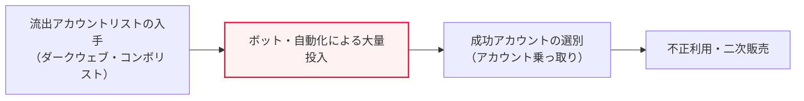
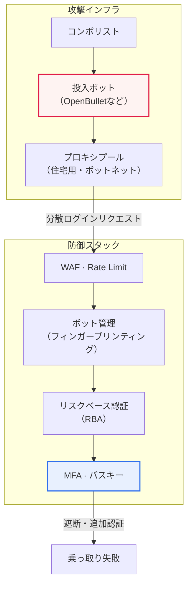

# クレデンシャルスタッフィング（Credential Stuffing）

## 1. 概要

### A. 定義

> 他のサイトから**流出したアカウント・パスワードのリストを自動化ツールで複数のサイトに投入**し、ログインを試みる攻撃。ユーザーが複数のサービスで同じパスワードを使い回す習慣を正面から悪用する。

クレデンシャルスタッフィングが他の認証攻撃と本質的に異なる点は、「**攻撃者がすでに有効だった認証情報を保有した状態で開始する**」ことにある。総当たり攻撃（Brute Force）や辞書攻撃（Dictionary Attack）が「存在しないパスワードを作り出す」生成型の攻撃だとすれば、クレデンシャルスタッフィングは「すでに存在する正解候補を投入する」再利用型の攻撃である。この違いが防御戦略全体を変える。生成型の攻撃は失敗が急増するためアカウントロックや複雑性の強化で防げるが、クレデンシャルスタッフィングは各試行が「かつて本物だった値」であるため失敗率自体が相対的に低く、成功すれば即座にアカウントを掌握する。

また、クレデンシャルスタッフィングは「**正常なログインと区別しにくい**」という点で、検知の観点から難題を生む。各リクエストは形式的には完全に有効なログイン試行であり、ID・パスワードの組み合わせが実際のユーザーデータと同一である。防御側が見ることができるのは個々のリクエストの正誤ではなく、多数のリクエストが作り出す「パターン」だけである。そのため、この攻撃の防御は認証ロジック一つの問題ではなく、**行動・環境・速度・分布を総合する異常検知の問題**に帰結する。

最後に、人々のパスワード使い回し率が非常に高いという社会的事実が、この攻撃を構造的に成立させている。あるサイトから流出したアカウントが他のサイトでもそのまま通用するケースは相当数あり、その結果、一か所の流出がユーザーの登録しているすべてのサービスへ広がる**連鎖的なアカウント乗っ取り（Account Takeover, ATO）**を引き起こす。パスワードという単一の秘密を複数のサービスが共有した瞬間、各サービスのセキュリティ水準は「最も弱いサービス」へと収束する。

### B. 登場背景および必要性

大規模な個人情報流出事故が繰り返される中で、数十億件に及ぶアカウント情報がダークウェブや地下フォーラムに流通した。流出リストを整理・販売する市場が形成され、これを自動的に投入するボットツール（例：Sentry MBA、OpenBullet系のコンボ投入ツール）が商用化されたことで、攻撃の参入障壁は劇的に下がった。かつては精巧なスクリプトを自ら作成しなければならなかったが、現在ではコンボリスト（ID:パスワードのリスト）と対象サイトの設定ファイルさえあれば、非専門家でも大規模な攻撃を実行できる。

企業側の必要性も明確である。アカウント乗っ取りは単なるログイン失敗ではなく、**金銭の窃取・ポイントの不正利用・個人情報の二次流出・評判の毀損**に直結し、Eコマース・フィンテック・ゲーム・OTTのようにアカウントそのものが資産である産業で被害が特に大きい。韓国国内でも多数のコマース・ポータルサービスが「外部流出アカウントを利用した不正ログイン試行」を告知し、強制的なパスワード再設定を促した事例が繰り返されており、これはクレデンシャルスタッフィングがすでに日常的な脅威であることを示している。

## 2. 攻撃フローと段階別の原理

クレデンシャルスタッフィングは概ね「収集 → 検証（投入） → 選別 → 悪用」の4段階で展開される。以下は攻撃の全体フローを示した構造図である。

**第一に、収集段階**では、攻撃者が流出リスト（コンボリスト）を入手する。複数の流出事故のデータを統合・重複排除して、「ID:パスワード」の組の大容量リストを作る。この段階で、対象サイトのユーザー規模と使い回し率を踏まえた「期待成功件数」が事実上決まる。すなわち攻撃の効率は、防御技術よりも流出データの鮮度・品質にはるかに大きく左右される。

**第二に、検証（投入）段階**では、ボットがログインAPIに大量のリクエストを送る。核心的な回避手法は**分散**である。攻撃者はプロキシ・ボットネット・住宅用プロキシ（Residential Proxy）でIPを数千～数万個に分散させ、リクエスト速度を人間のように遅く調整（Low-and-slow）し、User-Agent・ヘッダ・ブラウザフィンガープリントを偽装して正常なトラフィックに紛れ込ませる。IPを分散させる理由は、一つのIPから大量に試行すると遮断されるからであり、そのため**単純なIPベースの遮断だけでは防ぎにくい**。住宅用プロキシは実際の家庭用IPを経由するため、評判ベースの遮断も回避する。

**第三に、選別段階**では、成功したログイン（有効なアカウント）を抽出する。応答コード・リダイレクト・本文サイズの違いを自動分析して成功/失敗を区別し、成功したアカウントについては残高・ポイント・紐づいた決済手段の有無といった「価値」を自動照会（Account Checking）することもある。

**第四に、悪用・販売段階**では、乗っ取ったアカウントで金銭・ポイントを抜き取ったり、検証済みの有効アカウントリストをより高値で転売したりする。検証を経た「生きているアカウント」は元のコンボリストよりはるかに高く取引されるため、投入自体が一つの収益事業となる。

## 3. 攻撃インフラと回避メカニズム（詳細アーキテクチャ）

防御を設計するには、攻撃者が検知をどのように回避するかを構造的に理解しなければならない。以下の図は、攻撃者–プロキシ–防御スタックの間の相互作用を示した詳細アーキテクチャである。

攻撃インフラの核心は「**正常性を装う三重の偽装**」である。ネットワーク層ではプロキシ分散で送信元を隠し、セッション層ではヘッダ・フィンガープリントを偽装してブラウザを模倣し、行動層ではリクエスト間隔をランダム化して人間のリズムを模倣する。防御側が一つの層だけを見ると常に正常に見える理由はここにある。

そのため、防御スタックも階層的に構成される。最も外側の**WAF・Rate Limiting**は明白な大量トラフィックを除外する第一の防御壁であるが、分散・低速の攻撃は通過させてしまう。その内側の**ボット管理（Bot Management）**は、デバイスフィンガープリンティング・JavaScriptチャレンジ・行動分析によって「人間ではないクライアント」を識別する。次の**リスクベース認証（RBA）**はログインのリスクスコアを計算し、疑わしい場合にのみ追加認証を要求し、最終防衛線である**MFA・パスキー**は、パスワードが正しくても第二の要素がなければログインを阻止する。このように層を重ねる理由は、どの防御も単独では完全ではないからである。

## 4. 類似攻撃との比較

クレデンシャルスタッフィングを総当たり攻撃と並べてみると、防御の焦点がなぜ異なるのかが明確になる。表は比較の要約にすぎず、重要なのはその違いが「どこから」生じるのかである。

| 区分 | クレデンシャルスタッフィング | 総当たり攻撃（Brute Force） |
|---|---|---|
| **入力** | 流出した実在のアカウントリスト | 任意の文字の組み合わせを生成 |
| **成功率** | 高い（使い回しを悪用） | 低い |
| **検知の難易度** | 困難（正常なアカウントのように見える） | 比較的容易（繰り返しの失敗） |
| **防御の焦点** | 使い回しの遮断・MFA・ボット検知 | アカウントロック・複雑性 |

違いの根源は「**投入候補の出どころ**」にある。総当たり攻撃は存在しない可能性の高い組み合わせを無数に投げるため、特定のアカウントに失敗が集中する。したがって「一つのアカウントに対する繰り返しの失敗」というシグナルが明確であり、アカウントロック（Account Lockout）や指数的遅延（Exponential Backoff）が効果的である。一方、クレデンシャルスタッフィングは「一つのアカウントにつき一、二回」だけ試行するが、それを「数百万のアカウントにわたって」行うため、アカウント単位で見ると失敗が目立たない。そのため、アカウントロックはむしろ正常なユーザーを締め出す副作用だけを残し、攻撃はそのまま通過させてしまう。

実務的な含意は、クレデンシャルスタッフィングの防御を「**個々のアカウントの失敗回数」ではなく「ログイントラフィック全体の分布と成功パターン**」へと移さなければならないということである。例えば「普段のログイン成功率は60%なのに、突然特定の時間帯に失敗率が98%まで跳ね上がり、成功したアカウントの地域が異常に広く分布している」といったマクロなシグナルが検知の鍵となる。また、パスワードスプレー（Password Spraying、よくある少数のパスワードを多数のアカウントに投入）とも区別する必要があり、スプレーが「少数のパスワード × 多数のアカウント」であるのに対し、スタッフィングは「多数の有効な組」という点でデータの出どころが異なる。

### 参考：被害規模の直感

クレデンシャルスタッフィングの脅威を直感的に理解するには、「成功率の算術」を見るとよい。業界の通説では、使い回しに基づく投入の成功率はおおむね0.1～2%程度とされるが、数値自体はデータの鮮度・対象によって大きく異なるため、確定値ではなく大まかな感覚として捉えるべきである。それでも、この低く見える比率が危険である理由は規模にある。例えば成功率を保守的に0.5%と仮定すると、100万件のコンボを投入した場合、約5,000個の有効アカウントが乗っ取られる。攻撃者はボットで数千万件を自動投入するため、低い成功率がそのまま大規模な乗っ取りへと変換される。ログインAPIが毎秒数百～数千件の試行を受けるなら、防御がなければ一晩で数万個のアカウントが突破され得る。この「小さな確率 × 大きな規模」という構造が、なぜ抑止力（投入コストの上昇）と最終遮断（MFA）を同時にかけなければならないのかを説明している。

## 5. 対応策

クレデンシャルスタッフィングの根本的な防御は「**パスワード一つだけに依存しないこと**」である。パスワードが流出しても二次認証があればログインは遮断されるため、**多要素認証（MFA）**と**パスキー（FIDO2/WebAuthn）**が最も効果的である。特にパスキーは公開鍵ベースであるため、サーバに再利用可能な秘密そのものが保存されず、フィッシングにも強いため、「使い回されるパスワード」という攻撃対象領域を根本的になくす。これに、異常なログインパターンを捕捉する異常検知と、ボットを除外する技術を階層的に加える。

| 対応 | 内容 |
|---|---|
| **多要素認証（MFA）・パスキー** | パスワードが流出しても二次認証で遮断（中核） |
| **異常検知** | 大量・異常な地域・異常な速度のログインを検知・遮断 |
| **ボット対策** | CAPTCHA、デバイスフィンガープリンティング、Rate Limiting |
| **パスワードポリシー** | 流出パスワードの遮断（HIBP連携）、使い回しの防止 |
| **モニタリング** | ダークウェブ上の流出アカウント監視・強制再設定 |

各対応は互いを補完する。MFA・パスキーが最終防衛線だとすれば、ボット対策・Rate Limitingは投入そのもののコストを高めて攻撃効率を下げる「抑止力」である。流出パスワードの遮断（例：Have I Been PwnedのPwned Passwords連携）は、ユーザーがすでに流出したパスワードをそもそも設定できないようにし、使い回しの連鎖を根元から断つ。ダークウェブモニタリングは自社アカウントの流出を早期に検知し、先制的な強制再設定を可能にする。核心は、どれか一つに依存せず、**検知・抑止・最終遮断を幾重にも積み重ねる多層防御（Defense in Depth）**であるという点である。

## 6. 深化：リスクベース認証（RBA）と最新の対応動向

近年、認証防御の中心軸は**リスクベース認証（Risk-Based Authentication, RBA）**へと移っている。RBAはすべてのログインに同じ強度の認証を要求するのではなく、ログイン試行のリスクスコアをリアルタイムに計算し、**リスクが低ければ摩擦なく通過させ、高ければ追加認証を要求**する。スコアの算出には、接続IPの評判、地理的位置と「不可能な移動（Impossible Travel、短時間で物理的に不可能な地域間の移動）」、デバイスフィンガープリント、接続時間帯、過去の行動パターンなどが総合される。この方式は、正常なユーザーの利便性を損なうことなく疑わしいログインだけを精密に遮断するという点で、「セキュリティ」と「UX」のトレードオフを緩和する。

防御技術の標準化も進展した。FIDO2/WebAuthnベースのパスキーが主要プラットフォーム（Apple・Google・Microsoft）間で相互運用され急速に普及しており、認証イベントを事業者間でリアルタイムに共有する**CAEP/SSF（Continuous Access Evaluation Protocol / Shared Signals Framework）**のような標準が台頭し、あるサービスで検知されたアカウントのリスクシグナルを他のサービスが即座に反映できる方向へと進化している。ボット管理の領域では、CAPTCHAのユーザビリティ問題を減らすため、バックグラウンドで摩擦なく動作するチャレンジ（例：Cloudflare Turnstile系）が普及しつつある。ただし、これら最新の標準・製品の具体的な採用状況と詳細仕様は急速に変化するため、実際に適用する際には最新のドキュメントで再確認しなければならない。

## 7. 考慮事項および示唆点（技術士の観点）

1. **MFA・パスキーが根本対策であり、認証パラダイムの転換が必要である。** パスワードという単一の認証要素への依存から脱却することが、クレデンシャルスタッフィングを無力化する最も確実な道である。長期的には、サーバに共有秘密を置かないパスキー・FIDO2への移行が戦略的方向であり、これはクレデンシャルスタッフィングだけでなくフィッシングもあわせて無力化する。

2. **ユーザーの習慣と技術的統制の併用が必要である。** パスワード使い回し禁止の教育だけでは明らかな限界があるため、サービス側で流出パスワードを遮断（HIBP連携）し、異常なログインを検知する「技術的な強制」を併用しなければならない。セキュリティをユーザーの善意に委ねない設計が核心である。

3. **ログインAPIのボットトラフィック管理が防御の最前線である。** IP分散・低速攻撃に対応して、デバイス・行動ベースの検知とリスクベース認証により疑わしいログインにのみ追加認証を要求する方式が標準となりつつある。Rate Limitingはアカウント単位・IP単位・グローバル単位を複合的に適用してこそ、回避を減らすことができる。

4. **セキュリティとユーザー体験（UX）のバランスが戦略の成否を左右する。** 一律にMFA・CAPTCHAを強制すれば離脱率が上がり、逆に摩擦をなくせば防御が突破される。したがって、リスクの高い少数のログインにのみ摩擦を課すRBAベースの「適応型認証」が戦略的な解決策であり、これはコスト・効果・コンバージョン率をあわせて最適化する。

5. **サプライチェーン・エコシステム単位での対応が広がる。** 一つのサービスの流出がエコシステム全体へ広がる構造であるため、CAEP/SSFのような事業者間のリスクシグナル共有標準とダークウェブモニタリングを連携させ、個別企業の防御を超えた「集団防御」体制へと進むことが、今後の関連技術の中核軸となる。

## 参考資料

- OWASP, "Credential Stuffing" — https://owasp.org/www-community/attacks/Credential_stuffing
- OWASP Cheat Sheet Series, "Credential Stuffing Prevention" — https://cheatsheetseries.owasp.org/cheatsheets/Credential_Stuffing_Prevention_Cheat_Sheet.html
- NIST SP 800-63B, "Digital Identity Guidelines: Authentication" — https://pages.nist.gov/800-63-3/sp800-63b.html
- Have I Been Pwned, "Pwned Passwords" — https://haveibeenpwned.com/Passwords

---

> **一言まとめ**: クレデンシャルスタッフィングは*流出アカウントを自動投入*してパスワードの使い回しを悪用する攻撃であり、各試行が正常なログインのように見えるため検知が難しく、IP分散によって単純な遮断を回避する。根本的な対応は**MFA・パスキーによってパスワード単一依存から脱却すること**であり、ボット管理・リスクベース認証（RBA）・流出パスワード遮断を重ねる**多層防御**と、事業者間のリスクシグナル共有が戦略的方向である。
