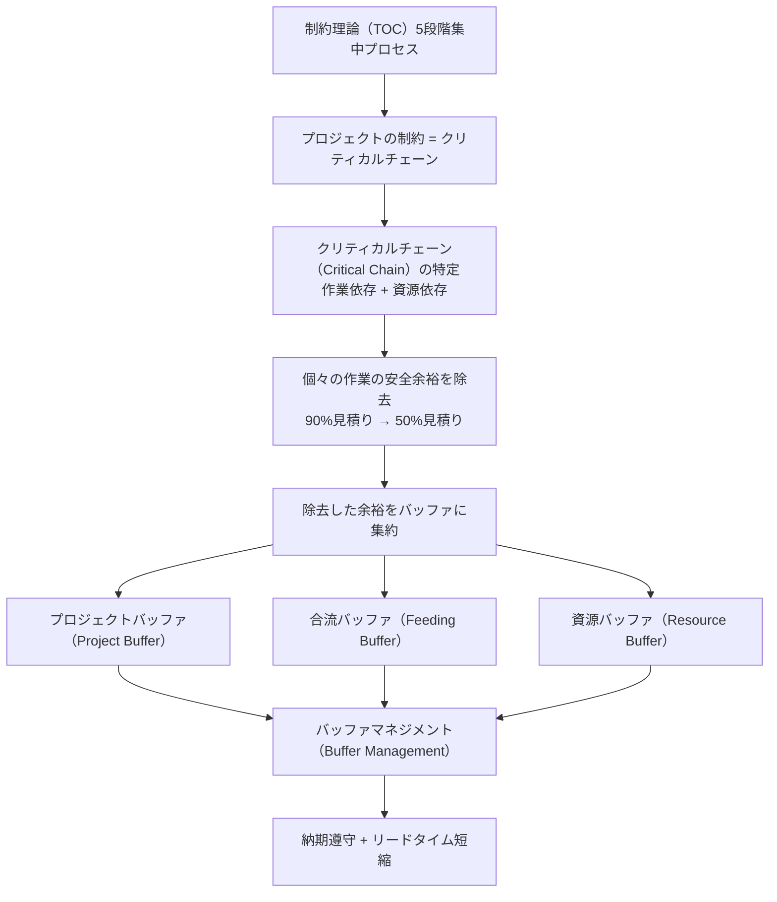
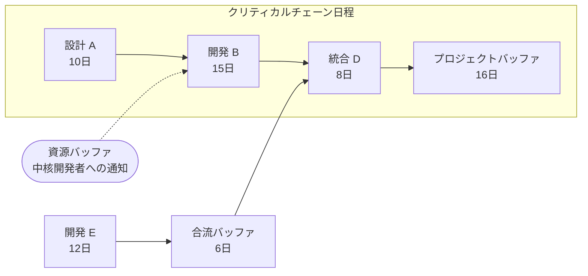
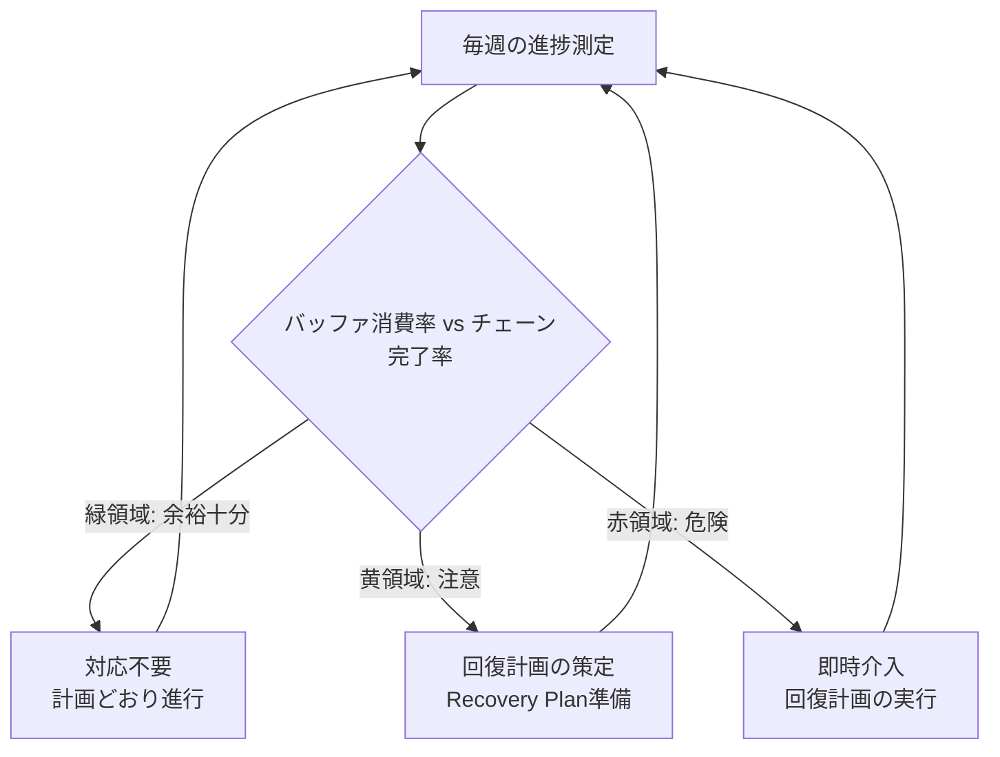

# クリティカルチェーン・プロジェクトマネジメント（CCPM, Critical Chain Project Management）

## 1. 概要

> **定義**: クリティカルチェーン・プロジェクトマネジメント（CCPM）は、制約理論（TOC, Theory of Constraints）をプロジェクトのスケジュール管理に適用した方法論であり、**作業間の先行・後続関係だけでなく資源制約まで併せて考慮した最長の依存作業の連鎖（クリティカルチェーン）**を特定し、個々の作業に隠れた安全余裕を取り除いて**共用のバッファ（Buffer）に集約・管理**することで、納期遵守とリードタイム短縮を同時に追求する手法である。

従来のスケジュール管理手法であるCPM（Critical Path Method）とPERTは、1950年代以来プロジェクト管理の標準として定着してきたが、実際の現場では「各作業を計画どおりに終えたのに、プロジェクト全体は遅延する」という逆説が繰り返されてきた。ゴールドラット（Eliyahu M. Goldratt）は1997年の著書『Critical Chain』において、その原因を**作業見積りに慣行的に含まれる過剰な安全余裕（safety time）と、その余裕が人間の行動によって浪費される構造**に求めた。CCPMは、この浪費を排除し、残った安全余裕をプロジェクト単位で統合管理することを中核のアイデアとする。

CCPMが登場した背景には、いくつかの構造的な問題がある。第一に、担当者は自分の作業見積りに「万一に備えた」余裕を付け、たいてい90%水準の安全見積り（safe estimate）を提出する。第二に、そうして確保した余裕は、**学生症候群（Student Syndrome）** — 締め切りが迫ってようやく着手する行動 — と、**パーキンソンの法則（Parkinson's Law）** — 仕事は与えられた時間をすべて満たすまで膨張する — によって消費される。第三に、複数の作業を同時に処理する**悪いマルチタスク（bad multitasking）**は、切り替えコストによって各作業のリードタイムをかえって延ばす。第四に、前工程の遅延は後工程へ累積・伝播するが、前工程の早期完了の利益は後工程の準備ができていないために消えてしまう（遅延は伝わり、余裕は消える）。こうした行動的・構造的な損失を正面から扱うという点で、CCPMは単なるスケジューリングアルゴリズムではなく、**行動科学と制約理論を結合した管理哲学**に近い。

情報管理技術士の観点から、CCPMは大規模SI・次世代システム構築のように、資源（中核開発者・アーキテクト）がボトルネックとなり、スケジュールリスクの大きいプロジェクトで特に有効である。近年ではアジャイル・カンバンとの結合や、複数プロジェクトのポートフォリオ管理（マルチプロジェクトCCPM）へと拡張され、依然として実務的な含意が大きい。

## 2. CCPMの概念構造と制約理論（TOC）との連携

CCPMは制約理論の思考体系をプロジェクトに移植したものである。TOCは「システムの成果は最も弱い環（制約、Constraint）によって決定される」という前提のもと、制約を見つけて集中的に管理する（5段階の集中プロセス：特定→活用→従属→強化→繰り返し）ことで全体のスループットを最大化する。プロジェクトにおいてこの制約に当たるのがまさに**クリティカルチェーン**であり、残りの管理装置（バッファ）は制約を保護するための従属要素として設計される。

上の構造図が示すように、CCPMの論理は「制約（クリティカルチェーン）を正確に特定し、それをバッファで保護し、バッファの消費状況で進捗を統制する」という一本の筋で貫かれている。個々の作業の締め切り（局所最適、local optimum）を守ることが目標ではなく、**プロジェクト全体の完了（全体最適、global optimum）**を守ることが目標であるという点が、CPMとの根本的な違いである。例えば、ある作業が計画より3日遅れても、プロジェクトバッファが十分に残っていればそれは「正常」とみなされ、管理者はバッファの消費推移だけを見て介入のタイミングを判断する。

この視点の転換は、管理指標の転換を伴う。従来の管理が「各作業は締め切りを守ったか」を問うのに対し、CCPMは「プロジェクトバッファはどれだけ残っているか」を問う。そのため担当者は、個別の締め切りのプレッシャーから解放され、**リレー競走（roadrunner）方式** — バトンを受け取ったら即座に全力で走り、終わったらすぐに渡す — で働くよう誘導される。これには、学生症候群とマルチタスクを構造的に抑制する効果がある。

## 3. クリティカルチェーンの特定とクリティカルパス（CPM）との違い

クリティカルチェーンを理解する最良の方法は、クリティカルパスとの違いを見ることである。**クリティカルパス（Critical Path）**は、作業間の論理的な先行・後続関係だけを考慮して計算した最長の経路である。しかし現実には、二つの作業に依存関係がなくても、**同じ資源（例：一人しかいないDBA）**を必要とすれば同時に実行することはできない。この資源競合を解消（resource leveling）すると、実際にプロジェクトを最も長引かせる連鎖はクリティカルパスとは異なる場合がある。このように、**作業依存性と資源依存性の両方を反映した最長の連鎖がクリティカルチェーン**である。

上の詳細図において、A→B→Dが資源制約まで考慮したクリティカルチェーンであり、この連鎖の末尾に**プロジェクトバッファ**が付く。非クリティカル経路であるEはD地点でクリティカルチェーンに合流するため、Eの遅延がクリティカルチェーンを押し出さないよう、合流地点の手前に**合流バッファ**を置く。また、クリティカルチェーン上のB作業を遂行する中核資源が適時に投入されるよう、**資源バッファ**（実際の時間ではなく事前警報のシグナル）を配置する。

クリティカルパスとクリティカルチェーンの違いは、実務的に非常に重要である。クリティカルパス手法は資源が無限であると仮定するため、資源が不足する現実では計画自体が実行不可能になり得る。一方、CCPMは最初から資源の可用性を前提に連鎖を計算するため、**実行可能な（feasible）スケジュール**を算出する。ただし、クリティカルチェーンは資源配分が変わると連鎖そのものが変わり得るため、クリティカルパスより計算が複雑で、再計画時には再算定が必要になるという負担がある。

| 区分 | クリティカルパス（CPM） | クリティカルチェーン（CCPM） |
|------|--------------|----------------|
| 考慮要素 | 作業の先行・後続関係のみ | 作業の先行・後続 + 資源制約 |
| 安全余裕 | 各作業に内在（90%見積り） | 除去後にバッファへ集約（50%見積り） |
| 管理指標 | 個々の作業の締め切り遵守 | バッファ消費率 |
| 資源の仮定 | 無限の資源を仮定 | 有限の資源を反映 |
| 行動上の損失への対応 | 考慮しない | 学生症候群・パーキンソン・マルチタスクを抑制 |

## 4. バッファの類型と算定方法

CCPMの成否はバッファ設計にかかっている。バッファは個々の作業から取り除いた安全余裕を集約したものであり、統計的に**複数の作業の不確実性を合算すると、個々の余裕の単純合計より小さい総量でも同じ保護水準が得られる**（中心極限定理に基づくリスク統合効果）という原理に基づいている。そのため、安全余裕を個々の作業に分散させておくよりも一か所に集めるほうが、全体のスケジュールを短くしつつ納期の保護力を維持できる。

**A. プロジェクトバッファ（Project Buffer）**

プロジェクトバッファは、クリティカルチェーン全体を保護するために連鎖の最後、すなわちプロジェクト完了日の直前に配置する時間的な緩衝である。クリティカルチェーン上の各作業から除去した安全余裕の総量の一部（慣行的には半分程度）をこのバッファとする。クリティカルチェーン上のどの作業が遅延しても、その遅延をこのバッファが吸収するため、プロジェクトの約束納期はバッファが完全に消費されるまでは守られる。

プロジェクトバッファのサイズ算定には、いくつかの方法が用いられる。最も単純なのは**50%カット・アンド・ペースト（cut-and-paste）ルール**であり、クリティカルチェーンの長さの約50%をバッファとして置く方式である。例えば、クリティカルチェーンが33日（A 10日 + B 15日 + D 8日）であれば、プロジェクトバッファは約16日となる。より精緻な方法としては、各作業の不確実性の偏差を二乗和の平方根で合算する**二乗和平方根（SSQ, Square Root of Sum of Squares）**方式があり、作業数が多く不確実性が大きいほど、相対的により小さなバッファで十分な保護が可能となる。

実務では、バッファが大きすぎると再びパーキンソンの法則を招き、小さすぎると頻繁な納期への脅威をもたらすため、**プロジェクトの特性（不確実性・規模・経験）に合わせた調整**が不可欠である。新技術導入の比重が高い次世代プロジェクトであれば、SSQの算定結果に上方調整を加えるなど、保守的にアプローチする。

**B. 合流バッファ（Feeding Buffer）**

合流バッファは、非クリティカル（フィーディング）経路がクリティカルチェーンに合流する地点の手前に配置する。目的は明確である。非クリティカル経路の遅延がクリティカルチェーンへ伝播し、プロジェクトバッファを早期に食いつぶすことを防ぐことである。前の例で、開発E（12日）が統合Dの手前で合流するとき、Eが多少遅れても6日の合流バッファがその遅延を吸収し、クリティカルチェーン上のDの着手時点を守る。

合流バッファは、クリティカルチェーンを二重に保護する。第一の防衛線が各合流地点の合流バッファであり、これを突破してきた遅延に対する最終防衛線がプロジェクトバッファである。この階層的な保護のおかげで、非クリティカル経路がクリティカルチェーンへと昇格する（クリティカルチェーンが入れ替わる現象）リスクを減らすことができる。

**C. 資源バッファ（Resource Buffer）**

資源バッファは、前述の二つのバッファとは性格が異なる。時間（スケジュール）を消費する緩衝ではなく、**クリティカルチェーン上の作業を遂行する中核資源が適時に準備されるようにするための事前警報シグナル**である。例えば、クリティカルチェーン上の開発Bが始まる数日前に、担当の中核開発者へ「まもなくあなたの番なので、他の仕事を片付けて待機してください」という通知を送るのが資源バッファの役割である。これにより、資源が他のプロジェクトに拘束されてクリティカルチェーンのバトンを遅れて受け取る事態を予防する。

| バッファ類型 | 位置 | 性格 | 目的 |
|-----------|------|------|------|
| プロジェクトバッファ | クリティカルチェーンの末尾 | 時間的緩衝 | プロジェクト納期の保護 |
| 合流バッファ | 非クリティカル→クリティカルの合流点 | 時間的緩衝 | 遅延伝播の遮断 |
| 資源バッファ | クリティカルチェーンの資源の手前 | 警報シグナル | 資源の適時投入 |

## 5. スケジュール策定手順とバッファマネジメント（Buffer Management）

CCPMのスケジュール策定は次の順序で進められる。① WBSに基づいて作業と先行・後続関係を定義し、② 各作業を90%の安全見積りではなく**50%の中央値（median）見積り**で再算定する。③ 資源競合を解消してクリティカルチェーンを特定し、④ クリティカルチェーンの末尾にプロジェクトバッファ、合流点に合流バッファ、資源の手前に資源バッファを挿入する。⑤ 各作業は締め切り日ではなく**可能な限り遅く開始（ALAP）**を原則として配置し、仕掛品（WIP）と早期投資のリスクを減らす。

実行段階の核心は**バッファマネジメント**である。管理者は個々の作業の締め切り遵守ではなく、「クリティカルチェーンがどれだけ進んだか」に対する「プロジェクトバッファがどれだけ消費されたか」を追跡する。これを可視化したものが**フィーバーチャート（Fever Chart）**であり、横軸にクリティカルチェーンの完了率、縦軸にバッファ消費率を取り、現在の状態を点でプロットして信号機の色で区分する。

フィーバーチャートの解釈ルールは直感的である。クリティカルチェーンが30%進んだのにバッファを20%しか使っていなければ、余裕が十分であるため**緑（正常）**である。逆に、クリティカルチェーン30%の進捗でバッファを60%消費していれば**赤（危険）**であり、直ちに回復計画を実行しなければならない。その間が**黄（注意）**であり、まだ介入はしないが回復計画をあらかじめ準備する。このようにCCPMは、管理者に**「いつ介入するか」についての客観的なシグナル**を提供するという点で、管理上の意思決定を大きく単純化する。

バッファマネジメントの実務的な利点は、管理者の介入を「必要な瞬間にだけ」集中させることにある。従来の管理ではすべての作業の遅延をいちいち追及するが、CCPMではバッファが赤になったときにだけ強く介入するため、**管理負荷が減り、チームの自律性が高まる**。例えば300個の作業で構成されるSIプロジェクトにおいて、バッファのシグナルが緑であれば、300個を一つひとつ点検する必要はなく、クリティカルチェーンとバッファの推移だけを見ればよい。

具体的な数値例として、クリティカルチェーンが33日、プロジェクトバッファが16日のプロジェクトを考えてみよう。クリティカルチェーンが11日（約33%）進んだ時点で、開発Bが予想より遅延してバッファをすでに10日（約63%）使ってしまっていれば、進捗に対してバッファ消費が過大な赤の状態である。管理者はこの時点で、人員の増強・範囲の調整・並行処理といった回復計画を直ちに発動する。逆に、クリティカルチェーンが22日（約67%）進み、バッファは6日（約38%）しか消費されていなければ、余裕の十分な緑であるため、担当者が個々の作業の締め切りを数日過ぎていても介入しない。このように、**バッファと進捗の相対比率**が判断基準となる点が、CCPMの進捗統制の核心である。

## 6. 単一プロジェクトを超えて：マルチプロジェクトCCPM

実際の組織はたいてい複数のプロジェクトを同時に遂行しており、このとき本当のボトルネックは特定のプロジェクトの内部ではなく、**組織全体で共有される中核資源（例：アーキテクトのプール、性能テスト環境）**である。マルチプロジェクトCCPMは、この共有ボトルネック資源を**ドラム（Drum）資源**に指定し、ドラムの処理能力に合わせてプロジェクトの着手時点をずらして配置（staggering）する。

このとき、二つの仕組みが追加される。**能力制約バッファ（Capacity Constraint Buffer）**は、ドラム資源があるプロジェクトから次のプロジェクトへ移る際に遅延が伝播しないよう置く緩衝であり、**ドラムバッファ（Drum Buffer）**は、各プロジェクトの作業がドラム資源に到達する前の準備を保証する。この方式により、組織は**同時進行するプロジェクト数を意図的に減らして悪いマルチタスクを排除**し、かえって全体の完了率（スループット）を高めるという逆説的な効果を得る。

実証事例としてよく引用されるのは、航空機整備・重工業・製薬R&Dなど、資源のボトルネックが明確な産業である。例えば、ある航空整備組織がマルチプロジェクトCCPMを導入して整備リードタイムを大幅に短縮したという事例が報告されており、これは「仕事をより多く抱えること」ではなく「同時作業を減らして流れを速めること」が成果を生むというTOCの洞察を示している。ただし、産業・組織ごとに効果のばらつきが大きいため、具体的な数値は一般化するよりも、当該組織のパイロットで検証することが望ましい。

## 7. 深化：アジャイル・ハイブリッド環境におけるCCPMと予想出題方向

近年のソフトウェア開発はアジャイル・カンバンへと重心が移ったが、CCPMの中核的な洞察は依然として有効であり、むしろ相互補完的である。カンバンの**WIP制限（Work-In-Progress Limit）**は、CCPMが強調する「悪いマルチタスクの排除・フローの最適化」と事実上同じ目標を共有している。実際、スケジュールに強い契約上の納期がかかる大規模プロジェクトでは、上位レベルのマイルストーン・リリース計画にCCPMのバッファマネジメントを適用し、下位の実行はスプリント・カンバンで運用する**ハイブリッドアプローチ**が増えている。このとき、スプリント単位の不確実性はリリースバッファで吸収し、リリースバーンダウンとバッファのフィーバーチャートを並行してモニタリングする。

また、CCPMは期待値ベースの単一見積りの限界を補うため、**モンテカルロシミュレーション**と組み合わされることもある。各作業の確率分布を反映してバッファサイズを統計的に最適化すれば、50%カットルールやSSQよりも精密な緩衝を設計できる。PMBOK第7版が予測型・適応型を包括する**テーラリング（tailoring）**と、価値・フロー中心の原則を強調する流れとも、CCPMの考え方はよく合致する。

情報管理技術士試験の観点から、CCPMについては次のような出題方向が予想される。第一に、**CPM/PERTとの比較**を通じて、クリティカルパスとクリティカルチェーンの違い、資源制約の反映の有無を問う類型である。第二に、**3種のバッファ（プロジェクト・合流・資源）の役割と算定法**を説明させ、例示ネットワークにおいてバッファの位置を描かせる類型である。第三に、**バッファマネジメント（フィーバーチャート）を活用した進捗統制・介入時点の判断**を論じる類型である。答案作成時には必ず概念図（クリティカルチェーンのネットワーク + フィーバーチャート）を描き、学生症候群・パーキンソンの法則などの行動的背景とTOCとの連携を記述して深さを示すことが、高得点の戦略である。

## 8. 考慮事項および示唆点（技術士の観点）

**第一に、組織文化・行動の変化が前提とならなければならない。** CCPMは個々の作業の締め切りを守らなくてもよいという前提の上に立っているため、締め切り遵守を美徳としてきた組織では抵抗が大きい。担当者が50%見積りを「失敗を強要されること」と誤解しないよう、バッファが組織レベルの共用セーフティネットであることを教育し、**バッファ消費を叱責の根拠ではなく管理上のシグナルとして使う**文化の定着が成否を分ける。

**第二に、バッファサイズの設定はトレードオフである。** バッファが大きければパーキンソンの法則とリードタイムの延長を、小さければ頻繁な納期への脅威と管理者の過剰介入を招く。プロジェクトの不確実性・規模・チームの成熟度に応じて、50%カット・SSQ・モンテカルロの中から適切な算定法を**テーラリング**し、実行データを蓄積して次のプロジェクトへフィードバックする反復的な補正が必要である。

**第三に、正確な資源データとツールの支援が不可欠である。** クリティカルチェーンは資源配分によって連鎖そのものが変わるため、資源の可用性・能力・競合の情報が不正確であれば計画の信頼性は崩れる。手作業では再計算が困難であるため、CCPMをサポートする専用のスケジューリングツール（例：バッファ・フィーバーチャートの自動計算機能）や、EVM・PMISとの連携が推奨される。

**第四に、方法論の濫用・硬直的な適用を警戒しなければならない。** CCPMは資源のボトルネックが明確でスケジュールリスクの大きいプロジェクトで強みを発揮するが、小規模・低不確実性のプロジェクトにはかえって過剰となり得る。アジャイル・カンバンがより適した領域とCCPMが有効な領域を区別し、必要に応じて**ハイブリッドで結合**する状況適合的（contingency）な判断が技術士の役割である。

**第五に、成果測定の指標を再編しなければならない。** CCPMの導入時にはKPIを個々の作業の遵守率ではなく、プロジェクトのスループット・バッファ消費の推移・マルチプロジェクトの完了率へと変えてこそ、方法論の趣旨が生きる。指標が旧来の方式にとどまれば、チームは依然として個々の締め切りにこだわり、CCPMの効果は相殺される。

## 参考資料

- Critical chain project management — Wikipedia, https://en.wikipedia.org/wiki/Critical_chain_project_management
- Theory of constraints — Wikipedia, https://en.wikipedia.org/wiki/Theory_of_constraints
- Project Management Institute(PMI), 『A Guide to the Project Management Body of Knowledge(PMBOK Guide)』 7th Edition 概要, https://www.pmi.org/pmbok-guide-standards

---
> **一言まとめ**: CCPMは制約理論をプロジェクトのスケジュールに適用し、作業・資源の制約を併せて考慮したクリティカルチェーンを特定して、個々の安全余裕をプロジェクト・合流・資源バッファへ集約・管理（フィーバーチャート）することで、学生症候群・パーキンソン・マルチタスクによる損失を減らし、納期遵守とリードタイム短縮を同時に達成するスケジュール管理方法論である。
