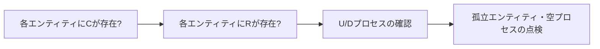

# CRUDマトリクス（CRUD Matrix）

## 1. 概要

### A. 定義
> 情報システムの**プロセス（機能）**と**エンティティ（データ）**の間の**生成（Create）・参照（Read）・更新（Update）・削除（Delete）**の関係を行列で交差表現した相関分析ツール。

### B. 登場背景および使用目的
情報工学（IE）方法論では、データモデル（何を保存するか）とプロセスモデル（何を処理するか）が異なる視点から独立して設計されるため、両者が実際に**噛み合っているか**を検証する仕組みが必要となる。もしあるエンティティに値を入れるプロセスが一つもなければ、そのデータは永遠に空のまま残り、逆にあるプロセスが存在しないデータを参照するよう設計されていれば実行は不可能である。CRUDマトリクスは、こうした**データと機能の間の整合性の穴**を行列という一目で分かる形で明らかにし、漏れ・重複・孤立を早期に識別する。さらに、トランザクション境界の設定、DB分散設計、アクセス権限設計、アーカイブポリシーの根拠資料として再利用される。

## 2. 表現方法

行にプロセス、列にエンティティを置き、各交差セルにそのプロセスが該当データに対して行う操作をC/R/U/Dで表記する。一つのプロセスが複数の操作を行う場合は併記する（例：注文取消は注文を更新・削除するためUD）。以下は簡単なショッピングモールの例であり、「注文登録」が会員・商品を参照（R）し、注文を生成（C）する複合トランザクションであることが一行で分かる。

| プロセス \ エンティティ | 会員 | 注文 | 商品 |
|---|---|---|---|
| **会員登録** | C | | |
| **商品照会** | | | R |
| **注文登録** | R | C | R |
| **注文取消** | | UD | |

## 3. 整合性検証ルール

検証の核心は、「すべてのエンティティがライフサイクル全体を持っているか」と「すべてのプロセスが実際のデータを扱っているか」を対称的に確認することである。**各エンティティの列にCが少なくとも一つはなければならない**。生成プロセスのないエンティティはデータの流入経路がないため、設計の漏れを意味する。**各エンティティの列にRが少なくとも一つはなければならない**。誰も参照しないデータは保存する理由のない不要なデータである可能性があるため、再検討の対象となる。**U/Dの有無**は、状態変更や削除が業務上必要かどうかを点検する。最後に、**すべての行・列が少なくとも一つの表記**を持たなければならない。表記がまったくない列はどの機能も使わない**孤立エンティティ**、表記がまったくない行はデータに触れない**空の（虚構の）プロセス**であり、誤りの候補である。上の例で商品の列にCがなければ、「商品登録」プロセスの漏れを発見するといった具合である。

| 点検ルール | 意味 | 違反時 |
|---|---|---|
| **各エンティティにCが存在** | データ流入経路の確保 | 生成プロセスの漏れ |
| **各エンティティにRが存在** | データ活用有無の確認 | 不要データの疑い |
| **U/Dの有無** | 状態変更・削除の必要性 | 管理プロセスの検討 |
| **すべての行・列に最低1つ** | 孤立・虚構の防止 | 孤立エンティティ・空プロセス |

## 4. 活用分野

CRUDマトリクスは整合性の検証にとどまらず、後続の設計の入力として広く使われる。プロセスごとのCRUDパターンを分析すれば一つの論理的な作業単位（トランザクション）の境界を導出でき、複数のプロセスが同じデータに同時にUを行うなら、**同時実行制御（ロック）**設計の根拠となる。特定のエンティティ群に特定のプロセス群だけがアクセスするなら、その境界に沿って**DBを分散・分割**すればトラフィックの局所性が高まる。役割ごとにどのデータにどのCRUD権限を与えるかも、このマトリクスから出発する。

| 分野 | 活用方法 |
|---|---|
| **業務・データ検証** | 要件とデータの整合性点検 |
| **トランザクション分析** | トランザクション境界・同時実行設計 |
| **DB分散設計** | アクセスパターンに基づく分割・配置 |
| **アクセス権限設計** | 役割別CRUD権限マトリクスの基礎 |

## 5. 考慮事項および示唆点
- **自動化・ツール化**: エンティティ・プロセスが数百個に及ぶ大規模システムでは手作業での管理は不可能であるため、CASEツールやリポジトリベースの自動生成を活用し、モデル変更とマトリクスを同期させる。
- **データガバナンスの基礎成果物**: データの所有権・品質・ライフサイクル管理の出発点であり、データリネージ（lineage）管理と結びつく。
- **MSAへの応用**: マイクロサービスアーキテクチャでは、CRUDパターン分析がサービスの所有すべきデータ境界（**Bounded Context**）の定義に応用され、「データを所有するサービスだけがそのデータを書き込む」という原則の設計根拠となる。

---

> **一言まとめ**: CRUDマトリクスは*プロセスとエンティティの生成・参照・更新・削除の関係を行列で交差表現*してデータと機能の整合性（漏れ・孤立・虚構）を検証し、トランザクション・分散・アクセス権限の設計やMSAのBounded Context定義にまで拡張される相関分析ツールである。
