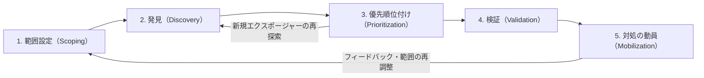
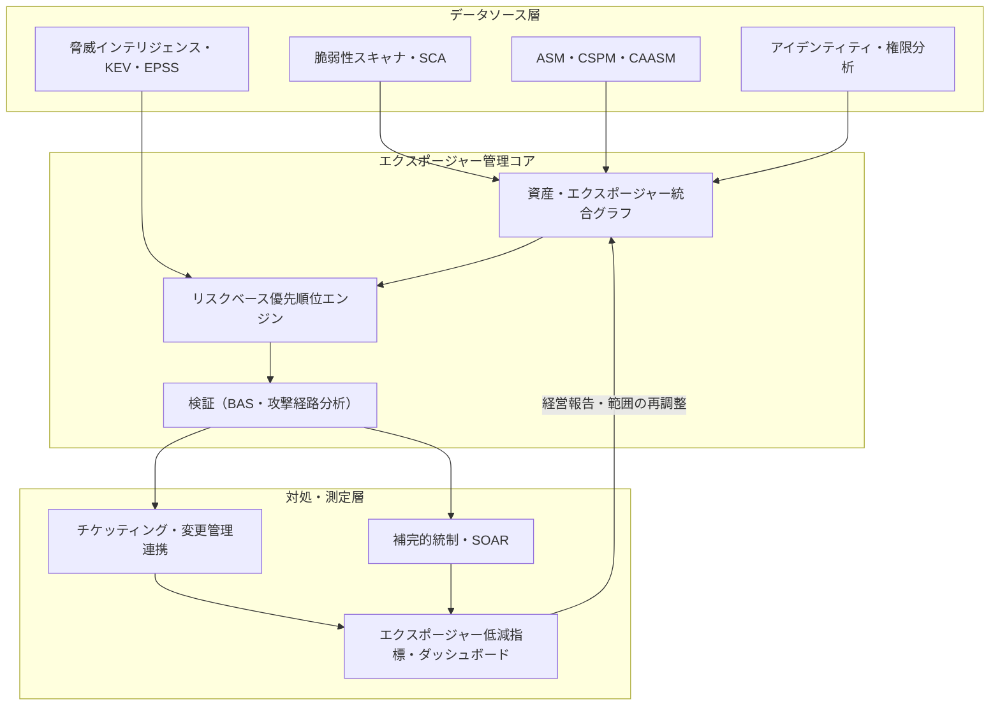

# CTEM（継続的脅威エクスポージャー管理、Continuous Threat Exposure Management）

## 1. 概要

> **定義**: CTEM（Continuous Threat Exposure Management）は、組織が保有する資産・サービス・アイデンティティに存在するエクスポージャー（exposure）を攻撃者の視点から継続的に特定し、実際の悪用可能性と事業への影響に応じて優先順位を付けて検証した後、対処を調整（mobilization）することを一つの反復サイクルとして運用するリスク低減プログラムである。

従来の脆弱性管理（Vulnerability Management）は、四半期または月単位のスキャンでCVEリストを抽出し、CVSSスコアの高い項目からパッチを適用する方式で運用されてきた。しかしこの方式には三つの構造的な限界がある。第一に、スキャン時点と対処時点の間の空白が大きく、攻撃者がすでに悪用しているエクスポージャーを遅れて発見することになる。第二に、CVSSスコアだけでは当該脆弱性が自社の環境で実際に到達・悪用可能かどうかが分からず、実際のリスクが低い項目に資源を浪費する。第三に、脆弱性（CVE）だけを扱うため、誤った設定、過剰な権限、露出した認証情報、攻撃対象領域の拡大といった非CVEのエクスポージャーを見落とす。

クラウド・SaaS・リモートワーク・サプライチェーンの拡大により、攻撃対象領域は組織の境界を越えて絶えず変化し、ランサムウェア・インフォスティーラー・サプライチェーン侵害といった脅威は、脆弱性一つではなく複数の弱点を連鎖（attack path）させて侵入する。このような環境では、「どれだけ多くの脆弱性を塞いだか」よりも、「攻撃者は自社に対して実際に何ができるのか、そのうち事業にとって致命的な経路は何か」という問いのほうが重要になった。CTEMはGartnerが2022年に提示して以来、近年のセキュリティ戦略の中核フレームワークとして浮上しており、個別のツールではなく、エクスポージャーを継続的に減らしていく**プログラム（運用体系）**であるという点が本質である。

一方でCTEMは、まったく新しい技術を要求するというよりも、すでに組織に存在する脆弱性管理・ペネトレーションテスト・資産管理・脅威インテリジェンスの能力を一つの目標のもとに再配置する性格が強い。したがって導入の鍵は、高価な新規ツールの購入ではなく、散在する活動をサイクルとして結びつけ、その成果をビジネスの言葉で測定・報告する運用設計にある。この点でCTEMは、セキュリティ組織の成熟度を引き上げるフレームワークであると同時に、経営陣とセキュリティ部門がリスクについて同じ指標で対話できるようにするコミュニケーションツールでもある。

本答案では、CTEMの5段階サイクル構造と参照アーキテクチャ、各段階の活動と構成要素、既存の脆弱性管理・ペネトレーションテストとの違い、実務適用事例、そして技術士の観点からの導入戦略と考慮事項を論述する。

## 2. CTEMの5段階サイクル構造

CTEMは一回限りの診断ではなく、次の五つの段階を繰り返すサイクル型のプログラムとして定義される。各段階は前の段階の成果物を入力として受け取って次の段階へ渡し、最後の段階の結果が再び最初の段階の範囲を再調整する。

**A. 範囲設定（Scoping）** — 最初の段階は、技術的なスキャン範囲ではなく**事業の観点からの保護対象**を定義することである。IT資産全体を一度に扱おうとすると、プログラムが重くなり失敗しやすい。したがって、売上に直結する中核サービス、規制対象の個人情報処理システム、外部に露出した攻撃対象領域（External Attack Surface）、SaaS・アイデンティティといった特定の領域を優先的な範囲として選ぶ。この段階で経営陣・現場部門とともに「何が侵害されると最大の損失になるか」を合意することが、以降の優先順位付けの基準線となる。範囲は固定ではなくサイクルごとに再調整され、成熟度が高まるにつれて広げていく。

**B. 発見（Discovery）** — 設定された範囲内で、資産とエクスポージャーを可能な限り漏れなく特定する。ここでいうエクスポージャーは、CVE脆弱性だけでなく、クラウドの設定ミス、過剰なIAM権限、露出したAPI・ストレージバケット、期限切れ・流出した認証情報、シャドーIT、依存関係の脆弱性（SBOMの観点）などを包括する。ASM（Attack Surface Management）・CSPM・CAASM・アイデンティティ脅威検知ツールがデータソースとして結合され、資産インベントリとエクスポージャーリストを一つのグラフに統合することが鍵となる。発見の目標は「多く見つけること」ではなく「範囲内で正確に見つけること」であり、ノイズが多いと次の段階の優先順位付けが無力化される。

**C. 優先順位付け（Prioritization）** — 発見されたエクスポージャーのすべてに対処することはできないため、実際の悪用可能性と事業への影響を組み合わせて順位を付ける。このとき、CVSS単独ではなく、EPSS（悪用確率）、CISA KEV（実際に悪用された脆弱性のリスト）、脅威インテリジェンス、資産の重要度、そして**攻撃経路上の位置**を併せて見る。例えば、CVSS 9.8であっても内部の隔離ネットワークにあり到達経路がなければ順位は下がり、CVSS 6.5であっても外部露出資産からドメイン管理者へとつながる経路の要所であれば最優先となる。優先順位付けは「リスクベース（risk-based）」アプローチの中核段階である。

このアプローチが重要な理由は、脆弱性の絶対量と実際に悪用される脆弱性の数との間に大きな隔たりがあるからである。公開されるCVEは毎年数万件ずつ増えているが、そのうち実際に悪用が観測される割合は一桁パーセント台にとどまるというのが、多くの脅威研究に共通する観察である。したがって、すべての脆弱性をCVSS順に追いかける代わりに、「実際の悪用確率が高く（EPSS・KEV）、自社の環境で到達可能であり（経路分析）、中核資産に影響を与える（資産の重要度）」という積集合に集中すれば、対処対象を劇的に減らしながらも、リスク低減効果はむしろ大きくなる。これが、CTEMが「より多くではなく、より正確に」を志向する根拠である。

**D. 検証（Validation）** — 優先順位の高いエクスポージャーが**実際に悪用可能か、どこまで侵入が続くか**を安全に確認する。BAS（Breach and Attack Simulation）、自動化されたペネトレーションテスト、レッドチーム、攻撃経路分析（Attack Path Mapping）が用いられる。検証は二つの問いに答える。一つは「このエクスポージャーは本当に突破されるのか」（悪用可能性）、もう一つは「突破された場合、どの資産まで到達し、既存の検知・遮断の統制がそれを防げるのか」（対応の有効性）である。検証を経ることで、理論上のリスクリストが**実証されたリスク**へと変わり、対処資源投入の根拠が明確になる。

検証段階は、優先順位付けの誤検知を除外する役割も担う。優先順位が高く算出されたエクスポージャーであっても、実際の環境では他の統制によって経路が断たれていたり、すでに緩和されていたりする場合があり、検証なしに対処を強行すれば、不要な変更によって運用リスクと現場の疲弊を増大させる。逆に、優先順位の指標だけでは目立たなかった低深刻度のエクスポージャーが連鎖したときに致命的な経路を形成するケースも、検証によって明らかになる。すなわち検証は、優先順位付けの結果を現実に即して補正するフィードバック装置であり、そのため優先順位付け（第3段階）と検証（第4段階）はサイクルの中で特に密接に噛み合う。

**E. 対処の動員（Mobilization）** — 検証されたリスクを実際に減らすために組織を動かす段階である。核心は自動パッチではなく、**人とプロセスの調整**である。インフラチーム・開発チーム・アイデンティティチーム・クラウドチームに対して明確な対処項目と根拠・期限を伝え、チケッティング・変更管理と連携し、即時のパッチ適用が難しい項目には補完的統制（WAFルール、セグメンテーション、権限の剥奪）を適用する。この段階の成果が再び測定され、次のサイクルの範囲と優先順位に反映される。

五つの段階は互いに独立して存在するのではなく、サイクルのリズム（cadence）の中で噛み合う。発見と優先順位付けは攻撃対象領域が頻繁に変わるため比較的短い周期で繰り返され、検証は資源の消費が大きいため上位のリスクに集中して比較的長い周期で実行され、範囲設定と対処の動員は四半期・半期単位の経営レビューと整合させる。このように段階ごとに異なる周期を設けつつ一つのサイクルとして接続することが、CTEM運用設計の核心である。サイクルが一巡するたびに、組織は「前回のサイクルと比べてリスクがどれだけ減ったか」を根拠に次の優先順位を調整する。

## 3. 参照アーキテクチャと構成要素

CTEMは特定の製品ではなく、複数のセキュリティデータソースを統合してエクスポージャーを管理する上位レイヤーとして動作する。以下は、データ収集から対処・測定までの流れを示したアーキテクチャである。

構成要素は大きく三つの層に分かれる。**データソース層**は、脆弱性スキャナ、SCA/SBOM、ASM・CSPM・CAASM、アイデンティティ・権限分析、そしてEPSS・KEV・脅威インテリジェンスフィードを含む。**エクスポージャー管理コア**は、異種のデータを資産単位で正規化・重複排除して一つのグラフにまとめ、脅威インテリジェンスと資産の重要度を組み合わせて優先順位を算出し、BASと攻撃経路分析でリスクを実証する。**対処・測定層**は、対処ワークフロー（チケット・変更管理・SOAR）とエクスポージャー低減指標（平均対処時間、リスクエクスポージャーの推移、中核資産への到達可能性）を経営陣向けダッシュボードとして提供する。

ここで最も難しいのは、コア層の**資産・エクスポージャー統合グラフ**を作ることである。脆弱性スキャナはIP・ホスト単位で、クラウドツールはリソース単位で、アイデンティティツールはアカウント・ロール単位でデータを生成するため、同じ資産が複数の名前で重複して記録されたり、異なるツールの結果が結びつかなかったりする問題がよく起こる。これを解決するには、資産識別の基準を正規化し、エクスポージャーを資産・アイデンティティ・経路のグラフとして接続し、「このエクスポージャーからあの資産までつながっているか」を問い合わせられるようにしなければならない。統合グラフが不十分であれば優先順位付けと経路検証がいずれも不正確になるため、コア層のデータ品質がそのままプログラムの品質となる。

以下の表は、各段階で用いられる代表的な技術・成果物を整理したものである。ただし、ツールは手段にすぎず、段階間のデータが途切れずにつながるよう統合することがプログラムの成否を分ける。

| 段階 | 中核活動 | 代表的な技術・データ | 主な成果物 |
|------|-----------|------------------|-------------|
| 範囲設定 | 保護対象の定義 | 資産の重要度、事業影響度 | 範囲定義書・ベースライン |
| 発見 | 資産・エクスポージャーの特定 | ASM, CSPM, CAASM, SCA | 統合エクスポージャーインベントリ |
| 優先順位付け | リスクベースの並べ替え | EPSS, KEV, 脅威インテリジェンス | 優先順位付きエクスポージャーリスト |
| 検証 | 悪用・経路の実証 | BAS, 自動ペネトレーション, レッドチーム | 実証された攻撃経路 |
| 対処の動員 | 組織の調整・低減 | SOAR, チケッティング, 補完的統制 | 対処の履行・低減指標 |

## 4. 既存アプローチとの比較および事例

CTEMを正確に理解するには、既存の脆弱性管理（VM）、ペネトレーションテスト（Penetration Test）との違いを原理のレベルで区別しなければならない。脆弱性管理は「脆弱性リストの管理」に焦点を置き、定期的なスキャン・パッチのサイクルで運用されるため、スキャン間の空白とCVE偏重という限界を持つ。ペネトレーションテストは特定の時点で専門家が深く侵入を試みるが、年1～2回の実施であるため継続性がなく、範囲も狭い。CTEMはこれら二つを置き換えるというよりも、上位でそれらを**束ねて継続的に運用**する。すなわち、発見は広く（ASM）、優先順位は脅威ベースで、検証は自動化（BAS）とレッドチームで、対処は組織全体のサイクルとして接続するという点が差別化要素である。

| 区分 | 脆弱性管理（VM） | ペネトレーションテスト（PT） | CTEM |
|------|-----------------|--------------|------|
| 対象 | CVE中心 | 特定のシステム | 脆弱性+設定ミス+権限+攻撃対象領域 |
| 周期 | 定期スキャン | 年1～2回 | 継続（サイクル） |
| 優先順位 | CVSS中心 | 専門家の判断 | 悪用性・経路・事業影響 |
| 検証 | ほぼなし | あり（手動） | 自動+手動の継続的検証 |
| 目標 | 脆弱性の削減 | 侵入可能性の確認 | 事業リスクの継続的低減 |

違いが生じる根本的な原因は、**評価基準の移行**にある。VMが「塞いだ脆弱性の数」という活動指標を見るのに対し、CTEMは「中核資産への実際の到達可能性の低下」という結果指標を見る。そのため、実務でCTEMを導入すると、対処対象のリストはむしろ減る。例えば、ある金融機関が数万件の未対処脆弱性を抱えている場合、EPSS・KEV・経路分析を適用すると、実際に悪用可能で中核資産に到達する項目は数百件程度に絞り込まれ、限られた人員が本当のリスクに集中できる。

このような結果志向は、報告方式にも影響を与える。VM時代の報告が「今月は脆弱性1万件のうち8千件に対処」のように活動量を列挙していたとすれば、CTEMの報告は「外部から中核決済システムへ到達可能な検証済み経路が、前月の12件から3件に減少」のようにリスクの変化を記述する。後者は経営陣が投資対効果を判断し次の優先順位を決定するうえで直接的な根拠となるという点で、CTEMがセキュリティを技術活動から事業リスク管理へと引き上げる地点を示している。

具体的な事例として、ランサムウェア攻撃の大多数は、既知の（パッチ適用可能な）脆弱性と、露出したリモートアクセス・有効な認証情報の組み合わせによって初期侵入が行われる。CTEMは、発見段階で外部に露出したRDP/VPNと流出した認証情報を捕捉し、優先順位付けでKEVに登録された悪用脆弱性を上位に引き上げ、検証段階のBASで「このエクスポージャーからファイルサーバまで実際に移動可能である」ことを実証した後、対処段階でMFAの適用・アカウントの回収・セグメンテーションを動員する。別の事例として、クラウド環境では公開されたストレージバケットと過剰なIAMロールが組み合わさってデータ流出の経路となるが、CTEMはCSPMの設定ミスと権限分析を一つの経路として結びつけ、「インターネット → 設定ミスのある関数 → 過剰権限のロール → データ」という経路を可視化し、その要所を優先的に遮断する。

## 5. 導入ロードマップと成熟度モデル

CTEMは一度で完成するシステムではなく、成熟度を段階的に高めていく旅路である。導入初期にはデータとプロセスが断片化しているため、無理にすべての資産を対象とするよりも、狭い範囲でサイクルを完走し、「エクスポージャーが実際に減った」という証拠を作ることが重要である。以下は、一般的に観察される3段階の成熟経路である。

**A. 第1段階 — 基礎（可視性の確保）**: この段階の目標は、散在する資産とエクスポージャーのデータを一つにまとめることである。資産インベントリ（CMDB・CAASM）を整備し、外部攻撃対象領域（ASM）と脆弱性スキャンの結果を統合して、「自社は何を持ち、どこが露出しているか」を初めて一望する。まだ優先順位付けはCVSS中心で検証は手動であるが、統合された可視性そのものが以降のすべての段階の土台となる。この段階の代表的な指標は、資産カバレッジ率と外部攻撃対象領域リストの正確性である。

**B. 第2段階 — リスクベース運用（優先順位付け・検証の導入）**: 発見されたエクスポージャーにEPSS・KEV・資産の重要度を組み合わせてリスクベースで並べ替え、BAS・攻撃経路分析で上位項目の検証を開始する。対処はチケッティング・変更管理と連携され、追跡可能になる。この段階で対処対象リストが劇的に減り、平均対処時間（MTTR）や中核資産への到達可能性といった結果指標が初めて測定される。ほとんどの組織が実質的な効果を実感する区間である。

**C. 第3段階 — 継続・自動化（プログラムの定着）**: 5段階のサイクルが定例化され、SOARプレイブックで対処が自動化され、エクスポージャー低減の推移が経営陣向けダッシュボードで常時報告される。範囲はクラウド・アイデンティティ・SaaS・サプライチェーン（SBOM）まで拡大し、脅威インテリジェンスが優先順位をリアルタイムに近い形で更新する。この段階でCTEMは、個々のセキュリティ活動を「継続的なリスク低減」という目標のもとに整列させる上位のガバナンス体系として定着する。

成熟度を高める際によくある失敗要因は、ツールを先に増やし、プロセスを後から合わせることである。実際の成功事例では、範囲を狭く設定してサイクルを完走し、その成果を経営陣に結果指標で証明したうえで、予算と範囲を拡大するという順序を踏んでいる。すなわち成熟度の進展は、技術の問題というよりも、組織学習と信頼の蓄積の問題に近い。

## 6. 深化 — 最新動向と予想出題方向

CTEMは近年のセキュリティ市場において、個別の製品群を一つのプログラムへと収束させる軸として機能している。第一に、**ASM・BAS・リスクベース脆弱性管理（RBVM）・CAASM**が、それぞれ独立した製品からCTEMプラットフォームへと統合される流れが顕著である。第二に、**アイデンティティのエクスポージャー**の比重が大きくなるにつれ、ITDR（Identity Threat Detection & Response）との結合、過剰な権限・有効な認証情報の管理が、CTEMの発見・検証の中核として浮上した。第三に、**生成AI**がエクスポージャーデータの要約、対処ガイドの自動生成、攻撃経路の説明などに活用されると同時に、LLMアプリケーション・データパイプラインそのものが新たなエクスポージャー対象（プロンプトインジェクション、モデル・データへのアクセス権限）としてCTEMの範囲に組み込まれつつある。

優先順位付けの指標も精緻化している。CVSS単独の限界を補うため、EPSS（今後30日以内の悪用確率）とCISA KEV（実際の悪用が確認されたリスト）を組み合わせることが事実上の標準となり、これに資産の重要度と経路分析を加えた多層的なスコアリングが広がっている。ゼロトラスト・ASPM（アプリケーションセキュリティポスチャ管理）・SBOMベースのサプライチェーンエクスポージャー管理との連携も強化されている。

技術士の観点からの予想出題方向は次のとおりである。(1) CTEMの5段階を図式とともに説明し、各段階の活動・成果物を記述させる記述型、(2) 既存の脆弱性管理・ペネトレーションテストとCTEMを比較し、導入の必要性を論じさせる比較型、(3) ランサムウェア・クラウドの設定ミスなど特定のシナリオにおいてCTEMをどのように適用するか答案を構成させる応用型である。答案戦略としては、「エクスポージャー≠CVE」「継続的サイクル」「リスクベースの優先順位」「検証による実証」「組織の調整（mobilization）」の五つのキーワードを軸とし、概念図と比較表を併せて提示することが効果的である。

## 7. 考慮事項および示唆点

第一に、**組織・プロセス優先のアプローチが必要である。** CTEMはツールの導入ではなくプログラムの運用であるため、最初から全資産を対象とすると失敗する。中核サービス・外部攻撃対象領域など狭い範囲でサイクルを成功させて成果を証明した後、段階的に拡大することが成熟度モデルに合致する。経営陣のスポンサーシップと現場部門の参加なしには、最後の対処の動員段階が機能しない。

第二に、**測定指標を活動から結果へと転換しなければならない。** 「塞いだ脆弱性の数」ではなく、「中核資産への到達可能性の低下」「平均対処時間（MTTR）」「検証で実証されたリスクに対する対処率」「外部攻撃対象領域の推移」を指標としてこそ、実際のリスク低減を証明できる。指標は経営報告と予算の根拠に結びつき、プログラムの継続性を担保する。

第三に、**データ統合とノイズ管理が成否を左右する。** 複数のツールの資産・エクスポージャーデータを重複なく一つのグラフに正規化できなければ、優先順位付けは無力化される。資産インベントリ（CMDB・CAASM）の正確性が前提であり、誤検知・重複は現場部門の信頼を失わせるため、検証段階で除外しなければならない。関連技術としては、SBOM・ASPM（開発段階のエクスポージャー）、ITDR（アイデンティティ）、CSPM（クラウド）が不可欠に結合される。

第四に、**検証の安全性と自動化の水準をトレードオフしなければならない。** BAS・自動ペネトレーションは本番環境に影響を与える可能性があるため、安全なシミュレーションの範囲・時間帯・ロールバックを設計しなければならず、自動化だけでは捕捉できない複合的な経路はレッドチームで補完する。自動化が広さを、人が深さを担うよう役割を分担することが現実的である。

第五に、**ゼロトラスト・SOAR・脅威インテリジェンスとの戦略的な整合が必要である。** CTEMが特定・検証した経路はゼロトラストのセグメンテーション・最小権限ポリシーによって遮断され、対処の動員はSOARプレイブックで自動化され、優先順位は脅威インテリジェンスによって更新される。このようにCTEMは、個々のセキュリティ活動を「継続的なリスク低減」という一つの目標のもとに整列させる上位の運用体系として定着していく見通しである。

## 参考資料

- Gartner, "How to Manage Cybersecurity Threats, Not Episodes" (Continuous Threat Exposure Management), https://www.gartner.com/en/articles/how-to-manage-cybersecurity-threats-not-episodes
- CISA, Known Exploited Vulnerabilities (KEV) Catalog, https://www.cisa.gov/known-exploited-vulnerabilities-catalog
- FIRST, Exploit Prediction Scoring System (EPSS), https://www.first.org/epss/

---

> **一言まとめ**: CTEMは、資産・設定ミス・権限・攻撃対象領域を包括するエクスポージャーを攻撃者の視点から継続的に発見・優先順位付け・検証・対処する5段階のサイクル型プログラムであり、「塞いだ脆弱性の数」ではなく「中核資産への実際の到達可能性の低下」を目標とするリスクベースのセキュリティ運用体系である。
