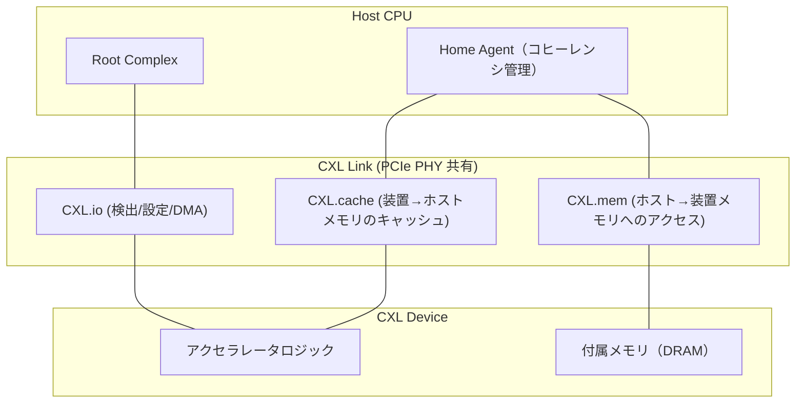
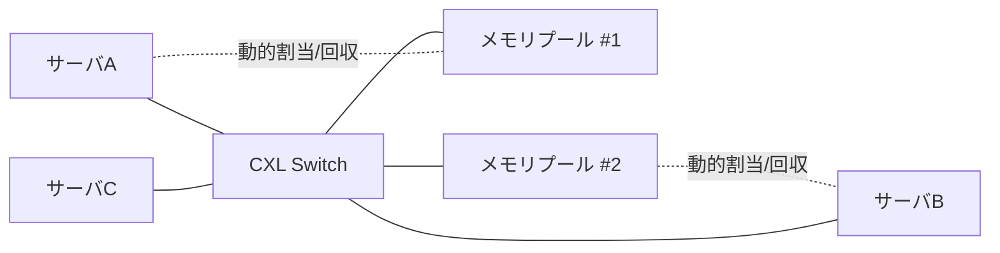

# CXL（Compute Express Link）超高速インターコネクト

## 1. 概要

### A. 定義
> **CXL（Compute Express Link）**は、PCIe物理層の上で動作し、CPU・アクセラレータ・メモリ拡張装置の間で**キャッシュコヒーレンシ（Cache Coherency）**を維持したまま、低遅延でメモリを共有・拡張・プーリング（Pooling）できるようにするオープン標準のインターコネクトである。

従来、CPUに接続されるメモリ（DIMM）の容量・帯域幅はCPUが提供するチャネル数に縛られており、PCIeで接続される装置（GPU・NICなど）は高速ではあるものの、**CPUとキャッシュコヒーレンシを共有できない**ため、データのコピー・同期のオーバーヘッドが大きかった。CXLは「PCIeの広いエコシステムと物理層をそのまま使いつつ、その上に**メモリセマンティクス（load/store）とキャッシュコヒーレンシ**を載せる」という発想で、この二つの世界を一つにつなぐ。すなわち、装置のメモリにCPUが自分のメモリのように `load/store` 命令で直接アクセスできるようにする。

### B. 登場背景および必要性
AI・HPCのワークロードが大きくなるにつれ、二つのボトルネックが同時に現れた。第一は**メモリ容量・帯域幅の壁**である。大規模言語モデルやインメモリ分析は数TB級のメモリを要求するが、CPUソケットあたりのDIMMスロット数は物理的に制限されており、これ以上増やすことは難しい。第二は**異種アクセラレータ間のデータ移動コスト**である。GPU・FPGA・スマートNICが増えるほど、装置ごとに別のメモリを置いてPCIeでコピーする方式は、遅延と電力を浪費する。さらにデータセンター全体では、サーバごとにメモリを過剰にプロビジョニングし、**平均40～50%以上が遊休状態で浪費される（Stranded Memory）**という問題が重なった。CXLは、メモリをCPUから分離（Disaggregation）して**必要な分だけ動的に割り当て・回収**することで、これら三つの問題をまとめて解決しようとする標準として登場した。

## 2. プロトコル構造と階層

CXLは一つの物理リンク上で、用途の異なる**三つのサブプロトコル**を時分割で多重化する。この分離こそがCXLの中核的な設計である — 単純な入出力、キャッシュアクセス、メモリアクセスは、それぞれ異なるコヒーレンシ・遅延の要求を持つからである。

**CXL.io**はPCIeとほぼ同一のプロトコルであり、装置の検出・設定（Enumeration）・割り込み・DMAを担い、**すべてのCXL装置に必須**である。残りの二つのプロトコルが載るための土台の役割を果たす。**CXL.cache**は、装置がホストメモリを**コヒーレントにキャッシュ**することを許可する。例えば、アクセラレータがCPUメモリの特定領域を読み込んで自身のキャッシュに置いて演算する場合、CPUがその領域を変更すると、ハードウェアが自動的に無効化・更新を処理する。**CXL.mem**は逆に、ホストが装置に付属したメモリに**自分のアドレス空間の一部のように `load/store`**でアクセスできるようにする。メモリの拡張・プーリングは、まさにこのプロトコルの上で行われる。

### A. 装置タイプ（Device Type）
プロトコルの組み合わせによって、装置は三種類に分けられる。タイプの区分は、すなわち「その装置がキャッシュを持つのか、メモリを提供するのか」の問題である。

| タイプ | 使用プロトコル | 代表的な装置 | 特徴 |
|---|---|---|---|
| **Type 1** | io + cache | スマートNIC・演算型アクセラレータ | 自身のメモリを持たず、ホストメモリをコヒーレントにキャッシュ |
| **Type 2** | io + cache + mem | GPU・FPGAアクセラレータ | キャッシュ・メモリの両方を保有し、双方向のコヒーレンシを共有 |
| **Type 3** | io + mem | メモリエキスパンダ（Expander）・プール | キャッシュなしで大容量メモリのみ提供（拡張・プーリングの主役） |

Type 3が今日のCXL商用化の中心である。DDR5 DIMMを搭載した拡張カードをPCIeスロットに挿すと、CPUはこれを追加のメモリ階層として認識し、ソケットの物理的なスロットの限界を超えて容量を増やせるからである。

## 3. メモリプーリングと分離（Disaggregation）

CXLの究極的な価値は、単純な拡張を超えた**メモリプーリング**にある。複数のサーバ（ホスト）が**CXLスイッチ**を介して一つの共用メモリプールに接続し、必要なときに特定の容量を割り当てられて使い、返却する構造である。

この構造が解決する問題は**遊休メモリの浪費**である。サーバAが一時的に大きなメモリを必要とすればプールから借りて使い、作業が終われば返却してサーバBが使う。物理メモリをサーバごとに最大値で固定配置する必要がなくなり、データセンター全体のメモリ購入量と電力を大きく削減できる。実際のクラウド事業者の分析では、遊休メモリが全体の半分近くに達するという報告があり、プーリングはこの浪費を直接狙っている。ただし、スイッチを一段経由すると遅延が数十～数百ns増えるため、CXLメモリはローカルDRAMより遅い**遠隔メモリ階層（Tier）**として扱われ、オペレーティングシステム・ハイパーバイザの**階層型メモリ管理（Tiered Memory、例：Linuxのメモリティアリング）**と組み合わせてこそ性能が維持される。

## 4. 標準の進化と類似技術との比較

CXLは短期間で急速に進化した。各バージョンは前の世代との**後方互換性**を維持しながら、適用範囲を広げてきた。

| バージョン | ベースのPCIe | 主な追加機能 |
|---|---|---|
| **CXL 1.1** | PCIe 5.0 | 単一ホストのメモリ拡張、Type 1/2/3の定義 |
| **CXL 2.0** | PCIe 5.0 | 単一段の**スイッチング**、**メモリプーリング**、ホットプラグ、完全性・暗号化（IDE） |
| **CXL 3.0** | PCIe 6.0(64GT/s) | 多段スイッチング・**ファブリック**、**メモリ共有（ハードウェアコヒーレンシ）**、帯域幅2倍 |
| **CXL 3.1** | PCIe 6.0 | **PBR（Port Based Routing）**ベースのファブリック拡張、**TSP**（信頼実行環境セキュリティ）、メモリエキスパンダの改善 |

ここで、2.0の「プーリング」と3.0の「共有（Sharing）」は区別しなければならない。プーリングはある時点で一つのホストが特定の領域を**排他的に**占有することであり、共有は複数のホストが**同じ領域に同時に**アクセスしつつハードウェアがコヒーレンシを保証することであって、難易度と活用度が異なる。また、3.1の**TSP（Trusted-Execution-Environment Security Protocol）**は、プールから借りたメモリに他のホストのデータが残って露出するリスクを防ぐため、コンフィデンシャルコンピューティング（Confidential Computing）環境でメモリを暗号化・隔離する仕組みであり、プーリングのセキュリティ上の弱点を正面から扱っている。

類似技術との関係も重要である。**PCIe**はCXLの物理層の土台であるが、コヒーレンシのない純粋なI/Oリンクであり、**NVLink**（NVIDIA）・**Infinity Fabric**（AMD）は特定ベンダーのGPU・CPUをつなぐクローズドな高速リンクである。CXLはこれらと異なり、**オープンな業界標準**であるという点、そしてCPU中心にメモリセマンティクスを標準化するという点で差別化される。実際、初期の競合規格であったGen-Z・OpenCAPI・CCIXの資産がCXLコンソーシアムに吸収・統合され、CXLが事実上の単一標準として定着した。

## 5. 考慮事項および示唆点

技術士の観点から、CXLの導入は次の点を総合的に判断しなければならない。

- **性能と遅延のトレードオフ**: CXLメモリはローカルDRAMより遅延が大きいため、全面的な置き換えではなく**ホット/コールドデータの階層化**戦略でアプローチすべきである。遅延に敏感なワークロードはローカルに、容量重視のワークロード（大規模インメモリDB・レコメンドエンジン）はCXL階層に配置する配置最適化が核心である。
- **TCO・電力削減効果**: メモリプーリングによって遊休メモリを減らし、総所有コストと電力を下げることができるが、スイッチ・拡張コントローラなど**追加ハードウェアのコスト**との損益分岐を、規模（サーバ台数・メモリ使用量のばらつき）に応じて計算しなければならない。大規模なクラウドほど有利である。
- **セキュリティ・隔離**: 複数のホストが共有するプールには**残存データの露出・サイドチャネル**のリスクがあるため、CXL 3.1のTSPとIDE（リンク暗号化）を適用し、コンフィデンシャルコンピューティングと連携しなければならない。
- **エコシステムの成熟度と展望**: CPU（Intel・AMD）のCXLサポートとOS（Linuxのメモリティアリング）のサポートが整い、Type 3エキスパンダが先行して商用化された。今後は**ファブリックベースの完全分離型データセンター（Composable/Disaggregated Infrastructure）**へと拡張される見通しである。ただし、多段スイッチング・メモリ共有の実用上の成熟には時間が必要であるため、段階的な（拡張 → プーリング → 共有）導入ロードマップを推奨する。

## 参考資料
- CXL Consortium, "Introducing the CXL 3.x Specification" (2025), https://computeexpresslink.org/wp-content/uploads/2025/02/CXL_Q1-2025-Webinar-Presentation_FINAL.pdf
- "An Introduction to the Compute Express Link (CXL) Interconnect", arXiv, https://arxiv.org/pdf/2306.11227

---
> **一言まとめ**: CXLは、PCIe物理層の上にキャッシュコヒーレンシとメモリセマンティクスを載せることで、CPU・アクセラレータ・メモリを低遅延でつなぎ、メモリを拡張・プーリング・共有することで、AI・データセンターのメモリの壁と遊休による浪費を解消するオープン標準のインターコネクトである。
