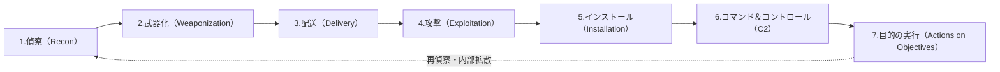
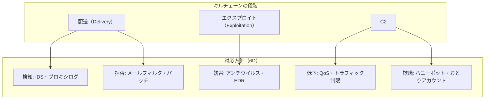

# サイバーキルチェーン（Cyber Kill Chain）

## 1. 概要

> **サイバーキルチェーン（Cyber Kill Chain）**は、標的型サイバー攻撃を偵察から目的達成までつながる7段階の連鎖過程としてモデル化し、各段階を早期に遮断（Break the chain）することで侵害を予防・検知・対応する、防御者中心（Defender-centric）の脅威分析フレームワークである。

もともとキルチェーン（Kill Chain）は、米空軍の標的攻撃教義であるF2T2EA（Find–Fix–Track–Target–Engage–Assess）に由来する軍事用語であり、「敵を発見して最終的な攻撃に至る一連の段階」を意味する。2011年にロッキード・マーティン（Lockheed Martin）の研究者ら（Hutchins, Cloppert, Amin）がこの概念をAPT（Advanced Persistent Threat）防御に適用した論文 *Intelligence-Driven Computer Network Defense* を発表したことで、サイバーセキュリティの中核モデルとして定着した。

このモデルが登場した背景には、防御パラダイムの転換がある。従来のセキュリティは、ファイアウォール・アンチウイルスのような個別の統制によって「侵入時点」だけを防御する事後対応（Reactive）中心であった。しかしAPTは数週間から数か月にわたって密かに進行する多段階の攻撃であるため、単一時点の防御では防ぐことができない。キルチェーンは攻撃を「複数段階の連鎖」に分解することで、**防御者がたった一つの段階を断ち切るだけで攻撃全体を無力化できる**という非対称的な利点（Defender's advantage）を提供する。すなわち、攻撃者はすべての段階を成功させなければならないが、防御者はどれか一つの段階を遮断すればよいため、防御を「インテリジェンス主導（Intelligence-driven）」の能動的な活動へと転換させる点に中核的な意義がある。

また、キルチェーンは攻撃の進行段階を共通言語として標準化し、セキュリティ監視（SOC）・脅威インテリジェンス・インシデント対応（IR）組織が侵害の状況を同じ視点で共有し、統制（Control）を段階ごとにマッピングして防御の空白を特定するための体系的な基準を提供する。

## 2. サイバーキルチェーンの7段階構造

キルチェーンは、攻撃が時系列に進行する7つの順次的な段階で構成される。前の段階ほど防御コストが低く被害も小さいため、**できる限り左側（Left of Boom）で遮断する**ことが原則である。

各段階は単なる順序ではなく、攻撃者が必ず完遂しなければならない**必要条件の連鎖**である。防御者は各段階ごとに攻撃の痕跡（Indicator）を収集・分析して統制を配置する。

### A. 偵察（Reconnaissance）

攻撃者が標的組織に関する情報を収集する準備段階である。組織図・メールアドレス・技術スタック・露出したサーバなどを調査し、そのほとんどが組織の外部で行われるため検知が難しい。

偵察はさらに**受動的偵察**と**能動的偵察**に分けられる。受動的偵察は、LinkedIn・求人広告・企業ホームページ・SNS・検索エンジン（Google Dorking）・Shodanのような公開情報源を活用するOSINT（Open Source Intelligence）であり、標的と直接接触しないため痕跡がほとんど残らない。能動的偵察は、ポートスキャン・バナーグラビング・脆弱性スキャンのように標的システムへ直接パケットを送って情報を得る方式であり、IDS/IPSのログに痕跡を残す。例えば、特定の大企業を狙ったスピアフィッシング攻撃は、まずLinkedInで財務チームの従業員名簿とメールアドレスの形式を収集する偵察から始まる。

防御者はこの段階で、Webログ分析によって異常なスキャンを検知し、公開情報の露出を最小化（Attack Surface Management）し、脅威インテリジェンスによって自社が標的とされている兆候を早期に捕捉する。

### B. 武器化（Weaponization）

収集した情報をもとに、エクスプロイトとバックドアを組み合わせて実際の攻撃ツールを作成する段階である。代表的には、マルウェアが埋め込まれたPDF・Office文書（マクロ）、脆弱性をトリガーするエクスプロイトキット、リモート制御（RAT）ペイロードなどが作られる。

この段階は完全に攻撃者の環境で行われるため、防御者が直接観測することはできない。したがって防御は、武器化の成果物の特徴（悪性文書の構造的パターン、特定のエクスプロイトキットのシグネチャ）を脅威インテリジェンスで確保し、後続の段階で検知するという間接的な方式に依存する。例えば、Emotet系の攻撃はマクロを含むWord文書の形で武器化され、この文書の構造的特徴がそのまま検知指標（Indicator）となる。

武器化の成果物が観測できないという特性は、防御指標を静的なシグネチャ（ハッシュ・文字列）から**行動・戦術の指標（TTP）へと転換**しなければならない理由を説明している。デビッド・ビアンコ（David Bianco）の「痛みのピラミッド（Pyramid of Pain）」によれば、ハッシュ・IPは攻撃者が容易に変更できるため防御効果が低い一方、ツール・TTPレベルの指標を検知すれば攻撃者に再武装のコストを強いるため、はるかに効果的である。キルチェーンの武器化段階は、まさにこの上位指標を確保することの重要性を浮き彫りにする。

### C. 配送（Delivery）

作成された武器を標的へ届ける段階であり、防御者が**初めて能動的防御に介入できる地点**である。メールの添付ファイル（スピアフィッシング）が最も一般的であり、悪性URL、水飲み場攻撃（訪問Webサイトの感染）、USBメディア、サプライチェーン（ソフトウェアアップデートの偽装）などが利用される。

配送段階に防御能力を集中させる理由は、ここで遮断すれば以降のすべての段階が無意味になるからである。メールセキュリティ（アンチスパム・サンドボックス）、Webプロキシ・URLフィルタリング、添付ファイルの無害化（CDR, Content Disarm & Reconstruction）、ユーザーのセキュリティ意識向上教育が中核的な統制である。実際、2016年以降の多数の大規模侵害は、財務・人事チームを狙ったスピアフィッシングメール一通から始まっており、メールゲートウェイのサンドボックスが遮断に決定的な役割を果たした。

### D. 攻撃（Exploitation）

配送された武器が標的システムで実行され、脆弱性をトリガーする段階である。ソフトウェアの脆弱性（例：Officeのリモートコード実行、ブラウザの脆弱性）の悪用、またはユーザーにマクロを許可させるよう誘導するソーシャルエンジニアリングが利用される。

防御の核心は、脆弱性そのものを除去するか、実行を抑止することである。迅速なパッチ管理、EDR（Endpoint Detection & Response）の行動ベースの遮断、DEP/ASLRのようなエクスプロイト緩和技術、アプリケーションのホワイトリスト化、マクロ実行ポリシーの強化が代表的である。ゼロデイ（Zero-day）脆弱性の場合はシグネチャベースの防御が無力であるため、EDRの異常行動検知が実質的な防衛線となる。

### E. インストール（Installation）

エクスプロイト成功後、標的システムにバックドア・RAT・Webシェルなどをインストールして**永続性（Persistence）**を確保する段階である。システム再起動後もアクセスを維持するため、レジストリのRunキー登録、サービスの作成、スケジュールタスク（Scheduled Task）の登録、DLLサイドローディングといった手法を用いる。

ここからは攻撃者が内部に足場（Foothold）を築いたことになるため、防御は**検知と封じ込め**中心へと転換される。EDRのファイル完全性監視（FIM）、実行ファイルの署名検証、最小権限の原則（PoLP）、ホストログ（新規サービス・スケジュールタスクの作成）の分析が中核となる。

### F. コマンド＆コントロール（Command and Control, C2）

インストールされたマルウェアが外部の攻撃者サーバ（C2）と通信チャネルを確立し、リモートからの命令を受信する段階である。攻撃者はこのチャネルを通じて追加のツールをダウンロードし、内部偵察と横展開（Lateral Movement）を指示する。

C2トラフィックは検知を避けるため、HTTPS・DNSトンネリング・正規のクラウドサービス（例：コラボレーションツールのAPI）に偽装（Domain Fronting）する場合が多い。防御は、アウトバウンドトラフィックの分析、既知のC2ドメイン/IPの遮断（脅威インテリジェンスフィード）、DNSの異常検知、ネットワークセグメンテーションとプロキシの強制経由によって対応する。**C2チャネルの遮断は攻撃者の遠隔支配権を断ち切る決定的な防御地点**であり、この段階で発見されれば、まだ実質的な被害が出る前に対応する余地がある。

近年の攻撃者は、Cobalt Strike・Sliverのような商用・オープンソースのC2フレームワークに、ビーコン（Beacon）の通信周期をランダム化するジッター（Jitter）と正規ドメインへの偽装を組み合わせて検知を回避している。これに対して防御者は、単純なシグネチャではなく、通信周期の規則性・JA3フィンガープリント・異常な宛先のエントロピーといった行動指標でビーコンを検知する方向へと対応を高度化させている。

### G. 目的の実行（Actions on Objectives）

攻撃者が最終目的を実行する段階である。データの窃取（Exfiltration）、ランサムウェアによる暗号化、データの破壊・改ざん、アカウント乗っ取りによる金融詐欺、システムの破壊などがこれに該当する。多くのAPTはここで再び偵察に戻り、内部システムへと拡散する反復的な循環構造を持つ。

防御は、DLP（Data Loss Prevention）で大量流出を遮断し、バックアップ・復旧体制でランサムウェアの被害を緩和し、異常なデータ転送の検知（UEBA）とインシデント対応手順（隔離・証拠保全・復旧）によって被害を最小化する。

### H. 総合事例 — ランサムウェア侵害におけるキルチェーンの進行

実際のランサムウェア侵害は、上記の7段階が順番に観測される代表的な事例である。① 攻撃者はLinkedInと流出アカウントDBで財務チームの担当者を特定し（偵察）、② 税金計算書を装ったマクロ文書を作成して（武器化）、③ スピアフィッシングメールで送信する（配送）。④ ユーザーがマクロを許可するとダウンローダーが実行され（エクスプロイト）、⑤ スケジュールタスクで永続性を確保した後（インストール）、⑥ HTTPSに偽装したC2チャネルで追加ツールをダウンロードし、ドメイン管理者権限を奪取して横展開した後（C2）、⑦ 数日にわたってデータを流出させた後に全システムを暗号化する（目的の実行）。各段階の平均滞留時間（Dwell Time）は数時間から数週間であり、防御者が③～⑥のいずれかの地点で異常の兆候を捕捉して遮断していれば、最終的な暗号化（⑦）という大規模な被害は防げたという点が、キルチェーン分析の教訓である。

## 3. 防御統制のマッピング — Courses of Action Matrix

キルチェーンの実質的な価値は、各段階に防御措置をマッピングする**対応方針マトリクス（Courses of Action Matrix）**にある。ロッキード・マーティンは防御行為を、検知（Detect）・拒否（Deny）・妨害（Disrupt）・低下（Degrade）・欺瞞（Deceive）・破壊（Destroy）の6種類に類型化し、これを段階ごとに配置して多層防御（Defense-in-Depth）を設計する。

このマトリクスは、組織が保有するセキュリティ統制を段階・類型別に配置したときに、**どのマスが空いているか（防御の空白）**を視覚的に明らかにする。例えば、配送段階には検知・拒否の統制が十分にあるが、C2段階に欺瞞・妨害の統制がなければ、侵入後の内部拡散を防ぐ能力が不足しているという診断が可能である。このようにキルチェーンは、単なる攻撃の記述を超えて、**防御投資の優先順位を決めるギャップ分析ツール**として活用される。

## 4. 類似フレームワークとの比較

キルチェーンは最初の体系的な攻撃モデルであるが、その後、さまざまな後続・補完フレームワークが登場した。これらは代替関係ではなく、**相互補完的に組み合わせて**使うことが実務の標準である。

| 区分 | サイバーキルチェーン | MITRE ATT&CK | ダイヤモンドモデル | 統合キルチェーン（Unified） |
|------|---------------|--------------|-----------------|----------------------|
| 提唱 | Lockheed Martin(2011) | MITRE(2013~) | Caltagironeら(2013) | Pols(2017) |
| 視点 | 線形7段階（順次） | 戦術・技術マトリクス（非線形） | 4要素の関係分析 | 18段階に拡張 |
| 焦点 | 外部からの侵入の流れ | 侵入後の行動（TTP）の詳細 | 事象の構造的な帰属 | キルチェーン+ATT&CKの結合 |
| 強み | 直感的・統制のマッピング | 実戦的なTTP・検知ルール | 脅威インテリジェンスの帰属 | 内部移動まで包括 |
| 限界 | 内部・境界以降に弱い | 流れ・優先順位が不明確 | 防御統制のマッピングが不足 | 複雑・学習コスト |

キルチェーンは攻撃の**流れと順序**を直感的に示すが、内部侵入後の多様な詳細手法を表現するには段階が粗すぎる。一方、MITRE ATT&CKは14の戦術（Tactic）と数百の技術（Technique）で侵入後の行動を詳細に記述するが、それらの間の時間的な順序や優先順位は示さない。そのため実務では、**キルチェーンで攻撃の大きな流れをつかみ、各段階の内部をATT&CKの技術で詳細化**し、ダイヤモンドモデルで攻撃者（Adversary）・能力（Capability）・インフラ（Infrastructure）・被害者（Victim）の関係を帰属分析するという三重の組み合わせが定着した。例えば、SOCアナリストはEDRのアラートをATT&CKの技術でタグ付けした後、それをキルチェーンの段階に集計して、「現在の攻撃はインストール段階まで進行している」という状況認識を経営陣に伝える。

## 5. 深化 — 限界と進化、実務への適用

**キルチェーンの構造的限界。** 元祖のキルチェーンは、2011年の脅威環境、すなわちメールベースの外部侵入（Perimeter-centric）を前提に設計された。そのため、いくつかの根本的な限界が指摘されている。第一に、**境界防御への偏り**により、すでに内部にいる脅威（内部者・サプライチェーン侵害）や、認証情報の奪取後に正規のログインを装う攻撃は、初期段階が観測されないためモデルが無力となる。第二に、**線形仮定の硬直性**であり、実際のAPTは段階を飛ばしたり並列・反復的に実行したりするが、7段階の順次モデルはこれを表現できない。第三に、クラウド・SaaS・サーバレス環境では「インストール」や「C2」の意味が変わり、オンプレミスの前提と食い違う。

**進化したモデル。** こうした限界を補完するため、**統合キルチェーン（Unified Kill Chain）**はロッキード・マーティンのモデルとATT&CKを組み合わせて18段階に拡張し、特に**初期の足場（Initial Foothold）–ネットワーク拡散（Network Propagation）–目的の実行（Action on Objectives）の3つの局面**に再構成して、内部の横展開を明示的に含めた。また、ランサムウェアに特化したキルチェーン、クラウドキルチェーンなど、ドメイン別の派生モデルも生まれた。

**実務への適用事例。** キルチェーンは、SIEM・SOAR・XDRの検知ルールを体系化する骨格として広く用いられている。SIEMにおいて相関分析（Correlation）ルールをキルチェーンの段階ごとにグループ化すれば、個々のアラートを「偵察→配送→インストール」へとつながる一つの攻撃シナリオとして自動的に結びつけ（Attack Story）、誤検知を減らして対応の優先順位を付けることができる。SOARのプレイブックも、段階ごとの自動対応（配送段階ならメールの隔離、C2段階ならホストのネットワーク遮断）を定義する。韓国国内でも金融業界・公共機関のSOCが監視ダッシュボードをキルチェーンの段階で構成し、多数のアラートの中から「最も進行した段階」を基準に脅威をトリアージする方式を採用している。さらに、インシデント対応報告書や脅威ハンティング（Threat Hunting）の仮説策定においても、「攻撃がどの段階まで到達したか」を共通言語としている。

## 6. 考慮事項および示唆点

技術士の観点から、サイバーキルチェーンの導入・活用にあたっては次の点を考慮しなければならない。

- **単独使用の限界と組み合わせ戦略**: キルチェーンだけでは内部脅威・クラウド攻撃を扱うことが難しいため、MITRE ATT&CK（詳細なTTP）・ダイヤモンドモデル（帰属）と組み合わせた多層的な脅威モデリング体系を構築しなければならない。どれか一つを排他的に選ぶのではなく、視点を相互に補完することが核心である。
- **左側での遮断（Shift-Left）戦略とコストのトレードオフ**: 前の段階で遮断するほど被害と対応コストは小さくなるが、偵察・武器化段階は組織の外部で行われるため検知が難しい。したがって、観測可能性が確保される配送・エクスプロイト段階に統制を集中しつつ、脅威インテリジェンスで上流段階の可視性を補うバランスが必要である。
- **ゼロトラスト・多層防御との連携**: 境界が崩壊した時代には、「すでに侵害されている」という前提のもとで内部移動を遮断するゼロトラスト（Zero Trust）・マイクロセグメンテーションが、キルチェーン後半（インストール・C2・拡散）の防御を補強する。キルチェーンは、ゼロトラスト統制の配置位置を決める地図の役割を果たす。
- **運用成熟度と自動化の連携**: キルチェーンに基づく防御は、SIEM・SOAR・XDRで段階ごとの検知・自動対応を連動させてこそ実効性を持つ。アラートを段階にマッピング・集計する自動化がなければ、フレームワークは文書上の概念にとどまる。組織の監視成熟度（人・プロセス・技術）を併せて引き上げなければならない。
- **脅威インテリジェンスに基づく防御（Intelligence-Driven）への転換**: キルチェーン本来の趣旨は、個々の侵害を「キャンペーン（Campaign）」単位で蓄積・分析し、同一攻撃者の再侵入を早期に予測することである。インシデント対応で収集した各段階の指標（IoC/TTP）をキャンペーンインテリジェンスへとフィードバックする好循環の体制を整えたとき、キルチェーンは一回限りの分析枠組みを超えて、継続的な防御能力として機能する。
- **展望**: AIベースの攻撃（自動偵察・ポリモーフィック型マルウェア）とサプライチェーン攻撃が広がるにつれ、静的な7段階よりも、AIで攻撃の進行をリアルタイムに推定・予測する動的なキルチェーン分析、そして生成AIを活用した攻撃シナリオのシミュレーション・自動対応が発展の方向性として浮上している。

## 参考資料

- Hutchins, Cloppert, Amin, "Intelligence-Driven Computer Network Defense Informed by Analysis of Adversary Campaigns and Intrusion Kill Chains", Lockheed Martin (2011). https://www.lockheedmartin.com/en-us/capabilities/cyber/cyber-kill-chain.html
- MITRE ATT&CK Framework. https://attack.mitre.org/
- Paul Pols, "The Unified Kill Chain" (2017/2021). https://www.unifiedkillchain.com/

---

> **一言まとめ**: サイバーキルチェーンは、標的型攻撃を偵察→武器化→配送→エクスプロイト→インストール→C2→目的の実行の7段階に分解し、どれか一つの段階を断ち切るだけで侵害を無力化する防御者中心のフレームワークであり、MITRE ATT&CK・ゼロトラストと組み合わせて、多層防御とSOCの自動対応の骨格として活用される。
