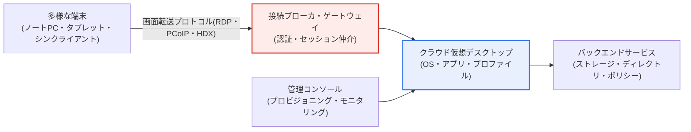
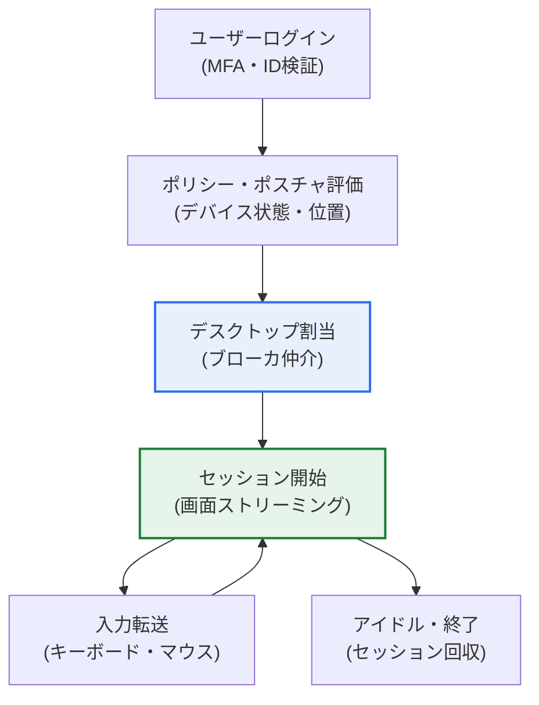

# DaaS（Desktop as a Service）

## 1. 概要

### A. 定義

> **DaaS**（Desktop as a Service）とは、デスクトップ環境（OS・アプリケーション・ユーザーデータ・設定）を**クラウド上の仮想インスタンスとして提供し、ユーザーはあらゆるデバイスから接続して利用する**サブスクリプション型のクラウドサービスである。仮想デスクトップ基盤（VDI）を企業が自ら構築・運用する代わりに、クラウド事業者（CSP）がマネージド型で提供する形態である。

DaaSの核心的価値は「**業務環境を個人PCではなくクラウドに置くこと**」にある。従来、業務データとプログラムは各自のPCにインストールされており、PCを紛失すればデータが漏えいし、複数のデバイスで一貫して作業することが難しく、IT部門は数百台の端末を一台ずつ管理しなければならなかった。DaaSはデスクトップそのものをクラウドに載せることで、この構造を覆す。ユーザーの画面・OS・アプリ・データはすべてクラウドサーバ上にあり、ユーザーはノートPC・タブレット・シンクライアントなど任意の端末から接続し、その「画面」だけを受信して操作する。実際の演算とデータはクラウドにあるため、端末は画面を表示し、キーボード・マウス入力を伝える窓の役割のみを担う。

その結果、三つの効果が同時に生じる。第一に、どこからでも同じ業務環境に接続できる**モビリティ**である。オフィスのPCと在宅のノートPCが同一のデスクトップを参照するため、作業の連続性が保証される。第二に、データが端末に残らないため紛失・漏えいリスクが低減される**セキュリティ**である。盗まれたノートPCには画面キャッシュしかなく、実データはクラウドに残る。第三に、IT部門が中央でデスクトップを一括生成・パッチ適用・回収できる**管理効率**である。新入社員には完成したデスクトップを数分で発行し、退職時には即座に回収できる。とりわけリモートワーク・在宅勤務の拡大に伴い、安全で柔軟な業務環境を提供する手段として脚光を浴びた。

### B. 登場背景と必要性

DaaSの台頭は、三つの潮流が噛み合った結果である。第一に、**リモート・ハイブリッドワークの常態化**である。パンデミックを契機に在宅勤務が普及し、管理されていない家庭ネットワークや個人デバイスから会社のデータにアクセスする状況が日常となった。データを端末にダウンロードせずクラウド上でのみ扱うDaaSは、このリスクを構造的に低減する。第二に、**BYOD**（Bring Your Own Device）の拡大である。個人デバイスで業務を行いたいという要求が高まったが、個人デバイスに会社のデータを置くことはセキュリティ上危険である。DaaSは「デバイスは個人のもの、データはクラウド」と分離することで、このジレンマを解消する。第三に、**初期投資負担の回避**である。オンプレミスVDIはサーバ・ストレージ・ネットワークへの莫大な初期投資と専門の運用人材を必要とする。DaaSはこれをサブスクリプション型の運用費（OpEx）に転換し、中小企業でも仮想デスクトップを導入できるようにした。

こうした背景のもと、DaaSは単なる「クラウドPC」を超え、ゼロトラストセキュリティと結合して「どこから接続しても、ID と状態を検証したうえで統制された環境のみを提供する」次世代業務インフラの一翼を担いつつある。

## 2. DaaSのアーキテクチャと構成要素

DaaSは、ユーザー端末、リモート表示プロトコル、クラウド上の仮想デスクトップ、そしてこれらを管理するコントロールプレーン（control plane）で構成される。以下の全体構成図は、各要素がどのように接続されるかを示している。

この構造において、**接続ブローカ**（Connection Broker）は中核的な関門である。ユーザーが接続すると、まずIDを認証し、そのユーザーに割り当てられた仮想デスクトップへセッションを仲介する。複数ユーザーが接続する際にどのインスタンスへ接続するか、アイドルセッションをいつ終了するかもブローカが決定する。ブローカがボトルネックになったり障害を起こしたりすると全ユーザーが接続不能となるため、冗長化と拡張性が設計の中心となる。

**リモート表示プロトコル**は、使い勝手を左右する第二の軸である。RDP（マイクロソフト）、PCoIP・Blast（Omnissa系）、HDX（シトリックス）などが代表的であり、画面をどれだけ効率的に圧縮・転送できるか、映像・グラフィックス・オーディオをどれだけ滑らかに再現できるかがプロトコルごとに異なる。特にグラフィックス作業（設計・映像編集）にはGPUアクセラレーションと高効率コーデックが必須であり、プロトコルとインスタンス仕様の選択がそのままユーザー満足度に直結する。

### A. セッション生成とプロファイル管理

DaaSでしばしば見落とされるのが、**ユーザープロファイルと状態の管理**である。仮想デスクトップは大きく「専用（persistent）」と「非専用（non-persistent）」に分けられる。専用デスクトップはユーザーごとに固定インスタンスを割り当て、個人設定やインストールしたプログラムがそのまま維持されるが、インスタンス数に比例してリソースとコストがかかる。非専用デスクトップは接続のたびに標準イメージから新しいインスタンスを起動し、ユーザーごとのデータ・設定は別のプロファイルストアから読み込んで結合する。リソース効率は高いが、プロファイルのロード設計が精緻でなければログイン遅延や設定の消失が発生する。どちらの方式を採用するかは、コスト、個人化要求、規制環境を総合的に勘案して決定するトレードオフである。

### B. リアルタイムセッションの流れ

以下は、ユーザーが接続して作業する瞬間のデータの流れを詳細化したものである。実際の処理とデータはクラウドに留まり、端末との間では画面と入力だけがやり取りされる点が要である。

この流れで注目すべき点は、**ログイン時点でのポリシー・ポスチャ評価**（posture check）である。ゼロトラストの原則に従い、単にパスワードが正しいかどうかだけでなく、接続デバイスのセキュリティ状態（ウイルス対策・パッチ・脱獄の有無）、位置、時間帯まで評価し、アクセスレベルを動的に決定する。たとえば管理されていないデバイスから接続した場合は、ファイルのダウンロード・クリップボードのコピー・印刷を遮断した制限セッションのみを許可する、といった具合である。このようにDaaSはセッション開始の瞬間にセキュリティ統制を強制できるという点で、端末に散在したデータを事後的に統制する従来方式よりも根本的に安全である。

## 3. VDIおよび類似サービスとの比較

DaaSはオンプレミスVDIから出発したが、運用主体とコスト構造が異なる。また、アプリケーションのみを提供するサービスやリモートPC接続とも区別される。

| 区分 | オンプレミスVDI | DaaS |
|---|---|---|
| **インフラ** | 自社構築・運用 | クラウド（CSP）が提供・管理 |
| **コスト構造** | 初期投資（CapEx）が大きい | サブスクリプション型（OpEx、使用量ベース） |
| **拡張性** | 物理リソースの限界 | 弾力的（迅速な増減） |
| **運用責任** | 企業IT部門が専任 | CSPへ委託・簡素化 |
| **導入スピード** | 数か月 | 数日〜数週間 |

DaaSがオンプレミスVDIと分かれる根本的な理由は、**資本支出を運用支出へ転換**する点にある。VDIを自ら構築するには、ピーク時の使用量に合わせてサーバをあらかじめ購入しておく必要があり、そのリソースは平常時には遊休状態となる。DaaSは必要な分だけ借りて使った分だけ支払うため、季節的な人員変動（新卒の大量採用、プロジェクト単位の人員）に弾力的に対応できる。ただし、長期的に使用量が大きく安定している場合は、総所有コスト（TCO）の観点でオンプレミスVDIが有利になり得るため、「DaaSは必ず安い」という断定は避けるべきである。

一方、類似概念との違いも明確にしておく必要がある。**SaaS/アプリケーション仮想化**が特定のアプリ一つだけをリモート提供するのに対し、DaaSはOSを含む完全なデスクトップを提供する。また、個人のオフィスPCを遠隔操作する「リモートアクセス」とは異なり、DaaSは物理PCなしにクラウド上でデスクトップを生成するため、拡張性と管理効率が根本的に異なる。

## 4. 活用事例

DaaSは特定の業務パターンにおいて特に強みを発揮し、業界ごとに導入動機が異なる。以下の表は代表的なシナリオと、そのシナリオにおいてDaaSがもたらす主要な利点を整理したものであり、続く段落で各事例の文脈を説明する。

| シナリオ | 特徴 | DaaSの主要な利点 |
|---|---|---|
| **コールセンター・現場職** | 大規模な定型業務、人員変動が頻繁 | 一括イメージ・迅速な増減 |
| **外部委託・協力会社** | 外部人員の期間限定アクセス | データ非持ち出し・即時回収 |
| **グローバル・災害対応** | 支社・在宅・非常時 | 同一環境・事業継続性（BCP） |
| **グラフィックス・研究業務** | 設計・映像・AI開発 | GPU共有・ハイスペック機のコスト削減 |

第一に、**コールセンター・現場職などの大規模な定型業務**である。数百〜数千人が同一の業務アプリを使う環境では、非専用デスクトップを標準イメージで一括提供することで管理負担を大幅に削減できる。人員変動が頻繁な季節性の事業では、迅速な増減が特に有効である。

第二に、**外部人員・協力会社のアクセス統制**である。外部委託の開発者や協力会社に会社のデータを端末で渡さず、統制されたクラウドデスクトップのみを提供すれば、契約終了時にデスクトップを回収するだけでアクセスを即座に遮断できる。金融・公共のようにデータの持ち出しが厳格に統制される分野で事例が多い。

第三に、**グローバル・災害対応**である。支社や海外の人員に本社と同一の環境をクラウドで提供し、災害によってオフィスが使えない場合でもどこからでも業務を再開できるため、事業継続計画（BCP）の手段となる。実際、リモートワークの拡大期には、多くの企業が短期間でDaaSを導入して在宅勤務への移行を完了した事例が報告されている。

## 5. 深掘り：ゼロトラスト・DaaS市場の進化

DaaSの戦略的意義は、**ゼロトラストアーキテクチャの実行ポイント**となる点にある。ゼロトラストは「信頼せず、常に検証せよ」という原則であり、DaaSはこれを実装するのに適したポイントである。すべてのアクセスがブローカ・ゲートウェイという単一の統制点を経由し、セッション単位でIDとデバイス状態を検証し、データが端末へ流れないためである。こうした理由から、DaaSはSASE（Secure Access Service Edge）・SDP（Software Defined Perimeter）と結合し、「境界のない安全な業務アクセス」の中核的構成要素として定着しつつある。

市場面では、主要なクラウド事業者がマネージド型DaaSを競って提供している。マイクロソフトのWindows 365・Azure Virtual Desktop、アマゾンのAmazon WorkSpaces、そしてシトリックス・Omnissa（旧VMwareエンドユーザーコンピューティング）系のクラウド提供が代表的である。製品ごとに課金方式（月額定額 vs 使用量）、対応プロトコル、GPU対応、管理統合の水準が異なるため、選定時には綿密な比較が必要である。具体的な市場規模やシェアの数値は調査機関によって大きくばらつくため、特定の値を断定するよりも、「リモートワークの常態化とセキュリティ要求によって成長傾向が明確である」という方向性として理解するのが無難である。

もう一つの進化は、**GPUベースの高性能DaaS**である。かつてのDaaSは文書・Web中心の軽量業務に適していたが、GPUインスタンスと高効率コーデックの発展により、設計（CAD）・映像編集・AI開発のようなグラフィックス・演算集約型の業務までクラウドデスクトップで受け入れる事例が増えている。これは、ハイスペックなワークステーションを個人に支給する代わりにクラウドリソースを共有してコストを下げるという、新たな活用モデルを切り開くものである。

## 6. 考慮事項および示唆（技術士の観点）

1. **ネットワーク依存性と遅延が使い勝手を左右する。** DaaSは画面をリアルタイムに転送するため、ネットワーク品質がそのまま体感性能となる。帯域不足・高遅延の環境では入力の反応が遅くなり、生産性が低下する。低遅延プロトコル、ユーザーに近接したリージョン配置（エッジ）、オフライン時の代替策を併せて設計すべきであり、特にグラフィックス業務ではGPU・コーデックの仕様を別途検討しなければならない。

2. **セキュリティと集中管理は最大の強みであると同時に、新たな単一障害点でもある。** データが端末に残らないため漏えいリスクが低く、中央でのパッチ・ポリシー適用によって管理が簡素化されるが、逆にブローカ・ゲートウェイが突破されたりダウンしたりすると全体が麻痺する。ゼロトラストに基づくアクセス制御、セッション分離、管理プレーンの冗長化によって、強みを活かしつつ集中リスクを分散すべきである。

3. **コストは利用パターンに応じて再評価しなければならない。** DaaSは初期投資をなくすが、使用量が大きく安定している場合は、長期TCOでオンプレミスVDIより高くなり得る。専用/非専用の混在、アイドルセッションの自動終了、オートスケーリングによってコストを最適化し、導入前に利用シナリオ別のTCOシミュレーションに基づいて意思決定することが望ましい。

4. **ゼロトラスト・リモートワーク基盤として統合的に設計する。** DaaSを個別のツールではなく、ID管理（IAM）・MFA・SASE・EDRと連携するセキュアアクセス体系の一部として設計してこそ、効果が最大化される。接続時点でのID・デバイスポスチャの検証を強制し、アクセスレベルを動的に調整するポリシーを標準化すべきである。

5. **データ主権・規制遵守とロックイン（lock-in）を併せて考慮する。** データとデスクトップが特定のCSPに置かれるため、データ保管リージョン、個人情報規制の遵守、CSPへの依存リスクを事前に点検しなければならない。プロファイル・イメージの可搬性を確保して出口戦略を用意し、特定の事業者に過度に縛られないようガバナンスを設計することが、技術士の観点における要点である。

## 参考資料

- Microsoft, "What is Azure Virtual Desktop?" — https://learn.microsoft.com/azure/virtual-desktop/overview
- Amazon Web Services, "Amazon WorkSpaces" — https://aws.amazon.com/workspaces/
- NIST SP 800-207, "Zero Trust Architecture" — https://csrc.nist.gov/pubs/sp/800/207/final

---

> **一言まとめ**: DaaSは*デスクトップ環境（OS・アプリ・データ）をクラウドで仮想的に提供*し、あらゆる端末から接続できるサブスクリプション型サービスであり、接続ブローカ・リモート表示プロトコル・プロファイル管理を軸にVDIを弾力的に代替する。モビリティ・セキュリティ（データ非残存）・集中管理という強みによってゼロトラスト・リモートワークの基盤となるが、ネットワーク依存性・集中リスク・TCO・CSPへのロックインを併せて管理しなければならない。
