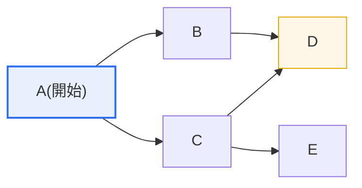
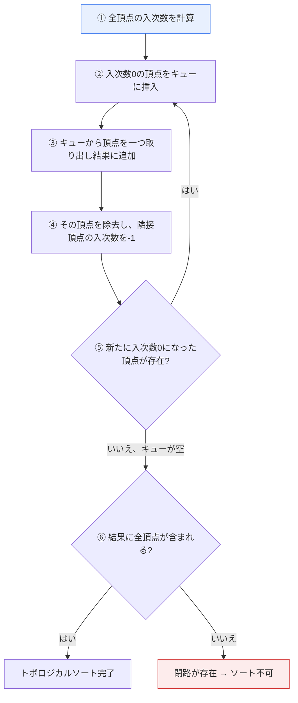

# 有向非巡回グラフ（DAG）とトポロジカルソート

## 1. 概要

### A. DAGの概念

> **有向非巡回グラフ**（DAG, Directed Acyclic Graph）とは、**辺に向きがあり（directed）、ある頂点から出発して自分自身に戻ってくる閉路（cycle）が存在しない**グラフである。作業の前後関係・依存関係を矛盾なく表現するのに適したデータ構造である。

DAGがコンピュータサイエンスの全分野で広く用いられる根本的な理由は、「**順序と依存関係がある仕事を表現するのにぴったりである**」という点にある。辺に向きがあるということは「Aの次にB」という先行（precedence）関係を、閉路がないということは「堂々巡りする論理的矛盾がない」ことを意味する。もし閉路があれば、AはBに先行しなければならないと同時にBもAに先行しなければならないという矛盾が生じ、実行順序を決められない。DAGは構造的にこのような矛盾を排除するため、**常に有効な実行順序が存在することが保証**される。

この性質により、現実の数多くの「順序のある依存関係」がDAGとしてモデル化される。大学の履修前提科目の関係、ビルドシステムのコンパイル依存性（例：`main.o`は`main.c`がコンパイルされた後にリンク）、プロジェクトのスケジュール管理（PERT/CPMの作業ネットワーク）、データパイプライン（Apache Airflowのワークフロー定義）、スプレッドシートの数式再計算の順序、さらにはブロックチェーンやGitのコミット履歴（親コミットを指す有向グラフ）まで、すべてDAGである。つまりDAGは特定のアルゴリズムではなく、**依存性という問題領域を表現する共通言語**に近い。

このように表現されたDAGにおいて、「どの順序で処理すればすべての依存性を満たせるか」を実際に計算する手続きこそが**トポロジカルソート**（Topological Sort）である。したがって、DAGは問題を表現するモデルであり、トポロジカルソートはそのモデルを解く代表的なアルゴリズムであるという関係で理解すればよい。

### B. 登場背景と必要性

初期のソフトウェアビルドや作業スケジューリングでは、人が手作業で順序を並べていたが、構成要素が数百〜数千に増えるにつれて依存関係が複雑に絡み合い始めた。たとえば数百のソースファイルを持つプロジェクトで「何を先にコンパイルすべきか」を人が毎回計算することはほぼ不可能であり、循環依存が潜んでいれば発見すら難しい。この問題を自動化するため、**依存関係をグラフで表現し、実行順序を機械的に導出する**方式が必要となり、DAGとトポロジカルソートがその理論的・実用的基盤となった。

また、並列・分散処理の普及もDAGの重要性を高めた。互いに依存しない作業は同時に実行できるが、DAG構造を分析すれば「どの作業同士が独立していて並列化可能か」を正確に把握できる。すなわちDAGは単なる順序決定を超え、**並列化可能な最大限を見出してリソース活用を最大化する**根拠を提供する。

### C. 特徴

| 特徴 | 内容 | 実務的含意 |
|---|---|---|
| **有向性（Directed）** | 辺が前後・依存関係を表現 | 「Aの次にB」を明示 |
| **非巡回（Acyclic）** | 閉路がない → 矛盾のない順序が存在 | デッドロック・循環依存を排除 |
| **トポロジカルソート可能** | 常に線形順序に並べられる | 実行順序を自動導出 |
| **半順序（Partial Order）** | 独立した頂点間の順序は自由 | 並列実行の余地を把握 |

## 2. トポロジカルソートの概念と構造

> **トポロジカルソート**とは、DAGのすべての頂点を、**すべての辺が前→後の向きになるように（先行頂点が後続頂点より先に来るように）一列に並べる**ことである。すなわち、半順序（partial order）を矛盾なく全順序（total order）へ拡張する演算である。

以下は、一つのDAGとそれに対するトポロジカルソートの意味を示した全体構成図である。

上のDAGにおけるトポロジカルソートとは、「すべての矢印が左→右を向くように」頂点を並べる作業である。たとえば **A → B → C → D → E** や **A → C → B → E → D** など、複数の解があり得る。要点は、ある頂点が並べられる前に、その頂点を指すすべての先行頂点が先に出ていなければならないということである。DはBとCの両方が処理された後でなければ出られず、EはCが処理された後に出られる。

ここで注目すべきは、BとCの間には辺がないことである。両者の間には前後の制約がないため、Bが先でもCが先でも、トポロジカルソートとしてはどちらも有効である。このように**制約のない頂点対の順序が自由であるため、トポロジカルソートの結果は一意ではなく**、この自由度こそが並列実行の機会を意味する。実行エンジンの立場から見れば、BとCは同時に処理できる候補である。

### A. Kahnのアルゴリズム（入次数ベース）

代表的なトポロジカルソートのアルゴリズムは**Kahnのアルゴリズム**であり、入次数（in-degree、入ってくる辺の数）が0の頂点を繰り返し探して除去する方式である。入次数が0であるということは「その頂点に先行すべき作業が一つも残っていない」ことを意味するため、今すぐ実行可能な頂点であることを示す。

この手順を先の例のDAGに適用してみよう。最初に入次数が0の頂点はAだけである（Aを指す頂点はない）。Aを結果に入れて除去すると、BとCの入次数がそれぞれ0になる。これでBとCが実行候補となり、キューから取り出す順序によって結果が分かれる。B、Cを処理するとDの入次数が0になり（B・C双方からの辺がすべて除去される）、EもCの処理時点で0になる。最終的に、たとえば **A, B, C, D, E** という順序が得られる。

Kahnのアルゴリズムの重要な副次効果は、**閉路検出**である。手順が終了したにもかかわらず結果に含まれる頂点数が全頂点数より少なければ、残った頂点同士が循環的に互いを指しているために入次数が決して0にならなかったということである。すなわち「トポロジカルソートに失敗した = グラフに閉路がある」が成立する。時間計算量は頂点数V、辺数Eに対して **O(V + E)** であり、すべての頂点と辺を定数回ずつしか訪問しないため、大規模グラフでも効率的である。

### B. DFSベースのトポロジカルソート

もう一つの方式は、**深さ優先探索**（DFS）を用いるものである。各頂点からDFSを行い、ある頂点のすべての子（後続頂点）の探索が終わった時点（post-order、戻ってくる瞬間）でその頂点をスタックに積む。すべての探索が終わった後、スタックを逆順に取り出せばトポロジカルソートの結果となる。

この方式が成立する理由は直感的である。ある頂点uからvへの辺があれば、DFSはuの探索を終える前に必ずvの探索を先に終える（vはuの子孫であるため）。したがってvがuより先にスタックに積まれ、スタックを逆順に読むとuがvより前に来るため、「先行するものが先」というトポロジカルソートの条件が自動的に満たされる。DFS方式も各頂点・辺を一度ずつ訪問するため時間計算量は **O(V + E)** で同一であり、探索中にまだ探索が終わっていない頂点（灰色の頂点）へ向かう後退辺（back edge）に出会えば、閉路があると判定する。

二つのアルゴリズムは性能こそ同じだが、性格が異なる。Kahnのアルゴリズムはキューを使って反復的（iterative）に実装されるためスタックオーバーフローの危険がなく、入次数0の頂点が複数あるときに並列実行の候補を自然に浮かび上がらせるという利点があり、ワークフロースケジューラに適している。一方、DFS方式は再帰で簡潔に実装でき、強連結成分（SCC）分解など他のグラフ分析と組み合わせやすい。

## 3. 活用事例

トポロジカルソートは理論にとどまらず、私たちが日々使うツールのエンジンの中で動作している。以下の事例はいずれも「依存関係をDAGで表現し、トポロジカルソートで実行順序を導出する」という同一の原理を共有している。

| 分野 | 活用 | 具体例 |
|---|---|---|
| **ビルド・コンパイル** | ソース依存性の順序決定 | Make、Bazelのターゲットグラフ |
| **作業スケジューリング** | 前後作業の順序・クリティカルパス | PERT/CPM、MS Project |
| **データパイプライン** | タスクの依存実行・並列化 | Apache Airflow、Dagster |
| **パッケージ管理** | インストール・依存性解決の順序 | apt、npm、Maven |
| **履修前提科目・カリキュラム** | 履修順序の決定 | 大学の履修登録システム |

最も代表的な事例は、**データパイプラインのオーケストレーション**である。Apache Airflowはワークフローを文字どおり「DAG」と呼び、各タスク（例：データ抽出 → クレンジング → 集計 → ロード）を頂点として、依存関係を辺として定義する。スケジューラはこのDAGをトポロジカルソートして実行順序を決めるが、互いに依存しないタスク（例：異なる二つのソースからの抽出）は同時に実行して処理時間を短縮する。数百のタスクからなるパイプラインで循環依存が誤って定義されると、AirflowはDAG登録の段階でそれを拒否するが、これこそがトポロジカルソートの失敗による閉路検出の実際の適用である。

二つ目の事例は、**ビルドシステム**である。GoogleのBazelや伝統的なMakeは、ソース・ヘッダ・ライブラリ間の依存関係をDAGとして構成し、トポロジカルソートの順序でコンパイルする。このとき変更されていない頂点の結果をキャッシュすれば（インクリメンタルビルド）、数万ファイル規模の大規模コードベースでも変更分とそれに依存する部分だけを再ビルドし、ビルド時間を分単位から秒単位に短縮できる。ここでも依存のないターゲットは複数のCPUコアに分散して並列コンパイルされる。

三つ目の事例は、**プロジェクトのスケジュール管理**（PERT/CPM）である。作業（activity）を頂点、前後関係を辺としたDAGにおいて、トポロジカルソートの順序で各作業の最早・最遅開始時刻を計算すると、プロジェクト全体の期間を決定する**クリティカルパス**（Critical Path）を見出せる。たとえば20の作業からなるプロジェクトでクリティカルパス上の作業が1日遅れればプロジェクト全体が1日遅れるため、管理者はこの経路にリソースを集中させる。

## 4. 深掘り：並列スケジューリングと閉路処理の戦略

現代のシステムにおけるトポロジカルソートの価値は、単なる順序決定よりも**並列実行の最適化**にある。Kahnのアルゴリズムを変形し、各ラウンドで入次数が0の頂点を「一まとまり（レベル）」として同時に処理すると、DAGを複数のレベルに分割できる。各レベル内の頂点は互いに独立しているため並列実行が可能であり、レベル数がそのまま並列実行時の最小ステップ数となる。この概念は、GPUの演算グラフのスケジューリング、分散バッチ処理、ハードウェア回路の組合せ論理の遅延解析などにそのまま用いられる。

一方、実務では「本来DAGであるべきなのに閉路が生じる」問題が頻繁に発生する。マイクロサービス間の循環呼び出し依存、循環参照を持つモジュール、スプレッドシートの循環参照数式などがその例である。このような場合には、(1) トポロジカルソートで閉路を検出・警告する、(2) 強連結成分（SCC）を一つのスーパー頂点に縮約し（縮約グラフ、condensation）、残りの部分だけでもDAGとして処理する、(3) 依存を断ち切るリファクタリング（インタフェース分離、イベント駆動の非同期化）によって閉路そのものを除去する、といった戦略をとる。ディープラーニングフレームワークの計算グラフも、順伝播はDAGであるが、再帰型ニューラルネットワーク（RNN）は時間軸方向に展開（unrolling）してDAGに変換したうえで逆伝播を行う。

ビッグデータ・AIの領域でもDAGは中核的な抽象化である。Apache Sparkはユーザーの変換演算をDAGとして構成し、それを複数のステージに分割して実行計画を最適化する。TensorFlow・PyTorchの自動微分も、順伝播の計算グラフ（DAG）を逆方向に走査して勾配を伝播させる。このように「演算をDAGで表現し、トポロジカル順序で実行・微分する」というパターンは、現代のデータ・AIスタック全般に共通する設計原理として定着している。

## 5. 考慮事項および示唆

1. **閉路検出・デッドロック予防のツールとして活用する。** トポロジカルソートが可能かどうかは、そのままグラフの非巡回性の判定であるため、依存性の循環・リソースのデッドロック（deadlock）・循環参照を早期に発見する検証手段として使える。大規模システムの設計時に依存グラフを定期的にトポロジカルソートし、循環依存をアーキテクチャ品質指標として管理する戦略が有効である。

2. **並列化の余地を定量的に把握し、リソース活用を最適化する。** トポロジカルソートの半順序の性質は、どの作業が独立しているかを明らかにするため、レベル分割によって並列実行可能な最大値とクリティカルパス長を計算できる。これはスケジューリング・リソース配分・性能予測の定量的根拠となる。

3. **結果の非一意性を制御する戦略が必要である。** トポロジカルソートの解は複数存在するため、再現可能なビルドや決定的な実行が必要であれば、頂点名・優先度・コストなどの二次基準を与えて決定的順序（deterministic order）を強制しなければならない。逆に最適化が目的であれば、この自由度をスケジューリングの最適化に活用する。

4. **動的な変化に対するインクリメンタル処理を考慮する。** 実システムのDAGは頂点・辺が頻繁に追加・削除されるため、毎回全体を再ソートするよりも、変更の影響範囲だけを再計算するインクリメンタルなトポロジカル順序付け（incremental topological ordering）が必要である。これはインクリメンタルビルドやリアルタイムパイプラインの応答性を左右する重要な設計ポイントである。

5. **関連するデータ構造・アルゴリズムとともに理解する。** トポロジカルソートは、グラフ表現（隣接リスト/行列）、キュー・スタック（[[stack-queue-list]]）、DFS/BFS、最短経路・クリティカルパスの計算と密接に結びついている。技術士の観点では、個々のアルゴリズムを暗記するよりも、「依存性の問題をDAGでモデル化し、トポロジカルソートで解決する」という問題解決のパラダイムを体得することが重要である。

## 参考資料

- Wikipedia, "Topological sorting" — https://en.wikipedia.org/wiki/Topological_sorting
- Wikipedia, "Directed acyclic graph" — https://en.wikipedia.org/wiki/Directed_acyclic_graph
- Apache Airflow Documentation, "DAGs" — https://airflow.apache.org/docs/apache-airflow/stable/core-concepts/dags.html

---

> **一言まとめ**: DAGは*向きがあり閉路のないグラフ*として前後・依存関係を矛盾なく表現し、トポロジカルソートは*すべての辺が前→後になるように頂点を並べる*（Kahn：入次数0から除去、またはDFSのpost-order逆順、いずれもO(V+E)）ことで、ビルド・スケジューリング・データパイプラインの実行順序を決定し、並列化の余地と閉路をあわせて明らかにする。
