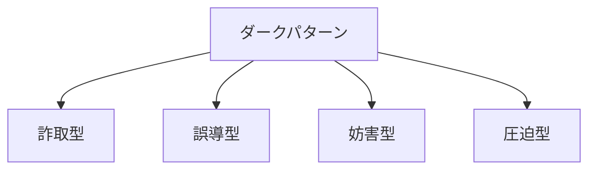

# ダークパターン（Dark Pattern）

## 1. 概要

### A. 定義
> ユーザーを**欺瞞・誤導・妨害・圧迫して非合理的な選択へ誘導**することで、事業者の利益を得るように設計されたUI/UX手法。「騙しの商法」とも呼ばれる。

ダークパターンの本質は、**人間の認知バイアスと習慣を悪用する**点にある。人はデフォルト設定をそのままにし（現状維持バイアス）、時間的な圧力を受けると衝動的に決定し、複雑な手続きに出会うと途中で諦める。ダークパターンはこうした心理的弱点を狙い、ユーザーが自らの真の利益に反する選択（望まない決済、解約の断念）をするよう、インタフェースを意図的に歪めて設計する。

### B. 登場背景および問題点
電子商取引、とりわけ**サブスクリプション経済**の拡大に伴い、ダークパターンによる被害が急増した。サブスクリプションモデルは「加入は簡単に、解約は難しく」するほど事業者の収益が増える構造であり、解約妨害のようなダークパターンを誘発する強い経済的動機が内在している。無料体験後の自動有料移行や隠れた追加料金のように、消費者が認識しないうちに支出が発生する被害が累積したことから、韓国の公正取引委員会・EU・米国FTC・OECDが規律を強化する傾向にある。問題の核心は、個々の消費者が損害を認識しにくく、認識しても対応コストが大きいため放置されやすいという点である。

## 2. 詳細類型

ダークパターンはユーザーを欺く方式によって四つの類型に分けられ、各類型は異なる心理を突く。**詐取型**は、ユーザーが気づかないうちに決済や追加購入をこっそり紛れ込ませる方式であり、注意力の隙を狙う。**誤導型**は虚偽情報によって誤った判断を誘導するもので、虚偽の定価を表示して割引の錯覚を起こさせるのが典型である。**妨害型**は、ユーザーが望む行動（解約・退会）を意図的に難しくして断念を誘導するもので、加入はワンクリックなのに解約は電話でしか受け付けない「ローチモーテル」が代表例である。**圧迫型**は緊急性・希少性・罪悪感を刺激して衝動的な決定へ追い込む。たとえば「現在3人がこの商品を見ています」という文言や、「特典を放棄しますか？」のようなコンファームシェイミングがこれに該当する。

| 類型 | 突く心理 | 詳細手法 | 例 |
|---|---|---|---|
| **詐取型** | 注意力の隙 | 隠れた更新、こっそり追加（sneaking） | 無料体験後の自動有料移行の告知不足 |
| **誤導型** | 誤った情報による判断 | 虚偽割引、偽装広告、おとり商法（bait and switch） | 虚偽の定価表示による割引の錯覚 |
| **妨害型** | 手続き疲れ・断念 | 解約・退会手続きの複雑化（ローチモーテル） | 加入はワンクリック、解約は電話のみ |
| **圧迫型** | 緊急性・罪悪感 | 品切れ間近、コンファームシェイミング | 「現在3人が閲覧中」、拒否に罪悪感を与える文言 |

## 3. ナッジ vs ダークパターン（比較）

ダークパターンを理解するには、正反対の概念である**ナッジ**（Nudge）と対比するのが効果的である。どちらもインタフェースによってユーザーの選択を誘導するという点で外見は似ているが、**誰の利益のためか**で分かれる。ナッジは臓器提供のデフォルト登録のように、ユーザー・社会の利益のために良い選択を容易にしつつ、他の選択の自由を保障する。一方、ダークパターンは事業者の利益のためにユーザーを誤導・圧迫し、選択の自由を実質的に侵害する。したがって両者を分ける決定的な判断基準は、**消費者の利益が侵害されるか、選択の自由が実質的に保障されているか**である。

| 区分 | ナッジ（Nudge） | ダークパターン |
|---|---|---|
| **目的** | 利用者・社会の利益、選択の支援 | 事業者の利益、消費者の欺瞞 |
| **透明性** | 選択の自由を保障、情報が明確 | 誤導・圧迫、情報の隠蔽 |
| **判断基準** | **消費者利益の侵害の有無 · 選択の自由の実質的保障** | |

## 4. 対応策

ダークパターンは事後規制だけでは捕捉が難しく、**事前予防と並行**させる必要がある。規制（事後）はすでに発生した被害を処罰・是正するにとどまるが、新たなダークパターンは絶えず進化するからである。そのため制度面では、電子商取引法の改正によって禁止類型を明示し、課徴金・是正命令によって抑止力を確保しつつ、設計面では公正なUXガイドラインと自主規制によって、そもそもダークパターンが作られないよう予防する。事業者は透明な価格表示と「加入と同じくらい簡単な解約」、明示的同意（Opt-in）を遵守し、消費者はサブスクリプションや決済の履歴を定期的に点検する意識が必要である。これら四つの主体がともに動いてこそ実効性が生まれる。

| 主体 | 対応 |
|---|---|
| **制度（事後）** | 電子商取引法の改正、**禁止類型の明示**、課徴金・是正命令 |
| **技術・設計（事前）** | 公正なUXガイドライン、明確な告知・同意、自主規制 |
| **事業者** | 透明な価格・解約手続き、Opt-in（明示的同意）の遵守 |
| **消費者** | 意識の向上、決済・サブスクリプション履歴の定期的な点検 |

## 5. 考慮事項および示唆（技術士の観点）
- **事後規制 + 事前の倫理的設計の並行**: 規制は後手に回るため、UX倫理（Ethical Design）を組織文化に内在化させ、設計段階でふるい落とすことが根本的な対策である。
- **グローバルな規律への対応**: EUデジタルサービス法（DSA）や米国FTCがダークパターンを明示的に規律しているため、グローバルサービスは各国の基準を併せて満たさなければならない。
- **A/Bテストの倫理**: コンバージョン率だけを追うA/Bテストは無意識のうちにダークパターンへ流れかねないため、指標に「消費者利益の侵害の有無」を併せて反映するガバナンスが必要である。
- **信頼こそが長期的利益**: 短期的なコンバージョン率のための欺瞞はブランドへの信頼を蝕むため、透明な設計が結局は持続可能な成長につながるという視点の転換が求められる。

---

> **一言まとめ**: ダークパターンは*詐取・誤導・妨害・圧迫型*として認知バイアスを悪用し消費者を欺く設計であり、ナッジとの判断基準は消費者利益の侵害の有無である。**制度による規律（事後）+ 透明な設計・UX倫理（事前）+ 消費者の意識**という多層的な対応が必要である。
