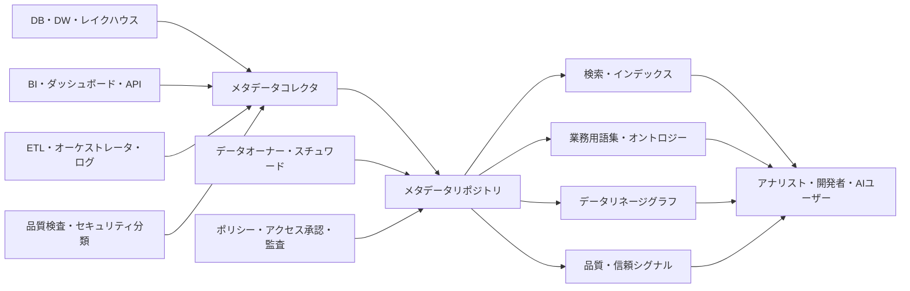
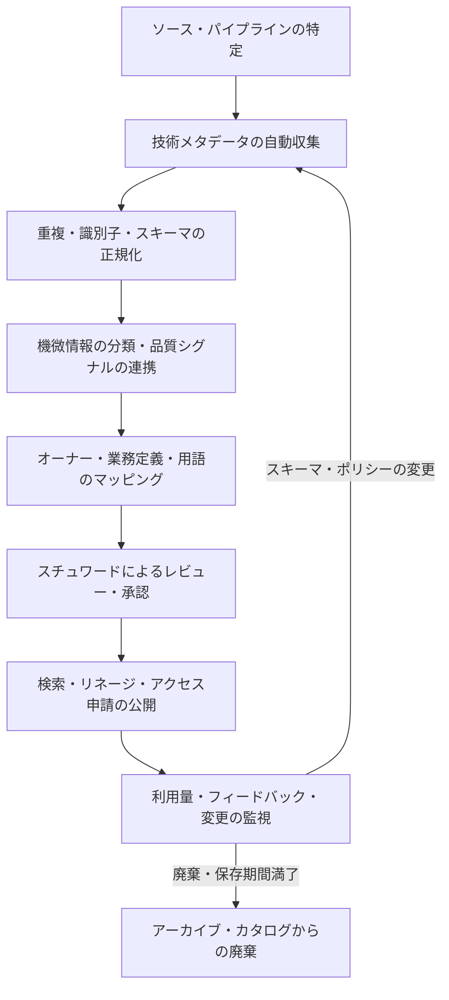

# データカタログ（Data Catalog）とメタデータ管理

## 1. 概要

> **データカタログ**（Data Catalog）とは、組織が保有・共有するデータ資産を検索し、理解し、信頼し、利用できるように、技術メタデータ、業務メタデータ、運用メタデータ、ガバナンス情報を結び付けて提供する管理体系である。

データベースやデータレイクが増えるほど、データが存在する場所を知っているだけでは実際の活用は難しくなる。

同じ`customer_id`という名前が、システムごとに顧客番号、会員番号、匿名化識別子を意味することがあり、テーブルの最新時刻がロード時刻なのか業務発生時刻なのかも異なり得る。

データカタログはデータ自体を複製して保存するリポジトリではなく、データ資産に関する説明と関係を参照できるようにするメタデータの探索・統制レイヤである。

ユーザーはカタログでデータセットの定義、オーナー、更新周期、品質状態、個人情報の分類、利用承認の手続き、上流・下流のリネージを確認したうえで、実際のソースへ移動する。

したがってカタログの目標は単なる目録化ではなく、「どのようなデータがあるか」から「どの目的に、どのような条件で使えるか」までの意思決定を支援することにある。

メタデータとはデータを説明するデータであり、技術メタデータだけでは業務上の意味と責任を表現できない。

ISO/IEC 11179-1:2023は、メタデータをデータに関する説明と捉え、メタデータレジストリに関する概念的理解の基盤を提供している（[ISO/IEC 11179-1:2023](https://www.iso.org/standard/78914.html)）。

データカタログは、この標準のメタデータ管理の観点、データガバナンスの責任・ポリシーの観点、データ品質およびリネージ管理の観点をつなぐ実務プラットフォームと見なすことができる。

カタログが成功するためには、登録件数よりも、ユーザーが実際に検索して再利用し、変更影響分析や監査に活用しているかどうかが重要である。

逆に、自動収集されたスキーマばかりで定義・オーナー・品質情報が空であれば、カタログは最新性を失ったもう一つの文書リポジトリになってしまう。

本答案では、データカタログの構成要素、メタデータの類型、収集・キュレーションの手順、リネージと品質の連携、標準および導入戦略を論述形式で整理する。

## 2. 登場背景と必要性

### A. データのサイロ化と発見コスト

業務システム、ファイルサーバ、SaaS、ログプラットフォーム、データウェアハウス、レイクハウスがそれぞれ異なる命名規則とアクセス手続きを用いると、データ利用者はまず「どこにあるか」を探すことに時間を費やす。

データエンジニアがソースを見つけても、カラム定義と更新時点を担当者に改めて確認しなければならないため、分析着手までの時間が長くなる。

この過程が人の記憶やメッセンジャーに依存していると、担当者の異動時に知識が失われ、同じデータセットを複数のチームが重複して作り出すことになる。

カタログは検索インデックスと業務用語集を提供して発見コストを下げるが、検索機能だけで意味が自動的に生まれるわけではない。

組織は中核となるデータドメインと優先ユースケースを定め、必須メタデータと責任者を指定しなければならない。

たとえばマーケティングチームが「月間アクティブ顧客」を探す場合、テーブル名よりも標準用語、計算式、基準日、除外条件、承認済みデータプロダクトを併せて検索できなければならない。

### B. 信頼性と規制対応

データ品質の問題は、分析結果の誤りだけでなく、誤った顧客通知、規制報告の誤り、モデルのバイアスにもつながり得る。

カタログに最新成功時刻、null比率、重複率、スキーマ変更、直近の障害といった品質シグナルを結び付ければ、利用者はデータの適合性を判断できる。

個人情報や重要情報は、存在する事実のみを公開し原文は公開しないという方式で、メタデータへのアクセスを分離できる。

たとえばカラムに「住民登録番号」があるという事実はセキュリティ担当者には見せつつ、一般の分析者には原文サンプルや値のプレビューを隠すことができる。

カタログ自体が機微な構造情報を露出させる可能性もあるため、カタログの検索権限、監査ログ、APIトークン、メタデータ保存ポリシーも保護対象となる。

## 3. データカタログの概念構造

データカタログは、資産、意味、関係、責任、品質、ポリシーを一つの探索体験にまとめる。

次の構造において、コレクタはソースシステムからメタデータを読み取り、保存・インデックスレイヤは検索と関係の探索を支援し、ガバナンスレイヤはオーナーシップとポリシーを管理する。

### A. データ資産とメタデータエンティティ

資産は、データベース、スキーマ、テーブル、カラム、ファイル、トピック、API、ダッシュボード、レポート、MLの特徴量とモデルなどに細分化できる。

資産の識別子はシステムごとの名前だけを使うのではなく、環境、ドメイン、プラットフォームを含むグローバル識別子として管理すべきである。

たとえば`prod.crm.customer`と`dev.crm.customer`を同じ資産として統合すると、本番データとテストデータの品質・権限を混同することになる。

メタデータレコードは、資産の名前、説明、作成・変更時刻、スキーマ、場所、オーナー、タグ、分類、利用量、品質結果、リネージ関係を持つことができる。

ISO/IEC 11179-3:2023は、メタデータレジストリに記録する情報の概念データモデルを規定しており、2023年に発行された第4版である（[ISO/IEC 11179-3:2023](https://www.iso.org/standard/78915.html)）。

カタログの実装は、標準のすべての項目をそのまま写す方式よりも、組織の検索・監査・共有の目的に合った中核属性をまず定義し、それを拡張していく方式が現実的である。

### B. メタデータの類型

技術メタデータとは、データベース・テーブル・カラム・型・パーティション・ファイル形式・スキーマバージョンのように、システムが直接抽出できる情報を指す。

業務メタデータとは、用語定義、業務ルール、KPIの計算式、ドメイン、データプロダクトの説明のように、人が読んで合意すべき意味情報を指す。

運用メタデータとは、ロードの成否、最終更新、実行時間、利用量、クエリ頻度、コスト、SLA違反といった実行コンテキストを指す。

ガバナンスメタデータは、オーナー、管理者、個人情報の等級、保存期間、アクセスポリシー、承認状態、監査履歴を含む。

リネージメタデータは、ソースから変換を経てテーブル・ダッシュボード・モデルに至る流れとカラムの変換を表す。

五つの類型は互いに代替関係にあるものではない。

スキーマがあっても業務定義がなければ検索結果を解釈できず、定義があっても最新性・品質シグナルがなければ利用の可否を判断できない。

| 類型 | 主要属性 | 収集・管理方式 | 利用者にもたらす判断 |
|---|---|---|---|
| 技術 | スキーマ、型、場所、パーティション | コネクタ・APIによる自動収集 | どこにどのような構造で存在するか |
| 業務 | 用語、定義、KPI、ルール | 用語集・スチュワードの承認 | 何を意味するか |
| 運用 | 最新性、実行、利用量、コスト | パイプライン・ログとの連携 | 今信頼して使えるか |
| ガバナンス | オーナー、等級、保存、ポリシー | 分類・ワークフロー・承認 | 誰がどのような条件で管理・利用するか |
| リネージ | ソース・変換・下流の関係 | SQL・イベント・手動補完 | 変更時に何へ影響があるか |

### C. 検索と探索の原理

技術名による検索は正確な資産名を知っているユーザーには有効だが、業務ユーザーは「離反顧客」、「未納リスク」、「月間売上」といった業務用語で探索する。

したがってカタログは、同義語、略語、用語の階層、タグ、ドメイン、オーナー、品質等級、人気や最近の利用量を検索フィルタとして提供しなければならない。

検索結果には単なるリンクではなく、定義、最新性、オーナー、サンプルスキーマ、品質指標、アクセス方法、承認手続きが併せて表示されるべきである。

しかし品質スコアを一つの数値に圧縮すると、利用者が算出根拠を誤解するおそれがある。

「直近24時間以内に更新」、「null比率0.3%」、「個人情報を含む」、「精算業務の承認済みデータプロダクト」のように、判断根拠を説明可能なシグナルとして示すことが望ましい。

W3C DCAT 3は、Web上のデータカタログ間の相互運用を支援するRDF語彙であり、カタログ、データセット、データサービスなどの記述と分散カタログの検索を支援する（[W3C DCAT 3](https://www.w3.org/TR/vocab-dcat-3/)）。

## 4. 収集・整備・共有のプロセス

カタログ運用は一度きりの登録プロジェクトではなく、メタデータの生成、検証、配布、変更、廃棄を繰り返すライフサイクルである。

### A. 自動収集

自動収集は、データベースカタログ、クラウドストレージ、BIツール、オーケストレータ、メッセージブローカ、MLプラットフォームからメタデータを読み取る段階である。

収集周期は資産の変化の速さによって異なる。

リアルタイムにスキーマ変更が頻繁に起こるイベントトピックにはイベント駆動の収集が適しており、月次の精算テーブルであればバッチ収集で十分な場合もある。

コレクタはソースシステムの読み取り権限のみを使用し、パスワードやデータ本体をメタデータ値として過度に保存してはならない。

スキーマ収集とサンプルプロファイリングは区別する。

スキーマはカラム名と型を読み取るだけで取得できるが、null・分布・パターンの検査は実際の値の一部を照会するため、個人情報とコストのリスクがより大きい。

### B. 正規化と識別

ツールごとにデータベース、テーブル、データセット、レポートの名称や階層が異なるため、カタログ内部の共通資産モデルへ正規化しなければならない。

同一のテーブルが別名・レプリカ・ビュー・物理パーティションとして何度も収集されると、重複した検索結果や誤った利用量が生じる。

グローバル識別子、ソースシステムID、環境、資産タイプ、バージョン、最終収集時刻を併せて保存すれば、再収集時の冪等性を確保できる。

資産名を無理に一つへ統合するよりも、ソース上の名前と標準表示名を分離すれば、ソースへの追跡可能性と業務上の検索性を両立できる。

スキーマ変更は、追加・削除・型変更・意味変更に区分しなければならない。

カラムが追加されたからといって常に互換性があるわけではなく、同一のカラム名が別の意味に変更された場合は、より危険な意味上の破壊的変更である。

### C. キュレーションと承認

自動収集だけでは、「顧客」の定義や「純売上」の計算式を決めることはできない。

ドメインのデータオーナーは業務上の責任を負い、データスチュワードは定義・タグ・品質基準を管理し、プラットフォーム運用者はコレクタとリポジトリの可用性に責任を持つ。

業務定義と機微度の分類は、ドラフト、レビュー、承認、失効または廃棄という状態を持つべきである。

未承認の資産も検索可能にするか、承認済み資産のみを公式リストに表示するかは、組織の自律的な探索と統制の強さとのバランスの問題である。

実務的には、「探索可能」と「公式利用推奨」を状態として分離する方式が有用である。

### D. リネージと影響分析

リネージは、データがどこから来て、どのような変換を経て、どこで消費されるかを表現する。

テーブルレベルのリネージは広い構造を素早く把握するのに有利であり、カラムレベルのリネージは個人情報の伝播や特定指標の変更影響分析に有利である。

SQLのパースだけですべてのリネージを正確に得ることはできない。

動的SQL、ユーザー定義関数、外部ファイル、手動アップロード、API呼び出しが含まれる場合は、実行イベントや開発者による補完入力が必要である。

OpenLineageは、データ処理ジョブの入力・出力と実行コンテキストを標準イベントとして収集しようとするアプローチであり、カタログはこうしたランタイムリネージを資産間の関係として結び付けることができる。

リネージは図そのものよりも、変更の意思決定に活用されるべきである。

たとえば`customer_phone`の保存ポリシーを変更する前に、つながっているレポート、ML特徴量、外部APIを見つけ出してデプロイ順序を調整し、関係するオーナーに通知できなければならない。

## 5. ガバナンス・品質・セキュリティとの連携

### A. オーナーシップとスチュワードシップ

データオーナーはデータの業務上の責任と利用承認の基準を決定する役割であり、データスチュワードは定義と品質ルールを実行・調整する役割である。

技術プラットフォームの担当者は収集の失敗やリポジトリの性能を管理するが、すべてのデータの業務上の意味を代わりに決めることはできない。

役割を区分しなければ、カタログは技術チームが入力した不完全なリストになるか、中央のガバナンス組織がすべての承認要求のボトルネックになる。

ドメイン別の責任者と中央の標準委員会が共存する連邦型の運用が、大規模な組織に適している。

### B. 品質シグナルと信頼スコア

カタログは品質ルールそのものを代替するのではなく、品質の測定結果を利用者に伝えるハブの役割を果たす。

完全性、一意性、有効性、一貫性、適時性、正確性といった次元を、データセット・カラム・業務ルールにマッピングできる。

たとえば注文データでは、行数の急減、金額がマイナスの比率の増加、ロード遅延、注文番号の重複を、それぞれ別個の検査として管理する。

品質結果には、検査時刻、対象バージョン、閾値、失敗原因、例外承認、復旧状態を含めなければならない。

古い成功結果を最新の品質と誤認しないよう、鮮度と品質検査を併せて表示する。

### C. 個人情報・アクセス制御

メタデータにも、個人情報、セキュリティ構成、脆弱な資産の場所といった機微情報が含まれ得る。

カタログのUIとAPIにロールベースアクセス制御を適用し、分類タグに応じて検索・プロファイル・サンプル・ダウンロードの権限を差別化する。

非識別化されたカラム説明を公開する場合でも、原文サンプルやリネージの詳細情報と組み合わさって再識別の手がかりにならないかを検討しなければならない。

機微情報の自動分類は候補タグを提案する手段として用い、誤検知・見逃しが大きい領域にはスチュワードのレビューと定期的な再検査を設ける。

アクセス承認の履歴とメタデータの変更履歴は別々に保存し、誰がどのような根拠で分類・定義・ポリシーを変更したかを追跡できるようにしなければならない。

## 6. 比較と事例

### A. データカタログとデータディクショナリ・用語集の比較

データディクショナリは、属性の定義、形式、許容値を構造化した成果物に近い。

業務用語集は、組織が合意した用語の意味と関係を管理する意味レイヤである。

データカタログはこの二つを含み得るが、実際の資産の検索・オーナーシップ・品質・リネージ・アクセス申請までをつなぐ運用プラットフォームであるという点が異なる。

| 区分 | データカタログ | データディクショナリ | 業務用語集 |
|---|---|---|---|
| 中心となる対象 | 実際のデータ資産と関係 | データ要素の構造・規格 | 業務用語と意味 |
| 主なユーザー | アナリスト・開発者・ガバナンス | モデラー・開発者 | 現場部門・企画・ガバナンス |
| 自動化 | 収集・リネージ・利用量・品質 | スキーマ生成・検証 | 自動提案後に承認 |
| 核心的な問い | 何を、どこで、どのような条件で使うか | このフィールドの形式と許容値は何か | この指標と用語の業務上の意味は何か |
| 運用状態 | 最新性・品質・アクセス権限 | バージョン・標準準拠 | 承認・変更・同義語 |

三つのツールを分離して運用することもできるが、識別子と用語の関係を結び付けなければ説明の重複を減らせない。

たとえば用語集の「顧客」が複数データセットの`customer_id`と結び付き、そのデータセットのリネージと品質状態がカタログに表示されてこそ、業務上の意味が実際の活用へとつながる。

### B. 事例1：金融機関の規制報告

金融機関では、顧客・口座・取引データが複数のチャネルと勘定系に分散しており、規制報告指標の定義が厳格である。

カタログに報告指標の標準定義、ソーステーブル、変換SQL、承認者、基準日、個人情報の等級を結び付ければ、報告内容の変更時に影響範囲を確認できる。

勘定系のカラム名が変更された場合には、下流のリスク管理モデルやレポートの一覧を自動的に探し出して担当者に通知し、承認済みの代替データセットを推薦できる。

ただし規制上、元データへのアクセス権限とカタログで見えるメタデータの権限は分離しなければならない。

### C. 事例2：製造データプラットフォーム

製造現場では、センサートピック、設備イベント、生産実績、品質検査データの周期と信頼度がそれぞれ異なる。

カタログは、センサーデータの単位、測定位置、収集周期、欠損処理、設備バージョン、ストリームの保存期間を表示できる。

予知保全モデルの担当者は、単に「温度」というカラムを選ぶのではなく、設備ID、センサーの校正日、欠損率、最新収集時刻、モデル学習への適合性までを比較しなければならない。

設備の交換によってセンサーIDが変わった場合、資産の関係とリネージを更新することで、モデル入力の断絶を早期に発見できる。

### D. 事例3：生成AIとデータプロダクト

RAGやエージェントが社内の文書・テーブルを検索する際、カタログの説明、アクセスポリシー、品質・最新性の情報が検索コンテキストになり得る。

しかし、カタログに登録された説明がそのまま正解データであるという意味ではない。

AI検索器は、承認状態、データ等級、業務ドメイン、最新性、ユーザー権限をフィルタとして適用し、回答には使用した資産と時点を残さなければならない。

カタログのメタデータが古くなるとAIが誤った資産を推薦しかねないため、メタデータの鮮度もモデル評価と運用監視の対象となる。

## 7. 深掘り：標準・オープンメタデータとデータプロダクト

### A. ISO/IEC 11179とDCATの役割

ISO/IEC 11179シリーズは、メタデータレジストリがどの項目をどのように記述・登録するかについての概念と手続きを整理した基準である。

一方、W3C DCATは、Web上でカタログとデータセット・データサービスの交換および相互運用を支援するRDF語彙である。

両者は一つの製品バージョンを意味する競合標準ではなく、適用の焦点が異なる。

組織内部のデータ要素の定義と登録手続きは11179の観点で整理し、機関間の公開データカタログの連携はDCATプロファイルを検討する、というように組み合わせることができる。

標準を導入する際は、標準用語をそのまま画面に表示するよりも、内部の共通モデル、マッピングルール、JSON/RDFの交換形式、責任主体を定めるべきである。

### B. データプロダクトの観点

データプロダクトとは、特定の利用者と目的のために発見可能であり、品質・SLA・オーナーシップが明確なデータ提供の単位である。

カタログは、データプロダクトの説明書であると同時にプロダクトポータルにもなり得る。

データプロダクトのページには、目的、入力・出力の契約、スキーマバージョン、更新周期、品質目標、利用例、コスト・クォータ、オーナー、廃棄ポリシーを表示する。

こうすることで、カタログは中央チームが手作業で登録するリストではなく、ドメインチームが責任を持つ提供物のマーケットとしての役割を果たす。

ただし、データプロダクトを作るからといって、すべてのテーブルを商品化する必要はない。

繰り返し利用され安定したインタフェースが必要な中核データから製品化し、一時的な分析テーブルや実験的な資産はライフサイクルと公開範囲を低く設定することが、コストの統制につながる。

### C. AI時代のメタデータ品質

AI検索やエージェントは資産名よりも関係・定義・ポリシーを活用するため、カタログの意味レイヤの重要性が高まっている。

同時に、自動生成された説明が増えるほど、人が承認していない定義が公式情報のように流通するリスクも大きくなる。

AIが提案した要約・タグ・リネージには、生成元、生成時刻、信頼度、レビュー担当者、原文へのリンクを残し、承認前は「提案」状態として区別しなければならない。

モデルがアクセスできるメタデータとユーザーが閲覧できるメタデータの権限を分離し、プロンプトインジェクション、ポリシーの回避、機微な構造の露出を防止する。

## 8. 導入戦略と成果測定

最初の段階は、全社の資産を一度に登録することではなく、最もコストの大きい意思決定とデータドメインを選ぶことである。

たとえば規制報告、顧客360、障害原因分析のいずれかを選定し、成功基準を検索時間、再利用率、影響分析時間として定義する。

第二に、中核資産の最小メタデータ契約を定める。

資産名、説明、ドメイン、オーナー、更新周期、機微度、品質状態、アクセス方法、廃棄日を必須とし、追加属性はユースケースに応じて増やす。

第三に、自動収集と人によるキュレーションを並行させる。

技術メタデータは自動化し、業務定義とポリシー承認にはドメイン責任者を割り当てる。

第四に、検索結果から実際のソースへとつながるアクセスフローとフィードバックを運用する。

最後に、利用量と品質を測定する。

| 観点 | 測定例 | 解釈時の注意点 |
|---|---|---|
| 発見性 | 検索成功率、平均探索時間 | 検索語・ドメイン別に分解する必要がある |
| 再利用 | 承認済み資産の利用量、重複データセットの減少 | 利用量の増加は品質を意味しない |
| 信頼 | 最新メタデータの比率、オーナー指定率 | 資産の重要度別の目標が必要 |
| 影響分析 | 変更影響の把握時間、リネージの欠落率 | 自動リネージと手動補完を区別する |
| ガバナンス | 分類・承認の処理時間、ポリシー違反 | 統制強化によって業務の遅延が生じ得る |
| コスト | 収集・保存・クエリのコスト、ツール運用費 | カタログ自体のROIと比較する |

## 9. 考慮事項および示唆

### A. 最新性だけでなく適合性も併せて管理

メタデータが今日収集されたものであっても、業務定義が誤っていればかえって危険である。

技術的な最新性、業務定義の承認、品質検査の時刻を分けて表示し、利用目的ごとの適合性を判断できるようにしなければならない。

### B. 自動化の限界と人によるレビュー

スキーマや実行ログは自動化しやすいが、意味、機微度、責任者、例外ルールには文脈的な判断が必要である。

AI・ルールベースの分類で候補を素早く作成し、ドメインスチュワードが承認するヒューマン・イン・ザ・ループの構造が安全である。

### C. リネージの精度とコストのトレードオフ

カラムレベルのリネージは影響分析に強いが、パース・保存・照会のコストが大きく、動的なロジックでは欠落する可能性がある。

中核となる規制データは精緻に管理しつつ、すべての一時テーブルまで同じ深さで収集するのではなく、重要度に基づいて深さを調整する。

### D. セキュリティとプライバシー

カタログはデータの原文を保管しないとしても、資産の場所や機微度の情報を露出させる。

最小権限、行為監査、マスキング、API認証、メタデータの保存期間、廃棄手続きを、カタログの運用基準に含めなければならない。

### E. 標準とベンダーロックイン

特定ツールの内部モデルだけに依存すると、プラットフォームの入れ替えや機関間の連携が難しくなる。

グローバル識別子、交換API、オープンなリネージイベント、標準用語のマッピングを設計し、ツール固有の機能はアダプタレイヤの背後に置く。

### F. 組織の変化と運用責任

カタログはツール導入プロジェクトではなく、データに対する責任を日常業務に組み込む組織変革である。

オーナーの指定、定義の承認、品質例外の処理、廃棄のレビューを成果評価や運用プロセスに結び付けなければ、初期登録の後すぐに陳腐化する。

### G. 技術士の観点からの総合的示唆

データカタログは、データガバナンス、データ品質、個人情報保護、データプロダクト、AIの信頼性をつなぐメタデータのコントロールプレーンである。

成功基準は登録資産の数ではなく、正しい資産をより早く発見し、安全に再利用し、変更の影響を統制する能力である。

したがって導入設計では、対象ドメイン、最小メタデータ、自動収集、業務承認、権限モデル、リネージの深さ、成果指標を一つの運用モデルとして提示しなければならない。

## 参考資料

- [ISO/IEC 11179-1:2023 — Metadata registries](https://www.iso.org/standard/78914.html)
- [ISO/IEC 11179-3:2023 — Metadata registries conceptual model](https://www.iso.org/standard/78915.html)
- [W3C Data Catalog Vocabulary (DCAT) Version 3](https://www.w3.org/TR/vocab-dcat-3/)
- [OpenMetadata — open metadata management platform](https://open-metadata.org/)
- [OpenMetadata Lineage documentation](https://docs.open-metadata.org/v1.13.x/how-to-guides/data-lineage)

---

> **一言まとめ**: データカタログとは、技術・業務・運用・ガバナンスのメタデータを資産・品質・リネージ・ポリシーと結び付け、データの発見・信頼・再利用・変更統制を可能にするメタデータの運用体系である。
